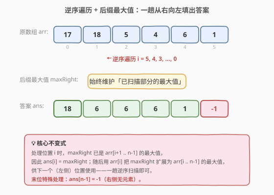

# 将每个元素替换为右侧最大元素

- **题目名称**：将每个元素替换为右侧最大元素
- **链接**：[1299. 将每个元素替换为右侧最大元素](https://leetcode.cn/problems/replace-elements-with-greatest-element-on-right-side/)
- **难度**：简单
- **标签**：数组

## 1. 题目概述

给你一个数组 `arr`，请你将每个元素用它**右边**的最大元素替换；如果是最后一个元素，用 `-1` 替换。完成所有替换操作后，返回这个数组。

**示例 1**：

```text
输入：arr = [17,18,5,4,6,1]
输出：[18,6,6,6,1,-1]
解释：
- 下标 0 的元素 --> 右侧最大元素是 18（下标 1）
- 下标 1 的元素 --> 右侧最大元素是 6（下标 4）
- 下标 2 的元素 --> 右侧最大元素是 6（下标 4）
- 下标 3 的元素 --> 右侧最大元素是 6（下标 4）
- 下标 4 的元素 --> 右侧最大元素是 1（下标 5）
- 下标 5 的元素 --> 右侧无元素，替换为 -1
```

**示例 2**：

```text
输入：arr = [400]
输出：[-1]
解释：下标 0 的元素右侧没有其他元素。
```

**约束条件**：

- $1 \le \text{arr.length} \le 10^4$
- $1 \le \text{arr}[i] \le 10^5$

> 💡 本题题意直白：每个位置要填的是「它**右侧**所有元素的最大值」。关键词是「右侧」——这天然指向**后缀最大值**（suffix max）。末位无右侧元素，约定填 `-1`。

---

## 2. 解题思路

### 2.1 暴力思路：对每个位置向右扫描求最大值

最直觉的做法：对每个下标 `i`，从 `i+1` 扫到末尾，找出最大值填入 `ans[i]`；末位单独填 `-1`。

```python
n = len(arr)
ans = [0] * n
for i in range(n):
    if i == n - 1:
        ans[i] = -1
    else:
        ans[i] = max(arr[i + 1:])  # 每次都对右侧切片求 max
return ans
```

时间 $O(n^2)$、空间 $O(1)$（不计答案数组）。当 $n = 10^4$ 时，$n^2 = 10^8$ 量级，勉强能过但浪费——「右侧最大值」对相邻位置高度重叠，重复计算极多。

> 💡 面试官会追问：「相邻位置的右侧最大值关系密切，能不能复用？」——这就是后缀最大值优化的切入点。

### 2.2 核心观察：逆序遍历 + 后缀最大值



**关键观察**：位置 `i` 的答案是 $\max(\text{arr}[i+1], \text{arr}[i+2], \ldots, \text{arr}[n-1])$，而位置 `i-1` 的答案是 $\max(\text{arr}[i], \text{arr}[i+1], \ldots, \text{arr}[n-1])$——两者只差一个 `arr[i]`。

于是从**右向左**遍历，维护一个变量 `maxRight` 表示「当前已扫描部分（即当前位置右侧）的最大值」：

- 处理位置 `i` 时，`maxRight` 已是 $\max(\text{arr}[i+1..n-1])$，**直接填入** `ans[i] = maxRight`；
- 随后用 `arr[i]` 把 `maxRight` 扩展为 $\max(\text{arr}[i..n-1])$：`maxRight = max(maxRight, arr[i])`，供下一个（左侧）位置使用。

末位 `i = n-1` 的右侧为空，用初始值 `maxRight = -1` 兜底——`ans[n-1] = -1`，之后 `maxRight = max(-1, arr[n-1]) = arr[n-1]`（因为 $\text{arr}[i] \ge 1 > -1$）。

> 💡 **顺序不能颠倒**：必须**先填答案、再更新** `maxRight`。若先更新，`ans[i]` 会把 `arr[i]` 自身算进去，变成「右侧含自身的最大值」，违反题意。这正是「右侧」二字的精髓。

> 💡 **为什么逆序？** 正序遍历时，位置 `i` 的答案依赖尚未扫描的右侧元素，无法即时给出；逆序遍历时，「右侧」恰好等于「已扫描部分」，`maxRight` 自然就是答案——**遍历方向与信息依赖方向对齐**，是此类「后缀型」问题的通用套路。

### 2.3 算法流程图

![算法流程：初始化 maxRight=-1 → 逆序循环 i：ans[i]=maxRight，再 maxRight=max(maxRight,arr[i]) → i-- → 返回 ans](../images/replace_right_max_flow.svg)

**完整步骤**：

1. **初始化**：`maxRight = -1`
2. **逆序循环** `i` 从 `n-1` 到 `0`：
   - `ans[i] = maxRight`（用旧的后缀最大值填答案）
   - `maxRight = max(maxRight, arr[i])`（把当前元素并入后缀最大值）
3. **返回** `ans`

### 2.4 示例演算

以 `arr = [17, 18, 5, 4, 6, 1]` 为例，从右向左逐位执行：

![示例演算：每步的 arr[i]、填前 maxRight、ans[i]、更后 maxRight，最终得 [18,6,6,6,1,-1]](../images/replace_right_max_walkthrough.svg)

| 步 | i | arr[i] | maxRight（填前） | ans[i] | maxRight（更后） |
|----|---|--------|------------------|--------|------------------|
| 1 | 5 | 1 | -1（初始） | **-1** | 1 |
| 2 | 4 | 6 | 1 | **1** | 6 |
| 3 | 3 | 4 | 6 | **6** | 6 |
| 4 | 2 | 5 | 6 | **6** | 6 |
| 5 | 1 | 18 | 6 | **6** | 18 |
| 6 | 0 | 17 | 18 | **18** | 18 |

最终 `ans = [18, 6, 6, 6, 1, -1]`，与示例一致。

> 💡 注意 `maxRight` 从右向左**单调不减**（只取 `max`，不会变小）：`-1 → 1 → 6 → 6 → 6 → 6 → 18 → 18`。每个位置填入的恰是「右侧已见过的最大值」，正中题意。

---

## 3. 参考代码

### C++（独立答案数组）

```cpp
class Solution {
  public:
    vector<int> replaceElements(vector<int>& arr) {
        int n = arr.size();
        vector<int> ans(n);
        int maxRight = -1;
        for (int i = n - 1; i >= 0; --i) {
            ans[i] = maxRight;                       // 先填答案（用旧的后缀最大值）
            maxRight = max(maxRight, arr[i]);        // 再把当前元素并入后缀最大值
        }
        return ans;
    }
};
```

### Python（原地修改版，省去答案数组）

```python
class Solution:
    def replaceElements(self, arr: List[int]) -> List[int]:
        max_right = -1
        for i in range(len(arr) - 1, -1, -1):
            cur = arr[i]                       # 先暂存当前值
            arr[i] = max_right                 # 原地写入答案
            max_right = max(max_right, cur)    # 再更新后缀最大值
        return arr
```

> 💡 **原地版要点**：因为 `arr[i]` 会被答案覆盖，必须先用 `cur` 暂存原值，否则 `max_right` 的更新会读到错误数据。两种写法的核心逻辑完全一致，区别仅在是否复用输入数组作为答案。

---

## 4. 复杂度分析

| 维度 | 复杂度 | 说明 |
|------|--------|------|
| **时间** | $O(n)$ | 从右向左遍历一次，每位一次 `max` 比较，共 $n$ 步 |
| **空间** | $O(1)$ | 仅用一个 `maxRight` 变量（原地版） / $O(n)$（独立答案数组版，不计返回值则为 $O(1)$） |
| **对比暴力** | — | 暴力 $O(n^2)$ / $O(1)$；本解法 $O(n)$ / $O(1)$，时间降一个量级 |

> 💡 当 $n = 10^4$ 时，$O(n)$ 约 $10^4$ 次比较，远优于暴力的 $10^8$ 次。后缀最大值把「每个位置独立向右扫描」的重叠计算合并为「一趟逆序递推」，是典型的**用增量信息消除重复计算**。

---

## 5. 扩展：前缀 / 后缀最值的通用范式

本题是「**后缀最大值**」的招牌题。同一范式可处理一类「每个位置依赖其前缀 / 后缀最值」的问题：

| 变体 | 维护量 | 遍历方向 | 典型问题 |
|------|--------|----------|----------|
| 后缀最大值 | `maxRight` | 从右向左 | **本题 1299**（右侧最大） |
| 前缀最大值 | `maxLeft` | 从左向右 | 接雨水双指针中的左侧最高 |
| 后缀最小值 | `minRight` | 从右向左 | 每日温度 / 下一个更小元素 |
| 前缀乘积 | `prefixProd` | 从左向右 | 除自身以外数组的乘积 |

**通用递推**：维护一个累计变量，遍历方向与「依赖方向」对齐——依赖右侧就从右向左，依赖左侧就从左向右。处理当前位置时先用旧值产出答案，再用当前元素更新累计变量。

> 💡 这与 [238. 除自身以外数组的乘积](https://leetcode.cn/problems/product-of-array-except-self/) 同构：238 维护「左侧乘积」+「右侧乘积」两次扫描，本题只维护「右侧最大值」一次扫描，是更简化的单侧版本。

---

## 6. 面试要点

1. **为什么必须逆序遍历，正序不行吗？**

   > 正序遍历时，位置 `i` 的答案依赖尚未访问的右侧元素，无法即时算出。逆序遍历时，「右侧」恰好等于「已扫描部分」，`maxRight` 即答案——遍历方向与信息依赖方向对齐，是后缀型问题的通用原则。

2. **为什么「先填答案再更新」的顺序不能颠倒？**

   > 若先 `maxRight = max(maxRight, arr[i])` 再 `ans[i] = maxRight`，则 `ans[i]` 会包含 `arr[i]` 自身，变成「右侧含自身的最大值」，违反「右侧」的严格语义。先填后更，保证 `ans[i]` 严格来自位置 `i` 右侧的元素。

3. **末位为什么能用 `maxRight = -1` 初始化统一处理？**

   > 题目约定末位填 `-1`，初始 `maxRight = -1` 使 `ans[n-1] = -1` 自然成立；随后 `maxRight = max(-1, arr[n-1]) = arr[n-1]`（因 $\text{arr}[i] \ge 1 > -1$），无需对末位单独特判，代码更简洁。

4. **原地修改版为什么要暂存 `cur = arr[i]`？**

   > 原地版把答案直接写回 `arr[i]`，会覆盖原值。若不暂存，后续 `max_right = max(max_right, arr[i])` 读到的已是答案而非原始元素，导致后缀最大值计算错误。暂存 `cur` 是「先读后写」的标准做法。

5. **如果改成「右侧第一个更大的元素」而非「右侧最大」，思路一样吗？**

   > 不一样。「右侧最大」只关心最值，用后缀最大值一趟即可；「右侧第一个更大」关心的是**位置**（距离最近的更大元素），需用**单调栈**（见 [739. 每日温度](https://leetcode.cn/problems/daily-temperatures/)）。两者形似神不同：最值问题用累计变量，位置问题用栈。

> 💡 **一句话总结**：1299 是「后缀最大值」入门题——逆序一趟，维护 `maxRight`，先填答案再更新，$O(n)$ / $O(1)$ 搞定。核心是让遍历方向对齐信息依赖方向。

---

## 7. 同类练习题

- [238. 除自身以外数组的乘积](https://leetcode.cn/problems/product-of-array-except-self/)：前缀乘积 + 后缀乘积两次扫描，与本题「后缀最大值」同属前缀/后缀最值范式（单侧→双侧）
- [739. 每日温度](https://leetcode.cn/problems/daily-temperatures/)：求「右侧第一个更大元素的距离」，需单调栈——对照本题「右侧最大值」用累计变量，体会最值问题与位置问题的解法差异
- [1019. 链表中的下一个更大节点](https://leetcode.cn/problems/next-greater-node-in-linked-list/)：链表版「右侧第一个更大」，单调栈；与 739 同类，数据结构换成链表
- [918. 环形子数组的最大和](https://leetcode.cn/problems/maximum-sum-circular-subarray/)：维护前缀最小值求环形最大子数组和，同样是「前缀最值」递推的运用
- [42. 接雨水](https://leetcode.cn/problems/trapping-rain-water/)：双指针版动态维护左侧最高 / 右侧最高，是前缀/后缀最大值在双指针场景下的延伸
