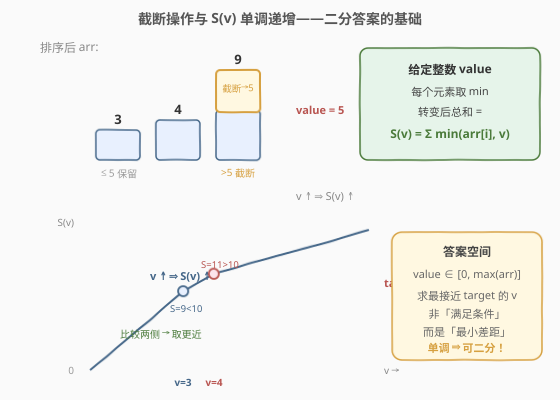
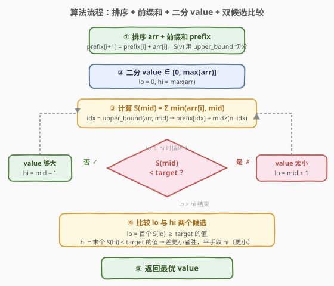

# LeetCode 转变数组后最接近目标值的数组和 题解

## 1. 题目概述

- **标题 / 题号**：转变数组后最接近目标值的数组和（#1300，medium）
- **链接**：https://leetcode.cn/problems/sum-of-mutated-array-closest-to-target/
- **难度**：中等
- **标签**：数组、二分查找、排序、前缀和

**题意**：给你一个整数数组 `arr` 和一个目标值 `target`。请你从数组中选出一个整数 `value`，将数组中所有比 `value` 大的元素变成 `value`（即对每个元素取 $\min(\text{arr}[i], \text{value})$），使得转变后数组的元素和**最接近** `target`。

如果存在多个 `value` 使得和同样接近 `target`，返回**最小的**那个。

**示例 1**：

```text
输入：arr = [4,9,3], target = 10
输出：3
解释：value = 3 时转变数组为 [3,3,3]，和 = 9，差 |9−10| = 1。
     value = 4 时转变数组为 [4,4,3]，和 = 11，差 |11−10| = 1。
     差距相等，取较小的 value = 3。
```

**示例 2**：

```text
输入：arr = [2,3,5], target = 10
输出：5
解释：value = 5 时转变数组为 [2,3,5]，和 = 10，恰好命中 target。
```

**示例 3**：

```text
输入：arr = [60864,25176,27249,21296,20204], target = 56803
输出：11361
```

**约束**：

- `1 <= arr.length <= 10^4`
- `1 <= arr[i] <= 10^5`
- `1 <= target <= 10^5`

> 💡 **关键直觉**：「选一个 `value` 截断所有更大的元素」⇒ 转变后的和 $S(\text{value})$ 是关于 `value` 的**单调不减函数**。求「最接近 target」就是在单调函数上找最接近目标值的点 → 二分答案。但与 [1283](../1201-1300/1283_使结果不超过阈值的最小除数.md)「求满足条件的值」不同，本题是「求最小差距」，需在二分后**比较两个候选**。

## 2. 解题思路

### 2.1 暴力思路

`value` 的有效取值范围是 `[0, max(arr)]`：`value = 0` 时所有元素截断为 `0`，$S = 0$；`value = max(arr)` 时无截断，$S = \sum \text{arr}[i]$；再增大 `value` 不改变 $S$。逐个尝试 `value = 0, 1, ..., max(arr)`，每次 $O(n)$ 计算 $S(\text{value})$，跟踪最接近 `target` 的值。总复杂度 $O(n \cdot \max(\text{arr}))$，而 $\max(\text{arr})$ 可达 $10^5$，$n$ 可达 $10^4$，约 $10^9$ 次运算，超时。

### 2.2 核心观察：二分答案 + 前缀和加速



关键直觉是：**转变后的和 $S(\text{value})$ 关于 `value` 单调不减**。

- `value` 越大，每个 $\min(\text{arr}[i], \text{value})$ 越大（或不变），总和越大。
- `value = 0` 时 $S = 0$；`value = max(arr)` 时 $S = \sum \text{arr}[i]$。

于是存在一个**分界点** $v^*$，使得：

```text
value < v* → S(value) < target   (截断太多，和不够)
value ≥ v* → S(value) ≥ target   (截断够了，和达标或超出)
```

这正是二分查找所需的**二段性**。但本题不是「求满足条件的值」，而是「求最接近 target 的值」——因此二分定位分界点后，还需**比较 $v^*$ 与 $v^* - 1$ 两个候选**的差距，取更近者（平手取较小值）。

**前缀和加速 $S(\text{value})$ 计算**：排序 `arr` 后，对给定 `value`，用 `upper_bound` 找到第一个 `> value` 的位置 `idx`，则：

$$
S(\text{value}) = \text{prefix}[\text{idx}] + \text{value} \times (n - \text{idx})
$$

其中 `prefix[idx]` 是所有 $\le \text{value}$ 的元素之和（保留原值），后面 $n - \text{idx}$ 个元素被截断为 `value`。这样每次计算 $S(\text{value})$ 从 $O(n)$ 降到 $O(\log n)$。

> 💡 **识别信号**：题目求「最接近某目标值」+ 候选值域上的函数单调 ⇒ 想「二分答案 + 双候选比较」。与 [1283. 使结果不超过阈值的最小除数](../1201-1300/1283_使结果不超过阈值的最小除数.md) 同属二分答案家族，但 1283 是「求最小可行值」（单侧收敛），1300 是「求最接近值」（双侧比较）。

> ⚠️ **上界取 `max(arr)` 即可**：当 $\text{value} \ge \max(\text{arr})$，无截断，$S = \sum \text{arr}[i]$ 恒定不变。若 $\sum \text{arr}[i] < \text{target}$，则 $\max(\text{arr})$ 已是最优（再增大 `value` 差距不变但值更大，不取）；若 $\sum \text{arr}[i] \ge \text{target}$，答案必然落在 $[0, \max(\text{arr})]$ 内。

### 2.3 算法流程图



1. 排序 `arr`，构建前缀和 `prefix`，$O(n \log n)$。
2. 在 $\text{value} \in [0, \max(\text{arr})]$ 上二分，`lo = 0`，`hi = max(arr)`。
3. 对每个 `mid`，用 `upper_bound` + 前缀和 $O(\log n)$ 计算 $S(\text{mid})$。
4. $S(\text{mid}) < \text{target}$ → `value` 太小，`lo = mid + 1`；$S(\text{mid}) \ge \text{target}$ → `value` 够大，`hi = mid - 1`。
5. 循环结束后，`lo` = 首个 $S(\text{lo}) \ge \text{target}$ 的值，`hi` = 末个 $S(\text{hi}) < \text{target}$ 的值。比较两者与 `target` 的差距，差距更小者胜；平手取 `hi`（较小值）。

### 2.4 示例演算

![示例演算：arr=[4,9,3], target=10](../images/1300_example_walkthrough.svg)

以 `arr = [4,9,3]`、`target = 10` 为例。排序后 `arr = [3,4,9]`，`prefix = [0,3,7,16]`，$\max = 9$，答案区间 `[0, 9]`：

- **第 1 轮** `[0,9]`，`mid=4`，`upper_bound(arr, 4) = 2`，$S = \text{prefix}[2] + 4 \times 1 = 7 + 4 = 11 \ge 10$ → 够大，`hi = 3`。
- **第 2 轮** `[0,3]`，`mid=1`，`upper_bound(arr, 1) = 0`，$S = 0 + 1 \times 3 = 3 < 10$ → 太小，`lo = 2`。
- **第 3 轮** `[2,3]`，`mid=2`，`upper_bound(arr, 2) = 0`，$S = 0 + 2 \times 3 = 6 < 10$ → 太小，`lo = 3`。
- **第 4 轮** `[3,3]`，`mid=3`，`upper_bound(arr, 3) = 1`，$S = \text{prefix}[1] + 3 \times 2 = 3 + 6 = 9 < 10$ → 太小，`lo = 4`。
- **结束** `lo=4 > hi=3`，进入双候选比较：
  - `lo=4`：$S(4) = 11$，$|11 - 10| = 1$。
  - `hi=3`：$S(3) = 9$，$|10 - 9| = 1$。
  - 差距相等（$1 = 1$）→ 平手取较小值 → **返回 3**。

## 3. 参考代码

### C++

```cpp
class Solution {
  public:
    int findBestValue(vector<int>& arr, int target) {
        sort(arr.begin(), arr.end());
        int n = arr.size();
        vector<long> prefix(n + 1, 0);
        for (int i = 0; i < n; ++i) {
            prefix[i + 1] = prefix[i] + arr[i];
        }

        // S(v) = sum of min(arr[i], v)
        auto S = [&](int v) -> long {
            int idx = upper_bound(arr.begin(), arr.end(), v) - arr.begin();
            return prefix[idx] + (long)v * (n - idx);
        };

        int lo = 0, hi = arr[n - 1];
        while (lo <= hi) {
            int mid = lo + (hi - lo) / 2;
            if (S(mid) < target) {
                lo = mid + 1;
            } else {
                hi = mid - 1;
            }
        }

        // lo = 首个 S(lo) >= target 的值（可能越界）
        // hi = 末个 S(hi) <  target 的值（可能 < 0）
        if (lo > arr[n - 1]) {
            return arr[n - 1];
        }
        if (hi < 0) {
            return 0;
        }
        // 比较两个候选，差距更小者胜；平手取 hi（较小值）
        if (abs(S(lo) - target) < abs(target - S(hi))) {
            return lo;
        }
        return hi;
    }
};
```

### Python

```python
import bisect

class Solution:
    def findBestValue(self, arr: List[int], target: int) -> int:
        arr.sort()
        n = len(arr)
        prefix = [0] * (n + 1)
        for i in range(n):
            prefix[i + 1] = prefix[i] + arr[i]

        def S(v):
            idx = bisect.bisect_right(arr, v)
            return prefix[idx] + v * (n - idx)

        lo, hi = 0, arr[-1]
        while lo <= hi:
            mid = (lo + hi) // 2
            if S(mid) < target:
                lo = mid + 1
            else:
                hi = mid - 1

        if lo > arr[-1]:
            return arr[-1]
        if hi < 0:
            return 0

        if abs(S(lo) - target) < abs(target - S(hi)):
            return lo
        return hi
```

> ⚠️ **两个易错点**：
> 1. **溢出**：$S(\text{value})$ 最大可达 $\sum \text{arr}[i] \le 10^4 \times 10^5 = 10^9$，超过 32 位 `int` 上界（约 $2.1 \times 10^9$，虽勉强不溢出但前缀和累加过程在边界）。C++ 前缀和用 `long` 安全；`S()` 返回 `long`，比较时 `abs` 也作用于 `long`。Python 整数无上限无此问题。
> 2. **平手取较小值**：当 $|S(\text{lo}) - \text{target}| = |\text{target} - S(\text{hi})|$ 时，返回 `hi`（因为 $\text{hi} = \text{lo} - 1 < \text{lo}$，是较小值）。代码中用 `<` 而非 `<=` 判断 `lo` 是否更优，等号时落入 `return hi`，天然处理平手。

## 4. 复杂度分析

| 维度 | 复杂度 | 说明 |
|------|--------|------|
| 时间复杂度 | $O(n \log n + \log M \cdot \log n)$ | 排序 $O(n \log n)$；二分 $O(\log M)$ 次（$M = \max(\text{arr})$），每次 $S(\text{mid})$ 用 `upper_bound` $O(\log n)$ |
| 空间复杂度 | $O(n)$ | 前缀和数组 `prefix` |

> 💡 $n \le 10^4$，$M \le 10^5$，$\log M \approx 17$，$\log n \approx 14$，二分部分约 $17 \times 14 \approx 240$ 次运算，排序约 $10^4 \times 14 \approx 1.4 \times 10^5$，总计远低于时限。若 $S(\text{value})$ 不用前缀和而逐元素 $O(n)$ 计算，则二分部分变为 $O(n \log M) \approx 10^4 \times 17 = 1.7 \times 10^5$，也可通过但不够优雅。

## 5. 扩展：前缀和 + 逐元素计算 S(v) 的对比

本题有两种计算 $S(\text{value})$ 的方式，各有优劣：

| 方式 | 单次 $S(v)$ 复杂度 | 总时间 | 适用场景 |
|------|---------------------|--------|----------|
| **排序 + 前缀和 + upper_bound** | $O(\log n)$ | $O(n \log n + \log M \cdot \log n)$ | $n$ 大、$M$ 大时更优 |
| **排序 + 双指针/逐元素** | $O(n)$ | $O(n \log n + n \log M)$ | $n$ 小或不想写前缀和时更简 |

两种方式的**二分框架完全相同**，仅 `S(v)` 的实现不同。逐元素版：

```python
def S(v):
    return sum(min(x, v) for x in arr)
```

简洁但每次 $O(n)$。在 $n \le 10^4$、$\log M \approx 17$ 时总运算量约 $1.7 \times 10^5$，完全可过。

> 💡 **面试建议**：先写逐元素版讲清思路（二分 + $S(v)$ 单调），再口头提「前缀和 + upper_bound 可将每次 $S(v)$ 降到 $O(\log n)$」展示优化意识。与 [875. 爱吃香蕉的珂珂](../0801-0900/875_爱吃香蕉的珂珂.md) 的 `check()` 对比：875 的 `check` 只能逐元素（除法无前缀和加速），而 1300 的 `min` 截断天然适配排序 + 前缀和。

## 6. 面试要点

1. **为什么能二分？二段性体现在哪？**

   - $S(\text{value}) = \sum \min(\text{arr}[i], \text{value})$ 关于 `value` 单调不减。存在分界点 $v^*$，使 $\text{value} < v^*$ 时 $S < \text{target}$、$\text{value} \ge v^*$ 时 $S \ge \text{target}$。这种「左不够 / 右达标」的结构即二段性，可二分定位 $v^*$。

2. **本题与 1283 最小除数的二分有什么不同？**

   - 1283 是「求满足 $S(d) \le \text{threshold}$ 的最小 $d$」，单侧收敛——找到分界点直接返回，无需比较。1300 是「求 $|S(\text{value}) - \text{target}|$ 最小的 `value`」，双侧比较——二分定位分界点后，还需比较 $v^*$（$S \ge \text{target}$）与 $v^* - 1$（$S < \text{target}$）两个候选的差距，取更近者。

3. **前缀和如何加速 $S(\text{value})$？**

   - 排序后用 `upper_bound(arr, value)` 找到第一个 `> value` 的位置 `idx`。前 `idx` 个元素 $\le \text{value}$ 保留原值，和为 `prefix[idx]`；后 $n - \text{idx}$ 个元素 `> value` 被截断为 `value`，贡献 $\text{value} \times (n - \text{idx})$。总计 $O(\log n)$。

4. **平手时为什么返回较小值？怎么实现？**

   - 题目要求差距相等时返回较小的 `value`。二分结束后 `hi = lo - 1`，故 `hi` 是较小值。判断时用严格 `<`（而非 `<=`）比较 `lo` 的差距是否更小——等号时落入 `return hi`，天然取较小值，无需额外 `if`。

5. **如果 $\sum \text{arr}[i] < \text{target}$ 怎么办？**

   - 此时即使不截断（`value = max(arr)`），$S = \sum \text{arr}[i] < \text{target}$，再增大 `value` 不改变 $S$。二分结束后 `lo > max(arr)`（所有 `mid` 都满足 $S < \text{target}$），返回 `max(arr)`——它是使 $S$ 最大的最小 `value`，差距最小且值最小。

## 同类练习题

| # | 题目 | 与本题的关联 |
|---|------|-------------|
| 1283 | [使结果不超过阈值的最小除数](https://leetcode.cn/problems/find-the-smallest-divisor-given-a-threshold/) | 同二分答案家族，$S(d)$ 单调递减，求「最小可行 $d$」（单侧收敛），对照 1300 的「双侧比较」 |
| 875 | [爱吃香蕉的珂珂](https://leetcode.cn/problems/koko-eating-bananas/) | 二分答案经典，$S(k)$ 单调递减，求最小可行吃速，与 1283 同构、与 1300 同源 |
| 1011 | [在 D 天内送达包裹的能力](https://leetcode.cn/problems/capacity-to-ship-packages-within-d-days/) | 二分答案 + 贪心验证，`check` 是状态机式累加，对照 1300 的数学求和式 `S(v)` |
| 410 | [分割数组的最大值](https://leetcode.cn/problems/split-array-largest-sum/) | 二分答案 + 贪心划分，求「最小的最大子数组和」，二分方向与 1283 一致 |
| 2064 | [分配给商店的最小商品数量](https://leetcode.cn/problems/minimized-maximum-of-products-distributed-to-any-store/) | 二分答案求最小化最大值，`check` 统计所需商店数，扩展二分答案的 `check` 变体 |
