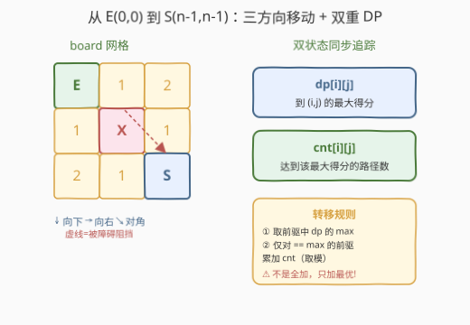
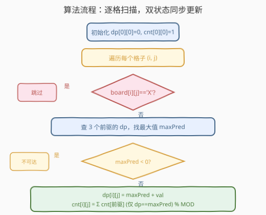

# 最大得分的路径数目

- **题目名称**：最大得分的路径数目
- **链接**：[1301. 最大得分的路径数目](https://leetcode.cn/problems/number-of-paths-with-max-score/)
- **难度**：困难
- **标签**：动态规划、网格 DP、计数

## 1. 题目概述

给你一个正方形字符数组 `board`，你从数组最右下方的字符 `'S'` 出发，目标是到达数组最左上角的字符 `'E'`。数组剩余部分为数字字符 `1, 2, ..., 9` 或者障碍 `'X'`。每一步可以**向上、向左或左上方**移动，前提是到达的格子没有障碍。

一条路径的「得分」定义为路径上所有数字的**和**。返回一个列表 `[最大得分, 达到最大得分的路径数]`，路径数对 $10^9 + 7$ 取余。若没有任何路径可以到达终点，返回 `[0, 0]`。

**示例 1**：

```text
输入：board = ["E23","2X2","12S"]
输出：[7,1]

  E 2 3
  2 X 2
  1 2 S
最优路径：E→2→3→2→S，得分 2+3+2=7，仅 1 条
```

**示例 2**：

```text
输入：board = ["E12","1X1","21S"]
输出：[4,2]

  E 1 2
  1 X 1
  2 1 S
最优路径①：E→1→2→1→S，得分 1+2+1=4
最优路径②：E→1→2→1→S，得分 1+2+1=4
两条路径得分相同，均为 4
```

**示例 3**：

```text
输入：board = ["E11","XXX","11S"]
输出：[0,0]

  E 1 1
  X X X    ← 中间整行被障碍堵死，无法到达 S
  1 1 S
```

**约束条件**：

- `2 <= board.length == board[i].length <= 100`
- `board[0][0] = 'E'`，`board[n-1][n-1] = 'S'`，其余为 `'1'`–`'9'` 或 `'X'`

> 💡 本题是**网格 DP + 计数**的招牌题，融合了 [62. 不同路径](../0001-0100/62_不同路径.md) 的路径计数与 [64. 最小路径和](../0001-0100/64_最小路径和.md) 的路径最值优化，并在此基础上增加了「**只对最优路径计数**」这一关键约束。核心难点在于：多个前驱到达当前格子时，得分取 `max` 而非累加，路径数**仅对取得 max 的前驱**累加——与 [673. 最长递增子序列的个数](../0601-0700/673_最长递增子序列的个数.md) 同属「**max-count 双追踪 DP**」范式。

---

## 2. 解题思路

### 2.1 暴力思路：DFS 枚举所有路径

从 `'S'` 出发，递归尝试向上、向左、左上方三个方向，到达 `'E'` 时记录得分。遍历所有合法路径后，找最大得分及其出现次数。但 `n ≤ 100` 时路径数指数爆炸（每步 3 选 1，最多约 200 步），完全不可行。

### 2.2 核心观察：方向翻转 + 双状态网格 DP



**关键转化**：题目说「从 S 向上/向左/左上方走到 E」，但路径是**可逆的**——一条 S→E 的路径反转后就是 E→S 的路径，得分不变。因此我们等价地**从 E(0,0) 出发，向下/向右/右下方移动到 S(n-1,n-1)**，这样 DP 的填表顺序天然从左上到右下，依赖关系清晰。

**双状态定义**：

| 状态 | 含义 | 初始值 |
|------|------|--------|
| `dp[i][j]` | 从 `(0,0)` 到 `(i,j)` 的**最大得分**，`-1` 表示不可达 | `dp[0][0] = 0`（E 贡献 0 分） |
| `cnt[i][j]` | 达到 `dp[i][j]` 的**路径数** | `cnt[0][0] = 1` |

> ⚠️ **为什么需要两个状态？** 普通网格 DP 只求最值（如 64 最小路径和）或只求计数（如 62 不同路径），一个 `dp` 足矣。本题**同时要求最大得分和达到该得分的路径数**，必须在求最值的同时同步追踪计数——这正是「max-count 双追踪」模式的核心。

**转移方程**（对每个非障碍格子 `(i,j)`）：

```text
前驱集合：P = {(i-1,j), (i,j-1), (i-1,j-1)} 中 dp ≥ 0 的格子

若 P 为空：dp[i][j] = -1, cnt[i][j] = 0        # 不可达

否则：
    maxPred = max{ dp[p] : p ∈ P }               # 前驱中的最大得分
    dp[i][j]  = maxPred + val(i,j)               # val = 数字字符的值，E/S 为 0
    cnt[i][j] = Σ cnt[p]  (仅对 dp[p] == maxPred 的 p) % MOD   # 只加最优前驱的路径数
```

> 💡 **关键细节**：`cnt` 不是对所有前驱求和，而是**仅对 `dp == maxPred` 的前驱**求和。非最优前驱的路径被自然淘汰——它们到达当前格子的得分不是最大的，不参与最终答案的计数。这与 673「最长递增子序列的个数」的转移逻辑完全一致。

### 2.3 算法流程图



**完整步骤**：

1. **初始化**：`dp[0][0] = 0`，`cnt[0][0] = 1`（起点 E，得分 0，1 条路径）。其余 `dp` 默认 `-1`（不可达），`cnt` 默认 0。
2. **逐行从左到右扫描**：对每个格子 `(i, j)`：
   - 若 `board[i][j] == 'X'` → 跳过（障碍不可通行）
   - 计算格子值 `val`：数字字符取对应数值，`'E'`/`'S'` 取 0
   - 查三个前驱 `(i-1,j)`、`(i,j-1)`、`(i-1,j-1)` 中 `dp ≥ 0` 的，取最大值 `maxPred`
   - 若无前驱可达 → `dp[i][j] = -1`，跳过
   - 否则：`dp[i][j] = maxPred + val`，`cnt[i][j]` = 所有 `dp[p] == maxPred` 的前驱 `cnt[p]` 之和（取模）
3. **返回**：若 `dp[n-1][n-1] < 0`，返回 `[0, 0]`；否则返回 `[dp[n-1][n-1], cnt[n-1][n-1]]`

> 💡 **填表顺序保证**：逐行从上到下、行内从左到右扫描，保证查 `(i-1,j)`（上方）、`(i,j-1)`（左方）、`(i-1,j-1)`（左上方）时三者均已算好。

### 2.4 示例演算

以 `board = ["E12","1X1","21S"]` 为例（示例 2）：

![示例演算：E12/1X1/21S 的 dp 和 cnt 填表，最终 dp[2][2]=4, cnt[2][2]=2](../images/maxpaths_walkthrough.svg)

**dp 表**（行 = 起点 `i`，列 = 终点 `j`；`−` 表示不可达）：

| `i\j` | 0 | 1 | 2 |
|-------|---|---|---|
| 0 | 0 | 1 | 3 |
| 1 | 1 | − | 4 |
| 2 | 3 | 4 | **4** |

**cnt 表**：

| `i\j` | 0 | 1 | 2 |
|-------|---|---|---|
| 0 | 1 | 1 | 1 |
| 1 | 1 | 0 | 1 |
| 2 | 1 | 1 | **2** |

**关键填表步骤**：

| 格子 | 值 | 前驱 | maxPred | dp | cnt | 说明 |
|------|----|------|---------|----|-----|------|
| `(0,1)` | 1 | `(0,0)` dp=0 | 0 | 1 | 1 | 从 E 向右走 1 步 |
| `(0,2)` | 2 | `(0,1)` dp=1 | 1 | 3 | 1 | 继续向右 |
| `(1,0)` | 1 | `(0,0)` dp=0 | 0 | 1 | 1 | 从 E 向下走 1 步 |
| `(1,1)` | — | — | — | − | 0 | `'X'` 障碍，跳过 |
| `(1,2)` | 1 | `(0,2)` dp=3, `(0,1)` dp=1 | 3 | 4 | 1 | 只有 `(0,2)` 最优，cnt 继承 |
| `(2,0)` | 2 | `(1,0)` dp=1 | 1 | 3 | 1 | 向下走 |
| `(2,1)` | 1 | `(2,0)` dp=3, `(1,0)` dp=1 | 3 | 4 | 1 | 只有 `(2,0)` 最优 |
| `(2,2)` | 0 | `(2,1)` dp=4, `(1,2)` dp=4 | **4** | **4** | **2** | 两个前驱 dp 相等！cnt = 1+1 = 2 ✓ |

最终 `[dp[2][2], cnt[2][2]] = [4, 2]`，与示例输出一致。

> 💡 **`(2,2)` 是本题精髓**：两个前驱 `(2,1)` 和 `(1,2)` 的 `dp` 都等于 4（都最优），所以 `cnt` = 两个前驱的 `cnt` 之和 = 1 + 1 = 2。若其中一个 `dp` 为 3（非最优），则不会被计入 `cnt`——这正是「只对最优路径计数」的体现。

---

## 3. 参考代码

### C++

```cpp
// 最大得分的路径数目.cpp —— 网格 DP + 计数（max-count 双追踪）
// 编译: g++ -O2 -std=c++17 最大得分的路径数目.cpp -o maxpaths
class Solution {
public:
    vector<int> pathwaysWithMaxScore(vector<string>& board) {
        int n = board.size();
        int MOD = 1e9 + 7;

        vector<vector<int>> dp(n, vector<int>(n, -1));
        vector<vector<int>> cnt(n, vector<int>(n, 0));

        dp[0][0] = 0;
        cnt[0][0] = 1;

        int dirs[3][2] = {{-1, 0}, {0, -1}, {-1, -1}};

        for (int i = 0; i < n; i++) {
            for (int j = 0; j < n; j++) {
                if (board[i][j] == 'X') continue;
                if (i == 0 && j == 0) continue;

                int val = 0;
                if (isdigit(board[i][j])) val = board[i][j] - '0';

                int maxPred = -1;
                for (auto& d : dirs) {
                    int pi = i + d[0], pj = j + d[1];
                    if (pi >= 0 && pj >= 0 && dp[pi][pj] >= 0) {
                        maxPred = max(maxPred, dp[pi][pj]);
                    }
                }

                if (maxPred < 0) continue;

                dp[i][j] = maxPred + val;
                for (auto& d : dirs) {
                    int pi = i + d[0], pj = j + d[1];
                    if (pi >= 0 && pj >= 0 && dp[pi][pj] == maxPred) {
                        cnt[i][j] = (cnt[i][j] + cnt[pi][pj]) % MOD;
                    }
                }
            }
        }

        if (dp[n - 1][n - 1] < 0) return {0, 0};
        return {dp[n - 1][n - 1], cnt[n - 1][n - 1]};
    }
};
```

### Python

```python
class Solution:
    def pathwaysWithMaxScore(self, board: List[str]) -> List[int]:
        n = len(board)
        MOD = 10**9 + 7

        dp = [[-1] * n for _ in range(n)]
        cnt = [[0] * n for _ in range(n)]

        dp[0][0] = 0
        cnt[0][0] = 1

        for i in range(n):
            for j in range(n):
                if board[i][j] == 'X':
                    continue
                if i == 0 and j == 0:
                    continue

                val = int(board[i][j]) if board[i][j].isdigit() else 0

                max_pred = -1
                for pi, pj in [(i - 1, j), (i, j - 1), (i - 1, j - 1)]:
                    if pi >= 0 and pj >= 0 and dp[pi][pj] >= 0:
                        max_pred = max(max_pred, dp[pi][pj])

                if max_pred < 0:
                    continue

                dp[i][j] = max_pred + val
                for pi, pj in [(i - 1, j), (i, j - 1), (i - 1, j - 1)]:
                    if pi >= 0 and pj >= 0 and dp[pi][pj] == max_pred:
                        cnt[i][j] = (cnt[i][j] + cnt[pi][pj]) % MOD

        if dp[n - 1][n - 1] < 0:
            return [0, 0]
        return [dp[n - 1][n - 1], cnt[n - 1][n - 1]]
```

> 💡 **实现细节**：① 用 `-1` 表示不可达（`dp` 初始全 `-1`），天然区分「可达但得分 0」与「不可达」。② `cnt` 在累加时取模，避免大数溢出。③ `dp` 值最大约 $9 \times (2n-1) \approx 1800$（`n=100`），远无溢出风险，比较 `dp[p] == maxPred` 无需取模。④ `val` 对 `'E'`/`'S'` 取 0，对数字字符取数值——用 `isdigit` 判断即可。

---

## 4. 复杂度分析

| 维度 | 复杂度 | 说明 |
|------|--------|------|
| **时间** | $O(n^2)$ | 双重循环遍历 $n \times n$ 个格子，每格查 3 个前驱 $O(1)$ 转移 |
| **空间** | $O(n^2)$ | 两个 $n \times n$ 矩阵 `dp` 和 `cnt`，`n=100` 时约 80KB |

> ⚠️ 时间 $O(n^2)$：`n=100` 时约 $10^4$ 次操作，远在限制内。空间可优化为 $O(n)$（滚动数组），但 `n=100` 时无必要。

---

## 5. 扩展：滚动数组优化

`dp[i][j]` 和 `cnt[i][j]` 只依赖上一行（`i-1`）和当前行左侧（`j-1`），可用**滚动数组**将空间从 $O(n^2)$ 压缩到 $O(n)$：

```python
class Solution:
    def pathwaysWithMaxScore(self, board: List[str]) -> List[int]:
        n = len(board)
        MOD = 10**9 + 7

        dp_prev = [-1] * n
        cnt_prev = [0] * n
        dp_prev[0] = 0
        cnt_prev[0] = 1

        for i in range(n):
            dp_cur = [-1] * n
            cnt_cur = [0] * n
            for j in range(n):
                if board[i][j] == 'X':
                    continue
                if i == 0 and j == 0:
                    dp_cur[0] = 0
                    cnt_cur[0] = 1
                    continue

                val = int(board[i][j]) if board[i][j].isdigit() else 0

                max_pred = -1
                for pi, pj in [(i - 1, j), (i, j - 1), (i - 1, j - 1)]:
                    if pi < 0 or pj < 0 or pj >= n:
                        continue
                    pred_dp = dp_prev[pj] if pi == i - 1 else dp_cur[pj]
                    if pred_dp >= 0:
                        max_pred = max(max_pred, pred_dp)

                if max_pred < 0:
                    continue

                dp_cur[j] = max_pred + val
                for pi, pj in [(i - 1, j), (i, j - 1), (i - 1, j - 1)]:
                    if pi < 0 or pj < 0 or pj >= n:
                        continue
                    pred_dp = dp_prev[pj] if pi == i - 1 else dp_cur[pj]
                    if pred_dp == max_pred:
                        pred_cnt = cnt_prev[pj] if pi == i - 1 else cnt_cur[pj]
                        cnt_cur[j] = (cnt_cur[j] + pred_cnt) % MOD

            dp_prev = dp_cur
            cnt_prev = cnt_cur

        if dp_prev[n - 1] < 0:
            return [0, 0]
        return [dp_prev[n - 1], cnt_prev[n - 1]]
```

> ⚠️ 滚动数组需小心区分前驱来源：`(i-1,j)` 和 `(i-1,j-1)` 来自上一行（`dp_prev`），`(i,j-1)` 来自当前行（`dp_cur`，已算好）。代码可读性下降，`n ≤ 100` 时推荐用原始 $O(n^2)$ 版本。

---

## 6. 面试要点

1. **为什么可以把 S→E 翻转为 E→S？**

   > 路径得分是路径上数字之和，与遍历方向无关。S→E 的一条合法路径反转后就是 E→S 的一条合法路径（上↔下、左↔右、左上↔右下），得分完全相同。翻转为 E→S 后，DP 填表顺序从左上到右下，依赖关系清晰自然。

2. **`dp` 和 `cnt` 的转移关系是什么？**

   > `dp[i][j]` = 三个前驱中最大 `dp` + 当前格子的值。`cnt[i][j]` = 所有 `dp == maxPred` 的前驱的 `cnt` 之和（取模）。关键：`cnt` 只累加最优前驱，非最优前驱的路径被淘汰。

3. **为什么 `cnt` 只对 `dp == maxPred` 的前驱求和，而不是全部？**

   > 题目问的是「达到**最大**得分的路径数」。若某前驱 `dp` 不是最大的，经它到达当前格的得分必然不是最大的（因为 `dp[i][j] = maxPred + val`，非最优前驱的 `dp < maxPred`，算出的得分更小）。这些路径不可能是最终最优路径的一部分，所以不计入 `cnt`。

4. **如何处理障碍和不可达？**

   > `board[i][j] == 'X'` 时直接跳过，`dp` 保持 `-1`、`cnt` 保持 0。若某格子的所有前驱都不可达（`maxPred < 0`），则该格子也不可达。最终 `dp[n-1][n-1] < 0` 时返回 `[0, 0]`。

5. **与 62 不同路径、64 最小路径和的联系与区别？**

   > 62 只计数（无权值，所有路径等权），单状态 `cnt` 即可。64 只求最值（路径和最小），单状态 `dp` 即可。本题**同时要求最大得分和对应路径数**，必须双状态 `dp + cnt` 同步追踪，且 `cnt` 的累加受 `dp` 最优性约束——这是 max-count 双追踪模式的标志特征，与 673 最长递增子序列的个数同构。

> 💡 **一句话总结**：1301 是「max-count 双追踪网格 DP」的招牌题——`dp` 求最大得分、`cnt` 追踪最优路径数，转移时取前驱 `dp` 的 `max` 并仅对最优前驱累加 `cnt`。方向翻转（S→E 变 E→S）让填表顺序自然，`-1` 标记不可达简洁区分障碍与零分。与 62/64 同属网格 DP 家族，与 673 同属 max-count 双追踪范式。

---

## 7. 同类练习题

- [62. 不同路径](https://leetcode.cn/problems/unique-paths/)（[题解](../0001-0100/62_不同路径.md)）：网格 DP 纯计数模板，无权值无障碍，单状态 `cnt` 即可，是本题的计数基础
- [64. 最小路径和](https://leetcode.cn/problems/minimum-path-sum/)（[题解](../0001-0100/64_最小路径和.md)）：网格 DP 求路径最值模板，单状态 `dp` 取 `min`，是本题的最值优化基础
- [673. 最长递增子序列的个数](https://leetcode.cn/problems/number-of-longest-increasing-subsequence/)（[题解](../0601-0700/673_最长递增子序列的个数.md)）：max-count 双追踪 DP 的另一经典，`dp` 求最长长度、`cnt` 求最长序列个数，转移逻辑与本题同构
- [63. 不同路径 II](https://leetcode.cn/problems/unique-paths-ii/)：62 加障碍版，练习障碍处理逻辑
- [174. 地下城游戏](https://leetcode.cn/problems/dungeon-game/)（[题解](../0101-0200/174_地下城游戏.md)）：反向网格 DP，状态定义决定子结构，与本题方向翻转思想呼应
