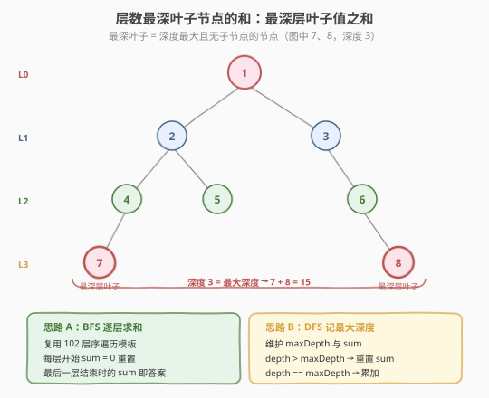
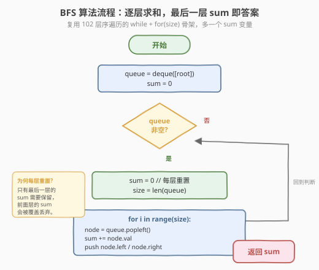
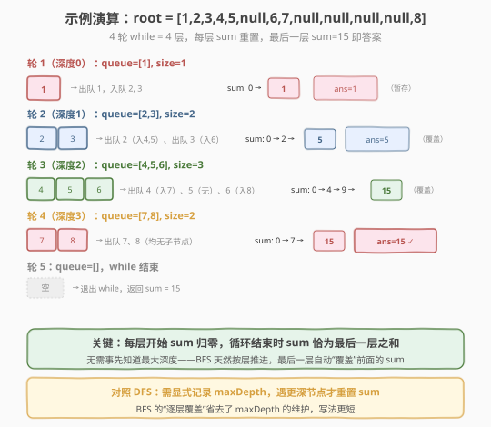

# 层数最深叶子节点的和

- **题目名称**：层数最深叶子节点的和
- **链接**：[1302. 层数最深叶子节点的和](https://leetcode.cn/problems/deepest-leaves-sum/)
- **难度**：中等
- **标签**：树、二叉树、广度优先搜索（BFS）、深度优先搜索（DFS）

## 1. 题目概述

给你一棵二叉树的根节点 `root`，请返回**最深层叶子节点之和**。

**最深层叶子节点**：深度最大（离根最远）的那些叶子节点（无左右子节点）。深度从 0 开始计（根节点深度为 0）。

**示例 1**：

```text
输入：root = [1,2,3,4,5,null,6,7,null,null,null,null,8]
            1
          /   \
         2     3
        / \     \
       4   5     6
      /           \
     7             8
输出：15
解释：最深层叶子是 7 和 8（深度 3），和为 7 + 8 = 15。
```

**示例 2**：

```text
输入：root = [6,7,8,2,7,1,3,9,null,1,4,null,null,null,5]
输出：19
解释：最深层叶子是 9、1、4、5（深度 3），和为 9 + 1 + 4 + 5 = 19。
```

**约束条件**：

- 树中节点数目在范围 `[1, 10^4]` 内
- `1 <= Node.val <= 100`

> 💡 本题是 [102. 二叉树的层序遍历](../0101-0200/102_二叉树的层序遍历.md) 的直接延伸：层序遍历按层推进，**最后一层恰好就是最深层**。只需在每层开始时把累加和 `sum` 归零，循环结束时 `sum` 自动是最后一层之和——无需事先知道树的最大深度。这就是 BFS「逐层覆盖」的妙处。

---

## 2. 解题思路

### 2.1 暴力思路：两遍 DFS

第一遍 DFS 求出树的最大深度 `maxDepth`；第二遍 DFS 再遍历一次，把所有深度等于 `maxDepth` 的叶子节点值累加。

```text
maxDepth = getDepth(root)         // 第一遍：求最大深度
sum = 0
dfs(node, depth):
    if node == null: return
    if depth == maxDepth and node 是叶子: sum += node.val
    dfs(node.left, depth+1)
    dfs(node.right, depth+1)
```

正确但需**两遍遍历**，且要显式维护 `maxDepth`。其实只需一遍就能搞定——BFS 的「逐层」语义天然给出答案。

### 2.2 核心观察：BFS 逐层求和，最后一层即答案



**关键观察**：层序遍历（BFS）按层从浅到深处理节点，**最后一层就是最深层**。如果我们每处理一层就把累加和 `sum` 重置为 0、把该层节点值累加进去，那么循环结束时 `sum` 恰好就是最后一层（最深层）的节点值之和——而最深层节点必然都是叶子（没有更深的子层了），正符合题意。

```text
sum = 0
while queue 非空:
    sum = 0                       // ① 每层重置
    size = queue.length           // ② 当前层节点数快照
    for i in 0..size:
        node = queue.pop_front()
        sum += node.val           // ③ 累加本层
        if node.left:  queue.push_back(node.left)
        if node.right: queue.push_back(node.right)
return sum                         // ④ 最后一层 sum 即答案
```

> 💡 **为什么最深层节点一定是叶子？** 若某节点有子节点，它的子节点深度更大，会出现在更下一层——因此「最深层」的节点不可能有子节点，必然是叶子。这保证了「最后一层之和」与「最深层叶子之和」完全等价，无需额外判叶子。

> ⚠️ **为什么每层重置 `sum` 而不是只累加最后一层？** 因为我们事先不知道哪一层是最后一层。重置策略让前面层的 `sum` 被「覆盖丢弃」，循环结束时 `sum` 自动落在最后一层——这是一种「无脑覆盖」的优雅写法，省去了记录层数/判断是否为最后一层的开销。

### 2.3 算法流程图



**完整步骤**：

1. **特判**：题目保证节点数 ≥ 1，无需处理空树（若需健壮可加 `if not root: return 0`）
2. **初始化**：`queue = [root]`，`sum = 0`
3. **while 队列非空**：
   - `sum = 0`（每层重置）
   - `size = len(queue)`（当前层节点数快照）
   - `for i in 0..size`：
     - `node = queue.pop_front()`
     - `sum += node.val`
     - 子节点入队：`if node.left: queue.push_back(node.left)`；`if node.right: queue.push_back(node.right)`
4. **返回** `sum`（最后一层之和）

### 2.4 示例演算

以示例 1 的树 `[1,2,3,4,5,null,6,7,null,null,null,null,8]` 为例：



| 轮次 | 深度 | 队列初始 | size | 出队节点 | sum 变化 | 本层 ans |
|------|------|----------|------|----------|----------|----------|
| 1 | 0 | [1] | 1 | 1 | 0 → 1 | 1 |
| 2 | 1 | [2,3] | 2 | 2 → 3 | 0 → 2 → 5 | 5 |
| 3 | 2 | [4,5,6] | 3 | 4 → 5 → 6 | 0 → 4 → 9 → 15 | 15 |
| 4 | 3 | [7,8] | 2 | 7 → 8 | 0 → 7 → 15 | **15** ✓ |
| 5 | — | [] | — | 队列空，结束 | — | — |

最终 `sum = 15`。注意每轮 `sum` 都从 0 重新累加，前几轮的 `1`、`5`、`15` 都被覆盖丢弃，只有最后一层的 `15` 留到返回。

> 💡 **`size` 快照的作用**（承接 [102](../0101-0200/102_二叉树的层序遍历.md)）：for 循环体里会入队子节点，队列长度会变。提前固定 `size` 锁定当前层边界，保证每轮 for 恰好处理一层、`sum` 恰好累加一层的节点值。

---

## 3. 参考代码

### C++

```cpp
// 层数最深叶子节点的和.cpp —— BFS 逐层求和
// 编译: g++ -O2 -std=c++17 层数最深叶子节点的和.cpp -o deepest
#include <vector>
#include <queue>
using namespace std;

struct TreeNode {
    int val;
    TreeNode* left;
    TreeNode* right;
    TreeNode() : val(0), left(nullptr), right(nullptr) {
    }
    TreeNode(int x) : val(x), left(nullptr), right(nullptr) {
    }
    TreeNode(int x, TreeNode* l, TreeNode* r) : val(x), left(l), right(r) {
    }
};

class Solution {
  public:
    int deepestLeavesSum(TreeNode* root) {
        int sum = 0;
        queue<TreeNode*> q;
        q.push(root);

        while (!q.empty()) {
            sum = 0;                          // ① 每层重置
            int size = q.size();              // ② 当前层节点数快照
            for (int i = 0; i < size; ++i) {  // ③ 恰好处理一整层
                TreeNode* node = q.front();
                q.pop();
                sum += node->val;
                if (node->left)  q.push(node->left);
                if (node->right) q.push(node->right);
            }
        }
        return sum;                           // ④ 最后一层 sum 即答案
    }
};
```

### Python

```python
from collections import deque

class Solution:
    def deepestLeavesSum(self, root: TreeNode | None) -> int:
        queue = deque([root])
        total = 0

        while queue:
            total = 0                         # 每层重置
            size = len(queue)                 # 当前层节点数
            for _ in range(size):             # 恰好处理一整层
                node = queue.popleft()
                total += node.val
                if node.left:
                    queue.append(node.left)
                if node.right:
                    queue.append(node.right)

        return total                          # 最后一层之和
```

> 💡 **实现细节**：① 变量名用 `total` 而非 `sum`，避免与 Python 内建 `sum()` 冲突。② 用 `collections.deque`，`popleft()` 是 `O(1)`；若用 `list.pop(0)` 会退化到 `O(n)`。③ 题目保证节点数 ≥ 1，无需判空树；若想健壮可在开头加 `if not root: return 0`。

---

## 4. 复杂度分析

| 维度 | BFS（推荐） | DFS 单遍 | 两遍 DFS（暴力） |
|------|------------|----------|------------------|
| **时间** | $O(n)$ | $O(n)$ | $O(n)$ |
| **空间** | $O(n)$（队列存一层） | $O(h)$（递归栈） | $O(h)$ |
| **是否需 maxDepth** | 否，逐层覆盖 | 是，需显式维护 | 是，先求再筛 |

> ⚠️ **空间对比**：BFS 队列最多存一整层节点，满二叉树最后一层约 $n/2$ 个 → $O(n)$；DFS 递归栈深度为树高 $h$，平衡树 $O(\log n)$，退化为链表 $O(n)$。本题 $n \leq 10^4$，两种空间都完全可接受。BFS 牺牲一点空间换取「无需维护 maxDepth」的简洁。

---

## 5. 扩展：DFS 单遍记录最大深度与累加和

若面试官要求 $O(h)$ 空间（如树退化为链表时 BFS 队列仍 $O(n)$），可用 DFS 一遍搞定：维护当前见到的最大深度 `maxDepth` 与对应累加和 `sum`，遍历时按深度分三种情况更新。

```python
class Solution:
    def deepestLeavesSum(self, root: TreeNode | None) -> int:
        max_depth = -1
        total = 0

        def dfs(node: TreeNode | None, depth: int) -> None:
            nonlocal max_depth, total
            if not node:
                return
            if depth > max_depth:        # 发现更深层 → 重置
                max_depth = depth
                total = node.val
            elif depth == max_depth:     # 等深层 → 累加
                total += node.val
            # depth < max_depth：更浅层，忽略
            dfs(node.left, depth + 1)
            dfs(node.right, depth + 1)

        dfs(root, 0)
        return total
```

**三种深度的处理**：

| 情况 | 操作 | 含义 |
|------|------|------|
| `depth > max_depth` | `max_depth = depth; sum = node.val` | 发现新的最深层，之前的累加全部作废，从此层重新开始 |
| `depth == max_depth` | `sum += node.val` | 同属当前最深层，累加 |
| `depth < max_depth` | 不处理 | 更浅层节点，对最深层之和无贡献 |

> 💡 **BFS vs DFS 选型**：求「最深层之和」这类**按层聚合**问题，BFS 更直观（逐层覆盖天然得最后一层）；DFS 的优势在空间（递归栈 $O(h)$）。本题两种都是 $O(n)$ 时间，面试推荐先讲 BFS（承接 102 模板、写法最短），再点出 DFS 的空间优化展示思维广度。

---

## 6. 面试要点

1. **为什么 BFS 循环结束时 `sum` 恰好是最深层之和？**

   > 每层开始时 `sum` 重置为 0 并累加该层节点值，前几层的 `sum` 都被「覆盖丢弃」。while 循环处理完最后一层后队列变空退出，此时 `sum` 保留了最后一层的累加值。而最深层节点必然是叶子（有子节点则其子节点更深），故「最后一层之和」即「最深层叶子之和」。

2. **`size = len(queue)` 这行为什么不能省？**

   > for 循环体里会入队子节点，队列长度动态变化。若不固定 `size`，for 会跨层处理，把下一层节点值也累加进当前层 `sum`，导致结果错误。`size` 快照锁定当前层边界，保证每轮 for 恰好累加一层。这是承接 [102 层序遍历](../0101-0200/102_二叉树的层序遍历.md) 的核心技巧。

3. **BFS 和 DFS 各适合什么场景？本题选哪个？**

   > BFS 适合「按层/按距离」聚合（层序遍历、最短步数、本题按层求和）；DFS 适合「连通性/路径枚举/深度依赖」。本题求最深层之和属按层聚合，BFS 写法最短、语义最贴切。若面试官追问空间，DFS 递归栈 $O(h)$ 比 BFS 队列 $O(n)$ 更省（退化链表时差异最大）。

4. **DFS 单遍解法中，遇到更深层节点为什么要重置 `sum`？**

   > `sum` 始终代表「当前已知最深层」的累加和。一旦发现更深的节点，之前累加的最深层作废，必须从新层重新开始累加，所以 `sum = node.val`（重置为该节点值）。若不重置，会把不同深度的叶子混算在一起，结果错误。

5. **如何求「最深层叶子的个数」或「最深层最左/最右节点」？**

   > 个数：BFS 每层不累加值而是计数，最后一层的 `count` 即最深层叶子数。最左/最右：每层 for 循环中，第一个出队的记为最左、最后一个记为最右（[199. 二叉树右视图](https://leetcode.cn/problems/binary-tree-right-side-view/) 即取每层最右）。同一套 `while + for(size)` 骨架可迁移到多种「按层聚合」问题。

> 💡 **一句话总结**：1302 是 [102 层序遍历](../0101-0200/102_二叉树的层序遍历.md) 模板的最小增量应用——只需多一个每层重置的 `sum` 变量，循环结束即得最深层叶子之和。核心是 BFS「逐层覆盖」省去了 maxDepth 的维护。掌握这套 `while + for(size)` 骨架，层序求和、按层计数、每层最值等问题都能一模板打通。

---

## 7. 同类练习题

- [102. 二叉树的层序遍历](https://leetcode.cn/problems/binary-tree-level-order-traversal/)（[题解](../0101-0200/102_二叉树的层序遍历.md)）：BFS `while + for(size)` 母题，本题的直接模板来源
- [104. 二叉树的最大深度](https://leetcode.cn/problems/maximum-depth-of-binary-tree/)（[题解](../0101-0200/104_二叉树的最大深度.md)）：求树高，DFS 解法的 `maxDepth` 维护基础
- [107. 二叉树的层序遍历 II](https://leetcode.cn/problems/binary-tree-level-order-traversal-ii/)（[题解](../0101-0200/107_二叉树的层序遍历II.md)）：自底向上层序，BFS 变体练手
- [1161. 最大层内元素和](https://leetcode.cn/problems/maximum-level-sum-of-a-binary-tree/)：层序遍历求每层和的最大值，与本题同为「按层聚合」，从「取最后一层」换成「取最大层」
- [199. 二叉树右视图](https://leetcode.cn/problems/binary-tree-right-side-view/)：BFS 取每层最右节点，同一套层序骨架的不同聚合目标
