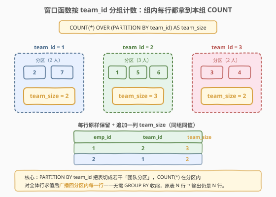
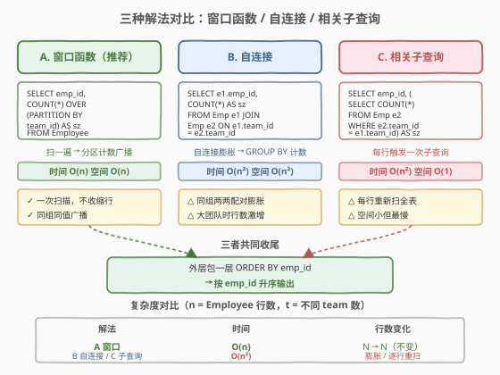
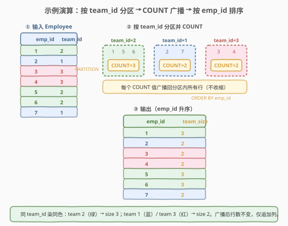

# LeetCode 求团队人数 题解

## 1. 题目概述

- **标题 / 题号**：求团队人数（#1303，easy）
- **链接**：https://leetcode.cn/problems/find-the-team-size/
- **难度**：简单
- **标签**：数据库、SQL、窗口函数、PARTITION BY、COUNT、自连接

**题意**：给定 `Employee` 表，每行记录一名员工的 `emp_id` 及其所属团队 `team_id`。编写 SQL 查询，为**每个员工**返回其所在团队的人数 `team_size`，结果按 `emp_id` 升序排列。

> ⚠️ 关键点：输出行数必须等于输入行数——每个员工都要占一行，**不能像 `GROUP BY` 那样按团队收缩成一行**。这恰好是窗口函数「聚合而不收缩」的招牌场景。

**表结构**：

```text
Table: Employee
+-------------+---------+
| Column Name | Type    |
+-------------+---------+
| emp_id      | int     |  ← 主键
| team_id     | int     |
+-------------+---------+
```

- `emp_id` 是主键（列值唯一）
- 每行包含一名员工的 `emp_id` 与 `team_id`

**示例 1**：

```text
输入：
Employee 表：
+--------+---------+
| emp_id | team_id |
+--------+---------+
| 1      | 2       |
| 2      | 1       |
| 3      | 3       |
| 4      | 3       |
| 5      | 2       |
| 6      | 2       |
| 7      | 1       |
+--------+---------+

输出：
+--------+-----------+
| emp_id | team_size |
+--------+-----------+
| 1      | 3         |
| 2      | 2         |
| 3      | 2         |
| 4      | 2         |
| 5      | 3         |
| 6      | 3         |
| 7      | 2         |
+--------+-----------+
```

**解释**：

| emp_id | team_id | 同团队成员 | team_size |
|--------|---------|-----------|-----------|
| 1 | 2 | 1, 5, 6 | 3 |
| 2 | 1 | 2, 7 | 2 |
| 3 | 3 | 3, 4 | 2 |
| 4 | 3 | 3, 4 | 2 |
| 5 | 2 | 1, 5, 6 | 3 |
| 6 | 2 | 1, 5, 6 | 3 |
| 7 | 1 | 2, 7 | 2 |

**约束**：

- `emp_id` 是主键，无重复
- `team_id` 为整数，无范围约束
- 结果按 `emp_id` 升序排列
- 输出列名：`emp_id`、`team_size`

> 💡 本题是 SQL **「窗口函数聚合不收缩」招牌入门题**——核心就一句：`COUNT(*) OVER (PARTITION BY team_id)`。难点不在聚合本身，而在理解「窗口函数与 `GROUP BY` 的根本差异」：`GROUP BY team_id` 会把 7 行压缩成 3 行（每个团队一行），而窗口函数 `OVER (PARTITION BY team_id)` 在分区内算 `COUNT` 后**广播回分区内每一行**，输出仍是 7 行，每行追加一个 `team_size` 列。

## 2. 解题思路

### 2.1 暴力思路：逐行相关子查询

最直觉的过程式思维：对每一行员工，再去扫一遍全表数 `team_id` 相等的行数：

```text
for each row r in Employee:
    r.team_size = (SELECT COUNT(*) FROM Employee e2
                   WHERE e2.team_id = r.team_id)
output ordered by emp_id
```

对应 SQL 就是**相关子查询**：外层遍历 `Employee` 每一行，内层对当前行的 `team_id` 重新扫一遍表计数。逻辑正确，但内层查询会被触发 $n$ 次（$n$ 为员工数），总复杂度 $O(n^2)$——当员工数大时性能差。

> ⚠️ 相关子查询的「每行重扫」是性能杀手：$n$ 个员工 × 每次 $O(n)$ 扫描 = $O(n^2)$。优化器在某些数据库下可能把它改写为半连接缓解，但语义上仍是逐行触发。

### 2.2 核心观察：窗口函数——聚合而不收缩



**关键洞察**：题目要求「每个员工占一行 + 追加团队人数」，即**聚合后行数不变**。这正符合窗口函数的语义：

- `GROUP BY team_id + COUNT(*)`：按团队分组计数，**收缩**为每个团队一行（7 行 → 3 行）；
- `COUNT(*) OVER (PARTITION BY team_id)`：按团队分区计数，**广播**回分区内每一行（7 行 → 7 行，每行多一列）。

$$
\text{team\_size}(\text{row}) = \text{COUNT}\big(\*\big) \;\big|\; \text{PARTITION BY team\_id} = \text{row.team\_id}
$$

> 💡 **窗口函数 vs GROUP BY 的本质区别**：
> - **`GROUP BY`**：分组后每组只输出一行聚合结果——**行数 = 分组数**。适合「每团队一行」的需求。
> - **`OVER (PARTITION BY)`**：分区内算聚合值后**贴回原行**——**行数 = 原表行数**。适合「每人一行 + 带组内统计」的需求。
>
> 一句话：**`GROUP BY` 收缩行，窗口函数不收缩行**。本题要的是「每人一行带团队人数」，所以用窗口函数。

> ⚠️ **为何不直接 `GROUP BY team_id`**：`GROUP BY team_id` 输出 3 行（team 1、2、3 各一行），丢失了 `emp_id` 维度——无法回答「员工 1 的团队人数」与「员工 5 的团队人数」分别是什么（虽然值相同，但它们应是两行独立记录）。若强行 `JOIN` 回原表，等价于自连接写法，多绕一圈。

### 2.3 算法流程图



**三种解法对比**：

| 步骤 | 解法 A（窗口函数，推荐） | 解法 B（自连接） | 解法 C（相关子查询） |
|------|------------------------|-----------------|---------------------|
| ① | `OVER (PARTITION BY team_id)` 切分团队分区 | `JOIN ON e1.team_id = e2.team_id` 同团队两两配对 | 外层遍历每行，内层按 `team_id` 计数 |
| ② | `COUNT(*)` 在分区内聚合 | `GROUP BY e1.emp_id` 按员工收缩 | 内层 `COUNT(*)` 返回标量贴到当前行 |
| ③ | 广播回分区内每一行（行数不变） | 行数收缩回 $n$（每个 emp_id 一行） | 行数不变（每行一个标量子查询） |
| ④ | `ORDER BY emp_id` | `ORDER BY e1.emp_id` | `ORDER BY emp_id` |

> 💡 **解法选择**：
> - **解法 A（窗口函数）**：一次扫描 $O(n)$，行数不变，最简洁高效。需 MySQL 8.0+ / PostgreSQL / SQL Server 等支持窗口函数的数据库。
> - **解法 B（自连接）**：同团队员工两两配对，行数膨胀到 $\sum_t |team_t|^2$（最坏 $O(n^2)$），再 `GROUP BY` 收缩回 $n$ 行。兼容老版本数据库但性能差。
> - **解法 C（相关子查询）**：每行触发一次 $O(n)$ 子查询，总 $O(n^2)$。写法直观但最慢。

### 2.4 示例演算

以示例 1 数据为例，观察窗口函数「分区 → 计数 → 广播 → 排序」的全过程：



**步骤 ①：输入 7 行 Employee 表**

7 名员工分属 3 个团队：team 1（员工 2、7）、team 2（员工 1、5、6）、team 3（员工 3、4）。

**步骤 ②：`OVER (PARTITION BY team_id)` 分区 + `COUNT(*)`**

按 `team_id` 切成 3 个分区，每个分区内 `COUNT(*)` 得到该团队人数：

| 分区（team_id） | 分区内员工 | COUNT(*) |
|----------------|-----------|----------|
| team 2 | 1, 5, 6 | **3** |
| team 1 | 2, 7 | **2** |
| team 3 | 3, 4 | **2** |

> 💡 **广播语义**：`COUNT(*)` 的结果 3 / 2 / 2 分别**贴回分区内每一行**——员工 1、5、6 都得到 `team_size = 3`；员工 2、7 都得到 `team_size = 2`；员工 3、4 都得到 `team_size = 2`。行数仍为 7，未收缩。

**步骤 ③：`ORDER BY emp_id`**

将广播后的 7 行按 `emp_id` 升序排列，得到最终输出：

| emp_id | team_size |
|--------|-----------|
| 1 | 3 |
| 2 | 2 |
| 3 | 2 |
| 4 | 2 |
| 5 | 3 |
| 6 | 3 |
| 7 | 2 |

> 💡 **验证**：7 行输入 → 7 行输出，行数不变；同 `team_id` 的员工 `team_size` 必相同（team 2 全为 3，team 1/3 全为 2）。

## 3. 参考代码

### MySQL（解法 A：窗口函数，推荐）

```sql
# 1303. 求团队人数
# 思路：COUNT(*) OVER (PARTITION BY team_id) 分区计数并广播回每一行
SELECT emp_id,
       COUNT(*) OVER (PARTITION BY team_id) AS team_size
FROM Employee
ORDER BY emp_id;
```

> 💡 **写法要点**：
> - **`COUNT(*) OVER (PARTITION BY team_id)`**：`PARTITION BY team_id` 按 `team_id` 切分区，`COUNT(*)` 在分区内数行数，结果广播回分区内每一行。无需 `GROUP BY`，行数不变。
> - **`AS team_size`**：列别名，与题目要求输出列名一致。
> - **`ORDER BY emp_id`**：窗口函数本身不保证输出顺序，需显式 `ORDER BY` 满足题目「按 `emp_id` 升序」要求。
> - 需 MySQL 8.0+（窗口函数自 8.0 起支持）。

### MySQL（解法 B：自连接 + GROUP BY）

```sql
SELECT e1.emp_id,
       COUNT(*) AS team_size
FROM Employee e1
JOIN Employee e2
    ON e1.team_id = e2.team_id
GROUP BY e1.emp_id
ORDER BY e1.emp_id;
```

> 💡 **写法要点**：
> - **`JOIN Employee e2 ON e1.team_id = e2.team_id`**：把表与自身按 `team_id` 关联，同团队员工两两配对——员工 1（team 2）会与员工 1、5、6 各配一行，共 3 行。
> - **`GROUP BY e1.emp_id`**：按外层员工分组，`COUNT(*)` 数配对行数即为团队人数。
> - **行数变化**：JOIN 后膨胀到 $\sum_t |team_t|^2$ 行（示例中 $3^2+2^2+2^2=17$ 行），再 `GROUP BY` 收缩回 7 行。
> - 兼容 MySQL 5.7 等不支持窗口函数的老版本，但同团队越大行数膨胀越严重。

### MySQL（解法 C：相关子查询）

```sql
SELECT emp_id,
       (SELECT COUNT(*)
        FROM Employee e2
        WHERE e2.team_id = e1.team_id) AS team_size
FROM Employee e1
ORDER BY emp_id;
```

> 💡 **写法要点**：
> - **标量子查询**：`(SELECT COUNT(*) ...)` 返回单个数值，作为一列贴到外层每一行。
> - **相关**：子查询的 `WHERE e2.team_id = e1.team_id` 引用了外层当前行的 `e1.team_id`，故每行都触发一次内层扫描。
> - 逻辑最直观（逐行数同团队人数），但 $n$ 行 × 每次 $O(n)$ = $O(n^2)$，性能最差。

### Python（pandas）

```python
import pandas as pd

def find_team_size(employee: pd.DataFrame) -> pd.DataFrame:
    employee = employee.copy()
    employee['team_size'] = employee.groupby('team_id')['emp_id'].transform('count')
    result = employee[['emp_id', 'team_size']].sort_values('emp_id').reset_index(drop=True)
    return result
```

> 💡 **pandas 对照**：
> - `groupby('team_id')['emp_id'].transform('count')` 对应 `COUNT(*) OVER (PARTITION BY team_id)`——`transform` 返回与原 DataFrame 等长的 Series（每行贴回所属组的计数），正是窗口函数「聚合不收缩」的 pandas 翻译。
> - `sort_values('emp_id')` 对应 `ORDER BY emp_id`。
> - ⚠️ 用 `transform('count')` 而非 `groupby().count()`——后者会收缩为每组一行（对应 `GROUP BY`），丢失 `emp_id` 维度。

## 4. 复杂度分析

| 维度 | 解法 A（窗口函数） | 解法 B（自连接） | 解法 C（相关子查询） | pandas |
|------|-------------------|-----------------|---------------------|--------|
| **时间** | $O(n)$ | $O(n^2)$（最坏） | $O(n^2)$ | $O(n)$ |
| **空间** | $O(n)$ | $O(n^2)$（最坏） | $O(1)$ | $O(n)$ |
| **行数变化** | $n \to n$（不变） | $n \to n^2 \to n$（先膨胀后收缩） | $n \to n$（不变） | $n \to n$ |
| **推荐度** | ✓ **首选** | △ 兼容老版本 | △ 逻辑直观但慢 | ✓ pandas 环境 |

> - $n$ = `Employee` 表行数
> - **解法 A**：一次扫描 + 哈希分区 $O(n)$，窗口函数物化 $O(n)$ 中间结果（每行一个 `team_size`）。现代数据库优化器通常用排序或哈希聚合实现分区，均摊 $O(n)$。
> - **解法 B**：自连接按 `team_id` 配对，若某团队有 $k$ 人则产生 $k^2$ 行配对，总配对数 $\sum_t k_t^2$。最坏情况（全部在同一团队）$k = n$，配对数 $n^2$，故最坏 $O(n^2)$。
> - **解法 C**：外层 $n$ 行，每行触发一次 $O(n)$ 内层扫描，总 $O(n^2)$。空间 $O(1)$（每次只返回标量）。
> - **索引优化**：在 `team_id` 上建索引可加速解法 B/C 的同团队查找（走索引扫描而非全表扫描），解法 A 的窗口函数排序分区也能受益。

## 5. 扩展：窗口函数家族与「聚合不收缩」模式

### 5.1 窗口函数的两种形态

窗口函数（Window Function）的「窗口」由 `OVER (...)` 子句定义，分为两类：

| 形态 | 语法 | 语义 |
|------|------|------|
| **聚合窗口** | `SUM/ COUNT/ AVG/ ... OVER (PARTITION BY col)` | 在分区内做聚合，结果广播回每行（行数不变） |
| **排序窗口** | `ROW_NUMBER/ RANK/ LAG/ LEAD/ ... OVER (PARTITION BY col ORDER BY ...)` | 在分区内按序排名/偏移，每行各得一个序号 |

> 💡 本题用的是**聚合窗口**形态：`COUNT(*) OVER (PARTITION BY team_id)`。与之对照，若题目改为「每个员工在其团队内的工龄排名」，则需用**排序窗口**：`RANK() OVER (PARTITION BY team_id ORDER BY hire_date)`。

### 5.2 「聚合不收缩」泛化模板

所有「每行带组内统计」的需求都套同一模板——把 `COUNT(*)` 换成对应聚合函数即可：

```sql
-- 泛化模板：每行追加组内统计列，行数不变
SELECT *,
       <AGG_FUNC>(<col>) OVER (PARTITION BY <group_col>) AS <agg_col>
FROM <table>;
```

常见变体：

| 需求 | 窗口函数 |
|------|---------|
| 每员工的团队人数 | `COUNT(*) OVER (PARTITION BY team_id)` |
| 每员工的团队平均工资 | `AVG(salary) OVER (PARTITION BY team_id)` |
| 每员工的团队最高工资 | `MAX(salary) OVER (PARTITION BY team_id)` |
| 每员工团队工资总和 | `SUM(salary) OVER (PARTITION BY team_id)` |

### 5.3 GROUP BY vs 窗口函数的选择

| 需求形态 | 用什么 | 行数 |
|---------|--------|------|
| 「每团队一行」统计 | `GROUP BY team_id` | 收缩为 $t$ 行（$t$ = 团队数） |
| 「每员工一行 + 带团队统计」 | `OVER (PARTITION BY team_id)` | 保持 $n$ 行 |

> 💡 判断口诀：**输出行数 = 输入行数 → 窗口函数；输出行数 = 分组数 → GROUP BY**。本题输出 7 行（= 输入行数），故用窗口函数。

## 6. 面试要点

1. **窗口函数和 `GROUP BY` 有什么区别？本题为什么用窗口函数？**

   > `GROUP BY` 分组后每组只输出一行聚合结果，行数收缩为分组数；窗口函数 `OVER (PARTITION BY ...)` 在分区内算聚合后**广播回分区内每一行**，行数保持与原表相同。本题要求「每个员工占一行并附带团队人数」，输出行数 = 输入行数，所以用 `COUNT(*) OVER (PARTITION BY team_id)` 而非 `GROUP BY team_id`（后者会收缩成每团队一行，丢失 `emp_id` 维度）。

2. **`COUNT(*) OVER (PARTITION BY team_id)` 是如何执行的？**

   > 数据库按 `team_id` 切分若干分区（用排序或哈希实现），在每个分区内对全体行 `COUNT(*)` 得到一个标量（如 team 2 的 3），然后把这个标量**贴回分区内每一行**。整个过程一次扫描 $O(n)$，不改变行数，仅追加一列。

3. **自连接解法为什么会行数膨胀？**

   > `JOIN Employee e2 ON e1.team_id = e2.team_id` 把同团队员工两两配对：若某团队有 $k$ 人，则该团队的每个员工都会配到 $k$ 行，共产生 $k^2$ 行配对。最坏情况（全员同团队）产生 $n^2$ 行中间结果，再 `GROUP BY e1.emp_id` 收缩回 $n$ 行。膨胀-收缩的过程开销大，故性能远逊于窗口函数。

4. **如果数据库不支持窗口函数（如 MySQL 5.7），怎么写？**

   > 用解法 B（自连接 + `GROUP BY`）或解法 C（相关子查询）。自连接写法：`JOIN ON e1.team_id = e2.team_id` + `GROUP BY e1.emp_id` + `COUNT(*)`，兼容性最好但性能随团队规模下降。相关子查询逻辑直观但 $O(n^2)$。实际工程中建议升级到支持窗口函数的数据库版本（MySQL 8.0+）。

5. **如果题目改成「找出人数 ≥ 3 的团队」，该用 `GROUP BY` 还是窗口函数？**

   > 用 `GROUP BY`。因为新需求是「每团队一行」筛选——`GROUP BY team_id` 收缩为每团队一行，再用 `HAVING COUNT(*) >= 3` 筛选。窗口函数适合「每员工一行带团队统计」，不适合「按团队筛选团队」。判断口诀：输出行数 = 分组数时用 `GROUP BY` + `HAVING`；输出行数 = 输入行数时用窗口函数。

> 💡 **一句话总结**：1303 是 SQL **「窗口函数聚合不收缩」招牌入门题**——核心就一句：`COUNT(*) OVER (PARTITION BY team_id)`。记住「`GROUP BY` 收缩行，窗口函数不收缩行」这条分界线：输出行数 = 输入行数 → 窗口函数；输出行数 = 分组数 → `GROUP BY`。三种解法中窗口函数一次扫描 $O(n)$ 最优，自连接 $O(n^2)$ 兼容老版本，相关子查询 $O(n^2)$ 逻辑直观但最慢。

## 同类练习题

| # | 题目 | 与本题的关联 |
|---|------|-------------|
| 511 | [游戏玩法分析 I](https://leetcode.cn/problems/game-play-analysis-i/) | `GROUP BY player_id + MIN(event_date)` 求每人首次登录日，对照理解「`GROUP BY` 收缩为每人一行」与「窗口函数保持行数」的边界 |
| 184 | [部门工资最高的员工](https://leetcode.cn/problems/department-highest-salary/) | `JOIN` 两表关联 + 找最高工资，可用 `RANK() OVER (PARTITION BY departmentId ORDER BY salary DESC)` 替代子查询，练习窗口函数的排序形态 |
| 185 | [部门工资前三高的所有员工](https://leetcode.cn/problems/department-top-three-salaries/) | `DENSE_RANK() OVER (PARTITION BY departmentId ORDER BY salary DESC)` 取每组前三，窗口函数排序形态进阶 |
| 178 | [分数排名](https://leetcode.cn/problems/rank-scores/) | `DENSE_RANK() OVER (ORDER BY score DESC)` 全局排名（无 `PARTITION BY`），对比理解「分区窗口」与「全局窗口」 |
| 1174 | [即时食物配送 II](https://leetcode.cn/problems/immediate-food-delivery-ii/)（[题解](../1101-1200/1174_即时食物配送II.md)） | `GROUP BY customer_id + MIN(order_date)` 两步聚合，对照「`GROUP BY` 收缩」与窗口函数「不收缩」的适用场景 |
