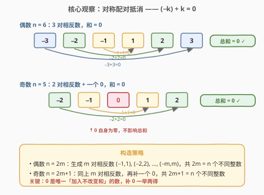
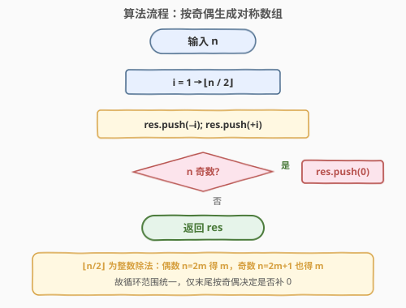
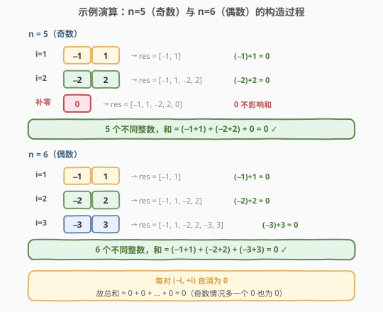

# 和为零的 N 个不同整数

- **题目名称**：和为零的 N 个不同整数
- **链接**：[1304. 和为零的 N 个不同整数](https://leetcode.cn/problems/find-n-unique-integers-sum-up-to-zero/)
- **难度**：简单
- **标签**：数组、数学、构造

## 1. 题目概述

给你一个整数 `n`，请你返回**任意**一个由 `n` 个**各不相同**的整数组成的数组，并且这 `n` 个数相加和为 `0`。

**示例 1**：

```text
输入：n = 5
输出：[-7,-1,1,3,4]
解释：这些数组也是正确的 [-5,-1,1,2,3]，[-3,-1,2,-2,4]。
```

**示例 2**：

```text
输入：n = 3
输出：[-1,0,1]
```

**示例 3**：

```text
输入：n = 1
输出：[0]
```

**约束条件**：

- `1 <= n <= 1000`

> 💡 答案不唯一——只要满足「n 个不同整数 + 和为 0」即可。本题考查的是**构造能力**：如何系统性地生成一组满足条件的数，而非搜索或枚举。

---

## 2. 解题思路

### 2.1 朴素构造：前缀 + 末位凑零

一种直觉做法：前 `n−1` 个位置放 $1, 2, \ldots, n-1$，最后一个位置放 $-\frac{(n-1)n}{2}$ 来抵消总和。

这个做法能过，但末位值可能很大（$n=1000$ 时约为 $-5 \times 10^5$），且不够直观——为什么要这样选？能否从**结构**上直接保证和为零且互不相同？

### 2.2 核心观察：对称配对抵消



对于任意正整数 $k$，有 $(−k) + k = 0$。这是一对**相反数**，天然满足：

- **互不相同**：$-k \neq k$（$k \ge 1$）
- **和为零**：$-k + k = 0$

因此只需生成若干对相反数即可：

- **偶数 $n = 2m$**：生成 $m$ 对相反数 $(−1,1), (−2,2), \ldots, (−m,m)$，共 $2m = n$ 个不同整数，总和为 $0$。
- **奇数 $n = 2m+1$**：同上生成 $m$ 对相反数，再补一个 $0$。因为 $0$ 本身就是 $0$，加入任何和为 $0$ 的集合不改变总和。共 $2m+1 = n$ 个不同整数。

> ⚠️ **为什么补 0 不破坏互异性？** 0 与任何 $\pm k$（$k \ge 1$）都不同，因此补 0 安全。且 0 是唯一一个「加进去不改变和」的数——这正是奇数情况的关键。

### 2.3 算法流程图



**完整步骤**：

1. **初始化**空数组 `res`。
2. **循环** $i$ 从 $1$ 到 $\lfloor n/2 \rfloor$（整数除法，偶奇通用）：
   - 将 $-i$ 和 $+i$ 依次加入 `res`。
3. **奇数补零**：若 $n$ 为奇数，将 $0$ 加入 `res`。
4. **返回** `res`。

> 💡 **整数除法的妙用**：`n / 2` 在整数除法下，偶数 $n=2m$ 得 $m$，奇数 $n=2m+1$ 也得 $m$。因此循环范围无需分奇偶讨论，仅在最后一步按奇偶决定是否补 0，代码极简。

### 2.4 示例演算

以 $n = 5$（奇数）和 $n = 6$（偶数）为例：



**$n = 5$（奇数）**：

| 轮次 $i$ | 加入 | res 状态 |
|-----------|------|----------|
| 1 | $-1,\ +1$ | $[-1, 1]$ |
| 2 | $-2,\ +2$ | $[-1, 1, -2, 2]$ |
| 补零 | $0$ | $[-1, 1, -2, 2, 0]$ |

共 5 个不同整数，$\sum = (-1+1) + (-2+2) + 0 = 0$ ✓

**$n = 6$（偶数）**：

| 轮次 $i$ | 加入 | res 状态 |
|-----------|------|----------|
| 1 | $-1,\ +1$ | $[-1, 1]$ |
| 2 | $-2,\ +2$ | $[-1, 1, -2, 2]$ |
| 3 | $-3,\ +3$ | $[-1, 1, -2, 2, -3, 3]$ |

共 6 个不同整数，$\sum = (-1+1) + (-2+2) + (-3+3) = 0$ ✓

---

## 3. 参考代码

### 方法一：对称配对（推荐）

### C++

```cpp
class Solution {
public:
    vector<int> sumZero(int n) {
        vector<int> res;
        for (int i = 1; i <= n / 2; i++) {
            res.push_back(-i);
            res.push_back(i);
        }
        if (n % 2 == 1) res.push_back(0);
        return res;
    }
};
```

### Python

```python
class Solution:
    def sumZero(self, n: int) -> List[int]:
        res = []
        for i in range(1, n // 2 + 1):
            res.append(-i)
            res.append(i)
        if n % 2 == 1:
            res.append(0)
        return res
```

> 💡 `n // 2` 是整数除法，偶数 $n=2m$ 得 $m$，奇数 $n=2m+1$ 也得 $m$，循环范围统一。

### 方法二：前缀 + 末位凑零

> 💡 **另一构造**：放 $1, 2, \ldots, n-1$，最后一个放 $-\frac{(n-1)n}{2}$ 抵消总和。因为 $\frac{(n-1)n}{2} \ge n-1$（$n \ge 2$），末位值 $\le -(n-1) < 1$，与前 $n-1$ 个正数不会重复。

```cpp
class Solution {
public:
    vector<int> sumZero(int n) {
        vector<int> res;
        for (int i = 1; i < n; i++) res.push_back(i);
        res.push_back(-n * (n - 1) / 2);
        return res;
    }
};
```

> ⚠️ 方法二对 $n = 1$ 也成立：循环不执行，`res = [0]`（$-1 \times 0 / 2 = 0$），符合示例 3。

---

## 4. 复杂度分析

| 维度 | 方法一（对称配对） | 方法二（前缀凑零） |
|------|-------------------|-------------------|
| **时间** | $O(n)$ | $O(n)$ |
| **空间** | $O(n)$（输出数组） | $O(n)$（输出数组） |
| **额外空间** | $O(1)$ | $O(1)$ |

> 两种方法都只需一遍遍历构造结果数组，时间 $O(n)$。输出数组本身占 $O(n)$ 空间，但这是题目要求的返回值，不计入额外空间。两种方法均无辅助数据结构，额外空间 $O(1)$。

---

## 5. 面试要点

1. **为什么对称配对能保证互不相同？**

   > 每对 $(-i, +i)$ 中 $-i \neq i$（$i \ge 1$）；不同对之间，$|-i| \neq |-j|$（$i \neq j$），故所有数两两不同。补的 0 与任何 $\pm i$ 也不相等。

2. **奇数情况为什么要补 0 而不是别的数？**

   > 0 是唯一一个「加到任何集合中不改变总和」的数。若补非零数 $x$，则需同时调整其他数来维持和为 0，徒增复杂度。补 0 一举两得：保持和为零且不破坏互异性。

3. **方法二的末位为什么不会和前面重复？**

   > 前 $n-1$ 个数是 $1, 2, \ldots, n-1$（均为正），末位是 $-\frac{(n-1)n}{2} \le -(n-1) < 0$，一正一负不可能相等。$n=1$ 时末位为 0，也无重复。

4. **如果要求返回的数组必须有序怎么办？**

   > 方法一的结果排序后即为 $[-m, \ldots, -1, 0?, 1, \ldots, m]$（奇数含 0）。也可直接按 $-m, \ldots, -1, [0], 1, \ldots, m$ 的顺序生成，免排序。方法二天然部分有序（前 $n-1$ 个递增），但末位为负最小值。

5. **如果要求元素取值范围受限（如 $[-1000, 1000]$）呢？**

   > 方法一的最大绝对值为 $\lfloor n/2 \rfloor \le 500$（$n \le 1000$），天然在范围内。方法二末位 $-\frac{(n-1)n}{2}$ 在 $n=1000$ 时约为 $-5 \times 10^5$，远超范围。故值域受限时方法一更优。

> 💡 **一句话总结**：1304 的本质是「构造」——利用 $(-k)+k=0$ 的对称性，偶数生成 $n/2$ 对相反数，奇数再补 0。整数除法让循环统一，代码极简。

---

## 6. 同类练习题

- [258. 各位相加](https://leetcode.cn/problems/add-digits/)（[题解](../0201-0300/258_各位相加.md)）：数学公式构造 $O(1)$ 解，构造思维的延伸
- [1281. 整数的各位积和之差](https://leetcode.cn/problems/subtract-the-product-and-sum-of-digits-of-an-integer/)（[题解](../1201-1300/1281_整数各位积和之差.md)）：数位分解构造计算，简单数学构造题
- [922. 按奇偶排序数组 II](https://leetcode.cn/problems/sort-array-by-parity-ii/)（[题解](../0901-1000/922_按奇偶排序数组II.md)）：按奇偶性分流放置，同样是「利用性质构造数组」
- [832. 翻转图像](https://leetcode.cn/problems/flipping-an-image/)（[题解](../0801-0900/832_翻转图像.md)）：数组变换构造，按规则生成结果数组
