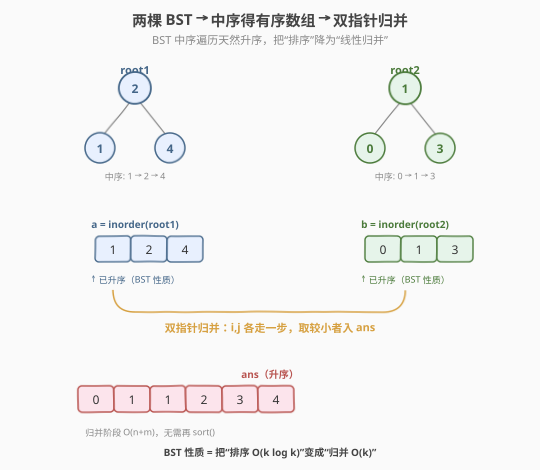
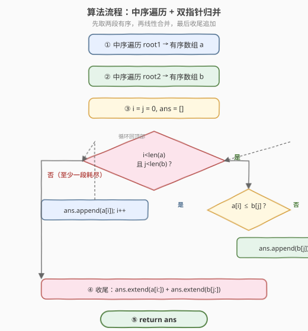

# LeetCode 两棵二叉搜索树中的所有元素 题解

## 1. 题目概述

- **标题 / 题号**：两棵二叉搜索树中的所有元素（#1305，medium）
- **链接**：https://leetcode.cn/problems/all-elements-in-two-binary-search-trees/
- **难度**：中等
- **标签**：树、二叉搜索树、中序遍历、双指针、归并

**题意**：给你两棵**二叉搜索树**的根节点 `root1` 和 `root2`，请你返回一个列表，其中包含**两棵树中的所有整数**并按**升序**排列。

**示例 1**：

```text
输入：root1 = [2,1,4], root2 = [1,0,3]
        2                 1
       / \               / \
      1   4             0   3
输出：[0,1,1,2,3,4]
解释：两棵树的所有节点值为 {2,1,4} ∪ {1,0,3} = {0,1,1,2,3,4}，升序即所求。
```

**示例 2**：

```text
输入：root1 = [1,null,8], root2 = [8,1]
        1                 8
         \               /
          8             1
输出：[1,1,8,8]
```

**约束**：

- 每棵树中节点数目在范围 `[0, 5000]` 内
- `-10^5 <= Node.val <= 10^5`
- 两棵树节点总数之和 `[1, 10^4]`

> 💡 本题的题眼在「**二叉搜索树**」四字。BST 的核心性质是**中序遍历得到升序序列**——这意味着两棵树各自已经"半有序"。暴力收集 + 排序虽然能过，却把这份天然顺序丢掉重排了，浪费了输入结构。最优解是把 [94. 中序遍历](../0001-0100/94_二叉树的中序遍历.md) 与归并排序的合并步骤（[21. 合并两个有序链表](../0001-0100/21_合并两个有序链表.md) 的数组版）拼在一起。

## 2. 解题思路

### 2.1 暴力思路：遍历收集 + 排序

随便用一种遍历（前序/中序/后序/BFS 都行）把两棵树的所有节点值收集进一个 `list`，然后 `sort()` 排序返回。

```text
vals = []
collect(root1, vals)     // 任意遍历
collect(root2, vals)
vals.sort()
return vals
```

正确，但时间 $O((n+m)\log(n+m))$，且**完全没利用 BST 性质**——两棵树的中序序列本来就各自有序，对整体再排序等于"把两段已排序的序列打乱后再排一遍"。更聪明的做法是：先把两段有序序列取出来，再做一次线性归并。

### 2.2 核心观察：BST 中序 = 有序序列，双指针归并



**关键观察**：BST 的中序遍历（左→根→右）天然产生升序序列。于是：

1. 对 `root1` 中序遍历 → 有序数组 `a`
2. 对 `root2` 中序遍历 → 有序数组 `b`
3. 用**归并排序的合并步骤**（双指针）把 `a`、`b` 合并成一个升序数组

```text
a = inorder(root1)          // 已升序：BST 性质
b = inorder(root2)          // 已升序：BST 性质
i = j = 0
ans = []
while i < len(a) and j < len(b):
    if a[i] <= b[j]:
        ans.append(a[i]); i += 1
    else:
        ans.append(b[j]); j += 1
// 收尾：把未耗尽的那段直接追加
ans += a[i:]
ans += b[j:]
return ans
```

> 💡 **为什么归并是线性的？** 两个指针 `i`、`j` 每一步必有一个前移，总共最多走 `len(a)+len(b)` 步，所以合并阶段 $O(n+m)$。加上两趟中序遍历各 $O(n)$、$O(m)$，整体 $O(n+m)$，比暴力的 $O((n+m)\log(n+m))$ 更优——尤其当 $n+m$ 接近 $10^4$ 时差距明显。

> ⚠️ **相等元素的处理**：`a[i] <= b[j]` 用 `<=` 而非 `<`，相等时取 `a` 的元素。这只影响同值元素的相对来源顺序（稳定性），不影响结果正确性——题目只要求升序，重复值任意排列都合法。

### 2.3 算法流程图



**完整步骤**：

1. **中序遍历 root1**：递归 `dfs(node)`：先左子树，再追加 `node.val`，再右子树 → 得升序数组 `a`
2. **中序遍历 root2**：同样方式 → 得升序数组 `b`
3. **双指针归并**：`i=j=0`，`while` 两数组都未耗尽时，比较 `a[i]`、`b[j]`，小的进 `ans` 并前移对应指针
4. **收尾追加**：把较长数组剩余部分一次性追加（已有序，无需再比）
5. **返回** `ans`

### 2.4 示例演算

以示例 1 为例：`root1 = [2,1,4]`、`root2 = [1,0,3]`。

![示例演算：a=[1,2,4]、b=[0,1,3]，6 步归并得 [0,1,1,2,3,4]](../images/1305_example_walkthrough.svg)

中序遍历结果：

- `a = inorder(root1) = [1, 2, 4]`（1 → 2 → 4）
- `b = inorder(root2) = [0, 1, 3]`（0 → 1 → 3）

归并过程（`i`、`j` 从 0 开始）：

| 步骤 | a[i] | b[j] | 比较 | 取值 | ans | i | j |
|------|------|------|------|------|-----|---|---|
| 1 | 1 | 0 | 1 > 0 | b[0]=0 | [0] | 0 | 1 |
| 2 | 1 | 1 | 1 ≤ 1 | a[0]=1 | [0,1] | 1 | 1 |
| 3 | 2 | 1 | 2 > 1 | b[1]=1 | [0,1,1] | 1 | 2 |
| 4 | 2 | 3 | 2 ≤ 3 | a[1]=2 | [0,1,1,2] | 2 | 2 |
| 5 | 4 | 3 | 4 > 3 | b[2]=3 | [0,1,1,2,3] | 2 | 3 |
| 6 | — | — | b 耗尽 | 收尾 a[2:]=[4] | [0,1,1,2,3,4] | 3 | 3 |

最终 `ans = [0,1,1,2,3,4]`。

> 💡 **第 2 步的细节**：`a[i]=1` 与 `b[j]=1` 相等，按 `<=` 取 `a` 的 1。若改取 `b` 的 1，结果仍是 `[0,1,1,2,3,4]`——两个 1 来源不同但值相同，不影响升序正确性，只影响稳定性。

## 3. 参考代码

### C++

```cpp
// 两棵二叉搜索树中的所有元素.cpp —— 中序遍历 + 双指针归并
// 编译: g++ -O2 -std=c++17 两棵二叉搜索树中的所有元素.cpp -o allelems
#include <vector>
using namespace std;

struct TreeNode {
    int val;
    TreeNode* left;
    TreeNode* right;
    TreeNode() : val(0), left(nullptr), right(nullptr) {
    }
    TreeNode(int x) : val(x), left(nullptr), right(nullptr) {
    }
    TreeNode(int x, TreeNode* l, TreeNode* r) : val(x), left(l), right(r) {
    }
};

class Solution {
    void inorder(TreeNode* node, vector<int>& out) {
        if (!node) return;
        inorder(node->left, out);
        out.push_back(node->val);
        inorder(node->right, out);
    }
  public:
    vector<int> getAllElements(TreeNode* root1, TreeNode* root2) {
        vector<int> a, b;
        inorder(root1, a);          // BST 中序 → 升序
        inorder(root2, b);

        vector<int> ans;
        ans.reserve(a.size() + b.size());
        int i = 0, j = 0;
        while (i < (int)a.size() && j < (int)b.size()) {
            if (a[i] <= b[j]) ans.push_back(a[i++]);
            else              ans.push_back(b[j++]);
        }
        while (i < (int)a.size()) ans.push_back(a[i++]);   // 收尾 a
        while (j < (int)b.size()) ans.push_back(b[j++]);   // 收尾 b
        return ans;
    }
};
```

### Python

```python
from typing import List, Optional


class TreeNode:
    def __init__(self, val=0, left=None, right=None):
        self.val = val
        self.left = left
        self.right = right


class Solution:
    def getAllElements(self, root1: Optional[TreeNode], root2: Optional[TreeNode]) -> List[int]:
        def inorder(node: Optional[TreeNode]) -> List[int]:
            if not node:
                return []
            return inorder(node.left) + [node.val] + inorder(node.right)

        a = inorder(root1)            # BST 中序 → 升序
        b = inorder(root2)

        # 双指针归并两段有序序列
        ans: List[int] = []
        i = j = 0
        while i < len(a) and j < len(b):
            if a[i] <= b[j]:
                ans.append(a[i])
                i += 1
            else:
                ans.append(b[j])
                j += 1
        ans.extend(a[i:])             # 收尾 a（已有序，直接接上）
        ans.extend(b[j:])             # 收尾 b
        return ans
```

> 💡 **实现细节**：① Python 的 `inorder` 用列表拼接写法最直观，但每次 `+` 会新建列表，最坏 $O(n^2)$；若追求严格线性，可传入 `out` 列表用 `out.append`（见下方进阶写法）。② C++ 用 `ans.reserve(a.size()+b.size())` 预分配，避免 `push_back` 反复扩容。③ `(int)a.size()` 的强转是为了消除有符号/无符号比较的编译警告。

**Python 严格线性的中序写法**（推荐用于面试）：

```python
def inorder(node, out):
    if not node:
        return
    inorder(node.left, out)
    out.append(node.val)
    inorder(node.right, out)
```

## 4. 复杂度分析

| 维度 | 中序 + 归并（推荐） | 暴力收集 + 排序 | 迭代中序 + 同步归并（见第 5 节） |
|------|---------------------|-----------------|----------------------------------|
| **时间** | $O(n+m)$ | $O((n+m)\log(n+m))$ | $O(n+m)$ |
| **空间** | $O(n+m)$（两个中序数组 + 结果） | $O(n+m)$（收集数组 + 排序） | $O(h_1+h_2)$（仅两个显式栈） |
| **是否利用 BST** | 是，中序天然升序 | 否，丢弃顺序重排 | 是，按需生成中序 |
| **是否需先存全量数组** | 是 | 是 | 否，边遍历边归并 |

> ⚠️ **空间对比**：$n$ 为 root1 节点数、$m$ 为 root2 节点数，$h_1$、$h_2$ 为两树高度。推荐解法需把两段中序数组全部物化，共 $O(n+m)$ 工作空间；进阶的迭代同步归并只维护两个栈，深度等于树高，平衡树 $O(\log n)$、退化为链表 $O(n)$。当 $n+m \le 10^4$ 时两者空间都完全可接受，推荐解法写法最短最直观，是面试首选。

## 5. 扩展：迭代中序 + 同步归并（$O(h_1+h_2)$ 工作空间）

若面试官追问"能否把工作空间从 $O(n+m)$ 降到 $O(h_1+h_2)$"，关键是**不要预先物化整段中序数组**，而是用**显式栈模拟中序遍历**，按需"吐出"下一个最小值，两棵树边遍历边归并。

**思路**：BST 中序遍历的迭代写法用一个栈，先把左脊一路压到底，每次弹出栈顶即当前最小值，再把其右子树的左脊压入。维护两个这样的栈 `s1`、`s2`，每步比较两栈顶的 `val`，弹出较小者加入答案，并压入其右子树的左脊——这就是"在两段有序序列上做归并"，但序列是惰性生成的。

```python
class Solution:
    def getAllElements(self, root1: Optional[TreeNode], root2: Optional[TreeNode]) -> List[int]:
        s1, s2 = [], []
        ans: List[int] = []

        def push_left(node: Optional[TreeNode], stack: list) -> None:
            while node:                       # 把左脊一路压到底
                stack.append(node)
                node = node.left

        push_left(root1, s1)
        push_left(root2, s2)

        while s1 or s2:
            # 取两栈顶中较小者；某栈空则取另一栈
            if not s2 or (s1 and s1[-1].val <= s2[-1].val):
                node = s1.pop()               # 吐出 root1 当前最小
                ans.append(node.val)
                push_left(node.right, s1)     # 接着压右子树的左脊
            else:
                node = s2.pop()               # 吐出 root2 当前最小
                ans.append(node.val)
                push_left(node.right, s2)
        return ans
```

**为什么正确**：每个栈的栈顶始终是"该树未输出部分的最小值"（中序迭代的不变式）。两栈顶比较取小者，等价于在两段升序序列上做标准归并的"取较小者前移指针"——只是指针换成了"栈顶 + 按需压左脊"。每个节点进出栈各一次，总计 $O(n+m)$ 时间。

> 💡 **何时选这个版本**：当树退化成链表、$n+m$ 很大且要求低空间时，迭代版只需两个深度为树高的栈。但它写法更长、易出错，面试中**先用第 3 节的递归版讲清思路、再点出此版作为空间优化**即可展示深度。

## 6. 面试要点

1. **为什么中序遍历 BST 得到升序序列？**

   > BST 的定义：左子树所有值 ≤ 根 ≤ 右子树所有值。中序遍历顺序是"左→根→右"，先访问左子树（其中所有值 ≤ 根），再访问根，再访问右子树（其中所有值 ≥ 根）。对每个子树递归套用此性质，整体序列单调不降。这是 BST 一切"有序"性质的根源，也是本题能用归并的前提。

2. **为什么归并阶段是 $O(n+m)$ 而不是 $O((n+m)\log(n+m))$？**

   > 归并利用了"两段输入已经各自有序"这一前提：每步只需比较两段当前位置的元素、取较小者前移一个指针，无需全局比较。两指针合计最多移动 $n+m$ 次，故线性。暴力的排序没有"已有序"前提，必须用基于比较的 $O(k\log k)$ 排序。本题 BST 性质正是把"无序输入"变成了"两段有序输入"。

3. **相等元素时取 `a[i]` 还是 `b[j]` 有影响吗？**

   > 不影响结果正确性。题目只要求升序列表，重复值无论来源如何排列都合法。取 `a[i] <= b[j]`（相等取 a）只让归并成为**稳定归并**——同值元素保持 a 在 b 前的相对顺序。若改取 b 也对，只是稳定性不同。面试时提一句"用 `<=` 保证稳定性"是加分项。

4. **如果两棵树不是 BST 而是普通二叉树，该怎么做？**

   > 中序不再有序，归并的前提失效，只能退回暴力：任意遍历收集所有值到 `list` 再 `sort()`，$O((n+m)\log(n+m))$。本题之所以能线性，全靠 BST 这个结构前提——这正提醒我们审题时要先确认输入是否有可利用的特殊性质。

5. **迭代同步归并版本的不变式是什么？**

   > 每个栈 `s1`/`s2` 的栈顶始终是"该树**尚未输出**部分的最小节点"。压左脊保证栈顶是当前子树最左（即最小）节点；弹出一个节点后立刻压其右子树的左脊，相当于中序"转向右子树"并把右子树最小值顶到栈顶。两栈顶取小即"全局未输出部分的最小值"，与标准归并的"两指针取小"等价。

> 💡 **一句话总结**：1305 是 [94 中序遍历](../0001-0100/94_二叉树的中序遍历.md) 与归并合并步骤的"二合一"——BST 性质把两棵树变成两段有序序列，剩下就是 [21 合并两个有序链表](../0001-0100/21_合并两个有序链表.md) 的数组版双指针归并。核心是识别"BST 中序 = 有序"这一结构性质，把 $O(k\log k)$ 的排序降为 $O(k)$ 的归并。

## 同类练习题

| # | 题目 | 与本题的关联 |
|---|------|-------------|
| 94 | [二叉树的中序遍历](https://leetcode.cn/problems/binary-tree-inorder-traversal/)（[题解](../0001-0100/94_二叉树的中序遍历.md)） | 中序遍历的递归/迭代/Morris 三种写法，本题的直接前置技能 |
| 21 | [合并两个有序链表](https://leetcode.cn/problems/merge-two-sorted-lists/)（[题解](../0001-0100/21_合并两个有序链表.md)） | 双指针归并的母题，链表版；本题是其数组版，归并骨架完全一致 |
| 148 | [排序链表](https://leetcode.cn/problems/sort-list/)（[题解](../0101-0200/148_排序链表.md)） | 归并排序整体，归并合并步骤即本题的核心子过程 |
| 98 | [验证二叉搜索树](https://leetcode.cn/problems/validate-binary-search-tree/)（[题解](../0001-0100/98_验证二叉搜索树.md)） | BST 中序单调性应用，从"利用有序"换到"验证有序" |
| 230 | [二叉搜索树中第 K 小的元素](https://leetcode.cn/problems/kth-smallest-element-in-a-bst/) | BST 中序升序性质的另一应用——中序遍历到第 k 个即第 k 小，与本题同源 |
