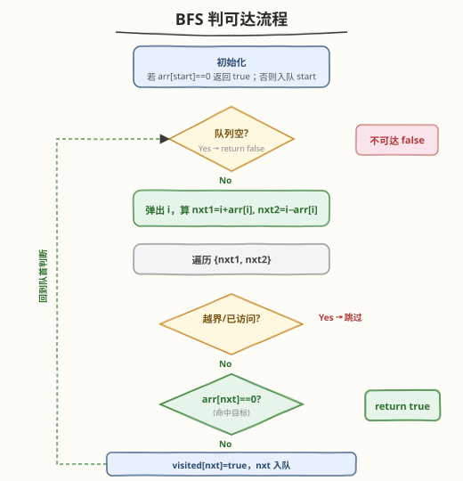
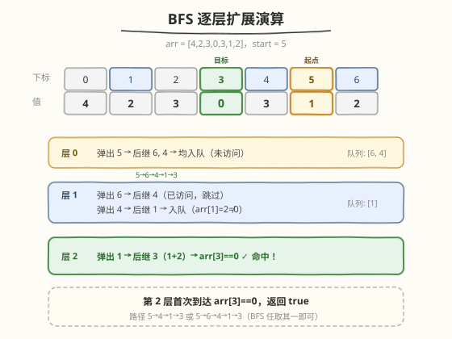

# LeetCode 跳跃游戏 III 题解

## 1. 题目概述

- **标题 / 题号**：跳跃游戏 III（#1306，medium）
- **链接**：https://leetcode.cn/problems/jump-game-iii/
- **难度**：中等
- **标签**：广度优先搜索、深度优先搜索、图、数组

**题意**：给定一个非负整数数组 `arr`，你最开始位于该数组的起始下标 `start` 处。当你位于下标 `i` 处时，你可以跳到 `i + arr[i]` 或者 `i - arr[i]`。请你判断自己是否能够跳到对应元素值为 `0` 的**任一**下标处。注意，不管什么情况下，你都无法跳到数组之外。

**示例 1**：

```text
输入：arr = [4,2,3,0,3,1,2], start = 5
输出：true
解释：到达值为 0 的下标 3 有以下可能方案：
  下标 5 -> 下标 4 -> 下标 1 -> 下标 3
  下标 5 -> 下标 6 -> 下标 4 -> 下标 1 -> 下标 3
```

**示例 2**：

```text
输入：arr = [4,2,3,0,3,1,2], start = 0
输出：true
解释：到达值为 0 的下标 3 有以下可能方案：
  下标 0 -> 下标 4 -> 下标 1 -> 下标 3
```

**示例 3**：

```text
输入：arr = [3,0,2,1,2], start = 2
输出：false
解释：无法到达值为 0 的下标 1 处。
```

**约束**：

- `1 <= arr.length <= 5 * 10^4`
- `0 <= arr[i] < arr.length`
- `0 <= start < arr.length`

> 💡 本题是 [55. 跳跃游戏](../0001-0100/55_跳跃游戏.md) 的「图论版变体」：55 题中下标 `i` 能跳到的范围是 `[i+1, i+arr[i]]` 一个**区间**，用贪心维护最远可达即可；而本题从 `i` 只能跳到**两个确定位置** `i + arr[i]` 和 `i - arr[i]`，每个下标是一个节点、两条出边，构成了一个**隐式有向图**。问题归结为：从起点 `start` 出发，能否到达某个值为 `0` 的节点——标准的**图可达性问题**，BFS / DFS 均可。

## 2. 解题思路

### 2.1 暴力思路：DFS 不剪枝枚举所有路径

从 `start` 出发递归，每步尝试 `i + arr[i]` 和 `i - arr[i]` 两个方向，到达值为 `0` 的下标即返回 `true`。但若不做「已访问」标记，同一节点会被反复经过，路径可在两个互相可达的节点间无限循环，导致**无法终止**或指数级展开。

> ⚠️ 关键误区：和普通迷宫搜索一样，本题的图虽然是隐式的，但每个节点的出边固定（最多两条）。只要加一个 `visited` 数组保证每个下标至多入队/入栈一次，复杂度立刻降到 $O(n)$。

### 2.2 核心观察：隐式图可达性 + 一次性访问

![核心观察：下标为节点，i±arr[i] 为出边，构成隐式图，BFS 判可达](../images/jg3_concept.svg)

把每个下标 `i` 看作图的一个**节点**，从 `i` 引出两条有向边：一条指向 `i + arr[i]`，一条指向 `i - arr[i]`（越界则该边不存在）。于是整个数组被建模成一个**每个节点出度 ≤ 2 的隐式有向图**。

- **问题转化**：判断从节点 `start` 出发，是否存在一条路径到达某个 `arr[j] == 0` 的节点 `j`——即图的**可达性问题**。
- **为什么只需访问一次？** 本题只问「能否到达」，不问最短步数/路径数。一个节点一旦被访问过，再经其它路径绕回来也不会产生新的可达集合（它能去的地方第一次访问时就已经会去探索）。因此用 `visited[i]` 布尔标记，每个下标**至多处理一次**。
- **BFS vs DFS**：两者都能解决可达性问题。BFS 按层扩展、天然适合求最短路（本题不求最短路但同样适用）；DFS 递归写法更简短。下面主推 **BFS**（迭代、无栈溢出风险、与 1293/994 等 BFS 家族一脉相承），第 5 节给出 DFS 版本。

> 💡 **与 55 跳跃游戏的对照**：55 题的 `i` 能跳到 `[i+1, i+arr[i]]` 中**任意**位置，候选后继是一个区间，无法逐点建图，所以用贪心维护「当前最远可达右边界」`maxR`。本题的后继只有**两个确定点**，可以显式枚举，所以建图 + BFS/DFS 是最自然的做法。贪心在此不适用，因为「最远」没有意义——可能要往回跳才能到 0。

### 2.3 算法流程图



**完整步骤**：

1. **特判**：若 `arr[start] == 0`，直接返回 `true`（起点本身即目标）。
2. **初始化**：`visited` 数组全 `false`；队列放入 `start`，`visited[start] = true`。
3. **BFS 循环**：
   - 队列空 → 返回 `false`（所有可达节点都探索完，未遇到 0）。
   - 弹出当前下标 `i`，计算两个后继 `nxt1 = i + arr[i]`、`nxt2 = i - arr[i]`。
   - 对每个后继 `nxt`：
     - 越界（`nxt < 0` 或 `nxt >= n`）→ 跳过。
     - `visited[nxt]` 为 `true` → 跳过（已访问，避免重复/成环）。
     - `arr[nxt] == 0` → 返回 `true`（命中目标）。
     - 否则标记 `visited[nxt] = true`，`nxt` 入队。
4. 循环正常结束返回 `false`。

> 💡 **命中判断的时机**：可以在「弹出 `i` 时检查 `arr[i] == 0`」，也可以在「生成后继 `nxt` 时检查 `arr[nxt] == 0`」。两者等价（前者把起点也覆盖，省去特判）。下文代码采用**生成后继时检查**+起点特判的写法，逻辑更显式。

### 2.4 示例演算

以示例 1 `arr = [4,2,3,0,3,1,2], start = 5` 为例：



数组与跳转关系（箭头表示 `i ± arr[i]`）：

| 下标 `i` | `arr[i]` | 可跳到 `i+arr[i]` | 可跳到 `i-arr[i]` |
|----------|----------|-------------------|-------------------|
| 0 | 4 | 4 | −4（越界） |
| 1 | 2 | 3 | −1（越界） |
| 2 | 3 | 5 | −1（越界） |
| 3 | **0** | 3 | 3（目标！） |
| 4 | 3 | 7（越界） | 1 |
| 5 | 1 | 6 | 4 |
| 6 | 2 | 8（越界） | 4 |

BFS 逐层扩展（`start = 5`）：

| 层 | 弹出 `i` | 后继（合法） | 新入队 | 命中 0？ |
|----|----------|--------------|--------|----------|
| 0 | 5 | 6, 4 | 6, 4 | 否 |
| 1 | 6 | 4（已访问） | — | 否 |
| 1 | 4 | 1 | 1 | 否 |
| 2 | 1 | **3** | — | **是** ✓ `arr[3]==0` |

第 2 层从下标 `1` 跳到下标 `3`（`1 + arr[1] = 1 + 2 = 3`），`arr[3] == 0`，返回 `true`。对应路径 `5 → 6 → 4 → 1 → 3` 或 `5 → 4 → 1 → 3`（BFS 实际走哪条取决于入队顺序，但都能到达）。

> 💡 **示例 3 为什么 false？** `arr = [3,0,2,1,2], start = 2`。从下标 2 出发：`2+3=5`（越界，`n=5`）、`2-3=-1`（越界）。起点两个后继都越界，队列立即空，返回 `false`。值为 0 的下标 1 虽然存在，但从起点根本无路可达——这正是「可达性」问题的本质。

## 3. 参考代码

### C++

```cpp
// 跳跃游戏 III.cpp —— 隐式图 BFS 判可达
// 编译: g++ -O2 -std=c++17 跳跃游戏\ III.cpp -o jg3
class Solution {
public:
    bool canReach(vector<int>& arr, int start) {
        int n = arr.size();
        if (arr[start] == 0) return true;          // 起点即目标

        vector<char> visited(n, 0);
        queue<int> q;
        q.push(start);
        visited[start] = 1;

        while (!q.empty()) {
            int i = q.front(); q.pop();
            int nxt1 = i + arr[i];
            int nxt2 = i - arr[i];
            for (int nxt : {nxt1, nxt2}) {
                if (nxt < 0 || nxt >= n) continue;
                if (visited[nxt]) continue;
                if (arr[nxt] == 0) return true;    // 命中值为 0 的下标
                visited[nxt] = 1;
                q.push(nxt);
            }
        }
        return false;
    }
};
```

### Python

```python
class Solution:
    def canReach(self, arr: List[int], start: int) -> bool:
        n = len(arr)
        if arr[start] == 0:
            return True                        # 起点即目标

        from collections import deque
        visited = [False] * n
        q = deque([start])
        visited[start] = True

        while q:
            i = q.popleft()
            for nxt in (i + arr[i], i - arr[i]):
                if 0 <= nxt < n and not visited[nxt]:
                    if arr[nxt] == 0:
                        return True            # 命中值为 0 的下标
                    visited[nxt] = True
                    q.append(nxt)
        return False
```

> 💡 **实现细节**：① 用 `vector<char>` / `list[bool]` 而非 `vector<bool>` 做 `visited`，避免位压缩带来的代理引用问题（Python 直接用 `list[bool]` 即可）。② 命中判断 `arr[nxt] == 0` 放在入队前，省一次「弹出再判断」的开销。③ `for (int nxt : {nxt1, nxt2})` 用初始化列表简洁地枚举两个后继。④ **不需要记录步数**——本题只问可达性，BFS 的层数信息用不上。

## 4. 复杂度分析

| 维度 | 复杂度 | 说明 |
|------|--------|------|
| **时间** | $O(n)$ | 每个下标至多入队一次、处理一次，每次处理生成 2 个后继共 $O(1)$，总计 $O(n)$ |
| **空间** | $O(n)$ | `visited` 数组 $O(n)$；队列最坏存全部 $n$ 个下标 $O(n)$ |

> ⚠️ 严格来说时间复杂度是 $O(n)$ 而非 $O(n \log n)$ 或更高：尽管图有 $2n$ 条边，但每条边只在源节点被弹出时检查一次，且 `visited` 保证每点只处理一次。`n = 5×10^4` 时约 $10^5$ 次操作，远在限制内。

## 5. 扩展：DFS 递归版本

可达性问题同样可用 DFS 解决，写法更简短，但需注意递归深度。本题 `n ≤ 5×10^4`，最坏递归深度可达 `n`（如 `arr = [1,1,1,...,1,0]` 形成链状图），可能触发栈溢出，故**推荐 BFS**。以下是 DFS 版本供对照：

```python
class Solution:
    def canReach(self, arr: List[int], start: int) -> bool:
        n = len(arr)
        visited = [False] * n

        def dfs(i: int) -> bool:
            if not 0 <= i < n or visited[i]:
                return False
            if arr[i] == 0:
                return True
            visited[i] = True
            return dfs(i + arr[i]) or dfs(i - arr[i])

        return dfs(start)
```

```cpp
class Solution {
public:
    bool canReach(vector<int>& arr, int start) {
        int n = arr.size();
        vector<char> visited(n, 0);
        function<bool(int)> dfs = [&](int i) -> bool {
            if (i < 0 || i >= n || visited[i]) return false;
            if (arr[i] == 0) return true;
            visited[i] = 1;
            return dfs(i + arr[i]) || dfs(i - arr[i]);
        };
        return dfs(start);
    }
};
```

> ⚠️ DFS 的 `return dfs(i + arr[i]) || dfs(i - arr[i])` 利用短路求值：左分支找到目标就不再探索右分支。但最坏情况仍要遍历全图。若面试官追问「能否改成迭代 DFS」，把 BFS 的 `queue` 换成 `stack` 即可，其余逻辑不变。

## 6. 面试要点

1. **为什么是图问题而不是贪心/DP？**

   > 从下标 `i` 只能跳到 `i + arr[i]` 和 `i - arr[i]` 两个**确定**后继，每个下标是节点、两条出边，构成隐式有向图。判断能否到达某个 `arr[j] == 0` 的节点就是图的**可达性问题**，用 BFS/DFS 天然解决。贪心（如 55 题维护最远右边界）不适用，因为可能需要「往回跳」才能到达 0，「最远」没有指导意义。

2. **为什么每个下标只需访问一次？**

   > 本题只问「能否到达」，不问最短路径或路径数。一个节点被访问后，它所有能到达的节点都会在后续 BFS 中被探索；经其它路径再次到达同一节点不会带来新的可达信息。因此 `visited` 布尔标记足以保证 $O(n)$ 复杂度，无需像 1293 那样存「最大剩余预算」。

3. **BFS 和 DFS 哪个更好？**

   > 两者都能判可达，复杂度相同 $O(n)$。BFS 迭代实现无栈溢出风险，适合 `n` 较大（本题 `5×10^4`）；DFS 递归写法更简洁，但最坏递归深度 `O(n)` 可能爆栈。若要求最短步数则必须 BFS（本题不需要）。面试中推荐 BFS，并说明 DFS 的栈深度风险以展示权衡意识。

4. **`arr[i] == 0` 的节点有自环，会出问题吗？**

   > 不会。当 `arr[i] == 0` 时，`i + 0 = i`、`i - 0 = i`，后继指向自己。但由于我们在**生成后继时**就检查 `arr[nxt] == 0` 并立即返回 `true`，根本不会把它入队，自环不会触发。即使把判断放在弹出时，`visited` 标记也会阻止重复访问。这正是「命中即返回」写法的额外好处。

5. **与 55 跳跃游戏、45 跳跃游戏 II 的区别？**

   > 55/45 题中下标 `i` 能跳到 `[i+1, i+arr[i]]` 区间内任意位置，后继是一个**区间**，无法逐点建图，故用贪心（55 维护最远可达、45 维护当前层边界）。本题后继只有**两个确定点**，可以显式枚举建图，故用 BFS/DFS。三者同属「跳跃游戏」家族但模型不同：区间型→贪心，点对型→图搜索。

> 💡 **一句话总结**：1306 是「隐式图可达性」的招牌题——下标为节点、`i±arr[i]` 为出边，BFS + `visited` 一次性访问即可 $O(n)$ 判定能否到达值为 0 的节点。与 55/45 的区间跳跃用贪心不同，本题后继确定可建图，是图搜索入门的绝佳练习。

## 同类练习题

| # | 题目 | 与本题的关联 |
|---|------|-------------|
| 55 | [跳跃游戏](https://leetcode.cn/problems/jump-game/)（[题解](../0001-0100/55_跳跃游戏.md)） | 区间型跳跃，贪心维护最远右边界，对照本题的点对型 BFS，理解「区间后继→贪心 / 确定后继→图搜索」的分野 |
| 45 | [跳跃游戏 II](https://leetcode.cn/problems/jump-game-ii/)（[题解](../0001-0100/45_跳跃游戏II.md)） | 区间型跳跃求最少步数，贪心维护层边界，与本题 BFS 求可达的层序思想呼应 |
| 994 | [腐烂的橘子](https://leetcode.cn/problems/rotting-oranges/)（[题解](../0901-1000/994_腐烂的橘子.md)） | 多源 BFS 求最短时间，同「隐式图 BFS + visited」骨架，对照本题单源可达版 |
| 200 | [岛屿数量](https://leetcode.cn/problems/number-of-islands/)（[题解](../0101-0200/200_岛屿数量.md)） | 网格 BFS/DFS 基础，连通块判定的图搜索母题，巩固 `visited` 一次性访问思想 |
| 1293 | [网格中的最短路径](https://leetcode.cn/problems/shortest-path-in-a-grid-with-obstacles-elimination/)（[题解](../1201-1300/1293_网格中的最短路径.md)） | 状态增维 BFS，对照本题的「状态即下标」朴素版，理解何时需要给状态加维度 |
