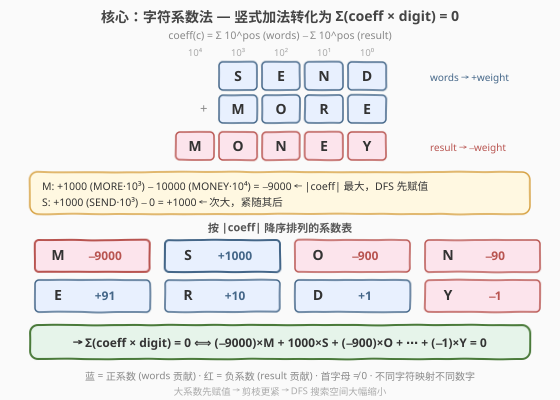
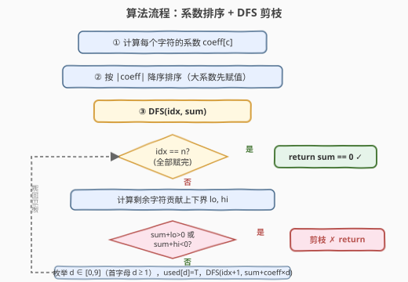
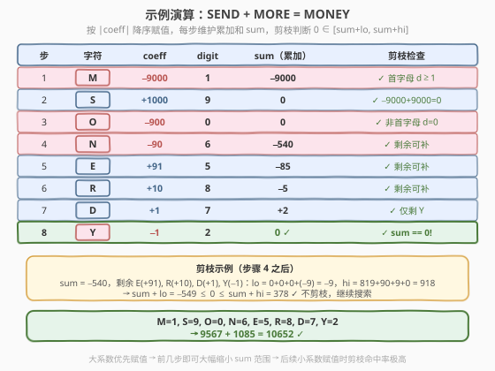

# 口算难题

- **题目名称**：口算难题
- **链接**：[1307. 口算难题](https://leetcode.cn/problems/verbal-arithmetic-puzzle/)
- **难度**：困难
- **标签**：回溯、DFS、数学

## 1. 题目概述

给你一个方程，左边用 `words` 表示，右边用 `result` 表示。你需要根据以下规则检查方程是否可解：

- 每个字符都会被解码成一位数字（0 - 9）。
- 每对不同的字符必须映射到不同的数字。
- 每个 `words[i]` 和 `result` 都会被解码成一个没有前导零的数字。
- 左侧数字之和（`words`）等于右侧数字（`result`）。

如果方程可解，返回 `True`，否则返回 `False`。

**示例 1**：

```text
输入：words = ["SEND","MORE"], result = "MONEY"
输出：true
解释：映射 S->9, E->5, N->6, D->7, M->1, O->0, R->8, Y->2
所以 "SEND" + "MORE" = "MONEY",  9567 + 1085 = 10652
```

**示例 2**：

```text
输入：words = ["SIX","SEVEN","SEVEN"], result = "TWENTY"
输出：true
解释：映射 S->6, I->5, X->0, E->8, V->7, N->2, T->1, W->3, Y->4
所以 "SIX" + "SEVEN" + "SEVEN" = "TWENTY",  650 + 68782 + 68782 = 138214
```

**示例 3**：

```text
输入：words = ["LEET","CODE"], result = "POINT"
输出：false
解释：不存在任何可能的映射满足该方程。
```

**约束条件**：

- `2 <= words.length <= 5`
- `1 <= words[i].length, results.length <= 7`
- `words[i], result` 只含有大写英文字母
- 表达式中使用的不同字符数最大为 10

> 💡 本题是经典的**覆面算**（Verbal Arithmetic / Cryptarithmetic）问题——将字母替换为数字使算式成立。不同字符最多 10 个、数字恰好 0-9 共 10 个，这意味着每个数字几乎都要被用到，搜索空间是 $10!$ 级别的排列。关键在于如何**高效剪枝**将搜索空间压缩到可接受范围。

---

## 2. 解题思路

### 2.1 暴力思路：全排列枚举

最直觉的做法：收集所有不同字符（最多 10 个），枚举 0-9 的所有排列，逐一检查是否满足方程。不同字符数 $n \le 10$ 时，全排列数为 $10! = 3{,}628{,}800$，每次验证需 $O(\text{总字符数})$，总时间约 $10^7$ 级别。

> ⚠️ 这个量级**勉强能过**但不够优雅——大量排列在很早的阶段就已经不可能满足方程，却被完整枚举后才排除。我们需要一种能在**赋值早期就判定不可行**并立即剪枝的策略。

### 2.2 核心观察：字符系数法



**关键转化**：将竖式加法等式改写为**线性方程**。每个字符根据其在 words 和 result 中出现的位置，拥有一个**系数**（权重）：

$$\text{coeff}(c) = \sum_{\text{words}} 10^{\text{pos}} - \sum_{\text{result}} 10^{\text{pos}}$$

其中 pos 是该字符在所在单词中从右数的位置（个位 = 0，十位 = 1，…）。words 中的出现贡献正权重，result 中的出现贡献负权重。

**方程变为**：

$$\sum_{c} \text{coeff}(c) \times \text{digit}(c) = 0$$

以 `SEND + MORE = MONEY` 为例：

| 字符 | 系数计算 | coeff |
|------|----------|-------|
| M | +1000 (MORE·10³) − 10000 (MONEY·10⁴) | **−9000** |
| S | +1000 (SEND·10³) | **+1000** |
| O | +100 (MORE·10²) − 1000 (MONEY·10³) | **−900** |
| N | +10 (SEND·10¹) − 100 (MONEY·10²) | **−90** |
| E | +100 (SEND·10²) + 1 (MORE·10⁰) − 10 (MONEY·10¹) | **+91** |
| R | +10 (MORE·10¹) | **+10** |
| D | +1 (SEND·10⁰) | **+1** |
| Y | −1 (MONEY·10⁰) | **−1** |

验证：$(−9000) \times 1 + 1000 \times 9 + (−900) \times 0 + (−90) \times 6 + 91 \times 5 + 10 \times 8 + 1 \times 7 + (−1) \times 2 = 0$ ✓

> 💡 **为什么这个转化有效？** 原始等式 $\sum \text{words} = \text{result}$ 等价于 $\sum \text{words} - \text{result} = 0$。将每个 word/result 按位展开为 $\sum 10^{\text{pos}} \times \text{digit}$，合并相同字符的项即得 $\sum \text{coeff}(c) \times \text{digit}(c) = 0$。这是一个**纯线性方程**，不涉及进位，简化了搜索。

### 2.3 算法流程图



**完整步骤**：

1. **计算系数**：遍历所有 words 和 result，按位累加每个字符的系数。
2. **排序**：按 $|\text{coeff}|$ **降序**排列字符。大系数字符对总和影响最大，先赋值能让剪枝更早生效。
3. **DFS 回溯**：依次为每个字符分配未使用的数字：
   - **首字母约束**：若字符是某单词/结果的首字母，数字 $\ge 1$（无前导零）。
   - **剪枝**：在每一步计算剩余未赋值字符的**贡献上下界** $[\text{lo}, \text{hi}]$，若 $\text{sum} + \text{lo} > 0$ 或 $\text{sum} + \text{hi} < 0$，则当前分支不可能使总和归零，立即剪枝。
   - **终止**：所有字符赋值完毕后，检查 $\text{sum} == 0$。

> ⚠️ **剪枝上下界的计算**（松界，不考虑数字互斥）：对剩余字符 $c$，系数为 $w$：
> - 非首字母：数字 $\in [0, 9]$，贡献 $\in [\min(0, 9w),\ \max(0, 9w)]$
> - 首字母：数字 $\in [1, 9]$，贡献 $\in [\min(w, 9w),\ \max(w, 9w)]$
>
> 累加所有剩余字符的 min/max 即得 $[\text{lo}, \text{hi}]$。这是**合法但宽松**的界——不考虑"不同字符需分配不同数字"的约束，因此不会误剪，只可能少剪。

### 2.4 示例演算

以 `SEND + MORE = MONEY` 为例，字符按 $|\text{coeff}|$ 降序排列为 `M, S, O, N, E, R, D, Y`：



**DFS 赋值轨迹**：

| 步 | 字符 | coeff | digit | sum（累加） | 剪枝检查 |
|----|------|-------|-------|-------------|----------|
| 1 | M | −9000 | 1 | −9000 | ✓ 首字母 d≥1 |
| 2 | S | +1000 | 9 | 0 | ✓ −9000+9000=0 |
| 3 | O | −900 | 0 | 0 | ✓ 非首字母 d=0 |
| 4 | N | −90 | 6 | −540 | ✓ 剩余可补 |
| 5 | E | +91 | 5 | −85 | ✓ 剩余可补 |
| 6 | R | +10 | 8 | −5 | ✓ 剩余可补 |
| 7 | D | +1 | 7 | +2 | ✓ 仅剩 Y |
| 8 | Y | −1 | 2 | **0** | ✓ **sum == 0!** |

**步骤 4 的剪枝细节**：此时 $\text{sum} = -540$，剩余 `E(+91), R(+10), D(+1), Y(−1)`：
- $\text{lo} = 0 + 0 + 0 + (−9) = −9$（每个正系数取 0，负系数取 9）
- $\text{hi} = 819 + 90 + 9 + 0 = 918$（每个正系数取 9，负系数取 0）
- $\text{sum} + \text{lo} = -549 \le 0 \le \text{sum} + \text{hi} = 378$ ✓ 不剪枝

> 💡 **为什么大系数优先？** M 的 $|\text{coeff}| = 9000$ 远大于其他字符。先确定 M=1 后，sum 直接跳到 $-9000$，后续字符的赋值空间被大幅压缩。若反过来先赋值小系数字符（如 Y），sum 几乎不变，剪枝条件 $0 \in [\text{sum}+\text{lo}, \text{sum}+\text{hi}]$ 几乎总成立，等于没有剪枝。

最终结果：`M=1, S=9, O=0, N=6, E=5, R=8, D=7, Y=2` → $9567 + 1085 = 10652$ ✓

---

## 3. 参考代码

### C++

```cpp
class Solution {
public:
    bool isSolvable(vector<string>& words, string result) {
        unordered_map<char, long long> coeff;
        unordered_set<char> lead;

        for (auto& w : words) {
            long long p = 1;
            for (int i = w.size() - 1; i >= 0; i--) {
                coeff[w[i]] += p;
                p *= 10;
            }
            lead.insert(w[0]);
        }
        long long p = 1;
        for (int i = result.size() - 1; i >= 0; i--) {
            coeff[result[i]] -= p;
            p *= 10;
        }
        lead.insert(result[0]);

        vector<pair<char, long long>> chars(coeff.begin(), coeff.end());
        sort(chars.begin(), chars.end(), [](auto& a, auto& b) {
            return abs(a.second) > abs(b.second);
        });

        int n = chars.size();
        vector<bool> used(10);

        function<bool(int, long long)> dfs = [&](int i, long long s) -> bool {
            if (i == n) return s == 0;

            long long lo = 0, hi = 0;
            for (int j = i; j < n; j++) {
                long long w = chars[j].second;
                if (lead.count(chars[j].first)) {
                    lo += min(w, w * 9);
                    hi += max(w, w * 9);
                } else {
                    lo += min(0LL, w * 9);
                    hi += max(0LL, w * 9);
                }
            }
            if (s + lo > 0 || s + hi < 0) return false;

            int d0 = lead.count(chars[i].first) ? 1 : 0;
            for (int d = d0; d <= 9; d++) {
                if (used[d]) continue;
                used[d] = true;
                if (dfs(i + 1, s + chars[i].second * d)) return true;
                used[d] = false;
            }
            return false;
        };

        return dfs(0, 0);
    }
};
```

### Python

```python
class Solution:
    def isSolvable(self, words: List[str], result: str) -> bool:
        coeff = {}
        lead = set()

        for w in words:
            p = 1
            for i in range(len(w) - 1, -1, -1):
                coeff[w[i]] = coeff.get(w[i], 0) + p
                p *= 10
            lead.add(w[0])

        p = 1
        for i in range(len(result) - 1, -1, -1):
            coeff[result[i]] = coeff.get(result[i], 0) - p
            p *= 10
        lead.add(result[0])

        chars = sorted(coeff.keys(), key=lambda c: abs(coeff[c]), reverse=True)
        n = len(chars)
        used = [False] * 10

        def dfs(i, s):
            if i == n:
                return s == 0

            lo = hi = 0
            for j in range(i, n):
                w = coeff[chars[j]]
                if chars[j] in lead:
                    lo += min(w, w * 9)
                    hi += max(w, w * 9)
                else:
                    lo += min(0, w * 9)
                    hi += max(0, w * 9)
            if s + lo > 0 or s + hi < 0:
                return False

            c = chars[i]
            d0 = 1 if c in lead else 0
            for d in range(d0, 10):
                if not used[d]:
                    used[d] = True
                    if dfs(i + 1, s + coeff[c] * d):
                        return True
                    used[d] = False
            return False

        return dfs(0, 0)
```

> 💡 **实现细节**：① 系数计算从右向左遍历，`p` 从 1 开始每次 ×10，对应 $10^0, 10^1, 10^2, \ldots$。② 排序用 `abs` 降序，让大系数字符先行。③ 剪枝界是**松界**——不考虑数字互斥，只看每个字符独立的最大/最小贡献，保证不会误剪。④ 首字母集合 `lead` 用 `unordered_set` / `set` 快速查询。

---

## 4. 复杂度分析

| 维度 | 复杂度 | 说明 |
|------|--------|------|
| **时间** | $O(n \times n!)$ 最坏，实际远优 | $n$ 为不同字符数（$\le 10$）。每层 DFS 计算 lo/hi 需 $O(n)$。剪枝大幅缩减实际搜索节点 |
| **空间** | $O(n)$ | coeff 表 + used 数组 + 递归栈，$n \le 10$ |

> ⚠️ **最坏情况分析**：$n = 10$ 时，无剪枝的 DFS 为 $10! \approx 3.6 \times 10^6$ 个叶子，每层 $O(n)$ 剪枝计算，总计约 $3.6 \times 10^7$ 次操作。实际中，大系数优先 + 上下界剪枝通常将搜索节点压缩到 $10^4$ 量级甚至更少。本题 LeetCode 时间限制宽松，$O(n \times n!)$ 可轻松通过。

---

## 5. 扩展：列进位 DFS（Column-based Carry）

除了系数法，覆面算还有另一种经典解法——**逐列进位 DFS**：

1. 将所有 words 和 result **右对齐**，从个位（最右列）向高位逐列处理。
2. 每一列收集所有出现在该列的字符（words 和 result）。words 字符的数字之和 + 来自低位的进位 = result 字符的数字 + 10 × 向高位的进位。
3. 对该列未赋值的字符尝试分配数字，利用**列和模 10** 约束进行剪枝：result 字符的数字必须等于 $(\sum \text{words digits} + \text{carry}) \bmod 10$。

**优势**：列和模 10 是极紧的约束——每列只有 0-9 共 10 种可能的结果数字，一旦 result 字符已赋值且不匹配，立即剪枝。

**劣势**：实现更复杂，需处理进位传递和跨列字符依赖（同一字符可能出现在多列）。

> 💡 **两种方法对比**：系数法将整个方程压缩为一个线性方程，剪枝基于**总和上下界**（全局但宽松）；列进位法利用**列级模 10 约束**（局部但极紧）。面试中推荐系数法——思路清晰、实现简洁，剪枝已足够高效。

---

## 6. 面试要点

1. **为什么将竖式加法转化为系数方程？**

   > 原始等式 $\sum \text{words} = \text{result}$ 等价于 $\sum \text{words} - \text{result} = 0$。按位展开后，同一字符在不同位置的贡献可合并为一个系数 $\text{coeff}(c) = \sum 10^{\text{pos}}(\text{words}) - \sum 10^{\text{pos}}(\text{result})$。方程变为 $\sum \text{coeff}(c) \times \text{digit}(c) = 0$，这是一个纯线性方程，消除了进位的复杂性，便于 DFS + 剪枝。

2. **为什么按 $|\text{coeff}|$ 降序排序字符？**

   > 大系数字符对总和影响最大。先赋值它们能让 sum 快速接近目标范围，使后续小系数字符的上下界剪枝更有效。若先赋值小系数字符，sum 几乎不变，剪枝条件 $0 \in [\text{sum}+\text{lo}, \text{sum}+\text{hi}]$ 几乎总成立，等于无剪枝。这是**变量排序**（variable ordering）思想在回溯中的典型应用。

3. **剪枝上下界是如何计算的？为什么是正确的？**

   > 对每个剩余字符，根据其系数正负和是否首字母，独立计算最大/最小贡献。正系数取最大数字（9）得到上界，取最小数字（0 或 1）得到下界；负系数相反。累加所有剩余字符的极值即得 $[\text{lo}, \text{hi}]$。这是**松界**——不考虑数字互斥（多个字符可能争用同一数字），因此只会少剪不会误剪，保证正确性。

4. **首字母不能为零的约束如何处理？**

   > 维护一个首字母集合 `lead`，包含每个 word 和 result 的第一个字符。DFS 枚举数字时，若当前字符在 `lead` 中，起始数字从 1 开始而非 0。剪枝计算 lo/hi 时也相应调整：首字母的数字范围是 $[1, 9]$ 而非 $[0, 9]$。

5. **如果不同字符超过 10 个怎么办？**

   > 直接返回 `false`。数字只有 0-9 共 10 个，若不同字符超过 10 个，必然有两个字符映射到同一数字，违反"不同字符映射不同数字"的约束。本题约束保证最多 10 个不同字符，所以无需额外处理，但面试中可主动提出这一边界。

> 💡 **一句话总结**：1307 的核心是**系数法 + DFS 剪枝**——将竖式加法转化为线性方程 $\sum \text{coeff} \times \text{digit} = 0$，按 $|\text{coeff}|$ 降序赋值，利用剩余贡献上下界剪枝。大系数优先让 sum 早期即被锁定在窄范围，后续小系数赋值时剪枝命中率极高，实际搜索节点远小于 $10!$。

---

## 7. 同类练习题

- [37. 解数独](https://leetcode.cn/problems/sudoku-solver/)（[题解](../0001-0100/37_解数独.md)）：回溯 + 三表判重剪枝，同样是"为符号分配数字使约束满足"的 CSP 问题
- [51. N 皇后](https://leetcode.cn/problems/n-queens/)（[题解](../0001-0100/51_N皇后.md)）：回溯 + 列/对角线剪枝，变量排序与剪枝策略的经典应用
- [47. 全排列 II](https://leetcode.cn/problems/permutations-ii/)（[题解](../0001-0100/47_全排列II.md)）：回溯 + 排序同层剪枝去重，数字排列分配的基础模板
- [282. 给表达式添加运算符](https://leetcode.cn/problems/expression-add-operators/)（[题解](../0201-0300/282_给表达式添加运算符.md)）：回溯构造等式使结果等于目标值，同样是"搜索数字/符号分配使等式成立"
- [79. 单词搜索](https://leetcode.cn/problems/word-search/)（[题解](../0001-0100/79_单词搜索.md)）：DFS 回溯 + 路径标记，回溯剪枝的基础范式
