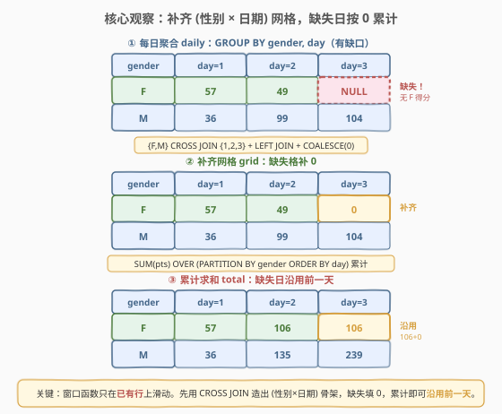
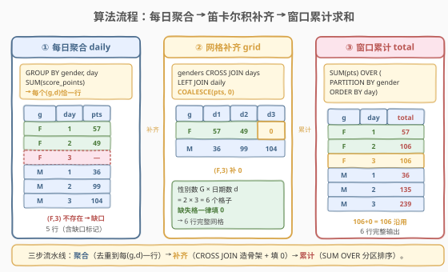
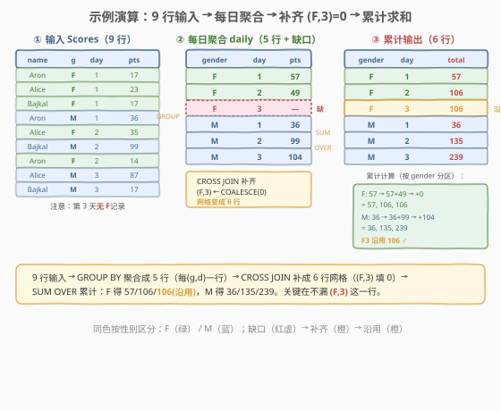

# 不同性别每日分数总计

- **题目名称**：不同性别每日分数总计
- **链接**：[1308. 不同性别每日分数总计](https://leetcode.cn/problems/running-total-for-different-genders/)
- **难度**：中等
- **标签**：数据库、SQL、窗口函数、累计求和、SUM OVER、CROSS JOIN、补齐网格

## 1. 题目概述

给定 `Scores` 表，每行记录一名选手在某一天的得分。性别 `gender` 取值为 `'F'` 或 `'M'`。请编写 SQL 查询，报告**每个性别在每一天的累计总分**——某性别在某天的累计总分 = 该性别在该天及之前所有得分之和。结果按 `gender` 升序、`day` 升序排列。

> ⚠️ 关键陷阱：输出必须包含**所有出现过的日期**与**每个性别**的组合，即使某性别在某天没有任何得分记录——此时该天的当日增量为 0，累计总分沿用前一天的结果。这正是本题区别于「裸 `SUM() OVER`」的难点：需要先**补齐缺失的 (性别, 日期) 网格**。

**表结构**：

```text
Table: Scores
+-------------+---------+
| Column Name | Type    |
+-------------+---------+
| player_name | varchar |  ← 选手名
| gender      | varchar |  ← 'F' 或 'M'
| day         | int     |  ← 比赛日
| score_points| int     |  ← 当日得分
+-------------+---------+
```

- 主键为 `(gender, day, player_name)`，即同一性别同一天可有多名选手得分
- `gender` 取值仅为 `'F'`、`'M'`

**示例 1**：

```text
输入：
Scores 表：
+-------------+--------+-----+--------------+
| player_name | gender | day | score_points |
+-------------+--------+-----+--------------+
| Aron        | F      | 1   | 17           |
| Alice       | F      | 1   | 23           |
| Bajkal      | F      | 1   | 17           |
| Aron        | M      | 1   | 36           |
| Alice       | F      | 2   | 35           |
| Bajkal      | M      | 2   | 99           |
| Aron        | F      | 2   | 14           |
| Alice       | M      | 3   | 87           |
| Bajkal      | M      | 3   | 17           |
+-------------+--------+-----+--------------+

输出：
+--------+-----+-------+
| gender | day | total |
+--------+-----+-------+
| F      | 1   | 57    |
| F      | 2   | 106   |
| F      | 3   | 106   |
| M      | 1   | 36    |
| M      | 2   | 135   |
| M      | 3   | 239   |
+--------+-----+-------+
```

**解释**：

| gender | day | 当日得分合计 | 累计计算 | total |
|--------|-----|-------------|----------|-------|
| F | 1 | 17+23+17 = 57 | 57 | 57 |
| F | 2 | 35+14 = 49 | 57+49 = 106 | 106 |
| F | 3 | 无 F 得分 → 0 | 106+0 = 106 | 106 |
| M | 1 | 36 | 36 | 36 |
| M | 2 | 99 | 36+99 = 135 | 135 |
| M | 3 | 87+17 = 104 | 135+104 = 239 | 239 |

> 💡 注意第 3 行：第 3 天没有任何 `gender='F'` 的记录，但输出仍需包含 `(F, 3)`，其累计总分沿用第 2 天的 106。若漏掉这一行，结果就会少一行。

**约束条件**：

- `gender` 仅取 `'F'`、`'M'`
- `day` 为正整数
- `1 <= score_points <= 1000`
- 结果按 `gender` 升序、`day` 升序排列
- 输出列名：`gender`、`day`、`total`

---

## 2. 解题思路

### 2.1 暴力思路：直接套窗口函数

最直觉的写法是一句窗口函数搞定累计求和：

```sql
SELECT gender, day,
       SUM(score_points) OVER (PARTITION BY gender ORDER BY day) AS total
FROM Scores
ORDER BY gender, day;
```

但这里有个**致命问题**：`Scores` 表里根本没有 `(F, 3)` 这一行（第 3 天没有女性得分记录）。窗口函数只能在**已存在的行**上滑动——没有行就没有输出。直接套用会丢失 `(F, 3)` 这一行，结果只有 5 行而非 6 行。

> ⚠️ 窗口函数不会「凭空生成」缺失的行。它只能在已有数据行上计算。要输出某性别在「无记录日」的累计总分，必须先把这个缺口**补出来**。

### 2.2 核心观察：先补齐 (性别 × 日期) 网格，再累计求和



关键洞察分两步：

**第一步：构造完整的 (gender, day) 网格**。题目要求「每个性别在每一天」都要有一行输出，其中「每一天」指**表中出现过的所有日期**。因此输出行数 = (性别数) × (不同日期数)。需要用 `CROSS JOIN` 把「所有性别」与「所有日期」做笛卡尔积，得到完整网格：

$$
\text{Grid} = \{\, g \} \times \{\, d \,\}, \quad g \in \text{DISTINCT gender},\ d \in \text{DISTINCT day}
$$

**第二步：补齐缺失日的当日增量**。对网格中每个 `(gender, day)`，用 `LEFT JOIN` 关联「按性别+日期聚合后的当日合计」，缺失的格子用 `COALESCE(..., 0)` 填 0。再对这个补齐后的网格做 `SUM() OVER (PARTITION BY gender ORDER BY day)` 累计求和——由于缺失日已填 0，累计值自然**沿用前一天**。

> 💡 **为什么要先聚合再补齐？** 原始 `Scores` 同一 `(gender, day)` 可能有多行（多名选手同日得分）。若直接拿原始行去 `CROSS JOIN` 补齐，每对 `(gender, day)` 会重复出现多次，累计求和会重复计算。因此必须先 `GROUP BY gender, day` 聚合成「每日每性别合计」，得到每个 `(gender, day)` 恰一行的中间表，再与网格 `LEFT JOIN`。

### 2.3 算法流程图



**三步流水线**：

1. **每日聚合** `daily`：`GROUP BY gender, day` 求 `SUM(score_points)`，得到每个 `(gender, day)` 恰一行的当日合计。
2. **网格补齐** `grid`：`genders CROSS JOIN days` 生成所有 `(gender, day)` 组合，`LEFT JOIN daily` 取当日合计，缺失用 0 填。
3. **窗口累计**：对补齐后的网格 `SUM(pts) OVER (PARTITION BY gender ORDER BY day)` 累计求和，得到 `total`。

> 💡 **`ORDER BY day` 的默认框架**：`SUM() OVER (PARTITION BY gender ORDER BY day)` 隐含框架为 `RANGE BETWEEN UNBOUNDED PRECEDING AND CURRENT ROW`，即「从分区首行累加到当前行」——正是累计求和的语义。由于 `grid` 中每个 `(gender, day)` 恰一行，`day` 在分区内无重复，`RANGE` 与 `ROWS` 等价。

### 2.4 示例演算

以示例 1 数据，跟踪「聚合 → 补齐 → 累计」全过程：



**步骤 ①：每日聚合 `daily`**

| gender | day | SUM(score_points) |
|--------|-----|-------------------|
| F | 1 | 57 |
| M | 1 | 36 |
| F | 2 | 49 |
| M | 2 | 99 |
| M | 3 | 104 |

注意 `(F, 3)` 在此表里**不存在**（第 3 天无女性得分）。

**步骤 ②：`CROSS JOIN` 补齐 + `LEFT JOIN` 填 0**

`{F, M} × {1, 2, 3}` 共 6 个格子，`LEFT JOIN daily` 后 `(F, 3)` 取不到值，`COALESCE` 填 0：

| gender | day | pts |
|--------|-----|-----|
| F | 1 | 57 |
| F | 2 | 49 |
| F | 3 | **0**（补齐） |
| M | 1 | 36 |
| M | 2 | 99 |
| M | 3 | 104 |

**步骤 ③：`SUM(pts) OVER (PARTITION BY gender ORDER BY day)` 累计**

| gender | day | pts | 累计计算 | total |
|--------|-----|-----|----------|-------|
| F | 1 | 57 | 57 | 57 |
| F | 2 | 49 | 57+49 | 106 |
| F | 3 | 0 | 106+0 | 106 |
| M | 1 | 36 | 36 | 36 |
| M | 2 | 99 | 36+99 | 135 |
| M | 3 | 104 | 135+104 | 239 |

> 💡 **验证**：`(F, 3)` 的 `total = 106` 恰为前一天 `(F, 2)` 的累计值——补 0 后累计自然沿用，无需特殊处理。这正是「补齐网格」的核心收益。

---

## 3. 参考代码

### MySQL（解法 A：窗口函数 + CROSS JOIN 网格补齐，推荐）

```sql
# 1308. 不同性别每日分数总计
# 思路：每日聚合 → genders×days 笛卡尔积补齐网格 → LEFT JOIN 取当日合计(缺失填0) → 窗口累计求和
WITH
days    AS (SELECT DISTINCT day FROM Scores),
genders AS (SELECT DISTINCT gender FROM Scores),
daily   AS (
    SELECT gender, day, SUM(score_points) AS pts
    FROM Scores
    GROUP BY gender, day
)
SELECT g.gender,
       d.day,
       SUM(COALESCE(p.pts, 0)) OVER (PARTITION BY g.gender ORDER BY d.day) AS total
FROM genders g
CROSS JOIN days d
LEFT JOIN daily p
       ON p.gender = g.gender
      AND p.day    = d.day
ORDER BY g.gender, d.day;
```

> 💡 **写法要点**：
> - **`days` / `genders`**：分别取去重后的日期与性别，作为网格的两条边。
> - **`daily`**：先 `GROUP BY gender, day` 聚合，保证每个 `(gender, day)` 恰一行，避免补齐时重复计算。
> - **`CROSS JOIN`**：生成 $|\text{性别}| \times |\text{日期}|$ 个完整组合，覆盖所有「无记录日」。
> - **`LEFT JOIN daily` + `COALESCE(..., 0)`**：缺失日的当日增量填 0，使累计沿用前一天。
> - **`SUM(...) OVER (PARTITION BY gender ORDER BY day)`**：分区内按日期累计求和，框架隐含 `RANGE UNBOUNDED PRECEDING .. CURRENT ROW`。
> - 需 MySQL 8.0+（窗口函数自 8.0 起支持）。

### MySQL（解法 B：相关子查询，不依赖窗口函数）

```sql
SELECT g.gender,
       d.day,
       (SELECT COALESCE(SUM(s2.score_points), 0)
        FROM Scores s2
        WHERE s2.gender = g.gender
          AND s2.day   <= d.day) AS total
FROM (SELECT DISTINCT gender FROM Scores) g
CROSS JOIN (SELECT DISTINCT day FROM Scores) d
ORDER BY g.gender, d.day;
```

> 💡 **写法要点**：
> - **`CROSS JOIN` 生成网格**：与解法 A 相同，先补出所有 `(gender, day)` 组合。
> - **相关子查询**：对每个网格格子的 `(gender, day)`，回 `Scores` 表求该性别 `day <= 当前日` 的得分总和。子查询引用外层的 `g.gender`、`d.day`，故每行触发一次。
> - **`COALESCE(..., 0)`**：某性别在当前日及之前若完全无记录，子查询 `SUM` 返回 `NULL`，填 0。
> - 兼容 MySQL 5.7 等不支持窗口函数的老版本，但每个网格格子都触发一次聚合扫描，复杂度 $O(|grid| \cdot n)$，性能远逊于解法 A。
> - ⚠️ 子查询内 `s2.day <= d.day` 是「累计」语义的关键——包含当前日及之前所有日，而非仅当日。

### Python（pandas）

```python
import pandas as pd

def running_total(scores: pd.DataFrame) -> pd.DataFrame:
    days = sorted(scores['day'].unique())
    genders = sorted(scores['gender'].unique())
    grid = pd.MultiIndex.from_product([genders, days], names=['gender', 'day']).to_frame(index=False)
    daily = scores.groupby(['gender', 'day'], as_index=False)['score_points'].sum()
    merged = grid.merge(daily, on=['gender', 'day'], how='left').fillna({'score_points': 0})
    merged = merged.sort_values('day')
    merged['total'] = merged.groupby('gender')['score_points'].cumsum()
    result = merged[['gender', 'day', 'total']].sort_values(['gender', 'day']).reset_index(drop=True)
    return result
```

> 💡 **pandas 对照**：
> - `MultiIndex.from_product([genders, days])` 对应 `genders CROSS JOIN days`——生成完整网格。
> - `groupby(['gender','day']).sum()` 对应 `daily` 聚合；`merge(..., how='left').fillna(0)` 对应 `LEFT JOIN + COALESCE`。
> - `groupby('gender')['score_points'].cumsum()` 对应 `SUM() OVER (PARTITION BY gender ORDER BY day)`——`cumsum` 即累计求和窗口函数的 pandas 翻译。
> - ⚠️ `cumsum` 前需 `sort_values('day')`，保证按日期升序累加；最终再按 `gender, day` 排序输出。

---

## 4. 复杂度分析

| 维度 | 解法 A（窗口 + 网格补齐） | 解法 B（相关子查询） | pandas |
|------|--------------------------|---------------------|--------|
| **时间** | $O(n + G \cdot d \log(G \cdot d))$ | $O(G \cdot d \cdot n)$ | $O(n + G \cdot d \log(G \cdot d))$ |
| **空间** | $O(n + G \cdot d)$ | $O(G \cdot d)$ | $O(n + G \cdot d)$ |
| **依赖** | MySQL 8.0+（窗口函数） | 兼容老版本 | pandas |
| **推荐度** | ✓ **首选** | △ 兼容老版本 | ✓ pandas 环境 |

> - $n$ = `Scores` 表行数，$G$ = 不同性别数（本题 $G=2$），$d$ = 不同日期数
> - **解法 A**：`daily` 聚合一次扫描 $O(n)$；网格规模 $G \cdot d$；窗口函数按 `gender` 分区、`day` 排序，排序成本 $O(G \cdot d \log d)$，整体 $O(n + G \cdot d \log d)$。空间存储 `daily` 与网格 $O(n + G \cdot d)$。
> - **解法 B**：网格 $G \cdot d$ 个格子，每格触发一次相关子查询扫描 `Scores`（$O(n)$），总 $O(G \cdot d \cdot n)$。空间仅存网格 $O(G \cdot d)$。
> - **索引优化**：在 `(gender, day)` 上建复合索引可加速解法 B 的子查询范围扫描与解法 A 的聚合；解法 A 的窗口排序也能受益于 `(gender, day)` 有序。

---

## 5. 扩展：「补齐网格」模式与累计求和家族

### 5.1 窗口函数累计求和的两种形态

`SUM() OVER (PARTITION BY ... ORDER BY ...)` 是 SQL 累计求和的招牌写法，但根据「数据是否连续」分两种情形：

| 情形 | 数据特点 | 是否需补齐 | 示例 |
|------|---------|-----------|------|
| **连续型** | 每个分区键的每个排序键都有行 | 否 | 534 每玩家每天累计 |
| **稀疏型** | 分区键在某些排序键上无行 | **是** | 1308 某性别某天无得分 |

> 💡 1308 属于**稀疏型**：`(F, 3)` 缺失，必须补齐。判断口诀：**「输出行数 = 分区数 × 排序键数」→ 需补齐**；**「输出行数 = 原表行数」→ 直接窗口函数**。1308 输出 6 行（= 2 性别 × 3 日期，大于原表任一性别的行数），故需补齐；534 输出行数 = 原表行数，直接 `SUM OVER` 即可。

### 5.2 「补齐网格」泛化模板

所有「每个分组在每个时间点都要有值，缺失沿用/填 0」的需求都套同一模板：

```sql
-- 泛化模板：分组 × 时间点 网格补齐 + 窗口累计
WITH
time_points AS (SELECT DISTINCT <time_col> FROM <table>),
groups      AS (SELECT DISTINCT <group_col> FROM <table>),
daily       AS (
    SELECT <group_col>, <time_col>, SUM(<val_col>) AS v
    FROM <table> GROUP BY <group_col>, <time_col>
)
SELECT g.<group_col>, t.<time_col>,
       SUM(COALESCE(d.v, 0)) OVER (PARTITION BY g.<group_col> ORDER BY t.<time_col>) AS running_total
FROM groups g
CROSS JOIN time_points t
LEFT JOIN daily d ON d.<group_col> = g.<group_col> AND d.<time_col> = t.<time_col>
ORDER BY g.<group_col>, t.<time_col>;
```

常见变体：

| 需求 | 聚合函数 | 累计函数 |
|------|---------|---------|
| 累计得分（本题） | `SUM(score_points)` | `SUM() OVER (... ORDER BY day)` |
| 累计计数 | `COUNT(*)` | `SUM() OVER (... ORDER BY day)` |
| 累计最大值 | `MAX(score_points)` | `MAX() OVER (... ORDER BY day)` |

### 5.3 不补齐会怎样？

若直接对原表 `Scores` 套 `SUM() OVER (PARTITION BY gender ORDER BY day)`，输出仅 5 行（缺 `(F, 3)`）：

| gender | day | total |
|--------|-----|-------|
| F | 1 | 57 |
| F | 2 | 106 |
| M | 1 | 36 |
| M | 2 | 135 |
| M | 3 | 239 |

少掉 `(F, 3, 106)` 这一行——窗口函数只在已有行上滑动，无法为「不存在的日期」生成输出。补齐网格的本质是**人为插入这些缺失行**，让窗口函数有「落脚点」可累计。

---

## 6. 面试要点

1. **为什么不能直接 `SUM() OVER (PARTITION BY gender ORDER BY day)`？**

   > 因为 `Scores` 表里没有 `(F, 3)` 这一行（第 3 天无女性得分）。窗口函数只在**已存在的行**上滑动，没有行就没有输出。直接套用会丢失 `(F, 3)` 这一行，输出 5 行而非 6 行。必须先用 `CROSS JOIN` 补齐 `(性别 × 日期)` 网格，缺失日填 0，再做累计。

2. **`CROSS JOIN` 在这里的作用是什么？为什么不能只用 `LEFT JOIN`？**

   > `CROSS JOIN` 生成「所有性别」与「所有日期」的笛卡尔积，得到完整的 $G \times d$ 个 `(gender, day)` 组合——这是补齐缺失行的「骨架」。若只对原表 `LEFT JOIN`，缺失的 `(F, 3)` 根本不存在于左表，`LEFT JOIN` 无法凭空补出。必须先用 `CROSS JOIN` 造出骨架，再 `LEFT JOIN daily` 取当日合计。

3. **为什么要先 `GROUP BY gender, day` 聚合，再补齐？**

   > 原始 `Scores` 同一 `(gender, day)` 可能有多行（多名选手同日得分）。若直接拿原始行去补齐，每对 `(gender, day)` 会重复出现多次，`SUM() OVER` 累计时会重复计算。先 `GROUP BY gender, day` 聚合，保证每个 `(gender, day)` 恰一行，累计才准确。

4. **`COALESCE(p.pts, 0)` 里的 0 有什么作用？去掉会怎样？**

   > 缺失日（如 `(F, 3)`）在 `LEFT JOIN` 后 `p.pts` 为 `NULL`。`SUM` 聚合时会忽略 `NULL`，单行 `NULL` 的 `SUM` 结果为 `NULL`，导致 `(F, 3)` 的 `total` 变成 `NULL` 而非 106。`COALESCE(..., 0)` 把 `NULL` 转 0，使累计沿用前一天。去掉后 `(F, 3)` 行的 `total` 会是 `NULL`。

5. **如果数据库不支持窗口函数，如何实现累计求和？**

   > 用解法 B 的相关子查询：对网格每个 `(gender, day)`，子查询 `SELECT SUM(score_points) FROM Scores WHERE gender = g.gender AND day <= d.day`。`day <= d.day` 是「累计」语义的关键（包含当前日及之前所有日）。兼容老版本但 $O(G \cdot d \cdot n)$ 性能差。也可用自连接 + `GROUP BY`，但写法更繁琐。

> 💡 **一句话总结**：1308 是 SQL **「补齐网格 + 窗口累计」招牌题**——核心难点不在 `SUM() OVER`，而在意识到「某性别某天无记录」时输出仍需该行。解法分三步：`GROUP BY` 每日聚合 → `CROSS JOIN` 补齐 `(性别 × 日期)` 网格 + `COALESCE` 填 0 → `SUM() OVER (PARTITION BY gender ORDER BY day)` 累计求和。判断口诀：**输出行数 = 分区数 × 排序键数 → 需补齐**。

---

## 7. 同类练习题

- [534. 游戏玩法分析 III](https://leetcode.cn/problems/game-play-analysis-iii/)（[题解](../0501-0600/534_游戏玩法分析III.md)）：`SUM() OVER (PARTITION BY player_id ORDER BY event_date)` 每玩家每天累计——**连续型**累计求和，每个 (玩家, 日期) 都有行，无需补齐，对照理解 1308 为何需补齐
- [1204. 最后一个能进入巴士的人](https://leetcode.cn/problems/last-person-to-fit-in-the-bus/)（[题解](../1201-1300/1204_最后一个能进入巴士的人.md)）：`SUM(turn) OVER (ORDER BY turn)` 全局累计 + 找首个超阈值行，累计求和的另一应用场景
- [1303. 求团队人数](https://leetcode.cn/problems/find-the-team-size/)（[题解](../1301-1400/1303_求团队人数.md)）：`COUNT(*) OVER (PARTITION BY team_id)` 聚合不收缩，窗口函数入门，承接「PARTITION BY 分区」语义
- [1174. 即时食物配送 II](https://leetcode.cn/problems/immediate-food-delivery-ii/)（[题解](../1101-1200/1174_即时食物配送II.md)）：`GROUP BY customer_id + MIN(order_date)` 两步聚合，对照「GROUP BY 收缩」与窗口函数「不收缩」的边界
- [180. 连续出现的数字](https://leetcode.cn/problems/consecutive-numbers/)（[题解](../0101-0200/180_连续出现的数字.md)）：自连接找连续行，另一种「在已有行上滑动」的窗口/自连接思路
