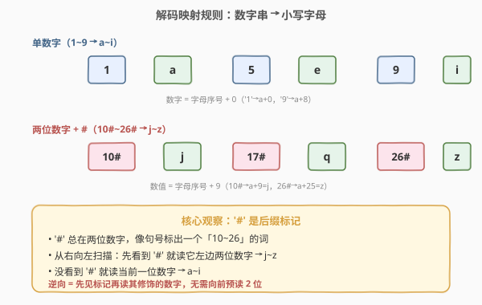
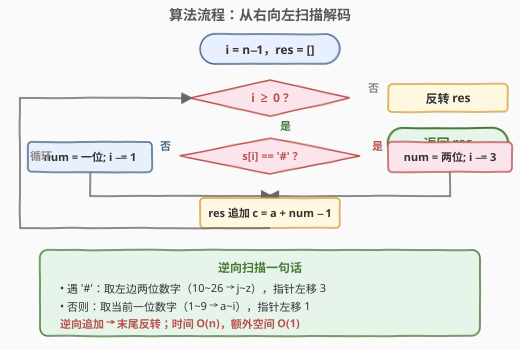
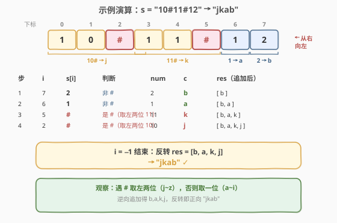

# 解码字母到整数映射

- **题目名称**：解码字母到整数映射
- **链接**：[1309. 解码字母到整数映射](https://leetcode.cn/problems/decrypt-string-from-alphabet-to-integer-mapping/)
- **难度**：简单
- **标签**：字符串、模拟、映射

## 1. 题目概述

给你一个字符串 `s`，它由数字（`'0'` - `'9'`）和 `'#'` 组成。按下述规则将 `s` 映射为小写英文字母：

- 字符 `'a'` - `'i'` 分别用 `'1'` - `'9'` 表示（**单数字**）。
- 字符 `'j'` - `'z'` 分别用 `'10#'` - `'26#'` 表示（**两位数字 + `#`**）。

返回映射之后形成的新字符串。题目数据保证映射始终唯一。

**示例 1**：

```text
输入：s = "10#11#12"
输出："jkab"
解释："j" -> "10#" ，"k" -> "11#" ，"a" -> "1" ，"b" -> "2"。
```

**示例 2**：

```text
输入：s = "1326#"
输出："acz"
解释："a" -> "1" ，"c" -> "3" ，"z" -> "26#"。
```

**示例 3**：

```text
输入：s = "25#"
输出："y"
```

**约束条件**：

- `1 <= s.length <= 1000`
- `s[i]` 只包含数字（`'0'`-`'9'`）和 `'#'` 字符。
- `s` 是映射始终存在的有效字符串。

> 💡 难点不在映射本身，而在**如何切分**：同一个 `'1'`，可能是字母 `'a'`（单数字），也可能是 `'10#'`/`'11#'`/... 的一部分。关键在于 `#` 这个**后缀标记**——它告诉我们前面的两位数字是一个整体。

---

## 2. 解题思路

### 2.1 暴力思路：枚举 17 个 `#` 模式串替换

一种直觉做法：把 `10#`~`26#` 这 17 个模式串依次在 `s` 中查找并替换为对应字母。例如先替换 `"26#"`→`'z'`、再替换 `"25#"`→`'y'`……最后剩下的单数字 `'1'`~`'9'` 再逐一换成 `'a'`~`'i'`。

这种写法能过，但有缺点：

- **需要 17 趟扫描**（或维护一张候选表），逻辑分散；
- **替换会改变字符串长度与下标**，链式替换时易出错（比如替换后的字母恰好是数字？本题不会，但思路不干净）；
- 本质是「先处理复杂模式，再兜底简单模式」的两阶段策略，没有抓住 `#` 的结构含义。

### 2.2 核心观察：`#` 是后缀标记 → 逆向扫描



关键观察：`#` **总在两位数字之后**，像一个句号标出一个「10~26」的词。这意味着：

- 看到 `#`，就知道它**左边紧邻的两位数字**是一个整体（`10`~`26` → `j`~`z`）；
- 没看到 `#`，当前字符就是单数字（`1`~`9` → `a`~`i`）。

那么**从右向左扫描**最为自然：先看到标记，再读它修饰的数字——**无需向前预读 2 位**。具体：

- 若 `s[i] == '#'`：取 `s[i-2]`、`s[i-1]` 两位数字组成 `num`（10~26），输出字母 `'a' + num - 1`，指针左移 3；
- 否则：取 `s[i]` 一位数字 `num`（1~9），输出 `'a' + num - 1`，指针左移 1。

> 💡 **为什么逆向免预读？** 正向扫描时，看到 `'1'` 你不知道它是 `'a'` 还是 `'10#'` 的开头，必须**往后看 2 位**确认有没有 `#`。逆向扫描时，`#` 是后缀，先于它修饰的数字出现——**当前字符是 `#` 还是非 `#` 直接决定取几位**，决策无歧义。

> ⚠️ 逆向扫描是「先产出后反转」：因为从右往左得到的字母序列顺序是反的，最后需 `reverse` 一次。若不想反转，可改用正向预读（见方法二）。

### 2.3 算法流程图



外层用一个 `while` 循环维护指针 `i`（从 `n-1` 递减）：每次按 `s[i]` 是否为 `#` 二分决策，取对应位数的数字、追加字母、移动指针；`i < 0` 时退出循环，反转结果即得答案。

### 2.4 示例演算



以 `s = "10#11#12"` 为例，从右端 `i = 7` 开始：

| 步 | i | s[i] | 判断 | num | 字母 c | res（追加后） |
|----|----|------|------|-----|--------|---------------|
| 1 | 7 | `2` | 非 `#` | 2 | `b` | `[b]` |
| 2 | 6 | `1` | 非 `#` | 1 | `a` | `[b, a]` |
| 3 | 5 | `#` | 是 `#`，取左两位 `11` | 11 | `k` | `[b, a, k]` |
| 4 | 2 | `#` | 是 `#`，取左两位 `10` | 10 | `j` | `[b, a, k, j]` |

`i = -1` 结束，反转 `[b, a, k, j]` → **`"jkab"`** ✓

- 单数字（蓝色格 `1`、`2`）：`num = s[i] - '0'`，字母 = `'a' + num - 1`；
- `#` 组（橙色两位 + 粉色 `#`）：`num = s[i-2..i-1]`，字母 = `'a' + num - 1`（`10`→`j`、`11`→`k`）。

---

## 3. 参考代码

### 方法一：从右向左扫描（推荐）

### C++

```cpp
class Solution {
public:
    string freqAlphabets(string s) {
        string res;
        for (int i = s.size() - 1; i >= 0;) {
            int num;
            if (s[i] == '#') {
                num = (s[i - 2] - '0') * 10 + (s[i - 1] - '0');
                i -= 3;
            } else {
                num = s[i] - '0';
                i -= 1;
            }
            res.push_back('a' + num - 1);
        }
        reverse(res.begin(), res.end());
        return res;
    }
};
```

### Python

```python
class Solution:
    def freqAlphabets(self, s: str) -> str:
        res = []
        i = len(s) - 1
        while i >= 0:
            if s[i] == '#':
                num = int(s[i - 2:i])
                res.append(chr(ord('a') + num - 1))
                i -= 3
            else:
                num = ord(s[i]) - ord('0')
                res.append(chr(ord('a') + num - 1))
                i -= 1
        return ''.join(res[::-1])
```

> 💡 **细节**：逆向扫描遇 `#` 时访问 `s[i-2]`、`s[i-1]`——因为输入保证合法，`#` 前必有两位数字，故 `i-2 >= 0` 必然成立，无需额外越界判断。字母统一用 `'a' + num - 1`（`num=1`→`a`，`num=26`→`z`），两类分支共享同一映射公式，仅 `num` 的取法不同。

### 方法二：从左向右预读（向前看 2 位）

> 💡 **另一思路**：正向扫描，看到数字时**往后看 2 位**：若 `s[i+2] == '#'`，则当前两位是 `10#`~`26#`，跳 3 位；否则是单数字，跳 1 位。无需末尾反转，但需要一次 `i+2 < n` 的越界预读。

### C++

```cpp
class Solution {
public:
    string freqAlphabets(string s) {
        string res;
        int n = s.size();
        for (int i = 0; i < n;) {
            int num;
            if (i + 2 < n && s[i + 2] == '#') {
                num = (s[i] - '0') * 10 + (s[i + 1] - '0');
                i += 3;
            } else {
                num = s[i] - '0';
                i += 1;
            }
            res.push_back('a' + num - 1);
        }
        return res;
    }
};
```

### Python

```python
class Solution:
    def freqAlphabets(self, s: str) -> str:
        res = []
        i, n = 0, len(s)
        while i < n:
            if i + 2 < n and s[i + 2] == '#':
                num = int(s[i:i + 2])
                i += 3
            else:
                num = ord(s[i]) - ord('0')
                i += 1
            res.append(chr(ord('a') + num - 1))
        return ''.join(res)
```

> ⚠️ 方法二的预读条件 `i + 2 < n` 不可写成 `i + 2 <= n - 1` 之外的省略：当 `i` 位于末两位时，`s[i+2]` 越界，必须先用 `i + 2 < n` 守门，再读 `s[i+2]`。C++ 中 `s[s.size()]` 是未定义行为，越界守门尤其重要。

---

## 4. 复杂度分析

| 维度 | 方法一（逆向扫描） | 方法二（正向预读） |
|------|-------------------|-------------------|
| **时间** | $O(n)$ | $O(n)$ |
| **空间** | $O(n)$（输出字符串） | $O(n)$（输出字符串） |
| **额外空间** | $O(1)$ | $O(1)$ |

> 两种方法都只对字符串做一遍遍历，每个字符至多访问一次（方法一的两位前缀在 `#` 分支里被一起读取，与方法二一样总访问量 $O(n)$）。输出字符串本身占 $O(n)$ 空间，但这是题目要求的返回值，不计入额外空间；两种方法均无辅助数据结构，额外空间 $O(1)$。方法一末尾的 `reverse` 是原地操作，不增加额外空间。

---

## 5. 面试要点

1. **为什么从右向左扫描比从左向右更优雅？**

   > `#` 是**后缀**标记，逆向扫描时先遇到 `#` 再读它修饰的两位数字——当前字符是 `#` 还是非 `#` 直接决定取几位，决策无歧义，无需预读。正向扫描看到数字时不知道它是单数字还是 `XY#` 的开头，必须往后看 2 位确认。逆向用「后缀先现」换掉了「前缀预读」。

2. **逆向扫描时 `s[i-2]` 不会越界吗？**

   > 题目保证 `s` 是有效映射字符串，故每个 `#` 前必有两个数字，`i >= 2` 在 `s[i] == '#'` 时必然成立，`i-2 >= 0`。若不保证合法，需加 `i >= 2` 守门并处理非法输入。

3. **方法一为什么需要末尾反转？能否避免？**

   > 逆向扫描产出的字母顺序与原串相反（先产出右端字母），故需 `reverse`。避免反转的办法就是方法二：正向扫描直接按序产出。两种写法等价，时间空间同为 $O(n)$/$O(1)$，按个人偏好选择即可。

4. **`#` 为何设计成后缀而非前缀（如 `#10`）？**

   > 后缀 `10#` 让单数字 `1`~`9` 无歧义——任何不以 `#` 结尾的数字段都是单数字。若改成前缀 `#10`，则 `1` 开头的串需先判断是不是 `#10` 的残段，反而复杂。后缀设计是本题「逐位可判定」的根源。

5. **字母映射公式 `'a' + num - 1` 的依据？**

   > `num` 即字母在字母表中的 1-indexed 序号：`1`→`a`、`9`→`i`、`10`→`j`、`26`→`z`。转 0-indexed 只需减 1，故 `chr = 'a' + (num - 1)`。两类分支（单数字、两位数字）共享同一公式，代码可合并为「先算 `num`，再统一映射」。

> 💡 **一句话总结**：1309 的本质是「**后缀标记驱动的变长切分**」——`#` 标出两位词，其余是单字符词；逆向扫描让标记先于被修饰的数字出现，一次遍历 $O(n)$ 完成解码。

---

## 6. 同类练习题

- [13. 罗马数字转整数](https://leetcode.cn/problems/roman-to-integer/)（[题解](../0001-0100/13_罗马数字转整数.md)）：符号串→数值的逐位映射，同样靠「局部规则」免特判
- [12. 整数转罗马数字](https://leetcode.cn/problems/integer-to-roman/)（[题解](../0001-0100/12_整数转罗马数字.md)）：数值→符号串的逆向构造，映射的另一个方向
- [171. Excel 表列序号](https://leetcode.cn/problems/excel-sheet-column-number/)（[题解](../0101-0200/171_Excel表列序号.md)）：字符串→整数的进制映射，逐位累加
- [168. Excel 表列名称](https://leetcode.cn/problems/excel-sheet-column-title/)（[题解](../0001-0100/168_Excel表列名称.md)）：整数→字符串的进制映射，1-indexed 取余需先减 1
