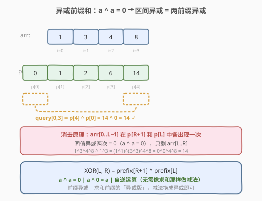
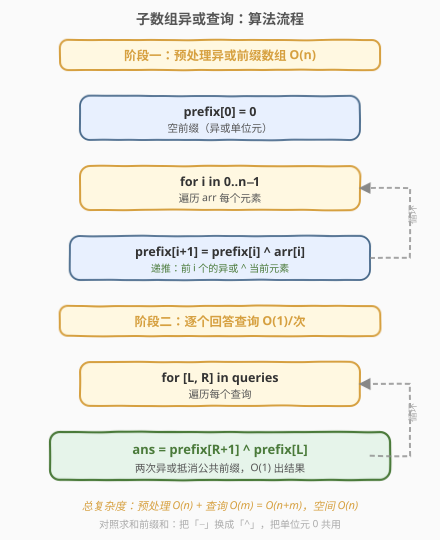
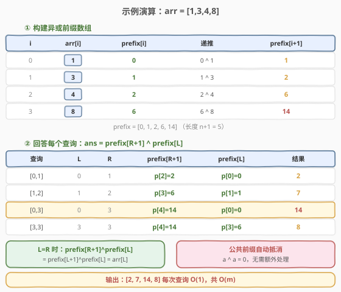

# LeetCode 子数组异或查询 题解

## 1. 题目概述

- **标题 / 题号**：子数组异或查询（#1310，medium）
- **链接**：https://leetcode.cn/problems/xor-queries-of-a-subarray/
- **难度**：中等
- **标签**：位运算、数组、前缀和

**题意**：有一个正整数数组 `arr`，现给出查询数组 `queries`，其中 `queries[i] = [L_i, R_i]`。对每个查询，计算 `arr[L_i] xor arr[L_i+1] xor ... xor arr[R_i]` 的值，返回包含所有查询结果的数组。

**示例 1**：

```text
输入：arr = [1,3,4,8], queries = [[0,1],[1,2],[0,3],[3,3]]
输出：[2,7,14,8]
解释：
数组中元素的二进制表示形式是：
1 = 0001
3 = 0011
4 = 0100
8 = 1000
查询的 XOR 值为：
[0,1] = 1 xor 3 = 2
[1,2] = 3 xor 4 = 7
[0,3] = 1 xor 3 xor 4 xor 8 = 14
[3,3] = 8
```

**示例 2**：

```text
输入：arr = [4,8,2,10], queries = [[2,3],[1,3],[0,0],[0,3]]
输出：[8,0,4,4]
```

**约束**：

- `1 <= arr.length <= 3 * 10^4`
- `1 <= arr[i] <= 10^9`
- `1 <= queries.length <= 3 * 10^4`
- `queries[i].length == 2`
- `0 <= queries[i][0] <= queries[i][1] < arr.length`

> ⚠️ 注意：`arr` 和 `queries` 的长度都可达 $3 \times 10^4$，逐查询暴力异或为 $O(n \cdot m)$ 最坏 $9 \times 10^8$ 会超时，必须用**前缀异或**预处理把每次查询降到 $O(1)$。

## 2. 解题思路

### 2.1 暴力思路

对每个查询 `[L, R]`，从 `arr[L]` 异或到 `arr[R]`，单次查询 $O(R-L+1)$。$m$ 个查询合计 $O(n \cdot m)$，在最大数据规模下超时。

### 2.2 核心观察：异或前缀和



定义**异或前缀数组** `prefix`，其中 `prefix[i]` 表示 `arr[0..i-1]` 的异或值（`prefix[0] = 0` 为异或单位元）：

$$
\text{prefix}[i] = \text{arr}[0] \oplus \text{arr}[1] \oplus \cdots \oplus \text{arr}[i-1]
$$

则区间 `arr[L..R]` 的异或值为：

$$
\text{XOR}(L, R) = \text{prefix}[R+1] \oplus \text{prefix}[L]
$$

> 💡 **关键性质（异或自逆运算）**：异或运算满足 $a \oplus a = 0$（自消）和 $a \oplus 0 = a$（单位元）。`prefix[R+1]` 包含 `arr[0..R]` 的异或，`prefix[L]` 包含 `arr[0..L-1]` 的异或，二者异或后公共部分 `arr[0..L-1]` 被抵消（每个元素出现两次，自消为 0），只剩 `arr[L..R]`。

这与求和前缀和的思路完全平行：求和版用减法 `sum(L,R) = prefix[R+1] - prefix[L]`，异或版只需把减法换成异或 `XOR(L,R) = prefix[R+1] ^ prefix[L]`。而异或比减法更优雅——**无需处理负数、溢出**，且异或是自己的逆运算。

> ⚠️ **与求和前缀和的区别**：求和前缀和 `prefix[R+1] - prefix[L]` 依赖减法（加法的逆运算），而异或运算本身就是自逆的（$a \oplus a = 0$），所以直接用异或代替减法即可。这也是为什么 `prefix[0] = 0` 对两者都适用——0 既是加法单位元也是异或单位元。

### 2.3 算法流程图



整个算法分两阶段：

1. **预处理**（$O(n)$）：一次遍历构建 `prefix` 数组，递推式 `prefix[i+1] = prefix[i] ^ arr[i]`。
2. **回答查询**（$O(m)$）：对每个查询 `[L, R]`，直接返回 `prefix[R+1] ^ prefix[L]`，每次 $O(1)$。

### 2.4 示例演算

以 `arr = [1,3,4,8], queries = [[0,1],[1,2],[0,3],[3,3]]` 为例：



**① 构建异或前缀数组**：

| 步骤 | arr[i] | prefix[i] | 递推 | prefix[i+1] |
|------|--------|-----------|------|-------------|
| i=0 | 1 | 0 | 0 ^ 1 | 1 |
| i=1 | 3 | 1 | 1 ^ 3 | 2 |
| i=2 | 4 | 2 | 2 ^ 4 | 6 |
| i=3 | 8 | 6 | 6 ^ 8 | 14 |

得到 `prefix = [0, 1, 2, 6, 14]`（长度 $n+1 = 5$）。

**② 回答每个查询**：

| 查询 | L | R | prefix[R+1] | prefix[L] | 结果 |
|------|---|---|-------------|-----------|------|
| [0,1] | 0 | 1 | p[2]=2 | p[0]=0 | 2 ^ 0 = **2** |
| [1,2] | 1 | 2 | p[3]=6 | p[1]=1 | 6 ^ 1 = **7** |
| [0,3] | 0 | 3 | p[4]=14 | p[0]=0 | 14 ^ 0 = **14** |
| [3,3] | 3 | 3 | p[4]=14 | p[3]=6 | 14 ^ 6 = **8** |

> 💡 **特例验证**：当 `L == R` 时，`prefix[R+1] ^ prefix[L] = prefix[L+1] ^ prefix[L] = arr[L]`，即单个元素的异或就是它本身，符合预期。

最终输出 `[2, 7, 14, 8]`。

## 3. 参考代码

### C++

```cpp
class Solution {
  public:
    vector<int> xorQueries(vector<int>& arr, vector<vector<int>>& queries) {
        int n = arr.size();
        vector<int> prefix(n + 1, 0);
        for (int i = 0; i < n; ++i) {
            prefix[i + 1] = prefix[i] ^ arr[i];
        }
        vector<int> ans;
        ans.reserve(queries.size());
        for (auto& q : queries) {
            ans.push_back(prefix[q[1] + 1] ^ prefix[q[0]]);
        }
        return ans;
    }
};
```

### Python

```python
class Solution:
    def xorQueries(self, arr: List[int], queries: List[List[int]]) -> List[int]:
        n = len(arr)
        prefix = [0] * (n + 1)
        for i in range(n):
            prefix[i + 1] = prefix[i] ^ arr[i]
        return [prefix[r + 1] ^ prefix[l] for l, r in queries]
```

> 💡 **空间优化**：若允许修改 `arr`，可就地把它改造成前缀异或数组（`arr[i] ^= arr[i-1]`），查询时 `arr[R] ^ (arr[L-1] if L > 0 else 0)`，省去额外 $O(n)$ 空间。但原地修改可读性较差，工程上建议保留独立 `prefix` 数组。

## 4. 复杂度分析

| 维度 | 复杂度 | 说明 |
|------|--------|------|
| 时间复杂度 | $O(n + m)$ | 预处理遍历 `arr` 一次 $O(n)$；回答 $m$ 个查询每次 $O(1)$ 合计 $O(m)$ |
| 空间复杂度 | $O(n)$ | 异或前缀数组 `prefix` 长度为 $n+1$；输出数组不计入额外空间（若原地修改 `arr` 则可降到 $O(1)$ 额外空间） |

## 5. 扩展：异或前缀的更多应用

异或前缀和是前缀和家族中「把加法换成异或」的自然推广，核心都依赖运算的可逆性：

- **求和前缀**：`sum(L,R) = prefix[R+1] - prefix[L]`，逆运算为减法
- **异或前缀**：`xor(L,R) = prefix[R+1] ^ prefix[L]`，逆运算为异或本身（自逆）
- **乘积前缀**（正数域）：`prod(L,R) = prefix[R+1] / prefix[L]`，逆运算为除法，需处理除零

> 💡 **异或 vs 求和的优劣**：异或版本天然无溢出问题（位运算），无需像求和那样考虑负数取模（如 [974. 和可被 K 整除的子数组](../0901-1000/974_和可被K整除的子数组.md) 的 `((S % k) + k) % k` 修正），代码更简洁。代价是异或不保持「大小单调性」，无法直接用于二分答案类问题。

异或前缀还可用于：

- **找出现一次的元素**：全体异或后成对元素自消，剩单身元素（[136. 只出现一次的数字](https://leetcode.cn/problems/single-number/)）
- **判定两段区间异或是否相等**：比较 `prefix[R1+1] ^ prefix[L1]` 与 `prefix[R2+1] ^ prefix[L2]`

## 6. 面试要点

1. **为什么 `prefix[0] = 0`？**
   - 0 是异或运算的单位元（$a \oplus 0 = a$）。`prefix[0]` 表示空前缀的异或值，设为 0 保证从下标 0 开始的区间 `arr[0..R]` 能正确计算为 `prefix[R+1] ^ prefix[0] = prefix[R+1] ^ 0 = prefix[R+1]`。这与求和前缀和 `prefix[0] = 0`（加法单位元）完全对应。

2. **为什么异或前缀不需要像求和前缀那样做特殊处理？**
   - 异或是自逆运算（$a \oplus a = 0$），直接用 `prefix[R+1] ^ prefix[L]` 即可消去公共前缀，无需减法、无溢出、无负数取模修正。求和版若涉及负数取模（如同余定理）需 `(S % k + k) % k` 修正符号，异或版无此烦恼。

3. **能否原地修改 `arr` 省空间？**
   - 可以。遍历 `arr[i] ^= arr[i-1]`（`i` 从 1 开始）后，`arr[i]` 变成 `arr[0..i]` 的异或前缀。查询 `[L, R]` 时：若 `L == 0` 返回 `arr[R]`，否则返回 `arr[R] ^ arr[L-1]`。代价是破坏原数组，且边界判断稍繁琐，面试时按需权衡。

4. **`L == R` 时公式还成立吗？**
   - 成立。`prefix[R+1] ^ prefix[L] = prefix[L+1] ^ prefix[L] = arr[L]`，即单元素区间的异或就是该元素本身。无需特判，公式天然覆盖。

5. **与求和前缀和的本质联系？**
   - 二者都是「预处理前缀 + 区间用两个前缀的运算消去公共部分」。求和用减法（加法的逆），异或用异或（自身的逆）。只要运算满足**可结合**与**可逆**（存在单位元且每个元素有逆元），就能套前缀和模板。乘法（正数域）也行，但需处理除零。

## 同类练习题

| # | 题目 | 与本题的关联 |
|---|------|-------------|
| 303 | [区域和检索 - 数组不可变](https://leetcode.cn/problems/range-sum-query-immutable/) | 求和前缀和的母题，把本题的「^」换成「−」即可对照 |
| 304 | [二维区域和检索 - 数组不可变](https://leetcode.cn/problems/range-sum-query-2d-immutable/)（[题解](../0201-0300/304_二维区域和检索_数组不可变.md)） | 求和前缀和的二维推广，四角容斥 |
| 974 | [和可被 K 整除的子数组](https://leetcode.cn/problems/subarray-sums-divisible-by-k/)（[题解](../0901-1000/974_和可被K整除的子数组.md)） | 求和前缀 + 同余定理，对比异或前缀无需取模修正的简洁性 |
| 136 | [只出现一次的数字](https://leetcode.cn/problems/single-number/) | 全体异或自消成对元素，异或运算的经典应用 |
| 525 | [连续数组](https://leetcode.cn/problems/contiguous-array/) | 前缀和 + 哈希，把 0 当 −1 转化为前缀差为 0 |
