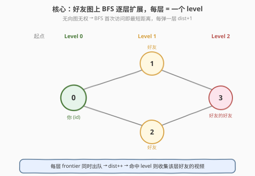
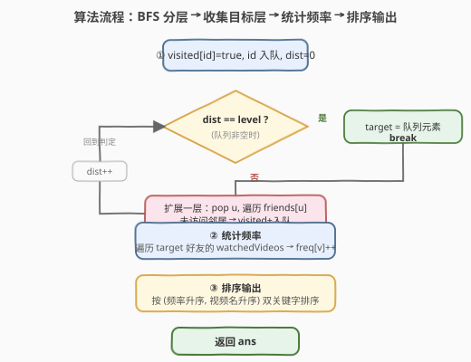
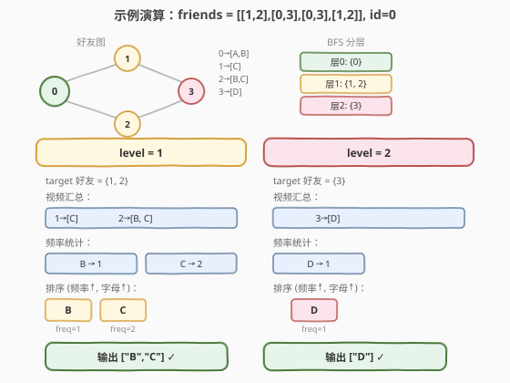

# 获取你好友已观看的视频

- **题目名称**：获取你好友已观看的视频
- **链接**：[1311. 获取你好友已观看的视频](https://leetcode.cn/problems/get-watched-videos-by-your-friends/)
- **难度**：中等
- **标签**：广度优先搜索、图、哈希表、排序

## 1. 题目概述

有 `n` 个人，每个人都有一个 `0` 到 `n-1` 的唯一 `id`。给你数组 `watchedVideos` 和 `friends`，其中 `watchedVideos[i]` 和 `friends[i]` 分别表示 `id = i` 的人观看过的视频列表和他的好友列表。

Level **1** 的视频包含所有你好友观看过的视频，level **2** 的视频包含所有你好友的好友观看过的视频，以此类推。一般地，Level 为 **k** 的视频包含所有从你出发**最短距离为 k** 的好友观看过的视频。

给定你的 `id` 和一个 `level` 值，找出所有指定 level 的视频，按**观看频率升序**返回；频率相同则按**字母顺序升序**排列。

**示例 1**：

```text
输入：watchedVideos = [["A","B"],["C"],["B","C"],["D"]],
     friends = [[1,2],[0,3],[0,3],[1,2]], id = 0, level = 1
输出：["B","C"]
解释：
id=0（你）的好友：id=1（看 ["C"]）、id=2（看 ["B","C"]）。
频率：B -> 1，C -> 2。按频率升序得 ["B","C"]。
```

**示例 2**：

```text
输入：watchedVideos = [["A","B"],["C"],["B","C"],["D"]],
     friends = [[1,2],[0,3],[0,3],[1,2]], id = 0, level = 2
输出：["D"]
解释：
你的好友的好友只有 id=3（看 ["D"]），频率 D -> 1，输出 ["D"]。
```

**约束条件**：

- `n == watchedVideos.length == friends.length`
- `2 <= n <= 100`
- `1 <= watchedVideos[i].length <= 100`
- `1 <= watchedVideos[i][j].length <= 8`
- `0 <= friends[i].length < n`
- `0 <= friends[i][j] < n`
- `0 <= id < n`
- `1 <= level < n`
- 若 `friends[i]` 包含 `j`，那么 `friends[j]` 包含 `i`（无向图）

> 💡 本题是**图上 BFS 分层**的经典应用：把好友关系看作无向图，"level k" 就是图中距起点距离恰好为 k 的节点集合。BFS 天然按层扩展，每弹一层距离 +1，到第 `level` 层停下，收集这些人的视频统计频率再排序即可。与 [994. 腐烂的橘子](../0901-1000/994_腐烂的橘子.md) 的多源 BFS 同属"逐层扩展"家族，只是本题是单源、且需在指定层停下收集信息。

---

## 2. 解题思路

### 2.1 暴力思路：DFS 记录距离

对每个节点 DFS 求到起点的距离，再筛出距离恰为 `level` 的人。问题在于 DFS 不保证**第一次访问就是最短距离**，需要额外处理（如反复更新取最小值），容易写错且不如 BFS 自然。更直接的做法是 BFS——它天然保证首次访问即最短距离。

### 2.2 核心观察：BFS 分层 = 距离分层



**关键洞察**：好友关系是一张**无向图**（题目保证 `friends[i]` 含 `j` 时 `friends[j]` 也含 `i`）。从你（`id`）出发做 BFS，队列中**同一批出队的节点距起点距离相同**——每弹完一批（一个 frontier），距离 +1。因此：

- 第 0 层 = 你自己（距离 0）
- 第 1 层 = 你的直接好友（距离 1）→ level 1 视频
- 第 2 层 = 好友的好友（距离 2）→ level 2 视频
- ……
- 第 `level` 层 = 距离恰为 `level` 的人 → 收集他们的视频

> ⚠️ **"最短距离为 k" 是关键**：一个人可能通过多条路径可达，但只算他**最近的**那一层。BFS 配合 `visited` 标记，保证每个节点只在**首次入队时**（即最短距离）被访问，不会重复计数、也不会把近距离的人错放到远层。这是为什么不能用 DFS 裸跑——DFS 会先深入某条长路径，可能先以远距离访问到本该在近层的人。

**为什么 BFS 能保证最短距离？** 无权图上，BFS 按"跳数"扩展，先访问的节点距离不大于后访问的节点。首次访问某节点时经过的边数即为最短距离（否则更短路径会更早到达），这是 BFS 求无权图最短路径的基本性质。

### 2.3 算法流程图



**完整步骤**：

1. **BFS 初始化**：`visited[id] = true`，起点 `id` 入队，`dist = 0`。
2. **逐层扩展**：每轮取当前队列大小 `size`（即当前 frontier）：
   - 若 `dist == level`：把队列中剩余节点全部记为 `target`（目标层好友），**跳出循环**。
   - 否则：逐个出队节点 `u`，遍历 `friends[u]`，未访问的邻居标记并入队。本轮结束后 `dist++`。
3. **统计频率**：对 `target` 中每个好友，遍历其 `watchedVideos`，用哈希表 `freq` 计数。
4. **排序输出**：把视频按 `(频率, 视频名)` 升序排序后返回。

> 💡 **提前终止**：一旦 `dist == level`，无需继续 BFS 更深层，直接收集当前队列即可。因为此时队列里恰好是距离为 `level` 的全部节点（已被前一层扩展出来并去重过）。

### 2.4 示例演算

以示例数据 `friends = [[1,2],[0,3],[0,3],[1,2]]`，`id = 0` 为例，分别看 `level=1` 与 `level=2`：



**好友图结构**（无向图）：

```text
    1 --- 3
    |     |
    0 --- 2
```

| BFS 层 | 节点 | 说明 |
|--------|------|------|
| 第 0 层 | `{0}` | 你自己 |
| 第 1 层 | `{1, 2}` | friends[0] = [1,2]，均未访问 |
| 第 2 层 | `{3}` | friends[1]=[0,3]→3 新；friends[2]=[0,3]→3 已被本层入队，跳过 |

**level=1**：target = {1, 2}
- 视频：1→["C"]，2→["B","C"]
- 频率：B=1, C=2
- 排序（频率升序，同频字母序）：B(1) → C(2) ⇒ `["B","C"]` ✓

**level=2**：target = {3}
- 视频：3→["D"]
- 频率：D=1
- 排序：`["D"]` ✓

> 💡 **注意第 2 层的去重**：节点 3 同时是 1 和 2 的好友，但 BFS 中由节点 1 先把它入队并标记 `visited`，当节点 2 出队时看到 3 已访问便跳过——所以 3 只在第 2 层出现一次。这正是 BFS `visited` 标记的作用：保证每人只在其**最短距离层**被收集一次。

---

## 3. 参考代码

### C++

```cpp
// 获取你好友已观看的视频.cpp —— BFS 分层 + 频率排序
// 编译: g++ -O2 -std=c++17 获取你好友已观看的视频.cpp -o gwv
class Solution {
public:
    vector<string> watchedVideosByFriends(vector<vector<string>>& watchedVideos,
                                          vector<vector<int>>& friends,
                                          int id, int level) {
        int n = friends.size();
        // 1. BFS 分层，找到距离恰为 level 的全部好友
        vector<bool> visited(n, false);
        queue<int> q;
        q.push(id);
        visited[id] = true;
        int dist = 0;
        vector<int> target;
        while (!q.empty()) {
            int size = q.size();
            if (dist == level) {                 // 到达目标层，收集当前队列
                for (int k = 0; k < size; ++k) {
                    target.push_back(q.front());
                    q.pop();
                }
                break;
            }
            for (int k = 0; k < size; ++k) {     // 扩展一层
                int u = q.front(); q.pop();
                for (int v : friends[u]) {
                    if (!visited[v]) {
                        visited[v] = true;
                        q.push(v);
                    }
                }
            }
            ++dist;
        }
        // 2. 统计目标层好友的视频频率
        unordered_map<string, int> freq;
        for (int f : target) {
            for (const string& v : watchedVideos[f]) {
                freq[v]++;
            }
        }
        // 3. 按 (频率, 视频名) 升序排序
        vector<pair<int, string>> vps;
        for (auto& [v, c] : freq) {
            vps.push_back({c, v});
        }
        sort(vps.begin(), vps.end());            // pair 默认先比 first 再比 second
        vector<string> ans;
        for (auto& [c, v] : vps) {
            ans.push_back(v);
        }
        return ans;
    }
};
```

### Python

```python
class Solution:
    def watchedVideosByFriends(self, watchedVideos: List[List[str]],
                                friends: List[List[int]],
                                id: int, level: int) -> List[str]:
        n = len(friends)
        # 1. BFS 分层，找到距离恰为 level 的全部好友
        visited = [False] * n
        q = collections.deque([id])
        visited[id] = True
        dist = 0
        target = []
        while q:
            if dist == level:                    # 到达目标层，收集当前队列
                target = list(q)
                break
            for _ in range(len(q)):              # 扩展一层
                u = q.popleft()
                for v in friends[u]:
                    if not visited[v]:
                        visited[v] = True
                        q.append(v)
            dist += 1
        # 2. 统计目标层好友的视频频率
        freq = collections.Counter()
        for f in target:
            for v in watchedVideos[f]:
                freq[v] += 1
        # 3. 按 (频率, 视频名) 升序排序
        return sorted(freq.keys(), key=lambda v: (freq[v], v))
```

> 💡 **实现细节**：① 每轮 `for _ in range(len(q))` 只处理当前 frontier，保证 `dist` 准确对应层数。② `dist == level` 时直接 `list(q)` 收集并 `break`，无需继续扩展更深层。③ `visited` 在**入队时**而非出队时标记，避免同一节点被多个前置节点重复入队（否则可能多次计数）。④ 排序用 `pair{频率, 视频名}`，`pair` 默认字典序恰好满足"先频率后字母"的要求；Python 用元组 `(freq[v], v)` 作 key 同理。

---

## 4. 复杂度分析

| 维度 | 复杂度 | 说明 |
|------|--------|------|
| **时间** | $O(n + E + V \log V)$ | BFS 遍历所有节点与边 $O(n+E)$；统计频率 $O(V)$；排序 $O(V \log V)$ |
| **空间** | $O(n + V)$ | `visited`/队列 $O(n)$；频率表与结果 $O(V)$ |

> ⚠️ 其中 $E$ 为好友关系边数（无向图，$E \le \frac{n(n-1)}{2}$），$V$ 为目标层好友的视频总数。本题 $n \le 100$，视频名长度 $\le 8$，规模极小，任意合理实现均可通过。瓶颈在排序：视频种类数最坏 $O(\text{视频总数})$，但实际受限于 $n \le 100$ 且每人视频 $\le 100$，$V \le 10^4$，$V \log V$ 约 $1.3 \times 10^5$，远在限制内。

---

## 5. 扩展：BFS 分层收集的通用范式

本题属于"BFS 在指定层收集信息"的通用范式，与"求最短路径长度"的 BFS 区别在于：**不关心路径本身，只关心某一层的节点集合**。这类问题的统一模板：

```text
BFS 起点 → 每轮弹一层 → dist++ → 命中目标层则收集并停 → 否则继续扩展
```

常见变体：

| 变体 | 区别 | 示例 |
|------|------|------|
| **指定层收集**（本题） | 到第 k 层停下，收集该层节点附加信息 | 1311 |
| **最短距离全部** | 跑完整个 BFS，记录每个节点距离 | 743 网络延迟时间 |
| **多源 BFS** | 多个起点同时入队，初始 dist=0 | 994 腐烂的橘子 |
| **层计数** | 统计第 k 层节点个数 | 102 层序遍历 |

> 💡 **与 743 的对比**：[743. 网络延迟时间](../0701-0800/743_网络延迟时间.md) 是**加权图**最短路（需 Dijkstra），而本题是**无权图**（每条好友关系距离为 1），所以普通 BFS 即可。若好友关系带权重（如"亲密程度"作距离），就需升级为 Dijkstra。

---

## 6. 面试要点

1. **为什么用 BFS 而不是 DFS？**

   > 题目要求"最短距离为 k"的好友。BFS 按层扩展，首次访问节点时即最短距离，配合 `visited` 标记天然把每人归到正确的层。DFS 不保证首次访问是最短距离，需额外维护最小距离再判定，既易错又低效。

2. **`visited` 应该在入队时还是出队时标记？**

   > **入队时**标记。若出队时才标记，同一节点可能被多个前置节点在 同一轮内重复入队，导致队列膨胀、甚至把同一人重复计入 target。入队时标记可保证每节点只入队一次。

3. **如何精确停在 level 层？**

   > 每轮处理前检查 `dist == level`：若命中，把当前队列所有元素收入 `target` 并 `break`；否则扩展一层后 `dist++`。关键是用 `for _ in range(len(q))` 限定每轮只处理当前 frontier，保证 `dist` 与层数对应。

4. **排序规则如何实现？**

   > 按 `(频率升序, 视频名升序)` 双关键字排序。C++ 用 `vector<pair<int,string>>`，`pair` 的默认字典序先比 `first`（频率）再比 `second`（字符串），恰好满足；Python 用 `sorted(keys, key=lambda v: (freq[v], v))`，元组比较同理。

5. **如果 level 超过图的最大距离怎么办？**

   > BFS 队列会先空（没有更深的节点），`while q` 退出，`target` 为空，频率表为空，返回空列表 `[]`。约束保证 `1 <= level < n`，但理论上某些图（如不连通）可能到不了 level 层，代码对此天然处理正确。

> 💡 **一句话总结**：1311 是 BFS 分层收集的招牌题——好友图无权，BFS 每弹一层距离 +1，到第 `level` 层停下收集这些人的视频，哈希计数后按 `(频率, 字母)` 双关键字排序输出。核心是 BFS 天然求无权图最短距离 + `visited` 入队时标记保证每人只归一层。与 994 多源 BFS、743 加权最短路、102 层序遍历同属"逐层扩展"家族。

---

## 7. 同类练习题

- [994. 腐烂的橘子](https://leetcode.cn/problems/rotting-oranges/)（[题解](../0901-1000/994_腐烂的橘子.md)）：多源 BFS 逐层扩展，每层 = 一分钟，与本题单源分层同框架
- [743. 网络延迟时间](https://leetcode.cn/problems/network-delay-time/)（[题解](../0701-0800/743_网络延迟时间.md)）：加权图单源最短路（Dijkstra），对比本题无权图 BFS 的简化
- [102. 二叉树的层序遍历](https://leetcode.cn/problems/binary-tree-traversal/)：BFS 按层收集节点的最原始形态，树结构上的分层
- [1926. 网格图中递增路径的数目](https://leetcode.cn/problems/number-of-increasing-paths-in-a-grid/)：图上分层 / DFS + 记忆化，对比 BFS 分层思路
- [542. 01 矩阵](https://leetcode.cn/problems/01-matrix/)：多源 BFS 求每个 1 到最近 0 的距离，分层扩展求最短距离的另一应用
