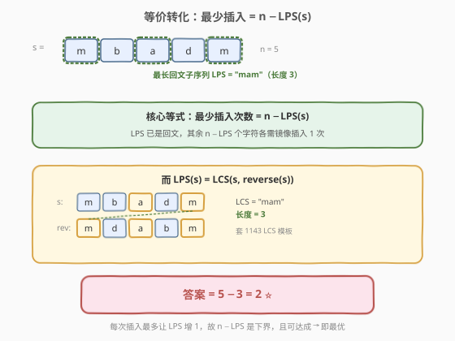

# LeetCode 让字符串成为回文串的最少插入次数 题解

## 1. 题目概述

- **标题 / 题号**：让字符串成为回文串的最少插入次数（#1312，hard）
- **链接**：https://leetcode.cn/problems/minimum-insertion-steps-to-make-a-string-palindrome/
- **难度**：困难
- **标签**：动态规划、区间 DP、字符串

**题意**：给定一个字符串 `s`，每一次操作你可以在 `s` 的任意位置插入一个任意小写字母。返回使 `s` 成为回文串的**最少操作次数**。

**回文串**：正着读和反着读都一样的字符串，如 `"aba"`、`"zzazz"`。

**示例 1**：

```text
输入：s = "zzazz"
输出：0
解释：字符串已经是回文串，无需插入。
```

**示例 2**：

```text
输入：s = "mbadm"
输出：2
解释：可变为 "mbdadbm" 或 "mbdbabm" ，均为插入 2 次。
```

**示例 3**：

```text
输入：s = "leetcode"
输出：5
```

**约束**：

- `1 <= s.length <= 500`
- `s` 仅由小写英文字母组成

> 💡 本题是**区间 DP** 的经典应用，与 [132. 分割回文串 II](../0101-0200/132_分割回文串II.md) 同样围绕「回文」展开，但问法不同：132 求最少切割次数（切割不增字符），1312 求最少插入次数（插入字符补齐回文）。两者共用「两端向内」的区间 DP 思路，转移方程形式相近但语义不同。此外，1312 还有一条优雅的**等价转化**路径——`答案 = n − 最长回文子序列长度`，借助 [1143. 最长公共子序列](../1101-1200/1143_最长公共子序列.md) 的模板即可求解。

## 2. 解题思路

### 2.1 暴力思路：递归枚举

对子串 `s[i..j]`：若两端字符相同，问题缩小到 `s[i+1..j-1]`；若不同，则要么在左端补一个 `s[j]`（问题缩小到 `s[i..j-1]`），要么在右端补一个 `s[i]`（问题缩小到 `s[i+1..j]`），取两种补法中的较小值再加 1。递归无记忆化时存在大量重复子问题，时间 $O(2^n)$，`n=500` 完全不可行。

### 2.2 核心观察：区间 DP

![核心观察：dp[i][j] = 让 s[i..j] 成为回文的最少插入次数](../images/mininsert_pal_concept.svg)

**定义**：`dp[i][j]` = 让子串 `s[i..j]` 成为回文串的**最少插入次数**。

**边界**：

```text
dp[i][i] = 0                        # 单字符天然回文
dp[i][i-1] = 0                      # 空串天然回文（区间无效长度，统一为 0）
```

**转移**（核心）：

```text
若 s[i] == s[j]：
    dp[i][j] = dp[i+1][j-1]         # 两端已配对，内部自行解决

若 s[i] != s[j]：
    dp[i][j] = min(dp[i+1][j],      # 在左端补 s[j]，内部变成 s[i..j-1]
                   dp[i][j-1]) + 1  # 在右端补 s[i]，内部变成 s[i+1..j]
```

**两种转移的直觉**：

| 情况 | DP 来源 | 含义 |
|------|---------|------|
| **两端字符相同** | `dp[i+1][j-1]` | 两端自然配对成回文外壳，只需处理内部，**不花代价** |
| **两端字符不同** | `min(dp[i+1][j], dp[i][j-1]) + 1` | 必须插入一个字符来「补齐」某一端，代价 `+1`，内部缩到对应更短区间 |

> 💡 **为什么两端相同时直接 `dp[i+1][j-1]` 而不取 `min`？** 因为配对两端至少不比单边插入差：若不配对而单边补字符，代价 `+1` 起步，必然 $\geq$ 配对后内部代价。所以两端相同时**贪心配对**最优，这是回文类区间 DP 的通用性质（132 分割回文串 II、5 最长回文子串同源）。

**答案**：`dp[0][n-1]`。

> ⚠️ **填表顺序**：`dp[i][j]` 依赖 `dp[i+1][j-1]`（左下）、`dp[i+1][j]`（下方）、`dp[i][j-1]`（左方），三者都要先算出。因此按**子串长度从小到大**填表：外层 `len` 从 2 到 `n`，内层枚举起点 `i`，令 `j = i + len - 1`。这保证查 `dp[i+1][j-1]` 时该值已填好。

### 2.3 算法流程图

![算法流程：按长度递增填区间 DP 表，返回 dp[0][n-1]](../images/mininsert_pal_flow.svg)

**完整步骤**：

1. **初始化**：`dp` 为 `n × n` 矩阵，对角线 `dp[i][i] = 0`（单字符回文，无需插入）。长度为 0 的区间（`j < i`）也视为 0，无需特殊处理。
2. **按长度递增填表**：`len` 从 2 到 `n`，对每个 `i` 从 0 到 `n-len`，令 `j = i + len - 1`：
   - `s[i] == s[j]` → `dp[i][j] = dp[i+1][j-1]`
   - `s[i] != s[j]` → `dp[i][j] = min(dp[i+1][j], dp[i][j-1]) + 1`
3. **返回** `dp[0][n-1]`

> 💡 **下标不出界**：当 `len=2` 时 `j = i+1`，`dp[i+1][j-1] = dp[i+1][i]` 属于 `j < i` 的无效区间，按 0 处理（C++ 中 `dp` 初始全 0 即天然满足，Python 同理）。这正是把空串边界定义为 0 的便利。

### 2.4 示例演算

以 `s = "mbadm"` 为例：

![示例演算：mbadm 的区间 DP 填表，答案 dp[0][4]=2](../images/mininsert_pal_walkthrough.svg)

**dp 表**（行 = 起点 `i`，列 = 终点 `j`，仅填 `i ≤ j` 部分；`i > j` 为空串，值为 0）：

| `i\j` | 0 (`m`) | 1 (`b`) | 2 (`a`) | 3 (`d`) | 4 (`m`) |
|-------|---------|---------|---------|---------|---------|
| 0 (`m`) | 0 | 1 | 2 | 3 | **2** |
| 1 (`b`) | — | 0 | 1 | 2 | 3 |
| 2 (`a`) | — | — | 0 | 1 | 2 |
| 3 (`d`) | — | — | — | 0 | 1 |
| 4 (`m`) | — | — | — | — | 0 |

**关键填表步骤**：

| 格子 | 长度 | 字符比较 | 转移 | 值 | 说明 |
|------|------|----------|------|----|------|
| `dp[0][1]` | 2 | `m` ≠ `b` | `min(dp[1][1], dp[0][0])+1` | 1 | 插 1 个补齐 |
| `dp[0][2]` | 3 | `m` ≠ `a` | `min(dp[1][2], dp[0][1])+1` | 2 | 插 2 个 |
| `dp[0][3]` | 4 | `m` ≠ `d` | `min(dp[1][3], dp[0][2])+1` | 3 | 插 3 个 |
| `dp[0][4]` | 5 | `m` == `m` | `dp[1][3]` | **2** | 两端配对，内部 `dp[1][3]=2` ✓ |

最终 `dp[0][4] = 2`。一种构造方案：在 `"mbadm"` 的下标 2 后插入 `d`、下标 1 后插入 `b`，得到回文串 `"mbdadbm"`（插入 2 次）。

> 💡 **如何还原插入方案？** 从 `dp[0][n-1]` 回溯：若 `s[i]==s[j]`，两端配对，走到 `dp[i+1][j-1]`；若 `s[i]!=s[j]` 且 `dp[i][j]==dp[i+1][j]+1`，说明在左端补了 `s[j]`，记录插入并走到 `dp[i+1][j]`；否则在右端补了 `s[i]`，走到 `dp[i][j-1]`。逆序整理即得插入位置与字符。

## 3. 参考代码

### C++

```cpp
// 让字符串成为回文串的最少插入次数.cpp —— 区间 DP
// 编译: g++ -O2 -std=c++17 让字符串成为回文串的最少插入次数.cpp -o mininsert
class Solution {
public:
    int minInsertions(string s) {
        int n = s.size();
        // dp[i][j] = 让 s[i..j] 成为回文的最少插入次数
        vector<vector<int>> dp(n, vector<int>(n, 0));

        // 按子串长度递增填表
        for (int len = 2; len <= n; ++len) {
            for (int i = 0; i + len <= n; ++i) {
                int j = i + len - 1;
                if (s[i] == s[j]) {
                    dp[i][j] = dp[i + 1][j - 1];          // 两端配对，无代价
                } else {
                    dp[i][j] = min(dp[i + 1][j],          // 左端补 s[j]
                                   dp[i][j - 1]) + 1;     // 右端补 s[i]
                }
            }
        }
        return dp[0][n - 1];
    }
};
```

### Python

```python
class Solution:
    def minInsertions(self, s: str) -> int:
        n = len(s)
        dp = [[0] * n for _ in range(n)]

        for length in range(2, n + 1):
            for i in range(n - length + 1):
                j = i + length - 1
                if s[i] == s[j]:
                    dp[i][j] = dp[i + 1][j - 1]          # 两端配对，无代价
                else:
                    dp[i][j] = min(dp[i + 1][j],          # 左端补 s[j]
                                   dp[i][j - 1]) + 1      # 右端补 s[i]

        return dp[0][n - 1]
```

> 💡 **实现细节**：① `dp` 初始化为全 0，对角线 `dp[i][i]=0` 天然满足，`len=2` 时 `dp[i+1][j-1]=dp[i+1][i]` 是 `j<i` 的无效区间，读到的也是 0，恰好是空串的边界值。② 外层按 `len` 递增保证依赖项已算好。③ 本题 `n ≤ 500`，`O(n²)` 空间约 1MB，无需滚动优化。

## 4. 复杂度分析

| 维度 | 区间 DP | LCS 等价法 |
|------|---------|-----------|
| **时间** | $O(n^2)$ | $O(n^2)$ |
| **空间** | $O(n^2)$ | $O(n^2)$（滚动可 $O(n)$） |
| **思路** | 直接对子串做回文插入 DP | 转化为 `n − LPS(s)`，套 LCS 模板 |
| **可还原方案** | ✓ 回溯 dp 表 | ✗ 只得数值 |

> ⚠️ 时间 $O(n^2)$：双重循环枚举所有 $O(n^2)$ 个区间，每个区间 $O(1)$ 转移。`n=500` 时约 $2.5 \times 10^5$ 次操作，远在限制内。

## 5. 扩展：等价于 n − 最长回文子序列



本题有一条非常优雅的**等价转化**路径。关键观察：

> **一个字符串的最长回文子序列（LPS）已经构成回文。** 要让整个串变回文，只需把「不在 LPS 中的字符」逐个镜像插入即可，恰好需要 $n - \text{LPS}(s)$ 次；而这正是最优的，因为每次插入最多让 LPS 长度增加 1。

而**最长回文子序列**可通过**最长公共子序列**求解：

$$
\text{LPS}(s) = \text{LCS}(s,\ \text{reverse}(s))
$$

> 💡 **为什么 LPS = LCS(s, reverse(s))？** 回文子序列正读反读相同，因此它必然同时是 `s` 和 `reverse(s)` 的公共子序列；反之 `s` 与 `reverse(s)` 的任一公共子序列，按 `s` 中的顺序读与按 `reverse(s)` 中的顺序读互为镜像，必为 `s` 的回文子序列。二者等长，故 LPS = LCS(s, rev(s))。

```python
class Solution:
    def minInsertions(self, s: str) -> int:
        t = s[::-1]
        n = len(s)
        # 复用 1143 最长公共子序列模板，求 LCS(s, reverse(s))
        dp = [[0] * (n + 1) for _ in range(n + 1)]
        for i in range(1, n + 1):
            for j in range(1, n + 1):
                if s[i - 1] == t[j - 1]:
                    dp[i][j] = dp[i - 1][j - 1] + 1
                else:
                    dp[i][j] = max(dp[i - 1][j], dp[i][j - 1])
        return n - dp[n][n]
```

**两种解法对比**：

| 方法 | 状态定义 | 转移核心 | 与本题的契合 |
|------|----------|----------|-------------|
| **区间 DP** | `dp[i][j]` = 子串 `s[i..j]` 的最少插入 | 两端配对 / 单边补 `+1` | 直接建模插入操作，语义最贴切 |
| **LCS 等价** | `dp[i][j]` = `s` 与 `rev(s)` 的 LCS 长度 | 匹配 `+1` / `max(上,左)` | 借成熟模板，证明依赖 LPS=LCS |

> 💡 **面试推荐**：先讲区间 DP（语义直观、易自圆其说），再点出「`n − LPS = n − LCS(s, rev(s))`」的等价视角展示思维深度。若面试官追问空间优化，区间 DP 可用滚动数组压到 $O(n)$（依赖左下角需用 `prev` 变量暂存，技巧同 [1143](../1101-1200/1143_最长公共子序列.md) 滚动数组）。

### 与分割回文串 II 的关系

1312 与 [132. 分割回文串 II](../0101-0200/132_分割回文串II.md) 都围绕「回文 + 区间 DP」，但操作语义不同：

| | 132 分割回文串 II | 1312 最少插入次数 |
|------|-------------------|-------------------|
| **允许操作** | 切割（不增字符） | 插入（增字符） |
| **状态** | `dp[i]` = 前缀 `s[0..i]` 的最少切割 | `dp[i][j]` = 子串 `s[i..j]` 的最少插入 |
| **DP 维度** | 一维前缀 DP + 回文预处理表 | 二维区间 DP |
| **共同点** | 两端相同时「贪心配对」最优 | 同上 |

## 6. 面试要点

1. **`dp[i][j]` 的定义和转移方程是什么？**

   > `dp[i][j]` = 让子串 `s[i..j]` 成为回文串的最少插入次数。若 `s[i]==s[j]`，`dp[i][j]=dp[i+1][j-1]`（两端配对，无代价）；若 `s[i]!=s[j]`，`dp[i][j]=min(dp[i+1][j], dp[i][j-1])+1`（在某一端补一个字符，代价 `+1`）。答案 `dp[0][n-1]`。

2. **两端字符不同时，为什么是 `min(dp[i+1][j], dp[i][j-1])+1`？**

   > 两端不同意味着无法自然配对，必须插入一个字符来「补齐」某一端。在左端插入 `s[j]` 后，`s[j]` 与原 `s[j]` 配对，内部剩 `s[i..j-1]`，代价 `dp[i][j-1]+1`；在右端插入 `s[i]` 同理代价 `dp[i+1][j]+1`。取两者较小值。两种补法覆盖所有最优情况。

3. **为什么填表顺序要按子串长度递增？**

   > `dp[i][j]` 依赖 `dp[i+1][j-1]`（更短区间）、`dp[i+1][j]`（更短区间）、`dp[i][j-1]`（更短区间），三者长度都严格小于当前区间。按长度从小到大填表，保证查依赖时已算好。等价写法是 `i` 从 `n-1` 到 0、`j` 从 `i+1` 到 `n-1` 的双重循环。

4. **为什么答案等于 `n − LPS(s)`？**

   > 最长回文子序列 LPS 已经是回文，无需改动；不在 LPS 中的每个字符都需被镜像插入一次，共 `n − LPS` 次。这是最优的：每次插入最多让 LPS 长度增加 1，要把长度 `L` 的 LPS 补到长度 `n` 的全串回文，至少需 `n − L` 次插入。而 `LPS(s) = LCS(s, reverse(s))`，故可套 LCS 模板求解。

5. **区间 DP 和 LCS 等价法，面试选哪个？**

   > 推荐先讲区间 DP——它直接建模「插入」操作，状态语义贴切、证明自洽，且能回溯还原插入方案。再补充 LCS 等价视角展示思维广度。若面试官要求 $O(n)$ 空间，区间 DP 可滚动数组压缩（暂存左下角），LCS 法同样可滚动到 $O(n)$。

> 💡 **一句话总结**：1312 是区间 DP 的招牌题——`dp[i][j]` 表示子串 `s[i..j]` 的最少插入次数，两端相同时配对无代价、不同时单边补 `+1`，按长度递增填表即得 `dp[0][n-1]`。等价于 `n − LPS(s) = n − LCS(s, reverse(s))`，可借 LCS 模板求解。与 132 分割回文串 II、5 最长回文子串、1143 LCS 同属回文/双序列 DP 家族，掌握一题即可迁移一片。

## 同类练习题

| # | 题目 | 与本题的关联 |
|---|------|-------------|
| 132 | [分割回文串 II](https://leetcode.cn/problems/palindrome-partitioning-ii/)（[题解](../0101-0200/132_分割回文串II.md)） | 同为回文区间 DP，但操作是「切割」而非「插入」，一维前缀 DP + 回文预处理表 |
| 1143 | [最长公共子序列](https://leetcode.cn/problems/longest-common-subsequence/)（[题解](../1101-1200/1143_最长公共子序列.md)） | LCS 二维 DP 模板，本题等价解法 `n − LCS(s, rev(s))` 的基石 |
| 516 | [最长回文子序列](https://leetcode.cn/problems/longest-palindromic-subsequence/) | 区间 DP 求 LPS 长度，与 1312 转移结构对称（求最长 vs 求最少插入），`LPS = n − 最少插入次数` |
| 131 | [分割回文串](https://leetcode.cn/problems/palindrome-partitioning/) | 回溯枚举所有回文分割方案，与 132/1312 共用「回文判定」基础 |
| 5 | [最长回文子串](https://leetcode.cn/problems/longest-palindromic-substring/)（[题解](../0001-0100/5_最长回文子串.md)） | 回文区间 / 中心扩展模板，回文类问题的母题 |
