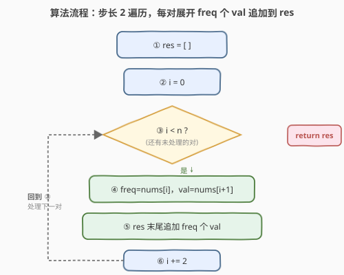
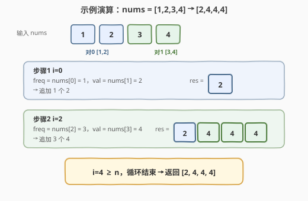

# 解压缩编码列表

- **题目名称**：解压缩编码列表
- **链接**：[1313. 解压缩编码列表](https://leetcode.cn/problems/decompress-run-length-encoded-list/)
- **难度**：简单
- **标签**：数组、模拟

## 1. 题目概述

给你一个以**行程长度编码**压缩的整数列表 `nums`。考虑每对相邻的两个元素 `[freq, val] = [nums[2*i], nums[2*i+1]]`（其中 `i >= 0`），每一对都表示解压后子列表中有 `freq` 个值为 `val` 的元素，你需要从左到右连接所有子列表以生成解压后的列表。

返回解压后的列表。

**示例 1**：

```text
输入：nums = [1,2,3,4]
输出：[2,4,4,4]
解释：第一对 [1,2] 代表 2 的频次为 1，生成 [2]。
第二对 [3,4] 代表 4 的频次为 3，生成 [4,4,4]。
串联起来 [2] + [4,4,4] = [2,4,4,4]。
```

**示例 2**：

```text
输入：nums = [1,1,2,3]
输出：[1,3,3]
解释：第一对 [1,1] → [1]；第二对 [2,3] → [3,3]；串联 [1,3,3]。
```

**约束条件**：

- `2 <= nums.length <= 100`
- `nums.length % 2 == 0`
- `1 <= nums[i] <= 100`

> 💡 本题是**行程长度编码（Run-Length Encoding, RLE）的解码**：压缩串里相邻两元素成对出现，`[freq, val]` 表示 `val` 连续重复 `freq` 次。解码就是按对顺序展开并拼接。

---

## 2. 解题思路

### 2.1 暴力思路

按题意直接模拟：把 `nums` 按步长 2 切成若干对，每对 `[freq, val]` 展开成 `freq` 个 `val`，依次拼到结果末尾。这其实就是最优解，没有更复杂的需求。

### 2.2 核心观察：成对展开 + 拼接

![核心观察：每对 [freq, val] 展开为 freq 个 val，从左到右拼接](../images/decompress_rle_concept.svg)

关键点：

- `nums` 长度恒为偶数，可视为 $\dfrac{n}{2}$ 个二元组 `[freq, val]`。
- 第 `i` 对的下标是 `2i` 和 `2i+1`：`freq = nums[2i]`，`val = nums[2i+1]`。
- 解码 = 对每对执行 `res.extend([val] * freq)`，**顺序就是 `i` 从 0 递增的顺序**。

> 💡 **为什么步长是 2 而不是 1？** 因为信息是「成对」存储的：一个频次 + 一个值共同描述一段。下标 `2i` 取频次、`2i+1` 取值，下一对从 `2(i+1) = 2i+2` 开始，所以循环变量 `i` 每次 `+= 2`。

### 2.3 算法流程图



**完整步骤**：

1. 初始化空结果数组 `res`。
2. 令 `i = 0`，循环条件 `i < n`（`n = len(nums)`）。
3. 取 `freq = nums[i]`，`val = nums[i+1]`。
4. 在 `res` 末尾追加 `freq` 个 `val`。
5. `i += 2`，回到第 3 步。
6. 循环结束，返回 `res`。

### 2.4 示例演算

以 `nums = [1,2,3,4]` 为例：



| 步骤 | `i` | `freq = nums[i]` | `val = nums[i+1]` | 追加内容 | `res` |
|------|-----|------------------|-------------------|----------|-------|
| 1 | 0 | 1 | 2 | `[2]` | `[2]` |
| 2 | 2 | 3 | 4 | `[4,4,4]` | `[2,4,4,4]` |

`i = 4 >= n = 4`，循环结束，返回 `[2,4,4,4]`。

> 💡 **输出规模**：`freq` 最大为 100，对数最多 50，故输出长度不超过 $50 \times 100 = 5000$，远在限制内。

---

## 3. 参考代码

### C++

```cpp
class Solution {
public:
    vector<int> decompressRLElist(vector<int>& nums) {
        vector<int> res;
        for (int i = 0; i + 1 < nums.size(); i += 2) {
            int freq = nums[i], val = nums[i + 1];
            for (int j = 0; j < freq; ++j) {
                res.push_back(val);
            }
        }
        return res;
    }
};
```

### Python

```python
class Solution:
    def decompressRLElist(self, nums: List[int]) -> List[int]:
        res = []
        for i in range(0, len(nums), 2):
            freq, val = nums[i], nums[i + 1]
            res.extend([val] * freq)
        return res
```

> 💡 **实现细节**：① 循环用 `range(0, n, 2)`（步长 2）或 `i += 2`，保证每次取一对。② Python 的 `list.extend([val] * freq)` 一行完成展开追加；也可 `res += [val] * freq`。③ C++ 可用 `res.insert(res.end(), freq, val)` 把内层循环压成一次批量插入，更简洁高效。

---

## 4. 复杂度分析

| 维度 | 复杂度 | 说明 |
|------|--------|------|
| 时间复杂度 | $O(L)$ | $L$ 为输出长度 $= \sum freq$，遍历每对并写入 `freq` 个值 |
| 空间复杂度 | $O(L)$ | 结果数组本身占用，不计入则 $O(1)$ 额外空间 |

> ⚠️ 时间复杂度按**输出长度** $L$ 计，而非输入长度 $n$。本题 $L \leq 5000$，十分宽松。

---

## 5. 扩展：批量插入与 RLE 应用

**C++ 批量插入**：内层 `for` 逐个 `push_back` 可替换为 `res.insert(res.end(), freq, val)`，语义清晰且减少函数调用开销：

```cpp
res.insert(res.end(), freq, val);
```

**RLE 的工程意义**：行程长度编码是一种简单的无损压缩，对**长连续重复序列**（如纯色位图、稀疏游程）压缩率极高。本题做的是「解码」方向；「编码」方向则是扫描原序列，把连续相同的 `[值, 计数]` 写成 `[count, val]` 对。理解双向转换有助于处理图像/信号类压缩题。

---

## 6. 面试要点

1. **如何切分输入数组中的 `[freq, val]` 对？**

   > `nums` 长度恒为偶数，第 `i` 对（从 0 起）的下标是 `2i` 和 `2i+1`。循环变量以步长 2 递增：`for i in range(0, n, 2)`，`freq = nums[i]`、`val = nums[i+1]`。

2. **时间复杂度是 $O(n)$ 还是 $O(L)$？**

   > 应按**输出长度** $L = \sum freq$ 计，因为每个输出元素都要写入一次。若只看输入对数则是 $O(n/2) = O(n)$ 的遍历，但写入开销由 $L$ 决定。面试中说明 $O(L)$ 更准确。

3. **`nums.length % 2 == 0` 这个约束有什么用？**

   > 保证输入总能被完整切成 `[freq, val]` 对，不会出现末尾落单元素，循环 `i += 2` 不会越界。若约束放宽，需要特判奇数长度。

4. **能否用更简洁的方式生成结果？**

   > Python 用 `res.extend([val] * freq)` 一行完成；C++ 用 `res.insert(res.end(), freq, val)` 批量插入。两者都避免了显式内层循环，可读性更好。

---

## 7. 同类练习题

- [900. RLE 迭代器](https://leetcode.cn/problems/rle-iterator/)（[题解](../0801-0900/900_RLE迭代器.md)）：同属行程长度编码家族，相同的 `[freq, val]` 对格式，但改为「按需消耗」的迭代器设计，与本题「一次性全展开」互补
- [1929. 数组串联](https://leetcode.cn/problems/concatenation-of-array/)：最简单的数组拼接（把数组自身接在末尾），与本题「拼接展开结果」同属数组构造入门
- [1920. 基于排列构建数组](https://leetcode.cn/problems/build-array-from-permutation/)：按下标规则重建数组，同样是「按规则遍历构造新数组」的简单模拟
- [443. 压缩字符串](https://leetcode.cn/problems/string-compression/)：RLE 的**编码**方向（原地写 `[字符, 计数]`），与本题解码方向互补，成对学习可双向理解行程编码
