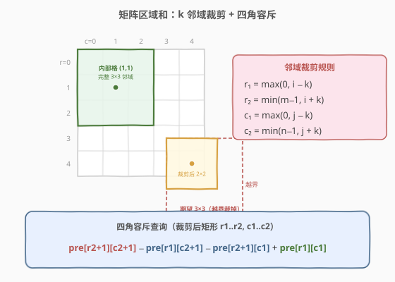
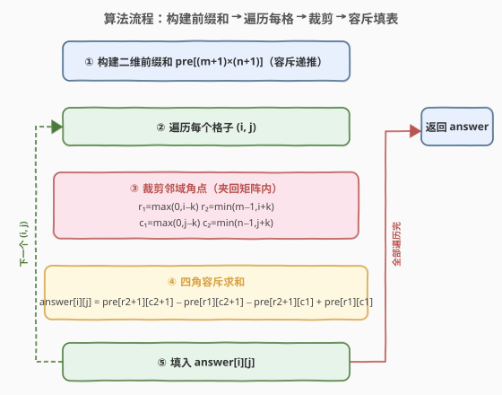
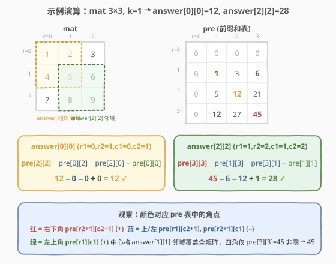

# 矩阵区域和

- **题目名称**：矩阵区域和
- **链接**：[1314. 矩阵区域和](https://leetcode.cn/problems/matrix-block-sum/)
- **难度**：中等
- **标签**：数组、矩阵、前缀和

## 1. 题目概述

给你一个 `m x n` 的矩阵 `mat` 和一个整数 `k`，返回一个矩阵 `answer`，其中 `answer[i][j]` 是所有满足下述条件的元素 `mat[r][c]` 之和：

- `i - k <= r <= i + k`
- `j - k <= c <= j + k`
- `(r, c)` 在矩阵内

直观地说，`answer[i][j]` 是以 `mat[i][j]` 为中心、边长 `2k+1` 的正方形邻域内所有元素之和；当邻域越出矩阵边界时，只取落在矩阵内的部分。

**示例 1**：

```text
输入：mat = [[1,2,3],[4,5,6],[7,8,9]], k = 1
输出：[[12,21,16],[27,45,33],[24,39,28]]
```

以 `answer[1][1]` 为例：`k=1` 时邻域覆盖整个 `3×3` 矩阵，和为 `1+2+...+9 = 45`。
以 `answer[0][0]` 为例：邻域本应是行 `-1..1`、列 `-1..1`，越界部分裁掉后只剩行 `0..1`、列 `0..1` 的 `2×2` 块，和为 `1+2+4+5 = 12`。

**示例 2**：

```text
输入：mat = [[1,2,3],[4,5,6],[7,8,9]], k = 2
输出：[[45,45,45],[45,45,45],[45,45,45]]
```

`k=2` 时每个格子的 `5×5` 邻域都覆盖整个 `3×3` 矩阵，故所有位置均为 `45`。

**约束条件**：

- `m == mat.length`，`n == mat[i].length`
- `1 <= m, n, k <= 100`
- `1 <= mat[i][j] <= 100`

> 💡 本题是 [304. 二维区域和检索 - 数组不可变](../0301-0400/304_二维区域和检索%20-%20数组不可变.md) 的直接变体：304 查询任意给定矩形 `(r1,c1)→(r2,c2)` 的和，本题则是**对每个格子查询一个以其为中心、`k` 为半径的邻域矩形**。核心完全相同——二维前缀和 + 四角容斥，唯一的增量是「邻域越界时裁剪到矩阵边界」。

---

## 2. 解题思路

### 2.1 暴力思路

对每个 `(i, j)`，双重循环遍历 `r ∈ [i-k, i+k]`、`c ∈ [j-k, j+k]` 累加（跳过越界位置）。共 `m·n` 个格子，每格最多 `(2k+1)²` 次累加，时间 $O(m \cdot n \cdot k^2)$。`m=n=k=100` 时约 $10^4 \cdot 4 \cdot 10^4 = 4 \cdot 10^8$，必然超时。

### 2.2 核心观察：二维前缀和 + 邻域裁剪



关键转化：把「每个格子的邻域求和」变成「一次二维前缀和预处理 + 每格 `O(1)` 查询」，与 304 同源。

**第一步：构建二维前缀和**（与 304 完全一致）

定义 `pre[i][j]` 为子矩阵 `(0,0) → (i-1, j-1)` 的元素之和，给 `pre` 多开一行一列令 `pre[0][*] = pre[*][0] = 0`。构造递推（容斥）：

$$
\text{pre}[i+1][j+1] = \text{mat}[i][j] + \text{pre}[i][j+1] + \text{pre}[i+1][j] - \text{pre}[i][j]
$$

**第二步：邻域裁剪**（本题唯一增量）

对格子 `(i, j)`，它的 `k` 邻域原本是行 `i-k..i+k`、列 `j-k..j+k`，但需裁剪到矩阵内：

$$
\begin{aligned}
r_1 &= \max(0,\ i-k), \quad r_2 = \min(m-1,\ i+k) \\
c_1 &= \max(0,\ j-k), \quad c_2 = \min(n-1,\ j+k)
\end{aligned}
$$

> ⚠️ **裁剪是必须的**：若不裁剪直接用 `i-k`、`i+k` 作下标，边界格子的邻域会越界。`max`/`min` 把邻域「夹」回矩阵内部，等价于「越界部分没有元素可加，自然不计」。

**第三步：四角容斥查询**（与 304 完全一致）

裁剪后的邻域就是矩形 `(r1,c1) → (r2,c2)`，套用 304 的查询公式：

$$
\text{answer}[i][j] = \text{pre}[r_2{+}1][c_2{+}1] - \text{pre}[r_1][c_2{+}1] - \text{pre}[r_2{+}1][c_1] + \text{pre}[r_1][c_1]
$$

> 💡 **一句话**：预处理花 $O(m \cdot n)$，之后每个格子读 4 个数做 3 次加减——$O(1)$。`m·n` 个格子合计 $O(m \cdot n)$，整体 $O(m \cdot n)$。这正是 304 「数据不可变 + 大量查询」模板的批量应用：本题的「大量查询」就是 `m·n` 个邻域。

### 2.3 算法流程图



**完整步骤**：

1. **构建前缀和**：`pre` 为 `(m+1)×(n+1)` 矩阵，全 0 初始化；双重循环按容斥递推填入 `pre[i+1][j+1]`。
2. **遍历每个格子** `(i, j)`，`i ∈ [0, m)`，`j ∈ [0, n)`：
   - 裁剪角点 `r1=max(0,i-k)`、`r2=min(m-1,i+k)`、`c1=max(0,j-k)`、`c2=min(n-1,j+k)`。
   - 四角容斥：`answer[i][j] = pre[r2+1][c2+1] - pre[r1][c2+1] - pre[r2+1][c1] + pre[r1][c1]`。
3. **返回** `answer`。

> 💡 **下标偏移**：`pre` 行列比 `mat` 多 1，`mat[i][j]` 对应 `pre[i+1][j+1]`。查询时右下角取 `pre[r2+1][c2+1]`、左上角取 `pre[r1][c1]`——多开的一行一列让 `r1=0`、`c1=0` 时无需特判（与 304 完全相同的技巧）。

### 2.4 示例演算

以 `mat = [[1,2,3],[4,5,6],[7,8,9]]`、`k = 1` 为例。

**构建的 `pre` 表**（`4×4`，第一行/第一列为 `0`）：

| | c=0 | c=1 | c=2 | c=3 |
|------|------|------|------|------|
| **r=0** | 0 | 0 | 0 | 0 |
| **r=1** | 0 | 1 | 3 | 6 |
| **r=2** | 0 | 5 | 12 | 21 |
| **r=3** | 0 | 12 | 27 | 45 |



**两个代表性计算**：

| 格子 | 裁剪角点 | 容斥计算 | 结果 | 验证 |
|------|----------|----------|------|------|
| `answer[0][0]` | `r1=0,r2=1,c1=0,c2=1` | `pre[2][2] − pre[0][2] − pre[2][0] + pre[0][0]` = `12−0−0+0` | **12** | `1+2+4+5 = 12` ✓ |
| `answer[1][1]` | `r1=0,r2=2,c1=0,c2=2` | `pre[3][3] − pre[0][3] − pre[3][0] + pre[0][0]` = `45−0−0+0` | **45** | 全矩阵和 ✓ |
| `answer[2][2]` | `r1=1,r2=2,c1=1,c2=2` | `pre[3][3] − pre[1][3] − pre[3][1] + pre[1][1]` = `45−6−12+1` | **28** | `5+6+8+9 = 28` ✓ |

> 💡 **观察**：中心格 `answer[1][1]` 的四角里只有 `pre[3][3]=45` 非零（其余都在 `pre` 的零行/零列），因为它的邻域覆盖整个矩阵；而角落格 `answer[0][0]`、`answer[2][2]` 的四角都落在矩阵内部，容斥的「减再加」才真正发挥作用。这正体现了「内部格退化为整块和、边界格靠容斥切出邻域」的统一公式。

最终 `answer = [[12,21,16],[27,45,33],[24,39,28]]`，与示例一致。

---

## 3. 参考代码

### C++

```cpp
class Solution {
public:
    vector<vector<int>> matrixBlockSum(vector<vector<int>>& mat, int k) {
        int m = mat.size(), n = mat[0].size();
        // 1. 构建二维前缀和，多开一行一列，边界自动为 0
        vector<vector<int>> pre(m + 1, vector<int>(n + 1, 0));
        for (int i = 0; i < m; ++i) {
            for (int j = 0; j < n; ++j) {
                pre[i + 1][j + 1] =
                    mat[i][j] + pre[i][j + 1] + pre[i + 1][j] - pre[i][j];
            }
        }

        // 2. 对每个格子裁剪邻域角点 + 四角容斥查询
        vector<vector<int>> answer(m, vector<int>(n, 0));
        for (int i = 0; i < m; ++i) {
            int r1 = max(0, i - k), r2 = min(m - 1, i + k);
            for (int j = 0; j < n; ++j) {
                int c1 = max(0, j - k), c2 = min(n - 1, j + k);
                answer[i][j] = pre[r2 + 1][c2 + 1]
                             - pre[r1][c2 + 1]
                             - pre[r2 + 1][c1]
                             + pre[r1][c1];
            }
        }
        return answer;
    }
};
```

### Python

```python
class Solution:
    def matrixBlockSum(self, mat: List[List[int]], k: int) -> List[List[int]]:
        m, n = len(mat), len(mat[0])
        # 1. 构建二维前缀和，多开一行一列，边界自动为 0
        pre = [[0] * (n + 1) for _ in range(m + 1)]
        for i in range(m):
            for j in range(n):
                pre[i + 1][j + 1] = (
                    mat[i][j]
                    + pre[i][j + 1]
                    + pre[i + 1][j]
                    - pre[i][j]
                )

        # 2. 对每个格子裁剪邻域角点 + 四角容斥查询
        answer = [[0] * n for _ in range(m)]
        for i in range(m):
            r1, r2 = max(0, i - k), min(m - 1, i + k)
            for j in range(n):
                c1, c2 = max(0, j - k), min(n - 1, j + k)
                answer[i][j] = (
                    pre[r2 + 1][c2 + 1]
                    - pre[r1][c2 + 1]
                    - pre[r2 + 1][c1]
                    + pre[r1][c1]
                )
        return answer
```

> 💡 **实现细节**：① `pre` 多开一行一列，构造与查询都无需对 `i=0`、`j=0`、`r1=0`、`c1=0` 特判。② 行方向角点 `r1/r2` 只依赖 `i`，提到外层循环算一次；列方向 `c1/c2` 依赖 `j`，放内层。这是个小优化但让代码也更清晰。③ 数据范围 `m,n,k ≤ 100`，`pre` 最大 `101×101`，元素值最大 `100·100·100 = 10^6`，`int` 完全够用。

---

## 4. 复杂度分析

| 维度 | 复杂度 | 说明 |
|------|--------|------|
| **时间** | $O(m \cdot n)$ | 构建前缀和 $O(m \cdot n)$ + 遍历每个格子 $O(1)$ 查询共 $O(m \cdot n)$ |
| **空间** | $O(m \cdot n)$ | `pre` 表 `(m+1)×(n+1)`；`answer` 是输出不计，也可就地复用 `mat` 省到 $O(m \cdot n)$ 的 `pre` |

> ⚠️ 相比暴力的 $O(m \cdot n \cdot k^2)$，前缀和把每个邻域的求和从 $O(k^2)$ 降到 $O(1)$，`k` 越大收益越显著。本质上是用 $O(m \cdot n)$ 的预处理把「重复叠加的邻域」信息压缩进了前缀和表。

---

## 5. 扩展：与 304 的关系及前缀和家族

本题与 [304. 二维区域和检索 - 数组不可变](../0301-0400/304_二维区域和检索%20-%20数组不可变.md) 是同一模板的两种问法：

| | 304 二维区域和检索 | 1314 矩阵区域和 |
|------|-------------------|-------------------|
| **查询矩形** | 调用方任意指定 `(r1,c1,r2,c2)` | 由 `(i,j,k)` 自动导出，再裁剪到界内 |
| **查询次数** | 多次（最多 `10^4`） | 恰好 `m·n` 次（每个格子一次） |
| **预处理** | 一次构造 `pre` | 一次构造 `pre` |
| **单次查询** | `O(1)` 四角容斥 | `O(1)` 四角容斥 + `O(1)` 裁剪 |
| **增量** | — | `max`/`min` 把邻域夹回矩阵内 |

> 💡 **选择信号**：只要「矩阵不可变 + 多次矩形求和」，无论矩形是外部给定（304）还是由中心+半径导出（1314），都是二维前缀和。若矩阵可变，则改用二维树状数组（308）；若做「子矩阵加常数」的批量修改，则用二维差分（四角修改 `O(1)`）。

**前缀和家族延伸**：

- **一维不可变**（[303. 区域和检索 - 数组不可变](https://leetcode.cn/problems/range-sum-query-immutable/)）：本题的一维退化，先掌握再上二维。
- **二维不可变**（[304](../0301-0400/304_二维区域和检索%20-%20数组不可变.md)）：本题的直接母题。
- **二维前缀和 + 哈希**（[1074. 元素和为目标值的子矩阵数量](https://leetcode.cn/problems/number-of-submatrices-that-sum-to-target/)）：把 [560. 和为 K 的子数组](../0501-0600/560_和为K的子数组.md) 的「前缀和 + 哈希」升维到矩阵。
- **差分**（[1109. 航班预订统计](../1101-1200/1109_航班预订统计.md)）：前缀和的逆运算，对照学习。

---

## 6. 面试要点

1. **`answer[i][j]` 的邻域怎么确定？为什么要裁剪？**

   > 邻域是行 `i-k..i+k`、列 `j-k..j+k` 的 `(2k+1)×(2k+1)` 块。但靠近边界时 `i-k` 可能为负、`i+k` 可能越界，必须用 `r1=max(0,i-k)`、`r2=min(m-1,i+k)`（列同理）裁剪到矩阵内。裁剪等价于「越界位置没有元素，自然不计入和」。

2. **为什么用二维前缀和而不是每次双重循环累加？**

   > 暴力每格 `O(k²)`，共 `O(m·n·k²)`，`k=100` 时约 `4·10^8` 必然超时。前缀和花 $O(m \cdot n)$ 预处理一次，之后每格查询 `O(1)`，整体降到 $O(m \cdot n)$。本质是「邻域间高度重叠」，前缀和把重复叠加的信息压缩进了表里。

3. **`pre` 为什么多开一行一列？查询公式里 `r2+1`、`c2+1` 怎么来的？**

   > 令 `pre[0][*]=pre[*][0]=0` 作天然「空块」，构造递推和查询都无需对 `i=0`、`r1=0` 等边界特判。`pre[i][j]` 表示到 `(i-1,j-1)` 为止的块，故取「以 `(r2,c2)` 为右下角的大块」要用 `pre[r2+1][c2+1]`，取「目标上方一块」用 `pre[r1][c2+1]`（到第 `r1-1` 行为止），左上角用 `pre[r1][c1]`。

4. **查询公式里为什么减两次又要加回一次？**

   > 容斥原理：`pre[r1][c2+1]`（目标上方）和 `pre[r2+1][c1]`（目标左方）都包含了左上角 `pre[r1][c1]` 那一块，减了两次多减了一份，需要加回。与 304、一维前缀和的「两段相减」同源，只是升到二维变成「四角加减」。

5. **如果 `k` 很大（如 `k ≥ max(m,n)`）会怎样？**

   > 每个格子的邻域裁剪后都覆盖整个矩阵，`answer[i][j]` 恒等于矩阵总和（示例 2 即此情形，全为 `45`）。公式自然成立：`r1=c1=0`、`r2=m-1`、`c2=n-1`，四角容斥结果就是 `pre[m][n]`（矩阵总和），其余三角落在零行/零列为 0。无需特殊处理。

> 💡 **一句话总结**：1314 是二维前缀和的招牌变体——构建 `(m+1)×(n+1)` 的 `pre` 表，对每个格子用 `max/min` 把 `k` 邻域裁剪到界内，再套 304 的四角容斥公式 `O(1)` 查询。与 304 同源，增量仅是「邻域裁剪」。掌握 304 即可秒杀本题，并迁移到 1074 等二维前缀和 + 哈希变体。

---

## 7. 同类练习题

- [304. 二维区域和检索 - 数组不可变](https://leetcode.cn/problems/range-sum-query-2d-immutable/)（[题解](../0301-0400/304_二维区域和检索%20-%20数组不可变.md)）：本题的直接母题，二维前缀和 + 四角容斥模板
- [303. 区域和检索 - 数组不可变](https://leetcode.cn/problems/range-sum-query-immutable/)：一维版本，先掌握一维前缀和再上二维
- [1074. 元素和为目标值的子矩阵数量](https://leetcode.cn/problems/number-of-submatrices-that-sum-to-target/)：二维前缀和 + 哈希，把 560 升维，进一步应用前缀和表
- [1109. 航班预订统计](https://leetcode.cn/problems/corporate-flight-bookings/)（[题解](../1101-1200/1109_航班预订统计.md)）：差分数组，前缀和的逆运算，对照学习「批量区间加」
- [560. 和为 K 的子数组](https://leetcode.cn/problems/subarray-sum-equals-k/)（[题解](../0501-0600/560_和为K的子数组.md)）：一维前缀和 + 哈希，前缀和家族的另一方向
