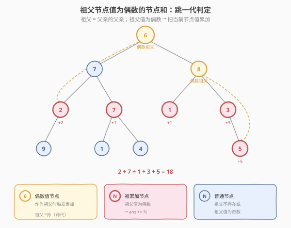
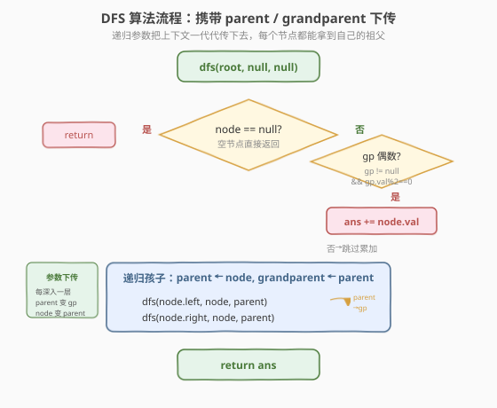
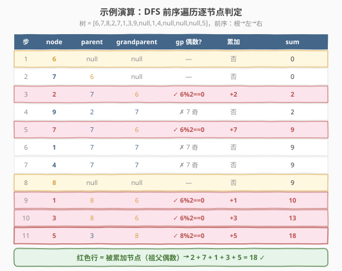

# LeetCode 祖父节点值为偶数的节点和 题解

## 1. 题目概述

- **标题 / 题号**：祖父节点值为偶数的节点和（#1315，medium）
- **链接**：https://leetcode.cn/problems/sum-of-nodes-with-even-valued-grandparent/
- **难度**：中等
- **标签**：树、二叉树、深度优先搜索（DFS）、广度优先搜索（BFS）

**题意**：给你一棵二叉树的根节点 `root`，请返回**祖父节点值为偶数**的节点值之和。如果不存在这样的节点，返回 `0`。

> **祖父节点**（grandparent）：一个节点的父亲的父亲。即从当前节点向上跳两代。若该节点不存在祖父（深度 < 2），则不计入。

**示例 1**：

```text
输入：root = [6,7,8,2,7,1,3,9,null,1,4,null,null,null,5]
输出：18

            6
          /   \
         7     8
        / \   / \
       2   7 1   3
      /   / \     \
     9   1   4     5
```

被累加的节点（祖父值为偶数）：

- 深度 2 的 `2、7、1、3`：祖父都是根 `6`（偶数）→ $2+7+1+3=13$
- 深度 3 的 `5`：祖父是 `8`（偶数）→ $+5$
- 深度 3 的 `9、1、4`：祖父是 `7`（奇数）→ 不累加

合计 $13+5=18$。

**示例 2**：

```text
输入：root = [1]
输出：0
解释：只有一个节点，无祖父。
```

**约束**：

- 树中节点数目在范围 `[1, 10^4]` 内
- `1 <= Node.val <= 100`

> 💡 本题的灵魂是「**携带上下文下传**」——每个节点需要知道自己两代之上的祖先。把 `parent` 和 `grandparent` 作为递归参数逐层传下去，每个节点就能 $O(1)$ 拿到祖父，一次遍历 $O(n)$ 完成。

## 2. 解题思路

### 2.1 暴力思路：逐节点向上找祖父

最直观的做法：遍历每个节点，对每个节点从根出发重新搜索路径，或维护父指针后向上跳两步找到祖父，再判断祖父值是否为偶数。问题在于——要么需要额外的父指针映射（一次 BFS 预处理 $O(n)$ + 遍历判定 $O(n)$），要么每个节点向上查找 $O(h)$ 共 $O(nh)$。能过，但**完全没有利用「祖先信息可沿递归自然下传」的性质**——递归深入时，父亲和祖父天然已知，无需回头找。

### 2.2 核心观察：参数携带 parent / grandparent 下传



**关键洞察**：递归遍历二叉树时，每深入一层，**当前节点的父亲就是上一层的 `node`，祖父就是上一层的 `parent`**。因此只需把 `parent` 和 `grandparent` 作为递归参数传下去，每个节点都能直接拿到自己的祖父——无需任何额外查找。

> 以 `node` 为当前节点，则：
> - `node` 的孩子调用 `dfs(child, node, parent)`——`node` 变成孩子的 `parent`，原来的 `parent` 变成孩子的 `grandparent`。
> - 判定逻辑极简：`if grandparent != null and grandparent.val % 2 == 0: ans += node.val`。

> ⚠️ **根节点与深度 1 节点**：根节点 `grandparent = null`，深度 1 节点 `grandparent = null`（根无父亲）。`null` 判定天然跳过，无需特判——这是「空指针当哨兵」的优雅之处。

### 2.3 算法流程图



**DFS 完整步骤**（函数 `dfs(node, parent, grandparent)`）：

1. **空节点**：直接 `return`（递归基底）；
2. **检查祖父**：若 `grandparent != null` 且 `grandparent.val % 2 == 0`，则 `ans += node.val`；
3. **递归左孩子**：`dfs(node.left, node, parent)`——`node` 升格为 `parent`，原 `parent` 升格为 `grandparent`；
4. **递归右孩子**：`dfs(node.right, node, parent)`——同理；
5. **入口**：`dfs(root, null, null)`——根节点的 `parent` 和 `grandparent` 都是 `null`。

> 💡 **参数升格**：每深入一层，角色发生「升格」——当前的 `node` 在孩子眼中变成 `parent`，当前的 `parent` 在孩子眼中变成 `grandparent`。这种「角色下移」是所有「需知 $k$ 代祖先」问题的通用模板：需要几代就传几个参数。

### 2.4 示例演算

以示例 1 的树 `[6,7,8,2,7,1,3,9,null,1,4,null,null,null,5]` 为例，前序遍历（根→左→右）逐节点判定：



| 步 | node | parent | grandparent | 祖父偶数? | 累加 | sum |
|----|------|--------|-------------|-----------|------|-----|
| 1 | 6 | null | null | — | 否 | 0 |
| 2 | 7 | 6 | null | — | 否 | 0 |
| 3 | 2 | 7 | 6 | ✓ | +2 | 2 |
| 4 | 9 | 2 | 7 | ✗ 7 奇 | 否 | 2 |
| 5 | 7 | 7 | 6 | ✓ | +7 | 9 |
| 6 | 1 | 7 | 7 | ✗ 7 奇 | 否 | 9 |
| 7 | 4 | 7 | 7 | ✗ 7 奇 | 否 | 9 |
| 8 | 8 | null | null | — | 否 | 9 |
| 9 | 1 | 8 | 6 | ✓ | +1 | 10 |
| 10 | 3 | 8 | 6 | ✓ | +3 | 13 |
| 11 | 5 | 3 | 8 | ✓ | +5 | **18** ✓ |

最终 `ans = 18`。注意步骤 9–10：节点 `1` 和 `3` 的 `parent` 是 `8`、`grandparent` 是 `6`——`8` 本身虽是偶数，但作为 `parent` 不参与判定，判定看的是 `grandparent = 6`（偶数 ✓）。步骤 11 的节点 `5`：`grandparent = 8`（偶数 ✓），这才轮到 `8` 作为祖父触发累加。

> 💡 **偶数值 ≠ 被累加**：节点 `2`（偶数）被累加是因为它的祖父 `6` 是偶数，而非它自己是偶数；节点 `4`（偶数）**未**被累加，因为它的祖父 `7` 是奇数。判定只看祖父，与当前节点自身奇偶无关。

## 3. 参考代码

### C++

```cpp
// 祖父节点值为偶数的节点和.cpp —— DFS 携带 parent/grandparent
// 编译: g++ -O2 -std=c++17 祖父节点值为偶数的节点和.cpp -o grandparent
#include <algorithm>
using namespace std;

struct TreeNode {
    int val;
    TreeNode* left;
    TreeNode* right;
    TreeNode() : val(0), left(nullptr), right(nullptr) {}
    TreeNode(int x) : val(x), left(nullptr), right(nullptr) {}
    TreeNode(int x, TreeNode* l, TreeNode* r) : val(x), left(l), right(r) {}
};

class Solution {
   public:
    int ans = 0;

    int sumEvenGrandparent(TreeNode* root) {
        dfs(root, nullptr, nullptr);
        return ans;
    }

    void dfs(TreeNode* node, TreeNode* parent, TreeNode* grandparent) {
        if (!node) return;                                   // ① 空节点返回
        if (grandparent && grandparent->val % 2 == 0)        // ② 祖父存在且偶数
            ans += node->val;
        dfs(node->left, node, parent);                       // ③ node 升格为 parent
        dfs(node->right, node, parent);                      // ④ 同理右子
    }
};
```

### Python

```python
class Solution:
    def sumEvenGrandparent(self, root: TreeNode | None) -> int:
        ans = 0

        def dfs(node: TreeNode | None,
                parent: TreeNode | None,
                grandparent: TreeNode | None) -> None:
            nonlocal ans
            if not node:
                return                                     # ① 空节点返回
            if grandparent and grandparent.val % 2 == 0:    # ② 祖父存在且偶数
                ans += node.val
            dfs(node.left, node, parent)                   # ③ node 升格为 parent
            dfs(node.right, node, parent)                  # ④ 同理右子

        dfs(root, None, None)
        return ans
```

> 💡 两版等价。核心只有一行判定 `grandparent and grandparent.val % 2 == 0`。`grandparent` 为 `None`/`nullptr` 时短路跳过，无需特判根与深度 1 节点——这是「空指针当哨兵」的简洁之处。

## 4. 复杂度分析

| 维度 | DFS（推荐） | BFS |
|------|------------|-----|
| 时间复杂度 | $O(n)$ | $O(n)$ |
| 空间复杂度 | $O(h)$（递归栈） | $O(n)$（队列存三元组） |
| 实现简洁度 | ★★★★★ 三参数递归 | ★★★ 需存 `(node, parent, gp)` 三元组 |

> ⚠️ **空间对比**：DFS 递归栈深度为树高 $h$，平衡树 $O(\log n)$，退化为链表 $O(n)$；BFS 队列最多存一整层，满二叉树约 $n/2$ → $O(n)$。本题 $n \leq 10^4$，两种空间都完全可接受。DFS 写法更简洁，面试推荐。

## 5. 扩展：BFS 队列存三元组

若面试官要求避免递归（树极深时栈溢出风险），可用 BFS：队列中每个元素是 `(node, parent, grandparent)` 三元组，处理时同样检查 `grandparent`。

```python
from collections import deque

class Solution:
    def sumEvenGrandparent(self, root: TreeNode | None) -> int:
        if not root:
            return 0
        ans = 0
        queue = deque([(root, None, None)])        # (node, parent, grandparent)
        while queue:
            node, parent, grandparent = queue.popleft()
            if grandparent and grandparent.val % 2 == 0:
                ans += node.val
            if node.left:
                queue.append((node.left, node, parent))    # node 升格为 parent
            if node.right:
                queue.append((node.right, node, parent))
        return ans
```

> 💡 **DFS vs BFS**：两者逻辑完全同构——都是「把 `parent`/`grandparent` 作为上下文随节点一起传播」。区别仅在遍历方式：DFS 用递归栈沿深度方向传，BFS 用队列沿广度方向传。判定代码一字不差。本题无按层聚合需求，DFS 更短更直观。

## 6. 面试要点

1. **为什么把 `parent` 和 `grandparent` 作为参数传，而不是用全局变量或回查？**

   > 递归天然沿父子链下降，每深入一层「当前 `node` 就是孩子的 `parent`，当前 `parent` 就是孩子的 `grandparent`」。把这两个角色作为参数下传，每个节点 $O(1)$ 拿到祖父，无需额外查找或全局状态。全局变量方案需在进入/退出时手动维护栈，易错且不优雅；回查方案需父指针映射或重复搜索，多一轮遍历。

2. **根节点和深度 1 的节点怎么处理？**

   > 它们的 `grandparent` 为 `null`。判定条件 `grandparent and grandparent.val % 2 == 0` 中，`null` 短路跳过，自动不计入——无需任何 `if depth < 2` 的特判。这就是「空指针当哨兵」的简洁之处，与 [250. 统计同值子树](../0201-0300/250_统计同值子树.md) 中空节点返回 `true` 的约定一脉相承。

3. **如果题目改为「曾祖父（向上跳三代）值为偶数」怎么改？**

   > 多加一个参数 `great_grandparent`，递归调用 `dfs(child, node, parent, grandparent)`——角色再升格一层。这是「需知 $k$ 代祖先」问题的通用模板：需要几代就传几个参数。时间仍 $O(n)$，空间 $O(h)$ 不变（参数数量是常数，不影响渐近复杂度）。

4. **DFS 和 BFS 哪个更好？**

   > 本题无按层聚合需求，DFS 写法更短（三参数递归 vs BFS 三元组队列）。DFS 空间 $O(h)$ 也优于 BFS 的 $O(n)$。仅当树极深（递归栈溢出风险）时才考虑 BFS。这与 [1302. 层数最深叶子节点的和](./1302_层数最深叶子节点的和.md) 中「按层聚合优先 BFS」的选型逻辑相反——选型取决于问题结构而非个人偏好。

5. **节点自身的奇偶性影响结果吗？**

   > 不影响。判定只看祖父的值，与当前节点自身的奇偶无关。例如节点 `2`（偶数）被累加是因为祖父 `6` 偶数；节点 `4`（偶数）未被累加是因为祖父 `7` 奇数。题目要求的是「祖父值为偶数的节点之和」，不是「偶数值节点之和」——审题时别混淆。

> 💡 **一句话总结**：1315 的灵魂是「**携带上下文下传**」——把 `parent` 和 `grandparent` 作为递归参数逐层传递，每个节点 $O(1)$ 拿到自己的祖父。这个「角色升格」模板可推广到「需知 $k$ 代祖先」的任意树形遍历问题，是 DFS 传参技巧的招牌应用。

## 同类练习题

| # | 题目 | 与本题的关联 |
|---|------|-------------|
| 2641 | [二叉树的堂兄弟节点 II](https://leetcode.cn/problems/cousins-in-binary-tree-ii/) | 同样需要知道父辈层级信息，BFS 逐层替换为兄弟和，是「携带层级上下文」的变体 |
| 993 | [二叉树的堂兄弟节点](https://leetcode.cn/problems/cousins-in-binary-tree/) | 判定两节点是否同深度但不同父亲，DFS 传 `(depth, parent)` 上下文，与本题同套「参数下传」模板 |
| 1302 | [层数最深叶子节点的和](./1302_层数最深叶子节点的和.md) | 树形 BFS/DFS 选型对照，按层聚合用 BFS、传上下文用 DFS |
| 250 | [统计同值子树](../0201-0200/250_统计同值子树.md) | 后序传递子树判定结果，与本题的「前序/参数下传」对照——一个自底向上、一个自顶向下，覆盖树形遍历两大方向 |
| 102 | [二叉树的层序遍历](../0101-0200/102_二叉树的层序遍历.md) | BFS `while + for(size)` 母题，BFS 解法的队列操作基础 |
