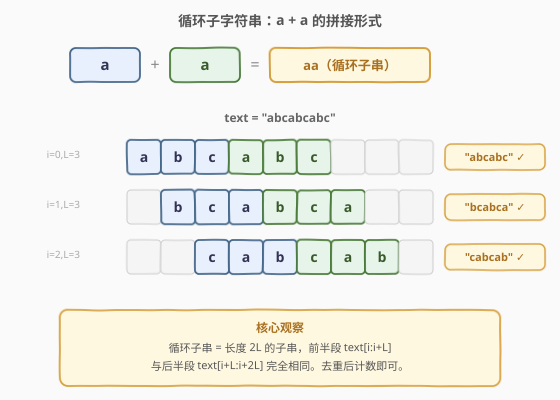
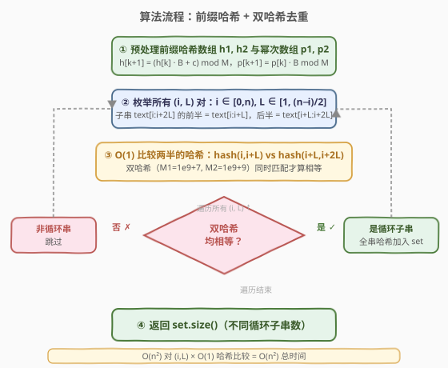
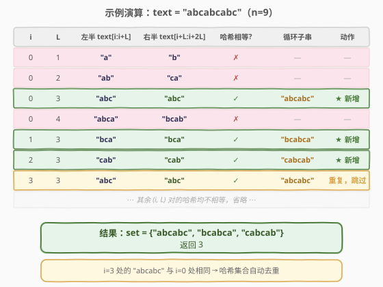

# 不同的循环子字符串

- **题目名称**：不同的循环子字符串
- **链接**：[1316. 不同的循环子字符串](https://leetcode.cn/problems/distinct-echo-substrings/)
- **难度**：困难
- **标签**：字符串、哈希表、滚动哈希

## 1. 题目概述

给你一个字符串 `text`，返回满足下述条件的**不同**非空子字符串的数目：可以写成某个字符串与其自身相连接的形式（即 `a + a`，其中 `a` 是某个非空字符串）。

例如，`abcabc` 就是 `abc` 和它自身连接形成的，是一个「循环子串」（echo substring）。

**示例 1**：

```text
输入：text = "abcabcabc"
输出：3
解释：3 个子字符串分别为 "abcabc"、"bcabca" 和 "cabcab"。
```

**示例 2**：

```text
输入：text = "leetcodeleetcode"
输出：2
解释：2 个子字符串为 "ee" 和 "leetcodeleetcode"。
```

**约束条件**：

- `1 <= text.length <= 2000`
- `text` 只包含小写英文字母

> 💡 本题的精髓在于：一个循环子串 `text[i:i+2L]` 的前半段 `text[i:i+L]` 与后半段 `text[i+L:i+2L]` 必须完全相同。暴力比较每对子串需 $O(n^3)$，而用**前缀哈希**可以在 $O(1)$ 内比较任意子串，把总复杂度压到 $O(n^2)$。再用**双哈希**消除冲突、哈希集合自动去重——这是「前缀哈希 + 子串相等判定」的经典应用。

---

## 2. 解题思路

### 2.1 暴力思路

枚举所有起点 $i$ 和半长 $L$，直接逐字符比较 `text[i:i+L]` 与 `text[i+L:i+2L]` 是否相等。若相等则把子串 `text[i:i+2L]` 加入哈希集合去重。

```cpp
int distinctEchoSubstrings(string text) {
    int n = text.size();
    set<string> seen;
    for (int i = 0; i < n; i++)
        for (int L = 1; i + 2 * L <= n; L++)
            if (text.substr(i, L) == text.substr(i + L, L))
                seen.insert(text.substr(i, 2 * L));
    return seen.size();
}
```

共 $O(n^2)$ 对 $(i, L)$，每次 `substr` 比较 $O(L)$、存入集合 $O(L)$，总时间 $O(n^3)$。$n = 2000$ 时约 $8 \times 10^9$ 次操作，必然超时。

> ⚠️ 本质瓶颈：每对 $(i, L)$ 都要**重新扫描整个半串**来判等。能否像前缀和那样预处理，让任意子串的比较变成 $O(1)$？

### 2.2 核心观察：前缀哈希 + 双哈希去重



**前缀哈希**（又称多项式哈希）的核心思想：把字符串看作一个 $B$ 进制数，用前缀数组记录「从开头到每个位置的多项式值」，任意子串 `text[l:r]` 的哈希可在 $O(1)$ 内通过前缀差得到：

$$\text{hash}(l, r) = h[r] - h[l] \cdot B^{r-l} \pmod{M}$$

这样，判断 `text[i:i+L]` 与 `text[i+L:i+2L]` 是否相等，只需比较两个 $O(1)$ 的哈希值，而非扫描 $L$ 个字符。

> 💡 **为什么要双哈希？** 单模数哈希存在碰撞风险：两个不同子串可能恰好同余。虽然概率很低（约 $1/M$），但 $O(n^2)$ 对比较中累计碰撞概率不可忽略。用两组不同的 $(B, M)$ 同时验证，两对哈希都相等才认定子串相同——碰撞概率降到 $1/(M_1 \cdot M_2) \approx 10^{-18}$，实际不可能碰撞。

**去重策略**：确认某 $(i, L)$ 对是循环子串后，计算完整子串 `text[i:i+2L]` 的双哈希对 $(f_1, f_2)$，存入 `set<pair>`。集合自动按哈希值去重，最终大小即为答案。

### 2.3 算法流程图



整体四步：

1. **预处理**：一趟扫描构建两组前缀哈希数组 $h_1, h_2$ 和幂次数组 $p_1, p_2$，每个元素 $O(1)$ 递推。
2. **枚举 $(i, L)$**：外层遍历起点 $i \in [0, n)$，内层遍历半长 $L \in [1, \lfloor(n-i)/2\rfloor]$，保证 $i + 2L \le n$。
3. **$O(1)$ 哈希比较**：计算左半 $\text{hash}(i, i\!+\!L)$ 与右半 $\text{hash}(i\!+\!L, i\!+\!2L)$，两组哈希都相等才判定为循环子串。
4. **去重计数**：将完整子串的双哈希对插入 `set`，最终返回 `set.size()`。

> ⚠️ **幂次预处理**是关键：$p[k] = B^k \bmod M$ 必须提前算好，否则每次 `hash(l,r)` 都要重新计算 $B^{r-l}$，退化到 $O(\log n)$。

### 2.4 示例演算



以 `text = "abcabcabc"`（$n = 9$）为例，追踪关键 $(i, L)$ 对：

| $i$ | $L$ | 左半 | 右半 | 哈希相等? | 循环子串 | 动作 |
|-----|-----|------|------|-----------|----------|------|
| 0 | 1 | `"a"` | `"b"` | ✗ | — | — |
| 0 | 2 | `"ab"` | `"ca"` | ✗ | — | — |
| **0** | **3** | `"abc"` | `"abc"` | **✓** | `"abcabc"` | **★ 新增** |
| 0 | 4 | `"abca"` | `"bcab"` | ✗ | — | — |
| **1** | **3** | `"bca"` | `"bca"` | **✓** | `"bcabca"` | **★ 新增** |
| **2** | **3** | `"cab"` | `"cab"` | **✓** | `"cabcab"` | **★ 新增** |
| **3** | **3** | `"abc"` | `"abc"` | **✓** | `"abcabc"` | **重复，跳过** |
| ⋯ | ⋯ | ⋯ | ⋯ | ⋯ | ⋯ | ⋯ |

- **$i=0, L=3$**：左半 `"abc"` 哈希 == 右半 `"abc"` 哈希，确认循环子串 `"abcabc"`，双哈希对加入 `set`。
- **$i=3, L=3$**：同样匹配出 `"abcabc"`，但其双哈希对已在 `set` 中，自动跳过——这就是哈希集合去重的体现。
- 其余 $(i, L)$ 对的左半与右半哈希不等，快速跳过。

最终 `set` 大小为 3，对应三个不同的循环子串。

---

## 3. 参考代码

### C++

```cpp
class Solution {
  public:
    int distinctEchoSubstrings(string text) {
        int n = text.size();
        const long long M1 = 1e9 + 7, B1 = 31;
        const long long M2 = 1e9 + 9, B2 = 37;

        vector<long long> h1(n + 1), p1(n + 1), h2(n + 1), p2(n + 1);
        p1[0] = p2[0] = 1;
        for (int i = 0; i < n; i++) {
            int c = text[i] - 'a' + 1;
            h1[i + 1] = (h1[i] * B1 + c) % M1;
            p1[i + 1] = p1[i] * B1 % M1;
            h2[i + 1] = (h2[i] * B2 + c) % M2;
            p2[i + 1] = p2[i] * B2 % M2;
        }

        auto sub = [&](const vector<long long>& h,
                       const vector<long long>& p,
                       long long M, int l, int r) -> long long {
            return ((h[r] - h[l] * p[r - l]) % M + M) % M;
        };

        set<pair<long long, long long>> seen;
        for (int i = 0; i < n; i++) {
            for (int L = 1; i + 2 * L <= n; L++) {
                long long lh1 = sub(h1, p1, M1, i, i + L);
                long long rh1 = sub(h1, p1, M1, i + L, i + 2 * L);
                if (lh1 != rh1) continue;
                long long lh2 = sub(h2, p2, M2, i, i + L);
                long long rh2 = sub(h2, p2, M2, i + L, i + 2 * L);
                if (lh2 != rh2) continue;
                long long fh1 = sub(h1, p1, M1, i, i + 2 * L);
                long long fh2 = sub(h2, p2, M2, i, i + 2 * L);
                seen.insert({fh1, fh2});
            }
        }
        return seen.size();
    }
};
```

### Python

```python
class Solution:
    def distinctEchoSubstrings(self, text: str) -> int:
        n = len(text)
        M1, B1 = 10**9 + 7, 31
        M2, B2 = 10**9 + 9, 37

        h1 = [0] * (n + 1)
        p1 = [1] * (n + 1)
        h2 = [0] * (n + 1)
        p2 = [1] * (n + 1)
        for i in range(n):
            c = ord(text[i]) - 96
            h1[i + 1] = (h1[i] * B1 + c) % M1
            p1[i + 1] = (p1[i] * B1) % M1
            h2[i + 1] = (h2[i] * B2 + c) % M2
            p2[i + 1] = (p2[i] * B2) % M2

        def sub(h, p, M, l, r):
            return (h[r] - h[l] * p[r - l]) % M

        seen = set()
        for i in range(n):
            for L in range(1, (n - i) // 2 + 1):
                if sub(h1, p1, M1, i, i + L) != sub(h1, p1, M1, i + L, i + 2 * L):
                    continue
                if sub(h2, p2, M2, i, i + L) != sub(h2, p2, M2, i + L, i + 2 * L):
                    continue
                fh1 = sub(h1, p1, M1, i, i + 2 * L)
                fh2 = sub(h2, p2, M2, i, i + 2 * L)
                seen.add((fh1, fh2))

        return len(seen)
```

> 💡 两版骨架一致：预处理前缀哈希 → 枚举 $(i, L)$ → 双哈希判等 → 集合去重。Python 的 `%` 对正数恒非负，无需像 C++ 那样 `+ M` 修正负余数。`ord(text[i]) - 96` 等价于 `ord(text[i]) - ord('a') + 1`，保证 `'a'` 映射到 1（而非 0），避免前导零导致 `"a"` 与 `""` 哈希相同。

> ⚠️ **C++ 注意**：`h[l] * p[r-l]` 可能达到 $(10^9)^2 = 10^{18}$，在 `long long`（最大 $\approx 9.2 \times 10^{18}$）范围内安全。但若改用 `int` 会溢出，必须用 `long long`。

---

## 4. 复杂度分析

| 维度 | 复杂度 | 说明 |
|------|--------|------|
| 时间复杂度 | $O(n^2)$ | $\frac{n^2}{2}$ 对 $(i, L)$，每对 $O(1)$ 哈希比较；预处理 $O(n)$ |
| 空间复杂度 | $O(n^2)$ | 最坏情况 $O(n^2)$ 个循环子串存入 `set`；前缀数组 $O(n)$ |
| 哈希冲突 | $\approx 10^{-18}$ | 双哈希 $(10^9\!+\!7) \times (10^9\!+\!9)$，实际不可能碰撞 |

> ⚠️ 空间上界：$n = 2000$ 时 $(i, L)$ 对总数约 $\sum_{i=0}^{n-1} \lfloor\frac{n-i}{2}\rfloor \approx \frac{n^2}{4} = 10^6$，但实际循环子串数远小于此（大多数对哈希不等），`set` 通常远小于理论上界。

---

## 5. 扩展：unsigned long long 自然溢出与 Z 数组解法

### 5.1 C++ 单哈希自然溢出（更简洁）

利用 `unsigned long long` 自动对 $2^{64}$ 取模的特性，省去手动取模，代码更简洁：

```cpp
class Solution {
  public:
    int distinctEchoSubstrings(string text) {
        int n = text.size();
        const unsigned long long B = 131;
        vector<unsigned long long> h(n + 1), p(n + 1);
        h[0] = 0; p[0] = 1;
        for (int i = 0; i < n; i++) {
            h[i + 1] = h[i] * B + (text[i] - 'a' + 1);
            p[i + 1] = p[i] * B;
        }
        auto getHash = [&](int l, int r) -> unsigned long long {
            return h[r] - h[l] * p[r - l];
        };
        unordered_set<unsigned long long> seen;
        for (int i = 0; i < n; i++)
            for (int L = 1; i + 2 * L <= n; L++)
                if (getHash(i, i + L) == getHash(i + L, i + 2 * L))
                    seen.insert(getHash(i, i + 2 * L));
        return seen.size();
    }
};
```

> ⚠️ 自然溢出的模数 $2^{64}$ 非质数，理论上存在被构造数据卡哈希的风险（Thue-Morse 序列等）。本题 $n \le 2000$、LeetCode 无专门反哈希数据，实际安全。面试中若被追问，可改用双哈希或随机基数。

### 5.2 Z 数组解法（确定性无哈希）

对每个起点 $i$，对后缀 `text[i:]` 计算 Z 数组：$Z[j]$ 表示 `text[i:]` 与 `text[i+j:]` 的最长公共前缀。若 $Z[j] \ge j$，则 `text[i:i+j]` == `text[i+j:i+2j]`，即 `text[i:i+2j]` 是半长 $j$ 的循环子串。

每个起点算 Z 数组 $O(n)$，共 $n$ 个起点，总 $O(n^2)$。去重仍需哈希集合或字符串集合。此法无哈希冲突风险，但常数略大。

---

## 6. 面试要点

1. **前缀哈希如何实现 $O(1)$ 子串比较？**

   > 预处理前缀数组 $h[k] = \text{hash}(\text{text}[0:k])$ 和幂次数组 $p[k] = B^k \bmod M$。子串 $\text{text}[l:r]$ 的哈希 $= h[r] - h[l] \cdot p[r-l] \bmod M$，全部 $O(1)$ 运算。本质是把字符串视为 $B$ 进制数，前缀差就是「去掉高位前缀、保留低位子串」的多项式值。

2. **为什么要双哈希？单哈希不够吗？**

   > 单模数哈希的碰撞概率约 $1/M \approx 10^{-9}$。本题 $O(n^2) \approx 10^6$ 对比较， birthday bound 下累计碰撞概率约 $n^2 / (2M) \approx 5 \times 10^{-4}$，虽小但非零。双哈希把碰撞概率降到 $1/(M_1 M_2) \approx 10^{-18}$，实际不可能碰撞。

3. **为什么 `'a'` 要映射到 1 而不是 0？**

   > 若 `'a'` 映射到 0，则字符串 `"a"` 与空串 `""` 的哈希都是 0，无法区分。映射到 1 保证每个字符对哈希有非零贡献，前导字符不会「消失」。这是多项式哈希的标准做法。

4. **去重为什么用哈希集合而不是存字符串？**

   > 存 `set<string>` 每次插入需 $O(L)$ 拷贝，$O(n^2)$ 个子串总空间可达 $O(n^3)$，$n = 2000$ 时约 $8 \times 10^9$ 字节，不可行。哈希集合存 `long long` 对，每次插入 $O(1)$，总空间 $O(n^2)$ 个整数，完全可行。

5. **如果 $n$ 更大（如 $10^5$），该怎么做？**

   > $O(n^2)$ 不再可行。可用后缀数组 + LCP：在 suffix array 上，相邻后缀的 LCP 告诉我们哪些位置的子串相同。对每个间距 $d$，用滑动窗口找长度 $\ge d$ 的等距匹配段，判断是否构成循环子串。复杂度 $O(n \log n)$ 但实现复杂度高，竞赛中较少考察。

---

## 7. 同类练习题

- [187. 重复的 DNA 序列](https://leetcode.cn/problems/repeated-dna-sequences/)（[题解](../0101-0200/187_重复的DNA序列.md)）：滚动哈希的经典招牌题——2 位编码 + 20 位完美哈希，对照本题的通用多项式哈希
- [1044. 最长重复子串](https://leetcode.cn/problems/longest-duplicate-substring/)：二分答案 + Rabin-Karp 滚动哈希判定重复，本题的「找最长」变体，需处理哈希冲突
- [28. 找出字符串中第一个匹配项的下标](https://leetcode.cn/problems/find-the-index-of-the-first-occurrence-in-a-string/)：KMP / Rabin-Karp 字符串匹配，前缀哈希的单模式查找版
- [718. 最长重复子数组](https://leetcode.cn/problems/maximum-length-of-repeated-subarray/)（[题解](../0601-0700/718_最长重复子数组.md)）：DP 求两数组最长公共子串，也可用滚动哈希 + 二分，对照本题的「哈希判等」
- [1147. 最长 chopstick 子串](https://leetcode.cn/problems/longest-chunked-palindrome-decomposition/)：贪心 + 滚动哈希判断前后缀相等，前缀哈希的另一种应用场景
