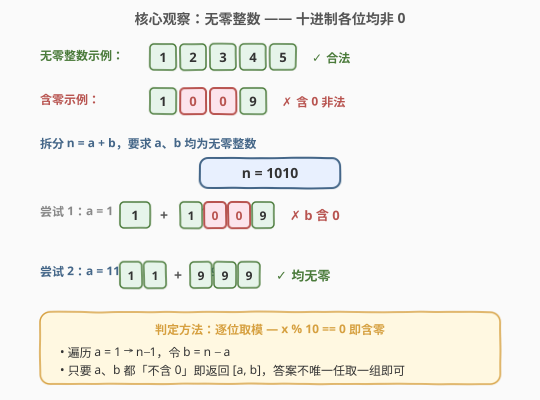
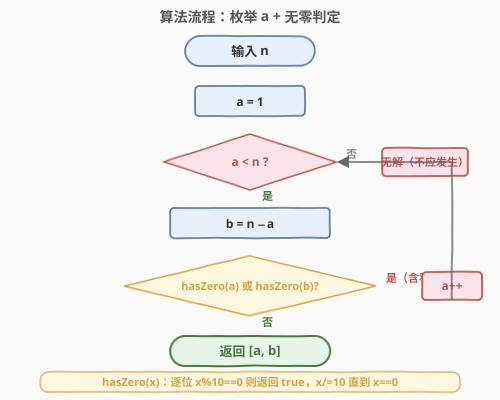
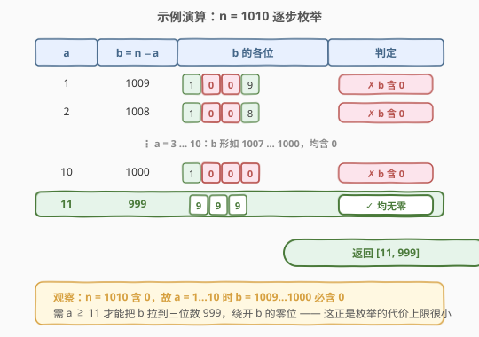

# 将整数转换为两个无零整数的和

- **题目名称**：将整数转换为两个无零整数的和
- **链接**：[1317. 将整数转换为两个无零整数的和](https://leetcode.cn/problems/convert-integer-to-the-sum-of-two-no-zero-integers/)
- **难度**：简单
- **标签**：数学、枚举、数位判定

## 1. 题目概述

「无零整数」是十进制表示中**不含任何 0** 的正整数。给定整数 `n`，返回任意一组 `[a, b]` 满足：

- `a`、`b` 都是无零整数；
- `a + b = n`。

题目保证至少存在一组有效解；若有多组，返回任意一组即可。

**示例 1**：

```text
输入：n = 2
输出：[1,1]
```

**示例 2**：

```text
输入：n = 11
输出：[2,9]
```

**示例 3**：

```text
输入：n = 10000
输出：[1,9999]
```

**示例 4**：

```text
输入：n = 69
输出：[1,68]
```

**示例 5**：

```text
输入：n = 1010
输出：[11,999]
```

**约束条件**：

- `2 <= n <= 10^4`

> 💡 答案不唯一——只要 `a + b = n` 且二者均不含 0 即可。本题考查的是**数位判定 + 小范围枚举**：如何判定一个数「不含 0」，以及在最坏情况下需要枚举多少个 `a`。

---

## 2. 解题思路

### 2.1 暴力思路

最直接的做法：从 `a = 1` 开始枚举到 `n - 1`，令 `b = n - a`，逐一检查 `a` 和 `b` 的十进制各位是否都不为 0。第一个同时满足的数对即为答案。

关键问题只剩一个：**如何高效判定一个正整数不含 0**？答案是逐位取模——`x % 10` 取出末位，若为 0 则含零；否则 `x /= 10` 抹掉末位，直到 `x == 0`。

### 2.2 核心观察：数位取模判定 + 小范围枚举



**观察 1：无零判定只需 $O(\log n)$**

正整数 $x$ 的十进制位数为 $\lfloor \log_{10} x \rfloor + 1$。逐位取模检查，最多循环 5 次（$n \le 10^4$ 为 4 位数，$a, b \le n$ 故最多 4-5 位），代价极小。

**观察 2：枚举范围实际很小**

虽然 `a` 理论上可取到 $n-1$，但「无零整数」非常稠密。统计可知 $\le 10^4$ 的正整数中无零整数有

$$
9 + 9^2 + 9^3 + 9^4 = 9 + 81 + 729 + 6561 = 7380
$$

个（1 位 $9$ 个、2 位 $9^2$ 个、3 位 $9^3$ 个、4 位 $9^4$ 个，每位只能选 1-9）。占比约 $7380 / 10000 \approx 73.8\%$。

> ⚠️ 这意味着随机取一对 $(a, n-a)$，二者都无零的概率约为 $0.738^2 \approx 0.545$，期望枚举不到 2 次就能命中。即便最坏情形（如 $n = 1010$ 需枚举到 $a = 11$）也仅需 11 步。$O(n \log n)$ 的上界非常宽松，实际近乎常数。

**观察 3：为什么 $n$ 含 0 时枚举步数会偏多？**

当 $n$ 本身含 0（如 $n = 1010$），$b = n - a$ 在 $a$ 较小时仍接近 $n$，大概率继承 $n$ 的高位 0 结构。需 $a$ 足够大、把 $b$ 「拉短」到更短的位数（如 $b$ 从四位数 1009 降到三位数 999）才能绕开零位。这是最坏情形的来源，但即便如此步数仍很小。

### 2.3 算法流程图



**完整步骤**：

1. **输入** `n`。
2. **初始化** `a = 1`。
3. **循环** `a < n`：
   - 令 `b = n - a`。
   - 若 `hasZero(a)` 或 `hasZero(b)` 为真 → `a++` 继续。
   - 否则 → 返回 `[a, b]`。
4. （题目保证有解，循环内必然返回。）

> 💡 `hasZero(x)` 实现：`while x > 0: if x % 10 == 0: return True; x //= 10`，返回 `False`。注意 $x = 0$ 不应进入（本题 $a, b \ge 1$）。

### 2.4 示例演算

以 $n = 1010$（含 0，最坏代表）为例：



| $a$ | $b = n - a$ | $b$ 的各位 | 判定 |
|-----|-------------|-----------|------|
| 1 | 1009 | 1, 0, 0, 9 | ✗ $b$ 含 0 |
| 2 | 1008 | 1, 0, 0, 8 | ✗ $b$ 含 0 |
| ⋮ | ⋮ | ⋮ | ⋮ |
| 10 | 1000 | 1, 0, 0, 0 | ✗ $b$ 含 0 |
| 11 | 999 | 9, 9, 9 | ✓ 均无零 |

返回 `[11, 999]`，共枚举 11 步。可见即便最坏情形也远小于 $n$。

---

## 3. 参考代码

### 方法一：枚举 + 数位取模判定（推荐）

### C++

```cpp
class Solution {
public:
    bool hasZero(int x) {
        while (x > 0) {
            if (x % 10 == 0) return true;
            x /= 10;
        }
        return false;
    }
    vector<int> getNoZeroIntegers(int n) {
        for (int a = 1; a < n; a++) {
            int b = n - a;
            if (!hasZero(a) && !hasZero(b)) return {a, b};
        }
        return {};
    }
};
```

### Python

```python
class Solution:
    def getNoZeroIntegers(self, n: int) -> List[int]:
        def no_zero(x: int) -> bool:
            while x > 0:
                if x % 10 == 0:
                    return False
                x //= 10
            return True
        for a in range(1, n):
            b = n - a
            if no_zero(a) and no_zero(b):
                return [a, b]
        return []
```

> 💡 Python 版 `no_zero` 还可写作 `return '0' not in str(x)`，直观但常数略大（字符串转换）。数位取模版在所有语言通用且最快。

---

## 4. 复杂度分析

| 维度 | 复杂度 | 说明 |
|------|--------|------|
| **时间** | $O(n \log n)$（最坏上界） | 枚举 $a$ 至多 $n-1$ 次，每次两次 `hasZero` 各 $O(\log n)$ |
| **实际时间** | 近似 $O(\log n)$ | 无零整数稠密（占比约 74%），期望枚举次数 < 2，最坏如 $n=1010$ 仅 11 步 |
| **空间** | $O(1)$ | 仅用常数个整型变量，无额外数据结构 |

> 上界 $O(n \log n)$ 看似线性偏大，但 $n \le 10^4$ 且实际枚举极少，运行时间在微秒级。本题无需更优构造。

---

## 5. 扩展：能否 $O(\log n)$ 直接构造？

可以，但代码复杂度上升、对面试收益有限，仅作思路延伸。

**逐位构造（带借位）**：从低位到高位处理 $n$ 的每一位 $d_i$，维护低位进上来的 `carry`，为每位选 $a_i, b_i \in [1, 9]$ 满足

$$
a_i + b_i = d_i + 10 \cdot \text{carry}_{\text{out}} - \text{carry}_{\text{in}}
$$

- 若 $d_i - \text{carry}_{\text{in}} \ge 2$：取 $a_i = 1,\ b_i = d_i - \text{carry}_{\text{in}} - 1$，`carry_out = 0`（无需借位）。
- 否则（差值 $\le 1$，无法拆成两个非零位）：向高位借 1，取 $a_i, b_i$ 为 $\{1,9\}$ 或 $\{2,9\}$ 凑出 $10$ 或 $11$，`carry_out = 1`。
- 由于 $a, b$ 可短于 $n$（高位视为前导零，不计入），最终 `carry` 自然消解。

> ⚠️ 该构造需小心处理借位传播与 $a, b$ 位数不等的情况，边界多、易写错。鉴于 $n \le 10^4$，**面试中首选方法一**；只有当约束放大到 $n \le 10^{18}$ 时，$O(\log n)$ 构造才有必要。

---

## 6. 面试要点

1. **为什么枚举 $a$ 而不是枚举 $b$？**

   > 对称——$a$ 与 $b$ 地位等价（$a + b = n$），枚举哪一个都行。约定从小到大枚举 $a$ 只是便于书写，首个命中即返回。

2. **`hasZero(0)` 会怎样？本题会出现吗？**

   > `hasZero(0)` 在「`while x > 0`」写法下直接返回 `false`（不进循环），语义上把 0 当作「无零」是错误的，但本题 $a, b \ge 1$ 恒成立，故不会触发。若推广到含 0 的输入，应在入口特判。

3. **最坏情况到底要枚举多少步？**

   > 取决于 $n$ 的数位结构。$n$ 不含 0 时通常 $a = 1$ 即命中（如 $n = 10000 \to [1, 9999]$）；$n$ 含 0 且高位有 0 时步数偏多，$n = 1010$ 需 11 步。理论上界 $n - 1$ 极难达到。

4. **如果 $n$ 放大到 $10^{18}$ 怎么办？**

   > $O(n)$ 枚举不可行，改用第 5 节的 $O(\log n)$ 逐位构造，或直接挑 $a$ 为「全 1 串」（如 $1, 11, 111, \ldots$）使 $a$ 本身必无零，再判 $b = n - a$，至多试 $O(\log n)$ 个候选。

5. **能否返回字典序最小的 $[a, b]$？**

   > 从 $a = 1$ 升序枚举、首个命中即返回，自然给出字典序最小（$a$ 最小）的解。

> 💡 **一句话总结**：1317 的本质是「数位判定 + 稠密枚举」——`hasZero` 用逐位取模 $O(\log n)$ 搞定，枚举因无零整数占比约 74% 而几乎一步命中，$n \le 10^4$ 下方法一足够。

---

## 7. 同类练习题

- [1304. 和为零的 N 个不同整数](https://leetcode.cn/problems/find-n-unique-integers-sum-up-to-zero/)（[题解](../1301-1400/1304_和为零的N个不同整数.md)）：同为「构造一组满足约束的数」，1304 用对称配对构造，1317 用枚举判定，对照两种构造思路
- [258. 各位相加](https://leetcode.cn/problems/add-digits/)（[题解](../0201-0300/258_各位相加.md)）：数位逐位处理的基础题，`%10 / /=10` 套路的母题
- [1281. 整数的各位积和之差](https://leetcode.cn/problems/subtract-the-product-and-sum-of-digits-of-an-integer/)（[题解](../1201-1300/1281_整数各位积和之差.md)）：数位分解计算，巩固逐位取模写法
- [728. 自除数](https://leetcode.cn/problems/self-dividing-numbers/)：判定每位是否能整除原数，同样是「逐位遍历 + 条件判定」的数位题
