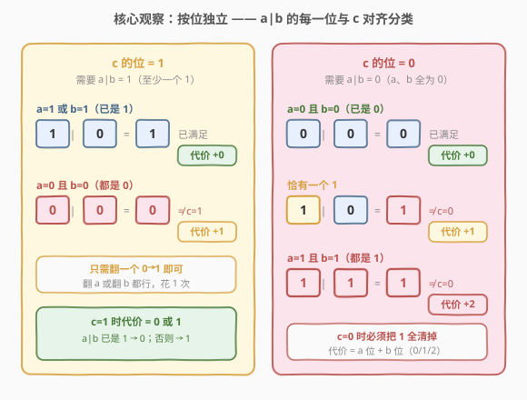
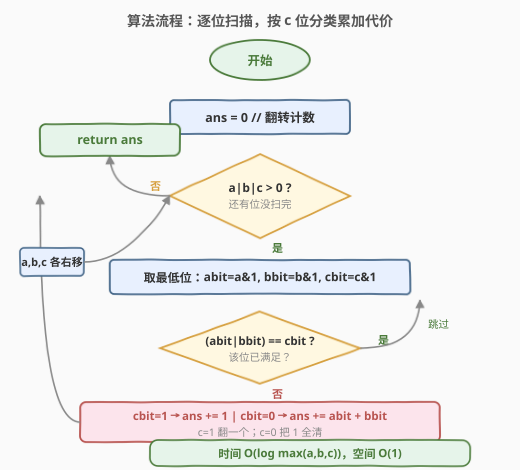
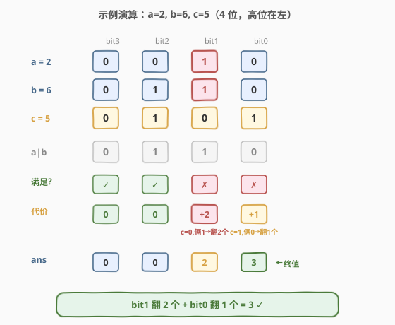

# LeetCode 或运算的最小翻转次数 题解

## 1. 题目概述

- **标题 / 题号**：或运算的最小翻转次数（#1318，medium）
- **链接**：https://leetcode.cn/problems/minimum-flips-to-make-a-or-b-equal-to-c/
- **难度**：中等
- **标签**：位运算

**题意**：给你三个正整数 `a`、`b` 和 `c`。你可以对 `a` 和 `b` 的二进制表示进行**位翻转操作**（把任意一位的 `1` 变 `0` 或 `0` 变 `1`），返回使按位或运算 `a OR b == c` 成立的**最小翻转次数**。

**示例 1**：

```text
输入：a = 2, b = 6, c = 5
输出：3
解释：翻转后 a = 1 (001), b = 4 (100), c = 5 (101)，使 a OR b == c
```

**示例 2**：

```text
输入：a = 4, b = 2, c = 7
输出：1
```

**示例 3**：

```text
输入：a = 1, b = 2, c = 3
输出：0
```

**约束**：

- $1 \le a, b, c \le 10^9$

> 💡 $10^9 < 2^{30}$，故三个数最多 30 个有效位。本题的灵魂是「**按位独立**」——或运算**没有进位传播**，每一位的翻转代价互不影响，可以逐位贪心取最小再求和。这与 [371. 两整数之和](../0301-0400/371_两整数之和.md) 中「加法有进位、位与位会耦合」形成鲜明对照。

## 2. 解题思路

### 2.1 暴力思路：枚举所有翻转方案

最朴素的想法是对每一位枚举「翻 a / 翻 b / 都翻 / 都不翻」的所有组合，在所有合法方案里搜全局最小。问题在于：30 个有效位每位 4 种选择，组合数高达 $4^{30}$，搜索空间爆炸。

> 💡 转机在于：**或运算是按位运算，没有进位**。某一位上对 `a`、`b` 的翻转**完全不会影响其它位**的 `a|b` 结果。因此整体最小代价 = 每一位最小代价之和——把指数级搜索拆成 30 个独立的 $O(1)$ 子问题。

### 2.2 核心观察：按位独立 + 按 c 位分类



对任意第 $i$ 位，记 $a_i, b_i, c_i \in \{0,1\}$。目标是 $a_i \mid b_i = c_i$。逐位看真值表，按 $c_i$ 分两类即可覆盖全部 8 种组合：

| $c_i$ | 目标 | 情况 | 最小翻转代价 |
|-------|------|------|--------------|
| **1** | $a_i \mid b_i = 1$（至少一个 1） | $a_i, b_i$ 已有 1 | $0$ |
| **1** | 同上 | $a_i = b_i = 0$ | $1$（翻任意一个 $0 \to 1$） |
| **0** | $a_i \mid b_i = 0$（必须全 0） | $a_i = b_i = 0$ | $0$ |
| **0** | 同上 | 恰一个为 1 | $1$（把那个 1 翻成 0） |
| **0** | 同上 | $a_i = b_i = 1$ | $2$（两个都得翻成 0） |

> 💡 **关键转化**：代价只取决于 $c_i$ 和当前 $a_i, b_i$：
> - $c_i = 1$ 时，若 $a_i \mid b_i$ 已是 1 则代价 0，否则代价 1；
> - $c_i = 0$ 时，必须把所有 1 清零，代价 $= a_i + b_i$（0、1 或 2）。
>
> 一个等价的判定写法：若 $(a_i \mid b_i) \neq c_i$，则 $c_i = 1$ 时 `ans += 1`，$c_i = 0$ 时 `ans += a_i + b_i`。

> ⚠️ **为何 $c_i = 0$ 且两个都为 1 时要翻 2 次而不是 1 次？** 因为或运算「有 1 即 1」，只要 $a_i, b_i$ 中还剩一个 1，$a_i \mid b_i$ 仍是 1 ≠ 0。必须把两个 1 都翻成 0，这一位才满足。这是本题最容易漏算的坑。

### 2.3 算法流程图



**逐位扫描完整步骤**：

1. `ans = 0`；
2. 只要 `a | b | c > 0`（还有任一数存在未处理位）：
   - 取三个数的最低位 `abit = a & 1`、`bbit = b & 1`、`cbit = c & 1`；
   - 若 `(abit | bbit) != cbit`（该位不满足）：
     - `cbit == 1`：`ans += 1`（两个 0，翻一个即可）；
     - `cbit == 0`：`ans += abit + bbit`（把所有 1 翻成 0）；
   - `a >>= 1`、`b >>= 1`、`c >>= 1`（三数同步右移，处理下一位）；
3. 循环结束返回 `ans`。

> 💡 **循环条件用 `a | b | c`**：只要三个数中还有任何一个非 0，就说明高位还有待处理的 1。比固定循环 30 次更紧凑——当三个数都较小时提前结束。由于三数同步右移，位数对齐天然保证（高位缺位补 0，等价于该位 $a_i=b_i=c_i=0$，代价 0）。

### 2.4 示例演算

以示例 1 `a = 2, b = 6, c = 5` 为例（4 位展示，高位在左）：



| 位 | $a_i$ | $b_i$ | $c_i$ | $a_i \mid b_i$ | 满足? | 代价 | ans |
|----|-------|-------|-------|----------------|-------|------|-----|
| bit3 | 0 | 0 | 0 | 0 | ✓ | 0 | 0 |
| bit2 | 0 | 1 | 1 | 1 | ✓ | 0 | 0 |
| bit1 | 1 | 1 | 0 | 1 | ✗ $c=0$ 俩 1 | +2 | 2 |
| bit0 | 0 | 0 | 1 | 0 | ✗ $c=1$ 俩 0 | +1 | **3** ✓ |

- **bit1**：$c_i=0$ 但 $a_i=b_i=1$，两个都得翻成 0，代价 +2（最易漏算之处）；
- **bit0**：$c_i=1$ 但 $a_i=b_i=0$，翻任意一个为 1 即可，代价 +1。

合计 $0+0+2+1=3$。翻转后 $a = 001_2 = 1$、$b = 100_2 = 4$，$1 \mid 4 = 5 = c$ ✓。

## 3. 参考代码

### C++

```cpp
class Solution {
public:
    int minFlips(int a, int b, int c) {
        int ans = 0;
        while (a || b || c) {
            int abit = a & 1, bbit = b & 1, cbit = c & 1;
            if ((abit | bbit) != cbit) {
                if (cbit) ans += 1;          // c=1 但 a|b=0：翻一个 0→1
                else      ans += abit + bbit; // c=0：把所有 1 翻成 0
            }
            a >>= 1; b >>= 1; c >>= 1;
        }
        return ans;
    }
};
```

### Python

```python
class Solution:
    def minFlips(self, a: int, b: int, c: int) -> int:
        ans = 0
        while a or b or c:
            abit, bbit, cbit = a & 1, b & 1, c & 1
            if (abit | bbit) != cbit:
                if cbit:
                    ans += 1            # c=1 但 a|b=0：翻一个 0→1
                else:
                    ans += abit + bbit  # c=0：把所有 1 翻成 0
            a >>= 1; b >>= 1; c >>= 1
        return ans
```

> 💡 两版逻辑完全一致。核心是 `if (abit | bbit) != cbit` 这一判定——直接复用或运算本身判断该位是否满足，无需手写真值表。Python 整数无限精度，但三数同步右移最终都归 0，`while a or b or c` 必然终止，无死循环风险。

## 4. 复杂度分析

| 维度 | 复杂度 | 说明 |
|------|--------|------|
| 时间复杂度 | $O(\log \max(a,b,c))$ | 循环次数 = 三数最大有效位数，最坏 $30$ 次（$10^9 < 2^{30}$），可视为 $O(1)$ |
| 空间复杂度 | $O(1)$ | 仅 `ans` 与若干位变量原地累加 |

> 💡 严格说循环次数等于三数中最长二进制位数。本题数据范围下上界 30，无论输入如何都是常数级操作，无需额外空间。这是「按位独立」分拆带来的固有优势——把指数级搜索降到线性扫位。

## 5. 扩展：位运算公式一行解

逐位扫描清晰直观，但若想追求极致简洁，可把代价翻译成两个 popcount：

$$\text{ans} = \operatorname{popcount}\big((a \mid b) \oplus c\big) + \operatorname{popcount}\big(a \mathbin{\&} b \mathbin{\&} \sim c\big)$$

**直觉拆解**：

- **第一项** $(a \mid b) \oplus c$：所有「$a \mid b$ 与 $c$ 不一致的位」。每个不一致位**至少**花 1 次翻转——
  - $c_i=1$ 且 $a_i=b_i=0$：1 次（翻一个 0→1）✓ 恰好 1 次；
  - $c_i=0$ 且至少一个 1：1 次（翻一个 1→0）——但当 $a_i=b_i=1$ 时其实要翻 **2** 次，第一项只算了 1 次，**漏算 1 次**。
- **第二项** $a \mathbin{\&} b \mathbin{\&} \sim c$：补上漏算的部分——$c_i=0$ 且 $a_i=b_i=1$ 的位，每个再补 1 次翻转。

两项相加，恰好覆盖所有情况的代价。

```python
class Solution:
    def minFlips(self, a: int, b: int, c: int) -> int:
        return ((a | b) ^ c).bit_count() + (a & b & ~c).bit_count()
```

```cpp
class Solution {
public:
    int minFlips(int a, int b, int c) {
        return __builtin_popcount((a | b) ^ c) + __builtin_popcount(a & b & ~c);
    }
};
```

> ⚠️ **Python 的 `~c` 与无限精度**：Python 中 `~c` 是无限前导 1 的补码。但 `a & b` 受 $a,b \le 10^9$ 约束、高位全 0，与 `~c` 相与后高位被自动屏蔽，结果仍落在有效位内，故 `(a & b & ~c).bit_count()` 正确。同理 `((a|b) ^ c)` 的高位也被 $a|b$ 与 $c$ 的有效位限定。C++ 的 `int` 为固定 32 位补码，无此问题。
>
> 💡 `.bit_count()` 为 Python 3.10+ 内置（底层映射 CPU `POPCNT` 指令，最快）；低版本可用 `bin(x).count('1')` 替代。C++ 用 `__builtin_popcount`（GCC/Clang）或 `std::popcount`（C++20 `<bit>`）。

## 6. 面试要点

1. **为什么可以逐位独立求最小，再直接求和？**

   > 或运算是**按位运算，没有进位传播**——第 $i$ 位上对 $a$、$b$ 的翻转只改变 $a_i \mid b_i$，不会影响其它位。因此全局最小代价 = 各位最小代价之和，可逐位贪心。这与 [371. 两整数之和](../0301-0400/371_两整数之和.md) 中「加法有进位、位与位耦合」相反——加法必须用循环把进位逐步传递处理。

2. **$c_i = 0$ 且 $a_i = b_i = 1$ 时为什么要翻 2 次而不是 1 次？**

   > 或运算「有 1 即 1」。只要 $a_i, b_i$ 中还剩一个 1，$a_i \mid b_i = 1 \neq 0$，该位仍不满足。必须把两个 1 **都**翻成 0。这是本题最易漏算的坑，也是公式法中第二项 `a & b & ~c` 存在的原因——专门补上这多出的 1 次。

3. **循环条件为什么用 `a | b | c` 而不是固定 30 次？**

   > 只要三个数中任一非 0，就还有未处理位。三数同步右移，当三者都归 0 时高位全 0，等价于 $a_i=b_i=c_i=0$（代价 0），可安全停止。这比固定 30 次更紧凑：当输入都是小数时提前结束。对齐性由「同步右移 + 高位补 0」天然保证。

4. **公式法中两项分别对应什么？为什么这样拆？**

   > 第一项 `popcount((a|b)^c)` 数「不一致位的个数」，每个至少 1 次翻转；但 $c_i=0$ 且 $a_i=b_i=1$ 的位实际要 2 次，第一项少算了 1 次。第二项 `popcount(a & b & ~c)` 恰好选出这些「双 1 且 $c=0$」的位，每位补 1 次。两项相加严格等于逐位法结果。这是一种「先按统一代价计数，再修正特殊情况」的常用拆解思路。

5. **如果要改成 `a AND b == c` 或 `a XOR b == c`，思路怎么迁移？**

   > 完全同构——把判定中的 `|` 换成 `&` 或 `^`，再重推每种 $(a_i, b_i, c_i)$ 组合的最小代价。例如 `a XOR b == c`：$c_i=1$ 需 $a_i \oplus b_i = 1$（一 0 一 1），$c_i=0$ 需两者相同。关键仍是「按位独立 + 按 $c_i$ 分类列代价表」，模板可复用。

> 💡 **一句话总结**：1318 的灵魂是「**按位独立**」——或运算无进位，把指数级翻转搜索拆成逐位 $O(1)$ 贪心。按 $c_i$ 是 0 还是 1 分类，代价非 0 即 $a_i+b_i$。公式法用「不一致位 popcount + 双 1 补罚」两步到位，是位运算思维进阶的招牌题。

## 同类练习题

| # | 题目 | 与本题的关联 |
|---|------|-------------|
| 371 | [两整数之和](https://leetcode.cn/problems/sum-of-two-integers/)（[题解](../0301-0400/371_两整数之和.md)） | 位运算模拟加法，对照「有进位传播→位耦合」与本题「无进位→位独立」，理解何时需循环传递、何时可逐位贪心 |
| 191 | [位 1 的个数](https://leetcode.cn/problems/number-of-1-bits/)（[题解](../0001-0100/191_位1的个数.md)） | popcount 母题，本题扩展公式法直接调用，打牢按位计数基本功 |
| 461 | [汉明距离](https://leetcode.cn/problems/hamming-distance/) | 两数异或后数 1，即「统计不一致位的个数」，与本题公式法第一项 `((a\|b)^c).bit_count()` 同源 |
| 476 | [数的补数](https://leetcode.cn/problems/number-complement/) | 按位取反的纯位运算练习，巩固「~、&、\|」在固定字长下的行为 |
| 868 | [二进制间距](https://leetcode.cn/problems/binary-gap/) | 逐位扫描二进制并记录位置，同样依赖「按位独立处理」的扫描模板 |
