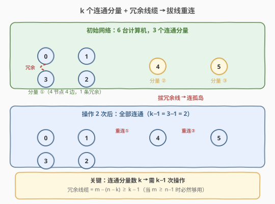
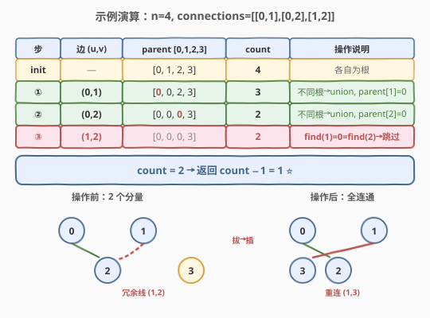

# LeetCode 连通网络的操作次数 题解

## 1. 题目概述

- **标题 / 题号**：连通网络的操作次数（#1319，medium）
- **链接**：https://leetcode.cn/problems/number-of-operations-to-make-network-connected/
- **难度**：中等
- **标签**：并查集、图、深度优先搜索（DFS）、广度优先搜索（BFS）

**题意**：用以太网线缆将 `n` 台计算机连接成一个网络，计算机编号从 `0` 到 `n-1`。线缆用 `connections` 表示，其中 `connections[i] = [a, b]` 连接了计算机 `a` 和 `b`。

你可以拔开任意两台直连计算机之间的线缆，并用它连接一对未直连的计算机。请计算并返回使所有计算机都连通所需的**最少操作次数**。如果不可能，则返回 `-1`。

**示例 1**：

```text
输入：n = 4, connections = [[0,1],[0,2],[1,2]]
输出：1
解释：拔下计算机 1 和 2 之间的线缆，并将它插到计算机 1 和 3 上。
```

**示例 2**：

```text
输入：n = 6, connections = [[0,1],[0,2],[0,3],[1,2],[1,3]]
输出：2
```

**示例 3**：

```text
输入：n = 6, connections = [[0,1],[0,2],[0,3],[1,2]]
输出：-1
解释：线缆数量不足。
```

**示例 4**：

```text
输入：n = 5, connections = [[0,1],[0,2],[3,4],[2,3]]
输出：0
```

**约束**：

- `1 <= n <= 10^5`
- `1 <= connections.length <= min(n*(n-1)/2, 10^5)`
- `connections[i].length == 2`
- `0 <= connections[i][0], connections[i][1] < n`
- `connections[i][0] != connections[i][1]`
- 没有重复连接

> 💡 本题的灵魂是「**连通分量数 − 1**」——将 `n` 台计算机连成一张网，至少需要 `n−1` 条线缆（一棵生成树）。如果线缆不够，直接返回 `-1`；如果够，用并查集数出连通分量数 `k`，答案就是 `k−1`——因为每个连通分量内部的冗余线缆（成环的边）正好可以拔出来去连接其他分量。

## 2. 解题思路

### 2.1 暴力思路：枚举拔线方案

枚举每条线缆的拔/不拔，再用 DFS/BFS 判断全图是否连通，取最少操作次数。时间复杂度指数级 $O(2^m \cdot n)$，完全不可行。问题在于**没有利用「冗余线缆 = 成环的边」这一关键性质**——不需要关心具体拔哪条线，只需知道有多少条冗余线缆、多少个连通分量。

### 2.2 核心观察：连通分量数与冗余线缆



两个关键事实：

1. **最少线缆底线**：将 `n` 台计算机全部连通，至少需要 `n−1` 条线缆（一棵生成树）。因此若 `m = len(connections) < n−1`，线缆总数不够，直接返回 `-1`。

2. **冗余线缆够用**：设连通分量数为 `k`。每个分量内部若有 `c_i` 个节点，则只需 `c_i − 1` 条线缆保持连通，多余的即为冗余。全图的生成森林用了 `n − k` 条边，所以冗余线缆数为 $m - (n - k)$。将 `k` 个分量连成一体需要 `k−1` 条线缆。当 `m ≥ n−1` 时：

$$m - (n - k) \geq (n-1) - n + k = k - 1$$

冗余线缆**必然够用**，答案恒为 `k − 1`。

> 💡 关键直觉：不需要关心「具体拔哪条线、插到哪里」——只要冗余线缆数量 $\geq k-1$，就一定存在合法方案。问题从「搜索最优拔插方案」简化为「数连通分量个数」，一步到位。

### 2.3 算法流程图


**完整步骤**：

1. **线缆不足判定**：若 `m < n−1`，返回 `-1`；
2. **初始化并查集**：`parent[i] = i`，`count = n`（初始 `n` 个独立集合）；
3. **逐条加边**：对每条 `(u, v)`，若 `find(u) ≠ find(v)` 则 `union`，`count−−`；若已同根则跳过（冗余线缆）；
4. **返回**：`count − 1`（此时 `count` 即连通分量数 `k`）。

> ⚠️ **为什么不直接返回冗余线缆数？** 因为冗余线缆数 $= m - (n - k)$，而 $m - (n - k) \geq k - 1$。冗余线缆可能比需要的多，但多出来的无处可插（全图已连通）。答案是「需要的操作数」`k−1`，不是「可用的冗余数」。

### 2.4 示例演算

以示例 1 `n=4, connections=[[0,1],[0,2],[1,2]]` 为例（`m=3, n−1=3`，线缆刚好够）：



| 步 | 边 (u,v) | parent [0,1,2,3] | count | 操作说明 |
|----|----------|-------------------|-------|----------|
| init | — | [0, 1, 2, 3] | 4 | 各自为根 |
| ① | (0,1) | [0, **0**, 2, 3] | 3 | 不同根 → union, parent[1]=0 |
| ② | (0,2) | [0, 0, **0**, 3] | 2 | 不同根 → union, parent[2]=0 |
| ③ | (1,2) | [0, 0, 0, 3] | 2 | find(1)=0=find(2) → 跳过（冗余） |

最终 `count = 2`（分量 `{0,1,2}` 和 `{3}`），返回 `count − 1 = 1`。拔掉冗余线 `(1,2)`，插到 `(1,3)` 即可全连通。

> 💡 **冗余线缆自动暴露**：步骤 ③ 中 `find(1) == find(2)`，说明 `1` 和 `2` 早已通过 `0` 连通，这条边是冗余的——并查集在加边时天然识别出冗余，无需额外统计。

## 3. 参考代码

### C++（并查集 + 路径压缩 + 按秩合并）

```cpp
class UnionFind {
   public:
    vector<int> parent;
    vector<int> rank_;

    UnionFind(int n) {
        parent.resize(n);
        rank_.assign(n, 0);
        for (int i = 0; i < n; i++) parent[i] = i;
    }

    int find(int x) {
        if (parent[x] != x) parent[x] = find(parent[x]);   // 路径压缩
        return parent[x];
    }

    bool unite(int x, int y) {
        int rx = find(x), ry = find(y);
        if (rx == ry) return false;                         // 已同根 → 冗余
        if (rank_[rx] < rank_[ry]) parent[rx] = ry;        // 按秩合并
        else if (rank_[rx] > rank_[ry]) parent[ry] = rx;
        else { parent[ry] = rx; rank_[rx]++; }
        return true;
    }
};

class Solution {
   public:
    int makeConnected(int n, vector<vector<int>>& connections) {
        int m = connections.size();
        if (m < n - 1) return -1;                           // 线缆不足

        UnionFind uf(n);
        int count = n;                                      // 连通分量数
        for (auto& e : connections) {
            if (uf.unite(e[0], e[1])) count--;              // 成功合并 → 分量数 -1
        }
        return count - 1;                                   // 需要 count-1 次操作
    }
};
```

### Python（并查集 + 路径压缩 + 按秩合并）

```python
class Solution:
    def makeConnected(self, n: int, connections: List[List[int]]) -> int:
        m = len(connections)
        if m < n - 1:                                      # 线缆不足
            return -1

        parent = list(range(n))
        rank_ = [0] * n
        count = n                                          # 连通分量数

        def find(x):
            while parent[x] != x:
                parent[x] = parent[parent[x]]              # 隔代压缩
                x = parent[x]
            return x

        for u, v in connections:
            ru, rv = find(u), find(v)
            if ru == rv:
                continue                                   # 已同根 → 冗余，跳过
            if rank_[ru] < rank_[rv]:
                parent[ru] = rv
            elif rank_[ru] > rank_[rv]:
                parent[rv] = ru
            else:
                parent[rv] = ru
                rank_[ru] += 1
            count -= 1                                     # 成功合并 → 分量数 -1

        return count - 1                                   # 需要 count-1 次操作
```

> 💡 两版等价。核心逻辑只有三行：① `m < n−1` 提前判 `-1`；② 遍历边做 `union`，成功则 `count−−`；③ 返回 `count−1`。`count` 在遍历结束后即为连通分量数 `k`，无需再扫一遍 `parent` 数根。

## 4. 复杂度分析

| 维度 | 复杂度 | 说明 |
|------|--------|------|
| 时间复杂度 | $O(m \, \alpha(n))$ | 依次处理 $m$ 条边，每条做两次 `find` + 至多一次 `union`，单次均摊 $O(\alpha(n))$ |
| 空间复杂度 | $O(n)$ | `parent` 与 `rank` 数组各 $O(n)$ |

> 💡 $\alpha(n) \le 5$（本题 $n \le 10^5$ 范围内），实际等同于 $O(m)$，一次遍历即可得到答案。初始判 $m < n - 1$ 是 $O(1)$ 的提前剪枝。

## 5. 扩展：DFS / BFS 数连通分量

若不使用并查集，也可用 DFS/BFS 数连通分量：

```python
class Solution:
    def makeConnected(self, n: int, connections: List[List[int]]) -> int:
        m = len(connections)
        if m < n - 1:
            return -1

        graph = [[] for _ in range(n)]
        for u, v in connections:
            graph[u].append(v)
            graph[v].append(u)

        visited = [False] * n
        components = 0

        def dfs(u):
            visited[u] = True
            for v in graph[u]:
                if not visited[v]:
                    dfs(v)

        for i in range(n):
            if not visited[i]:
                dfs(i)
                components += 1

        return components - 1
```

> 💡 **并查集 vs DFS/BFS**：DFS/BFS 需先 $O(n + m)$ 建邻接表再遍历，并查集只需一次遍历边列表，无需建图。两者时间同阶 $O(n + m)$，但并查集更轻量（无需递归栈/队列），且模板可复用于动态加边场景。本题 $n \le 10^5$，DFS 递归可能栈溢出，需改迭代或手动提高递归上限。

## 6. 面试要点

1. **为什么 `m < n−1` 就一定返回 `-1`？**

   > 将 `n` 个节点连成一张连通图，至少需要 `n−1` 条边（一棵生成树）。这是图论的基本结论——每加一条边最多减少一个连通分量，从 `n` 个分量减到 `1` 个至少需要 `n−1` 次合并。线缆总数不够这个底线，无论怎么拔插都不可能全连通。

2. **为什么答案是 `k−1` 而不是冗余线缆数？**

   > 设连通分量数为 `k`。将 `k` 个分量连成一体需要 `k−1` 条线缆（类比 `k` 个节点需 `k−1` 条边）。冗余线缆数 $= m - (n - k) \geq k - 1$（当 $m \geq n-1$），所以冗余必然够用，但多出的冗余无处可插。答案是「需要的操作数」`k−1`，不是「可用的冗余数」。

3. **为什么不需要关心具体拔哪条线？**

   > 只要冗余线缆数 $\geq k-1$，就一定存在合法方案。这是因为每个连通分量的生成树只需要 `c_i − 1` 条边，多余的边全是冗余且可拔插到任意位置。并查集在加边时自动跳过成环边（`find(u) == find(v)`），天然识别冗余，无需额外统计。

4. **并查集的 `count` 和最后扫 `parent[i] == i` 有什么区别？**

   > 路径压缩后 `parent[i] == i` 的仍是根，扫一遍也能得到分量数。但维护 `count` 在每次成功 `union` 时 `−−`，最后直接返回，省一次 $O(n)$ 扫描，语义更清晰（「合并一次少一个集合」）。本题 $n \le 10^5$，省一轮扫描有意义。

5. **和 547 省份数量、684 冗余连接的并查集用法有何异同？**

   > 模板完全相同（`find` + `union` + 路径压缩 + 按秩合并）。区别在**用法**：[547](../0501-0600/547_省份数量.md) 统计连通分量个数；[684](../0601-0700/684_冗余连接.md) 捕获第一次 `union` 失败定位冗余边；本题**兼用两者**——既数连通分量（`count`），又隐式统计冗余边（`union` 失败时跳过），最终答案 `count − 1` 依赖「冗余够用」的数学保证。

> 💡 **一句话总结**：1319 的灵魂是「**连通分量数 − 1**」——线缆够（$m \geq n-1$）就一定能连，答案只取决于连通分量数 `k`。并查集一次遍历既数分量又识别冗余，将看似复杂的「拔插调度」问题化为简单的计数问题。

## 同类练习题

| # | 题目 | 与本题的关联 |
|---|------|-------------|
| 547 | [省份数量](https://leetcode.cn/problems/number-of-provinces/)（[题解](../0501-0600/547_省份数量.md)） | 同一并查集模板统计连通分量，是本题「数 `k`」的基础母题 |
| 684 | [冗余连接](https://leetcode.cn/problems/redundant-connection/)（[题解](../0601-0700/684_冗余连接.md)） | 并查集判环，`union` 失败即冗余边，与本题「识别冗余线缆」同源 |
| 200 | [岛屿数量](https://leetcode.cn/problems/number-of-islands/) | DFS/BFS 求连通分量，可与并查集解法对照 |
| 990 | [等式方程的可满足性](https://leetcode.cn/problems/satisfiability-of-equality-equations/) | 先 union 等式、再查不等式是否冲突，并查集判连通的变体应用 |
| 721 | [账户合并](https://leetcode.cn/problems/accounts-merge/) | 并查集合并字符串键（邮箱），模板进阶到「哈希映射 + 并查集」 |
