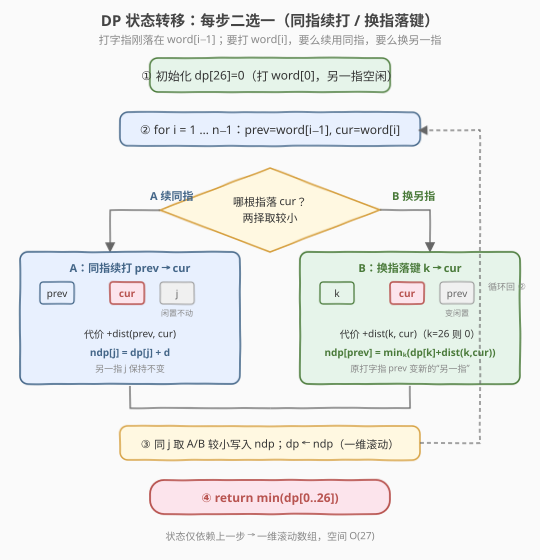
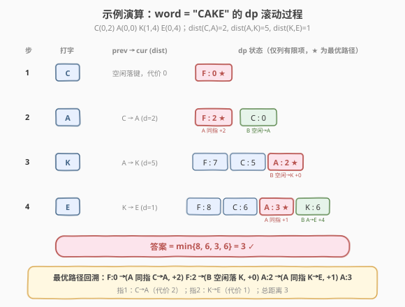

# 二指输入的最小距离

- **题目名称**：二指输入的最小距离
- **链接**：[1320. 二指输入的最小距离](https://leetcode.cn/problems/minimum-distance-to-type-a-word-using-two-fingers/)
- **难度**：困难
- **标签**：动态规划、状态设计、字符串

## 1. 题目概述

键盘在 X-Y 平面上的布局如下，每个大写英文字母位于某个坐标（行、列）：

```text
行0:  A  B  C  D  E  F
行1:  G  H  I  J  K  L
行2:  M  N  O  P  Q  R
行3:  S  T  U  V  W  X
行4:  Y  Z
```

字母 `id = c - 'A'`（`A=0, B=1, …, Z=25`），其坐标为 $\text{row} = \lfloor id/6 \rfloor$、$\text{col} = id \bmod 6$。例如 `A=(0,0)`、`P=(2,3)`、`Z=(4,1)`。

给定字符串 `word`，仅用**两根手指**依次键入每个字符。每根手指可从当前位置移到下一键，移动代价为两坐标的**曼哈顿距离** $|x_1-x_2| + |y_1-y_2|$。两根手指的**起始位置是免费的**（不计入总距离），且不必从首字母或前两个字母开始。返回键入整个字符串的**最小移动总距离**。

**示例 1**：

```text
输入：word = "CAKE"
输出：3
解释：手指1 在 'C'（0）→ 'A'（距离 2）；手指2 在 'K'（0）→ 'E'（距离 1）；总距离 3
```

**示例 2**：

```text
输入：word = "HAPPY"
输出：6
解释：手指1 H→A（2）、A→Y（4）；手指2 P→P（0）；总距离 6
```

**约束条件**：

- `2 <= word.length <= 300`
- `word` 仅由大写英文字母组成

> 💡 本题的关键在于**状态设计**：每打完一个字符，刚落键的那根手指位置已被字符固定，唯一不确定的是「另一根手指」停在哪里。把这一自由度显式纳入状态，就能把指数级枚举压缩为线性 DP。

---

## 2. 解题思路

### 2.1 暴力思路：枚举每字符归哪根指

对 `word` 的每个字符二选一——交给手指1 还是手指2，共 $2^n$ 种分配方案。每种方案下，每根手指的代价为其所负责子序列相邻字符的距离之和（首字符免费落键）。取所有方案总代价的最小值。

```text
assign[i] ∈ {1, 2}                # 第 i 个字符由哪根指打
cost = Σ 两根手指各自子序列的相邻距离和
```

时间 $O(2^n \cdot n)$，`n=300` 时 $2^{300}$ 完全不可行。问题在于重复子问题被反复计算——例如「打完前 i 个字符后两指位置」的代价与后续字符的选择无关。

### 2.2 核心观察：把「另一指位置」纳入状态

![核心观察：键盘 6 列网格与两指状态 dp[i][j]](../images/1320_keyboard_concept.svg)

**关键观察**：每打完第 `i` 个字符，**刚落键的那根手指必然停在 `word[i-1]`**（字符位置已知，被固定）。因此整个系统的不确定性只剩一个——**另一根（未落键的）手指停在哪里**。

- 另一根手指要么**还没用过**（空闲，落键免费），要么停在 26 个字母坐标之一。
- 于是「另一指位置」只有 **27 种**取值：`j ∈ {0..25, 26}`，其中 `26` 表示空闲。

**状态定义**：

$$
dp[i][j] = \text{打完前 } i \text{ 个字符的最小总代价，此时一指停在 } word[i\!-\!1]\text{，另一指停在位置 } j
$$

其中 $j \in \{0,\dots,25, 26\}$，`26 = 空闲`。

**边界**：

```text
dp[1][26] = 0          # 打第 1 个字符：一指免费落 word[0]，另一指空闲
dp[1][j]  = +∞         # 其余 j 不可能（另一指不可能已停在某个键上）
```

**转移**：打第 `i` 个字符（`cur = word[i-1]`，上一字符 `prev = word[i-2]`）时，只有两种选择：

| 选择 | 落键的指 | 代价增量 | 另一指去向 | 状态更新 |
|------|----------|----------|-----------|----------|
| **A 同指续打** | 刚落 `prev` 的那根 | $+ \text{dist}(prev, cur)$ | 原地不动，仍为 `j` | $dp[i][j] = \min(dp[i][j],\ dp[i\!-\!1][j] + d)$ |
| **B 换另一指** | 停在 `k` 的那根 | $+ \text{dist}(k, cur)$ | 原打字指 `prev` 变闲置 | $dp[i][prev] = \min_k\big(dp[i\!-\!1][k] + \text{dist}(k, cur)\big)$ |

其中 $d = \text{dist}(prev, cur)$。**A** 让打字指续走、闲置指不变；**B** 让闲置指（位于 `k`）去落 `cur`、原打字指 `prev` 摇身变为新的闲置指。两种选择对同一目标状态取较小值。

> 💡 **为什么 `j=26`（空闲）时落键代价为 0？** 空闲意味着这根手指从未落过键，它的「起始位置免费」——首次落键不需从任何位置移过来，故 $\text{dist}(26, \cdot) = 0$。这正是不必从首字母开始的题意体现：前两个字符可分别由两指免费落键，总代价为 0。

**答案**：$\min_{j} dp[n][j]$。

> ⚠️ **不可贪心**：每步取当前最小代价的 `j` 并不最优。例如 `CAKE` 第 2 步中 `dp[2][C]=0`（换指免费落 A）比 `dp[2][F]=2`（同指 C→A）更小，但最优全局路径却经过 `F:2`——因为「同指续打」保留了空闲指供后续免费落 K。必须用完整 DP 表取终态最小值。

### 2.3 算法流程图



**完整步骤**：

1. **初始化**：一维数组 `dp[0..26]` 全 $+\infty$，`dp[26] = 0`（打完 `word[0]`，另一指空闲）。
2. **滚动递推** `i` 从 1 到 `n-1`（0 基下 `word[i]` 为当前字符）：
   - 令 `prev = word[i-1]`，`cur = word[i]`，`d = dist(prev, cur)`。
   - **Case A**：新数组 `ndp[j] = min(ndp[j], dp[j] + d)`（对所有有限 `j`）。
   - **Case B**：`best = min_k(dp[k] + dist(k, cur))`，`ndp[prev] = min(ndp[prev], best)`。
   - `dp = ndp`（一维滚动，状态仅依赖上一步）。
3. **返回** `min(dp)`。

> 💡 **空间优化**：`dp[i]` 只依赖 `dp[i-1]`，用两个长度 27 的一维数组交替即可，空间 $O(27)$。状态数 $n \times 27$，每次转移 Case A 为 $O(27)$、Case B 求 `min_k` 为 $O(27)$，总计 $O(n \cdot 27)$。

### 2.4 示例演算

以 `word = "CAKE"` 为例（`C(0,2) A(0,0) K(1,4) E(0,4)`，`dist(C,A)=2, dist(A,K)=5, dist(K,E)=1`，`F=空闲`）：



**dp 演化**（仅列有限项，`★` 为最优路径上的状态）：

| 步 | 打字 | prev→cur (dist) | dp 状态（有限项） |
|----|------|-----------------|-------------------|
| 1 | C | 空闲落键 (0) | `F:0 ★` |
| 2 | A | C→A (2) | `F:2 ★`（A 同指 +2）、`C:0`（B 空闲→A） |
| 3 | K | A→K (5) | `F:7`、`C:5`、`A:2 ★`（B 空闲→K +0） |
| 4 | E | K→E (1) | `F:8`、`C:6`、`A:3 ★`（A 同指 +1）、`K:6`（B A→E +4） |

**关键转移**：

| 目标状态 | 来源 | 计算 | 值 | 说明 |
|----------|------|------|----|------|
| `dp[2][F]=2` | A 同指 | `dp[1][F] + dist(C,A)` | 0+2 | 打字指 C→A，空闲指不变 |
| `dp[2][C]=0` | B 换指 | `dp[1][F] + dist(F,A)` | 0+0 | 空闲指免费落 A，原指 C 变闲置 |
| `dp[3][A]=2` | B 换指 | `dp[2][F] + dist(F,K)` | 2+0 | 空闲指免费落 K，原指 A 变闲置 |
| `dp[4][A]=3` | A 同指 | `dp[3][A] + dist(K,E)` | 2+1 | 打字指 K→E，闲置指 A 不变 |

最终 $\min\{8,6,3,6\} = 3$。

**最优路径回溯**：`F:0 →(A,+2) F:2 →(B,+0) A:2 →(A,+1) A:3`，即**手指1** `C→A`（代价 2）、**手指2** `K→E`（代价 1），总距离 3。注意第 3 步选择「B 换指」用空闲指免费落 K，正是利用起始免费的题意。

---

## 3. 参考代码

### C++

```cpp
// 二指输入的最小距离.cpp —— 一维滚动 DP
// 编译: g++ -O2 -std=c++17 二指输入的最小距离.cpp -o twofinger
class Solution {
public:
    int minimumDistance(string word) {
        int n = word.size();
        const int INF = 1e9;
        // dp[j]：打完当前字符后，另一指停在位置 j（0..25 字母，26 = 空闲）
        vector<int> dp(27, INF);
        dp[26] = 0;                                  // 打 word[0]，另一指空闲，代价 0

        auto row = [](int id) { return id / 6; };
        auto col = [](int id) { return id % 6; };
        auto dist = [&](int a, int b) {
            if (a == 26 || b == 26) return 0;        // 空闲指落键免费
            return abs(row(a) - row(b)) + abs(col(a) - col(b));
        };

        for (int i = 1; i < n; ++i) {
            int prev = word[i - 1] - 'A';
            int cur  = word[i]     - 'A';
            int d    = dist(prev, cur);
            vector<int> ndp(27, INF);
            // A：同一指 prev→cur，另一指 j 原地不动
            for (int j = 0; j < 27; ++j)
                if (dp[j] < INF)
                    ndp[j] = min(ndp[j], dp[j] + d);
            // B：换另一指（位于 k）落 cur，原打字指 prev 变闲置
            int best = INF;
            for (int k = 0; k < 27; ++k)
                if (dp[k] < INF)
                    best = min(best, dp[k] + dist(k, cur));
            ndp[prev] = min(ndp[prev], best);
            dp = move(ndp);
        }
        return *min_element(dp.begin(), dp.end());
    }
};
```

### Python

```python
class Solution:
    def minimumDistance(self, word: str) -> int:
        INF = float('inf')
        # dp[j]：打完当前字符后，另一指停在位置 j（0..25 字母，26 = 空闲）
        dp = [INF] * 27
        dp[26] = 0                              # 打 word[0]，另一指空闲，代价 0

        def dist(a, b):
            if a == 26 or b == 26:              # 空闲指落键免费
                return 0
            return abs(a // 6 - b // 6) + abs(a % 6 - b % 6)

        for i in range(1, len(word)):
            prev, cur = ord(word[i - 1]) - 65, ord(word[i]) - 65
            d = dist(prev, cur)
            ndp = [INF] * 27
            # A：同一指 prev→cur，另一指 j 原地不动
            for j in range(27):
                if dp[j] < INF:
                    ndp[j] = min(ndp[j], dp[j] + d)
            # B：换另一指（位于 k）落 cur，原打字指 prev 变闲置
            best = INF
            for k in range(27):
                if dp[k] < INF:
                    best = min(best, dp[k] + dist(k, cur))
            ndp[prev] = min(ndp[prev], best)
            dp = ndp
        return int(min(dp))
```

> 💡 **实现细节**：① 字母坐标用 `id // 6`、`id % 6` 直接算，无需预处理键盘表。② 用 `26` 这个哨兵统一表示「空闲」，`dist` 中遇 26 即返回 0，避免对首字符/首两字符做特判。③ 状态仅依赖上一步，故用 `dp`/`ndp` 两个一维数组滚动，空间 $O(27)$。④ Case B 的 `min_k` 与 Case A 同 `j` 写入 `ndp[prev]` 时取较小，天然合并了两种选择。

---

## 4. 复杂度分析

| 维度 | 复杂度 | 说明 |
|------|--------|------|
| **时间** | $O(n \cdot 27)$ | 共 $n-1$ 步，每步 Case A 遍历 27 个 `j`、Case B 遍历 27 个 `k`，合计 $\approx 54n$ 次操作；`n=300` 时约 $1.6 \times 10^4$，远在限制内 |
| **空间** | $O(27)$ | 一维滚动数组，仅依赖上一步状态；二维写法为 $O(n \cdot 27)$ |
| **状态数** | $n \times 27$ | 关键在于把 $2^n$ 种指派压缩为「另一指位置」27 种取值 |

> ⚠️ 严格地，Case B 的 $\min_k$ 让单步为 $O(27^2)$？否——`dp[k]` 是上一步的固定数组，对当前步 `cur` 只需扫一遍 `k` 求 `min`，是 $O(27)$，与 Case A 同阶。整体 $O(n \cdot 27)$。

---

## 5. 扩展：二维写法与状态等价性

上面的解法用一维滚动数组压缩了空间。若不压缩，写成显式二维 `dp[i][j]` 更易理解状态依赖：

```python
# dp[i][j] = 打完前 i 个字符，另一指在 j 的最小代价
dp = [[INF] * 27 for _ in range(n + 1)]
dp[1][26] = 0
for i in range(2, n + 1):
    prev, cur = ord(word[i - 2]) - 65, ord(word[i - 1]) - 65
    d = dist(prev, cur)
    for j in range(27):
        if dp[i - 1][j] < INF:                       # Case A：同指续打
            dp[i][j] = min(dp[i][j], dp[i - 1][j] + d)
    best = INF
    for k in range(27):                              # Case B：换另一指
        if dp[i - 1][k] < INF:
            best = min(best, dp[i - 1][k] + dist(k, cur))
    dp[i][prev] = min(dp[i][prev], best)
return int(min(dp[n]))
```

**状态等价性说明**：

- 「两根手指」是对称的——交换两指不改变代价。因此无需区分「手指1/手指2」，只需记录「刚落键的那根在哪（被字符固定）」与「另一根在哪（自由度）」。
- 另一根的位置 `j` 之所以取值限于 27 种，是因为手指只能通过「落键」移动，故闲置指必停在某个曾打过的字符坐标或仍空闲。用 26 个字母坐标 + 空闲覆盖所有可能，多余的状态恒为 $+\infty$ 不影响结果。

> 💡 **为何不把 `j` 限制为「仅 word 中出现过的字符」？** 可以，且能进一步减小常数（`j` 候选数 $\leq$ 字符种类数）。但 27 是通用上界，写法更简洁、不依赖输入分布，对 `n=300` 已绰绰有余。

---

## 6. 面试要点

1. **`dp[i][j]` 的定义和转移方程是什么？**

   > `dp[i][j]` = 打完前 `i` 个字符的最小代价，此时一指停在 `word[i-1]`（被字符固定），另一指停在位置 `j`（`j ∈ 0..25` 为字母坐标，`26` 为空闲）。转移有二：**A 同指续打** `dp[i][j] = dp[i-1][j] + dist(prev, cur)`；**B 换另一指** `dp[i][prev] = min_k(dp[i-1][k] + dist(k, cur))`。答案 `min_j dp[n][j]`。

2. **为什么状态只需记录「另一指」的位置？**

   > 每打完一个字符，刚落键的那根手指必然停在 `word[i-1]`，位置已知、无需记。两根手指对称，区分谁是谁无意义。系统唯一的不确定性是「没落键的那根」停在哪——它要么空闲（`j=26`），要么停在 26 个字母坐标之一，共 27 种。这一观察把 $2^n$ 种指派压缩为 $O(n \cdot 27)$ 状态。

3. **`j=26`（空闲）的含义和作用？**

   > 表示这根手指从未落过键。题意说起始位置免费，故空闲指首次落键代价为 0（`dist(26, ·)=0`）。这让我们无需为首字符/首两字符特判：前两个字符可分别由两指免费落键，总代价 0。最优路径常在中间步骤「保留空闲指」以供后续免费落键（如 CAKE 第 3 步用空闲指免费落 K）。

4. **为什么不能每步贪心取当前最小的 `j`？**

   > 局部最小不保证全局最优。CAKE 第 2 步 `dp[2][C]=0` 比 `dp[2][F]=2` 更小，但走 `C:0` 会用掉免费落键机会，导致第 3 步只能 `C:5` 或 `A:3`，最终 `dp[4]=4`；而走 `F:2` 保留空闲指，第 3 步免费落 K 得 `A:2`，最终 `dp[4]=3`。必须算完整张 DP 表、取终态最小值。

5. **时间空间复杂度？能否优化？**

   > 时间 $O(n \cdot 27)$，每步 Case A、Case B 各扫 27 个状态。空间用一维滚动数组 $O(27)$（二维写法 $O(n \cdot 27)$）。还可把 `j` 候选限制为 word 中出现过的字符以减小常数，但 27 已足够小、`n=300` 完全无压力。

> 💡 **一句话总结**：1320 是「状态设计」型 DP 的招牌——抓住「刚落键指被字符固定、只需记录另一指位置」这一观察，用 `dp[i][j]`（`j ∈ 0..25, 26=空闲`）把指数枚举压成 $O(n \cdot 27)$；每步 A 同指续打 / B 换指二择，一维滚动即得答案。与 198 打家劫舍「状态增维」、72/1143 二维 DP 状态设计同属一类。

---

## 7. 同类练习题

- [198. 打家劫舍](https://leetcode.cn/problems/house-robber/)（[题解](../0101-0200/198_打家劫舍.md)）：一维 DP，状态含「上一处是否选取」的额外维度，与本题「另一指位置」同为给状态增维以消除后效性的思路
- [72. 编辑距离](https://leetcode.cn/problems/edit-distance/)（[题解](../0001-0100/72_编辑距离.md)）：二维 DP 状态设计经典，状态由两个序列下标构成，与本题「当前字符 + 另一指位置」结构同源
- [1143. 最长公共子序列](https://leetcode.cn/problems/longest-common-subsequence/)（[题解](../1101-1200/1143_最长公共子序列.md)）：二维 DP 模板，体会「状态 = 两个自由度的组合」如何覆盖所有子问题
- [514. 自由之路](https://leetcode.cn/problems/freedom-trail/)：同样在「键盘/转盘上移动手指」求最小代价，状态 = 当前字符位置 + 手的位置，与 1320 套路一致（难度困难）
- [256. 粉刷房子](https://leetcode.cn/problems/paint-house/)：状态 = 当前房子 + 上一房子颜色，与「当前字符 + 另一指位置」同为「记录上一个选择以解耦后效性」
