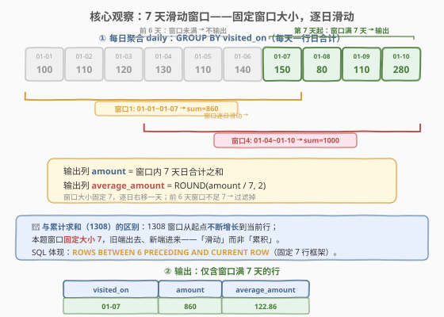
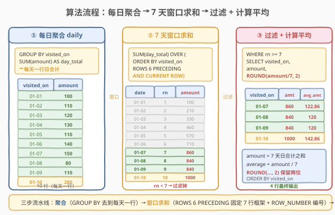
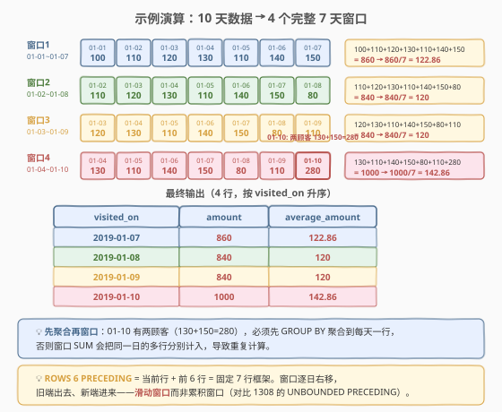

# LeetCode 餐馆营业额变化增长 题解

## 1. 题目概述

- **标题 / 题号**：餐馆营业额变化增长（#1321，medium）
- **链接**：https://leetcode.cn/problems/restaurant-growth/
- **难度**：中等
- **标签**：数据库、SQL、窗口函数、滑动窗口、ROWS BETWEEN、移动平均、GROUP BY

**题意**：给定 `Customer` 表，每行记录一名顾客在某一天的消费总额。请编写 SQL 查询，计算以 **7 天**（某日期 + 该日期前的 6 天）为一个时间段的顾客消费**平均值**，`average_amount` 保留两位小数。结果按 `visited_on` 升序排序。

> ⚠️ 关键点：7 天窗口是一个**固定大小的滑动窗口**——对于每个 `visited_on`，窗口为「该日期 + 前 6 天」。只有当窗口满 7 天时才输出该行（即从第 7 天起才开始有输出）。此外，同一天可能有多名顾客消费，需先 **GROUP BY** 聚合到「每天一行日合计」再做窗口求和。

**表结构**：

```text
Table: Customer
+---------------+---------+
| Column Name   | Type    |
+---------------+---------+
| customer_id   | int     |  ← 顾客 ID
| name          | varchar |  ← 顾客名
| visited_on    | date    |  ← 访问日期
| amount        | int     |  ← 当日消费总额
+---------------+---------+
```

- 主键为 `(customer_id, visited_on)`，即同一顾客同一天只有一条记录
- 但不同顾客可以在同一天消费（如 01-10 有 Jhon 和 Jade 两条记录）

**示例 1**：

```text
输入：
Customer 表：
+-------------+--------------+--------------+-------------+
| customer_id | name         | visited_on   | amount      |
+-------------+--------------+--------------+-------------+
| 1           | Jhon         | 2019-01-01   | 100         |
| 2           | Daniel       | 2019-01-02   | 110         |
| 3           | Jade         | 2019-01-03   | 120         |
| 4           | Khaled       | 2019-01-04   | 130         |
| 5           | Winston      | 2019-01-05   | 110         | 
| 6           | Elvis        | 2019-01-06   | 140         | 
| 7           | Anna         | 2019-01-07   | 150         |
| 8           | Maria        | 2019-01-08   | 80          |
| 9           | Jaze         | 2019-01-09   | 110         | 
| 1           | Jhon         | 2019-01-10   | 130         | 
| 3           | Jade         | 2019-01-10   | 150         | 
+-------------+--------------+--------------+-------------+

输出：
+--------------+--------------+----------------+
| visited_on   | amount       | average_amount |
+--------------+--------------+----------------+
| 2019-01-07   | 860          | 122.86         |
| 2019-01-08   | 840          | 120            |
| 2019-01-09   | 840          | 120            |
| 2019-01-10   | 1000         | 142.86         |
+--------------+--------------+----------------+
```

**解释**：

| 窗口 | 日期范围 | 7 天日合计 | 求和 | average_amount |
|------|---------|-----------|------|----------------|
| 窗口1 | 01-01 ~ 01-07 | 100+110+120+130+110+140+150 | 860 | 860/7 = 122.86 |
| 窗口2 | 01-02 ~ 01-08 | 110+120+130+110+140+150+80 | 840 | 840/7 = 120 |
| 窗口3 | 01-03 ~ 01-09 | 120+130+110+140+150+80+110 | 840 | 840/7 = 120 |
| 窗口4 | 01-04 ~ 01-10 | 130+110+140+150+80+110+280 | 1000 | 1000/7 = 142.86 |

> 💡 注意 01-10 的日合计为 `130 + 150 = 280`（Jhon 和 Jade 两条记录）。`amount` 列输出的是 **7 天窗口的总和**（非单日合计），`average_amount` = `amount / 7` 保留两位小数。

**约束**：

- `visited_on` 为日期类型
- 每天至少有一位顾客消费（日期连续无缺口）
- `amount` 为正整数
- 结果按 `visited_on` 升序排列
- 输出列名：`visited_on`、`amount`、`average_amount`

## 2. 解题思路

### 2.1 暴力思路：相关子查询逐天求和

最直觉的写法是对每个 `visited_on`，用相关子查询求「前 6 天 + 当前天」的 `SUM(amount)`：

```sql
SELECT c1.visited_on,
       (SELECT SUM(amount) FROM Customer c2
        WHERE c2.visited_on BETWEEN DATE_SUB(c1.visited_on, INTERVAL 6 DAY)
                                AND c1.visited_on) AS amount
FROM Customer c1
GROUP BY c1.visited_on
ORDER BY c1.visited_on;
```

问题在于：

1. **过滤困难**：前 6 天的窗口不足 7 天，子查询仍会返回部分和，需要额外条件过滤「窗口已满 7 天」的行——在子查询写法中判断窗口是否满 7 天非常笨拙。
2. **性能差**：每个日期触发一次子查询扫描，$O(n^2)$ 复杂度。
3. **未先聚合**：虽然 `SUM` 天然合并同日多行（结果正确），但若需求改为 `AVG` 或 `COUNT` 则会出错。

> ⚠️ 更干净的做法是先用 CTE 聚合，再用窗口函数一次性完成求和与编号。

### 2.2 核心观察：先聚合 + 固定大小滑动窗口



关键洞察分三步：

**第一步：每日聚合**。同一天可能有多名顾客消费（如 01-10 有 Jhon 130 和 Jade 150），必须先 `GROUP BY visited_on` 聚合成「每天一行日合计」，否则窗口 `SUM` 会把同一日的多行分别计入。

**第二步：固定大小滑动窗口**。对聚合后的每日数据，用 `SUM(day_total) OVER (ORDER BY visited_on ROWS BETWEEN 6 PRECEDING AND CURRENT ROW)` 计算 7 天窗口和。`ROWS BETWEEN 6 PRECEDING AND CURRENT ROW` 定义了一个**固定 7 行**的窗口框架——当前行 + 前 6 行，窗口逐行右移，旧端出去、新端进来。

> 💡 **ROWS vs 累积窗口**：1308 题用 `SUM() OVER (ORDER BY day)`（隐含 `RANGE UNBOUNDED PRECEDING .. CURRENT ROW`），窗口从起点**不断增长**到当前行——这是「累积」。本题用 `ROWS 6 PRECEDING`，窗口**固定大小 7**——这是「滑动」。一字之差，语义迥异。

**第三步：过滤不完整窗口**。前 6 天的窗口不足 7 行（没有足够的前驱行），必须过滤掉。用 `ROW_NUMBER() OVER (ORDER BY visited_on)` 给每行编号，`WHERE rn >= 7` 即可筛出完整窗口。

### 2.3 算法流程图



**三步流水线**：

1. **每日聚合** `daily`：`GROUP BY visited_on` 求 `SUM(amount)`，得到每天一行的日合计。
2. **窗口求和**：`SUM(day_total) OVER (ORDER BY visited_on ROWS BETWEEN 6 PRECEDING AND CURRENT ROW)` 计算 7 天窗口和 `amount`；同时 `ROW_NUMBER() OVER (ORDER BY visited_on)` 编号 `rn`。
3. **过滤 + 计算平均**：`WHERE rn >= 7` 过滤掉前 6 天，`ROUND(amount / 7, 2)` 计算平均值。

> 💡 **`ROWS BETWEEN 6 PRECEDING AND CURRENT ROW` 的含义**：以当前行为锚点，向前取 6 行 + 当前行 = 共 7 行。这 7 行对应 7 个连续日期（题目保证日期无缺口），窗口和即为 7 天总消费。

### 2.4 示例演算

以示例 1 数据，跟踪「聚合 → 窗口求和 → 过滤」全过程：



**步骤 ①：每日聚合 `daily`**

| visited_on | amount（日合计） |
|------------|-----------------|
| 2019-01-01 | 100 |
| 2019-01-02 | 110 |
| 2019-01-03 | 120 |
| 2019-01-04 | 130 |
| 2019-01-05 | 110 |
| 2019-01-06 | 140 |
| 2019-01-07 | 150 |
| 2019-01-08 | 80 |
| 2019-01-09 | 110 |
| 2019-01-10 | **280**（130+150） |

> 💡 01-10 有两条原始记录（Jhon 130 + Jade 150），聚合后日合计为 280。

**步骤 ②：窗口求和 `SUM OVER (ROWS 6 PRECEDING)` + `ROW_NUMBER`**

| visited_on | rn | 窗口范围 | 求和计算 | amount |
|------------|----|---------|----------|--------|
| 2019-01-01 | 1 | 01-01 | 100 | 100 |
| 2019-01-02 | 2 | 01-01~01-02 | 100+110 | 210 |
| 2019-01-03 | 3 | 01-01~01-03 | 100+110+120 | 330 |
| 2019-01-04 | 4 | 01-01~01-04 | 100+110+120+130 | 460 |
| 2019-01-05 | 5 | 01-01~01-05 | 100+110+120+130+110 | 570 |
| 2019-01-06 | 6 | 01-01~01-06 | 100+110+120+130+110+140 | 710 |
| 2019-01-07 | 7 | 01-01~01-07 | 100+110+120+130+110+140+150 | **860** |
| 2019-01-08 | 8 | 01-02~01-08 | 110+120+130+110+140+150+80 | **840** |
| 2019-01-09 | 9 | 01-03~01-09 | 120+130+110+140+150+80+110 | **840** |
| 2019-01-10 | 10 | 01-04~01-10 | 130+110+140+150+80+110+280 | **1000** |

> 💡 rn 1–6 的窗口不足 7 行（只有 1–6 行），窗口和不是完整 7 天的值；rn ≥ 7 起窗口恰好 7 行。

**步骤 ③：过滤 `rn >= 7` + 计算 `ROUND(amount/7, 2)`**

| visited_on | amount | average_amount |
|------------|--------|----------------|
| 2019-01-07 | 860 | 122.86 |
| 2019-01-08 | 840 | 120 |
| 2019-01-09 | 840 | 120 |
| 2019-01-10 | 1000 | 142.86 |

> 💡 **验证**：窗口4 的 amount = 130+110+140+150+80+110+280 = 1000，其中 280 是 01-10 的日合计（先聚合的结果）。若未先聚合，窗口会对 01-10 的两行分别计入，`SUM` 结果不变（天然合并），但 `COUNT` 会数到 8 行而非 7 行——这就是先聚合的意义。

## 3. 参考代码

### MySQL（解法 A：窗口函数 ROWS BETWEEN，推荐）

```sql
# 1321. 餐馆营业额变化增长
# 思路：每日聚合 → ROWS 6 PRECEDING 固定7行窗口求和 + ROW_NUMBER 编号 → 过滤 rn>=7 + ROUND 除以7
WITH daily AS (
    SELECT visited_on, SUM(amount) AS day_total
    FROM Customer
    GROUP BY visited_on
)
SELECT visited_on,
       amount,
       ROUND(amount / 7, 2) AS average_amount
FROM (
    SELECT visited_on,
           SUM(day_total) OVER (ORDER BY visited_on ROWS BETWEEN 6 PRECEDING AND CURRENT ROW) AS amount,
           ROW_NUMBER() OVER (ORDER BY visited_on) AS rn
    FROM daily
) t
WHERE rn >= 7
ORDER BY visited_on;
```

> 💡 **写法要点**：
> - **`daily` CTE**：`GROUP BY visited_on` 聚合到每天一行，避免同日多行导致窗口重复计算。
> - **`ROWS BETWEEN 6 PRECEDING AND CURRENT ROW`**：固定 7 行框架——当前行 + 前 6 行。窗口逐行滑动，旧端出去、新端进来。
> - **`ROW_NUMBER()`**：给按日期排序的行编号，`rn >= 7` 过滤掉窗口未满 7 行的前 6 天。
> - **`ROUND(amount / 7, 2)`**：7 天总和除以 7 得平均，保留两位小数。
> - 需 MySQL 8.0+（窗口函数自 8.0 起支持）。

### MySQL（解法 B：自连接 + 日期范围，不依赖窗口函数）

```sql
WITH daily AS (
    SELECT visited_on, SUM(amount) AS day_total
    FROM Customer
    GROUP BY visited_on
)
SELECT a.visited_on,
       SUM(b.day_total) AS amount,
       ROUND(SUM(b.day_total) / 7, 2) AS average_amount
FROM daily a
JOIN daily b
  ON b.visited_on BETWEEN DATE_SUB(a.visited_on, INTERVAL 6 DAY) AND a.visited_on
GROUP BY a.visited_on
HAVING COUNT(*) = 7
ORDER BY a.visited_on;
```

> 💡 **写法要点**：
> - **`daily` CTE**：与解法 A 相同，先聚合到每天一行。
> - **自连接**：`a JOIN b ON b.visited_on BETWEEN DATE_SUB(a.visited_on, INTERVAL 6 DAY) AND a.visited_on`——对每个 `a.visited_on`，找到前 6 天到当前天的所有行。
> - **`HAVING COUNT(*) = 7`**：只保留恰好匹配 7 行的日期（即窗口满 7 天）。前 6 天匹配不足 7 行，被过滤。
> - **`SUM(b.day_total)`**：对匹配的 7 行求和，得到 7 天窗口和。
> - 兼容 MySQL 5.7 等不支持窗口函数的老版本，但自连接复杂度 $O(d^2)$，性能远逊于解法 A。
> - ⚠️ `HAVING COUNT(*) = 7` 依赖日期连续无缺口（题目保证）。若有缺口，应改用 `HAVING DATEDIFF(a.visited_on, MIN(b.visited_on)) = 6`。

### MySQL（解法 C：RANGE INTERVAL 6 DAY，日历感知）

```sql
WITH daily AS (
    SELECT visited_on, SUM(amount) AS day_total
    FROM Customer
    GROUP BY visited_on
)
SELECT visited_on,
       amount,
       ROUND(amount / 7, 2) AS average_amount
FROM (
    SELECT visited_on,
           SUM(day_total) OVER (ORDER BY visited_on RANGE BETWEEN INTERVAL 6 DAY PRECEDING AND CURRENT ROW) AS amount,
           ROW_NUMBER() OVER (ORDER BY visited_on) AS rn
    FROM daily
) t
WHERE rn >= 7
ORDER BY visited_on;
```

> 💡 **`ROWS` vs `RANGE`**：
> - **`ROWS 6 PRECEDING`**：按**行位置**取前 6 行，不关心日期值。适合日期连续无缺口的场景（本题）。
> - **`RANGE INTERVAL 6 DAY PRECEDING`**：按**日期值**取前 6 个自然日，即使有缺口也能正确计算日历窗口。但若缺口存在，窗口可能不足 7 行，`amount / 7` 会偏小。
> - 本题保证「每天至少有一位顾客」，`GROUP BY` 后日期连续，两种写法结果一致。面试时优先 `ROWS`（更简洁），若被追问日期缺口场景则提 `RANGE`。

### Python（pandas）

```python
import pandas as pd

def restaurant_growth(customer: pd.DataFrame) -> pd.DataFrame:
    daily = customer.groupby('visited_on', as_index=False)['amount'].sum()
    daily = daily.sort_values('visited_on').reset_index(drop=True)
    daily['amount'] = daily['amount'].rolling(window=7, min_periods=7).sum()
    daily['average_amount'] = (daily['amount'] / 7).round(2)
    result = daily.dropna(subset=['amount'])[['visited_on', 'amount', 'average_amount']]
    return result
```

> 💡 **pandas 对照**：
> - `groupby('visited_on').sum()` 对应 `daily` CTE 的 `GROUP BY` 聚合。
> - `rolling(window=7, min_periods=7).sum()` 对应 `SUM() OVER (ROWS 6 PRECEDING)`——`window=7` 固定窗口大小，`min_periods=7` 等价于 `rn >= 7`（前 6 行窗口不足 7，结果为 NaN）。
> - `dropna(subset=['amount'])` 对应 `WHERE rn >= 7`——丢弃 NaN 行即过滤不完整窗口。
> - ⚠️ `rolling` 前需 `sort_values('visited_on')`，保证按日期升序排列；`min_periods=7` 是关键，否则前 6 行会用部分窗口计算。

## 4. 复杂度分析

| 维度 | 解法 A（ROWS 窗口） | 解法 B（自连接） | 解法 C（RANGE 窗口） | pandas |
|------|---------------------|------------------|---------------------|---------|
| **时间** | $O(n + d \log d)$ | $O(d^2)$ | $O(n + d \log d)$ | $O(n + d \log d)$ |
| **空间** | $O(d)$ | $O(d)$ | $O(d)$ | $O(d)$ |
| **依赖** | MySQL 8.0+ | 兼容老版本 | MySQL 8.0+ | pandas |
| **推荐度** | ✓ **首选** | △ 兼容老版本 | △ 日历感知 | ✓ pandas 环境 |

> - $n$ = `Customer` 表行数，$d$ = 不同日期数（聚合后行数）
> - **解法 A**：`daily` 聚合一次扫描 $O(n)$；窗口函数按 `visited_on` 排序 $O(d \log d)$，框架内求和摊还 $O(d)$。整体 $O(n + d \log d)$。
> - **解法 B**：自连接对每个日期扫描 $d$ 行匹配日期范围，最坏 $O(d^2)$。`HAVING COUNT(*) = 7` 过滤。
> - **解法 C**：与解法 A 相同，`RANGE` 框架的排序成本略高于 `ROWS`（需处理日期比较），但渐近复杂度一致。
> - **索引优化**：在 `visited_on` 上建索引可加速解法 B 的日期范围扫描与解法 A/C 的排序。

## 5. 扩展：滑动窗口 vs 累积窗口

### 5.1 窗口函数的两种框架形态

`SUM() OVER (ORDER BY ...)` 的窗口框架决定了「窗口如何随当前行移动」，分两种核心形态：

| 形态 | 框架 | 窗口大小 | 语义 | 示例 |
|------|------|---------|------|------|
| **累积窗口** | `RANGE UNBOUNDED PRECEDING .. CURRENT ROW`（默认） | 从起点到当前行，**不断增长** | 累计求和 | 1308 每性别累计得分 |
| **滑动窗口** | `ROWS N PRECEDING .. CURRENT ROW` | 固定 N+1 行，**大小不变** | 移动平均/移动求和 | 1321 每 7 天平均消费 |

> 💡 **判断口诀**：窗口大小**随行增长** → 累积窗口（用默认或 `UNBOUNDED PRECEDING`）；窗口大小**固定不变** → 滑动窗口（用 `N PRECEDING`）。

### 5.2 `ROWS` vs `RANGE` 深入

| 维度 | `ROWS` | `RANGE` |
|------|--------|---------|
| **依据** | 行的**物理位置** | 排序列的**值** |
| **缺口处理** | 不感知缺口，严格取 N 行 | 按值范围取，可能不足 N 行 |
| **重复值** | 每行独立，重复值各算一行 | 相同值的行归为同一组（`RANGE` 默认 `CURRENT ROW` 含同值） |
| **适用场景** | 行连续无缺口，行号即序号 | 需按值域定义窗口（如日期范围） |

本题保证日期连续无缺口，`ROWS` 和 `RANGE` 结果一致。若有缺口：
- `ROWS 6 PRECEDING` 仍取 7 行，但可能跨越超过 7 个自然日 → **语义错误**
- `RANGE INTERVAL 6 DAY PRECEDING` 按 7 个自然日取，缺口日不计入 → 窗口可能不足 7 行 → `amount / 7` 偏小

### 5.3 泛化模板：固定大小滑动窗口

```sql
-- 泛化模板：K 天滑动窗口求和 + 平均
WITH daily AS (
    SELECT <date_col>, SUM(<val_col>) AS day_total
    FROM <table>
    GROUP BY <date_col>
)
SELECT <date_col>,
       amount,
       ROUND(amount / <K>, 2) AS average_amount
FROM (
    SELECT <date_col>,
           SUM(day_total) OVER (ORDER BY <date_col> ROWS BETWEEN <K-1> PRECEDING AND CURRENT ROW) AS amount,
           ROW_NUMBER() OVER (ORDER BY <date_col>) AS rn
    FROM daily
) t
WHERE rn >= <K>
ORDER BY <date_col>;
```

常见变体：

| 需求 | 窗口函数 | 除数 |
|------|---------|------|
| 7 天移动求和（本题） | `SUM() OVER (ROWS 6 PRECEDING)` | 7 |
| 7 天移动平均 | `AVG() OVER (ROWS 6 PRECEDING)` | 自动 |
| 7 天移动最大值 | `MAX() OVER (ROWS 6 PRECEDING)` | — |
| 7 天移动计数 | `COUNT() OVER (ROWS 6 PRECEDING)` | — |

## 6. 面试要点

1. **为什么必须先 `GROUP BY visited_on` 聚合？**

   > 同一天可能有多名顾客消费（如 01-10 有 Jhon 130 和 Jade 150）。若直接对原表套窗口函数，`ROWS 6 PRECEDING` 会把这 7 天的**所有原始行**纳入窗口。对于 `SUM` 虽然结果正确（`SUM` 天然合并同日多行），但 `COUNT` 和 `AVG` 会出错——`COUNT` 会数到多于 7 行，`AVG` 会除以多于 7。先 `GROUP BY` 聚合到每天一行，保证窗口框架内的 7 行恰好对应 7 天。

2. **`ROWS BETWEEN 6 PRECEDING AND CURRENT ROW` 是什么意思？**

   > 定义了一个固定 7 行的窗口框架——当前行 + 前 6 行。`ROWS` 表示按**行的物理位置**计数（非列值），`6 PRECEDING` 指当前行之前的 6 行，`CURRENT ROW` 指当前行。窗口随当前行逐行右移，旧端出去、新端进来，大小始终为 7。这与 `UNBOUNDED PRECEDING`（从起点开始）不同——后者窗口不断增长，是累积而非滑动。

3. **如何过滤掉窗口未满 7 天的前 6 行？**

   > 用 `ROW_NUMBER() OVER (ORDER BY visited_on)` 给每行编号。前 6 行的 `rn` 为 1–6，窗口不足 7 行；第 7 行起 `rn >= 7`，窗口恰好 7 行。`WHERE rn >= 7` 即可过滤。也可用 `COUNT() OVER (...) >= 7` 判断，但 `ROW_NUMBER` 更直观。

4. **`ROWS` 和 `RANGE` 在本题中有区别吗？**

   > 本题没有区别。题目保证「每天至少有一位顾客」，`GROUP BY` 后每天恰一行、日期连续无缺口。`ROWS 6 PRECEDING` 按行位置取前 6 行 = 前 6 天，`RANGE INTERVAL 6 DAY PRECEDING` 按日期值取前 6 个自然日，二者结果一致。若有日期缺口，`ROWS` 会跨越缺口取到 7 行（但可能超过 7 个自然日），`RANGE` 严格按自然日取（但可能不足 7 行）——此时需根据业务语义选择。

5. **如果数据库不支持窗口函数，如何实现？**

   > 用解法 B 的自连接：`daily a JOIN daily b ON b.visited_on BETWEEN DATE_SUB(a.visited_on, INTERVAL 6 DAY) AND a.visited_on`，对每个 `a.visited_on` 找到前 6 天到当前天的所有行。`HAVING COUNT(*) = 7` 过滤不足 7 行的日期（即窗口未满）。兼容老版本但 $O(d^2)$ 性能差。

> 💡 **一句话总结**：1321 是 SQL **「固定大小滑动窗口」招牌题**——核心是用 `ROWS BETWEEN 6 PRECEDING AND CURRENT ROW` 定义固定 7 行框架，配合 `ROW_NUMBER` 过滤不完整窗口。与 1308 的累积窗口（`UNBOUNDED PRECEDING`）对比记忆：窗口**固定大小** → `N PRECEDING`（滑动）；窗口**不断增长** → `UNBOUNDED PRECEDING`（累积）。

## 同类练习题

| # | 题目 | 与本题的关联 |
|---|------|-------------|
| 1308 | [不同性别每日分数总计](https://leetcode.cn/problems/running-total-for-different-genders/)（[题解](../1301-1400/1308_不同性别每日分数总计.md)） | `SUM() OVER (ORDER BY day)` 累积窗口（`UNBOUNDED PRECEDING`）——对照本题 `ROWS 6 PRECEDING` 滑动窗口，理解「累积 vs 滑动」的区别 |
| 534 | [游戏玩法分析 III](https://leetcode.cn/problems/game-play-analysis-iii/)（[题解](../0501-0600/534_游戏玩法分析III.md)） | `SUM() OVER (PARTITION BY player_id ORDER BY event_date)` 每玩家累计——另一道累积窗口题，对比本题固定窗口大小 |
| 1204 | [最后一个能进入巴士的人](https://leetcode.cn/problems/last-person-to-fit-in-the-bus/)（[题解](../1201-1300/1204_最后一个能进入巴士的人.md)） | `SUM(turn) OVER (ORDER BY turn)` 全局累计 + 找首个超阈值行——累积窗口的另一应用 |
| 180 | [连续出现的数字](https://leetcode.cn/problems/consecutive-numbers/)（[题解](../0101-0200/180_连续出现的数字.md)） | 自连接找连续行——解法 B 自连接思路的对照，`LAG()` 窗口函数也可解 |
| 1174 | [即时食物配送 II](https://leetcode.cn/problems/immediate-food-delivery-ii/)（[题解](../1101-1200/1174_即时食物配送II.md)） | `GROUP BY customer_id + MIN(order_date)` 两步聚合——对照「先聚合再窗口」的流水线思路 |
