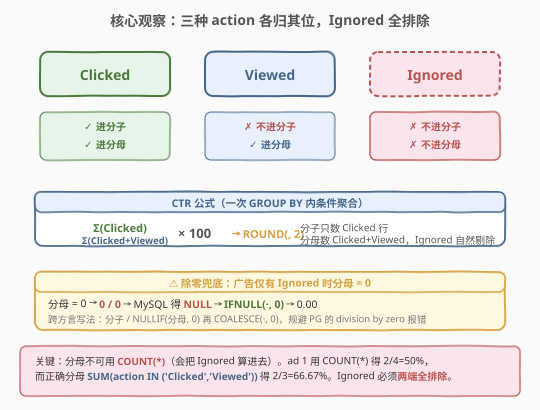
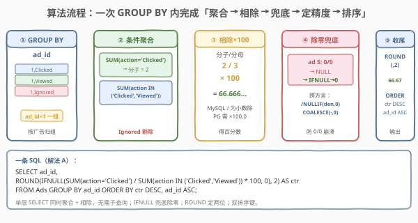
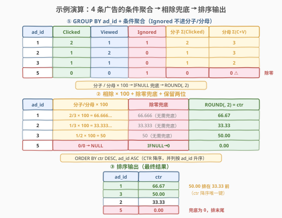

# LeetCode 广告效果 题解

## 1. 题目概述

- **标题 / 题号**：广告效果（#1322，easy）
- **链接**：https://leetcode.cn/problems/ads-performance/
- **难度**：简单
- **标签**：数据库、SQL、条件聚合、SUM(CASE)、除零处理、IFNULL/NULLIF、CTR

**题意**：给定 `Ads` 表，每行记录一个用户对一条广告采取的行为。`action` 是枚举类型，取值为 `'Clicked'`（点击）、`'Viewed'`（浏览）、`'Ignored'`（忽略）。公司希望计算每条广告的**点击通过率（Click-Through Rate, CTR）**，衡量广告效果。CTR 公式如下：

$$
\text{CTR} = \frac{\text{点击数}}{\text{点击数} + \text{浏览数}} \times 100
$$

结果**保留两位小数**，按 `ctr` **降序**、`ad_id` **升序**排列返回。

> ⚠️ 关键陷阱有二：① `'Ignored'` 既不计入分子也不计入分母——它对 CTR 完全「透明」；② 当一条广告只有 `'Ignored'` 行时，分母 = 0，此时 `CTR = 0.00`（而非报错或 `NULL`），必须显式处理除零。

**表结构**：

```text
Table: Ads
+---------------+---------+
| Column Name   | Type    |
+---------------+---------+
| ad_id         | int     |  ← 广告 ID
| user_id       | int     |  ← 用户 ID
| action        | enum    |  ← ('Clicked','Viewed','Ignored')
+---------------+---------+
```

- `(ad_id, user_id)` 为联合主键，即同一广告可被多名用户、以不同行为记录
- `action` 仅取 `'Clicked'`、`'Viewed'`、`'Ignored'`

**示例 1**：

```text
输入：
Ads 表：
+-------+---------+---------+
| ad_id | user_id | action  |
+-------+---------+---------+
| 1     | 1       | Clicked |
| 2     | 2       | Clicked |
| 3     | 3       | Viewed  |
| 5     | 5       | Ignored |
| 1     | 7       | Ignored |
| 2     | 7       | Viewed  |
| 3     | 5       | Clicked |
| 1     | 4       | Viewed  |
| 2     | 11      | Viewed  |
| 1     | 2       | Clicked |
+-------+---------+---------+

输出：
+-------+-------+
| ad_id | ctr   |
+-------+-------+
| 1     | 66.67 |
| 3     | 50.00 |
| 2     | 33.33 |
| 5     | 0.00  |
+-------+-------+
```

**解释**：

| ad_id | Clicked | Viewed | Ignored | CTR 计算 | ctr |
|-------|---------|--------|---------|----------|-----|
| 1 | 2 | 1 | 1 | 2/(2+1)×100 | 66.67 |
| 2 | 1 | 2 | 0 | 1/(1+2)×100 | 33.33 |
| 3 | 1 | 1 | 0 | 1/(1+1)×100 | 50.00 |
| 5 | 0 | 0 | 1 | 0/0 → 除零 → 0 | 0.00 |

> 💡 注意 `ad_id=5`：只有一行 `Ignored`，分子分母均为 0，CTR 规定为 0.00。输出按 `ctr` 降序排列，故 50.00 的 ad 3 排在 33.33 的 ad 2 之前。

**约束**：

- `action` 仅取 `'Clicked'`、`'Viewed'`、`'Ignored'`
- 结果按 `ctr` 降序、`ad_id` 升序排列
- 输出列名：`ad_id`、`ctr`，`ctr` 保留两位小数

## 2. 解题思路

### 2.1 暴力思路：先 COUNT 出三列再相除

最直觉的写法是按 `ad_id` 分组后分别数出「点击数」「浏览数」再相除：

```sql
SELECT ad_id,
       ROUND(clicks / (clicks + views) * 100, 2) AS ctr
FROM (
    SELECT ad_id,
           SUM(action = 'Clicked') AS clicks,
           SUM(action = 'Viewed')  AS views
    FROM Ads
    GROUP BY ad_id
) t;
```

这能算对多数广告，但有两个问题：

1. **`ad_id=5` 除零崩溃**：`clicks=0`、`views=0`，`0/0` 在 MySQL 里返回 `NULL`（PostgreSQL 直接报错），`ad_id=5` 的 `ctr` 会变成 `NULL` 而非 `0.00`。
2. **多一次嵌套**：先 `GROUP BY` 出中间表再外层相除，写法啰嗦。其实可以在**同一层** `SELECT` 里同时聚合 + 相除，省掉子查询。

> ⚠️ 「先数点击、再数浏览、最后相除」是正确思路，但必须解决除零，且无需分两步——条件聚合可以在一次 `GROUP BY` 内同时统计分子和分母。

### 2.2 核心观察：一次 GROUP BY 内做条件聚合 + 除零兜底



关键洞察分两点：

**第一点：条件聚合（Conditional Aggregation）**。与其数出 `clicks` 和 `views` 两个变量再相除，不如直接在 `SELECT` 里写两个「带条件的 `SUM`」：

- **分子** = `SUM(action = 'Clicked')`：只数点击行（MySQL 里 `action = 'Clicked'` 求值为 1/0，`SUM` 即计数）。
- **分母** = `SUM(action IN ('Clicked', 'Viewed'))`：数「点击 + 浏览」行，`Ignored` 自然被排除。

由于两者都在**同一个 `GROUP BY ad_id`** 下计算，无需子查询，一条 `SELECT` 即可同时拿到分子分母并相除。

**第二点：除零兜底**。`ad_id=5` 只有 `Ignored` 行，分子分母都为 0：

$$
\frac{0}{0} \;\xrightarrow{\text{MySQL}}\; \text{NULL} \;\xrightarrow{\text{IFNULL}(\cdot,0)}\; 0
$$

MySQL 中 `0/0` 返回 `NULL`（不报错），外层套 `IFNULL(x, 0)` 把 `NULL` 拉回 0；再用 `ROUND(x, 2)` 保留两位小数。整条广告的 CTR 计算于是浓缩为：

```sql
ROUND(IFNULL(
    SUM(action = 'Clicked') / SUM(action IN ('Clicked','Viewed')) * 100,
0), 2)
```

> 💡 **为什么不直接 `clicks / (clicks + views)`？** 因为 `Ignored` 必须从分母里剔除。若分母写成 `COUNT(*)`（统计该广告所有行），`ad_id=1` 的分母会变成 4（含 1 个 Ignored），CTR 变成 2/4=50% 而非正确的 2/3=66.67%。分母必须用 `SUM(action IN ('Clicked','Viewed'))` 只数有效行为。

### 2.3 算法流程图



**一条 SQL 的流水线**：

1. **分组**：`GROUP BY ad_id`，把每个广告的所有行为行归到一组。
2. **条件聚合**：在同层 `SELECT` 中用 `SUM(action = 'Clicked')` 取分子、`SUM(action IN ('Clicked','Viewed'))` 取分母。
3. **计算比率**：分子 / 分母 × 100 得到百分数。
4. **除零兜底**：`IFNULL(..., 0)`（或跨方言用 `NULLIF` + `COALESCE`）把 0/0 产生的 `NULL` 拉回 0。
5. **保留小数**：`ROUND(x, 2)` 保留两位。
6. **排序**：`ORDER BY ctr DESC, ad_id ASC`，CTR 降序为主、`ad_id` 升序为辅打破并列。

> 💡 **MySQL `/` 是小数除法**：`SUM` 的结果是 `DECIMAL`，`2/3` 在 MySQL 里得 0.6667（不是整数除法的 0），所以 `×100` 后能正确得到 66.67。但在 PostgreSQL 中整数/整数 = 整数截断，需写成 `× 100.0` 强制浮点——见解法 B。

### 2.4 示例演算

以示例 1 数据，跟踪每个 `ad_id` 的「条件聚合 → 相除 → 兜底 → 排序」全过程：



**步骤 ①：`GROUP BY ad_id` 后条件聚合**

| ad_id | `SUM(action='Clicked')` 分子 | `SUM(action IN ('Clicked','Viewed'))` 分母 | 备注 |
|-------|------------------------------|-------------------------------------------|------|
| 1 | 2 | 3 | 含 1 个 Ignored 不计入分母 |
| 2 | 1 | 3 | 无 Ignored |
| 3 | 1 | 2 | 无 Ignored |
| 5 | 0 | 0 | 仅 1 个 Ignored → 分母为 0 |

**步骤 ②：相除 × 100 + 除零兜底 + 保留两位**

| ad_id | 分子/分母×100 | 兜底 | ROUND(,2) | ctr |
|-------|---------------|------|-----------|-----|
| 1 | 2/3×100 = 66.666… | 66.666… | 66.67 | 66.67 |
| 2 | 1/3×100 = 33.333… | 33.333… | 33.33 | 33.33 |
| 3 | 1/2×100 = 50 | 50 | 50.00 | 50.00 |
| 5 | 0/0 → NULL | IFNULL→0 | 0.00 | 0.00 |

**步骤 ③：`ORDER BY ctr DESC, ad_id ASC`**

| ad_id | ctr |
|-------|-----|
| 1 | 66.67 |
| 3 | 50.00 |
| 2 | 33.33 |
| 5 | 0.00 |

> 💡 **验证**：50.00 的 ad 3 排在 33.33 的 ad 2 之前——`ctr` 降序是唯一排序键，`ad_id` 仅在 `ctr` 并列时才起作用（本题无并列）。`ad_id=5` 经除零兜底后 `ctr=0.00`，正确排在末尾。

## 3. 参考代码

### MySQL（解法 A：SUM(布尔) + IFNULL，最简洁，推荐）

```sql
# 1322. 广告效果
# 思路：GROUP BY ad_id → 条件聚合取分子(SUM action='Clicked')与分母(SUM action IN ('Clicked','Viewed'))
#       → 相除×100 → IFNULL 兜底除零 → ROUND 保留两位 → 按 ctr 降序、ad_id 升序
SELECT ad_id,
       ROUND(IFNULL(
           SUM(action = 'Clicked') / SUM(action IN ('Clicked', 'Viewed')) * 100,
       0), 2) AS ctr
FROM Ads
GROUP BY ad_id
ORDER BY ctr DESC, ad_id ASC;
```

> 💡 **写法要点**：
> - **`SUM(action = 'Clicked')`**：MySQL 把布尔表达式 `action = 'Clicked'` 求值为 1（真）或 0（假），`SUM` 即得到「点击行数」。这是 MySQL 独有的布尔→整数隐式转换。
> - **`SUM(action IN ('Clicked','Viewed'))`**：同理，`IN` 也是布尔，`SUM` 得到「点击+浏览行数」，`Ignored` 行求值为 0 被自动排除。
> - **`IFNULL(..., 0)`**：当某广告只有 `Ignored` 行时，分母 = 0，MySQL 的 `0/0` 返回 `NULL`，`IFNULL` 把它拉回 0。
> - **`ROUND(x, 2)`**：保留两位小数；MySQL 的 `/` 是小数除法，`2/3` 得 0.6667，`×100` 后 66.67。
> - **`ORDER BY ctr DESC, ad_id ASC`**：CTR 降序为主键，`ad_id` 升序为并列打破器。
> - 单层 `SELECT` 同时聚合 + 相除，无需子查询，是本题最简洁写法。

### MySQL / PostgreSQL（解法 B：CASE WHEN + NULLIF + COALESCE，跨方言可移植）

```sql
SELECT ad_id,
       ROUND(COALESCE(
           SUM(CASE WHEN action = 'Clicked' THEN 1 ELSE 0 END) * 100.0 /
           NULLIF(SUM(CASE WHEN action IN ('Clicked', 'Viewed') THEN 1 ELSE 0 END), 0)
       , 0), 2) AS ctr
FROM Ads
GROUP BY ad_id
ORDER BY ctr DESC, ad_id;
```

> 💡 **写法要点**：
> - **`SUM(CASE WHEN ... THEN 1 ELSE 0 END)`**：标准 SQL 写法的条件计数，不依赖 MySQL 的布尔→整数转换，在 PostgreSQL、SQL Server 等均可运行。
> - **`NULLIF(denom, 0)`**：把分母的 0 转成 `NULL`，使除法结果为 `NULL`（而非报错）。这是跨方言处理除零的**标准做法**——PostgreSQL 中 `x/0` 会直接抛 `division by zero` 错误，必须用 `NULLIF` 规避。
> - **`COALESCE(..., 0)`**：把除法产生的 `NULL` 拉回 0（等价于 MySQL 的 `IFNULL`，但 `COALESCE` 是 SQL 标准函数，兼容性更好）。
> - **`* 100.0` 而非 `* 100`**：强制浮点除法。PostgreSQL 中 `1/3`（整数/整数）= 0（截断），必须用 `100.0` 把运算提升为浮点；MySQL 中 `/` 本就是小数除法，写 `100` 或 `100.0` 均可。
> - **排序方向一致**：`ORDER BY ctr DESC, ad_id`（`ASC` 是默认可省略），与解法 A 完全相同。

### Python（pandas）

```python
import pandas as pd

def ads_performance(ads: pd.DataFrame) -> pd.DataFrame:
    ads = ads.assign(
        clicked=(ads['action'] == 'Clicked').astype(int),
        cv=ads['action'].isin(['Clicked', 'Viewed']).astype(int),
    )
    g = ads.groupby('ad_id').agg(clicked=('clicked', 'sum'), cv=('cv', 'sum'))
    denom = g['cv'].replace(0, pd.NA)
    g['ctr'] = (g['clicked'] / denom * 100).fillna(0).round(2)
    result = (
        g[['ctr']]
        .reset_index()
        .sort_values(['ctr', 'ad_id'], ascending=[False, True])
        .reset_index(drop=True)
    )
    return result
```

> 💡 **pandas 对照**：
> - `(ads['action'] == 'Clicked').astype(int)` 对应 `SUM(action = 'Clicked')`——布尔转 0/1 后求和即条件计数。
> - `ads['action'].isin(['Clicked','Viewed']).astype(int)` 对应分母 `SUM(action IN (...))`，`Ignored` 自动为 0。
> - `g['cv'].replace(0, pd.NA)` 对应 `NULLIF(denom, 0)`——把 0 分母换成 `NA`，使 `clicked / NA = NA`（不报错）。
> - `.fillna(0)` 对应 `IFNULL(..., 0)` / `COALESCE(..., 0)`——把除零产生的 `NA` 拉回 0。
> - `.round(2)` 对应 `ROUND(x, 2)`；`sort_values(['ctr','ad_id'], ascending=[False, True])` 对应 `ORDER BY ctr DESC, ad_id ASC`。

## 4. 复杂度分析

| 维度 | 解法 A（SUM 布尔） | 解法 B（CASE + NULLIF） | pandas |
|------|--------------------|-------------------------|--------|
| **时间** | $O(n)$ | $O(n)$ | $O(n)$ |
| **空间** | $O(m)$ | $O(m)$ | $O(n + m)$ |
| **方言** | 仅 MySQL | 跨方言（MySQL/PG/SQLite） | pandas |
| **推荐度** | ✓ **MySQL 首选** | ✓ 通用环境 | ✓ pandas 环境 |

> - $n$ = `Ads` 表行数，$m$ = 不同 `ad_id` 数（即输出行数）
> - 两种 SQL 写法都对 `Ads` 做一次全表扫描 + 一次 `GROUP BY` 哈希聚合，时间 $O(n)$；空间上聚合只存 $m$ 个组的中间结果 $O(m)$（pandas 额外物化布尔列故 $O(n+m)$）。
> - **索引优化**：在 `ad_id` 上建索引可加速 `GROUP BY`；若 `action` 取值极少，`(ad_id, action)` 复合索引能让聚合几乎走索引覆盖扫描。
> - 两写法性能等价，区别仅在可移植性：解法 A 依赖 MySQL 的布尔→整数与 `0/0→NULL` 语义；解法 B 用标准 `CASE`/`NULLIF`/`COALESCE`，在 PostgreSQL 等严格方言下也能跑。

## 5. 扩展：条件聚合与除零处理两大家族

### 5.1 条件聚合的三种等价写法

「在一个 `GROUP BY` 内同时统计多个子集的计数」是 SQL 高频技巧，常见三种写法，按可移植性递增：

| 写法 | 示例 | 可移植性 | 备注 |
|------|------|----------|------|
| `SUM(布尔)` | `SUM(action = 'Clicked')` | 仅 MySQL | 布尔隐式转 1/0，最简洁 |
| `SUM(CASE WHEN)` | `SUM(CASE WHEN action='Clicked' THEN 1 ELSE 0 END)` | 全方言 | 标准 SQL，写法略长 |
| `COUNT(*) FILTER` | `COUNT(*) FILTER (WHERE action='Clicked')` | PostgreSQL / SQL 标准 | 语义最直白，MySQL 不支持 |

> 💡 三者结果完全相同，选哪个看目标数据库：MySQL 用 `SUM(布尔)` 最爽；跨库脚本用 `SUM(CASE)` 最稳；纯 PostgreSQL 用 `FILTER` 最清晰。本题解法 A/B 分别示范了前两种。

### 5.2 除零处理：IFNULL vs NULLIF 两种范式

SQL 中「分母可能为 0」是必考陷阱，两种主流处理范式：

| 范式 | 写法 | 机制 | 适用方言 |
|------|------|------|----------|
| **除零后兜底** | `IFNULL(num / denom, 0)` | 依赖 `x/0 → NULL`（MySQL 行为），再 `IFNULL` 拉回 0 | 仅 MySQL |
| **除零前规避** | `num / NULLIF(denom, 0)` 再 `COALESCE(..., 0)` | 先把分母 0 转成 `NULL`，使除法得 `NULL` 而非报错 | 全方言 |

> ⚠️ **PostgreSQL 中 `x/0` 直接抛 `division by zero` 错误**，根本走不到 `IFNULL`，所以跨方言必须用 `NULLIF` 在除法**之前**把 0 分母中和掉。判断口诀：**「分母可能为 0 → 一律 `NULLIF(denom, 0)`」**，这是最安全的肌肉记忆。

### 5.3 整数除法陷阱

`1 / 3` 在不同数据库里结果不同，是 CTR 类百分比题的隐形坑：

| 数据库 | `1 / 3` | 原因 |
|--------|---------|------|
| MySQL | 0.3333 | `/` 一律按 `DECIMAL` 小数除法 |
| PostgreSQL | 0 | 整数/整数 = 整数截断 |
| SQLite | 0 | 整数/整数 = 整数截断 |

> 💡 规避方法：把 `× 100` 写成 `× 100.0`，强制提升为浮点运算，所有方言行为一致。解法 B 的 `* 100.0` 即出于此；解法 A 因 MySQL 本就是小数除法，写 `100` 也能过，但写 `100.0` 更稳妥。

## 6. 面试要点

1. **为什么分母是 `SUM(action IN ('Clicked','Viewed'))` 而不是 `COUNT(*)`？**

   > 因为 `Ignored` 行既不计入分子也不计入分母。若用 `COUNT(*)` 统计该广告全部行，`ad_id=1` 的分母会变成 4（含 1 个 Ignored），CTR 变成 2/4=50% 而非正确的 2/3=66.67%。分母必须用 `SUM(action IN ('Clicked','Viewed'))` 只数有效行为。

2. **`ad_id=5` 只有 `Ignored` 行，`0/0` 会怎样？如何处理？**

   > MySQL 中 `0/0` 返回 `NULL`（不报错），不处理的话 `ad_id=5` 的 `ctr` 会是 `NULL` 而非 `0.00`。用 `IFNULL(除法表达式, 0)` 把 `NULL` 拉回 0；跨方言则用 `num / NULLIF(denom, 0)` 配合 `COALESCE(..., 0)`。注意 PostgreSQL 中 `0/0` 直接抛错，必须用 `NULLIF` 在除法前规避。

3. **`SUM(action = 'Clicked')` 为什么能当计数用？**

   > MySQL 把布尔表达式 `action = 'Clicked'` 求值为 1（真）或 0（假），`SUM` 对这列 0/1 求和即得到「满足条件的行数」。这是 MySQL 独有的布尔→整数隐式转换，等价于 `SUM(CASE WHEN action='Clicked' THEN 1 ELSE 0 END)`，但更简洁。跨方言场景应改用 `CASE WHEN` 或 `COUNT(*) FILTER`。

4. **`ORDER BY ctr DESC, ad_id ASC` 的两个排序键分别有什么作用？**

   > `ctr DESC` 是主排序键，让 CTR 高的广告排在前面（效果好的优先展示）；`ad_id ASC` 是并列打破器（tiebreaker），当两条广告 CTR 完全相同时（如都为 0.00），按 `ad_id` 升序排列，保证输出顺序确定。题目明确要求「ctr 降序，并列时 ad_id 升序」，少写任一个都会判错。

5. **MySQL 的 `1/3` 和 PostgreSQL 的 `1/3` 结果一样吗？**

   > 不一样。MySQL 的 `/` 一律按 `DECIMAL` 小数除法，`1/3 = 0.3333`；PostgreSQL 中整数/整数 = 整数截断，`1/3 = 0`。本题若在 PostgreSQL 上跑解法 A 的 `* 100` 会得到 0（截断后再乘 100），必须写成 `* 100.0` 强制浮点。这也是解法 B 用 `100.0` 的原因。

> 💡 **一句话总结**：1322 是 SQL **「条件聚合 + 除零兜底」招牌题**——难点不在 CTR 公式，而在意识到 `Ignored` 要从分母剔除、以及 `0/0` 必须显式处理。核心写法：`SUM(action='Clicked')` 取分子、`SUM(action IN ('Clicked','Viewed'))` 取分母，`IFNULL`/`NULLIF` 兜底除零，`ROUND(,2)` 定精度。判断口诀：**分母可能为 0 → 一律 `NULLIF`**。

## 同类练习题

| # | 题目 | 与本题的关联 |
|---|------|-------------|
| 1173 | [即时食物配送 I](https://leetcode.cn/problems/immediate-food-delivery-i/) | `SUM(布尔)/COUNT(*)` 计算百分比——同样的条件聚合求比率套路，分母是全部行而非子集，对照理解 1322 为何分母要排除 Ignored |
| 620 | [有趣的电影](https://leetcode.cn/problems/not-boring-movies/) | `WHERE` 单条件筛选 + `ORDER BY` 排序，条件聚合的入门前奏，承接「按 action 筛选」语义 |
| 1251 | [平均售价](https://leetcode.cn/problems/average-selling-price/)（🔒） | `SUM(价格×数量)/SUM(数量)` 加权平均——同属「分子分母都是条件聚合的 SUM」家族，分母为加权计数，对照 1322 的简单计数分母 |
| 1211 | [查询结果的质量和占比](https://leetcode.cn/problems/queries-quality-and-percentage/)（[题解](../1201-1300/1211_查询结果的质量和占比.md)） | `ROUND(AVG(评分),2)` + `ROUND(SUM(评分<3)/COUNT(*)*100,2)`——同一 `SELECT` 内同时算「平均值」与「条件计数百分比」，与 1322 的条件聚合 + ROUND 完全同构 |
| 197 | [上升的温度](https://leetcode.cn/problems/rising-temperature/)（[题解](../0101-0200/197_上升的温度.md)） | `DATEDIFF` 日期比较 + 排序，SQL 基础查询入门，承接「`WHERE`/`ORDER BY` 基本骨架」 |
