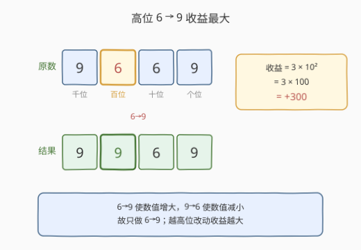
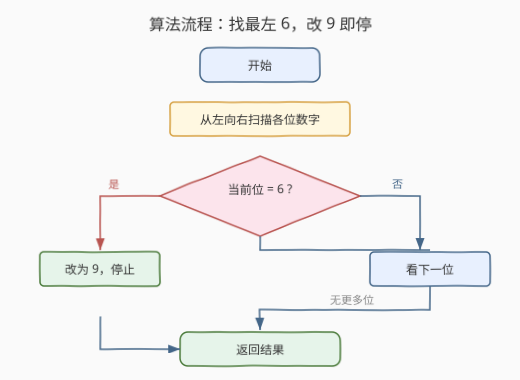
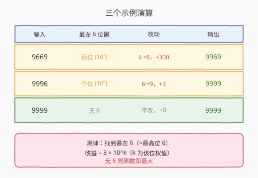

# 6 和 9 组成的最大数字

- **题目名称**：6 和 9 组成的最大数字
- **链接**：[1323. 6 和 9 组成的最大数字](https://leetcode.cn/problems/maximum-69-number/)
- **难度**：简单
- **标签**：数学、贪心、字符串

## 1. 题目概述

给你一个仅由数字 6 和 9 组成的正整数 `num`。你最多只能翻转一位数字：将 6 变成 9，或者把 9 变成 6。请返回你可以得到的最大数字。

**示例 1**：

```text
输入：num = 9669
输出：9969
解释：
改变第一位数字可以得到 6669。
改变第二位数字可以得到 9969。
改变第三位数字可以得到 9699。
改变第四位数字可以得到 9666。
其中最大的数字是 9969。
```

**示例 2**：

```text
输入：num = 9996
输出：9999
解释：将最后一位从 6 变到 9，其结果 9999 是最大的数。
```

**示例 3**：

```text
输入：num = 9999
输出：9999
解释：无需改变就已经是最大的数字了。
```

**约束条件**：

- `1 <= num <= 10^4`
- `num` 每一位上的数字都是 6 或者 9。

> 💡 本题本质是**贪心**：把「变好」的改动用在收益最大的位置。由于只能改一位，关键在于找出**哪一位改动后数值增量最大**。

---

## 2. 解题思路

### 2.1 暴力思路：枚举每一位改动

对 `num` 的每一位，分别尝试翻转（6↔9），算出所有可能的数字，取最大值。一个 4 位数最多枚举 4 种翻转结果，完全可以接受。

但这样做有两个冗余：

- **9→6 永远使数值变小**：把某位 9 改成 6，相当于在该位权值上减 3，必然不优于原数，枚举它毫无意义。
- **6→9 的收益由位权决定**：高位 6 改 9 的增量远大于低位。例如对 9669，改百位 6 得 +300，改十位 6 得 +30——只需取**最高位的 6** 即可，无需逐一比较。

### 2.2 核心观察：把最左（最高位）的 6 改成 9



关键点：

- **只做 6→9**：6 变 9 使该位增加 3，9 变 6 使该位减少 3。要最大化数值，只应做 6→9，绝不做 9→6。
- **位权越高收益越大**：把第 $k$ 位（从右起 0 索引）的 6 改成 9，增量 $= 3 \times 10^{k}$。显然 $k$ 越大增量越大。
- **最左 6 = 最高位 6**：因此只需找到**从左数第一个 6**（即位权最高的 6），把它改成 9 即可。
- **若无 6**（全为 9）：原数已最大，无需改动。

> 💡 **贪心正确性**：6→9 是单调增益操作，且各位之间互不影响（改一位不改变其他位的值）。在「只能改一位」的约束下，把唯一的增益机会用在收益最大的位（最高位 6）上即为全局最优。这是典型的**局部最优 ⇒ 全局最优**贪心。

### 2.3 算法流程图



**完整步骤**（字符串视角）：

1. 将 `num` 转为字符串 `s`。
2. 从左向右扫描，找到第一个 `'6'`。
3. 将其改为 `'9'`，立即停止（只改一位）。
4. 若整串无 `'6'`，原样返回。
5. 把字符串转回整数返回。

> 💡 **数学视角**（不转字符串）：从低位向高位逐位取余，记录最后一次遇到 6 时的位权 `best`（扫描结束时 `best` 即为最高位 6 的权值）。返回 `num + 3 * best`；若无 6 则 `best = 0`，返回原数。

### 2.4 示例演算

三个官方示例的演算过程：



| 输入 | 最左 6 位置 | 改动 | 增量 | 输出 |
|------|------------|------|------|------|
| 9669 | 百位（$10^{2}$） | 6→9 | $3 \times 100 = 300$ | 9969 |
| 9996 | 个位（$10^{0}$） | 6→9 | $3 \times 1 = 3$ | 9999 |
| 9999 | 无 6 | 不改 | 0 | 9999 |

以 `num = 9669` 为例，数学法逐位扫描（从低到高）：

| 步骤 | 当前 `n` | `n % 10` | 是 6? | `best` | `place` |
|------|---------|----------|-------|--------|---------|
| 1 | 9669 | 9 | 否 | 0 | 10 |
| 2 | 966 | 6 | 是 | 10 | 100 |
| 3 | 96 | 6 | 是 | 100 | 1000 |
| 4 | 9 | 9 | 否 | 100 | 10000 |

扫描结束，`best = 100`（最高位 6 的权值），`result = 9669 + 3 × 100 = 9969`。

---

## 3. 参考代码

### C++

```cpp
// 写法一：字符串，找最左 '6' 改 '9'
class Solution {
public:
    int maximum69Number (int num) {
        string s = to_string(num);
        for (char& c : s) {
            if (c == '6') { c = '9'; break; }
        }
        return stoi(s);
    }
};
```

```cpp
// 写法二：数学，逐位取余记录最高位 6 的权值
class Solution {
public:
    int maximum69Number (int num) {
        int n = num, place = 1, best = 0;
        while (n) {
            if (n % 10 == 6) best = place;
            n /= 10;
            place *= 10;
        }
        return num + 3 * best;
    }
};
```

### Python

```python
# 写法一：字符串 replace 第一个 '6'
class Solution:
    def maximum69Number (self, num: int) -> int:
        return int(str(num).replace('6', '9', 1))
```

```python
# 写法二：数学，逐位取余记录最高位 6 的权值
class Solution:
    def maximum69Number (self, num: int) -> int:
        n, place, best = num, 1, 0
        while n:
            if n % 10 == 6:
                best = place
            n //= 10
            place *= 10
        return num + 3 * best
```

> 💡 **实现细节**：① Python `str.replace('6', '9', 1)` 第三个参数限替换 1 次，天然只改最左 6，一行搞定。② 数学法从低位向高位扫描，每次遇 6 就更新 `best`，扫描结束 `best` 自然是最高位 6 的权值——因为越后面遇到的 6 位权越高，会覆盖前面的记录。③ C++ 字符串法用 `for (char& c : s)` 引用遍历，改完 `break` 保证只改一位。

---

## 4. 复杂度分析

| 维度 | 复杂度 | 说明 |
|------|--------|------|
| 时间复杂度 | $O(\log_{10} num)$ | 数字位数 $d = \lfloor \log_{10} num \rfloor + 1$，最多 4 位，扫描一趟 |
| 空间复杂度（字符串法） | $O(d)$ | 存放字符串，$d \leq 4$ |
| 空间复杂度（数学法） | $O(1)$ | 仅用常数个整型变量 |

> ⚠️ 本题 $num \leq 10^{4}$，最多 4 位数，两种写法实际开销几乎相同。数学法的优势在 $num$ 位数极大、且需避免字符串分配时才显现。

---

## 5. 扩展：若可改 k 位 / 可任意翻转

**可改 k 位**：若题目改为「最多翻转 k 位」，贪心仍成立——把所有 6 从高到低依次改成 9，改满 k 个或无 6 可改即停。只需把「改一个就 break」改为「计数到 k 即停」。

**任意数字（非仅 6/9）**：若数字可含 0-9 任意位，且允许把任意位改成 9，则同样贪心：从高到低把第一个非 9 位改成 9（增量 $= (9 - d) \times 10^{k}$），改满 k 个即停。本题是 $d \in \{6, 9\}$、$k = 1$ 的特例。

---

## 6. 面试要点

1. **为什么只改 6 而不改 9？**

   > 6→9 使该位增加 3，数值增大；9→6 使该位减少 3，数值减小。目标是最大值，故只做增益操作 6→9，9→6 永不参与最优解。

2. **为什么是最左边的 6 而非任意 6？**

   > 改第 $k$ 位（从右起）的 6 为 9，增量 $= 3 \times 10^{k}$，$k$ 越大增量越大。最左的 6 位权最高，改动收益最大。在「只能改一位」约束下，把唯一机会用在收益最大的位即得全局最优。

3. **字符串法和数学法各自的取舍？**

   > 字符串法直观、可读性好，`replace(..., 1)` 一行表达「改最左一个」；数学法用 $O(1)$ 额外空间、无字符串分配，在大数场景下更省。本题 4 位数，两者无实质差异，面试按可读性选字符串法即可。

4. **数学法为什么从低位扫，结果却是最高位 6？**

   > 从低位向高位扫，每次遇 6 就把当前位权记入 `best`。越后面遇到的 6 位权越高，会覆盖之前的记录，故扫描结束时 `best` 一定是最高位（最左）6 的权值。若全无 6，`best` 保持 0，返回原数。

5. **若 num 位数极大（如 1e9 位大数）该如何处理？**

   > 此时不能转 int，应直接在字符串上操作：`s.replace('6', '9', 1)`，仍是 $O(d)$ 时间。本题约束 $num \leq 10^{4}$，无需考虑，但面试官可能追问边界。

---

## 7. 同类练习题

- [9. 回文数](https://leetcode.cn/problems/palindrome-number/)（[题解](../0001-0100/9_回文数.md)）：同为「按位拆解整数」的数学题，反转一半数字判回文，练位权与取余技巧
- [7. 整数反转](https://leetcode.cn/problems/reverse-integer/)：逐位取余 + 重新累加位权，与本题数学法同源，是位权操作的基础模板
- [1295. 统计位数为偶数的数字](https://leetcode.cn/problems/find-numbers-with-even-number-of-digits/)（[题解](../1201-1300/1295_统计位数为偶数的数字.md)）：逐位取余数位数，与本题数学法扫描方式一致，对照练习位计数
- [258. 各位相加直到一位数](https://leetcode.cn/problems/add-digits/)：反复逐位求和，同样是「整数按位拆解」家族，巩固 `n % 10` / `n /= 10` 模板
