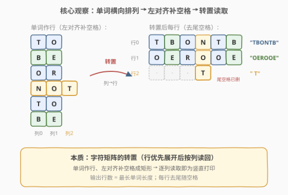
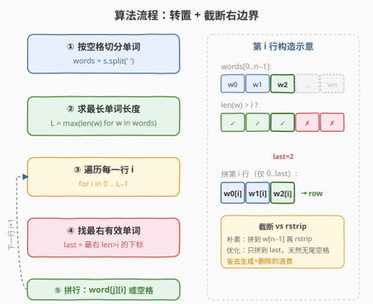
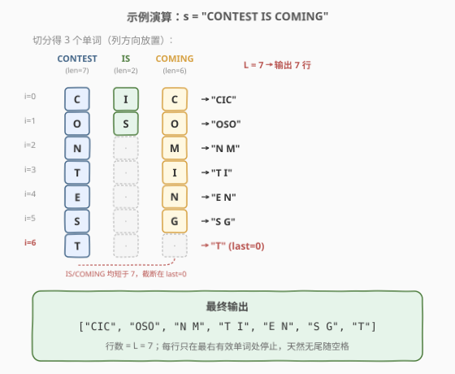

# 竖直打印单词

- **题目名称**：竖直打印单词
- **链接**：[1324. 竖直打印单词](https://leetcode.cn/problems/print-words-vertically/)
- **难度**：中等
- **标签**：字符串、数组、模拟、矩阵转置

## 1. 题目概述

给你一个字符串 `s`（单词间以单个空格分隔）。请你按照单词在 `s` 中的出现顺序将它们全部**竖直**返回：每个单词占据一列，从上到下排列。结果以字符串列表形式返回，**必要时用空格补位**，但**输出尾部的空格需要删除**（不允许尾随空格）。

**示例 1**：

```text
输入：s = "HOW ARE YOU"
输出：["HAY","ORO","WEU"]
解释：每个单词竖直打印
 "HAY"
 "ORO"
 "WEU"
```

**示例 2**：

```text
输入：s = "TO BE OR NOT TO BE"
输出：["TBONTB","OEROOE","   T"]
解释：允许空格补位，但不允许末尾出现空格
"TBONTB"
"OEROOE"
"   T"
```

**示例 3**：

```text
输入：s = "CONTEST IS COMING"
输出：["CIC","OSO","N M","T I","E N","S G","T"]
```

**约束条件**：

- $1 \le \text{s.length} \le 200$
- `s` 仅含大写英文字母
- 题目数据保证两个单词之间只有一个空格

> 💡 **关键信号**：每个单词作一列、按出现顺序排列，等价于把单词看作**字符矩阵的行**（左对齐、缺位补空格），再**按列读回**——即矩阵转置。输出行数等于最长单词的长度。

---

## 2. 解题思路

### 2.1 暴力思路：逐列填字符 + rstrip

最直观的做法：

1. 按空格切分 `s` 得到单词列表 `words`。
2. 取最长单词长度 $L$，输出共有 $L$ 行。
3. 对每一行 $i \in [0, L)$，遍历**所有**单词：若 `i < len(word)` 取 `word[i]`，否则取空格 `' '`，拼成一行字符串。
4. 对拼好的字符串做 `rstrip()` 去掉尾随空格，加入结果。

该法正确且时间复杂度已达 $O(\sum \text{len}(w))$，但存在一个小浪费：当后段单词都短于 $i$ 时，会先拼出一串空格、再整体删除。

### 2.2 核心观察：矩阵转置 + 截断右边界



把每个单词看作字符矩阵的**一行**，左对齐、长度不足处补空格，得到一个 $n \times L$ 的矩形（$n$ 为单词数，$L$ 为最长单词长度）。题目要求的「竖直打印」就是该矩阵的**转置**——逐列读取，每列对应一个输出字符串。

转置本身是机械操作，真正的细节坑在**尾随空格**：

- 朴素转置会让每一行都拼到第 $n-1$ 列（即最后一个单词），若后段单词较短，行尾会拖一堆空格，必须 `rstrip`。
- **优化**：对第 $i$ 行，先找出**最右侧**那个长度 $> i$ 的单词下标 `last`，只需拼到 `last` 为止——之后的单词在第 $i$ 行全是空格，天然不产生尾随空格，无需事后再删。

> 💡 **为何截断等价于 rstrip？** 第 $i$ 行中，下标 $> last$ 的单词长度都 $\le i$，贡献的字符全是空格，且位于行尾。从 `last` 处停止拼接，等价于先拼全行再 `rstrip`，但省去了「生成空格再删除」的冗余。两种写法结果一致，截断版更紧凑。

### 2.3 算法流程图



流程说明：

1. **切分单词**：`words = s.split(' ')`
2. **求最长长度**：$L = \max(\text{len}(w))$，决定输出行数
3. **逐行构造**：对每个 $i \in [0, L)$
4. **找右边界**：`last` = 最右侧满足 `len(words[j]) > i` 的下标 $j$
5. **拼行**：对 $j \in [0, \text{last}]$，取 `words[j][i]`（越界则取空格），拼接成一行追加到结果

> ⚠️ `last` 一定存在：因为 $L$ 是某个单词的长度，当 $i < L$ 时该单词满足 `len > i`，故 `last ≥ 0`。

### 2.4 示例演算



以 `s = "CONTEST IS COMING"` 为例，切分得 `words = ["CONTEST", "IS", "COMING"]`，长度分别为 $7, 2, 6$，故 $L = 7$，输出 $7$ 行：

| 行 $i$ | CONTEST\[i\] | IS\[i\] | COMING\[i\] | `last` | 拼接结果 |
|--------|--------------|---------|-------------|--------|----------|
| 0 | C | I | C | 2 | `"CIC"` |
| 1 | O | S | O | 2 | `"OSO"` |
| 2 | N | （越界→空格） | M | 2 | `"N M"` |
| 3 | T | （越界→空格） | I | 2 | `"T I"` |
| 4 | E | （越界→空格） | N | 2 | `"E N"` |
| 5 | S | （越界→空格） | G | 2 | `"S G"` |
| 6 | T | （越界→空格） | （越界→空格） | 0 | `"T"` |

第 $6$ 行只有 `CONTEST` 有字符（`last = 0`），`IS` 和 `COMING` 均越界，截断在 `last=0` 处，结果就是 `"T"`，无尾随空格。

最终输出：`["CIC", "OSO", "N M", "T I", "E N", "S G", "T"]` ✓

---

## 3. 参考代码

### 方法一：转置 + 截断右边界（推荐）

### C++

```cpp
class Solution {
  public:
    vector<string> printVertically(string s) {
        vector<string> words;
        stringstream ss(s);
        string w;
        while (ss >> w) words.push_back(w);

        int L = 0;
        for (auto& t : words) L = max(L, (int)t.size());

        vector<string> res;
        for (int i = 0; i < L; ++i) {
            int last = 0;
            for (int j = 0; j < (int)words.size(); ++j)
                if (i < (int)words[j].size()) last = j;
            string row;
            for (int j = 0; j <= last; ++j)
                row += (i < (int)words[j].size()) ? words[j][i] : ' ';
            res.push_back(row);
        }
        return res;
    }
};
```

### Python

```python
class Solution:
    def printVertically(self, s: str) -> List[str]:
        words = s.split(' ')
        L = max(len(w) for w in words)
        res = []
        for i in range(L):
            last = max(j for j, w in enumerate(words) if i < len(w))
            row = ''.join(w[i] if i < len(w) else ' ' for w in words[:last + 1])
            res.append(row)
        return res
```

> 💡 **核心要点**：`last` 锁定第 $i$ 行最右的有效单词，拼接范围 $[0, \text{last}]$ 天然不含尾随空格，省去 `rstrip`。

### 方法二：全拼 + rstrip（最简实现）

### Python

```python
class Solution:
    def printVertically(self, s: str) -> List[str]:
        words = s.split(' ')
        L = max(len(w) for w in words)
        res = []
        for i in range(L):
            row = ''.join(w[i] if i < len(w) else ' ' for w in words)
            res.append(row.rstrip())
        return res
```

> 逻辑最直白：每个单词都取第 $i$ 位（越界补空格），拼完整行后 `rstrip` 删尾随空格。与方法一结果完全一致，只是多走了「生成再删除」的路径。

### 方法三：zip_longest 转置（Python 惯用法）

### Python

```python
from itertools import zip_longest

class Solution:
    def printVertically(self, s: str) -> List[str]:
        words = s.split(' ')
        return [''.join(col).rstrip() for col in zip_longest(*words, fillvalue=' ')]
```

> `zip_longest(*words, fillvalue=' ')` 直接对不等长序列做转置（缺位填空格），再逐列 `rstrip`。这是把「矩阵转置」语义落到语言层面的最简写法，与方法二等价。

---

## 4. 复杂度分析

| 维度 | 方法一（截断） | 方法二（全拼+rstrip） | 方法三（zip_longest） |
|------|----------------|------------------------|------------------------|
| 时间复杂度 | $O(\sum \text{len}(w))$ | $O(n \times L)$ | $O(n \times L)$ |
| 空间复杂度 | $O(\sum \text{len}(w))$ | $O(n \times L)$ | $O(n \times L)$ |

- **方法一**：每行只拼到 `last`，所有字符贡献总量恰为 $\sum \text{len}(w)$ 加上必要的中间空格，与单词总长同阶。$n \times L$ 在最坏情况（一个超长单词 + 大量单字符单词）会大于 $\sum \text{len}(w)$，截断版更省。
- **方法二/三**：遍历 $L$ 行 × $n$ 个单词，每个位置 $O(1)$，总时间 $O(n \times L)$。本题 $n, L \le 200$，完全可接受。

> 💡 三种方法在本题数据规模下无明显性能差异。面试中**先讲方法二建立直觉，再优化到方法一**展示「避免无用工作」的思维；Python 场景可顺带提方法三的 `zip_longest` 体现语言熟练度。

---

## 5. 扩展：转置思想的应用

「不等长序列转置」是一类常见操作的抽象：

- **不等长二维数组按列读取**：如把若干不等长子列表按列对齐输出，`zip_longest` 是通用解。
- **文本右对齐/列对齐排版**：本质都是构造字符矩阵后做行/列方向的重排。
- **与等长矩阵转置的对比**：等长矩阵转置是 $O(m \times n)$ 的标准操作（如 [48. 旋转图像](https://leetcode.cn/problems/rotate-image/) 中的转置+翻转）；本题难点在于**不等长**带来的补位与尾随空格处理。

若把约束改为「允许尾随空格」，则方法二无需 `rstrip`，退化为纯转置；若改为「右对齐补空格」，则需在单词**左侧**补空格再转置，`last` 的截断逻辑相应改为「最左有效单词」。

---

## 6. 面试要点

1. **如何想到用矩阵转置来建模？**

   题目说「每个单词放在一列、按出现顺序排列」，把单词看作行、字符看作列，正好是一个字符矩阵；「竖直打印」= 按列读取 = 转置。把补位空格理解为矩阵中「行长度不等时的左对齐填充」，转置后即得结果。

2. **为什么要处理尾随空格？截断法和 rstrip 法有何区别？**

   题目禁止尾随空格。转置后某行的尾部可能来自较短单词的补位空格。`rstrip` 法先拼全行再删除；截断法通过 `last`（最右有效单词下标）提前停止拼接，从源头不生成尾随空格。两者结果一致，截断法更紧凑。

3. **`last` 一定存在吗？**

   一定。$L$ 是最长单词的长度，对任意 $i \in [0, L)$，至少那个最长单词满足 `len > i`，故 `last ≥ 0`，不会出现「整行全空格」的退化情况。

4. **如果单词间有多个空格怎么办？**

   题目保证单词间恰有一个空格，`split(' ')` 即可。若不保证，应改用 `split()`（无参，按任意空白符切分并忽略连续空格），或先做预处理。可主动向面试官确认输入规范。

5. **方法三的 `zip_longest` 与 `zip` 有何区别？**

   `zip` 在最短序列结束时就停止，会丢掉长单词的尾部字符；`zip_longest` 用 `fillvalue` 把短序列补齐到最长，正好对应本题的「补空格」需求。这是 Python 处理不等长转置的惯用法。

---

## 7. 同类练习题

- [48. 旋转图像](https://leetcode.cn/problems/rotate-image/)：等长方阵的转置 + 翻转，对比本题不等长序列的转置与补位
- [54. 螺旋矩阵](https://leetcode.cn/problems/spiral-matrix/)：二维矩阵的另一种按序读取方式（螺旋序 vs 列优先），对比不同读取顺序的边界处理
- [14. 最长公共前缀](https://leetcode.cn/problems/longest-prefix/)：纵向逐列扫描字符，与本题「逐列取字符」的遍历方式同源
- [1260. 二维网格迁移](https://leetcode.cn/problems/shift-2d-grid/)（[站内题解](../1201-1300/1260_二维网格迁移.md)）：二维矩阵的一维化映射，同样是坐标变换型模拟题
