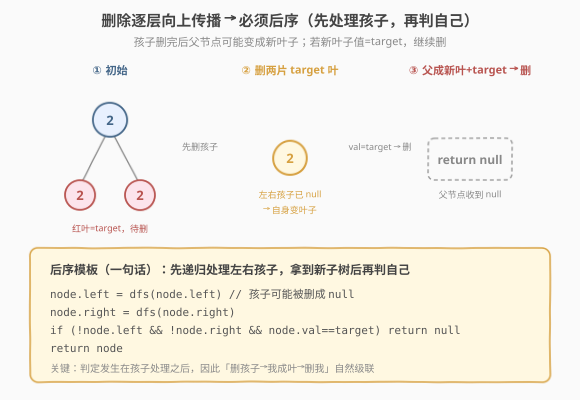
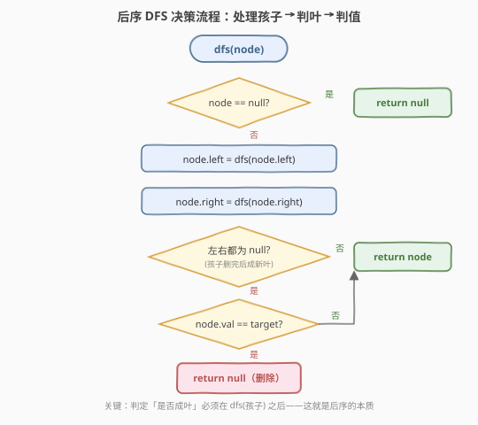
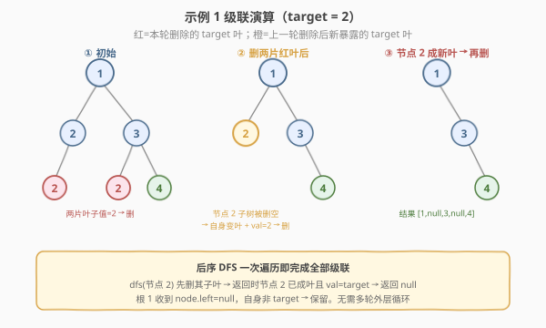

# 删除给定值的叶子节点

- **题目名称**：删除给定值的叶子节点
- **链接**：[1325. 删除给定值的叶子节点](https://leetcode.cn/problems/delete-leaves-with-a-given-value/)
- **难度**：中等
- **标签**：树、二叉树、深度优先搜索（DFS）、后序遍历

## 1. 题目概述

给你一棵以 `root` 为根的二叉树和一个整数 `target`，请你删除所有值为 `target` 的**叶子节点**。

注意，一旦删除值为 `target` 的叶子节点，它的父节点就可能变成叶子节点；如果新叶子节点的值恰好也是 `target`，那么这个节点也应该被删除。也就是说，你需要**重复此过程直到不能继续删除**。

**示例 1**：

```text
输入：root = [1,2,3,2,null,2,4], target = 2
输出：[1,null,3,null,4]

            1                  1                  1
           / \                  \                  \
          2   3        →         3         →        3
         /   / \                  \                  \
        2   2   4                   4                  4
```

左图中绿色叶子（值均为 `2`）被删，得到中间图；此时节点 `2`（根的左孩子）变成新叶子且值仍为 `target=2`，再次删除，得到最右图。

**示例 2**：

```text
输入：root = [1,3,3,3,2], target = 3
输出：[1,3,null,null,2]
```

**示例 3**：

```text
输入：root = [1,2,null,2,null,2], target = 2
输出：[1]
解释：每一步都删除一个值为 2 的叶子节点，链式向上删到底。
```

**约束条件**：

- 树中节点数目在范围 `[1, 3000]` 内
- `1 <= Node.val, target <= 1000`

> 💡 本题的灵魂是「**后序返回新根**」——删除会从叶子向根逐层传播，因此必须在递归处理完左右孩子之后再判定自身。`dfs` 返回处理后的子树根（可能是 `null`），父节点直接用返回值重接 `left/right`，级联删除自然发生，无需任何外层循环。

---

## 2. 解题思路

### 2.1 暴力思路：多轮外层循环

最直观的做法：每轮扫描整棵树，找出所有值为 `target` 的叶子并删除；若本轮删了至少一个节点，就再扫一轮，直到某轮无删除为止。

问题在于——

- **多轮重复遍历**：最坏情况是一条全为 `target` 的链（如示例 3），每轮只删一个叶子，需 $O(n)$ 轮，每轮 $O(n)$，总计 $O(n^2)$；
- **需要父指针或重新接驳**：删叶子时要在父节点上把对应 `left/right` 置 `null`，若没有父指针就得从根重新定位父节点，逻辑啰嗦易错。

> ⚠️ 这种「外层 while + 内层扫描」的写法能过，但**完全没有利用「删除会沿父子链自然传播」的性质**——一个节点是否会变成新叶子，取决于它的孩子是否被删空；而孩子是否被删空，恰是孩子子树递归的返回结果。

### 2.2 核心观察：后序返回新根，级联自动传播



**关键洞察**：把 `dfs(node)` 定义为「**返回 `node` 这棵子树删除 target 叶子后的新根**」。新根可能是 `node` 本身，也可能是 `null`（当 `node` 自己被删时）。于是：

1. 先递归处理左右孩子：`node.left = dfs(node.left)`、`node.right = dfs(node.right)`——**用返回值重接指针**，孩子被删时父指针自动置 `null`；
2. 处理完孩子后，`node` 是否成叶已确定：若 `node.left == null` 且 `node.right == null`，说明孩子都被删空了，`node` 现在就是叶子；
3. 此时再判 `node.val == target`：是则 `return null`（把自己也删了，让父节点接到 `null`），否则 `return node`（保留）。

> 以节点 `2`（根的左孩子，示例 1）为例：`dfs(它的左孩子=2)` 返回 `null`（那片叶子是 target 叶）→ `node.left=null`；它没有右孩子 → `node.right=null`。此时 `node=2` 已成叶且 `val==target` → `return null`。根 `1` 执行 `node.left = dfs(2)` 收到 `null`，左孩子自动断开。**级联在一趟后序遍历里完成**。

> ⚠️ **为什么必须是后序？** 因为「`node` 是否变成新叶子」这个信息**取决于孩子是否被删空**，而孩子被删空的结论只能从孩子子树的递归返回中得到。前序/中序在访问 `node` 时孩子尚未处理，无法判断 `node` 是否已成新叶。这与 [250. 统计同值子树](../0201-0300/250_统计同值子树.md) 中「子树同值性需由孩子结果向上传递」是同一个道理——**凡结论依赖孩子子树的问题，必走后序**。

### 2.3 算法流程图



**`dfs(node)` 完整步骤**：

1. **空节点**：`node == null` → `return null`（递归基底，空子树删完还是空）；
2. **递归左孩子**：`node.left = dfs(node.left)`——用返回值重接左指针；
3. **递归右孩子**：`node.right = dfs(node.right)`——用返回值重接右指针；
4. **判定是否成叶**：若 `node.left == null` 且 `node.right == null`（左右都被删空 / 原本就空），`node` 现在是叶子；
5. **成叶且值为 target**：`return null`——删除自身，父节点会接到 `null`；
6. **否则**：`return node`——保留自身。
7. **入口**：`return dfs(root)`——根也可能被删（整棵树全是 target 时返回 `null`）。

> 💡 **「重接指针」是级联的关键**：第 2、3 步不是简单地「递归一下」，而是**把返回值赋回 `node.left/right`**。孩子返回 `null` 时，父节点的对应指针立即被置 `null`——这就是「删叶子时父指针自动断开」的实现，无需父指针映射、无需回查。

### 2.4 示例演算

以示例 1 的树 `[1,2,3,2,null,2,4]`、`target=2` 为例，后序遍历的删除级联如下（红=本轮删除的 target 叶，橙=删孩子后新暴露的 target 叶）：



后序访问顺序（左→右→根）与各节点 `dfs` 返回值：

| 访问序 | node | dfs(左) | dfs(右) | 成叶? | val==target? | 返回 | 说明 |
|--------|------|---------|---------|-------|--------------|------|------|
| 1 | 2（最左叶） | null | null | ✓ | ✓ | **null** | 原 target 叶，删除 |
| 2 | 2（根左孩子） | null | null | ✓ | ✓ | **null** | 左子被删空→成新叶+target→删 |
| 3 | 2（3 的左孩子） | null | null | ✓ | ✓ | **null** | 原 target 叶，删除 |
| 4 | 4（3 的右孩子） | null | null | ✓ | ✗ 4≠2 | node | 成叶但非 target，保留 |
| 5 | 3（根右孩子） | null | node(4) | ✗ | — | node | 右子还在，非叶，保留 |
| 6 | 1（根） | null | node(3) | ✗ | — | node | 左子被删、右子保留，非叶，保留 |

最终根 `1` 保留，其 `left=null`、`right=3`，`3` 的 `left=null`、`right=4` → 序列化得 `[1,null,3,null,4]`。

> 💡 **一趟搞定**：注意访问序 2——节点 `2`（根左孩子）原本不是叶子（它有左孩子 `2`），但在访问序 1 中其左子树被删空返回 `null`，重接后它变成叶子，于是同一次 `dfs` 调用里立刻判定并删除。**不需要第二轮遍历**。这就是后序「先孩子后自己」的力量：孩子子树的删除结论在当前节点判定前已就绪。

> ⚠️ **根节点可能被删**：若整棵树所有节点值都等于 `target`（如全为 `2` 的满树），后序会逐层删空，最终 `dfs(root)` 返回 `null`。入口处必须 `return dfs(root)` 而非修改全局变量，以正确返回这个 `null`。

---

## 3. 参考代码

### C++

```cpp
// 删除给定值的叶子节点.cpp —— 后序 DFS 返回新根
// 编译: g++ -O2 -std=c++17 删除给定值的叶子节点.cpp -o del_leaves
#include <iostream>
using namespace std;

struct TreeNode {
    int val;
    TreeNode* left;
    TreeNode* right;
    TreeNode() : val(0), left(nullptr), right(nullptr) {}
    TreeNode(int x) : val(x), left(nullptr), right(nullptr) {}
    TreeNode(int x, TreeNode* l, TreeNode* r) : val(x), left(l), right(r) {}
};

class Solution {
public:
    TreeNode* removeLeafNodes(TreeNode* root, int target) {
        return dfs(root, target);
    }

    TreeNode* dfs(TreeNode* node, int target) {
        if (!node) return nullptr;                              // ① 空节点
        node->left  = dfs(node->left, target);                  // ② 重接左子树
        node->right = dfs(node->right, target);                 // ③ 重接右子树
        if (!node->left && !node->right && node->val == target) // ④ 成叶且值=target
            return nullptr;                                     // ⑤ 删除自身
        return node;                                            // ⑥ 保留
    }
};
```

### Python

```python
class Solution:
    def removeLeafNodes(self, root: TreeNode | None, target: int) -> TreeNode | None:
        def dfs(node: TreeNode | None) -> TreeNode | None:
            if not node:
                return None                                     # ① 空节点
            node.left  = dfs(node.left)                         # ② 重接左子树
            node.right = dfs(node.right)                        # ③ 重接右子树
            if not node.left and not node.right and node.val == target:  # ④ 成叶且值=target
                return None                                     # ⑤ 删除自身
            return node                                         # ⑥ 保留

        return dfs(root)
```

> 💡 两版等价，核心只有两行：**用 `dfs` 返回值重接孩子指针** + **成叶且值为 target 时返回 `null`**。无父指针、无外层循环、无额外数据结构——级联删除完全由后序递归的返回值传递驱动。

---

## 4. 复杂度分析

| 维度 | 后序 DFS（推荐） | 多轮外层循环（暴力） |
|------|------------------|----------------------|
| 时间复杂度 | $O(n)$ | $O(n^2)$（最坏全 target 链，每轮删 1 个） |
| 空间复杂度 | $O(h)$（递归栈，$h$ 为树高） | $O(n)$（每轮需存父指针或队列） |
| 实现简洁度 | ★★★★★ 一趟递归 | ★★ 需 while + 父指针维护 |

> ⚠️ **空间说明**：后序 DFS 递归栈深度为树高 $h$，平衡树 $O(\log n)$，退化为链表 $O(n)$。本题 $n \leq 3000$，即便链式退化也完全安全。若树极深存在栈溢出顾虑，可用显式栈模拟后序（见第 5 节）。

---

## 5. 扩展：显式栈模拟后序（避免递归溢出）

若面试官要求避免递归（如树深达数万层），可用显式栈模拟后序遍历。难点在于「**处理完左右孩子后才判定自身**」——需用 `prev` 标记上一个访问的节点，区分「右孩子未访问」和「右孩子已访问完毕」。

```python
class Solution:
    def removeLeafNodes(self, root: TreeNode | None, target: int) -> TreeNode | None:
        dummy = TreeNode(0, root, None)          # 哑节点，便于删根
        stack = [dummy]
        prev = None
        # 先压左脊，标准后序迭代
        while stack:
            cur = stack[-1]
            # 压入左子（若左子未处理）
            if cur.left and cur.left is not prev and cur.right is not prev:
                stack.append(cur.left)
                continue
            # 压入右子（若右子未处理且未访问过）
            if cur.right and cur.right is not prev:
                stack.append(cur.right)
                continue
            # 左右都处理完，访问当前节点（哑节点跳过判定）
            if cur is not dummy:
                if cur.left is prev:
                    cur.left = None if (prev and prev.left is None and prev.right is None
                                        and prev.val == target) else prev
                # 注意：右子访问完时 prev 已是右子，需把判定结果接回 cur.right
                # 为简洁，这里给出等价的「先收集再判定」写法略复杂，实际面试推荐递归版
            prev = cur
            stack.pop()
        # 处理根
        if (root and root.left is None and root.right is None and root.val == target):
            return None
        return root
```

> ⚠️ 显式栈写法因「重接指针」与「判定时机」耦合，极易出错（上面伪代码仅示意思路）。**面试中若无明确禁递归要求，强烈推荐递归版**——简洁、正确性易论证。这与 [239. 滑动窗口最大值](../0201-0300/239_滑动窗口最大值.md) 中「单调队列用双端队列模拟」不同：那里是问题结构要求，这里是规避栈深，权衡不同。

---

## 6. 面试要点

1. **为什么用后序遍历？前序不行吗？**

   > 一个节点是否会变成新叶子（即「是否成叶」），取决于它的孩子是否被删空，而孩子是否被删空只能从孩子子树的递归返回值中得到。前序在访问节点时孩子尚未处理，无法判断节点是否已成新叶。后序「先孩子后自己」保证当前节点判定时孩子结论已就绪。这是「**结论依赖孩子子树**」类问题的通用判据——与 [250. 统计同值子树](../0201-0300/250_统计同值子树.md) 一脉相承。

2. **为什么把 `dfs` 的返回值赋回 `node.left/right`？**

   > 这就是「删叶子时父指针自动断开」的实现。孩子返回 `null` 时，父节点对应指针立即被置 `null`，无需父指针映射或回查。级联删除完全由返回值传递驱动：孩子删空 → 父重接为 `null` → 父成新叶 → 父判 target → 父也可能返回 `null` → 祖父重接……逐层向上传播。

3. **根节点被删的情况怎么处理？**

   > 若整棵树所有节点值都等于 `target`，后序逐层删空，`dfs(root)` 返回 `null`。因此入口必须 `return dfs(root)`，让这个 `null` 正确返回给调用方，而不是用全局变量修改（全局变量难以表达「根被删」）。本题约束 $n \geq 1$，但返回 `null` 合法。

4. **时间复杂度是 $O(n)$ 还是 $O(n^2)$？为什么一趟就够？**

   > $O(n)$。后序保证每个节点在「其孩子子树已处理完毕」的状态下被访问恰好一次。孩子被删的结论在当前节点判定前已就绪，因此当前节点能在同一次访问中立即判定自身是否成新叶并决定删除——级联无需多轮。对比暴力「每轮删一层 target 叶」需 $O(n)$ 轮，每轮 $O(n)$，本算法把「多轮」压缩进了「单趟后序」的返回值传递里。

5. **本题和 [450. 删除二叉搜索树中的节点](../0401-0500/450_删除二叉搜索树中的节点.md) 有何区别？**

   > 450 删除的是「**任意满足条件的节点**」（BST 中值为 key 的节点），删除后需用中序后继/前驱填补以维持 BST 性质，涉及节点重组（三情况：无子、一子、双子）。1325 只删「**值为 target 的叶子**」，不要求维持任何有序性，删除就是返回 `null` 让父断开——无需找后继、无需重组。两者都改树结构，但 450 是「结构性删除」，1325 是「条件性删叶 + 级联」。

> 💡 **一句话总结**：1325 的灵魂是「**后序返回新根**」——`dfs` 返回删除后的子树根（可能 `null`），父节点用返回值重接指针，于是「删孩子→父成新叶→父也删」的级联在一趟后序遍历内自动完成。这个「后序返回值驱动树结构变更」的模板，是所有「自底向上修改树」问题的通用范式。

---

## 7. 同类练习题

- [250. 统计同值子树](../0201-0300/250_统计同值子树.md)：同为后序 DFS + 子树判定向上传递，但 250 返回布尔（子树同值性），1325 返回新根（子树结构）——一个传递「性质」、一个传递「结构」，覆盖后序两大返回值用途
- [450. 删除二叉搜索树中的节点](../0401-0500/450_删除二叉搜索树中的节点.md)：BST 删除任意图节点需中序后继填补维持有序，对照 1325 只删叶子无需重组——「结构性删除」vs「条件性删叶」
- [1315. 祖父节点值为偶数的节点和](./1315_祖父节点值为偶数的节点和.md)：树形 DFS 传参模板的对照——1315 自顶向下把 `parent/grandparent` 作为参数下传，1325 自底向上把「新根」作为返回值上传，覆盖树形遍历两大方向
- [1302. 层数最深叶子节点的和](./1302_层数最深叶子节点的和.md)：树形 DFS/BFS 选型对照，按层聚合用 BFS、自底向上修改结构用后序 DFS
- [1110. 删点成林](https://leetcode.cn/problems/delete-nodes-and-return-forest/)：同套路进阶——删除任意值为 target 的节点（不限叶子），删后断开父指针并收集子森林，是 1325「删叶级联」升级为「删任意节点 + 多树收集」的变体
