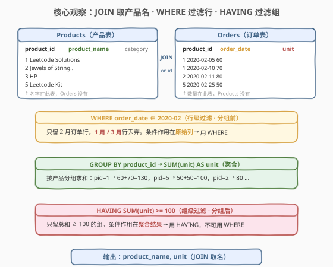
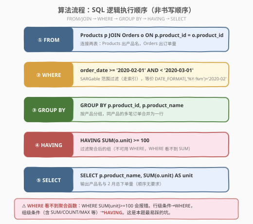
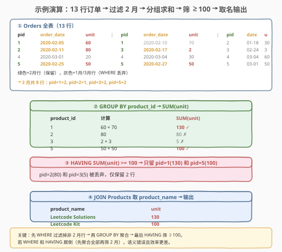

# 列出指定时间段内所有的下单产品

- **题目名称**：列出指定时间段内所有的下单产品
- **链接**：[1327. 列出指定时间段内所有的下单产品](https://leetcode.cn/problems/list-the-products-ordered-in-a-period/)
- **难度**：简单
- **标签**：数据库、SQL、JOIN、WHERE 日期过滤、GROUP BY 聚合、HAVING 组级筛选、SARGable

## 1. 题目概述

给定 `Products` 表（产品信息）和 `Orders` 表（订单记录），要求获取**在 2020 年 2 月份下单数量不少于 100** 的产品的名字和总下单数目。返回结果的顺序无要求。

> ⚠️ 关键点有三：① 产品名在 `Products` 表、下单量在 `Orders` 表，必须 **JOIN** 才能同时拿到两者；② 「2 月份」是**行级条件**（作用在原始 `order_date` 列上），用 `WHERE` 过滤；③ 「不少于 100」是**组级条件**（作用在 `SUM(unit)` 聚合结果上），必须用 `HAVING` 而非 `WHERE`。

**表结构**：

```text
Table: Products
+------------------+---------+
| Column Name      | Type    |
+------------------+---------+
| product_id       | int     |  ← 主键
| product_name     | varchar |  ← 产品名（仅此表有）
| product_category | varchar |
+------------------+---------+

Table: Orders
+---------------+---------+
| Column Name   | Type    |
+---------------+---------+
| product_id    | int     |  ← 外键，指向 Products
| order_date    | date    |  ← 下单日期
| unit          | int     |  ← 下单数量
+---------------+---------+
（可能含重复行）
```

**示例 1**：

```text
输入：
Products 表:
+-------------+-----------------------+------------------+
| product_id  | product_name          | product_category |
+-------------+-----------------------+------------------+
| 1           | Leetcode Solutions    | Book             |
| 2           | Jewels of Stringology | Book             |
| 3           | HP                    | Laptop           |
| 4           | Lenovo                | Laptop           |
| 5           | Leetcode Kit          | T-shirt          |
+-------------+-----------------------+------------------+
Orders 表:
+--------------+--------------+----------+
| product_id   | order_date   | unit     |
+--------------+--------------+----------+
| 1            | 2020-02-05   | 60       |
| 1            | 2020-02-10   | 70       |
| 2            | 2020-01-18   | 30       |
| 2            | 2020-02-11   | 80       |
| 3            | 2020-02-17   | 2        |
| 3            | 2020-02-24   | 3        |
| 4            | 2020-03-01   | 20       |
| 4            | 2020-03-04   | 30       |
| 4            | 2020-03-04   | 60       |
| 5            | 2020-02-25   | 50       |
| 5            | 2020-02-27   | 50       |
| 5            | 2020-03-01   | 50       |
+--------------+--------------+----------+

输出：
+--------------------+---------+
| product_name       | unit    |
+--------------------+---------+
| Leetcode Solutions | 130     |
| Leetcode Kit       | 100     |
+--------------------+---------+
```

**解释**：

| product_id | 2 月下单明细 | SUM(unit) | >= 100? | product_name |
|------------|-------------|-----------|---------|--------------|
| 1 | 60 + 70 | 130 | ✓ | Leetcode Solutions |
| 2 | 80（1 月的 30 不计） | 80 | ✗ | — |
| 3 | 2 + 3 | 5 | ✗ | — |
| 4 | 无 2 月订单 | 0 | ✗ | — |
| 5 | 50 + 50（3 月的 50 不计） | 100 | ✓ | Leetcode Kit |

> 💡 注意 `product_id=4` 在 2 月没有任何订单，`product_id=2` 有一行在 1 月（被过滤），只有 2 月的 80 计入。只有 pid=1(130) 和 pid=5(100) 满足 ≥ 100。

**约束条件**：

- `Orders` 表可能包含重复行（同一产品同一天可有多笔订单）
- 结果顺序无要求
- 输出列名：`product_name`、`unit`（`unit` 为 2 月总下单量）

---

## 2. 解题思路

### 2.1 暴力思路：先全量 JOIN 再筛选

最直觉的写法是把两表 JOIN 起来，然后在结果上做日期过滤和聚合：

```sql
SELECT product_name, unit
FROM (
    SELECT p.product_name, SUM(o.unit) AS unit, o.order_date
    FROM Products p JOIN Orders o ON p.product_id = o.product_id
    GROUP BY p.product_id, p.product_name, o.order_date
) t
WHERE order_date LIKE '2020-02%' AND unit >= 100;
```

这有几个问题：

1. **聚合粒度错误**：`GROUP BY ... o.order_date` 按天分组，`SUM(unit)` 是每天的小计而非 2 月总计，`unit >= 100` 筛的是「某天 >= 100」而非「2 月总计 >= 100」。
2. **WHERE 看不到聚合**：若改为按产品分组，`unit` 是 `SUM` 的别名，标准 SQL 中 `WHERE` 在 `GROUP BY` 之前执行，根本看不到 `SUM(unit)`，会报错。
3. **效率浪费**：先 JOIN 全部订单（含 1 月、3 月）再过滤，白白处理了大量无关行。

> ⚠️ 正确的顺序是：**先 `WHERE` 过滤行（2 月）→ 再 `GROUP BY` 聚合 → 最后 `HAVING` 筛组（≥100）**。这是 SQL 逻辑执行顺序的硬性规定。

### 2.2 核心观察：JOIN 取名 + WHERE 过滤行 + HAVING 过滤组



关键洞察分三点：

**第一点：JOIN 取产品名**。`product_name` 只存在于 `Products` 表，`unit` 只存在于 `Orders` 表。要同时输出两者，必须 `JOIN Products p ON p.product_id = o.product_id` 把名字「带过来」。

**第二点：WHERE 过滤行（分组前）**。「2 月份」是作用在原始 `order_date` 列上的条件，属于**行级过滤**——在 `GROUP BY` 之前把非 2 月的行丢掉。SQL 的逻辑执行顺序是 `FROM/JOIN → WHERE → GROUP BY → HAVING → SELECT`，`WHERE` 在分组前执行，能看到原始列但看不到聚合函数。

**第三点：HAVING 过滤组（分组后）**。「不少于 100」是作用在 `SUM(unit)` 聚合结果上的条件，属于**组级过滤**——在 `GROUP BY` 之后、对每个产品组做判断。`HAVING` 在分组后执行，能看到聚合函数；而 `WHERE` 在分组前执行，看不到 `SUM`，所以聚合条件必须用 `HAVING`。

> 💡 **WHERE vs HAVING 判断口诀**：条件里有没有聚合函数（`SUM`/`COUNT`/`MAX`/`AVG`）？**有 → HAVING**（组级，分组后）；**没有 → WHERE**（行级，分组前）。本题「2 月份」无聚合 → `WHERE`；「≥ 100」含 `SUM` → `HAVING`。

### 2.3 算法流程图



**一条 SQL 的执行流水线**（按逻辑执行顺序，非书写顺序）：

1. **FROM + JOIN**：`Products p JOIN Orders o ON p.product_id = o.product_id`，连接两表，每个订单行带上产品名。
2. **WHERE**：`order_date >= '2020-02-01' AND order_date < '2020-03-01'`，过滤掉非 2 月行（SARGable 写法，可走索引）。
3. **GROUP BY**：`GROUP BY p.product_id, p.product_name`，按产品分组，同产品的多笔 2 月订单合并为一组。
4. **HAVING**：`HAVING SUM(o.unit) >= 100`，丢弃总下单量不足 100 的产品组。
5. **SELECT**：`SELECT p.product_name, SUM(o.unit) AS unit`，输出产品名与 2 月总下单量。

> 💡 **SQL 书写顺序 vs 逻辑执行顺序**：书写时写 `SELECT ... FROM ... WHERE ... GROUP BY ... HAVING ...`，但引擎**先执行 `FROM`/`WHERE` 再 `GROUP BY`/`HAVING` 最后才 `SELECT`**。理解这一点就不会把聚合条件错放到 `WHERE` 里。

### 2.4 示例演算

以示例 1 数据，跟踪「过滤 → 聚合 → 筛选 → 取名」全过程：



**步骤 ①：WHERE 过滤 2 月行**

`Orders` 共 13 行，`WHERE order_date ∈ 2020-02` 后保留 8 行：

| product_id | order_date | unit |
|------------|-----------|------|
| 1 | 2020-02-05 | 60 |
| 1 | 2020-02-10 | 70 |
| 2 | 2020-02-11 | 80 |
| 3 | 2020-02-17 | 2 |
| 3 | 2020-02-24 | 3 |
| 5 | 2020-02-25 | 50 |
| 5 | 2020-02-27 | 50 |

丢弃了 5 行：pid=2 的 1 月行(30)、pid=4 的 3 行(20/30/60)、pid=5 的 3 月行(50)。

**步骤 ②：GROUP BY product_id + SUM(unit)**

| product_id | 计算 | SUM(unit) |
|------------|------|-----------|
| 1 | 60 + 70 | 130 |
| 2 | 80 | 80 |
| 3 | 2 + 3 | 5 |
| 5 | 50 + 50 | 100 |

**步骤 ③：HAVING SUM(unit) >= 100**

| product_id | SUM(unit) | >= 100? |
|------------|-----------|---------|
| 1 | 130 | ✓ 保留 |
| 2 | 80 | ✗ 丢弃 |
| 3 | 5 | ✗ 丢弃 |
| 5 | 100 | ✓ 保留 |

**步骤 ④：JOIN Products 取名 → 输出**

| product_name | unit |
|--------------|------|
| Leetcode Solutions | 130 |
| Leetcode Kit | 100 |

> 💡 **验证**：pid=1 的 2 月总和 130 = 60+70 ✓；pid=5 的 2 月总和 100 = 50+50 ✓；pid=2 虽有 2 月订单但仅 80 < 100 被丢弃 ✓；pid=4 在 2 月无订单，根本不出现在分组结果中 ✓。

---

## 3. 参考代码

### MySQL（解法 A：DATE_FORMAT + 别名 HAVING，最简洁）

```sql
# 1327. 列出指定时间段内所有的下单产品
# 思路：JOIN 取产品名 → WHERE DATE_FORMAT 过滤 2 月行 → GROUP BY 聚合 → HAVING 筛 ≥100
SELECT p.product_name, SUM(o.unit) AS unit
FROM Products p
JOIN Orders o ON p.product_id = o.product_id
WHERE DATE_FORMAT(o.order_date, '%Y-%m') = '2020-02'
GROUP BY p.product_id, p.product_name
HAVING unit >= 100;
```

> 💡 **写法要点**：
> - **`DATE_FORMAT(order_date, '%Y-%m') = '2020-02'`**：MySQL 日期格式化函数，把 `order_date` 转成 `'YYYY-MM'` 字符串再比较。写法直观，自动适配任意月份天数（含闰年 2 月 29 天）。
> - **`HAVING unit >= 100`**：MySQL 允许在 `HAVING` 中直接引用 `SELECT` 里的别名 `unit`（即 `SUM(o.unit)` 的别名）。这是 MySQL 的语法糖，标准 SQL 不支持。
> - **`GROUP BY p.product_id, p.product_name`**：按产品分组。`product_id` 是主键足以唯一确定产品，但一并写上 `product_name` 让语义更清晰（且在 `ONLY_FULL_GROUP_BY` 模式下更安全）。
> - ⚠️ `DATE_FORMAT` 对列套了函数，**无法利用 `order_date` 上的索引**（非 SARGable）。数据量大时应改用解法 B 的范围写法。

### MySQL / PostgreSQL（解法 B：SARGable 范围过滤 + 标准 HAVING，可移植）

```sql
SELECT p.product_name, SUM(o.unit) AS unit
FROM Products p
JOIN Orders o ON p.product_id = o.product_id
WHERE o.order_date >= '2020-02-01' AND o.order_date < '2020-03-01'
GROUP BY p.product_id, p.product_name
HAVING SUM(o.unit) >= 100;
```

> 💡 **写法要点**：
> - **`order_date >= '2020-02-01' AND order_date < '2020-03-01'`**：**SARGable**（Search Argument-able）写法，条件是「列 与 常量」的直接比较，**能走 `order_date` 索引**做范围扫描。`< '2020-03-01'` 用半开区间，无需关心 2 月有 28 还是 29 天。
> - **`HAVING SUM(o.unit) >= 100`**：标准 SQL 写法，直接写聚合表达式而非别名，在 PostgreSQL、SQL Server 等均合法。
> - ⚠️ **不要写 `BETWEEN '2020-02-01' AND '2020-02-29'`**：2020 是闰年（2 月 29 天）所以恰好正确，但若换成非闰年的 2 月（28 天），`'2020-02-29'` 就会漏掉或报错。半开区间 `< 'YYYY-MM+1-01'` 才是万无一失的写法。
> - 性能优于解法 A：能利用索引，适合 `Orders` 表行数较大的生产场景。

### Python（pandas）

```python
import pandas as pd

def list_products(products: pd.DataFrame, orders: pd.DataFrame) -> pd.DataFrame:
    feb = orders[orders['order_date'].dt.strftime('%Y-%m') == '2020-02']
    g = feb.groupby('product_id', as_index=False)['unit'].sum()
    g = g[g['unit'] >= 100]
    result = g.merge(products, on='product_id')
    return result[['product_name', 'unit']]
```

> 💡 **pandas 对照**：
> - `orders['order_date'].dt.strftime('%Y-%m') == '2020-02'` 对应 `WHERE DATE_FORMAT(...) = '2020-02'`——pandas 的 `dt` 访问器做日期格式化。
> - `feb.groupby('product_id')['unit'].sum()` 对应 `GROUP BY product_id + SUM(unit)`。
> - `g[g['unit'] >= 100]` 对应 `HAVING SUM(unit) >= 100`——pandas 里 HAVING 就是普通的布尔索引过滤。
> - `g.merge(products, on='product_id')` 对应 `JOIN Products ON product_id`——先聚合再 JOIN，减少 JOIN 行数（仅 2 行而非 8 行）。
> - ⚠️ 先过滤再聚合再 JOIN：`feb` 只含 2 月行，`g` 只有满足条件的组，最后 `merge` 只 JOIN 这几行，效率最高。

---

## 4. 复杂度分析

| 维度 | 解法 A（DATE_FORMAT） | 解法 B（SARGable 范围） | pandas |
|------|----------------------|------------------------|--------|
| **时间** | $O(n + m)$ | $O(\log n + k + m)$ | $O(n + m)$ |
| **空间** | $O(m)$ | $O(m)$ | $O(n + m)$ |
| **索引利用** | ✗ 非法 SARGable | ✓ 走范围索引 | — |
| **推荐度** | ✓ LeetCode 刷题 | ✓ **生产首选** | ✓ pandas 环境 |

> - $n$ = `Orders` 表行数，$m$ = 不同产品数，$k$ = 2 月订单行数
> - **解法 A**：`DATE_FORMAT` 对列套函数，索引失效，需全表扫描 $O(n)$；聚合后 $O(m)$ 个组。适合 `Orders` 行数不大的刷题场景。
> - **解法 B**：`order_date >= ... AND < ...` 是 SARGable 条件，可在 `order_date` 索引上做范围扫描 $O(\log n + k)$（$k$ 为命中行数），仅扫描 2 月行而非全表。生产环境首选。
> - **索引优化建议**：在 `Orders(product_id, order_date)` 上建复合索引，`WHERE` 用 `order_date` 做范围筛 + `GROUP BY` 用 `product_id` 做聚合，可走索引覆盖扫描。
> - **pandas**：`strftime` 全量计算 $O(n)$，`groupby.sum()` $O(n)$，`merge` $O(k + m)$。先过滤再 JOIN 的写法让 `merge` 只处理满足条件的几行，效率最优。

---

## 5. 扩展：WHERE vs HAVING 与日期过滤范式

### 5.1 WHERE vs HAVING：SQL 最易混淆的一对

`WHERE` 和 `HAVING` 都是过滤，但**执行时机**和**可见对象**不同：

| 维度 | WHERE | HAVING |
|------|-------|--------|
| **执行时机** | `GROUP BY` **之前** | `GROUP BY` **之后** |
| **可见对象** | 原始列（FROM/JOIN 后的行） | 聚合函数 + 分组列 |
| **看不到** | 聚合函数（`SUM`/`COUNT`/`MAX`…） | — |
| **条件类型** | 行级（逐行判断） | 组级（逐组判断） |
| **典型场景** | `WHERE order_date = '2020-02-05'` | `HAVING SUM(unit) >= 100` |

> 💡 **判断口诀**：条件里**有没有聚合函数**？
> - **没有聚合** → `WHERE`（如 `order_date = '...'`、`product_id = 5`）
> - **有聚合** → `HAVING`（如 `SUM(unit) >= 100`、`COUNT(*) > 3`）
>
> 本题完美示范了两者的协作：`WHERE order_date ∈ 2020-02`（行级，无聚合）+ `HAVING SUM(unit) >= 100`（组级，有聚合），各管各的层。

### 5.2 日期过滤的四种写法与 SARGable

「取某月数据」是 SQL 高频需求，常见四种写法，按索引友好度递增：

| 写法 | 示例 | SARGable | 跨方言 | 说明 |
|------|------|----------|--------|------|
| `DATE_FORMAT` | `DATE_FORMAT(d, '%Y-%m') = '2020-02'` | ✗ | MySQL only | 直观但套函数，索引失效 |
| `YEAR + MONTH` | `YEAR(d) = 2020 AND MONTH(d) = 2` | ✗ | MySQL only | 同样套函数，索引失效 |
| `LIKE` | `d LIKE '2020-02%'` | △ 部分 | MySQL/SQLite | 依赖隐式类型转换，不推荐 |
| **范围（半开区间）** | `d >= '2020-02-01' AND d < '2020-03-01'` | ✓ | **全方言** | **首选**，走索引，适配任意月份 |

> ⚠️ **SARGable**（Search Argument-able）指条件能被搜索引擎转化为索引查找。核心原则：**「列 在左、常量 在右、不对列套函数」**。`DATE_FORMAT(d, ...) = '...'` 对列 `d` 套了函数，破坏了索引可用性；`d >= '...' AND d < '...'` 是列与常量的直接比较，索引可用。
>
> **半开区间为何优于 `BETWEEN`？** `BETWEEN '2020-02-01' AND '2020-02-29'` 需知道该月最后一天是 28/29/30/31，换月份就得改。若 `order_date` 是 `DATETIME` 类型（含时间部分），`BETWEEN '2020-02-29'` 还会漏掉 2 月 29 日当天的非零时记录。半开区间 `< '2020-03-01'` 无脑覆盖整月，万无一失。

### 5.3 MySQL 别名在 HAVING 中的语法糖

MySQL 允许在 `HAVING` 和 `ORDER BY` 中引用 `SELECT` 子句定义的别名：

```sql
-- MySQL 语法糖：HAVING 里直接用别名 unit
SELECT p.product_name, SUM(o.unit) AS unit
FROM ... GROUP BY ...
HAVING unit >= 100;

-- 标准 SQL：必须写完整聚合表达式
SELECT p.product_name, SUM(o.unit) AS unit
FROM ... GROUP BY ...
HAVING SUM(o.unit) >= 100;
```

> 💡 这是 MySQL 的**语法糖**（alias forwarding），因为 MySQL 的 `HAVING` 执行时已能访问 `SELECT` 的别名。但标准 SQL（PostgreSQL、SQL Server、Oracle）的 `HAVING` 在 `SELECT` 之前执行，看不到别名，必须写完整聚合表达式。跨方言脚本一律用 `HAVING SUM(o.unit) >= 100` 最安全。

---

## 6. 面试要点

1. **为什么「2 月份」用 `WHERE` 而「≥ 100」用 `HAVING`？**

   > 「2 月份」是作用在原始 `order_date` 列上的**行级条件**，不含聚合函数，在 `GROUP BY` 之前用 `WHERE` 过滤掉非 2 月行。「≥ 100」是作用在 `SUM(unit)` 聚合结果上的**组级条件**，必须在 `GROUP BY` 之后用 `HAVING` 判断。`WHERE` 在分组前执行看不到 `SUM`，把聚合条件写进 `WHERE` 会直接报错。

2. **`DATE_FORMAT(order_date, '%Y-%m') = '2020-02'` 和 `order_date >= '2020-02-01' AND order_date < '2020-03-01'` 有什么区别？**

   > 两者结果相同，但索引行为不同。`DATE_FORMAT` 对列套了函数，是**非 SARGable** 条件，索引失效，走全表扫描。范围写法是列与常量的直接比较，**SARGable**，能走 `order_date` 索引做范围查找。生产环境数据量大时必须用范围写法。另外 `DATE_FORMAT` 是 MySQL 专有函数，范围写法全方言通用。

3. **为什么不用 `BETWEEN '2020-02-01' AND '2020-02-28'`？**

   > 2020 年是闰年，2 月有 29 天，用 `'2020-02-28'` 会漏掉 2 月 29 日的订单。即使用 `'2020-02-29'` 写对了本月，换到非闰年又会出错。更隐蔽的坑：若 `order_date` 是 `DATETIME` 类型（含时分秒），`BETWEEN '2020-02-29'` 实际是 `BETWEEN '2020-02-29 00:00:00' AND '2020-02-29 00:00:00'`，会漏掉当天其余时间。半开区间 `>= '2020-02-01' AND < '2020-03-01'` 一劳永逸。

4. **可以先 JOIN 全部订单再 WHERE 过滤吗？效率和正确性如何？**

   > 正确性没问题——`FROM JOIN` 在 `WHERE` 之前执行，先 JOIN 再 WHERE 过滤行，最终结果一致。但效率更差：先 JOIN 会把全部 13 行（含 1 月、3 月）与 Products 做连接，生成更多中间行后再丢弃。更优写法是让 `WHERE` 先把 2 月行筛出（8 行），再 JOIN 聚合。不过现代优化器通常会做**谓词下推**（predicate pushdown），自动把 `WHERE` 条件推到 JOIN 之前，所以实际执行计划可能相同。但在 pandas 等无优化器的环境，手动先过滤再 JOIN 的差距明显。

5. **`GROUP BY p.product_id, p.product_name` 为什么要把 `product_name` 也写上？**

   > `product_id` 是 `Products` 的主键，已能唯一确定产品，单独 `GROUP BY product_id` 在逻辑上足够。但 MySQL 的 `ONLY_FULL_GROUP_BY` 模式要求 `SELECT` 中的非聚合列必须出现在 `GROUP BY` 中，否则报错。把 `product_name` 一并写上既满足该模式约束，又让 SQL 语义更自文档化。若关闭 `ONLY_FULL_GROUP_BY`，单独 `GROUP BY product_id` 也能跑（MySQL 会从组内任取一行的 `product_name`，因主键唯一故结果正确）。

> 💡 **一句话总结**：1327 是 SQL **「JOIN + WHERE + GROUP BY + HAVING」招牌入门题**——核心考的是 `WHERE`（行级、无聚合、分组前）与 `HAVING`（组级、有聚合、分组后）的区分，以及日期过滤的 SARGable 写法。判断口诀：**条件含聚合 → HAVING，不含 → WHERE；日期过滤 → 半开区间范围最优**。

---

## 7. 同类练习题

- [1164. 指定日期的产品价格](https://leetcode.cn/problems/product-price-at-a-given-date/)（[题解](../1101-1200/1164_指定日期的产品价格.md)）：单表按日期取产品价格 + 缺失日期补默认值，对照 1327 的「日期过滤 + 产品 JOIN」，承接日期条件处理范式
- [511. 游戏玩法分析 I](https://leetcode.cn/problems/game-play-analysis-i/)（[题解](../0501-0600/511_游戏玩法分析I.md)）：`GROUP BY player_id + MIN(event_date)` 每玩家首次登录日期——最简 `GROUP BY + 聚合函数` 入门，承接 1327 的「分组聚合」骨架
- [1251. 平均售价](https://leetcode.cn/problems/average-selling-price/)（🔒）（[题解](../1201-1300/1251_平均售价.md)）：`JOIN + 日期范围相交 + SUM(价格×数量)/SUM(数量)` 加权平均——同属「JOIN 取名 + 日期过滤 + 聚合」家族，分母为加权计数，对照 1327 的简单求和
- [1211. 查询结果的质量和占比](https://leetcode.cn/problems/queries-quality-and-percentage/)（[题解](../1201-1300/1211_查询结果的质量和占比.md)）：`GROUP BY + ROUND(AVG, 2) + SUM(布尔)/COUNT(*)` 条件聚合——同属 `GROUP BY + 聚合` 套路，对照 1327 的 `SUM(unit)` 简单聚合
- [619. 只出现一次的最大数字](https://leetcode.cn/problems/biggest-single-number/)（[题解](../0601-0700/619_只出现一次的最大数字.md)）：`GROUP BY + HAVING COUNT(*) = 1 + MAX` 筛选唯一数字——同属 `GROUP BY + HAVING` 组级过滤，对照 1327 的 `HAVING SUM >= 100`
