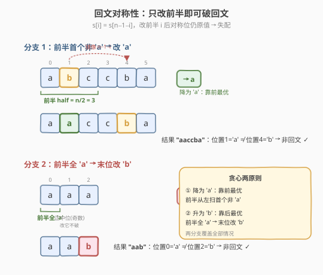
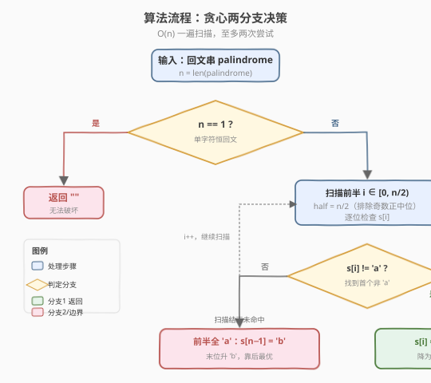
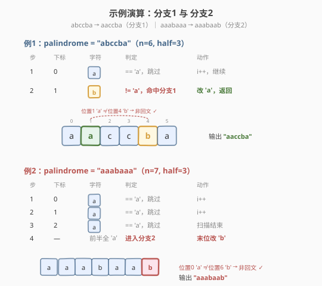

# 破坏回文串

- **题目名称**：破坏回文串
- **链接**：[1328. 破坏回文串](https://leetcode.cn/problems/break-a-palindrome/)
- **难度**：中等
- **标签**：贪心、字符串、回文

## 1. 题目概述

给定一个由**小写英文字母**组成的**回文串** `palindrome`，要求将其中的**恰好一个**字符替换为任意小写字母，使得结果字符串：

1. **不是回文串**；
2. 在所有满足条件 1 的结果中**字典序最小**。

若无法做到则返回空串 `""`。

**示例 1**：

```text
输入：palindrome = "abccba"
输出："aaccba"
解释：把第 2 个字符 'b' 改成 'a' 得 "aaccba"，非回文且字典序最小。
      其他改法如 "zbccba"、"abcaba" 字典序都更大。
```

**示例 2**：

```text
输入：palindrome = "a"
输出：""
解释：长度为 1 的串任意改一个字符后仍是回文（单字符恒回文），无法破坏。
```

**约束条件**：

- `1 <= palindrome.length <= 1000`
- `palindrome` 只包含小写英文字母
- 输入保证是回文串

> 💡 本题的核心是**贪心**：要让字典序最小，就应尽早把字符改小（改成 `'a'`）；若实在改不小（前半全为 `'a'`），则把改动推迟到**最末位**、且只抬高到 `'b'`，使字典序增量最小。

---

## 2. 解题思路

### 2.1 暴力思路：枚举位置与替换字母

对长度为 $n$ 的串，枚举**改哪个位置**（$n$ 种）与**改成哪个字母**（$26$ 种），共 $26n$ 种候选；对每个候选检查是否回文，在所有非回文候选中取字典序最小者。

```text
for i in 0..n-1:
    for c in 'a'..'z':
        if c != s[i]:                      # 必须真改一个字符
            t = s[:i] + c + s[i+1:]
            if not is_palindrome(t):
                ans = min(ans, t)          # 字典序取最小
```

时间 $O(26n \cdot n) = O(n^2)$，`n=1000` 时约 $2.6\times10^7$ 次比较，勉强可过但远未利用「输入是回文」这一性质。问题在于大量候选显然不优——例如把靠前字符改成比原值更大的字母，字典序只会变大，不可能最优。

### 2.2 核心观察：贪心——前半找首个非 'a'，否则末位改 'b'



利用回文串的**对称性**，可以把 $26n$ 个候选压缩到**至多两个**有效改动。

**观察 1：只改前半（或末位）即可破坏回文。**

回文满足 $s[i] = s[n\!-\!1\!-\!i]$。若把**前半**某位置 $i$（$i < n/2$）改成与原值不同的字母，则 $s[i] \ne s[n\!-\!1\!-\!i]$（对称位仍保留原值），回文被打破。改后半等价于改前半的对称位，故只考虑前半即可覆盖所有「能打破回文」的改动。

> ⚠️ **奇数长度的正中位不能改**：当 $n$ 为奇数，下标 $n/2$ 是正中位，它与自己对称（$s[n/2] = s[n\!-\!1\!-\!n/2]$），改它后仍自对称，回文**不破**。故只扫前半 $i \in [0, n/2)$。

**观察 2：字典序最小 ⟹ 尽量把靠前字符改成 'a'。**

字典序由**第一个不同位置**决定。要让结果尽量小，应让最早出现差异的位置上的字符尽量小——最小字母是 `'a'`。于是**从左到右扫前半，遇到首个非 `'a'` 字符就改成 `'a'`**：

- 该位置 $i$ 原值 $> $ `'a'`，改成 `'a'` 后比原串在该位更小 → 字典序严格更小；
- 对称位 $n\!-\!1\!-\!i$ 仍是原值（$> $ `'a'`），与 $s[i]= $ `'a'` 不等 → 回文被打破；
- 比它更靠前的位置都已是 `'a'`（无法更小），所以这是字典序最小的破坏方案。

**观察 3：前半全为 'a' 时，末位改 'b'。**

若前半每个字符都是 `'a'`，由回文对称性**整个串全为 `'a'`**（后半也全 `'a'`，奇数长度的正中位也是 `'a'`）。此时没有任何位置能改得更小，必须把某字符**抬高**。为使字典序增量最小：

- 抬高**越靠后**的位置，对字典序影响越小；
- 抬高幅度尽量小：`'a'` → `'b'`（只加 1）。

故把**最后一个字符**改成 `'b'`：末位 $s[n\!-\!1]$ 变 `'b'`，其对称位 $s[0]$ 仍 `'a'`，回文被打破；且这是所有合法改动中字典序最小的（改任何更靠前位置都会让更早位变大，字典序更大）。

> 💡 **为何不改正中位？** 奇数长度全 `'a'` 串（如 `"aba"`，正中位 `'b'`？不——前半全 `'a'` 意味着正中位也是 `'a'`，即 `"aaa"`）。改正中位不破回文；改末位才破。对全 `'a'` 串 `"aaa"`，末位改 `'b'` 得 `"aab"`，非回文且字典序最小。

**边界**：$n = 1$ 时单字符恒回文，无法破坏，返回 `""`。

### 2.3 算法流程图



**完整步骤**：

1. **长度判定**：若 $n = 1$，返回 `""`。
2. **前半扫描**：令 `half = n / 2`（整数除法，自然排除奇数正中位），从 $i = 0$ 到 $i < \text{half}$：
   - 若 `s[i] != 'a'`：把 `s[i]` 改为 `'a'`，返回结果。
3. **兜底**：前半全 `'a'`，把 `s[n-1]` 改为 `'b'`，返回结果。

> 💡 **正确性归纳**：分支 2 命中时，得到「前半首个非 `'a'` 位降为 `'a'`」的最优解；分支 2 未命中（前半全 `'a'`）时，分支 3 给出「末位升为 `'b'`」的最优解。两分支覆盖所有情况，且各自是该情况下的字典序最小合法解，故全局最优。

### 2.4 示例演算

以 `palindrome = "abccba"` 为例（$n = 6$，`half = 3`）：



| 步 | 下标 $i$ | 字符 | 判定 | 动作 |
|----|---------|------|------|------|
| 1 | 0 | `'a'` | 等于 `'a'`，跳过 | 继续扫描 |
| 2 | 1 | `'b'` | **非 `'a'`，命中分支 2** | 改为 `'a'`，返回 `"aaccba"` |

结果 `"aaccba"`：位置 1 = `'a'`，对称位 4 = `'c'`，不等 → 非回文 ✓；前缀 `"aa"` 比原串 `"ab"` 更小 → 字典序最小 ✓。

**兜底分支示例** `palindrome = "aaabaaa"`（$n = 7$，`half = 3`，前半 `"aaa"` 全 `'a'`）：

| 步 | 下标 $i$ | 字符 | 判定 | 动作 |
|----|---------|------|------|------|
| 1 | 0 | `'a'` | 等于 `'a'`，跳过 | 继续 |
| 2 | 1 | `'a'` | 等于 `'a'`，跳过 | 继续 |
| 3 | 2 | `'a'` | 等于 `'a'`，跳过 | 扫描结束，进分支 3 |
| 4 | — | — | 前半全 `'a'` | 末位 `s[6]` 改 `'b'` → `"aaabaab"` |

结果 `"aaabaab"`：位置 6 = `'b'`，对称位 0 = `'a'`，不等 → 非回文 ✓；改动在最末位，字典序增量最小 ✓。

---

## 3. 参考代码

### C++

```cpp
// 破坏回文串.cpp —— 贪心：前半首个非 'a' 改 'a'，否则末位改 'b'
// 编译: g++ -O2 -std=c++17 破坏回文串.cpp -o breakpal
class Solution {
public:
    string breakPalindrome(string palindrome) {
        int n = palindrome.size();
        if (n == 1) return "";                       // 单字符恒回文，无法破坏
        int half = n / 2;                            // 前半长度（奇数时排除正中位）
        for (int i = 0; i < half; ++i) {
            if (palindrome[i] != 'a') {              // 前半首个非 'a'
                palindrome[i] = 'a';                 // 降为 'a'，字典序最小且破回文
                return palindrome;
            }
        }
        palindrome[n - 1] = 'b';                     // 前半全 'a'：末位升 'b'
        return palindrome;
    }
};
```

### Python

```python
class Solution:
    def breakPalindrome(self, palindrome: str) -> str:
        n = len(palindrome)
        if n == 1:
            return ""                                # 单字符恒回文，无法破坏
        half = n // 2                                # 前半长度（奇数时排除正中位）
        for i in range(half):
            if palindrome[i] != 'a':                 # 前半首个非 'a'
                return palindrome[:i] + 'a' + palindrome[i + 1:]  # 降为 'a'
        return palindrome[:-1] + 'b'                 # 前半全 'a'：末位升 'b'
```

> 💡 **实现细节**：① `half = n / 2`（整数除法）天然排除奇数正中位——奇数 $n$ 的正中位下标恰为 $n/2$，不在 $[0, n/2)$ 内。② 只扫前半，由回文对称性知前半全 `'a'` 则全串全 `'a'`，无需再查后半。③ Python 用切片 `s[:i] + 'a' + s[i+1:]` 构造新串，避免 `list` 转换；末位改 `'b'` 用 `s[:-1] + 'b'`。④ C++ 直接原位修改 `string`，$O(1)$ 额外空间。

---

## 4. 复杂度分析

| 维度 | 复杂度 | 说明 |
|------|--------|------|
| **时间** | $O(n)$ | 至多扫描前半 $n/2$ 个字符，找到首个非 `'a'` 即停；最坏（全 `'a'`）扫完前半后末位改 `'b'`，仍 $O(n)$ |
| **空间** | $O(1)$ 额外 / $O(n)$ 输出 | C++ 原位修改仅 $O(1)$ 额外空间；Python 切片构造新串 $O(n)$ 输出空间（不计则 $O(1)$） |
| **候选数** | 至多 2 | 贪心把 $26n$ 个候选压缩为「前半首个非 `'a'` 位改 `'a'`」与「末位改 `'b'`」二选一 |

> ⚠️ 暴力法 $O(26n^2)$ 在 `n=1000` 时约 $2.6\times10^7$ 次比较虽能过，但贪心法 $O(n)$ 更优且更清晰——关键在于利用回文对称性把「改后半」归约为「改前半」，再把「改成任意字母」归约为「改成 `'a'` 或末位 `'b'`」。

---

## 5. 扩展：为何改前半等价于改后半

回文串中，前半位置 $i$ 与后半位置 $n\!-\!1\!-\!i$ 是**镜像对**，二者字符相同。把 $i$ 改成 $c$ 与把 $n\!-\!1\!-\!i$ 改成 $c$ 都能使这一对失配（从而破回文），但：

- 改前半 $i$：结果在下标 $i$ 处变化，$i$ 较小 → 对字典序影响**更早**；
- 改后半 $n\!-\!1\!-\!i$：结果在下标 $n\!-\!1\!-\!i$ 处变化，位置更大 → 对字典序影响**更晚**。

若改动是「降为 `'a'`」（让字符变小），显然改**越靠前**的位置字典序收益越大 → 改前半更优。若改动是「升为 `'b'`」（让字符变大），则改**越靠后**的位置字典序损失越小 → 此时前半全 `'a'` 无法降，只能升，于是改**最末位** $n\!-\!1$（最靠后）。

$$
\underbrace{\text{降为 'a'：靠前最优}}_{\text{前半扫描}} \qquad \underbrace{\text{升为 'b'：靠后最优}}_{\text{末位兜底}}
$$

这解释了算法为何「前半从左扫找非 `'a'`」而「兜底改最末位」——两种改动方向各自对应字典序极值化的位置选择。

---

## 6. 面试要点

1. **为什么要只扫描前半？**

   > 回文对称性使 $s[i] = s[n\!-\!1\!-\!i]$。改前半位置 $i$ 后，对称位 $n\!-\!1\!-\!i$ 仍为原值，二者失配即破回文。改后半位置等价于改其前半镜像位，故只扫前半即可覆盖所有有效改动。且改前半对字典序影响更早，降值时更优。

2. **为什么奇数长度的正中位不能改？**

   > 正中位下标 $n/2$ 满足 $n\!-\!1\!-\!n/2 = n/2$，即它与自身对称。改它后仍满足 $s[n/2] = s[n/2]$，回文不破。用 `half = n/2`（整数除法）让扫描范围 $[0, n/2)$ 自然排除正中位。

3. **前半全是 'a' 时为什么改末位为 'b'？**

   > 前半全 `'a'` ⇒ 由对称性全串全 `'a'`。无法把任何字符降得更小，必须抬高某字符。抬高越靠后位置字典序损失越小，抬高 `'a'→'b'` 幅度最小，故改最末位为 `'b'`。结果末位 `'b'` 与首位 `'a'` 失配，回文被破。

4. **长度为 1 为什么返回空串？**

   > 单字符串任意改一个字符后仍是长度 1 的串，而长度 1 的串恒为回文（$s[0]=s[0]$），无法破坏，故返回 `""`。

5. **时间空间复杂度？**

   > 时间 $O(n)$：至多扫前半 $n/2$ 个字符。空间 C++ 原位修改 $O(1)$ 额外，Python 切片 $O(n)$ 输出。贪心把 $26n$ 候选压到至多 2 次尝试。

> 💡 **一句话总结**：1328 是「利用回文对称性做贪心」的招牌——前半从左找首个非 `'a'` 降为 `'a'`（降值靠前最优），找不到则末位升 `'b'`（升值靠后最优），两分支覆盖所有情况，$O(n)$ 一遍扫描即得字典序最小的非回文结果。

---

## 7. 同类练习题

- [680. 验证回文串 II](https://leetcode.cn/problems/valid-palindrome-ii/)：本题的**反向操作**——删除至多一个字符使串**成为**回文，同为「回文 + 单点改动 + 贪心/双指针」，对照体会破坏与修复的对称性
- [9. 回文数](https://leetcode.cn/problems/palindrome-number/)（[题解](../0001-0100/9_回文数.md)）：回文判定的基础题，反转一半数字，是所有回文类问题的判等基石
- [5. 最长回文子串](https://leetcode.cn/problems/longest-palindromic-substring/)（[题解](../0001-0100/5_最长回文子串.md)）：回文构造经典，中心扩展法，与本题共享「回文对称中心」的直觉
- [1312. 让字符串成为回文串的最少插入次数](https://leetcode.cn/problems/minimum-insertion-steps-to-make-a-string-palindrome/)（[题解](./1312_让字符串成为回文串的最少插入次数.md)）：回文构造的区间 DP，与本题「破坏回文」相反——求最少插入使其成为回文，同目录可对照阅读
- [266. 回文排列](https://leetcode.cn/problems/palindrome-permutation/)：判定字符能否重排为回文（奇数次字符至多 1 个），从「排列层面」理解回文的字符频次约束
