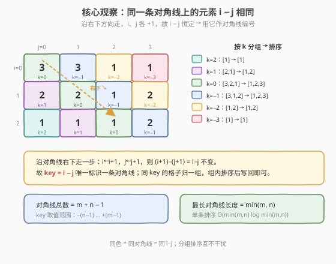
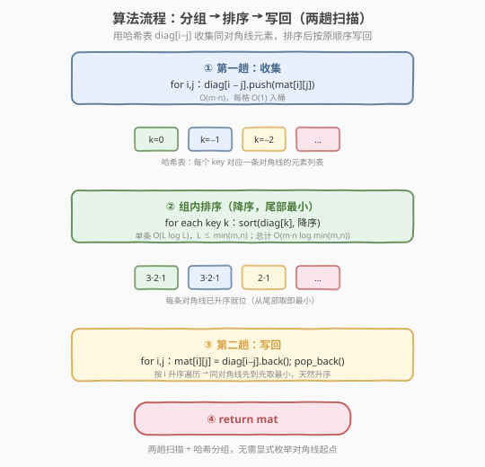
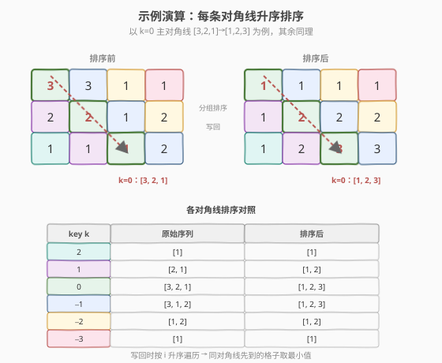

# LeetCode 将矩阵按对角线排序 题解

## 1. 题目概述

- **标题 / 题号**：将矩阵按对角线排序（#1329，medium）
- **链接**：https://leetcode.cn/problems/sort-the-matrix-diagonally/
- **难度**：中等
- **标签**：数组、排序、哈希表

**题意**：**矩阵对角线**是一条从最上面行或最左侧列的某个元素开始、沿**右下方向**一直到矩阵末尾的元素序列。例如从 `mat[2][0]` 出发的对角线会经过 `mat[2][0]`、`mat[3][1]`、`mat[4][2]` …。

给定一个 $m \times n$ 的整数矩阵 `mat`，请把**同一条矩阵对角线**上的元素按**升序**排序，返回排好序的矩阵。

**示例 1**：

```text
输入：mat = [[3,3,1,1],[2,2,1,2],[1,1,1,2]]
输出：[[1,1,1,1],[1,2,2,2],[1,2,3,3]]
```

**示例 2**：

```text
输入：mat = [[11,25,66,1,69,7],[23,55,17,45,15,52],[75,31,36,44,58,8],[22,27,33,25,68,4],[84,28,14,11,5,50]]
输出：[[5,17,4,1,52,7],[11,11,25,45,8,69],[14,23,25,44,58,15],[22,27,31,36,50,66],[84,28,75,33,55,68]]
```

**约束**：

- $m = \text{mat.length}$，$n = \text{mat}[i].\text{length}$
- $1 \le m, n \le 100$
- $1 \le \text{mat}[i][j] \le 100$

> 💡 本题的关键在于一个**坐标恒等式**：沿对角线右下走时行、列下标同步 $+1$，因此同一条对角线上所有格子的 $i - j$ 取值恒定。用它作为对角线编号，就能用一次哈希分组把「逐条抽取对角线」的过程统一处理掉。

## 2. 解题思路

### 2.1 暴力思路：逐条抽取对角线排序

最直观的做法是**枚举每条对角线的起点**——共 $m + n - 1$ 条，起点位于第一行（`mat[0][j]`，$j = 0 \dots n-1$）与第一列（`mat[i][0]`，$i = 1 \dots m-1$）。对每个起点，沿右下方向把对角线元素收集进一个数组，排序后**按原顺序写回**。

```text
for each start cell (r, c) in 顶行 ∪ 左列:
    collect mat[r+k][c+k] into v       # k = 0,1,… 直到越界
    sort(v)
    write v back to mat[r+k][c+k]
```

这样做正确，但「某格属于哪条对角线」靠**循环结构**隐式表达，每条对角线都要单独走一遍索引控制。时间 $O\bigl(m\cdot n \cdot \log \min(m,n)\bigr)$（所有对角线长度之和为 $m\cdot n$，单条排序 $\le \log \min(m,n)$），空间 $O\bigl(\min(m,n)\bigr)$。复杂度其实已经达标，但代码稍繁琐、且没有把「分组」与「排序」解耦。

### 2.2 核心观察：对角线键 $i - j$



**关键观察**：沿对角线向右下走一步，行号 $i \to i+1$、列号 $j \to j+1$，于是

$$
(i+1) - (j+1) = i - j
$$

**不变**。所以**同一条对角线上的所有格子共享同一个 $i - j$**，这个差值就成了对角线的天然编号。

- 对角线总数 $= m + n - 1$，键的取值范围为 $-(n-1) \dots +(m-1)$。
- 最长对角线长度 $= \min(m, n)$。

**做法**：用一张哈希表 `diag`，键为 $i - j$、值为该对角线的元素列表。

1. **第一趟扫描**：遍历每个格子，`diag[i - j].push(mat[i][j])`，把同对角线元素收进同一个桶。
2. **桶内排序**：对每个桶升序排序（实现上可降序排列，尾部即最小，方便 `pop_back` 写回）。
3. **第二趟扫描**：再次按行优先遍历，`mat[i][j] = diag[i - j].back()` 后 `pop_back()`。

> 💡 **为什么写回时按行优先遍历是对的？** 对固定的键 $k = i - j$，行优先遍历会**按 $i$ 从小到大**依次访问该对角线的格子——也就是从**最靠上的格子**开始。降序排列后尾部是最小值，`pop_back` 先取出最小值写入最靠上的格子，恰好满足「升序」要求。无需为每条对角线单独维护下标。

> ⚠️ **不要用 $i + j$ 作键**。$i + j$ 标识的是**反对角线**（左下→右上方向），与本题「右下方向」对角线相反。记住：右下方向 $i, j$ 同步增 → 差 $i - j$ 不变；右上方向 $i$ 增 $j$ 减 → 和 $i + j$ 不变。

### 2.3 算法流程图



**完整步骤**：

1. **初始化**哈希表 `diag`（键 `int`，值 `vector<int>`）。
2. **第一趟**：双重循环遍历 `i, j`，`diag[i - j].push_back(mat[i][j])`。
3. **排序**：对哈希表每个值数组执行 `sort(降序)`。
4. **第二趟**：双重循环遍历 `i, j`，`mat[i][j] = diag[i - j].back()`，再 `pop_back()`。
5. **返回** `mat`。

> 💡 也可用**小根堆**（C++ `priority_queue` 配 `greater`，Python `heapq`）替代排序：入桶即 `push`，写回即 `top`/`heappop`。复杂度同阶，但常数略大；排序版本更直观，下文代码采用排序 + `pop_back`。

### 2.4 示例演算

以 `mat = [[3,3,1,1],[2,2,1,2],[1,1,1,2]]`（$m=3, n=4$）为例，主对角线 $k=0$ 上是 `[3, 2, 1]`，排序后变 `[1, 2, 3]`：



各对角线的分组与排序结果：

| key $k$ | 原始序列 | 排序后 | 写回位置（按 $i$ 升序） |
|---------|----------|--------|------------------------|
| $2$ | `[1]` | `[1]` | (2,0) |
| $1$ | `[2, 1]` | `[1, 2]` | (1,0)→1, (2,1)→2 |
| $0$ | `[3, 2, 1]` | `[1, 2, 3]` | (0,0)→1, (1,1)→2, (2,2)→3 |
| $-1$ | `[3, 1, 2]` | `[1, 2, 3]` | (0,1)→1, (1,2)→2, (2,3)→3 |
| $-2$ | `[1, 2]` | `[1, 2]` | (0,2)→1, (1,3)→2 |
| $-3$ | `[1]` | `[1]` | (0,3) |

写回后矩阵为：

```text
[[1,1,1,1],
 [1,2,2,2],
 [1,2,3,3]]
```

与示例 1 期望输出一致。注意 $k=-1$ 这条对角线原始序列 `[3,1,2]` 并非有序，排序后才得 `[1,2,3]`——这正是「逐条排序」的用武之地。

## 3. 参考代码

### C++

```cpp
// 将矩阵按对角线排序.cpp —— 哈希分组 + 排序写回
// 编译: g++ -O2 -std=c++17 将矩阵按对角线排序.cpp -o diagsort
class Solution {
public:
    vector<vector<int>> diagonalSort(vector<vector<int>>& mat) {
        int m = mat.size(), n = mat[0].size();
        unordered_map<int, vector<int>> diag;
        // 第一趟：按 i - j 分桶
        for (int i = 0; i < m; ++i)
            for (int j = 0; j < n; ++j)
                diag[i - j].push_back(mat[i][j]);
        // 每条对角线降序排序，尾部即最小，pop_back 依序写回
        for (auto& [k, v] : diag)
            sort(v.begin(), v.end(), greater<int>());
        // 第二趟：按行优先遍历写回（同对角线先到先取最小）
        for (int i = 0; i < m; ++i)
            for (int j = 0; j < n; ++j) {
                auto& v = diag[i - j];
                mat[i][j] = v.back();
                v.pop_back();
            }
        return mat;
    }
};
```

### Python

```python
class Solution:
    def diagonalSort(self, mat: List[List[int]]) -> List[List[int]]:
        m, n = len(mat), len(mat[0])
        diag = {}
        # 第一趟：按 i - j 分桶
        for i in range(m):
            for j in range(n):
                diag.setdefault(i - j, []).append(mat[i][j])
        # 每条对角线降序排序，尾部即最小，pop 写回
        for v in diag.values():
            v.sort(reverse=True)
        # 第二趟：按行优先遍历写回（同对角线先到先取最小）
        for i in range(m):
            for j in range(n):
                mat[i][j] = diag[i - j].pop()
        return mat
```

> 💡 **实现细节**：① 用 `unordered_map` / `dict` 的键 `i - j` 自动区分 $m + n - 1$ 条对角线，无需预处理起点。② 降序排序后从尾部 `pop` 最小值，配合「行优先遍历先访问靠上格子」的事实，自然满足升序。③ 原地写回 `mat`，不额外分配结果矩阵。④ 用小根堆替换排序亦可，但排序版本常数更小、代码更短。

## 4. 复杂度分析

| 维度 | 复杂度 | 说明 |
|------|--------|------|
| **时间** | $O\bigl(m \cdot n \cdot \log \min(m, n)\bigr)$ | 所有对角线长度之和为 $m \cdot n$；单条最长 $\min(m, n)$，排序耗时 $\log \min(m, n)$；两趟扫描各 $O(m \cdot n)$ |
| **空间** | $O(m \cdot n)$ | 哈希表存下全部元素（桶的总容量 $= m \cdot n$）；若允许破坏原矩阵可视为额外 $O(\min(m,n))$（单条对角线缓冲） |
| **对角线数** | $m + n - 1$ | 键 $i - j$ 取值 $-(n-1) \dots +(m-1)$ |

> ⚠️ 严格地，哈希表存了 $m \cdot n$ 个元素，故空间为 $O(m \cdot n)$ 而非 $O(\min(m,n))$。若追求 $O(\min(m,n))$ 额外空间，可退回 2.1 的「逐条抽取」写法——每条对角线单独缓冲。本题 $m, n \le 100$，$m \cdot n \le 10^4$，哈希表方案完全可接受。

## 5. 扩展：计数排序优化到 $O(m \cdot n)$

题目约束 $1 \le \text{mat}[i][j] \le 100$，元素值域很小。每条对角线排序可用**计数排序**做到线性，整体时间降为 $O(m \cdot n)$：

```cpp
class Solution {
public:
    vector<vector<int>> diagonalSort(vector<vector<int>>& mat) {
        int m = mat.size(), n = mat[0].size();
        unordered_map<int, array<int, 101>> cnt;      // 值域 1..100
        for (int i = 0; i < m; ++i)
            for (int j = 0; j < n; ++j)
                cnt[i - j][mat[i][j]]++;              // 入桶计数
        for (int i = 0; i < m; ++i)
            for (int j = 0; j < n; ++j) {
                auto& c = cnt[i - j];
                int v = 1;
                while (c[v] == 0) ++v;                // 找最小可用值
                mat[i][j] = v;
                c[v]--;
            }
        return mat;
    }
};
```

**要点**：

- `array<int, 101>` 在 `unordered_map` 中按构造零初始化，省去手动清空。
- 写回时对每条对角线**从最小值 $1$ 起扫**，跳过计数为 $0$ 的值；由于行优先遍历保证同对角线先访问靠上格子，先取的即为最小，与升序一致。
- 时间 $O(m \cdot n + (m+n) \cdot 100) = O(m \cdot n)$（值域 $100$ 视作常数）；空间 $O\bigl((m+n) \cdot 100\bigr) = O(m + n)$。

> 💡 **何时用计数排序？** 当值域远小于元素个数时收益明显。本题值域 $100$、元素数 $\le 10^4$，计数排序把 $\log$ 因子省掉；但若值域很大（如 $10^9$），仍应回到比较排序。这是「**值域小 → 非比较排序**」套路的应用，与 [56. 合并区间](https://leetcode.cn/problems/merge-intervals/) 中按值建桶、[740. 删除并获得点数](https://leetcode.cn/problems/delete-and-earn/) 按值域做打家劫舍同源。

## 6. 面试要点

1. **为什么用 $i - j$ 作为对角线编号？**

   > 沿右下方向走一步，$i \to i+1$ 且 $j \to j+1$，差值 $i - j$ 不变；不同对角线的起点 $(i, j)$ 不同，$i - j$ 也不同。因此 $i - j$ 唯一标识一条右下方向的对角线。注意反对角线（左下→右上）的对应不变量是 $i + j$，二者不要混淆。

2. **写回时为什么按行优先遍历就能保证升序？**

   > 对固定键 $k = i - j$，行优先遍历会按 $i$ 从小到大依次访问该对角线的格子，即从最靠上的开始。降序排列后尾部是最小值，`pop_back` 先取最小写入最靠上的格子，其余依次取更大值——天然升序。无需为每条对角线单独维护写入下标。

3. **为什么降序排序 + `pop_back`，而不是升序 + 头部取？**

   > `pop_back` 是 $O(1)$，而从 `vector` 头部取需 `erase` 是 $O(n)$。降序排序让最小值落在尾部，配合 $O(1)$ 的 `pop_back` 写回，整体写回阶段严格 $O(m \cdot n)$。Python 的 `list.pop()` 默认弹尾部，同理。若用 `deque` 的 `popleft` 则可升序存储，但常数更大。

4. **时间空间复杂度？能否优化？**

   > 时间 $O(m \cdot n \log \min(m, n))$，空间 $O(m \cdot n)$（哈希表存全量元素）。利用 $1 \le \text{mat}[i][j] \le 100$ 的小值域，可换计数排序把时间降到 $O(m \cdot n)$、空间降到 $O(m + n)$（见第 5 节）。若硬性要求 $O(\min(m,n))$ 额外空间，则退回「逐条抽取」写法，每条对角线单独缓冲。

5. **哈希表 vs 小根堆，两种实现如何选？**

   > 哈希表 + 一次性排序：每条对角线排序一次，写回 $O(1)$ 取值，常数小、代码短。小根堆（`priority_queue`/`heapq`）：入桶即 `push`，写回 `top`/`heappop` 为 $O(\log L)$，整体仍 $O(m \cdot n \log \min(m,n))$ 但常数略大。面试中两种都行，排序版本更易写对；若要求「在线」逐个插入则堆更自然。

> 💡 **一句话总结**：1329 的题眼是「$i - j$ 标识对角线」这一坐标恒等式——用它作哈希键一次分组，把「逐条抽取对角线」的繁琐索引控制简化为两趟朴素双重循环；降序排序 + `pop_back` 借行优先遍历的天然顺序实现升序写回。值域小时还能升级为计数排序做到线性。

## 同类练习题

| # | 题目 | 与本题的关联 |
|---|------|-------------|
| — | [面试题 01.08. 零矩阵](https://leetcode.cn/problems/zero-matrix-lcci/) | 同样遍历矩阵做标记，体会「坐标规律简化双重循环」的思路（用行/列标记数组记录清零位置） |
| 73 | [矩阵置零](https://leetcode.cn/problems/set-matrix-zeroes/) | 矩阵原地操作经典，用首行首列做标记数组把空间压到 $O(1)$，与本题「就地写回」同属矩阵原地变换 |
| 378 | [有序矩阵中第 K 小的元素](https://leetcode.cn/problems/kth-smallest-element-in-a-sorted-matrix/)（[题解](../0301-0400/378_有序矩阵中第K小的元素.md)） | 矩阵 + 对角线/行列单调性，二分值域或归并；体会矩阵中「行列/对角线方向上的单调性」如何被利用 |
| 498 | [对角线遍历](https://leetcode.cn/problems/diagonal-traverse/) | 同样基于 $i + j$ 标识反对角线，但要求按之字形方向遍历输出，与本题「$i - j$ 分组」对照，区分两种对角线方向的键 |
| 740 | [删除并获得点数](https://leetcode.cn/problems/delete-and-earn/)（[题解](../0701-0800/740_删除并获得点数.md)） | 值域小（$1 \dots 10^4$）时按值建桶再 DP，与本题第 5 节计数排序同为「值域小 → 非比较排序/值域建表」套路 |
