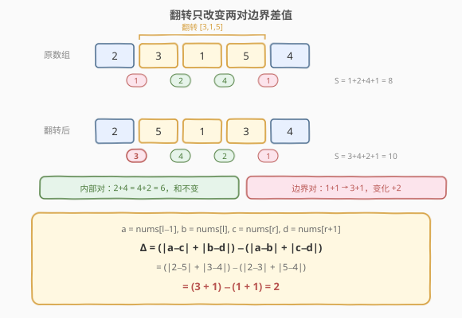
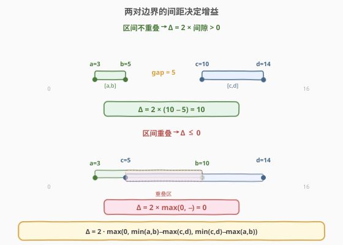
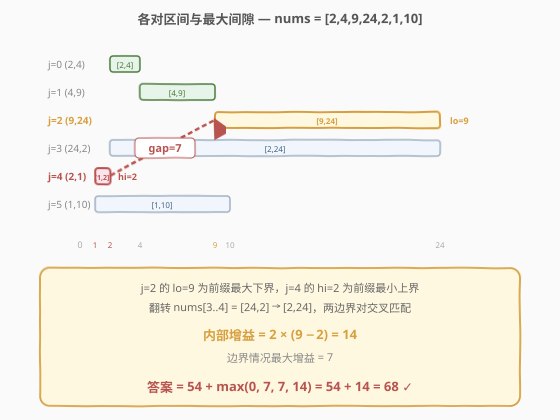

# 翻转子数组得到最大的数组值

- **题目名称**：翻转子数组得到最大的数组值
- **链接**：[1330. 翻转子数组得到最大的数组值](https://leetcode.cn/problems/reverse-subarray-to-maximize-array-value/)
- **难度**：困难
- **标签**：数组、数学、贪心

## 1. 题目概述

给你一个整数数组 `nums`。「数组值」定义为所有满足 $0 \le i < \text{nums.length} - 1$ 的 $|\text{nums}[i] - \text{nums}[i+1]|$ 的和。你可以选择任意子数组翻转一次，求可行的最大数组值。

**示例 1**：

```text
输入：nums = [2,3,1,5,4]
输出：10
解释：翻转 [3,1,5]，数组变为 [2,5,1,3,4]，数组值为 |2-5|+|5-1|+|1-3|+|3-4| = 3+4+2+1 = 10。
```

**示例 2**：

```text
输入：nums = [2,4,9,24,2,1,10]
输出：68
```

**约束条件**：

- $2 \le \text{nums.length} \le 3 \times 10^4$
- $-10^5 \le \text{nums}[i] \le 10^5$
- 答案保证在 32 位整数范围内

> 💡 **关键洞察**：翻转一个子数组 `nums[l..r]` 时，内部相邻对的差值之和不变（只是顺序颠倒），只有左右两个**边界对**发生改变。问题从「枚举所有子数组」降维到「最大化两对边界差值的变化量」。

---

## 2. 解题思路

### 2.1 暴力思路

枚举所有 $O(n^2)$ 个子数组 `[l, r]`，对每个子数组模拟翻转并重新计算数组值，取最大值。每次计算 $O(n)$，总复杂度 $O(n^3)$，在 $n = 3 \times 10^4$ 时完全不可行。

即使优化到「只计算变化的两对边界」，仍需 $O(n^2)$ 枚举所有 $(l, r)$ 对，依然超时。需要进一步化简增益公式，将 $O(n^2)$ 降为 $O(n)$。

### 2.2 核心观察：翻转只影响两对边界



设原数组值为 $S$，翻转子数组 `nums[l..r]` 后，只有以下两对边界差值改变：

| 位置 | 翻转前 | 翻转后 |
|------|--------|--------|
| 左边界（若 $l > 0$） | $|\text{nums}[l-1] - \text{nums}[l]|$ | $|\text{nums}[l-1] - \text{nums}[r]|$ |
| 右边界（若 $r < n-1$） | $|\text{nums}[r] - \text{nums}[r+1]|$ | $|\text{nums}[l] - \text{nums}[r+1]|$ |
| 内部（$l \le i < r$） | $|\text{nums}[i] - \text{nums}[i+1]|$ | 不变（顺序颠倒，和相同） |

因此增益为：

$$\Delta = \big(|a - c| + |b - d|\big) - \big(|a - b| + |c - d|\big)$$

其中 $a = \text{nums}[l-1],\ b = \text{nums}[l],\ c = \text{nums}[r],\ d = \text{nums}[r+1]$（内部情况，$l > 0$ 且 $r < n-1$）。

> 💡 **内部对为何不变**：子数组 `nums[l..r]` 翻转后，内部相邻对的值集合 $\{|nums[i]-nums[i+1]| \mid l \le i < r\}$ 不变，只是遍历顺序从 $l \to r$ 变为 $r \to l$，求和结果相同。

### 2.3 深入分析：增益公式化简



将每对边界值看作数轴上的**区间**：$[\min(a,b),\ \max(a,b)]$ 和 $[\min(c,d),\ \max(c,d)]$。通过分类讨论四点在数轴上的排列关系，可以证明：

$$\Delta = 2 \cdot \max\big(0,\ \min(a,b) - \max(c,d),\ \min(c,d) - \max(a,b)\big)$$

> 💡 **直觉理解**：增益为正当且仅当两个区间**不重叠**——中间有一段「间隙」。翻转操作相当于「交叉匹配」两端点，间隙越大，交叉匹配比原始匹配多走的路越多，增益 $= 2 \times \text{间隙}$。若两区间重叠，交叉匹配不会更优，增益 $\le 0$。

> ⚠️ **为什么乘 2**：交叉匹配把两个区间各自「拉长」到对方区域，每个区间多走一个间隙，总共多走 $2 \times \text{间隙}$。

定义每对相邻元素的「下界」与「上界」：

$$\text{lo}[i] = \min(\text{nums}[i],\ \text{nums}[i+1]),\quad \text{hi}[i] = \max(\text{nums}[i],\ \text{nums}[i+1])$$

则内部增益最大化等价于：在所有 $i < j$ 中，最大化

$$\max\big(\text{lo}[i] - \text{hi}[j],\ \text{lo}[j] - \text{hi}[i]\big)$$

这可以用**前缀极值**在 $O(n)$ 内完成：

- **方向一**（$\text{lo}[i] - \text{hi}[j]$，$i < j$）：维护前缀 $\max\text{lo}$，对每个 $j$ 取 $\text{prefixMaxLo} - \text{hi}[j]$
- **方向二**（$\text{lo}[j] - \text{hi}[i]$，$i < j$）：维护前缀 $\min\text{hi}$，对每个 $j$ 取 $\text{lo}[j] - \text{prefixMinHi}$

### 2.4 边界情况

除了内部情况（$l > 0$ 且 $r < n-1$），还需考虑翻转触及数组端点的两种特殊情况：

| 情况 | 条件 | 增益公式 |
|------|------|----------|
| 翻转前缀 | $l = 0,\ r < n-1$ | $\|\text{nums}[0] - \text{nums}[r+1]\| - \|\text{nums}[r] - \text{nums}[r+1]\|$ |
| 翻转后缀 | $l > 0,\ r = n-1$ | $\|\text{nums}[l-1] - \text{nums}[n-1]\| - \|\text{nums}[l-1] - \text{nums}[l]\|$ |
| 翻转全数组 | $l = 0,\ r = n-1$ | $0$（所有对内部翻转，和不变） |

每种边界情况只需 $O(n)$ 遍历即可求最大增益。

### 2.5 示例演算

以 `nums = [2,4,9,24,2,1,10]` 为例，展示内部增益的计算过程：



原数组值 $S = 2+5+15+22+1+9 = 54$。

计算每对 `lo/hi` 及前缀极值：

| $j$ | $(nums[j], nums[j{+}1])$ | lo[j] | hi[j] | prefixMaxLo | prefixMinHi | lo[i]−hi[j] | lo[j]−hi[i] | gain3 |
|-----|--------------------------|-------|-------|-------------|-------------|-------------|-------------|-------|
| 0 | (2, 4) | 2 | 4 | — | — | — | — | 0 |
| 1 | (4, 9) | 4 | 9 | 2 | 4 | −7 | 0 | 0 |
| 2 | (9, 24) | 9 | 24 | 4 | 4 | −20 | 5 | 5 |
| 3 | (24, 2) | 2 | 24 | 9 | 4 | −15 | −2 | 5 |
| 4 | (2, 1) | 1 | 2 | 9 | 4 | **7** | −3 | **7** |
| 5 | (1, 10) | 1 | 10 | 9 | 2 | −1 | −1 | 7 |

最大内部增益 $= 7 \times 2 = 14$（在 $j=4$ 处取得，对应翻转 `nums[3..4]` = `[24,2]` → `[2,24]`）。

边界情况最大增益均为 7，总增益 $= \max(0, 7, 7, 14) = 14$。

$$\text{ans} = 54 + 14 = 68 \quad \checkmark$$

---

## 3. 参考代码

### C++

```cpp
class Solution {
public:
    int maxValueAfterReverse(vector<int>& nums) {
        int n = nums.size();
        int base = 0;
        for (int i = 0; i < n - 1; i++)
            base += abs(nums[i] - nums[i + 1]);

        int gain = 0;

        for (int r = 0; r < n - 1; r++)
            gain = max(gain, abs(nums[0] - nums[r + 1]) - abs(nums[r] - nums[r + 1]));

        for (int l = 1; l < n; l++)
            gain = max(gain, abs(nums[l - 1] - nums[n - 1]) - abs(nums[l - 1] - nums[l]));

        int prefixMaxLo = min(nums[0], nums[1]);
        int prefixMinHi = max(nums[0], nums[1]);
        int interior = 0;
        for (int j = 1; j < n - 1; j++) {
            int lo = min(nums[j], nums[j + 1]);
            int hi = max(nums[j], nums[j + 1]);
            interior = max(interior, prefixMaxLo - hi);
            interior = max(interior, lo - prefixMinHi);
            prefixMaxLo = max(prefixMaxLo, lo);
            prefixMinHi = min(prefixMinHi, hi);
        }
        gain = max(gain, interior * 2);

        return base + gain;
    }
};
```

### Python

```python
class Solution:
    def maxValueAfterReverse(self, nums: List[int]) -> int:
        n = len(nums)
        base = sum(abs(nums[i] - nums[i + 1]) for i in range(n - 1))

        gain = 0

        for r in range(n - 1):
            gain = max(gain, abs(nums[0] - nums[r + 1]) - abs(nums[r] - nums[r + 1]))

        for l in range(1, n):
            gain = max(gain, abs(nums[l - 1] - nums[n - 1]) - abs(nums[l - 1] - nums[l]))

        prefix_max_lo = min(nums[0], nums[1])
        prefix_min_hi = max(nums[0], nums[1])
        interior = 0
        for j in range(1, n - 1):
            lo = min(nums[j], nums[j + 1])
            hi = max(nums[j], nums[j + 1])
            interior = max(interior, prefix_max_lo - hi, lo - prefix_min_hi)
            prefix_max_lo = max(prefix_max_lo, lo)
            prefix_min_hi = min(prefix_min_hi, hi)

        return base + max(gain, interior * 2)
```

---

## 4. 复杂度分析

| 维度 | 复杂度 | 说明 |
|------|--------|------|
| 时间 | $O(n)$ | 三次线性遍历：计算原数组值、边界情况、内部前缀极值 |
| 空间 | $O(1)$ | 仅维护前缀极值与若干标量，无额外数组 |

> 💡 从暴力 $O(n^3)$ → 优化枚举 $O(n^2)$ → 公式化简 + 前缀极值 $O(n)$，核心在于将四点绝对值表达式化简为区间间隙，消除枚举维度。

---

## 5. 扩展：增益公式的证明

对四点 $a, b, c, d$ 在数轴上的排列，穷举所有 $4! = 24$ 种顺序（考虑对称性可归为若干类），可验证：

$$|a-c| + |b-d| - |a-b| - |c-d| = 2 \cdot \max\big(0, \min(a,b) - \max(c,d), \min(c,d) - \max(a,b)\big)$$

**关键分类**（设 $p_1 \le p_2 \le p_3 \le p_4$ 为排序后的四点）：

- **两区间不重叠**（如 $\{a,b\} = \{p_1, p_2\},\ \{c,d\} = \{p_3, p_4\}$）：交叉匹配 $|p_1-p_3| + |p_2-p_4|$ 比原始匹配 $|p_1-p_2| + |p_3-p_4|$ 多走 $2(p_3 - p_2)$，即 $2 \times \text{间隙}$。
- **两区间重叠或包含**（如 $\{a,b\} = \{p_1, p_3\},\ \{c,d\} = \{p_2, p_4\}$）：交叉匹配不超过原始匹配，增益 $\le 0$。

> ⚠️ 该公式本质是**数轴上四点两种匹配方式（同组 vs 交叉）的代价差**。最优匹配将相邻点配对，任何非最优匹配的代价差恰好为 $2 \times \text{间隙}$。

---

## 6. 面试要点

1. **翻转只影响两对边界，为什么内部对不变？**

   - 子数组 `nums[l..r]` 翻转后，内部相邻对 $|\text{nums}[i]-\text{nums}[i+1]|$（$l \le i < r$）的值集合不变，只是遍历顺序颠倒，求和结果相同。

2. **如何从 $O(n^2)$ 优化到 $O(n)$？**

   - 增益公式化简为 $\max(\text{lo}[i] - \text{hi}[j], \text{lo}[j] - \text{hi}[i])$（$i < j$），只需前缀 $\max\text{lo}$ 和前缀 $\min\text{hi}$ 两个滚动变量即可 $O(n)$ 求解。

3. **边界情况（翻转前缀/后缀）如何处理？**

   - 翻转前缀只有右边界变化，增益 $= |\text{nums}[0] - \text{nums}[r+1]| - |\text{nums}[r] - \text{nums}[r+1]|$；翻转后缀只有左边界变化，类似处理。各 $O(n)$ 遍历取最大值。

4. **为什么增益公式里有 $\max(0, \cdots)$？**

   - 当两区间重叠时增益为负，此时不应翻转该子数组。取 $\max(0, \Delta)$ 保证增益非负——最坏情况翻转单元素子数组，增益为 0。

5. **`interior * 2` 会溢出吗？**

   - `nums[i]` 范围 $[-10^5, 10^5]$，`lo/hi` 差值最大 $2 \times 10^5$，`interior` 最大 $2 \times 10^5$，`interior * 2` 最大 $4 \times 10^5$。题目保证答案在 32 位整数范围内，`int` 足够。

---

## 7. 同类练习题

- [LCP 19. 秋叶收藏集](https://leetcode.cn/problems/UlBDOe/)：同样利用「翻转只改变边界」的思想，将区间操作转化为端点分析
- [152. 乘积最大子数组](https://leetcode.cn/problems/maximum-product-subarray/)（[题解](../0001-0100/152_乘积最大子数组.md)）：维护前缀极值（max/min 滚动）的同类技巧
- [719. 找出第 K 小的数对距离](https://leetcode.cn/problems/find-k-th-smallest-pair-distance/)：数对距离 + 二分答案，与本题的「数对」视角对照
- [1432. 改变一个整数得到最大差值](https://leetcode.cn/problems/max-difference-you-can-get-from-changing-an-integer/)：改变一位使差值最大化，同为「操作一次求极值」的贪心分析
