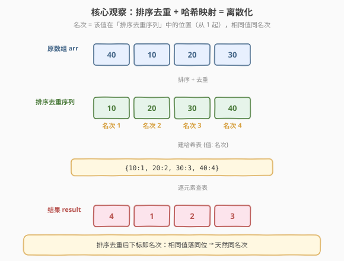
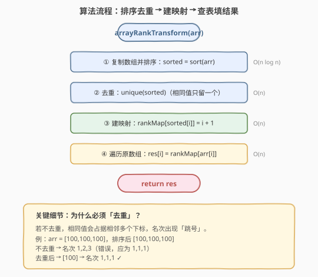
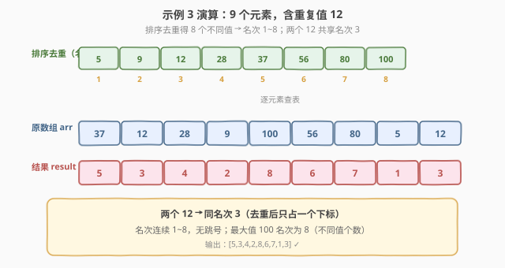

# LeetCode 数组序号转换 题解

## 1. 题目概述

- **标题 / 题号**：数组序号转换（#1331，easy）
- **链接**：https://leetcode.cn/problems/rank-transform-of-an-array/
- **难度**：简单
- **标签**：数组、哈希表、排序、离散化

**题意**：给你一个整数数组 `arr`，请你将每个元素替换成它的**名次（rank）**。名次反映该元素的大小：元素越大名次越大。名次是从 `1` 开始的整数。

- **相同元素的名次必须相同**。
- 名次应尽可能小，即从 `1` 开始连续递增（一个名次对应一个不同的值）。

**示例 1**：

```text
输入：arr = [40,10,20,30]
输出：[4,1,2,3]
解释：去重排序后为 [10,20,30,40]，名次依次 1,2,3,4；映射回原数组得 [4,1,2,3]。
```

**示例 2**：

```text
输入：arr = [100,100,100]
输出：[1,1,1]
解释：只有一个不同值 100，名次均为 1。
```

**示例 3**：

```text
输入：arr = [37,12,28,9,100,56,80,5,12]
输出：[5,3,4,2,8,6,7,1,3]
解释：去重排序后为 [5,9,12,28,37,56,80,100]，8 个不同值对应名次 1~8；
      两个 12 共享名次 3。
```

**约束**：

- $0 \le \text{arr.length} \le 10^5$
- $-10^9 \le \text{arr[i]} \le 10^9$

> 💡 本题本质是**离散化（coordinate compression）**：把值域可能高达 $[-10^9, 10^9]$ 的元素，按相对大小压缩到 $[1, k]$ 的连续名次（$k$ 为不同值个数）。名次就是「该值在排序去重序列中的位置」。

## 2. 解题思路

### 2.1 暴力思路：逐元素数比它小的不同值个数

对每个 `arr[i]`，扫描整个数组统计**严格小于 `arr[i]` 的不同值个数** `c`，则 `rank = c + 1`。

- **重复统计浪费**：相同值的元素各自独立扫描一遍，做重复工作；
- **时间复杂度 $O(n^2)$**：$n$ 个元素各扫一遍 $O(n)$，$n \le 10^5$ 时约 $10^{10}$ 次操作，**超时**；
- **去重逻辑易错**：统计「不同值」而非「元素个数」，否则相同值会虚增名次。

> ⚠️ 暴力的根本问题在于：名次信息对所有相同值是共享的，却为每个元素独立计算了一遍。正确做法是**先对值统一定名次，再回填到每个位置**——把 $O(n^2)$ 的「逐元素求名次」转化为 $O(n \log n)$ 的「一次性建名次表 + $O(1)$ 查表」。

### 2.2 核心观察：排序去重 + 哈希映射（离散化）



**关键洞察**：名次的定义是「该值在所有不同值中按从小到大排第几」。因此：

1. **排序去重**得到所有不同值的升序序列 `sortedUnique`；
2. 在该序列中，值 `sortedUnique[i]` 的名次就是 $i + 1$（下标从 0 起，名次从 1 起）；
3. 用**哈希表**记录 `值 → 名次` 的映射，建表 $O(k)$、查询 $O(1)$；
4. 遍历原数组，逐元素查表填入名次。

> 以示例 1 为例：`arr = [40,10,20,30]` → 排序去重 `[10,20,30,40]` → 名次映射 `{10:1, 20:2, 30:3, 40:4}` → 回填原数组 `[4,1,2,3]`。**名次就是去重序列里的下标 +1**，相同值落同一下标 → 天然同名次。

> ⚠️ **为什么必须去重？** 若只排序不去重，相同值会占据相邻多个下标。例：`[100,100,100]` 排序后仍为 `[100,100,100]`，下标依次 0,1,2，名次会变成 1,2,3（错误）。去重后只剩 `[100]`，名次 1,1,1 ✓。去重保证「**一个值只占一个名次**」，这是相同值同名次的根本保障。

### 2.3 算法流程图



**完整步骤**：

1. **复制并排序**：`sortedArr = sort(arr)`（复制原数组后排序，不动原数组）；
2. **去重**：移除相邻重复元素，得到 `sortedUnique`；
3. **建映射**：遍历 `sortedUnique`，`rankMap[sortedUnique[i]] = i + 1`；
4. **查表填结果**：遍历原数组 `arr`，`res[i] = rankMap[arr[i]]`；
5. **返回** `res`。

> 💡 **三阶段解耦**：阶段 1-2 处理「值的名次定义」，阶段 3 建查询表，阶段 4 回填——每个元素只需 $O(1)$ 哈希查询。这正是「**预处理 + 查表**」的经典模式，把暴力 $O(n^2)$ 拆成 $O(n \log n) + O(n)$。

### 2.4 示例演算

以示例 3 `arr = [37,12,28,9,100,56,80,5,12]` 为例，含重复值 `12`：



| 步骤 | 操作 | 结果 |
|------|------|------|
| ① 排序 | 升序排列 | `[5,9,12,12,28,37,56,80,100]` |
| ② 去重 | 移除相邻重复 | `[5,9,12,28,37,56,80,100]`（8 个不同值） |
| ③ 建映射 | 下标 +1 作名次 | `{5:1, 9:2, 12:3, 28:4, 37:5, 56:6, 80:7, 100:8}` |
| ④ 查表回填 | 逐元素查 `rankMap` | `[5,3,4,2,8,6,7,1,3]` |

逐元素查表过程：

| 原值 | 37 | 12 | 28 | 9 | 100 | 56 | 80 | 5 | 12 |
|------|----|----|----|---|------|----|----|---|----|
| 名次 | 5  | 3  | 4  | 2 | 8    | 6  | 7  | 1 | 3  |

> 💡 注意两个 `12` 都查到名次 `3`——去重后 `12` 在 `sortedUnique` 中只占下标 2（名次 3），无论它在原数组出现几次都映射到同一个名次。最大值 `100` 的名次为 `8`，恰好等于不同值的个数。

## 3. 参考代码

### C++

```cpp
class Solution {
public:
    vector<int> arrayRankTransform(vector<int>& arr) {
        vector<int> sortedArr(arr);
        sort(sortedArr.begin(), sortedArr.end());
        // 去重：unique 把重复元素挪到末尾，返回新末尾迭代器
        sortedArr.erase(unique(sortedArr.begin(), sortedArr.end()),
                        sortedArr.end());
        unordered_map<int, int> rankMap;
        for (int i = 0; i < (int)sortedArr.size(); ++i) {
            rankMap[sortedArr[i]] = i + 1;            // 下标 +1 = 名次
        }
        vector<int> res;
        res.reserve(arr.size());
        for (int x : arr) {
            res.push_back(rankMap[x]);                // O(1) 查表
        }
        return res;
    }
};
```

### Python

```python
class Solution:
    def arrayRankTransform(self, arr: List[int]) -> List[int]:
        # sorted(set(arr)) 一步完成「排序 + 去重」
        rankMap = {v: i + 1 for i, v in enumerate(sorted(set(arr)))}
        return [rankMap[x] for x in arr]
```

> 💡 **语言差异**：Python 的 `sorted(set(arr))` 一行完成排序去重——`set` 自动去重、`sorted` 返回升序列表，再用字典推导式建映射，全程声明式。C++ 需手动 `sort` + `unique` + `erase` 三步组合去重（`unique` 只移除**相邻**重复，故必须先排序）。两者核心逻辑完全一致：**排序去重 → 下标+1 作名次 → 哈希查表回填**。

## 4. 复杂度分析

| 维度 | 排序去重 + 哈希（推荐） | 暴力逐元素统计 |
|------|------------------------|----------------|
| 时间复杂度 | $O(n \log n)$ | $O(n^2)$ |
| 空间复杂度 | $O(n)$ | $O(n)$（存不同值集合） |
| 通过率 | $n = 10^5$ 下约 $1.7 \times 10^6$ 次操作，轻松通过 | $10^{10}$ 次操作，超时 |

- **时间**：排序主导 $O(n \log n)$；去重 $O(n)$、建映射 $O(k)$（$k \le n$ 为不同值个数）、回填 $O(n)$，均不超过排序开销。
- **空间**：排序副本 $O(n)$ + 哈希表 $O(k)$ + 结果 $O(n)$，总计 $O(n)$。

> ⚠️ 值域 $[-10^9, 10^9]$ 达 20 亿，**无法用数组直接按下标计数**（空间爆炸）。离散化的价值正在于此：把稀疏的大值域压缩到 $[1, k]$ 的连续名次，$k \le n \le 10^5$，哈希表轻松容纳。

## 5. 扩展：离散化的工程意义

**离散化（coordinate compression）** 是竞赛与工程中的高频技术：把稀疏的大值域映射到稠密的小区间，使数组/树状数组/线段树等「按下标组织」的结构能高效工作。

- **典型场景**：值域很大但实际出现的值很少。如本题 $10^9$ 值域、最多 $10^5$ 个不同值——离散化后只需 $[1, 10^5]$ 的下标空间。
- **与桶计数对比**：[1365. 有多少小于当前数字的数字](https://leetcode.cn/problems/how-many-numbers-are-smaller-than-the-current-number/) 值域仅 $[0,100]$，可直接用大小 101 的桶 $O(n + V)$ 统计；本题值域达 $10^9$，桶不可行，必须离散化。
- **线段树/树状数组的前置**：用值作下标维护区间信息时，离散化是压缩空间的标准预处理。如 [315. 计算右侧小于当前元素的个数](../0201-0300/315_计算右侧小于当前元素的个数.md) 中树状数组解法即需先离散化值域。

> 💡 **离散化 vs 桶计数**：值域小（$V \le 10^6$ 量级）用桶 $O(n + V)$ 更快；值域大或值稀疏时用离散化 $O(n \log n)$ 更省空间。两者都是「把值映射到下标」的思想，选型看值域规模。

## 6. 面试要点

1. **如何想到用排序去重 + 哈希？**

   > 名次的定义是「该值在所有不同值中排第几」，这天然对应排序后的位置。排序去重后，下标 +1 就是名次；用哈希表存「值 → 名次」即可 $O(1)$ 查询。把「逐元素求名次」转化为「统一定义名次表 + 查表回填」，是降复杂度的关键。

2. **为什么必须去重？不去重会怎样？**

   > 不去重时相同值占据相邻多个下标，名次会跳号。例 `[100,100,100]` 排序后下标 0,1,2 → 名次 1,2,3（错）。去重后只剩一个 `100` → 名次 1,1,1 ✓。去重保证「一个值只占一个名次」，是相同值同名次的根本保障。

3. **C++ 的 `unique` 为什么要求先排序？**

   > `std::unique` 只移除**相邻**的重复元素，不排序时分散的相同值不会被合并。必须先 `sort` 让相同值相邻，`unique` 才能完整去重。Python 的 `set` 基于哈希，无需排序即可去重，故 `sorted(set(arr))` 顺序无关——但最终 `sorted` 仍需排序以确定名次。

4. **值域 $[-10^9, 10^9]$ 为什么不能用桶计数？**

   > 桶计数需按值作下标开数组，$2 \times 10^9$ 个桶的内存远超限制（约 8 GB）。离散化把稀疏大值域压缩到 $[1, k]$（$k \le n \le 10^5$），哈希表只需存 $k$ 个条目。这是「值域大 → 离散化，值域小 → 桶」的选型判据。

5. **本题和 [506. 相对名次](https://leetcode.cn/problems/relative-ranks/) 有何异同？**

   > 两者核心完全相同——都是「排序去重 + 按大小排名」。区别仅在输出形式：506 把前三名映射成 `"Gold Medal"` / `"Silver Medal"` / `"Bronze Medal"` 字符串，其余用数字字符串；1331 全程输出数字名次。掌握 1331 的离散化模板，506 只需加一个名次到字符串的格式化层。

> 💡 **一句话总结**：1331 的灵魂是「**离散化**」——排序去重后下标即名次，哈希表把「值 → 名次」的查询降到 $O(1)$。这是所有「值域稀疏但需按相对大小编号」问题的通用范式。

## 同类练习题

| # | 题目 | 与本题的关联 |
|---|------|-------------|
| 506 | [相对名次](https://leetcode.cn/problems/relative-ranks/) | 同套路直接变体——排序去重 + 名次映射，仅多一层「前三名转奖牌字符串」的格式化，1331 掌握后几乎零成本 |
| 1365 | [有多少小于当前数字的数字](https://leetcode.cn/problems/how-many-numbers-are-smaller-than-the-current-number/) | 值域 $[0,100]$ 时用桶计数 $O(n+V)$，对照 1331 值域大时用离散化 $O(n \log n)$，体现「值域规模决定选型」 |
| 315 | [计算右侧小于当前元素的个数](../0201-0300/315_计算右侧小于当前元素的个数.md) | 树状数组解法的前置即离散化——把大值域压缩到 $[1,n]$ 才能用树状数组按下标维护，1331 是其离散化基础 |
| 1207 | [独一无二的出现次数](../1201-1300/1207_独一无二的出现次数.md) | 哈希表统计频次 + 集合去重判定唯一性，同为「哈希 + 去重」家族，对照 1331 的「排序 + 去重」 |
| 1636 | [按照频率将数组升序排序](https://leetcode.cn/problems/sort-array-by-increasing-frequency/) | 频次哈希 + 多关键字排序，是 1331「值映射 + 排序」思路在频次维度的延伸 |
