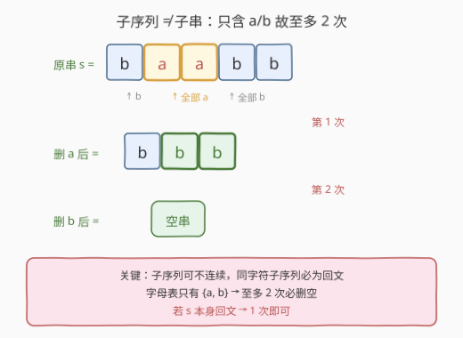
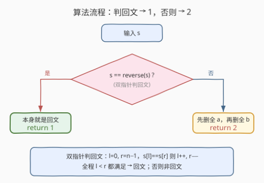
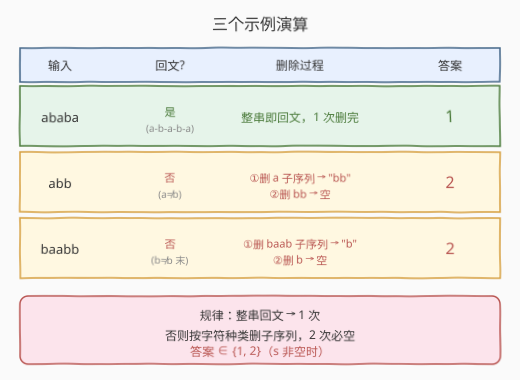

# LeetCode 删除回文子序列 题解

## 1. 题目概述

- **标题 / 题号**：删除回文子序列（#1332，easy）
- **链接**：https://leetcode.cn/problems/remove-palindromic-subsequences/
- **难度**：简单
- **标签**：字符串、双指针、脑筋急转弯

**题意**：给你一个字符串 `s`，它仅由字母 `'a'` 和 `'b'` 组成。每一次删除操作都可以从 `s` 中删除一个回文 **子序列**。返回删除给定字符串中所有字符（字符串为空）的最小删除次数。

「子序列」定义：如果一个字符串可以通过删除原字符串某些字符而不改变原字符顺序得到，那么这个字符串就是原字符串的一个子序列。

「回文」定义：如果一个字符串向后和向前读是一致的，那么这个字符串就是一个回文。

**示例 1**：

```text
输入：s = "ababa"
输出：1
解释：字符串本身就是回文序列，只需要删除一次。
```

**示例 2**：

```text
输入：s = "abb"
输出：2
解释："abb" -> "bb" -> ""。
先删除回文子序列 "a"，然后再删除 "bb"。
```

**示例 3**：

```text
输入：s = "baabb"
输出：2
解释："baabb" -> "b" -> ""。
先删除回文子序列 "baab"，然后再删除 "b"。
```

**约束**：

- `1 <= s.length <= 1000`
- `s` 仅包含字母 `'a'` 和 `'b'`

> 💡 本题是经典的**脑筋急转弯**题。陷阱在于「子序列」与「子串」的区别——子序列**不需要连续**。一旦看清这一点，结合「字母表只有 `a`、`b` 两种字符」，答案立刻被压缩到至多 2。

## 2. 解题思路

### 2.1 暴力思路：把子序列当子串

如果误把「子序列」当成「子串」（连续），本题就退化成「分割回文串」的最少段数，需要 $O(n^2)$ 的 DP 预处理回文表再做最小切割（参见 [132. 分割回文串 II](../0101-0200/132_分割回文串II.md)）。对 `"baabb"` 这种用例会给出与官方不同的过程描述，甚至可能误判答案上界。

> ⚠️ 这是本题最大的陷阱。**子序列可不连续**：从原串中挑出若干字符（保持相对顺序）即构成子序列，不必相邻。

### 2.2 核心观察：同字符子序列必回文 + 字母表只有 2 种



关键点：

- **同字符组成的子序列必然是回文**：从 `s` 中挑出所有 `'a'`，它们拼成形如 `"aaa…a"` 的串——正读反读都一样，必为回文；同理所有 `'b'` 也是回文。
- **字母表只有 $\{a, b\}$**：因此**至多两次删除必能清空**——第一次删掉全部 `'a'`（一个回文子序列），第二次删掉剩下的全部 `'b'`（也是回文子序列）。
- **若 `s` 本身已是回文**：整串一次性删完，答案为 1。
- **答案上界为 2**：非回文串也只需 2 次；回文串只需 1 次。约束 `s.length >= 1` 保证答案不为 0。

> 💡 **正确性论证**：设 `s` 非空。若 `s` 是回文，1 次即可删完。若 `s` 非回文，令 $A$ 为 `s` 中所有 `'a'` 的下标集合、$B$ 为所有 `'b'` 的下标集合。按原顺序取出 $A$ 对应字符得到全 `'a'` 串（回文），删去后串中只剩 `'b'`；再取出全部 `'b'`（回文）删去即空。故答案 $\le 2$。又 `s` 非回文 $\Rightarrow$ 不能 1 次删完 $\Rightarrow$ 答案 $\ge 2$。综合得答案恰为 2。

### 2.3 算法流程图



**完整步骤**：

1. 用双指针判定 `s` 是否为回文：`l = 0`、`r = n - 1`，只要 `s[l] == s[r]` 就 `l++`、`r--`，全程满足则回文。
2. 若回文 → 返回 `1`。
3. 否则 → 返回 `2`。

> 💡 **判回文也可直接** `s == string(s.rbegin(), s.rend())` / `s == s[::-1]`，一行搞定。双指针版仅需 $O(n)$ 时间、$O(1)$ 额外空间，无需构造反转串。

### 2.4 示例演算

三个官方示例的演算过程：



| 输入 | 是否回文 | 删除过程 | 答案 |
|------|----------|----------|------|
| `ababa` | 是（`a-b-a-b-a`，首尾对称） | 整串即回文，1 次删完 | 1 |
| `abb` | 否（`s[0]='a' ≠ s[2]='b'`） | ①删 `a` → `bb`；②删 `bb` → 空 | 2 |
| `baabb` | 否（`s[0]='b' ≠ s[4]='b'`？实际 `s[0]='b'==s[4]='b'`，但 `s[1]='a'≠s[3]='b'`） | ①删 `baab` 子序列 → `b`；②删 `b` → 空 | 2 |

以 `s = "baabb"` 为例，双指针判回文逐位核对：

| 步骤 | `l` | `r` | `s[l]` | `s[r]` | 相等? |
|------|-----|-----|--------|--------|-------|
| 1 | 0 | 4 | `b` | `b` | ✓ |
| 2 | 1 | 3 | `a` | `b` | ✗ → 非回文，停止 |

判定非回文，返回 2。删除方案：先取下标 $\{0,1,2,3\}$ 的子序列 `"baab"`（回文）删去，剩下下标 4 的 `"b"`，再删即空。

## 3. 参考代码

### C++

```cpp
// 写法一：双指针判回文
class Solution {
public:
    int removePalindromeSub(string s) {
        int l = 0, r = s.size() - 1;
        while (l < r) {
            if (s[l] != s[r]) return 2;
            ++l; --r;
        }
        return 1;
    }
};
```

```cpp
// 写法二：直接比较反转串
class Solution {
public:
    int removePalindromeSub(string s) {
        return s == string(s.rbegin(), s.rend()) ? 1 : 2;
    }
};
```

### Python

```python
# 写法一：切片判回文
class Solution:
    def removePalindromeSub(self, s: str) -> int:
        return 1 if s == s[::-1] else 2
```

```python
# 写法二：双指针判回文（O(1) 额外空间）
class Solution:
    def removePalindromeSub(self, s: str) -> int:
        l, r = 0, len(s) - 1
        while l < r:
            if s[l] != s[r]:
                return 2
            l += 1
            r -= 1
        return 1
```

> 💡 **实现细节**：① Python 切片 `s[::-1]` 一步反转，判等即可，最简洁。② 双指针版的优势在 $O(1)$ 额外空间且可短路：一旦发现 `s[l] != s[r]` 立即返回 2，无需扫完整串。③ 本题函数名 `removePalindromeSub`（Sub 指子序列）已暗示关键，审题时留意。

## 4. 复杂度分析

| 维度 | 复杂度 | 说明 |
|------|--------|------|
| 时间复杂度 | $O(n)$ | 双指针一趟扫描判回文，最坏扫到中点 |
| 空间复杂度（双指针） | $O(1)$ | 仅两个整型指针 |
| 空间复杂度（反转串法） | $O(n)$ | 构造反转串需 $O(n)$ 辅助空间 |

> ⚠️ 本题 $n \le 1000$，两种写法均远在时限内。双指针法的短路特性使非回文串往往几步即返回，实际开销远小于理论上界。

## 5. 扩展：若字母表扩大或改为删子串

**字母表扩大到 $k$ 种字符**：若 `s` 由任意 $k$ 种字符组成（如小写字母 $k=26$），同字符子序列仍为回文，故答案上界变为 $k$（按字符种类逐类删除）。但下界仍由「整串是否回文」决定：回文则 1，否则至少 2。精确最小次数需视具体字符分布而定——若 $s$ 恰由 $m$ 种字符组成且非回文，答案在 $[2, m]$ 之间，可用「每次删一个回文子序列」的贪心逐步分析。

**改为删子串（连续）**：若题目改为「每次删一个回文子串」，则退化为 [132. 分割回文串 II](../0101-0200/132_分割回文串II.md) 的最小切割数，需 $O(n^2)$ DP 预处理回文表 + 最小切割 DP，答案可达 $O(n)$ 量级。这正是本题「子序列」设定把难题降为脑筋急转弯的关键。

> 💡 **一句话总结**：本题的难度全部集中在「审题」——看清「子序列可不连续」+「只含 a/b」，答案立刻被锁定在 $\{1, 2\}$。

## 6. 面试要点

1. **为什么答案至多是 2？**

   > 字母表只有 $\{a, b\}$ 两种字符。同字符组成的子序列（如所有 `'a'`）必为回文。第一次删掉全部 `'a'`，第二次删掉剩下的全部 `'b'`，至多 2 次清空。

2. **子序列和子串的区别是什么？为什么本题关键？**

   > 子串要求连续，子序列不要求连续、只要求相对顺序不变。本题允许删子序列，故可「跳着挑」字符凑回文——所有同类字符天然构成回文子序列。若误当子串处理，会退化成 $O(n^2)$ 的最小回文分割。

3. **什么时候答案是 1？**

   > 当且仅当 `s` 本身是回文。整串作为一个回文子序列一次删完。判定用双指针或反转串比较，$O(n)$ 时间。

4. **答案会是 0 吗？**

   > 本题约束 `s.length >= 1`，故答案至少为 1。若放宽到空串，则答案为 0（无需删除）。面试时提一句边界即可。

5. **若 `s` 含三种字符（a/b/c）会怎样？**

   > 同字符子序列仍为回文，答案上界变为 3（按种类逐类删）。但若 `s` 本身回文仍为 1，若能挑出一个跨字符的回文子序列使剩余部分也一次删完，则可为 2。精确最小次数需具体分析，不再是简单的 $\{1, 2\}$。

## 同类练习题

| # | 题目 | 与本题的关联 |
|---|------|-------------|
| 132 | [分割回文串 II](https://leetcode.cn/problems/palindrome-partitioning-ii/)（[题解](../0101-0200/132_分割回文串II.md)） | 本题的「子串版」——每次删连续回文子串的最少次数，需 $O(n^2)$ DP，对照体会「子序列」设定带来的降维打击 |
| 131 | [分割回文串](https://leetcode.cn/problems/palindrome-partitioning/)（[题解](../0101-0200/131_分割回文串.md)） | 枚举所有回文分割方案，回溯 + 判回文，与本题共享「回文判定」基础但问法不同 |
| 9 | [回文数](https://leetcode.cn/problems/palindrome-number/)（[题解](../0001-0100/9_回文数.md)） | 反转一半数字判回文，巩固双指针/反转判回文的核心套路 |
| 125 | [验证回文串](https://leetcode.cn/problems/valid-palindrome/) | 双指针判回文的基础题，过滤非字母数字后首尾比对，与本题判回文部分同源 |
| 680 | [验证回文串 II](https://leetcode.cn/problems/valid-palindrome-ii/) | 允许删一个字符后判回文，双指针 + 贪心尝试跳过，进阶版回文判定 |
