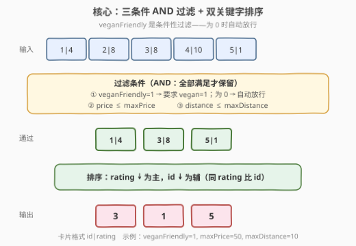
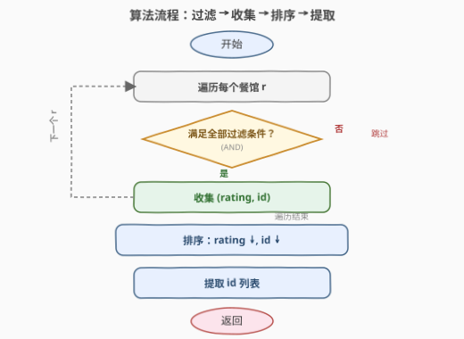

# 餐厅过滤器

- **题目名称**：餐厅过滤器
- **链接**：[1333. 餐厅过滤器](https://leetcode.cn/problems/filter-restaurants-by-vegan-friendly-price-and-distance/)
- **难度**：中等
- **标签**：数组、排序、模拟

## 1. 题目概述

给定餐馆信息数组 `restaurants`，其中 `restaurants[i] = [idi, ratingi, veganFriendlyi, pricei, distancei]`。需要使用三个过滤器过滤餐馆：

- **素食友好** `veganFriendly`：为 `1`（`true`）时只保留 `veganFriendlyi == 1` 的餐馆；为 `0`（`false`）时此条件不生效，保留所有餐馆。
- **最大价格** `maxPrice`：只保留 `pricei <= maxPrice` 的餐馆。
- **最大距离** `maxDistance`：只保留 `distancei <= maxDistance` 的餐馆。

过滤后返回餐馆的 **id**，按 **rating** 从高到低排序；rating 相同时按 **id** 从高到低排序。

**示例 1**：

```text
输入：restaurants = [[1,4,1,40,10],[2,8,0,50,5],[3,8,1,30,4],[4,10,0,10,3],[5,1,1,15,1]],
     veganFriendly = 1, maxPrice = 50, maxDistance = 10
输出：[3,1,5]
解释：veganFriendly = 1 时只保留素食友好餐馆。
  餐馆 1 [id=1, rating=4, vegan=1, price=40, dist=10]  ✓
  餐馆 2 [id=2, rating=8, vegan=0, price=50, dist=5]   ✗（vegan=0）
  餐馆 3 [id=3, rating=8, vegan=1, price=30, dist=4]   ✓
  餐馆 4 [id=4, rating=10, vegan=0, price=10, dist=3]  ✗（vegan=0）
  餐馆 5 [id=5, rating=1, vegan=1, price=15, dist=1]   ✓
  通过的餐馆 3, 1, 5 按 rating 降序排列。
```

**示例 2**：

```text
输入：restaurants = [[1,4,1,40,10],[2,8,0,50,5],[3,8,1,30,4],[4,10,0,10,3],[5,1,1,15,1]],
     veganFriendly = 0, maxPrice = 50, maxDistance = 10
输出：[4,3,2,1,5]
解释：veganFriendly = 0 时素食过滤器不生效，所有餐馆都通过。
  rating 降序：10→8→8→4→1，两个 rating=8 按 id 降序（3>2）。
```

**示例 3**：

```text
输入：restaurants = [[1,4,1,40,10],[2,8,0,50,5],[3,8,1,30,4],[4,10,0,10,3],[5,1,1,15,1]],
     veganFriendly = 0, maxPrice = 30, maxDistance = 3
输出：[4,5]
解释：price ≤ 30 且 distance ≤ 3，只有餐馆 4 和 5 满足。
```

**约束条件**：

- `1 <= restaurants.length <= 10^4`
- `restaurants[i].length == 5`
- `1 <= idi, ratingi, pricei, distancei <= 10^5`
- `1 <= maxPrice, maxDistance <= 10^5`
- `veganFriendlyi` 和 `veganFriendly` 的值为 0 或 1
- 所有 `idi` 各不相同

> 💡 本题是「过滤 + 排序」的招牌题：先用三个 AND 条件筛出候选餐馆，再按双关键字（rating 降序、id 降序）排序，最后提取 id。核心难点不在算法复杂度，而在于**条件性过滤**的正确表达——`veganFriendly` 过滤器只在为 `1` 时生效。

---

## 2. 解题思路

### 2.1 暴力思路

遍历每个餐馆，逐一检查三个过滤条件，将通过的餐馆收集到列表中，然后对列表按 `(rating, id)` 降序排序，最后提取 id。这其实就是最优解——问题本身没有更复杂的需求，关键在于正确组织过滤逻辑和排序比较器。

### 2.2 核心观察：条件性过滤 + 双关键字排序



关键点：

- **三个过滤条件是 AND 关系**：一个餐馆必须同时满足所有适用条件才能保留，任一不满足即淘汰。
- **`veganFriendly` 是条件性过滤器**：只有当 `veganFriendly == 1` 时才要求 `veganFriendlyi == 1`；当 `veganFriendly == 0` 时此条件自动放行。可统一表达为：`veganFriendly == 0 || veganFriendlyi == 1`，或等价地 `!(veganFriendly == 1 && veganFriendlyi == 0)`。
- **价格和距离是上界过滤**：`pricei <= maxPrice` 且 `distancei <= maxDistance`，简单数值比较即可。
- **排序是双关键字**：主键 `rating` 降序，次键 `id` 降序。由于所有 `idi` 各不相同，排序结果唯一确定。

> 💡 **为什么 `veganFriendly` 用「短路或」表达？** `veganFriendly == 0 || veganFriendlyi == 1` 利用短路求值：当 `veganFriendly == 0` 时整个表达式直接为 `true`（放行），不再检查 `veganFriendlyi`；当 `veganFriendly == 1` 时才检查 `veganFriendlyi == 1`。代码中写 `if (veganFriendly && !vegan) continue;` 更直观——「要求素食但餐馆不是素食」才跳过。

### 2.3 算法流程图



**完整步骤**：

1. 初始化空列表 `filtered`。
2. 遍历 `restaurants` 中每个餐馆 `r = [id, rating, vegan, price, distance]`：
   - 若 `veganFriendly == 1` 且 `vegan == 0` → 跳过（不满足素食条件）。
   - 若 `price > maxPrice` → 跳过。
   - 若 `distance > maxDistance` → 跳过。
   - 否则将 `(rating, id)` 加入 `filtered`。
3. 对 `filtered` 按 `rating` 降序排序，`rating` 相同按 `id` 降序排序。
4. 从排序后的 `filtered` 中提取 `id`，返回结果。

> 💡 **为什么只存 `(rating, id)` 而非整个餐馆记录？** 排序和最终输出只需要 `rating` 和 `id` 两个字段，无需携带 `vegan`/`price`/`distance`。存最小必要信息可以减少排序时的数据搬运开销，代码也更清晰。

### 2.4 示例演算

以示例 1 为例，`veganFriendly = 1, maxPrice = 50, maxDistance = 10`：

![示例演算：5 个餐馆经三条件过滤后剩 3 个，按 rating↓ id↓ 排序得 [3,1,5]](../images/rf_example_walkthrough.svg)

| id | rating | vegan | price | distance | vegan 过滤(VF=1) | price ≤ 50 | distance ≤ 10 | 通过？ |
|----|--------|-------|-------|----------|-------------------|------------|---------------|--------|
| 1  | 4      | 1     | 40    | 10       | ✓                 | ✓          | ✓             | ✓      |
| 2  | 8      | 0     | 50    | 5        | ✗（vegan=0）       | ✓          | ✓             | ✗      |
| 3  | 8      | 1     | 30    | 4        | ✓                 | ✓          | ✓             | ✓      |
| 4  | 10     | 0     | 10    | 3        | ✗（vegan=0）       | ✓          | ✓             | ✗      |
| 5  | 1      | 1     | 15    | 1        | ✓                 | ✓          | ✓             | ✓      |

通过过滤的餐馆：`id=1(rating=4)`、`id=3(rating=8)`、`id=5(rating=1)`。

按 `rating` 降序排序（rating 相同按 id 降序）：

- `id=3`（rating=8）> `id=1`（rating=4）> `id=5`（rating=1）

输出：`[3, 1, 5]`。

> 💡 **示例 2 的 tie-breaker**：`veganFriendly = 0` 时所有餐馆通过素食过滤。id=2 和 id=3 的 rating 同为 8，按 id 降序 `3 > 2`，所以 id=3 排在 id=2 前面，结果 `[4, 3, 2, 1, 5]`。这正是双关键字排序中次键 `id` 降序的作用。

---

## 3. 参考代码

### C++

```cpp
class Solution {
public:
    vector<int> filterRestaurants(vector<vector<int>>& restaurants,
                                  int veganFriendly, int maxPrice, int maxDistance) {
        vector<pair<int,int>> filtered;          // (rating, id)
        for (auto& r : restaurants) {
            int id = r[0], rating = r[1], vegan = r[2], price = r[3], distance = r[4];
            if (veganFriendly && !vegan) continue;   // 素食过滤（条件性）
            if (price > maxPrice) continue;           // 价格过滤
            if (distance > maxDistance) continue;     // 距离过滤
            filtered.emplace_back(rating, id);
        }
        sort(filtered.begin(), filtered.end(), [](const auto& a, const auto& b) {
            if (a.first != b.first) return a.first > b.first;   // rating 降序
            return a.second > b.second;                         // id 降序
        });
        vector<int> res;
        res.reserve(filtered.size());
        for (auto& [rating, id] : filtered) res.push_back(id);
        return res;
    }
};
```

### Python

```python
class Solution:
    def filterRestaurants(self, restaurants: List[List[int]],
                          veganFriendly: int, maxPrice: int, maxDistance: int) -> List[int]:
        filtered = []
        for rid, rating, vegan, price, distance in restaurants:
            if veganFriendly and not vegan:      # 素食过滤（条件性）
                continue
            if price > maxPrice:                 # 价格过滤
                continue
            if distance > maxDistance:           # 距离过滤
                continue
            filtered.append((rating, rid))
        # 双关键字排序：rating 降序，id 降序
        filtered.sort(key=lambda x: (-x[0], -x[1]))
        return [rid for _, rid in filtered]
```

> 💡 **实现细节**：① C++ 用 `vector<pair<int,int>>` 存储 `(rating, id)`，自定义 lambda 比较器实现双关键字降序。② Python 用 `key=lambda x: (-x[0], -x[1])` 巧妙实现降序——对数值取负即可将降序转为默认升序，避免 `reverse=True` 与混合方向冲突。③ 过滤条件 `veganFriendly && !vegan` 利用短路求值：`veganFriendly` 为 0 时整个条件为 false（放行），为 1 时才检查 `!vegan`。④ `res.reserve(filtered.size())` 预分配避免多次扩容。

---

## 4. 复杂度分析

| 维度 | 复杂度 | 说明 |
|------|--------|------|
| **时间** | $O(n \log n)$ | 遍历过滤 $O(n)$ + 排序 $O(n \log n)$，排序为主导项 |
| **空间** | $O(n)$ | `filtered` 列表最坏存全部 $n$ 个餐馆的 `(rating, id)` 对 |

> ⚠️ 最坏情况下所有餐馆都通过过滤（如 `veganFriendly=0, maxPrice=10^5, maxDistance=10^5`），排序 $n = 10^4$ 个元素约 $10^4 \log 10^4 \approx 1.3 \times 10^5$ 次比较，远在限制内。

---

## 5. 扩展：SQL 思维与函数式写法

本题本质是一个 **SQL 查询**的等价表达：

```sql
SELECT id FROM restaurants
WHERE (:veganFriendly = 0 OR veganFriendlyi = 1)
  AND pricei <= :maxPrice
  AND distancei <= :maxDistance
ORDER BY rating DESC, id DESC;
```

理解这一点有助于将「过滤 + 排序」类问题抽象为统一模式：**WHERE 子句**对应过滤条件（AND 关系，条件性过滤用 OR 表达），**ORDER BY 子句**对应排序关键字（多字段 + 升降序）。

Python 中可用生成器表达式 + `sorted` 以更函数式的方式实现：

```python
class Solution:
    def filterRestaurants(self, restaurants, veganFriendly, maxPrice, maxDistance):
        return [
            rid for _, rid in sorted(
                ((r[1], r[0]) for r in restaurants
                 if (not veganFriendly or r[2]) and r[3] <= maxPrice and r[4] <= maxDistance),
                key=lambda x: (-x[0], -x[1])
            )
        ]
```

> ⚠️ 上述一行版本虽简洁但可读性较差，面试中推荐分步写法（先过滤收集，再排序提取），便于解释和调试。

---

## 6. 面试要点

1. **`veganFriendly` 过滤器和其他两个过滤器有什么本质区别？**

   > 价格和距离是**无条件上界过滤**——始终生效，只需 `price <= maxPrice` 和 `distance <= maxDistance`。`veganFriendly` 是**条件性过滤**——只有当 `veganFriendly == 1` 时才要求餐馆 `veganFriendlyi == 1`，为 0 时此条件自动放行。代码中用 `if (veganFriendly && !vegan) continue;` 表达：短路求值保证 `veganFriendly == 0` 时不检查 `vegan`。

2. **为什么排序要存 `(rating, id)` 而不是整个餐馆数组？**

   > 排序和最终输出只需要 `rating` 和 `id`。存最小必要信息减少排序时的数据搬运开销（每个元素从 5 个 int 变为 1 个 pair），代码也更清晰。如果后续需求变化（如要返回完整信息），再调整存储结构即可。

3. **Python 中如何实现混合方向的双关键字排序？**

   > 用 `key=lambda x: (-x[0], -x[1])` 对数值字段取负，将降序转为默认升序。这比 `sort(reverse=True)` 更灵活——后者只能全部升序或全部降序，无法处理「一个升一个降」的情况。对于非数值字段（如字符串），可用 `functools.cmp_to_key` 自定义比较器。

4. **时间复杂度是 $O(n)$ 还是 $O(n \log n)$？**

   > 是 $O(n \log n)$，由排序主导。过滤遍历是 $O(n)$，但 $O(n \log n) > O(n)$，所以总体 $O(n \log n)$。如果题目只要求过滤不需要排序，则是 $O(n)$；但本题要求按 rating 排序输出，排序不可避免。

5. **如果 `restaurants` 已经按 rating 有序，能优化吗？**

   > 如果输入已按 rating 降序排列，过滤后保持原有相对顺序即可（稳定过滤），无需再排序，时间降到 $O(n)$。但题目不保证输入有序，且 rating 相同时还要按 id 降序，所以一般情况仍需排序。可以加一个预检查：若输入已满足排序要求则跳过排序步骤，但实际收益有限。

> 💡 **一句话总结**：1333 是「过滤 + 排序」的招牌题——三条件 AND 过滤（其中 `veganFriendly` 为条件性过滤），双关键字排序（rating 降序 + id 降序），最后提取 id。核心在于正确表达条件性过滤和双关键字比较器。

---

## 7. 同类练习题

- [912. 排序数组](https://leetcode.cn/problems/sort-an-array/)（[题解](../0901-1000/912_排序数组.md)）：排序基础母题，手撕快排/归并/堆排，巩固排序算法底层实现
- [56. 合并区间](https://leetcode.cn/problems/merge-intervals/)（[题解](../0001-0100/56_合并区间.md)）：排序 + 贪心处理，按起点排序后线性合并，对照本题的「过滤后排序」模式
- [179. 最大数](https://leetcode.cn/problems/largest-number/)（[题解](../0101-0200/179_最大数.md)）：自定义比较器排序，将数值拼为字符串比较，深化对排序 key/comparator 的理解
- [252. 会议室](https://leetcode.cn/problems/meeting-rooms/)（[题解](../0201-0300/252_会议室.md)）：区间按起点排序后贪心判定，同属「排序 + 线性扫描」范式
- [973. 最接近原点的 K 个点](https://leetcode.cn/problems/k-closest-points-to-origin/)（[题解](../0901-1000/973_最接近原点的K个点.md)）：按距离排序取前 K 个，对照本题的「排序 + 提取」模式，引入 Top-K 优化思路
