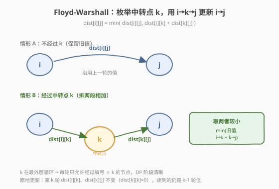
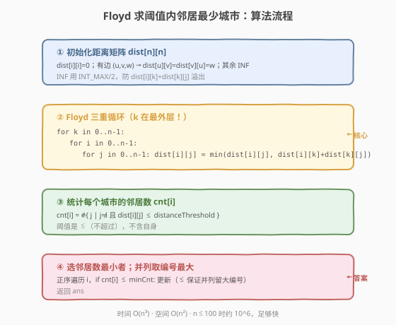
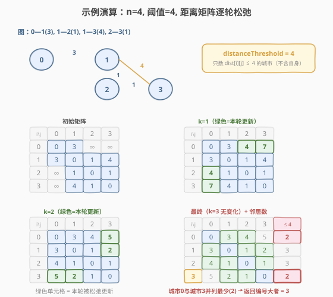

# 阈值距离内邻居最少的城市

- **题目名称**：阈值距离内邻居最少的城市
- **链接**：[1334. 阈值距离内邻居最少的城市](https://leetcode.cn/problems/find-the-city-with-the-smallest-number-of-neighbors-at-a-threshold-distance/)
- **难度**：中等
- **标签**：图、最短路径、Floyd-Warshall、动态规划

## 1. 题目概述

有 `n` 个城市，编号 `0` 到 `n-1`。给定边数组 `edges`，其中 `edges[i] = [from_i, to_i, weight_i]` 表示 `from_i` 与 `to_i` 之间一条**双向加权**边，边长为 `weight_i`。再给定整数 `distanceThreshold`。

定义城市 `i` 的「邻居数」为：从 `i` 出发、经过若干条边、**最短路径距离 $\le$ `distanceThreshold`** 可达的**其他城市数**（不含自身）。要求返回**邻居数最小**的城市；若并列，返回**编号最大**者。

**示例 1**：

```text
输入：n = 4, edges = [[0,1,3],[1,2,1],[1,3,4],[2,3,1]], distanceThreshold = 4
输出：3

各城市最短距离矩阵（行=起点，列=终点）：
      0    1    2    3
  0 [ 0    3    4    5 ]
  1 [ 3    0    1    2 ]
  2 [ 4    1    0    1 ]
  3 [ 5    2    1    0 ]

阈值 4 内邻居数：城市0 → {1,2} 计2；城市1 → {0,2,3} 计3；城市2 → {0,1,3} 计3；城市3 → {1,2} 计2
城市 0 与城市 3 并列最少（2 个），返回编号较大者 → 3
```

**示例 2**：

```text
输入：n = 5, edges = [[0,1,2],[0,4,8],[1,2,3],[1,4,2],[2,3,1],[3,4,1]], distanceThreshold = 2
输出：0
```

**约束条件**：

- `2 <= n <= 100`
- `1 <= edges.length <= n * (n - 1) / 2`
- `edges[i].length == 3`，`0 <= from_i < to_i < n`
- `1 <= weight_i, distanceThreshold <= 10^4`
- 任意两城市间至多一条边，无自环

> 💡 本题要算**每个城市到其余所有城市**的最短距离，再统计阈值内可达数——这是典型的**全源最短路（all-pairs shortest path）**需求。`n <= 100` 正是 **Floyd-Warshall** 的甜区：`O(n³) = 10^6`，简洁又够快。它与 [Day 743 网络延迟时间](../0701-0800/743_网络延迟时间.md) 的单源 Dijkstra 是一对：单源用 Dijkstra，全源用 Floyd。

---

## 2. 解题思路

### 2.1 暴力思路：对每个城市跑一次 Dijkstra

对每个城市 `i` 作为源点跑一次堆优化 Dijkstra，得到 `dist_i[]`，再统计 `dist_i[j] <= distanceThreshold` 的个数。`n` 次单源最短路，每次 `O(E log V)`，总 `O(n · E log V)`。

> ⚠️ 本题 `n ≤ 100` 但边数 `E` 最多约 `n²/2 = 5000`，`n · E log V ≈ 100 × 5000 × 7 ≈ 3.5×10^6`，也能过。但代码量更大（要建邻接表、写堆），且对稠密图不如 Floyd 直接。**当需要全源最短路且 `n` 不大时，Floyd 是首选**——三层循环 + 一行松弛，模板极简。

### 2.2 核心观察：Floyd-Warshall 全源最短路



**核心思想**：逐步允许更多的「中转点」。设 `dist[k][i][j]` 表示「只允许经过编号 $\le k$ 的节点作为中转」时 `i→j` 的最短距离。则：

$$
\text{dist}[k][i][j] = \min\Big(\text{dist}[k-1][i][j],\ \ \text{dist}[k-1][i][k] + \text{dist}[k-1][k][j]\Big)
$$

即 `i→j` 的最短路要么**不经过** `k`（沿用旧值），要么**经过** `k`（拆成 `i→k` 与 `k→j` 两段）。两段各自只用 $\le k-1$ 的中转点，故状态从 `k-1` 转移而来——这是**动态规划**。

**空间降维**：第 `k` 轮只依赖第 `k-1` 轮，且 `dist[k][i][k] = dist[k-1][i][k]`（经过 `k` 到达 `k` 无意义），可在原矩阵上**原地滚动更新**，省掉第一维：

```text
for k in 0..n-1:
    for i in 0..n-1:
        for j in 0..n-1:
            dist[i][j] = min(dist[i][j], dist[i][k] + dist[k][j])
```

> 💡 **为什么原地更新正确？** 第 `k` 轮中 `dist[i][k]` 和 `dist[k][j]` 不会被这一轮更新得更小（因为 `dist[k][k]=0`，松弛 `dist[i][k]+0` 不变），所以读到的 `dist[i][k]`、`dist[k][j]` 仍是第 `k-1` 轮的值，与定义一致。这是 Floyd 能原地滚动的关键。

> ⚠️ **循环顺序不能乱**：**中转点 `k` 必须在最外层**。若把 `i`/`j` 放外层，会在同一轮里让 `k` 串联传递（如 `i→k→k'→j` 用了多个新中转点），破坏 DP 的阶段划分，得到错误结果。

### 2.3 算法流程图



**完整步骤**：

1. **初始化距离矩阵** `dist[n][n]`：
   - `dist[i][i] = 0`（自身到自身为 0）
   - 有边 `(u,v,w)`：`dist[u][v] = dist[v][u] = w`（双向）
   - 其余 `dist[i][j] = INF`（不可达，用大数如 `INT_MAX/2` 防加法溢出）
2. **Floyd 三重循环**：`k` 外、`i` 中、`j` 内，`dist[i][j] = min(dist[i][j], dist[i][k] + dist[k][j])`
3. **统计邻居**：对每个城市 `i`，数 `dist[i][j] <= distanceThreshold` 且 `j != i` 的个数 `cnt[i]`
4. **选答案**：取 `cnt[i]` 最小者；并列取 `i` 最大者（倒序遍历，遇 `<=` 即更新即可自然处理）

### 2.4 示例演算

以示例 1 `n=4, edges=[[0,1,3],[1,2,1],[1,3,4],[2,3,1]], distanceThreshold=4` 为例，邻接关系：`0—1(3)`、`1—2(1)`、`1—3(4)`、`2—3(1)`。



**初始矩阵**（对角线 0，有边填权，其余 INF）：

| | 0 | 1 | 2 | 3 |
|---|---|---|---|---|
| **0** | 0 | 3 | ∞ | ∞ |
| **1** | 3 | 0 | 1 | 4 |
| **2** | ∞ | 1 | 0 | 1 |
| **3** | ∞ | 4 | 1 | 0 |

**逐轮更新**（`k` 为新加入的中转点，下表只标发生变化的格子）：

| 轮次 k | 更新内容 | 关键变化 |
|--------|---------|---------|
| k=0 | 以 0 为中转 | 无（0 到 2、3 都是 ∞，无法改善他人） |
| k=1 | 以 1 为中转 | `2→0 = min(∞, 1+3)=4`；`3→0 = min(∞, 4+3)=7`（但 7>4 路径不优，后续被覆盖） |
| k=2 | 以 2 为中转 | `0→2 = min(∞, 3+1)=4`；`0→3 = min(∞, 4+1)=5`；`3→0 = min(7, 1+4)=5` |
| k=3 | 以 3 为中转 | 检查是否更优：`0→2 = min(4, 5+1)=4`（不变）；其余无更优 |

**最终矩阵**（阈值 4 内邻居数见末列，不计自身）：

| | 0 | 1 | 2 | 3 | 邻居数(≤4) |
|---|---|---|---|---|---|
| **0** | 0 | 3 | 4 | 5 | 2（{1,2}） |
| **1** | 3 | 0 | 1 | 2 | 3（{0,2,3}） |
| **2** | 4 | 1 | 0 | 1 | 3（{0,1,3}） |
| **3** | 5 | 2 | 1 | 0 | 2（{1,2}） |

城市 0 与城市 3 并列最少（2 个），返回编号较大者 → **3**。

> 💡 注意 `0→3 = 5 > 4`，故城市 0 数不到 3；`3→0 = 5 > 4`，故城市 3 数不到 0。这正是「阈值」的作用——不是所有可达城市都算，只有**距离不超过阈值**的才算。

---

## 3. 参考代码

### C++

```cpp
// 阈值距离内邻居最少的城市.cpp —— Floyd-Warshall 全源最短路
// 编译: g++ -O2 -std=c++17 阈值距离内邻居最少的城市.cpp -o city
#include <vector>
#include <algorithm>
using namespace std;

class Solution {
  public:
    int findTheCity(int n, vector<vector<int>>& edges, int distanceThreshold) {
        const int INF = INT_MAX / 2;            // 防止 dist[i][k]+dist[k][j] 溢出
        vector<vector<int>> dist(n, vector<int>(n, INF));
        for (int i = 0; i < n; ++i) dist[i][i] = 0;
        for (auto& e : edges) {
            int u = e[0], v = e[1], w = e[2];
            dist[u][v] = w;                      // 双向边
            dist[v][u] = w;
        }

        // Floyd-Warshall：k 必须在最外层
        for (int k = 0; k < n; ++k)
            for (int i = 0; i < n; ++i)
                for (int j = 0; j < n; ++j)
                    if (dist[i][k] + dist[k][j] < dist[i][j])
                        dist[i][j] = dist[i][k] + dist[k][j];

        // 统计每个城市的阈值内邻居数，取最小且编号最大
        int ans = -1, minCnt = n;                // minCnt 初值取 n（最大可能邻居数）
        for (int i = 0; i < n; ++i) {
            int cnt = 0;
            for (int j = 0; j < n; ++j)
                if (i != j && dist[i][j] <= distanceThreshold) ++cnt;
            if (cnt <= minCnt) {                 // <= 保证并列时取编号更大者
                minCnt = cnt;
                ans = i;
            }
        }
        return ans;
    }
};
```

### Python

```python
class Solution:
    def findTheCity(self, n: int, edges: List[List[int]], distanceThreshold: int) -> int:
        INF = float('inf')
        dist = [[INF] * n for _ in range(n)]
        for i in range(n):
            dist[i][i] = 0
        for u, v, w in edges:
            dist[u][v] = w                       # 双向边
            dist[v][u] = w

        # Floyd-Warshall：k 必须在最外层
        for k in range(n):
            for i in range(n):
                dik = dist[i][k]
                for j in range(n):
                    nd = dik + dist[k][j]
                    if nd < dist[i][j]:
                        dist[i][j] = nd

        # 统计每个城市的阈值内邻居数，取最小且编号最大
        ans, min_cnt = -1, n
        for i in range(n):
            cnt = sum(1 for j in range(n)
                      if i != j and dist[i][j] <= distanceThreshold)
            if cnt <= min_cnt:                   # <= 保证并列时取编号更大者
                min_cnt = cnt
                ans = i
        return ans
```

> 💡 **两个细节**：① `INF` 用 `INT_MAX/2`（C++）或 `float('inf')`（Python），避免两个 INF 相加溢出；② 选答案用 `<=` 而非 `<`——倒序语义下「相等也更新」会把编号更大的城市留下，自然满足「并列取最大编号」。Python 版把 `dist[i][k]` 提到内层循环外（`dik`），减少重复下标访问，常数优化。

---

## 4. 复杂度分析

| 维度 | 复杂度 | 说明 |
|------|--------|------|
| **时间复杂度** | `O(n³)` | Floyd 三重循环各 `n` 次；统计邻居 `O(n²)`。`n=100` 时约 `10^6` |
| **空间复杂度** | `O(n²)` | 距离矩阵 `n×n`；原地滚动无需额外阶段维 |

> ⚠️ Floyd 的 `O(n³)` 与图的稠密程度无关——无论多少边都是 `n³`。因此**稠密图**（`E ≈ n²`）下 Floyd 与「`n` 次 Dijkstra」的 `O(n · E log V) ≈ O(n³ log n)` 相当甚至更优；**稀疏图**（`E ≈ n`）下 Dijkstra 更快。本题 `n ≤ 100` 且约束允许稠密，Floyd 最合适。

---

## 5. 扩展：Floyd 与 Dijkstra 的选型

| 场景 | 推荐 | 复杂度 |
|------|------|--------|
| 全源、`n` 小（≤ 200） | **Floyd-Warshall** | `O(n³)` |
| 全源、`n` 大、稀疏图 | `n` 次堆优化 Dijkstra | `O(n · E log V)` |
| 单源、非负权 | 堆优化 Dijkstra | `O(E log V)` |
| 单源、有负权 | Bellman-Ford / SPFA | `O(V·E)` |
| 全源、需检测负环 | Floyd（检查 `dist[i][i] < 0`） | `O(n³)` |

> 💡 Floyd 还有一个隐藏能力：**检测负环**——若结束后存在 `dist[i][i] < 0`，说明图中有负权环。本题边权为正无需此功能，但面试中问到「判断负环」时 Floyd 是一招。

**Floyd 的其他变体应用**：
- **传递闭包**：把 `min/+` 换成 `and/or`，`dist[i][j] = dist[i][j] or (dist[i][k] and dist[k][j])`，求「谁能到达谁」（如 [1462. 课程表 IV](https://leetcode.cn/problems/course-schedule-iv/)）。
- **最小环**：利用 Floyd 中间状态求图中边权最小的环。

---

## 6. 面试要点

1. **为什么用 Floyd 而不是对每个城市跑 Dijkstra？**

   - 本题要算**所有城市对**的最短距离，是全源最短路需求。`n ≤ 100` 时 Floyd 的 `O(n³) = 10^6` 简洁够快；`n` 次 Dijkstra 代码更长且稠密图下未必更快。Floyd 三重循环 + 一行松弛，模板极简、不易写错。

2. **Floyd 为什么 `k` 必须在最外层循环？**

   - Floyd 的 DP 定义是「第 `k` 轮 = 允许经过编号 $\le k$ 的中转点的最短路」。`k` 在外层保证每轮只用**上一轮**（`k-1`）的值更新，阶段清晰。若 `k` 在内层，同一轮里会串联多个新中转点，破坏阶段划分，可能得到非最短的错误值。

3. **原地滚动更新为什么正确？不会读到自己刚写的脏数据吗？**

   - 第 `k` 轮中 `dist[i][k]` 和 `dist[k][j]` 不会被更新得更小（因为 `dist[k][k]=0`，`dist[i][k]+0` 不变小），所以读到的仍是第 `k-1` 轮的值，与 DP 定义一致。这是 Floyd 能省掉第一维的关键。

4. **`INF` 为什么用 `INT_MAX/2` 而不是 `INT_MAX`？**

   - 松弛时要做 `dist[i][k] + dist[k][j]`，若两者都是 `INT_MAX` 则相加溢出（未定义行为/负数）。用 `INT_MAX/2` 保证两个 INF 相加仍不超过 `INT_MAX`，比较结果正确。Python 用 `float('inf')` 天然无此问题。

5. **「并列取编号最大」怎么实现？**

   - 正序遍历 `i`，用 `cnt <= minCnt`（而非 `<`）更新——相等时也更新，于是后出现的更大编号会覆盖前者。等价于倒序遍历用 `<`。两种写法都对，关键是「相等时偏向大编号」。

6. **阈值统计为什么要 `j != i`？**

   - 题目定义邻居数是「其他城市」数，不含自身。`dist[i][i] = 0 ≤ 阈值` 恒成立，若不排除会把每个城市的邻居数多算 1。虽然多算 1 不影响「最小」的相对比较，但语义错误且在「全可达 vs 部分可达」边界会出错。

---

## 7. 同类练习题

- [743. 网络延迟时间](https://leetcode.cn/problems/network-delay-time/)：单源最短路 Dijkstra，本题的「单源版」对照
- [1462. 课程表 IV](https://leetcode.cn/problems/course-schedule-iv/)：Floyd 传递闭包变体（`and/or` 代替 `min/+`）
- [787. K 站中转内最便宜的航班](https://leetcode.cn/problems/cheapest-flights-within-k-stops/)：限制中转次数的 Bellman-Ford，对照 Floyd 的「不限中转」
- [1976. 到达目的地的方案数](https://leetcode.cn/problems/number-of-ways-to-arrive-at-destination/)：Dijkstra 求最短路 + 统计方案数
