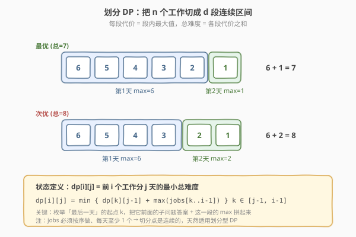
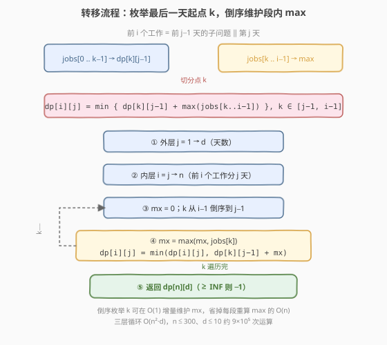

# LeetCode 工作计划的最低难度 题解

## 1. 题目概述

- **标题 / 题号**：工作计划的最低难度（#1335，medium）
- **链接**：https://leetcode.cn/problems/minimum-difficulty-of-a-job-schedule/
- **难度**：中等
- **标签**：数组、动态规划、划分型 DP、单调栈

**题意**：你需要制定一份工作计划。给定一个整数数组 `jobDifficulty`，第 `i` 个工作的难度为 `jobDifficulty[i]`。工作之间存在**依赖关系**——必须**按顺序**完成（先做下标小的，再做下标大的）。你计划在 `d` 天内完成所有 `n` 个工作，且每天**至少做一个**工作。

每天的「难度」定义为当天所做工作中**难度最大值**；总难度为各天难度之和。请你返回能完成所有工作的**最低总难度**。若无法在 `d` 天内完成（工作数少于天数），返回 `-1`。

**示例 1**：

```text
输入：jobDifficulty = [6,5,4,3,2,1], d = 2
输出：7
解释：第 1 天做 [6,5,4,3,2]，难度 = max = 6；第 2 天做 [1]，难度 = 1。
      总难度 = 6 + 1 = 7，这是所有 2 段切分中最低的。
```

**示例 2**：

```text
输入：jobDifficulty = [9,9,9], d = 4
输出：-1
解释：只有 3 个工作，无法分给 4 天（每天至少 1 个）。
```

**示例 3**：

```text
输入：jobDifficulty = [1,1,1], d = 3
输出：3
解释：每天做 1 个工作，每天难度 1，总难度 3。
```

**约束**：

- `1 <= jobDifficulty.length <= 300`
- `0 <= jobDifficulty[i] <= 1000`
- `1 <= d <= 10`

> 💡 本题的灵魂是「**按最后一天切分**」——n 个工作必须切成 d 段连续区间，每段代价是段内最大值，求总代价最小。这是典型的**划分型 DP**：固定「最后一段」的起点，把它前面的子问题答案与这一段的 max 拼起来，枚举所有切分点取最小。

## 2. 解题思路

### 2.1 暴力思路：枚举所有切分点组合

最直观的做法：在 `n` 个工作之间的 `n-1` 个空隙里选 `d-1` 个切分点，把数组分成 `d` 段。每种切分对应一种调度方案，计算其总难度（每段取 max 再求和），取所有方案的最小值。

问题在于——

- **方案数指数级**：从 `n-1` 个空隙选 `d-1` 个，共 $\binom{n-1}{d-1}$ 种。$n=300, d=10$ 时这是一个天文数字（约 $10^{14}$ 量级），完全不可行；
- **大量重复计算**：不同的切分方案会反复计算同一段的 `max` 和同一段前缀的子问题答案，没有复用。

> ⚠️ 这种「枚举组合」的写法在小数据上能跑，但**完全没有利用「前缀子问题的最优解可复用」的性质**——把前 `k` 个工作分成 `j-1` 天的最优答案，与后面怎么切无关，算一次就够了。这正是 DP 的切入点。

### 2.2 核心观察：划分型 DP（按最后一天切分）



**关键洞察**：定义 `dp[i][j]` = 前 `i` 个工作（下标 `0..i-1`）分成 `j` 天的**最小总难度**。考虑「**最后一天**」做了哪些工作——它必然是一段**连续的后缀** `jobs[k..i-1]`（`k` 是最后一天的起点），而前面 `jobs[0..k-1]` 恰好分成 `j-1` 天。于是：

$$
dp[i][j] = \min_{k \in [j-1,\, i-1]} \Big\{\, dp[k][j-1] + \max(\text{jobs}[k..i-1])\,\Big\}
$$

1. **`k` 是切分点**：最后一天覆盖 `jobs[k..i-1]`，前 `j-1` 天覆盖 `jobs[0..k-1]`（即前 `k` 个工作）；
2. **`k` 的范围**：`k >= j-1`（前 `j-1` 天至少要 `j-1` 个工作），`k <= i-1`（最后一天至少 1 个工作）；
3. **段内 max**：`max(jobs[k..i-1])` 是最后一天的难度，前缀 `dp[k][j-1]` 是子问题最优解，二者独立可拼。

> 以示例 1 的 `dp[6][2]` 为例：枚举最后一天的起点 `k` 从 5 到 1。`k=5` 时最后一天 = `[1]`（max=1），前缀 = `dp[5][1]=6`，合计 7；`k=4` 时最后一天 = `[2,1]`（max=2），前缀 = `dp[4][1]=6`，合计 8……取最小得 7。这就是答案。

> ⚠️ **为什么按「最后一天」切而不是「第一天」？** 两种等价，但按最后一天切能让「段内 max」随 `k` 倒序枚举时**增量维护**（见 2.3），把 $O(n^3 d)$ 降到 $O(n^2 d)$。若按第一天切，max 在前缀上、随 `k` 正向增长也能增量，但题目天然按后缀分段更直观。这与 [813. 最大平均值和的分组](../0801-0900/813_最大平均值和的分组.md) 的划分型 DP 模板完全同构。

### 2.3 算法流程图



**`dp[i][j]` 计算流程**（三层循环）：

1. **外层天数**：`j = 1 → d`；
2. **中层结束位置**：`i = j → n`（前 `i` 个工作分 `j` 天，至少 `j` 个工作）；
3. **内层切分点**：`k` 从 `i-1` **倒序**到 `j-1`，维护 `mx = max(jobs[k..i-1])`；
   - 倒序枚举使得 `mx` 每步只需 `mx = max(mx, jobs[k])`，**O(1) 增量**更新，无需每段重算 max；
4. **状态转移**：`dp[i][j] = min(dp[i][j], dp[k][j-1] + mx)`；
5. **入口**：`dp[0][0] = 0`（0 个工作 0 天代价 0），其余 `dp[i][0]`、`dp[0][j]` 为 `INF`；
6. **出口**：`dp[n][d]`，若 `>= INF` 返回 `-1`（无法划分）。

> 💡 **倒序枚举 k 是降复杂度的关键**：若 `k` 正向枚举（从 `j-1` 到 `i-1`），段 `jobs[k..i-1]` 的左端在动、右端固定，`mx` 无法简单增量，需每段 $O(n)$ 重算，总 $O(n^3 d)$。倒序时左端 `k` 从 `i-1` 往左移，段「向左生长」，新加入的 `jobs[k]` 与旧 `mx` 取 max 即可——$O(1)$ 摊还。这与 [1278. 分割回文串 III](../1201-1300/1278_分割回文串III.md) 中「预处理区间代价避免重复计算」是同一思想。

### 2.4 示例演算

以示例 1 的 `jobs=[6,5,4,3,2,1]`、`d=2` 为例，dp 表（行=天数 `j`，列=工作数 `i`）填充如下：

![示例 1 dp 表填充与 dp[6][2] 的切分点枚举](../images/1335_example_walkthrough.svg)

- **`j=1` 行**：前 `i` 个工作全放 1 天，难度 = 前缀 max。由于 `jobs[0]=6` 是全局最大，`dp[i][1] = 6`（对所有 `i`）。
- **`j=2` 行**：对每个 `i` 枚举切分点 `k`。以 `dp[6][2]` 为例，枚举 `k=5..1`：

| k | dp[k][1] | max(jobs[k..5]) | 求和 |
|---|----------|------------------|------|
| 5 | 6 | 1 | **7** ← min |
| 4 | 6 | 2 | 8 |
| 3 | 6 | 3 | 9 |
| 2 | 6 | 4 | 10 |
| 1 | 6 | 5 | 11 |

`dp[6][2] = 7`，对应切分 `k=5`：前 5 个工作 1 天（max=6）+ 最后 1 个工作 1 天（max=1）。

> 💡 **为什么 `k=5` 最优？** 因为 `jobs` 是**递减**的，最后一天越短（只含最小的 `1`），其 max 越小（=1）；而前缀的 `dp[5][1]=6` 不变（前缀 max 恒为 6）。把「大值」尽量塞进已有高代价的天，把「小值」单独成天，是递减序列的最优策略。反之若 `jobs` 递增，单段 max 会随长度增长，最优切分倾向均衡——这正是 DP 自动权衡的体现。

> ⚠️ **`n < d` 直接返回 -1**：每天至少 1 个工作，工作数不足天数时无解。这是入口处必须先判的边界（示例 2）。

## 3. 参考代码

### C++

```cpp
// 工作计划的最低难度.cpp —— 划分型 DP，O(n^2·d)
// 编译: g++ -O2 -std=c++17 工作计划的最低难度.cpp -o job_sched
#include <vector>
#include <algorithm>
#include <climits>
using namespace std;

class Solution {
public:
    int minDifficulty(vector<int>& jobDifficulty, int d) {
        int n = jobDifficulty.size();
        if (n < d) return -1;                       // 工作数不足天数，无解
        const int INF = INT_MAX / 2;                // 防 + 溢出
        vector<vector<int>> dp(n + 1, vector<int>(d + 1, INF));
        dp[0][0] = 0;                               // 0 个工作 0 天代价 0
        for (int j = 1; j <= d; ++j) {              // ① 枚举天数
            for (int i = j; i <= n; ++i) {          // ② 前 i 个工作分 j 天
                int mx = 0;                         // ③ 倒序维护段内 max
                for (int k = i - 1; k >= j - 1; --k) {
                    mx = max(mx, jobDifficulty[k]);
                    dp[i][j] = min(dp[i][j], dp[k][j - 1] + mx);  // ④ 转移
                }
            }
        }
        return dp[n][d] >= INF ? -1 : dp[n][d];
    }
};
```

### Python

```python
class Solution:
    def minDifficulty(self, jobDifficulty: list[int], d: int) -> int:
        n = len(jobDifficulty)
        if n < d:                                   # 工作数不足天数，无解
            return -1
        INF = float('inf')
        dp = [[INF] * (d + 1) for _ in range(n + 1)]
        dp[0][0] = 0                                # 0 个工作 0 天代价 0
        for j in range(1, d + 1):                   # ① 枚举天数
            for i in range(j, n + 1):               # ② 前 i 个工作分 j 天
                mx = 0                              # ③ 倒序维护段内 max
                for k in range(i - 1, j - 2, -1):
                    mx = max(mx, jobDifficulty[k])
                    dp[i][j] = min(dp[i][j], dp[k][j - 1] + mx)  # ④ 转移
        return -1 if dp[n][d] >= INF else dp[n][d]
```

> 💡 两版等价，核心只有三层循环：外层天数、中层结束位置、内层倒序枚举切分点并增量维护 `mx`。`dp[0][0]=0` 是唯一合法基底，其余 `INF` 保证非法状态不参与转移。`n < d` 的早返回既优化也防 `dp` 表下标越界。

## 4. 复杂度分析

| 维度 | 划分型 DP（推荐） | 暴力枚举组合 |
|------|------------------|--------------|
| 时间复杂度 | $O(n^2 d)$（三层循环，内层 O(1) 增量） | $O(\binom{n-1}{d-1} \cdot n)$（指数级） |
| 空间复杂度 | $O(nd)$（二维 dp 表） | $O(d)$（存切分点） |
| 实际运算量 | $n=300, d=10$ 约 $9 \times 10^5$，毫秒级 | 不可行 |

> ⚠️ **空间可优化**：`dp[i][j]` 只依赖 `dp[k][j-1]`（上一行），可用**滚动数组**降到 $O(n)$。但 $nd = 3000$ 的二维表已极小，滚动数组收益有限且牺牲可读性，面试中建议保留二维表便于解释。若要优化，见第 5 节的单调栈解法（同时优化时间到 $O(nd)$，并用一维滚动数组）。

## 5. 扩展：单调栈优化 O(nd)

三层循环的瓶颈在于「对每个 `(j, i)` 枚举所有 `k`」。注意到转移式 $dp[i][j] = \min_k \{ dp[k][j-1] + \max(\text{jobs}[k..i-1]) \}$ 中，**段内 max 随 `i` 右移呈单调结构**——可用单调栈把内层枚举均摊到 $O(1)$，总复杂度降到 $O(nd)$。

**思路**：固定天数 `j`，从左到右扫描 `i`。维护一个**单调递减栈**（栈中下标对应的 `jobs` 值从栈底到栈顶严格递减）。对每个新位置 `i`（难度 `x = jobs[i-1]`）：

1. 新的单元素段 `k=i-1` 贡献 `prev[i-1] + x`（`prev` = 上一行 `dp[·][j-1]`）；
2. 弹出栈顶所有 `jobs[t] <= x` 的元素——这些段的 max 被 `x`「接管」，合并成一段，记录这些段中 `prev[k]` 的最小值 `cur_min`；
3. 合并段贡献 `cur_min + x`，与栈内剩余段（max 不变）的贡献取最小，即为 `dp[i][j]`；
4. 把 `(i, cur_min, 累计最小贡献)` 压栈。

栈中每个元素存 `(下标, 该段 prev 最小值, 栈内累计最小贡献)`，使 `dp[i][j]` 直接等于栈顶的累计最小。

```python
class Solution:
    def minDifficulty(self, jobDifficulty: list[int], d: int) -> int:
        n = len(jobDifficulty)
        if n < d:
            return -1
        # day 0：前 i 个工作放 1 天 = 前缀 max
        dp = []
        cur = 0
        for x in jobDifficulty:
            cur = max(cur, x)
            dp.append(cur)
        # day 1..d-1：单调栈优化
        for k in range(1, d):
            prev = dp                               # 上一行 dp[k-1][·]
            dp = [float('inf')] * n
            stack = []                              # (下标, 该段 prev 最小值, 累计最小贡献)
            for i in range(k, n):                   # 前 i+1 个工作分 k+1 天
                x = jobDifficulty[i]
                cur_min = prev[i - 1]               # 单元素段 p=i
                while stack and jobDifficulty[stack[-1][0]] <= x:
                    _, mg, _ = stack.pop()
                    cur_min = min(cur_min, mg)           # 被接管的段取 prev 最小
                below = stack[-1][2] if stack else float('inf')
                best = min(cur_min + x, below)           # 合并段 vs 栈内剩余段
                stack.append((i, cur_min, best))
                dp[i] = best
        return dp[n - 1]
```

> ⚠️ 单调栈版**正确性依赖一个不变式**：栈中下标对应的 `jobs` 值严格递减，每个栈元素代表「以该下标为段尾、max 等于该下标难度」的一组切分点 `k`；弹栈时这些段的 max 被新元素接管，`prev` 最小值被合并。这与 [739. 每日温度](../0701-0800/739_每日温度.md) 中「弹栈即确定边界」是同一类单调栈套路，但此处维护的是「最小代价」而非「下标距离」。$n \leq 300, d \leq 10$ 时 $O(n^2 d)$ 已足够快，单调栈版主要作为**面试加分项**或 $n$ 更大时的优化。

## 6. 面试要点

1. **为什么用划分型 DP？怎么想到的？**

   > 题目要求「把有序序列切成 `d` 段连续区间、每段代价可独立计算、求总代价最优」——这是划分型 DP 的标准信号。关键判据：①序列有序（工作必须按序做）→ 切分点连续；②段代价可独立计算（段内 max）；③前缀子问题与后缀切分独立（前 `k` 个工作分 `j-1` 天的最优解与第 `j` 天怎么切无关）。三者齐备即可套 `dp[i][j] = min_k { 前缀答案 + 段代价 }` 模板。

2. **为什么内层 `k` 要倒序枚举？**

   > 倒序（`k` 从 `i-1` 到 `j-1`）让段 `jobs[k..i-1]` 的左端向左生长，新加入的 `jobs[k]` 与旧 `mx` 取 max 即可 $O(1)$ 增量更新。若正向枚举，段左端右移、右端固定，`mx` 无法增量，每段需 $O(n)$ 重算，总 $O(n^3 d)$。这是「**让区间单端生长以复用 max**」的通用技巧——凡转移式含 `max(区间)` 都值得想一下能否倒序增量。

3. **`dp[0][0]=0` 之外为什么全是 `INF`？**

   > `dp[i][0]`（`i>0`，有工作却 0 天）和 `dp[0][j]`（`j>0`，0 个工作却要 `j` 天）都是非法状态，置 `INF` 保证它们不参与 `min` 转移。`INF` 取 `INT_MAX/2` 防 `+ mx` 溢出。最终 `dp[n][d]` 若仍 `>= INF` 说明无合法划分，返回 `-1`——但本题已用 `n < d` 早返回拦截，此分支主要为防御。

4. **`n < d` 为什么直接返回 -1？**

   > 每天至少 1 个工作，`d` 天至少需 `d` 个工作。`n < d` 时无论怎么切都有天分不到工作，无解。除优化外，它还避免 `dp` 表中 `i < j` 的非法列被访问（内层 `k` 下界 `j-1` 可能越界）。这是「**调度/划分类问题的可行性预判**」，与 [410. 分割数组的最大值](../0401-0500/410_分割数组的最大值.md) 中 `m > n` 返回非法同构。

5. **本题和 [410. 分割数组的最大值](../0401-0500/410_分割数组的最大值.md) 有何区别？**

   > 410 是「**最小化最大段和**」（min-max 型，所有段和的最大值尽量小），可用二分答案 + 贪心验证 $O(n \log S)$；1335 是「**最小化段 max 之和**」（sum-of-max 型），max 与和耦合，无法二分，必须 DP。两者都是「划分 `n` 个工作成 `d` 段」，但目标函数不同导致解法分野：min-max 型常可二分（因为「最大段和 <= X」有单调性），sum-of-max 型则需精确 DP 枚举切分点。

> 💡 **一句话总结**：1335 的灵魂是「**按最后一天切分**」——`dp[i][j]` 枚举最后一段的起点 `k`，拼上前缀子问题 `dp[k][j-1]` 与段内 `max`，倒序枚举让 max 增量维护到 $O(1)$，总 $O(n^2 d)$。这个「划分型 DP + 倒序增量维护区间聚合值」的模板，是所有「有序序列切段、段代价独立」问题的通用范式。

## 同类练习题

| # | 题目 | 与本题的关联 |
|---|------|-------------|
| 813 | [最大平均值和的分组](../0801-0900/813_最大平均值和的分组.md) | 同为划分型 DP，`dp[i][k] = max_j { dp[j][k-1] + avg(j+1..i) }`，结构完全同构，仅段代价从 max 换成平均值（需前缀和 O(1) 算 avg） |
| 410 | [分割数组的最大值](../0401-0500/410_分割数组的最大值.md) | 同为「n 个工作分 d 段」，但目标是 min-max（最小化最大段和）可二分答案，对照 1335 的 sum-of-max 必须精确 DP——min-max vs sum-of-max 的解法分野 |
| 1043 | [分隔数组以得到最大和](../1001-1100/1043_分隔数组以得到最大和.md) | 划分型 DP，段代价 = 段长 × 段内 max（max 经变换后参与求和），承接 1335 的「段内 max + 拼接」思想但段长有上限 |
| 1278 | [分割回文串 III](../1201-1300/1278_分割回文串III.md) | 划分型 DP，段代价 = 把段改成回文串的最小修改数（需预处理区间代价表），对照 1335 的「段代价可增量计算」——当段代价无法 O(1) 增量时如何预处理 |
| 1011 | [在 D 天内送达包裹的能力](../1001-1100/1011_在D天内送达包裹的能力.md) | 同为「n 个工作 d 天」调度框架，但目标是判定型（能力是否够）走二分答案，与 1335 的最优化型 DP 形成对照——同一题面下「判定 vs 优化」决定二分还是 DP |
