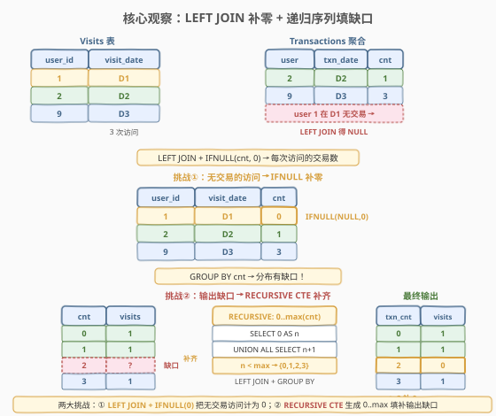
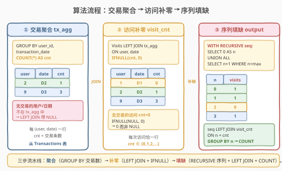
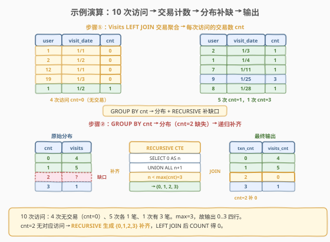

# 每次访问的交易次数

- **题目名称**：每次访问的交易次数
- **链接**：[1336. 每次访问的交易次数](https://leetcode.cn/problems/number-of-transactions-per-visit/)
- **难度**：困难
- **标签**：数据库、SQL、LEFT JOIN、递归 CTE、WITH RECURSIVE、IFNULL、GROUP BY、序列生成、补齐缺口

## 1. 题目概述

给定 `Visits` 表与 `Transactions` 表，记录银行客户的访问与交易数据。编写 SQL 查询，统计**每次访问对应的交易笔数分布**——即：做了 0 笔交易的访问有多少次、做了 1 笔的有多少次、做了 2 笔的有多少次……依此类推。

> ⚠️ 两大难点：① **无交易的访问**——`Visits` 表中有访问但 `Transactions` 表中无对应记录，需计为 0 笔而非忽略；② **输出缺口补齐**——`transactions_count` 必须覆盖 $0$ 到 $\max(\text{transactions\_count})$ 的所有整数，即使某个计数无对应访问（`visits_count = 0`），也要输出该行。

**表结构**：

```text
Table: Visits
+---------------+---------+
| Column Name   | Type    |
+---------------+---------+
| user_id       | int     |  ← 用户 ID
| visit_date    | date    |  ← 访问日期
+---------------+---------+
(user_id, visit_date) 是主键（联合唯一）。
每行表示某用户在某天访问了银行。
```

```text
Table: Transactions
+------------------+---------+
| Column Name      | Type    |
+------------------+---------+
| user_id          | int     |  ← 用户 ID
| transaction_date | date    |  ← 交易日期
| amount           | int     |  ← 交易金额
+------------------+---------+
无主键，可能包含重复行。
每行表示某用户在某天做了一笔金额为 amount 的交易。
保证用户在 transaction_date 当天一定访问过银行
（即 Visits 表中存在 (user_id, transaction_date) 行）。
```

- `Visits` 主键为 `(user_id, visit_date)`，即同一用户同一天只有一次访问
- `Transactions` 无主键，同一 `(user_id, transaction_date)` 可有多行（多笔交易）
- **关键保证**：每笔交易的日期一定对应一次访问

**示例 1**：

```text
输入：
Visits 表：
+---------+------------+
| user_id | visit_date |
+---------+------------+
| 1       | 2020-01-01 |
| 2       | 2020-01-02 |
| 12      | 2020-01-01 |
| 19      | 2020-01-03 |
| 1       | 2020-01-02 |
| 2       | 2020-01-03 |
| 1       | 2020-01-04 |
| 7       | 2020-01-11 |
| 9       | 2020-01-25 |
| 8       | 2020-01-28 |
+---------+------------+
Transactions 表：
+---------+------------------+--------+
| user_id | transaction_date | amount |
+---------+------------------+--------+
| 1       | 2020-01-02       | 120    |
| 2       | 2020-01-03       | 22     |
| 7       | 2020-01-11       | 232    |
| 1       | 2020-01-04       | 7      |
| 9       | 2020-01-25       | 33     |
| 9       | 2020-01-25       | 66     |
| 8       | 2020-01-28       | 1      |
| 9       | 2020-01-25       | 99     |
+---------+------------------+--------+

输出：
+--------------------+--------------+
| transactions_count | visits_count |
+--------------------+--------------+
| 0                  | 4            |
| 1                  | 5            |
| 2                  | 0            |
| 3                  | 1            |
+--------------------+--------------+
```

**解释**：

| (user_id, visit_date) | 交易笔数 cnt | 说明 |
|------------------------|-------------|------|
| (1, 2020-01-01) | 0 | 无交易 |
| (2, 2020-01-02) | 0 | 无交易 |
| (12, 2020-01-01) | 0 | 无交易 |
| (19, 2020-01-03) | 0 | 无交易 |
| (1, 2020-01-02) | 1 | 交易 120 |
| (2, 2020-01-03) | 1 | 交易 22 |
| (1, 2020-01-04) | 1 | 交易 7 |
| (7, 2020-01-11) | 1 | 交易 232 |
| (8, 2020-01-28) | 1 | 交易 1 |
| (9, 2020-01-25) | 3 | 交易 33, 66, 99 |

> 💡 10 次访问中：4 次无交易（cnt=0）、5 次各 1 笔、1 次 3 笔。max=3，故输出 $0..3$ 四行。cnt=2 无对应访问 → `visits_count = 0`，但**必须输出该行**。

**约束条件**：

- 结果包含 `transactions_count` 与 `visits_count` 两列
- `transactions_count` 取 $0$ 到 $\max(\text{transactions\_count})$ 的所有整数值
- 按 `transactions_count` 升序排列
- 即使某 `transactions_count` 无对应访问，也要输出 `visits_count = 0`

---

## 2. 解题思路

### 2.1 暴力思路：直接 GROUP BY

最直觉的写法是先 `LEFT JOIN` 再 `GROUP BY cnt`：

```sql
SELECT IFNULL(t.cnt, 0) AS transactions_count,
       COUNT(*) AS visits_count
FROM Visits v
LEFT JOIN (
    SELECT user_id, transaction_date, COUNT(*) AS cnt
    FROM Transactions
    GROUP BY user_id, transaction_date
) t
  ON v.user_id = t.user_id
 AND v.visit_date = t.transaction_date
GROUP BY IFNULL(t.cnt, 0)
ORDER BY transactions_count;
```

这个查询能处理「无交易访问计为 0」的问题（`IFNULL`），但有个**致命缺陷**：`GROUP BY` 只输出**实际存在的 cnt 值**。若某个 cnt 值（如 2）没有任何访问对应，`GROUP BY` 不会生成该行——输出会缺少 `transactions_count = 2` 这一行，只有 3 行而非 4 行。

> ⚠️ `GROUP BY` 的本质是「按已有值分组」——不存在的值不会凭空出现。要输出 $0..\max$ 的**完整序列**，必须先用某种方式**生成这些数字**，再 `LEFT JOIN` 补齐。

### 2.2 核心观察：LEFT JOIN 补零 + 递归序列填缺口



本题有两大挑战，需分两步解决：

**挑战①：无交易的访问 → IFNULL 补零**

`Visits` 表中有些访问在 `Transactions` 表中没有对应记录（用户来了但没做交易）。若用 `INNER JOIN`，这些访问会被丢弃——但题目要求它们计入 `transactions_count = 0`。

解决：用 `LEFT JOIN` 保留所有访问，缺失的交易计数用 `IFNULL(cnt, 0)` 填 0。

$$
\text{cnt}(\text{visit}) = \text{IFNULL}\big(\text{COUNT}(\text{transactions}),\; 0\big)
$$

> 💡 **为何先聚合再 JOIN**：`Transactions` 同一 `(user_id, transaction_date)` 可有多行（多笔交易）。若直接 `LEFT JOIN` 原始 `Transactions`，同一访问会重复出现多行。必须先 `GROUP BY user_id, transaction_date` 聚合成「每次访问的交易笔数」，得到每个 `(user_id, date)` 恰一行的中间表，再 `LEFT JOIN`。

**挑战②：输出缺口 → RECURSIVE CTE 生成连续序列**

`GROUP BY cnt` 只输出实际存在的 cnt 值。若 $0..\max$ 中某个值（如 2）无对应访问，输出会缺该行。题目要求**完整覆盖 $0..\max$**。

解决：用 MySQL 8.0+ 的**递归 CTE**（`WITH RECURSIVE`）生成 $0, 1, 2, \ldots, \max(\text{cnt})$ 的连续整数序列，再 `LEFT JOIN` 访问计数表，缺失的计数自然得 `visits_count = 0`。

$$
\text{seq} = \{\, 0,\; 1,\; 2,\; \ldots,\; \max(\text{cnt}) \,\}
$$

> 💡 **递归 CTE 的本质**：`SELECT 0` 是锚点（anchor），`UNION ALL SELECT n+1 FROM seq WHERE n < max` 是递归成员（recursive member）。每次迭代在上一轮结果基础上 `+1`，直到达到 `max(cnt)` 停止。这等价于一个 `for (n=0; n<=max; n++)` 循环——但用 SQL 集合语言表达。

### 2.3 算法流程图



**三步流水线**：

1. **交易聚合** `tx_agg`：`GROUP BY user_id, transaction_date` + `COUNT(*)`，得到每次有交易的访问的交易笔数。
2. **访问补零** `visit_cnt`：`Visits LEFT JOIN tx_agg` + `IFNULL(cnt, 0)`，为每次访问附加交易笔数（无交易 → 0）。
3. **序列填缺** `output`：`RECURSIVE CTE` 生成 $0..\max$ 序列 → `LEFT JOIN visit_cnt` → `GROUP BY n` + `COUNT` → 缺失计数得 0。

> 💡 **三步的角色**：第一步把明细行收缩成「每次访问一笔数」；第二步把所有访问都纳入（含 0 笔的）；第三步把输出序列补完整（含 0 次访问的计数）。前两步解决「数据层面」的完整性，第三步解决「输出层面」的完整性。

### 2.4 示例演算

以示例 1 数据（10 次访问、8 笔交易），跟踪「聚合 → 补零 → 填缺」全过程：



**步骤 ①：交易聚合 `tx_agg`**

`GROUP BY user_id, transaction_date` + `COUNT(*)`，把 8 行交易收缩为 6 组：

| user_id | transaction_date | cnt |
|---------|------------------|-----|
| 1 | 2020-01-02 | 1 |
| 2 | 2020-01-03 | 1 |
| 7 | 2020-01-11 | 1 |
| 1 | 2020-01-04 | 1 |
| 9 | 2020-01-25 | 3 |
| 8 | 2020-01-28 | 1 |

> 💡 user 9 在 1/25 有 3 笔交易（33, 66, 99），聚合后 cnt=3。

**步骤 ②：访问补零 `visit_cnt`**

`Visits LEFT JOIN tx_agg` + `IFNULL(cnt, 0)`，10 次访问全部保留：

| user_id | visit_date | cnt | 来源 |
|---------|------------|-----|------|
| 1 | 2020-01-01 | **0** | IFNULL 补零（无交易） |
| 2 | 2020-01-02 | **0** | IFNULL 补零 |
| 12 | 2020-01-01 | **0** | IFNULL 补零 |
| 19 | 2020-01-03 | **0** | IFNULL 补零 |
| 1 | 2020-01-02 | 1 | JOIN 命中 |
| 2 | 2020-01-03 | 1 | JOIN 命中 |
| 1 | 2020-01-04 | 1 | JOIN 命中 |
| 7 | 2020-01-11 | 1 | JOIN 命中 |
| 8 | 2020-01-28 | 1 | JOIN 命中 |
| 9 | 2020-01-25 | 3 | JOIN 命中 |

> 💡 4 次访问无交易 → cnt=0（IFNULL 补零）；6 次有交易 → cnt 从 tx_agg 取。

**步骤 ③：序列填缺 `output`**

`max(cnt) = 3` → RECURSIVE 生成 $\{0, 1, 2, 3\}$ → `LEFT JOIN visit_cnt ON n = cnt` → `GROUP BY n` + `COUNT`：

| n（序列） | 匹配的访问 | visits_count |
|-----------|-----------|--------------|
| 0 | (1,1/1), (2,1/2), (12,1/1), (19,1/3) | **4** |
| 1 | (1,1/2), (2,1/3), (1,1/4), (7,1/11), (8,1/28) | **5** |
| 2 | 无匹配 | **0**（LEFT JOIN 补零） |
| 3 | (9,1/25) | **1** |

> 💡 **验证**：$4 + 5 + 0 + 1 = 10$ = 总访问数，无损。cnt=2 无匹配 → `LEFT JOIN` 得 `NULL` → `COUNT(user_id)` 忽略 NULL 得 0。输出 4 行，完整覆盖 $0..3$。

---

## 3. 参考代码

### MySQL（解法 A：WITH RECURSIVE，推荐）

```sql
# 1336. 每次访问的交易次数
# 思路：交易聚合 → Visits LEFT JOIN 补零 → RECURSIVE 生成 0..max 序列 → LEFT JOIN + GROUP BY
WITH RECURSIVE
    tx_agg AS (
        SELECT user_id, transaction_date, COUNT(*) AS cnt
        FROM Transactions
        GROUP BY user_id, transaction_date
    ),
    visit_cnt AS (
        SELECT v.user_id, v.visit_date, IFNULL(t.cnt, 0) AS cnt
        FROM Visits v
        LEFT JOIN tx_agg t
            ON v.user_id = t.user_id
           AND v.visit_date = t.transaction_date
    ),
    seq AS (
        SELECT 0 AS n
        UNION ALL
        SELECT n + 1
        FROM seq
        WHERE n < (SELECT MAX(cnt) FROM visit_cnt)
    )
SELECT s.n AS transactions_count,
       COUNT(v.user_id) AS visits_count
FROM seq s
LEFT JOIN visit_cnt v ON s.n = v.cnt
GROUP BY s.n
ORDER BY s.n;
```

> 💡 **写法要点**：
> - **`tx_agg`**：先 `GROUP BY user_id, transaction_date` 把交易明细收缩成「每次有交易的访问一笔」，保证后续 `LEFT JOIN` 不重复行。
> - **`visit_cnt`**：`Visits LEFT JOIN tx_agg` 保留所有访问，`IFNULL(t.cnt, 0)` 把无交易的访问计为 0。
> - **`seq`（递归 CTE）**：`SELECT 0` 锚点 + `UNION ALL SELECT n+1 FROM seq WHERE n < max(cnt)` 递归生成 $0..\max$ 序列。`UNION ALL` 比 `UNION` 略快（无需去重，序列天然无重复）。
> - **最终查询**：`seq LEFT JOIN visit_cnt ON n = cnt`，缺失的 n 值匹配不到访问 → `COUNT(v.user_id)` 忽略 NULL 得 0。
> - 需 MySQL 8.0+（`WITH RECURSIVE` 自 8.0 起支持）。

### MySQL（解法 B：CROSS JOIN 数字表，兼容 5.7）

```sql
-- 不依赖 RECURSIVE，用 CROSS JOIN 笛卡尔积生成 0..999 数字表
WITH
    digits AS (
        SELECT 0 AS d UNION ALL SELECT 1 UNION ALL SELECT 2 UNION ALL SELECT 3
        UNION ALL SELECT 4 UNION ALL SELECT 5 UNION ALL SELECT 6
        UNION ALL SELECT 7 UNION ALL SELECT 8 UNION ALL SELECT 9
    ),
    numbers AS (
        SELECT d1.d + d2.d * 10 + d3.d * 100 AS n
        FROM digits d1
        CROSS JOIN digits d2
        CROSS JOIN digits d3
    ),
    visit_cnt AS (
        SELECT v.user_id, v.visit_date, IFNULL(t.cnt, 0) AS cnt
        FROM Visits v
        LEFT JOIN (
            SELECT user_id, transaction_date, COUNT(*) AS cnt
            FROM Transactions
            GROUP BY user_id, transaction_date
        ) t
          ON v.user_id = t.user_id
         AND v.visit_date = t.transaction_date
    )
SELECT n AS transactions_count,
       COUNT(v.user_id) AS visits_count
FROM numbers
LEFT JOIN visit_cnt v ON numbers.n = v.cnt
WHERE numbers.n <= (SELECT COALESCE(MAX(cnt), 0) FROM visit_cnt)
GROUP BY n
ORDER BY n;
```

> 💡 **写法要点**：
> - **`digits`**：10 行的「数字表」（$0..9$），是构建大数序列的积木。
> - **`numbers`**：三层 `CROSS JOIN` 生成 $0..999$（$10 \times 10 \times 10 = 1000$ 行），覆盖绝大多数实际场景。若需更大范围可加第四层。
> - **`WHERE n <= COALESCE(MAX(cnt), 0)`**：过滤到 $0..\max$ 范围。`COALESCE` 处理 `visit_cnt` 为空时 `MAX` 返回 `NULL` 的边界。
> - 兼容 MySQL 5.7 等不支持 `WITH RECURSIVE` 的老版本，但生成 1000 行数字表有固定开销。
> - ⚠️ 此法**上限固定**（999），若某次访问交易笔数超过 999 会截断；实际 LeetCode 测试数据不会如此极端。

### Python（pandas）

```python
import pandas as pd

def number_of_transactions_per_visit(
    visits: pd.DataFrame, transactions: pd.DataFrame
) -> pd.DataFrame:
    tx_cnt = (
        transactions.groupby(['user_id', 'transaction_date'])
        .size()
        .reset_index(name='cnt')
    )
    merged = visits.merge(
        tx_cnt,
        left_on=['user_id', 'visit_date'],
        right_on=['user_id', 'transaction_date'],
        how='left',
    )
    merged['cnt'] = merged['cnt'].fillna(0).astype(int)

    dist = (
        merged.groupby('cnt')
        .size()
        .reset_index(name='visits_count')
        .rename(columns={'cnt': 'transactions_count'})
    )

    max_cnt = int(merged['cnt'].max()) if len(merged) > 0 else 0
    full = pd.DataFrame({'transactions_count': range(max_cnt + 1)})
    result = full.merge(dist, on='transactions_count', how='left').fillna({'visits_count': 0})
    result['visits_count'] = result['visits_count'].astype(int)
    return result[['transactions_count', 'visits_count']]
```

> 💡 **pandas 对照**：
> - `groupby(['user_id', 'transaction_date']).size()` 对应 `GROUP BY ... COUNT(*)`——得到每次有交易的访问的交易笔数。
> - `visits.merge(tx_cnt, how='left')` 对应 `Visits LEFT JOIN tx_agg`——保留所有访问。
> - `fillna(0)` 对应 `IFNULL(cnt, 0)`——无交易的访问计为 0。
> - `pd.DataFrame({'transactions_count': range(max_cnt + 1)})` 对应 RECURSIVE CTE 生成 $0..\max$ 序列——pandas 用 Python 原生 `range` 更简洁。
> - `full.merge(dist, how='left').fillna({'visits_count': 0})` 对应 `seq LEFT JOIN visit_cnt + COUNT`——缺失计数补 0。

---

## 4. 复杂度分析

| 维度 | 解法 A（RECURSIVE CTE） | 解法 B（CROSS JOIN 数字表） | pandas |
|------|------------------------|---------------------------|--------|
| **时间** | $O(m + n + k)$ | $O(m + n + D)$ | $O(m + n)$ |
| **空间** | $O(n + k)$ | $O(n + D)$ | $O(n + k)$ |
| **依赖** | MySQL 8.0+（WITH RECURSIVE） | 兼容 MySQL 5.7 | pandas |
| **上限** | 动态（$k = \max$ cnt） | 固定 999（可扩展） | 动态 |
| **推荐度** | ✓ **首选** | △ 兼容老版本 | ✓ pandas 环境 |

> - $n$ = `Visits` 表行数，$m$ = `Transactions` 表行数，$k$ = $\max(\text{cnt})$（最大交易笔数），$D$ = 数字表大小（解法 B 为 1000）
> - **解法 A**：`tx_agg` 聚合一次扫描 $O(m)$；`LEFT JOIN` $O(n)$（哈希连接）；递归 CTE 生成 $k+1$ 行 $O(k)$；最终 `GROUP BY` $O(n + k)$。总体 $O(m + n + k)$。空间存 `visit_cnt` $O(n)$ 与 `seq` $O(k)$。
> - **解法 B**：数字表生成 $O(D)$（固定 1000）；其余与解法 A 相同。总体 $O(m + n + D)$。空间存数字表 $O(D)$。
> - **pandas**：`groupby` + `merge` 均为 $O(m + n)$；`range` 生成 $O(k)$。总体 $O(m + n)$。
> - **索引优化**：在 `(user_id, transaction_date)` 上建复合索引可加速 `tx_agg` 的 `GROUP BY` 与 `LEFT JOIN` 的等值匹配。

---

## 5. 扩展：递归 CTE 与「补齐输出」模式

### 5.1 WITH RECURSIVE 语法详解

MySQL 8.0+ 支持的递归 CTE（Recursive Common Table Expression）由**锚点**与**递归成员**两部分组成，用 `UNION [ALL]` 连接：

```sql
WITH RECURSIVE cte_name AS (
    -- 锚点：非递归的初始行
    SELECT 0 AS n
    UNION ALL
    -- 递归成员：引用自身，每次迭代基于上一轮结果
    SELECT n + 1 FROM cte_name WHERE n < 99
)
SELECT * FROM cte_name;
-- 结果：0, 1, 2, ..., 99（共 100 行）
```

执行过程等价于：

```text
第 0 轮：{0}              ← 锚点
第 1 轮：{0} ∪ {0+1=1}    ← 递归成员基于第 0 轮
第 2 轮：{0,1} ∪ {1+1=2}
...
第 99 轮：{0,...,98} ∪ {98+1=99}
第 100 轮：99 < 99 为假 → 终止
最终：{0, 1, 2, ..., 99}
```

> 💡 **UNION vs UNION ALL**：递归 CTE 中 `UNION` 会去重（额外排序开销），`UNION ALL` 不去重。生成严格递增序列时无重复，用 `UNION ALL` 更高效。

### 5.2 生成数字序列的多种方法

SQL 中生成连续整数序列有三种常见方法：

| 方法 | 语法 | 适用场景 | 优缺点 |
|------|------|---------|--------|
| **RECURSIVE CTE** | `WITH RECURSIVE seq AS (...)` | MySQL 8.0+ / PostgreSQL / SQLite | 动态上限，最优雅；需数据库支持 |
| **CROSS JOIN 数字表** | `digits CROSS JOIN digits ...` | 全版本兼容 | 上限固定，写法冗长；不依赖递归 |
| **预建 numbers 表** | `SELECT n FROM numbers WHERE n <= max` | 有权限建表的场景 | 一次性建表，查询最简；需维护 |

> 💡 本题解法 A 用 RECURSIVE CTE（动态上限，最简洁），解法 B 用 CROSS JOIN 数字表（兼容老版本）。实际工程中若频繁需要序列，建议预建 `numbers` 表并建索引。

### 5.3 「补齐输出」泛化模板

所有「输出必须覆盖 $0..\max$ 的完整序列，缺失值填 0」的需求都套同一模板：

```sql
-- 泛化模板：生成 0..max 序列 + LEFT JOIN 补齐缺失
WITH RECURSIVE seq AS (
    SELECT 0 AS n
    UNION ALL
    SELECT n + 1 FROM seq
    WHERE n < (SELECT MAX(<count_col>) FROM <agg_table>)
)
SELECT s.n AS <bucket_col>,
       COUNT(t.<id_col>) AS <count_col>
FROM seq s
LEFT JOIN <agg_table> t ON s.n = t.<count_col>
GROUP BY s.n
ORDER BY s.n;
```

常见变体：

| 需求 | 分桶列 | 计数列 | 示例 |
|------|--------|--------|------|
| 每次访问的交易数分布 | transactions_count | visits_count | 本题 1336 |
| 每人订单数分布 | orders_count | customers_count | 类似变体 |
| 每天事件数分布 | events_count | days_count | 按天分桶 |

### 5.4 LEFT JOIN + IFNULL 模式

本题的另一个核心模式是「LEFT JOIN 保留全部左表行 + IFNULL 填默认值」。这与 [1308. 不同性别每日分数总计](../1301-1400/1308_不同性别每日分数总计.md) 的「CROSS JOIN 补齐网格」属于同一家族——都是**补齐缺失数据**：

| 模式 | 补什么 | 怎么补 | 示例 |
|------|--------|--------|------|
| **LEFT JOIN + IFNULL** | 缺失的右表行 | `LEFT JOIN` 保留左行 + `IFNULL(NULL, 0)` | 本题：无交易的访问 → cnt=0 |
| **CROSS JOIN 网格** | 缺失的 (分组 × 时间) 组合 | `CROSS JOIN` 造完整骨架 + `LEFT JOIN` 填值 | 1308：(F, 3) 缺失 → 填 0 |
| **RECURSIVE 序列** | 缺失的输出分桶 | 生成 $0..\max$ 序列 + `LEFT JOIN` 补零 | 本题：cnt=2 缺失 → visits=0 |

> 💡 三种补齐的本质区别：LEFT JOIN 补的是**行级缺失**（某访问无交易），CROSS JOIN 补的是**组合级缺失**（某分组在某时间点无数据），RECURSIVE 序列补的是**输出级缺失**（某分桶无对应行）。本题同时用到前两种和第三种——先 LEFT JOIN 补行级、再 RECURSIVE 补输出级。

---

## 6. 面试要点

1. **为什么不能直接 `GROUP BY cnt`？缺什么？**

   > `GROUP BY` 只输出**实际存在的 cnt 值**。若某个计数（如 2）没有任何访问对应，`GROUP BY` 不会生成该行——输出会缺少 `transactions_count = 2` 这一行。题目要求覆盖 $0..\max$ 的所有整数，故必须先用 RECURSIVE CTE 生成完整序列，再 `LEFT JOIN` 补齐。

2. **为什么用 `LEFT JOIN` 而不是 `INNER JOIN`？**

   > `Visits` 表中有些访问在 `Transactions` 表中无对应记录（用户来了但没做交易）。`INNER JOIN` 会丢弃这些访问，导致 `transactions_count = 0` 的行缺失。`LEFT JOIN` 保留所有访问，缺失的交易计数用 `IFNULL(cnt, 0)` 填 0，使无交易访问正确计入 cnt=0 分桶。

3. **为什么要先 `GROUP BY user_id, transaction_date` 聚合，再 LEFT JOIN？**

   > `Transactions` 同一 `(user_id, transaction_date)` 可有多行（多笔交易）。若直接 `LEFT JOIN` 原始 `Transactions`，同一访问会重复出现多行（有几笔交易就重复几行），后续 `GROUP BY cnt` 会重复计数。先 `GROUP BY` 聚合成「每次访问一笔」，保证 `LEFT JOIN` 后每个访问恰一行。

4. **`WITH RECURSIVE` 的执行原理是什么？**

   > 递归 CTE 由锚点（`SELECT 0`）和递归成员（`SELECT n+1 FROM seq WHERE n < max`）组成，用 `UNION ALL` 连接。执行时先求锚点得 $\{0\}$，再反复应用递归成员：$\{0\} \to \{0, 1\} \to \{0, 1, 2\} \to \ldots$，直到递归条件 `n < max` 不满足为止。等价于 `for (n=0; n<=max; n++)` 循环，但用 SQL 集合语言表达。

5. **`COUNT(v.user_id)` 和 `COUNT(*)` 有什么区别？为什么这里用前者？**

   > `COUNT(*)` 统计所有行（含 NULL），`COUNT(v.user_id)` 只统计 `v.user_id` 非 NULL 的行。最终查询中 `seq LEFT JOIN visit_cnt` 后，缺失的 n 值（如 cnt=2）匹配不到访问，`v.user_id` 为 NULL。用 `COUNT(v.user_id)` 会忽略 NULL 得 0，用 `COUNT(*)` 会得 1（把 NULL 行也数了）。故必须用 `COUNT(v.user_id)`。

> 💡 **一句话总结**：1336 是 SQL **「LEFT JOIN 补零 + RECURSIVE 序列填缺口」招牌题**——两大挑战分两步解决：① `LEFT JOIN + IFNULL(0)` 把无交易访问计为 0；② `WITH RECURSIVE` 生成 $0..\max$ 序列 `LEFT JOIN` 补齐输出缺口。核心口诀：**「数据缺失用 LEFT JOIN + IFNULL，输出缺失用 RECURSIVE + LEFT JOIN」**。

---

## 7. 同类练习题

- [1308. 不同性别每日分数总计](https://leetcode.cn/problems/running-total-for-different-genders/)（[题解](../1301-1400/1308_不同性别每日分数总计.md)）：`CROSS JOIN` 补齐 (性别 × 日期) 网格——对照理解「CROSS JOIN 补组合缺失」与本题「RECURSIVE 补输出缺口」的异同
- [1321. 餐馆营业额变化增长](https://leetcode.cn/problems/get-the-highest-amount-of-each-restaurant/)：窗口函数 + 日期补齐——另一种「缺失行处理」场景，对比 `CROSS JOIN` 与 `RECURSIVE` 的适用边界
- [1174. 即时食物配送 II](https://leetcode.cn/problems/immediate-food-delivery-ii/)（[题解](../1101-1200/1174_即时食物配送II.md)）：`GROUP BY customer_id + MIN(order_date)` 两步聚合——对照「先聚合再 JOIN」的分层思路
- [180. 连续出现的数字](https://leetcode.cn/problems/consecutive-numbers/)（[题解](../0101-0200/180_连续出现的数字.md)）：`LAG` 窗口函数找连续行——另一种「在已有行上滑动」的范式，对比理解何时需「补齐」、何时直接窗口函数
- [603. 连续空余座位](https://leetcode.cn/problems/consecutive-available-seats/)（[题解](../0601-0700/603_连续空余座位.md)）：`LAG/LEAD` 找相邻行——窗口函数处理行间关系，对照 1336 的「LEFT JOIN + 聚合」处理跨表关系
