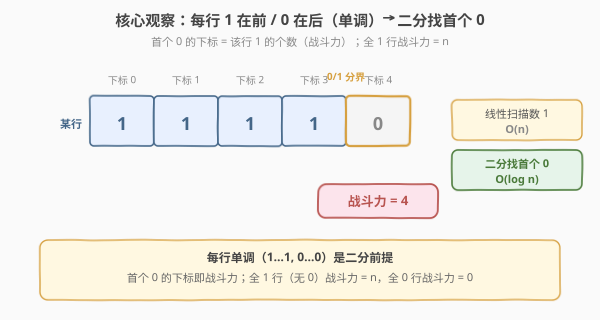
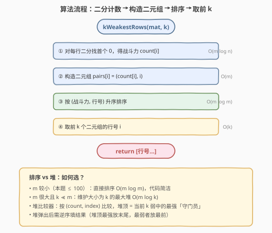
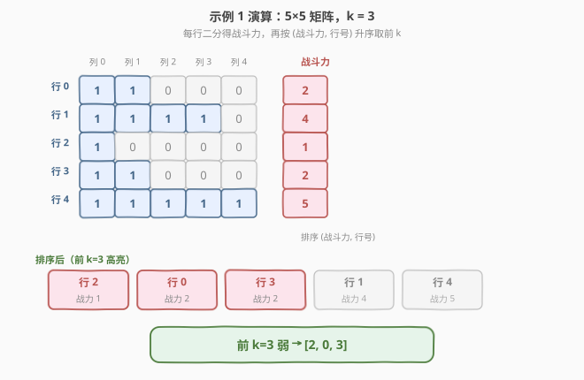

# LeetCode 矩阵中战斗力最弱的 K 行 题解

## 1. 题目概述

- **标题 / 题号**：矩阵中战斗力最弱的 K 行（#1337，easy）
- **链接**：https://leetcode.cn/problems/the-k-weakest-rows-in-a-matrix/
- **难度**：简单
- **标签**：数组、二分查找、排序、堆（优先队列）、矩阵

**题意**：给你一个大小为 `m × n` 的二进制矩阵 `mat`，由 `1`（士兵）和 `0`（平民）组成。**士兵排在平民前面**——即每一行中所有的 `1` 都出现在所有的 `0` 左侧（每行形如 `1…1, 0…0`，单调非递增）。

「第 `i` 行的战斗力」定义为该行中 `1` 的个数。行 `i` 比行 `j` **弱**，当且仅当：

- `i` 行的战斗力 `<` `j` 行的战斗力；或
- 二者战斗力相等，且 `i < j`。

请你返回矩阵中**战斗力最弱的 `k` 行**的行号，**从最弱到最强排序**。

**示例 1**：

```text
输入：mat =
[[1,1,0,0,0],
 [1,1,1,1,0],
 [1,0,0,0,0],
 [1,1,0,0,0],
 [1,1,1,1,1]],
k = 3
输出：[2,0,3]
解释：各行战斗力依次为 2,4,1,2,5。
      按 (战斗力, 行号) 升序：(1,2) (2,0) (2,3) (4,1) (5,4)
      前 k=3 弱的行号为 [2,0,3]。
```

**示例 2**：

```text
输入：mat =
[[1,0,0,0],
 [1,1,1,1],
 [1,0,0,0],
 [1,0,0,0]],
k = 2
输出：[0,2]
解释：战斗力依次 1,4,1,1。
      按 (战斗力, 行号) 升序：(1,0) (1,2) (1,3) (4,1)
      前 k=2 → [0,2]。
```

**约束**：

- `m == mat.length`，`n == mat[i].length`
- `1 <= m, n <= 100`
- `1 <= k <= m`
- 每行 `1` 全在 `0` 左侧（每行非递增有序）

> 💡 本题的灵魂是「**每行单调**」——`1…1, 0…0` 的结构让「数 1 的个数」不必线性扫描，而可用**二分**在 $O(\log n)$ 内定位首个 `0`，其下标即为战斗力。再对 `(战斗力, 行号)` 排序取前 `k` 即得答案。

## 2. 解题思路

### 2.1 暴力思路：逐行线性数 1 + 排序

最直观的做法：对每一行从左到右扫描统计 `1` 的个数 `count[i]`，再把 `(count[i], i)` 按 `(战斗力, 行号)` 升序排序，取前 `k` 个行号。

- **正确但没利用单调性**：题目保证每行 `1…1, 0…0`，线性扫描 $O(n)$ 数 1 完全没用到这一有序结构；
- **时间 $O(mn + m\log m)$**：`m, n ≤ 100` 时约 $10^4$ 量级，能过，但当 `n` 很大时计数成为瓶颈。

> ⚠️ 暴力不是错，只是浪费了题目给的「每行有序」这把钥匙。把「数 1」换成「二分找界」，计数从 $O(n)$ 降到 $O(\log n)$，是本题从「能过」到「优雅」的关键一步。

### 2.2 核心观察：二分找首个 0 + 按 (战斗力, 行号) 排序



**关键洞察**：每行形如 `1…1, 0…0`，设首个 `0` 的下标为 `p`，则该行 `1` 的个数恰为 `p`（下标从 0 起）。于是「数 1」转化为「**在单调序列里找首个 0**」——标准二分：

1. **二分区间** `[lo, hi]`，初始 `lo = 0, hi = n`（`hi` 取 `n` 而非 `n-1`，以覆盖「全 1 无 0」时答案为 `n`）；
2. `mid = (lo + hi) / 2`：
   - `mat[row][mid] == 1` → `1` 还在继续，首个 `0` 在 `mid` 右侧，`lo = mid + 1`；
   - `mat[row][mid] == 0` → `mid` 可能就是首个 `0`，`hi = mid`；
3. 循环结束 `lo == hi`，即为首个 `0` 的下标 = 该行战斗力。

> 以行 `[1,1,1,1,0]`（`n=5`）为例：`lo=0,hi=5 → mid=2` 是 `1` → `lo=3`；`mid=4` 是 `0` → `hi=4`；`mid=3`（`(3+4)/2=3`）是 `1` → `lo=4`；`lo==hi==4`，战斗力 `= 4` ✓。这正是 [704. 二分查找](../0701-0800/704_二分查找.md)「找下界」模板的谓词版，与 [278. 第一个错误的版本](../0201-0300/278_第一个错误的版本.md)「单调布尔序列找首个 true」同构。

> ⚠️ **`hi` 取 `n` 而非 `n-1`**：因为「全 1 行」没有 `0`，首个 `0` 的「下标」应理解为虚拟位置 `n`（即所有位置都是 `1`）。若 `hi = n-1`，全 1 行会得到 `n-1`（少 1）。把搜索区间扩到 `[0, n]` 是处理「目标可能不存在 / 落在末尾外」的标准写法。

**排序键**：`(count[i], i)` 升序——战斗力小的在前，战斗力相等时行号小的在前。这恰好把题目「相等看行号」的弱序定义直接编码进排序比较器，无需特殊处理。

### 2.3 算法流程图



**完整步骤**：

1. **二分计数**：对每行 `i ∈ [0, m)`，二分找首个 `0` 得 `count[i]`，单行 $O(\log n)$，合计 $O(m\log n)$；
2. **构造二元组**：`pairs[i] = (count[i], i)`，$O(m)$；
3. **排序**：按 `(战斗力, 行号)` 升序，$O(m\log m)$；
4. **取前 k**：取排序后前 `k` 个二元组的行号 `i`，$O(k)$；
5. **返回**行号数组。

> 💡 **三段式：计数 → 排序 → 截取**。计数用二分（利用每行单调），排序用复合比较键（编码弱序），截取是平凡切片。当 `m, n ≤ 100` 时排序主导；当 `n` 极大时二分把计数压到可忽略。

### 2.4 示例演算

以示例 1 的 `5×5` 矩阵、`k=3` 为例：



各行战斗力：

| 行号 | 该行 | 首个 0 下标 | 战斗力 |
|------|------|------------|--------|
| 0 | `[1,1,0,0,0]` | 2 | 2 |
| 1 | `[1,1,1,1,0]` | 4 | 4 |
| 2 | `[1,0,0,0,0]` | 1 | 1 |
| 3 | `[1,1,0,0,0]` | 2 | 2 |
| 4 | `[1,1,1,1,1]` | 5（无 0） | 5 |

按 `(战斗力, 行号)` 升序排序：

| 序 | 战斗力 | 行号 |
|----|--------|------|
| 1 | 1 | **2** |
| 2 | 2 | **0** |
| 3 | 2 | **3** |
| 4 | 4 | 1 |
| 5 | 5 | 4 |

前 `k=3` 弱的行号依次为 `[2, 0, 3]`。

> 💡 注意行 0 与行 3 战斗力同为 2，按行号 `0 < 3` 排序，故行 0 在前——这正是「相等看行号」的体现，由 `(count, index)` 复合排序键自动处理，无需额外分支。行 4 全 1，首个 0「落在」虚拟下标 `5 = n`，战斗力 `5`。

## 3. 参考代码

### C++

```cpp
// 矩阵中战斗力最弱的K行.cpp —— 二分计数 + 排序，O(m log n + m log m)
// 编译: g++ -O2 -std=c++17 矩阵中战斗力最弱的K行.cpp -o kweakest
#include <vector>
#include <algorithm>
using namespace std;

class Solution {
    // 二分找该行首个 0 的下标（= 1 的个数）；全 1 行返回 n
    int countSoldiers(const vector<vector<int>>& mat, int row) {
        int n = mat[row].size();
        int lo = 0, hi = n;                 // [0, n]：hi 取 n 覆盖「全 1」
        while (lo < hi) {
            int mid = lo + (hi - lo) / 2;
            if (mat[row][mid] == 1) lo = mid + 1;   // 1 在左 → 首个 0 在右
            else                   hi = mid;        // 0 → 收右界
        }
        return lo;                          // lo == hi == 首个 0 下标
    }
public:
    vector<int> kWeakestRows(vector<vector<int>>& mat, int k) {
        int m = mat.size();
        vector<pair<int,int>> pairs;        // (战斗力, 行号)
        pairs.reserve(m);
        for (int i = 0; i < m; ++i)
            pairs.emplace_back(countSoldiers(mat, i), i);
        sort(pairs.begin(), pairs.end());   // 默认按 (first, second) 升序
        vector<int> res;
        res.reserve(k);
        for (int i = 0; i < k; ++i)
            res.push_back(pairs[i].second);
        return res;
    }
};
```

### Python

```python
class Solution:
    def kWeakestRows(self, mat: list[list[int]], k: int) -> list[int]:
        # 二分找首个 0 的下标 = 战斗力
        def count(row: list[int]) -> int:
            lo, hi = 0, len(row)            # hi 取 n 覆盖全 1 行
            while lo < hi:
                mid = (lo + hi) // 2
                if row[mid] == 1:
                    lo = mid + 1
                else:
                    hi = mid
            return lo
        # 按 (战斗力, 行号) 升序，取前 k 个行号
        pairs = sorted((count(row), i) for i, row in enumerate(mat))
        return [i for _, i in pairs[:k]]
```

> 💡 两版等价，核心两步：① 二分找每行首个 `0` 得战斗力（`hi` 取 `n` 覆盖全 1 行）；② 对 `(战斗力, 行号)` 升序取前 `k`。注意本题每行**非递增**（`1…1, 0…0`），与 `bisect` 假设的升序相反，故直接 `bisect_left(row, 0)` 会得到错误结果——手写二分最稳妥。若一定要用 `bisect`，需对行取反或反转，反不如手写清晰。

## 4. 复杂度分析

| 维度 | 二分计数 + 排序（推荐） | 暴力线性计数 + 排序 |
|------|------------------------|----------------------|
| 时间复杂度 | $O(m\log n + m\log m)$ | $O(mn + m\log m)$ |
| 空间复杂度 | $O(m)$（存二元组） | $O(m)$ |
| 实际运算量 | `m=n=100` 约 $100\times 7 + 100\times 7 \approx 1400$ 次 | 约 $10^4$ 次计数 |

- **时间**：二分计数 $m\log n$ + 排序 $m\log m$。$m, n \le 100$ 时两者量级相近（$\log 100 \approx 7$），整体毫秒级。
- **空间**：二元组数组 $O(m)$ + 结果 $O(k)$，$m \le 100$ 极小。

> ⚠️ 当 `n ≫ m`（行很长）时，二分相对线性的优势才显著；本题 `n ≤ 100` 两者皆可，二分的价值在「体现对单调结构的利用」，是面试加分点。

## 5. 扩展：大小为 k 的最大堆（m 大 / k ≪ m 时）

排序需 $O(m\log m)$；若 `m` 很大且 `k ≪ m`，可维护一个**大小为 `k` 的最大堆**，把复杂度降到 $O(m\log n + m\log k)$。

**思路**：堆顶是「当前保留的 `k` 个最弱行」中**最强**的一个（「守门员」）。逐行处理：

1. 计算 `count[i]`；
2. 压入 `(count[i], i)`；
3. 若堆大小 `> k`，弹出堆顶（淘汰当前最强的，保留更弱的）。

处理完所有行后，堆中恰为 `k` 个最弱行，但堆顶是最强——需弹出并**逆序**填入结果。

```python
import heapq

class Solution:
    def kWeakestRows(self, mat: list[list[int]], k: int) -> list[int]:
        def count(row: list[int]) -> int:
            lo, hi = 0, len(row)
            while lo < hi:
                mid = (lo + hi) // 2
                if row[mid] == 1: lo = mid + 1
                else:             hi = mid
            return lo
        # 最小堆存 (-count, -i) 模拟最大堆：堆顶 = (count, i) 最大 = 守门员
        heap = []
        for i, row in enumerate(mat):
            c = count(row)
            heapq.heappush(heap, (-c, -i))   # 负数模拟最大堆
            if len(heap) > k:
                heapq.heappop(heap)          # 淘汰最强
        res = [0] * k
        for j in range(k - 1, -1, -1):       # 堆顶最强 → 逆序填
            c, i = heapq.heappop(heap)
            res[j] = -i
        return res
```

> ⚠️ Python `heapq` 是最小堆，用 `(-count, -i)` 模拟最大堆：堆顶是 `(-count, -i)` 最小者 = `(count, i)` 最大者 = 当前的「守门员」。弹出后取 `-i` 还原行号，**逆序**填入结果（从后往前）使最弱者在最前。这与 [692. 前 K 个高频单词](../0601-0700/692_前K个高频单词.md) 的 Top-K 最小堆「方向相反」——本题要保留最弱（最小），故用最大堆做守门员淘汰较强者；692 要前 K 高频，用最小堆淘汰较低频。

## 6. 面试要点

1. **如何想到对每行二分？**

   > 题目明确「每行 1 全在 0 左侧」——这是单调性信号。数 1 的个数等价于找 `1` 与 `0` 的分界，即首个 `0` 的下标。单调序列找首个满足某条件的位置 = 标准二分下界，$O(\log n)$。看到「每行有序」就要条件反射想二分。

2. **二分时 `hi` 为什么取 `n` 而非 `n-1`？**

   > 「全 1 行」没有 `0`，首个 `0` 应理解为虚拟下标 `n`（战斗力 = `n`）。若 `hi = n-1`，全 1 行会返回 `n-1`，少 1。把区间设为 `[0, n]` 让答案能落到 `n`，是「目标可能落在末尾外」的标准处理，与 [35. 搜索插入位置](../0001-0100/35_搜索插入位置.md) 的 `right = n` 同理。

3. **「相等看行号」如何在排序中体现？**

   > 排序键设为 `(战斗力, 行号)` 二元组升序：战斗力不同按战斗力比，相等时自动落到比行号。无需在比较器里写特殊分支，复合键天然编码了题目的弱序定义。这是「**把比较规则编码进排序键**」的通用技巧。

4. **排序 vs 堆，如何选？**

   > `m` 小（本题 `≤ 100`）直接排序 $O(m\log m)$，代码简洁；`m` 大且 `k ≪ m` 时用大小 `k` 的最大堆 $O(m\log k)$ 更优。堆的难点在「方向」：要保留最弱（最小），需最大堆做守门员淘汰较强者，弹出后逆序填。判断「要 Top-K 最小还是最大」决定用最大堆还是最小堆。

5. **能否不用排序也不用堆？**

   > 可以。战斗力 $\le n \le 100$，值域极小，可按战斗力**分桶**：`bucket[c]` 存所有战斗力为 `c` 的行号（遍历时 `i` 递增，天然按行号升序入桶）。再从 `c=0` 到 `n` 依次收集，凑够 `k` 个即停——$O(m + n)$，无需比较排序。这是「**值域小用桶，值域大用比较排序**」的选型判据，与 [1365. 有多少小于当前数字的数字](https://leetcode.cn/problems/how-many-numbers-are-smaller-than-the-current-number/) 的桶计数同源。

> 💡 **一句话总结**：1337 的灵魂是「**每行单调 → 二分找界**」——把数 1 降为 $O(\log n)$，再用 `(战斗力, 行号)` 复合键排序取前 `k`。看到「每行有序」就二分，看到「相等看次要键」就复合排序键，两条反射组合即得优雅解。

## 同类练习题

| # | 题目 | 与本题的关联 |
|---|------|-------------|
| 704 | [二分查找](../0701-0800/704_二分查找.md) | 二分母题，本题「二分找首个 0」即其「找下界」模板的谓词版，先掌握 704 的闭/开区间写法 |
| 278 | [第一个错误的版本](../0201-0300/278_第一个错误的版本.md) | 同为「单调布尔序列找首个 true」的 lower_bound 谓词版，与本题「找首个 0」结构完全同构，对照 `hi = n` 的边界处理 |
| 215 | [数组中的第 K 个最大元素](../0201-0300/215_数组中的第K个最大元素.md) | Top-K 选择问题，对照本题「排序/堆取前 k」——215 要第 K 大（最大方向），1337 要前 k 弱（最小方向），堆方向相反 |
| 347 | [前 K 个高频元素](../0301-0400/347_前K个高频元素.md) | Top-K + 堆的经典题，承接本题第 5 节的「大小 k 的堆」思路，频次维度上的 Top-K |
| 35 | [搜索插入位置](../0001-0100/35_搜索插入位置.md) | 二分找下界、`right = n` 覆盖「目标大于所有元素」的边界，与本题 `hi = n` 处理全 1 行同源 |
