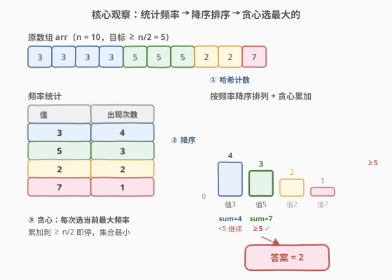
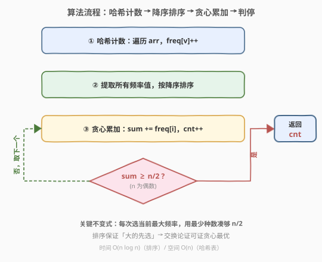

# 数组大小减半

- **题目名称**：数组大小减半
- **链接**：[1338. 数组大小减半](https://leetcode.cn/problems/reduce-array-size-to-the-half/)
- **难度**：中等
- **标签**：数组、贪心、哈希表、排序

## 1. 题目概述

给你一个整数数组 `arr`。你可以从中选出一个**整数集合**，并删除这些整数在数组中的**每次出现**。返回**至少**能删除数组中**一半**整数的整数集合的**最小大小**。

> 题目保证 `arr.length` 为偶数，因此「一半」即 `arr.length / 2`，无需考虑奇偶取整。

**示例 1**：

```text
输入：arr = [3,3,3,3,5,5,5,2,2,7]
输出：2
解释：选择 {3,7} 使得结果数组为 [5,5,5,2,2]、长度为 5（原数组长度的一半）。
      大小为 2 的可行集合有 {3,5},{3,2},{5,2}。
      选择 {2,7} 是不可行的，它的结果数组为 [3,3,3,3,5,5,5]，新数组长度大于原数组的二分之一。
```

**示例 2**：

```text
输入：arr = [7,7,7,7,7,7]
输出：1
解释：我们只能选择集合 {7}，结果数组为空。
```

**约束条件**：

- `1 <= arr.length <= 10^5`
- `arr.length` 为偶数
- `1 <= arr[i] <= 10^5`

> 💡 本题的灵魂是「**用最少的种数删最多的元素**」——每种值删掉的是它的全部出现次数（频率）。要最小化集合大小，就该**优先选频率大的值**，一次删得多。这是经典的**贪心 + 频率排序**信号：先哈希计数，再按频率降序排序，从大到小累加直到够 `n/2`。

---

## 2. 解题思路

### 2.1 暴力思路：枚举所有子集

最直观的做法：把数组中出现的所有**不同值**构成候选集（设共 `m` 种），枚举其所有 $2^m$ 个子集，对每个子集计算删除的元素总数（子集中各值的频率之和），若 $\geq n/2$ 则记录子集大小，最终取最小。

问题在于——

- **子集数指数级**：$m$ 种值有 $2^m$ 个子集。极端情况下 $m$ 可达 $n/2 \approx 5 \times 10^4$，$2^{50000}$ 完全不可行；
- **大量重复计算**：不同子集反复累加相同频率，没有利用「频率大小关系」来剪枝。

> ⚠️ 这种「枚举子集」的写法在小数据上能跑，但**完全忽略了频率的相对大小**——直觉上，频率大的值「性价比」更高，应优先纳入。这正是贪心的切入点。

### 2.2 核心观察：贪心 + 频率降序排序



**关键洞察**：集合中每选一个值 `v`，就删掉 `freq[v]` 个元素。要在**种数最少**的前提下删够 `n/2` 个，应让「每种值删掉的元素数」尽量大——即**优先选频率最大的值**。

具体步骤：

1. **哈希计数**：遍历 `arr`，统计每个值的出现频率 `freq[v]`；
2. **降序排序**：把所有频率值取出，按从大到小排序；
3. **贪心累加**：从最大频率开始，依次累加 `sum += freq[i]`，同时计数 `cnt++`；
4. **判停**：一旦 `sum >= n/2`，立即返回 `cnt`——这就是最小集合大小。

> 以示例 1 为例：频率为 `{3:4, 5:3, 2:2, 7:1}`，降序排列得 `[4, 3, 2, 1]`，目标 `n/2 = 5`。选 4（`sum=4 < 5`，不够），再选 3（`sum=7 >= 5`，够了），返回 `cnt=2`。集合可以是 `{3, 5}` 或 `{3, 7}` 等——题面只问**大小**，不问具体是哪些值。

> ⚠️ **为什么贪心最优？** 可用**交换论证**证明：设最优解选了频率 $f_a < f_b$ 但没选 $f_b$。把 $f_a$ 换成 $f_b$ 后，删除总数不减（$f_b \geq f_a$）、种数不变，仍为最优。因此存在一个「按频率从大到小选取」的最优解，贪心恰好找到它。这与 [451. 根据字符出现频率排序](../0401-0500/451_根据字符出现频率排序.md) 中「频率大的优先排前」是同一贪心直觉。

### 2.3 算法流程图



**完整流程**：

1. **哈希计数**：`freq = defaultdict(int)`，遍历 `arr` 执行 `freq[v]++`，得 `m` 种值的频率；
2. **降序排序**：`freqs = sorted(freq.values(), reverse=True)`；
3. **贪心累加**：`sum = 0, cnt = 0`，遍历 `freqs`，`sum += f, cnt += 1`；
4. **判停**：`if sum >= target`（`target = n // 2`），`break` 并返回 `cnt`。

> 💡 **`target = n // 2` 而非 `(n+1)//2`**：题面保证 `arr.length` 为偶数，`n // 2` 即精确的一半。若题目不保证偶数，则需删「至少一半」即 `ceil(n/2)`，但本题约束已排除此情况。

### 2.4 示例演算

以示例 1 的 `arr=[3,3,3,3,5,5,5,2,2,7]` 为例，`n=10`，`target=5`：

![示例 1 演算：频率降序 [4,3,2,1]，贪心累加 4→7 命中](../images/1338_example_walkthrough.svg)

| 步骤 | 选中值 | 频率 | 累计 sum | $\geq 5$? |
|------|--------|------|----------|-----------|
| 1 | 3 | 4 | 4 | 否 |
| 2 | 5 | 3 | $4+3=7$ | **是** ← 停，返回 2 |

- **第 1 步**：选频率最大的值 `3`（频率 4），`sum=4`，还差 1 个，继续；
- **第 2 步**：选次大频率的值 `5`（频率 3），`sum=7 >= 5`，命中，返回 `cnt=2`。

> 💡 **为什么选 `{3,5}` 而非 `{3,7}`？** 题面只问集合**大小**，不问具体成员。贪心过程只关心「频率降序累加」，不关心频率对应的原始值是谁——`{3,5}`（删 7 个）和 `{3,7}`（删 5 个）都是大小为 2 的合法集合，答案均为 2。若要输出具体集合，可在排序时保留 `(频率, 值)` 二元组。

> ⚠️ **反例验证**：若选 `{2,7}`（频率 2+1=3 < 5），删不够一半——小频率优先会浪费「名额」。这印证了「从大到小选」的必要性：每种值占一个集合名额，频率越大性价比越高。

---

## 3. 参考代码

### C++

```cpp
// 数组大小减半.cpp —— 贪心 + 频率降序排序，O(n log n)
// 编译: g++ -O2 -std=c++17 数组大小减半.cpp -o reduce_half
#include <vector>
#include <unordered_map>
#include <algorithm>
using namespace std;

class Solution {
public:
    int minSetSize(vector<int>& arr) {
        int n = arr.size();
        int target = n / 2;                          // 至少删一半
        unordered_map<int, int> freq;
        for (int v : arr) freq[v]++;                 // ① 哈希计数
        vector<int> freqs;
        freqs.reserve(freq.size());
        for (auto& [v, f] : freq) freqs.push_back(f);
        sort(freqs.begin(), freqs.end(), greater<>()); // ② 频率降序排序
        int sum = 0, cnt = 0;
        for (int f : freqs) {                        // ③ 贪心累加
            sum += f;
            ++cnt;
            if (sum >= target) break;                // ④ 够一半即停
        }
        return cnt;
    }
};
```

### Python

```python
class Solution:
    def minSetSize(self, arr: list[int]) -> int:
        n = len(arr)
        target = n // 2                              # 至少删一半
        from collections import Counter
        freqs = sorted(Counter(arr).values(), reverse=True)  # ①② 计数 + 降序
        s = 0
        for cnt, f in enumerate(freqs, 1):           # ③ 贪心累加
            s += f
            if s >= target:                          # ④ 够一半即停
                return cnt
        return len(freqs)                            # 兜底（不会走到）
```

> 💡 两版等价。Python 用 `Counter` 一行完成计数 + 取值，`enumerate(..., 1)` 让 `cnt` 从 1 起，命中时直接返回。C++ 用 `unordered_map` 计数后把频率搬进 `vector` 排序。两者核心都是「频率降序 + 贪心累加 + 够即停」三步。

---

## 4. 复杂度分析

| 维度 | 贪心 + 排序（推荐） | 暴力枚举子集 |
|------|---------------------|--------------|
| 时间复杂度 | $O(n + m \log m)$，其中 $m$ 为不同值种数（$m \leq n$） | $O(2^m \cdot m)$（指数级） |
| 空间复杂度 | $O(m)$（哈希表 + 频率数组） | $O(m)$（存子集） |
| 实际运算量 | $n=10^5$ 时约 $10^5$ 级，毫秒级 | 不可行 |

> ⚠️ **排序对象是频率而非原数组**：频率共 $m$ 个（$m \leq \min(n, 10^5)$），排序开销 $O(m \log m)$。当所有元素互异时 $m = n$，退化为 $O(n \log n)$；当元素高度重复时 $m$ 很小，排序近乎 $O(1)$，瓶颈只在计数的 $O(n)$ 遍历。

> 💡 **能否做到 $O(n)$？** 可以。由于 `arr[i]` 值域 $\leq 10^5$，频率上限为 $n$，可用**桶排序**按频率分桶（见第 5 节），从高频桶往低频桶扫，避免比较排序的 $O(m \log m)$。

---

## 5. 扩展：桶排序优化 O(n)

比较排序的瓶颈在 $O(m \log m)$。注意到频率取值范围为 $[1, n]$，可用**按频率分桶**将排序降到 $O(n)$：

- 创建 `bucket[f]`：存所有频率恰为 `f` 的值（或直接存该频率对应的值个数）；
- 从 `f = n` 向下扫描到 `f = 1`，每遇到非空桶就累加 `sum += f * bucket[f]`、`cnt += bucket[f]`；
- `sum >= target` 即停。

由于「同一频率的值」可一次性全部纳入（它们性价比相同，要么全选要么全不选不影响最优性），累加时按桶整体计数。

```python
class Solution:
    def minSetSize(self, arr: list[int]) -> int:
        from collections import Counter
        n = len(arr)
        target = n // 2
        freq = Counter(arr)
        # 按频率分桶：bucket[f] = 频率恰为 f 的值有多少种
        bucket = [0] * (n + 1)
        for f in freq.values():
            bucket[f] += 1
        s = 0
        cnt = 0
        for f in range(n, 0, -1):        # 从高频往低频扫
            while bucket[f] > 0:
                s += f
                cnt += 1
                bucket[f] -= 1
                if s >= target:
                    return cnt
        return cnt
```

> ⚠️ 桶排序版**正确性依赖频率值域有限**：`arr[i] <= 10^5` 且 `n <= 10^5`，故频率 $\in [1, n]$，桶数组大小 $n+1$ 足够。这与 [347. 前 K 个高频元素](../0301-0400/347_前K个高频元素.md) 中「按频率分桶做 Top-K」是同一套路——当值域有界时，桶排序把 $O(n \log n)$ 比较排序压到 $O(n)$。本题 $n \leq 10^5$ 时 $O(n \log n)$ 已足够快，桶排序版主要作为**面试加分项**或 $n$ 更大时的优化。

---

## 6. 面试要点

1. **怎么想到贪心的？**

   > 题目要「最小化集合大小」同时「删够一半元素」。每种值删掉的是它的全部出现次数（频率），集合每多一个值就多占一个「名额」。要让名额性价比最高，就该优先选频率大的值——一次删得多。这是「**有限名额下最大化收益**」的经典贪心信号，与分数背包的直觉一致：单位名额收益（频率）大的先选。

2. **贪心为什么最优？交换论证怎么写？**

   > 设最优解 $S^*$ 选了频率 $f_a$ 但没选 $f_b$（且 $f_a < f_b$）。把 $f_a$ 换成 $f_b$：删除总数变为 $\text{sum} - f_a + f_b \geq \text{sum}$（因 $f_b \geq f_a$），仍 $\geq \text{target}$；集合大小不变。故替换后仍合法且大小不变，存在一个「按频率降序选取」的最优解。不断替换直至无逆序，即得贪心解，故贪心最优。

3. **`target = n // 2` 还是 `(n + 1) // 2`？**

   > 题面保证 `arr.length` 为偶数，`n // 2 == n / 2`，两者等价。若题目不保证偶数，需删「至少一半」即 $\lceil n/2 \rceil = (n+1)//2$。但本题约束已写明偶数，用 `n // 2` 即可。这是读题时要注意的边界细节。

4. **为什么要先计数再排序，不能边遍历边贪心？**

   > 贪心需要按频率从大到小选，但遍历 `arr` 时只能逐个累加频率，无法知道「当前值的频率是否是全局最大」。必须先完整计数（第一遍遍历），再排序（确定顺序），才能保证「先选最大的」。这与 [451. 根据字符出现频率排序](../0401-0500/451_根据字符出现频率排序.md) 中「先计数再按频率排」是同一模式——频率信息是全局的，无法在线获得。

5. **和 347. 前 K 个高频元素 有什么区别？**

   > 347 是「找频率前 K 高的元素」（输出是元素值，K 给定）；1338 是「找最小集合使删除数 $\geq n/2$」（输出是集合大小，K 待求）。两者都先哈希计数，但 347 用桶排序/堆取 Top-K（K 已知），1338 用排序 + 贪心累加定 K（K 未知，靠累加判停）。1338 可视为「**反向 347**」——347 给 K 找元素，1338 给目标找最小 K。

> 💡 **一句话总结**：1338 的灵魂是「**频率降序 + 贪心累加**」——先哈希计数得到每种值的频率，按频率从大到小排序，从最大频率开始累加直到够 `n/2`，累加的种数即为答案。贪心最优由交换论证保证，桶排序可把复杂度从 $O(n \log n)$ 压到 $O(n)$。这个「计数 + 按频率排序 + 贪心」的模板，是所有「按出现频率做决策」问题的通用范式。

---

## 7. 同类练习题

- [347. 前 K 个高频元素](https://leetcode.cn/problems/top-k-frequent-elements/)：同为「哈希计数 + 按频率排序」，但 K 给定、输出元素值，用桶排序/堆取 Top-K，对照 1338 的 K 待求、输出大小——「正向取 Top-K vs 反向定最小 K」
- [451. 根据字符出现频率排序](https://leetcode.cn/problems/sort-characters-by-frequency/)：同为「计数 + 频率降序排序」，但目标是用频率重排字符串输出，对照 1338 的「频率排序后贪心累加」——排序的下游用途不同
- [692. 前 K 个高频单词](https://leetcode.cn/problems/top-k-frequent-words/)：同为频率统计 + Top-K，但加了「同频字典序」的次序约束，需自定义比较器，对照 1338 的「同频不区分」——频率相同时是否需要 tie-breaker
- [767. 重构字符串](https://leetcode.cn/problems/reorganize-string/)：同为「频率统计 + 贪心」，但贪心策略是「大根堆按频率交替放置」避免相邻重复，对照 1338 的「频率排序后顺序累加」——频率驱动的不同贪心下游
