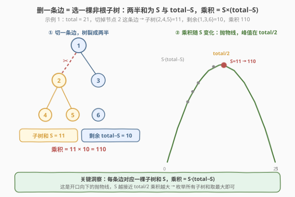
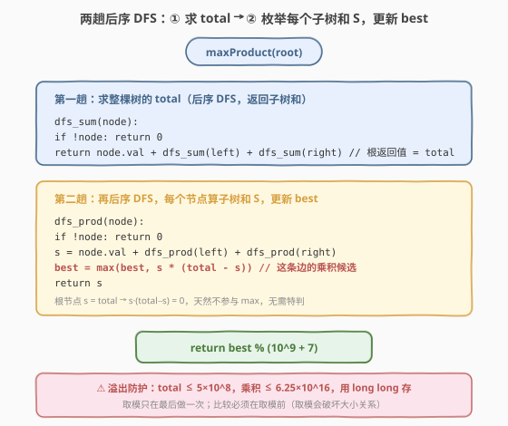
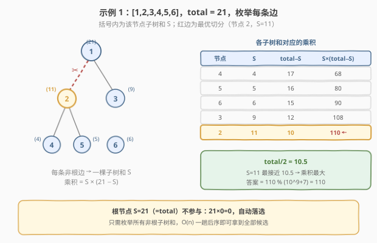

# 分裂二叉树的最大乘积

- **题目名称**：分裂二叉树的最大乘积
- **链接**：[1339. 分裂二叉树的最大乘积](https://leetcode.cn/problems/maximum-product-of-splitted-binary-tree/)
- **难度**：中等
- **标签**：树、二叉树、深度优先搜索（DFS）、后序遍历、数学

## 1. 题目概述

给你一棵二叉树，根为 `root`。请你**删除 1 条边**，使二叉树分裂成两棵子树，且它们**子树和的乘积尽可能大**。由于答案可能很大，将结果对 $10^9 + 7$ 取模后返回。

**示例 1**：

```text
输入：root = [1,2,3,4,5,6]
输出：110
解释：删除节点 1 与节点 2 之间的边，得到两棵子树，
      和分别为 11（{2,4,5}）与 10（{1,3,6}），乘积 11 × 10 = 110。
```

**示例 2**：

```text
输入：root = [1,null,2,3,4,null,null,5,6]
输出：90
解释：删除节点 2 与节点 4 之间的边，两棵子树和为 15（{4,5,6}）与 6（{1,2,3}），乘积 90。
```

**示例 3**：

```text
输入：root = [2,3,9,10,7,8,6,5,4,11,1]
输出：1025
```

**示例 4**：

```text
输入：root = [1,1]
输出：1
```

**约束条件**：

- 树中节点数目在范围 $[2,\, 5 \times 10^4]$ 内
- 每个节点的值在 $[1,\, 10^4]$ 之间

> 💡 本题的灵魂是「**每条边对应一棵子树和 $S$**」——删一条边等价于选一个**非根节点**，把它所在的子树切下来，两半的和恰好是 $S$ 与 $\text{total} - S$。于是乘积 $= S \cdot (\text{total} - S)$，只需两趟后序 DFS：第一趟求 $\text{total}$，第二趟枚举每个子树和取最大乘积。

---

## 2. 解题思路

### 2.1 暴力思路：枚举每条边 + 重算子树和

最直观的做法：枚举树中 $n-1$ 条边，对每条边「断开」后分别计算两棵子树的和，得到乘积，取最大。

问题在于——

- **重复遍历**：每断一条边就要重新扫描两棵子树求和，单次 $O(n)$，总计 $O(n^2)$。$n = 5 \times 10^4$ 时约 $2.5 \times 10^9$ 次运算，超时；
- **没有复用子树和**：同一条边对应的子树和，在断不同边时被反复重算，而其实每棵子树的和是固定值，算一次就够。

> ⚠️ 这种「枚举边 + 现场求和」的写法完全没利用「**子树和只取决于子树根节点，与切在哪条边无关**」的性质。一旦预先算好每个节点的子树和，任何一条边的乘积都能 $O(1)$ 查出。

### 2.2 核心观察：每条边 = 一棵子树和，乘积 = S·(total−S)



**关键洞察**：树中任意一条边连接「父节点 `p`」与「孩子节点 `c`」。删掉这条边后，`c` 这棵子树整体脱离，成为独立的一棵树，其和记为 $S$；剩余部分（仍以 `root` 为根）的和为 $\text{total} - S$。于是：

$$
\text{乘积} = S \cdot (\text{total} - S)
$$

1. **边 ↔ 非根节点一一对应**：每条边指向一个孩子 `c`（非根），反之每个非根节点 `c` 唯一确定一条「从父指向自己」的边。所以「枚举所有边」=「枚举所有非根节点的子树和」；
2. **$\text{total}$ 必须先求**：公式里的 $\text{total}$ 是整棵树之和，只有遍历完整棵树才知道。因此先做**第一趟后序 DFS** 求 $\text{total}$；
3. **第二趟枚举子树和**：再做一趟后序 DFS，每个节点递归返回自身子树和 $S$，顺手用 $S \cdot (\text{total} - S)$ 更新全局最大值。

**数学视角**：$f(S) = S \cdot (\text{total} - S) = \text{total} \cdot S - S^2$ 是一条**开口向下的抛物线**，对称轴在 $S = \text{total}/2$ 处取最大。也就是说，**子树和越接近 $\text{total}/2$，乘积越大**。这给出直觉验证：最优切分是把树尽可能「对半劈」。但算法上仍需枚举所有子树和（无法跳过），抛物线性质主要用于理解与剪枝直觉。

> 以示例 1 为例：$\text{total} = 21$，$\text{total}/2 = 10.5$。各子树和 $\{4,5,6,9,11\}$ 中，$S=11$ 最接近 10.5，乘积 $11 \times 10 = 110$ 最大。

> ⚠️ **为什么必须后序？** 子树和 $S$ 的定义是「该节点及其所有后代之和」，依赖孩子子树的结果。前序在访问节点时孩子尚未处理，拿不到子树和。后序「先孩子后自己」保证当前节点求和时左右孩子子树和已就绪——这与 [508. 出现次数最多的子树元素和](../0501-0600/508_出现次数最多的子树元素和.md) 中「后序算子树和」是同一个模板。

### 2.3 算法流程图



**完整流程**（两趟后序 DFS）：

1. **第一趟 `sumDFS`**：后序遍历整棵树，返回每个节点的子树和；根节点的返回值即为 $\text{total}$；
   - `sumDFS(node) = node.val + sumDFS(left) + sumDFS(right)`，空节点返回 0；
2. **第二趟 `prodDFS`**：同样的后序遍历，每个节点算出子树和 $S$ 后，用 $S \cdot (\text{total} - S)$ 更新全局 `best`；
   - `best = max(best, s * (total - s))`；
3. **根节点自动落选**：根的子树和 $= \text{total}$，代入得 $\text{total} \times 0 = 0$，不可能大于任何有效切分（树至少 2 节点、值 $\geq 1$，有效乘积 $\geq 1$），**无需特判**；
4. **最后取模**：`return best % (10^9 + 7)`。

> 💡 **取模只在最后做一次**：取模会破坏数值大小关系（大数取模后可能变小），因此比较 `max` 必须用**原始乘积**。只要原始乘积不溢出，最后统一取模即可。$n \leq 5\times10^4$、值 $\leq 10^4$ 时 $\text{total} \leq 5\times10^8$，最大乘积约 $(5\times10^8 / 2)^2 \approx 6.25 \times 10^{16}$，远小于 `long long` 上界 $\approx 9.2 \times 10^{18}$，安全。

### 2.4 示例演算

以示例 1 的 `[1,2,3,4,5,6]`、$\text{total}=21$ 为例，枚举每个非根节点的子树和与对应乘积：



| 节点 | 子树和 $S$ | $\text{total}-S$ | 乘积 $S \cdot (\text{total}-S)$ |
|------|-----------|------------------|--------------------------------|
| 4 | 4 | 17 | 68 |
| 5 | 5 | 16 | 80 |
| 6 | 6 | 15 | 90 |
| 3 | 9 | 12 | 108 |
| **2** | **11** | **10** | **110** ← 最大 |
| 1（根） | 21 | 0 | 0（自动落选） |

`best = 110`，`110 % (10^9+7) = 110`。最优切分是删掉节点 1 与节点 2 之间的边，对应 $S=11$，恰为最接近 $\text{total}/2 = 10.5$ 的子树和。

> 💡 **「对半劈」直觉**：抛物线 $S \cdot (\text{total}-S)$ 在 $S = \text{total}/2$ 处取峰值，因此最优子树和总是「最接近总和一半」的那个。本题不需要主动找最接近者（枚举全部取 max 即可），但这个性质解释了**为什么**某个切分最优——把树尽量劈成等和的两半，乘积最大。

---

## 3. 参考代码

### C++

```cpp
// 分裂二叉树的最大乘积.cpp —— 两趟后序 DFS，O(n)
// 编译: g++ -O2 -std=c++17 分裂二叉树的最大乘积.cpp -o split_prod
#include <algorithm>
using namespace std;

struct TreeNode {
    int val;
    TreeNode* left;
    TreeNode* right;
    TreeNode() : val(0), left(nullptr), right(nullptr) {}
    TreeNode(int x) : val(x), left(nullptr), right(nullptr) {}
    TreeNode(int x, TreeNode* l, TreeNode* r) : val(x), left(l), right(r) {}
};

class Solution {
    static constexpr long long MOD = 1000000007;
    long long total = 0;
    long long best  = 0;

    long long sumDFS(TreeNode* node) {                    // 第一趟：求 total
        if (!node) return 0;
        return (long long)node->val + sumDFS(node->left) + sumDFS(node->right);
    }

    long long prodDFS(TreeNode* node) {                   // 第二趟：枚举子树和
        if (!node) return 0;
        long long s = (long long)node->val + prodDFS(node->left) + prodDFS(node->right);
        best = max(best, s * (total - s));                // 这条边的乘积候选
        return s;
    }

public:
    int maxProduct(TreeNode* root) {
        total = sumDFS(root);                             // ① 整棵树之和
        best  = 0;
        prodDFS(root);                                    // ② 枚举每条边
        return (int)(best % MOD);                         // ③ 最后取模
    }
};
```

### Python

```python
class Solution:
    def maxProduct(self, root: TreeNode | None) -> int:
        MOD = 10 ** 9 + 7

        def subtree_sum(node: TreeNode | None) -> int:        # 第一趟：求 total
            if not node:
                return 0
            return node.val + subtree_sum(node.left) + subtree_sum(node.right)

        total = subtree_sum(root)
        best = 0

        def dfs(node: TreeNode | None) -> int:                # 第二趟：枚举子树和
            nonlocal best
            if not node:
                return 0
            s = node.val + dfs(node.left) + dfs(node.right)
            best = max(best, s * (total - s))                 # 这条边的乘积候选
            return s

        dfs(root)
        return best % MOD                                     # 最后取模
```

> 💡 两版等价，核心只有两步：**第一趟后序拿 `total`，第二趟后序边算子树和边更新 `best`**。`best` 用 `long long` 存原始乘积（C++），取模推迟到最后一步。根节点因 $S=\text{total}$ 贡献 0 自动落选，无需特判。

---

## 4. 复杂度分析

| 维度 | 两趟后序 DFS（推荐） | 暴力枚举边 + 重算 |
|------|---------------------|-------------------|
| 时间复杂度 | $O(n)$（两趟各遍历一次） | $O(n^2)$（每条边重算子树和） |
| 空间复杂度 | $O(h)$（递归栈，$h$ 为树高） | $O(h)$ |
| 实际运算量 | $n = 5\times10^4$ 约 $10^5$，毫秒级 | $2.5\times10^9$，超时 |

> ⚠️ **空间说明**：递归栈深度为树高 $h$，平衡树 $O(\log n)$，退化为链表 $O(n)$。本题 $n \leq 5\times10^4$，即便链式退化也安全；若树深达数十万层存在栈溢出顾虑，可改用显式栈模拟后序。

---

## 5. 扩展：能否一趟搞定？数学视角再审视

### 5.1 为什么必须两趟？

乘积公式 $S \cdot (\text{total} - S)$ 中的 $\text{total}$ 是整棵树之和，**只有在第一趟遍历完成后才已知**。在 $\text{total}$ 未知时，任何节点都无法计算自己的乘积候选。因此天然需要「先求总和，再枚举子树和」两阶段。

若坚持单趟 DFS，可在一趟后序中把每个子树和收集到列表 `sums`，遍历结束后 `sums` 的最后一个元素即 $\text{total}$（根的子树和），再遍历列表计算乘积：

```python
sums = []
def dfs(node):
    if not node: return 0
    s = node.val + dfs(node.left) + dfs(node.right)
    sums.append(s)
    return s
dfs(root)
total = sums[-1]
best = max(s * (total - s) for s in sums[:-1])   # 排除根
```

但这需 $O(n)$ 额外空间存列表，而两趟 DFS 仅 $O(h)$ 递归栈空间。$n = 5\times10^4$ 时二者都可行，**两趟版更省空间且不依赖排除根的特判**（根贡献 0 自动落选），是首选。

### 5.2 数学视角：本质是「找最接近 total/2 的子树和」

$f(S) = S \cdot (\text{total} - S)$ 是开口向下的抛物线，峰值在 $S = \text{total}/2$。因此本题等价于：**在所有子树和中找最接近 $\text{total}/2$ 的那个**。这给出两个推论：

1. **最优切分总是「尽量对半劈」**：示例 1 中 $S=11$（最接近 10.5）胜出，绝非偶然；
2. **算法无需主动二分查找**：子树和是无序的离散集合，找最接近者仍需 $O(n)$ 扫一遍。抛物线性质**不改变渐进复杂度**，只提供直觉解释与正确性验证。

> ⚠️ 有人会想用平衡树/排序集合一边插入子树和一边二分找最接近 $\text{total}/2$ 者，但这需 $O(n \log n)$ 且 $\text{total}$ 仍要预先求，反而比两趟 $O(n)$ 更慢。**抛物线在这里是「理解工具」而非「优化工具」**。

---

## 6. 面试要点

1. **为什么用后序遍历？前序不行吗？**

   > 子树和 $S$ 定义为「节点及其所有后代之和」，依赖左右孩子子树的结果。前序在访问节点时孩子尚未处理，拿不到子树和。后序「先孩子后自己」保证当前节点求和时孩子结论已就绪。这是「**结论依赖孩子子树**」类问题的通用判据——与 [508. 出现次数最多的子树元素和](../0501-0600/508_出现次数最多的子树元素和.md) 完全同构。

2. **为什么需要两趟 DFS？能否合并成一趟？**

   > 乘积 $S \cdot (\text{total} - S)$ 中的 $\text{total}$ 是整棵树之和，只有第一趟遍历完成后才已知。在 $\text{total}$ 未知时任何节点都算不出自己的乘积。可在一趟中把所有子树和收集到列表、末尾取 $\text{total}$ 再遍历列表，但需 $O(n)$ 额外空间；两趟 DFS 仅 $O(h)$ 递归栈空间更优，且根贡献 0 自动落选无需特判。

3. **取模为什么只在最后做一次？**

   > 取模破坏数值大小关系——一个本来更大的乘积取模后可能变小，导致 `max` 选错。因此比较必须用**原始乘积**，取模推迟到最后返回时做一次。前提是原始乘积不溢出：$\text{total} \leq 5\times10^4 \times 10^4 = 5\times10^8$，最大乘积 $\leq (5\times10^8/2)^2 \approx 6.25\times10^{16}$，远小于 `long long` 上界 $\approx 9.2\times10^{18}$，安全。

4. **根节点为什么不用特判？**

   > 根的子树和 $= \text{total}$，代入 $S \cdot (\text{total} - S)$ 得 $\text{total} \times 0 = 0$。而树至少 2 个节点、节点值 $\geq 1$，任何有效切分的乘积 $\geq 1 \times 1 = 1 > 0$，故根的 0 贡献永远不会成为 `max`，自动落选。这是「**让非法候选贡献 0 自然失效**」的常见技巧，比显式 `if` 特判更简洁。

5. **为什么 `best` 用 `long long` 而非 `int`？**

   > 最大乘积约 $6.25\times10^{16}$，远超 32 位 `int` 上界 $\approx 2.1\times10^9$，必须用 64 位 `long long`。`total` 与子树和 $S$ 虽不超 `int`，但参与乘法前提升到 `long long` 避免中间溢出。Python 整数无限精度无此问题，但 C++ 必须显式 `(long long)node->val` 提升类型。

> 💡 **一句话总结**：1339 的灵魂是「**每条边对应一棵子树和 $S$，乘积 $= S \cdot (\text{total}-S)$**」——两趟后序 DFS，第一趟求 $\text{total}$，第二趟枚举子树和取最大乘积，根贡献 0 自动落选，`long long` 存原始值最后取模。这个「后序算子树和 + 全局最优更新」模板，是所有「树上聚合 + 最值」问题的通用范式。

---

## 7. 同类练习题

- [508. 出现次数最多的子树元素和](../0501-0600/508_出现次数最多的子树元素和.md)：同为后序 DFS 求每个子树和，但 508 用哈希表统计频次取众数，1339 用子树和拼乘积取最大——同一「后序子树和」模板的不同聚合目标
- [543. 二叉树的直径](../0501-0600/543_二叉树的直径.md)：同为后序 DFS + 全局 `best` 更新（孩子返回值拼出候选，`max` 更新全局最优），543 拼的是「左右深度之和」，1339 拼的是「子树和 × 剩余和」——「后序返回值驱动全局最优」的经典范式
- [124. 二叉树中的最大路径和](../0101-0200/124_二叉树中的最大路径和.md)：后序 DFS 求子树最大贡献值，用「左贡献 + 右贡献 + 节点值」更新全局最大路径和，对照 1339 的「子树和 × (total−子树和)」——同为「后序聚合 + 全局 max」但聚合方式不同
- [437. 路径总和 III](../0401-0500/437_路径总和III.md)：树上前缀和 + 哈希，把「子树和」推广为「根到节点的前缀和」统计目标和路径数，对照 1339 的子树和视角——树上求和的两种粒度（子树 vs 前缀路径）
- [968. 监控二叉树](../0901-1000/968_监控二叉树.md)：树形 DP，后序返回节点状态（被覆盖/放相机），对照 1339 后序返回数值（子树和）——后序 DFS 两大返回值用途：传「状态」vs 传「数值」
