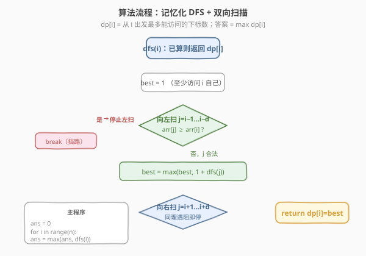
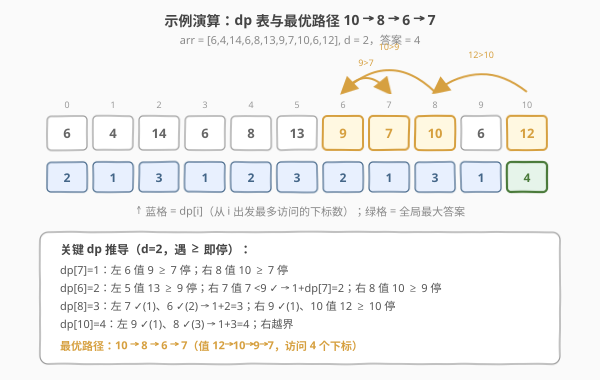

# 跳跃游戏 V

- **题目名称**：跳跃游戏 V
- **链接**：[1340. 跳跃游戏 V](https://leetcode.cn/problems/jump-game-v/)
- **难度**：困难
- **标签**：数组、动态规划、记忆化搜索

## 1. 题目概述

给定一个整数数组 `arr` 和一个整数 `d`。每一步你可以从下标 `i` 跳到：

- `i + x`，其中 `i + x < arr.length` 且 `0 < x <= d`；
- `i - x`，其中 `i - x >= 0` 且 `0 < x <= d`。

除此以外，从下标 `i` 跳到下标 `j` 还需满足：`arr[i] > arr[j]` 且 `arr[i] > arr[k]`，其中 `k` 是 `i` 到 `j` 之间的所有下标（即 `min(i, j) < k < max(i, j)`）。你可以选择**任意下标**开始跳跃，返回你**最多**可以访问多少个下标。任何时刻都不能跳到数组外。

**示例 1**：

```text
输入：arr = [6,4,14,6,8,13,9,7,10,6,12], d = 2
输出：4
解释：从下标 10 出发，依次经过 10 --> 8 --> 6 --> 7。
```

**示例 2**：

```text
输入：arr = [3,3,3,3,3], d = 3
输出：1
解释：从任意下标开始都无法跳到其它下标（值相等不满足 arr[i] > arr[j]）。
```

**示例 3**：

```text
输入：arr = [7,6,5,4,3,2,1], d = 1
输出：7
解释：从下标 0 出发，按值从大到小依次访问所有下标。
```

**约束条件**：

- `1 <= arr.length <= 1000`
- `1 <= arr[i] <= 10^5`
- `1 <= d <= arr.length`

> 💡 本题的灵魂是「**方向性扫描 + 遇阻即停**」——从 `i` 出发能跳到的合法目标，必然集中在 `i` 两侧的一段**连续下降窗口**内，遇到第一个 `≥ arr[i]` 的「高个子」就该方向立即停止。这把朴素的 $O(nd^2)$ 校验直接降到 $O(nd)$，是本题从「困难」降维到「可写」的关键观察。

---

## 2. 解题思路

### 2.1 暴力思路：枚举目标 + 逐个校验中间元素

最直观的做法：定义 `dp[i]` = 从 `i` 出发最多能访问的下标数。对每个 `i`，枚举范围 `[i-d, i+d]` 内的所有 `j`（`j ≠ i`），对每个候选 `j` 检查三条：① `arr[j] < arr[i]`；② `i` 到 `j` 之间所有 `k` 满足 `arr[k] < arr[i]`；③距离合法。若合法则 `dp[i] = max(dp[i], 1 + dp[j])`，依赖关系用记忆化 DFS 或按值排序后递推求解。

问题在于——

- **校验代价高**：对单个 `(i, j)` 检查中间所有 `k` 需 $O(d)$，每个 `i` 枚举 $O(d)$ 个 `j`，单点转移 $O(d^2)$，总计 $O(nd^2)$。$n=1000, d=1000$ 时达 $10^9$，会超时；
- **大量无效枚举**：一旦 `i` 到 `j` 路径上出现 `arr[k] >= arr[i]`，`j` 及更远的位置都非法，但暴力仍会逐个枚举并校验。

> ⚠️ 这种「枚举 + 校验」的写法完全没有利用「**阻挡具有传递性**」——某个 `k` 挡住了去路，它后面更远的位置必然也被挡住。这正是优化切入点。

### 2.2 核心观察：方向性扫描 + 遇阻即停

![核心观察：从 i 向左右扫描，遇 ≥ arr[i] 即停](../images/1340_concept.svg)

**关键洞察**：从 `i` 出发，合法目标只可能出现在 `i` 左右两侧、且在遇到第一个 `≥ arr[i]` 的元素之前。于是对每个方向（左 / 右）按距离从近到远**逐个扫描**：

1. **看 `j = i±1`**：若 `arr[j] < arr[i]`，则 `j` 合法（中间无其它 `k`），纳入候选；若 `arr[j] >= arr[i]`，`j` 本身不合法且会挡住更远处，**该方向立即停止**；
2. **看 `j = i±2`**：若上一步未停且 `arr[j] < arr[i]`，则 `j` 合法（中间只有 `i±1`，已确认 `< arr[i]`）；若 `arr[j] >= arr[i]`，停止；
3. ……直到扫满 `d` 步或遇阻停止。

如此每个方向至多扫 `d` 步，且**无需再单独校验中间元素**——因为扫描过程中「未停」本身就保证了已扫过的中间元素都 `< arr[i]`。

> 以 `arr = [6,4,14,6,8,13,9,7,10,6,12]`、`d=2`，从 `i=8`（值 10）出发为例：向左扫 `j=7`（值 7 `<10` ✓）、`j=6`（值 9 `<10` ✓），扫满 2 步停止；向右扫 `j=9`（值 6 `<10` ✓）、`j=10`（值 12 `≥10` ✗），遇阻立即停止。合法目标 = {7, 6, 9}，与逐个校验结果完全一致，但只看了 4 个位置而非 $2d$ 次带校验的枚举。

> ⚠️ **为什么「遇阻即停」是正确的？** 设向右扫到 `j` 时 `arr[j] >= arr[i]`。一方面 `j` 自身违反 `arr[i] > arr[j]` 不合法；另一方面，对任何更右的 `j' > j`，`j` 落在 `i` 与 `j'` 之间且 `arr[j] >= arr[i]`，违反「中间所有 `k` 满足 `arr[k] < arr[i]`」，故 `j'` 也不合法。阻挡**同时对自身和更远处生效**，停扫描无遗漏。这与 [42. 接雨水](../0001-0100/42_接雨水.md) 中「找到左右第一个更高柱子即确定水位」是同一种「**最近阻挡元**」思想。

### 2.3 算法流程图



**`dfs(i)` 计算流程**（记忆化搜索）：

1. **命中缓存**：若 `dp[i]` 已计算，直接返回；
2. **初始化**：`best = 1`（至少访问 `i` 自己）；
3. **向左扫描**：`j` 从 `i-1` 到 `i-d`（不越界）：
   - 若 `arr[j] >= arr[i]`：**break**（阻挡，停止左扫）；
   - 否则 `j` 合法：`best = max(best, 1 + dfs(j))`；
4. **向右扫描**：`j` 从 `i+1` 到 `i+d`（不越界）：
   - 若 `arr[j] >= arr[i]`：**break**；
   - 否则 `best = max(best, 1 + dfs(j))`；
5. **记录并返回**：`dp[i] = best`，返回 `best`。

**主程序**：`ans = max(dfs(i))` 对所有 `i ∈ [0, n)`，因为起点任意。

> 💡 **为什么用记忆化 DFS 而非递推？** `dp[i]` 依赖所有 `arr[j] < arr[i]` 的 `j`，即依赖**值更小**的位置。递推需按 `arr` 值**降序**处理（先算大值，再算小值依赖它... 实际是先算小值，因为大值依赖小值的 dp）。按值排序递推也可行（见第 5 节），但记忆化 DFS 更直观——「需要谁就递归算谁」，天然按依赖顺序展开，无需预处理排序。$n ≤ 1000$ 时递归深度最坏 $O(n)$，Python 默认递归上限 1000 可能恰好不够，需 `sys.setrecursionlimit`。

### 2.4 示例演算

以示例 1 `arr = [6,4,14,6,8,13,9,7,10,6,12]`、`d = 2` 为例，dp 表（下标 / 值 / dp）填充如下：



| 下标 `i` | `arr[i]` | 合法目标 `j`（遇阻即停） | `dp[i]` |
|----------|----------|---------------------------|---------|
| 7 | 7 | 左 6 值 9 ≥7 停；右 8 值 10 ≥7 停 → ∅ | 1 |
| 6 | 9 | 左 5 值 13 ≥9 停；右 7 ✓（dp=1），8 值 10 ≥9 停 | 1+1=**2** |
| 8 | 10 | 左 7 ✓(1)、6 ✓(2)；右 9 ✓(1)，10 值 12 ≥10 停 | 1+2=**3** |
| 10 | 12 | 左 9 ✓(1)、8 ✓(3)；右越界 | 1+3=**4** |

完整 dp 表（`ans = max = 4` 在下标 10）：

| 下标 | 0 | 1 | 2 | 3 | 4 | 5 | 6 | 7 | 8 | 9 | 10 |
|------|---|---|---|---|---|---|---|---|---|---|----|
| 值   | 6 | 4 | 14| 6 | 8 | 13| 9 | 7 | 10| 6 | 12 |
| dp   | 2 | 1 | 3 | 1 | 2 | 3 | 2 | 1 | 3 | 1 | **4** |

最优路径 `10 → 8 → 6 → 7`（值 `12 → 10 → 9 → 7`），访问 4 个下标。每跳都满足：距离 `≤ d=2`、目标值更小、中间无更高者。

> 💡 **为什么答案不在最大值 14（下标 2）处？** 下标 2 值最大，理论上「没人能挡它」，左右各 2 步内都能跳。但它的目标 `dp` 值都不大（左 1 值 4 dp=1、0 值 6 dp=2；右 3 值 6 dp=1、4 值 8 dp=2），`dp[2] = 1+2 = 3`。而下标 10 虽值 12 `<14`，但它能跳到 `dp[8]=3` 的下标 8，得到 `dp[10]=4`。**「最大值」不等于「最优起点」**——最优起点取决于「能跳到的目标中 dp 最大者」，与起点自身绝对值无关。这正是需要枚举所有起点取 max 的原因。

> ⚠️ **示例 2 为什么全是 1？** `arr = [3,3,3,3,3]`，任意 `i` 向左右扫第一个 `j` 就有 `arr[j] = 3 = arr[i]`，不满足严格 `>`，立即停止，`dp[i] = 1`。相等即阻挡，本题要求**严格大于**。

---

## 3. 参考代码

### C++

```cpp
// 跳跃游戏 V.cpp —— 记忆化 DFS + 双向扫描遇阻即停，O(nd)
// 编译: g++ -O2 -std=c++17 跳跃游戏\ V.cpp -o jg5
#include <vector>
#include <algorithm>
using namespace std;

class Solution {
public:
    int maxJumps(vector<int>& arr, int d) {
        int n = arr.size();
        vector<int> dp(n, 0);                       // 0 表示未计算
        int ans = 0;
        for (int i = 0; i < n; ++i)                 // 起点任意，取 max
            ans = max(ans, dfs(arr, d, i, dp));
        return ans;
    }
private:
    int dfs(const vector<int>& arr, int d, int i, vector<int>& dp) {
        if (dp[i] != 0) return dp[i];               // 命中缓存
        int n = arr.size();
        int best = 1;                               // 至少访问 i 自己
        for (int j = i - 1; j >= max(0, i - d); --j) {  // 向左扫
            if (arr[j] >= arr[i]) break;            // 遇阻即停
            best = max(best, 1 + dfs(arr, d, j, dp));
        }
        for (int j = i + 1; j <= min(n - 1, i + d); ++j) {  // 向右扫
            if (arr[j] >= arr[i]) break;
            best = max(best, 1 + dfs(arr, d, j, dp));
        }
        return dp[i] = best;
    }
};
```

### Python

```python
class Solution:
    def maxJumps(self, arr: list[int], d: int) -> int:
        n = len(arr)
        dp = [0] * n                                 # 0 表示未计算

        def dfs(i: int) -> int:
            if dp[i] != 0:
                return dp[i]
            best = 1                                 # 至少访问 i 自己
            for j in range(i - 1, max(-1, i - d - 1), -1):  # 向左扫
                if arr[j] >= arr[i]:
                    break                            # 遇阻即停
                best = max(best, 1 + dfs(j))
            for j in range(i + 1, min(n, i + d + 1)):       # 向右扫
                if arr[j] >= arr[i]:
                    break
                best = max(best, 1 + dfs(j))
            dp[i] = best
            return best

        return max(dfs(i) for i in range(n))         # 起点任意，取 max
```

> 💡 **实现细节**：① `dp` 用 `0` 作「未计算」哨兵合法，因为 `dp[i] >= 1` 恒成立（至少访问自己）。② 左扫 `range(i-1, max(-1, i-d-1), -1)`：下界取 `max(-1, ...)` 防负索引，步长 `-1` 倒序；右扫 `range(i+1, min(n, i+d+1))` 自然处理越界。③ `break` 是降复杂度的核心——遇阻立即跳出该方向循环。④ C++ 递归深度最坏 $O(n)$（如严格递减数组形成长链），$n=1000$ 在默认栈下安全；Python 同情况需注意递归上限，但本题 $n \leq 1000$ 通常够用，必要时 `sys.setrecursionlimit(2000)`。

---

## 4. 复杂度分析

| 维度 | 记忆化 DFS（推荐） | 暴力枚举 + 逐个校验 |
|------|-------------------|---------------------|
| 时间复杂度 | $O(nd)$（每点双向各扫至多 $d$，遇阻更早） | $O(nd^2)$（每点枚举 $d$ 个目标，每个校验 $O(d)$） |
| 空间复杂度 | $O(n)$（dp 数组 + 递归栈） | $O(n)$（dp 数组 + 递归栈） |
| 实际运算量 | $n=1000, d=1000$ 约 $2 \times 10^6$，毫秒级 | $10^9$，超时 |

> ⚠️ **为什么是 $O(nd)$ 而非 $O(nd)$ 带额外校验？** 关键在「遇阻即停」让每个方向的扫描**本身**就是合法性校验——扫过的每个 `< arr[i]` 的元素天然合法（中间已确认全 `< arr[i]`），无需回头重查。最坏情况（严格递减数组）每点扫满 $2d$ 步，总 $O(nd)$；平均情况遇阻更早，常数更小。$n, d \leq 1000$ 时 $2 \times 10^6$ 次比较，远在限制内。

---

## 5. 扩展：按值排序的迭代递推

记忆化 DFS 的递归深度最坏 $O(n)$，若担心栈溢出可改为**迭代递推**。关键观察：`dp[i]` 只依赖 `arr[j] < arr[i]` 的 `j`，即**值更小的位置**。因此按 `arr` 值**从小到大**处理，保证算 `dp[i]` 时它依赖的所有 `j` 已就绪：

1. 将下标按 `arr[i]` 升序排序；
2. 依次处理每个 `i`，向左右双向扫描遇阻即停，`dp[i] = 1 + max(dp[j])`（此时 `dp[j]` 必已算出，因 `arr[j] < arr[i]` 排序后 `j` 先处理）；
3. 答案 = `max(dp)`。

```python
class Solution:
    def maxJumps(self, arr: list[int], d: int) -> int:
        n = len(arr)
        order = sorted(range(n), key=lambda i: arr[i])   # 按值升序
        dp = [1] * n
        for i in order:
            for j in range(i - 1, max(-1, i - d - 1), -1):  # 向左
                if arr[j] >= arr[i]:
                    break
                dp[i] = max(dp[i], 1 + dp[j])
            for j in range(i + 1, min(n, i + d + 1)):       # 向右
                if arr[j] >= arr[i]:
                    break
                dp[i] = max(dp[i], 1 + dp[j])
        return max(dp)
```

> ⚠️ **排序保证依赖有序**：`arr[j] < arr[i]` 时 `j` 在排序序列中先于 `i` 出现，`dp[j]` 已就绪。相等值（`arr[j] == arr[i]`）不会互相依赖（相等即阻挡，不转移），故排序的稳定性无关紧要。时间仍 $O(nd \log n)$（排序 $O(n \log n)$ + 扫描 $O(nd)$），空间 $O(n)$。当 $d \ll n$ 时排序开销占比可忽略；$d \approx n$ 时与 DFS 的 $O(nd)$ 同阶但多一个 $\log$。两者均正确，DFS 更简洁，迭代版无栈深度顾虑——面试中视约束择一即可。

---

## 6. 面试要点

1. **为什么用 DP？怎么想到的？**

   > 题目问「最多访问多少下标」，且从 `i` 出发的最优解 = `1 + max(从合法后继出发的最优解)`——**最优子结构**与**重叠子问题**齐备（同一 `i` 会被不同路径反复查询），天然适合 DP / 记忆化搜索。关键判据：①后继集合由当前位置 `i` 唯一确定（局部决策）；②子问题独立（从 `j` 出发的最优解与怎么到 `j` 无关）。两者成立即可 `dp[i] = 1 + max(dp[j])`。

2. **「遇阻即停」为什么能把 $O(nd^2)$ 降到 $O(nd)$？**

   > 题目要求 `i` 到 `j` 之间所有 `k` 满足 `arr[k] < arr[i]`。逐个枚举 `j` 再校验中间是 $O(d)$ 每目标。但「阻挡有传递性」：扫到一个 `arr[j] >= arr[i]`，`j` 自身不合法且挡住更远处。所以从 `i` 向某方向**逐个**扫，遇 `>=` 即 break，扫过的每个 `< arr[i]` 的元素天然合法（中间已全验证），无需回头校验。单方向至多 $d$ 步，单点 $O(d)$，总计 $O(nd)$。

3. **为什么要枚举所有起点取 max？最大值处一定最优吗？**

   > 不一定。`dp[i]` 取决于「能跳到的目标中 dp 最大者」，而非 `arr[i]` 的绝对大小。示例 1 中最大值 14（下标 2）的 `dp` 只有 3，而下标 10（值 12）能跳到 `dp=3` 的下标 8，得到 `dp=4`。最大值的优势是「没人能挡它」（左右都能扫到 $d$ 步内所有更小值），但它的目标 `dp` 可能都不大。故必须枚举所有起点取 max。

4. **记忆化 DFS 和按值排序递推各有什么取舍？**

   > DFS 直观（「需要谁算谁」，天然按依赖展开），但有递归栈深度 $O(n)$ 风险（$n=1000$ 通常安全，Python 必要时调 `setrecursionlimit`）。递推需先按 `arr` 值升序排序保证依赖就绪，无栈顾虑，但多一个 $O(n \log n)$ 排序。两者时间同阶（$O(nd)$ vs $O(nd + n \log n)$）。面试中先讲 DFS（思路清晰），被追问栈深度再给递推版，展示权衡意识。

5. **本题和其它「跳跃游戏」有何区别？**

   > 跳跃游戏家族模型各异：[55](../0001-0100/55_跳跃游戏.md)/[45](../0001-0100/45_跳跃游戏%20II.md) 是**区间型**（`i` 跳到 `[i+1, i+arr[i]]` 任意位置）用贪心；[1306](./1306_跳跃游戏%20III.md) 是**点对型**（`i` 跳到 `i±arr[i]` 两个确定点）用图搜索 BFS/DFS 判可达；本题 1340 是**带约束的窗口型**（`i` 跳到 `[i-d, i+d]` 内更低的、且中间无更高的位置）用 DP 求最长路径。三者同姓「跳跃」但后继模型不同：区间→贪心，确定点→图搜索，带约束窗口→DP。

> 💡 **一句话总结**：1340 的灵魂是「**方向性扫描 + 遇阻即停**」——从 `i` 向左右逐个扫，遇 `≥ arr[i]` 立即停，把 $O(nd^2)$ 校验降到 $O(nd)$，配合 `dp[i] = 1 + max(dp[j])` 的记忆化 DFS 即可求出从任意起点出发的最长访问路径。这个「最近阻挡元 + 单趟扫描替代逐个校验」的技巧，是所有「带区间约束的转移」问题的通用降维手段。

---

## 7. 同类练习题

- [1306. 跳跃游戏 III](./1306_跳跃游戏%20III.md)：同属跳跃游戏家族，但后继是 `i±arr[i]` 两个确定点 → 隐式图 BFS 判可达，对照本题的「带约束窗口后继 → DP」模型分野
- [55. 跳跃游戏](../0001-0100/55_跳跃游戏.md)：区间型跳跃（`i` 跳到 `[i+1, i+arr[i]]`），贪心维护最远可达右边界，与本题的 DP 求最长路径形成对照
- [300. 最长递增子序列](../0201-0300/300_最长递增子序列.md)：`dp[i] = 1 + max(dp[j])`（`j < i` 且 `arr[j] < arr[i]`），转移结构与本题同构，仅后继范围从「全前缀」换成「距离 ≤ d 的窗口」
- [413. 等差数列划分](https://leetcode.cn/problems/arithmetic-slices/)（[题解](../0401-0500/413_等差数列划分.md)）：一维 DP 求满足局部约束的最长/计数，对照本题「窗口内逐个扫 + 增量判定」的线性 DP 套路
- [403. 青蛙过河](https://leetcode.cn/problems/frog-jump/)：跳跃型 DP，后继由「上一跳步长」决定，状态需记录 `(位置, 上一步长)`，对照本题「后继由当前位置 + 固定窗口决定」的简化版
