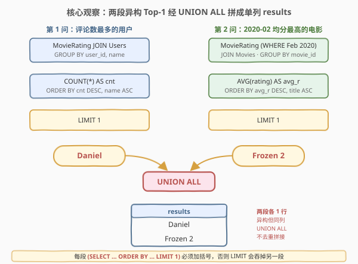
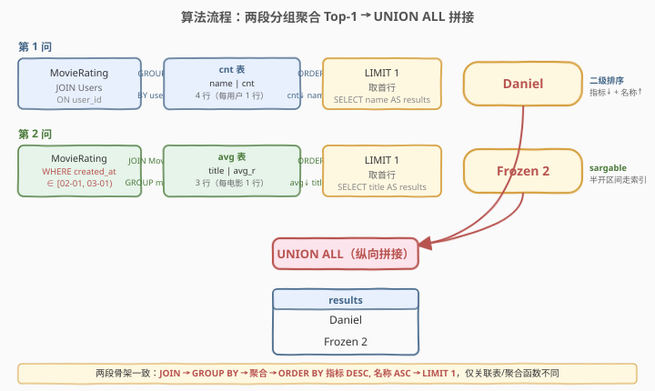
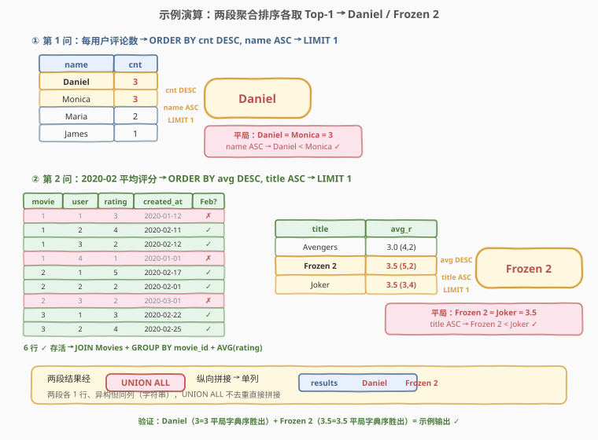

# LeetCode 电影评分 题解

## 1. 题目概述

- **标题 / 题号**：电影评分（#1341，medium）
- **链接**：https://leetcode.cn/problems/movie-rating/
- **难度**：中等
- **标签**：数据库、SQL、JOIN、GROUP BY、聚合、ORDER BY 排序与平局、LIMIT、UNION ALL、日期范围过滤、pandas

**题意**：给定三张表：`Movies`（电影）、`Users`（用户）、`MovieRating`（用户对电影的评分记录，含评分日期）。请编写解决方案完成**两件互相独立的事**，并把它们的答案拼成一列返回：

1. **查找评论电影数量最多的用户名**。若出现平局，返回字典序较小的用户名。
2. **查找在 `February 2020`（2020 年 2 月）平均评分最高的电影名称**。若出现平局，返回字典序较小的电影名称。

结果以单列 `results` 返回：**第一行是第 1 问的用户名，第二行是第 2 问的电影名**。

> ⚠️ 关键陷阱有三处：
> ① **两问异构但同列**——第 1 问返回「用户名」、第 2 问返回「电影名」，二者来自不同的表、不同的聚合维度，却要拼进同一个 `results` 列。这正是 `UNION ALL` 的招牌场景：把结构相同（单列字符串）、语义不同的两段查询纵向拼接。
> ② **平局用字典序打破**——两问都有「指标相同取字典序较小」的要求，需用 `ORDER BY <指标> DESC, <名称> ASC` 的二级排序 + `LIMIT 1`。
> ③ **「2020 年 2 月」要写成可走索引的范围**——`created_at >= '2020-02-01' AND created_at < '2020-03-01'` 优于 `DATE_FORMAT()` / `YEAR()*100+MONTH()`，前者是 **sargable**（可利用索引）的。

**表结构**：

```text
Table: Movies
+---------------+---------+
| Column Name   | Type    |
+---------------+---------+
| movie_id      | int     |  ← 主键
| title         | varchar |  ← 电影名（唯一）
+---------------+---------+

Table: Users
+---------------+---------+
| Column Name   | Type    |
+---------------+---------+
| user_id       | int     |  ← 主键
| name          | varchar |  ← 用户名（唯一）
+---------------+---------+

Table: MovieRating
+---------------+---------+
| Column Name   | Type    |
+---------------+---------+
| movie_id      | int     |  ← 主键之一
| user_id       | int     |  ← 主键之一
| rating        | int     |  ← 评分
| created_at    | date    |  ← 评分日期
+---------------+---------+
```

- `(movie_id, user_id)` 是 `MovieRating` 的复合主键——**同一用户对同一电影只能评分一次**，因此「评论电影数量」= 该用户在 `MovieRating` 中的行数，无需 `COUNT(DISTINCT movie_id)`。
- `Users.name` 与 `Movies.title` 列均具唯一性，平局时字典序比较的是这些唯一名称。

**示例 1**：

```text
输入：
Movies 表：
+-------------+--------------+
| movie_id    |  title       |
+-------------+--------------+
| 1           | Avengers     |
| 2           | Frozen 2     |
| 3           | Joker        |
+-------------+--------------+
Users 表：
+-------------+--------------+
| user_id     |  name        |
+-------------+--------------+
| 1           | Daniel       |
| 2           | Monica       |
| 3           | Maria        |
| 4           | James        |
+-------------+--------------+
MovieRating 表：
+-------------+--------------+--------------+-------------+
| movie_id    | user_id      | rating       | created_at  |
+-------------+--------------+--------------+-------------+
| 1           | 1            | 3            | 2020-01-12  |
| 1           | 2            | 4            | 2020-02-11  |
| 1           | 3            | 2            | 2020-02-12  |
| 1           | 4            | 1            | 2020-01-01  |
| 2           | 1            | 5            | 2020-02-17  |
| 2           | 2            | 2            | 2020-02-01  |
| 2           | 3            | 2            | 2020-03-01  |
| 3           | 1            | 3            | 2020-02-22  |
| 3           | 2            | 4            | 2020-02-25  |
+-------------+--------------+--------------+-------------+

输出：
Result 表：
+--------------+
| results      |
+--------------+
| Daniel       |
| Frozen 2     |
+--------------+
```

**解释**：

**第 1 问**（每用户评论电影数）：

| user_id | name | 评论数 |
|---------|------|--------|
| 1 | Daniel | 3（电影 1,2,3） |
| 2 | Monica | 3（电影 1,2,3） |
| 3 | Maria | 2（电影 1,2） |
| 4 | James | 1（电影 1） |

Daniel 与 Monica 并列最多（3），字典序 `Daniel < Monica`，故取 **Daniel**。

**第 2 问**（2020-02 各电影平均评分）：

| movie_id | title | 2 月评分明细 | 平均 |
|----------|-------|-------------|------|
| 1 | Avengers | 4, 2 | 3.0 |
| 2 | Frozen 2 | 5, 2 | 3.5 |
| 3 | Joker | 3, 4 | 3.5 |

Frozen 2 与 Joker 并列最高（3.5），字典序 `Frozen 2 < Joker`，故取 **Frozen 2**。

> 💡 注意第 2 问的「日期过滤」：电影 2 的 `(user3, 2, 2020-03-01)` 在 3 月被排除；电影 1 的 `(user1, 3, 2020-01-12)` 与 `(user4, 1, 2020-01-01)` 在 1 月被排除。过滤后电影 1 只剩 2 行 2 月评分。

**约束**：

- `created_at` 为日期类型
- `rating` 为整数
- `Users.name`、`Movies.title` 唯一
- 结果固定两行：第一行用户名，第二行电影名
- 输出列名：`results`

## 2. 解题思路

### 2.1 暴力思路：两段查询分别求 Top-1

两问各自独立，最直觉的拆法是分别写一段「分组聚合 + 排序 + 取首行」的查询：

- **第 1 问**：`MovieRating JOIN Users` → `GROUP BY user_id` → `COUNT(*) DESC, name ASC` → `LIMIT 1`。
- **第 2 问**：`MovieRating`（过滤 2020-02）`JOIN Movies` → `GROUP BY movie_id` → `AVG(rating) DESC, title ASC` → `LIMIT 1`。

这两段单独看都没难度。真正的题眼在于：**题目要求把两个异构结果塞进同一个 `results` 列**——一个返回用户名，一个返回电影名，列数相同（都是一列字符串），可以纵向拼接。

### 2.2 核心观察：UNION ALL 纵向拼接两段异构 Top-1



关键洞察分三层：

**第一层：UNION ALL 是「同构列」的纵向胶水**。`UNION ALL` 要求两段查询的列数与各列类型一致，把上段结果行接在下段结果行之后。本题两段都 `SELECT <名称> AS results`——列数 1、类型字符串——天然同构，可用 `UNION ALL` 拼成两行的 `results` 列。

**第二层：每段内部是「分组聚合 + 二级排序 + LIMIT 1」**。两问的骨架完全一致，只是聚合函数与排序键不同：

| 维度 | 第 1 问 | 第 2 问 |
|------|---------|---------|
| 关联表 | `Users`（取用户名） | `Movies`（取电影名） |
| 分组键 | `user_id` | `movie_id` |
| 聚合指标 | `COUNT(*)`（评论数） | `AVG(rating)`（平均分） |
| 主排序 | `COUNT(*) DESC` | `AVG(rating) DESC` |
| 平局次排序 | `name ASC` | `title ASC` |
| 取首行 | `LIMIT 1` | `LIMIT 1` |

**第三层：UNION ALL 而非 UNION**。两段各返回且仅返回 1 行（经 `LIMIT 1`），即便理论上两行的字符串值相同（用户名恰等于某电影名），`UNION` 会去重而丢失一行。`UNION ALL` 保留全部行，且省去除重排序开销——**只要确定无需去重，一律用 `UNION ALL`**。

> ⚠️ **语法细节**：MySQL 中 `UNION` 连接多段 `SELECT` 且某段含 `ORDER BY ... LIMIT` 时，**必须给该段加括号** `(SELECT ... ORDER BY ... LIMIT 1)`，否则 `ORDER BY/LIMIT` 会被解析为整个 UNION 的整体排序，导致只对最终合并结果取 1 行，丢掉另一段。这是本题最易踩的坑。

### 2.3 算法流程图



**两段并行流水线，末端 UNION ALL**：

1. **第 1 问流水线**：
   - `MovieRating JOIN Users ON user_id` → 带用户名的评分明细。
   - `GROUP BY user_id, name` → 每用户一行，算 `COUNT(*) AS cnt`。
   - `ORDER BY cnt DESC, name ASC` → 评论数降序，平局按字典序升序。
   - `LIMIT 1` → 取首行 `name`，作为 `results` 列。

2. **第 2 问流水线**：
   - `MovieRating` 经 `WHERE created_at >= '2020-02-01' AND created_at < '2020-03-01'` 过滤 2 月评分。
   - `JOIN Movies ON movie_id` → 带电影名的 2 月评分。
   - `GROUP BY movie_id, title` → 每电影一行，算 `AVG(rating) AS avg_r`。
   - `ORDER BY avg_r DESC, title ASC` → 均分降序，平局按字典序升序。
   - `LIMIT 1` → 取首行 `title`，作为 `results` 列。

3. **`UNION ALL`** 把两段各 1 行纵向拼接 → 2 行 `results` 列。

> 💡 **日期过滤为何用范围而非函数？** `WHERE created_at >= '2020-02-01' AND created_at < '2020-03-01'` 是 **sargable**（Search Argument Able）谓词——数据库可直接走 `created_at` 上的索引做范围扫描。而 `DATE_FORMAT(created_at,'%Y-%m')='2020-02'` 或 `YEAR(created_at)=2020 AND MONTH(created_at)=2` 对列套了函数，索引失效，退化为全表扫描。详见第 5 节。

### 2.4 示例演算

以示例 1 数据，跟踪两段流水线：



**第 1 问演算**：

`MovieRating JOIN Users` 后按 `user_id` 分组计 `COUNT(*)`：

| user_id | name | cnt |
|---------|------|-----|
| 1 | Daniel | 3 |
| 2 | Monica | 3 |
| 3 | Maria | 2 |
| 4 | James | 1 |

`ORDER BY cnt DESC, name ASC` 后排序为 Daniel(3) → Monica(3) → Maria(2) → James(1)，`LIMIT 1` 取 **Daniel**。

**第 2 问演算**：

`MovieRating` 过滤 2020-02 后剩 6 行（排除 01-12、01-01、03-01 三行），`JOIN Movies` 后按 `movie_id` 分组算 `AVG(rating)`：

| movie_id | title | 2 月 rating 明细 | avg_r |
|----------|-------|------------------|-------|
| 1 | Avengers | 4, 2 | 3.0000 |
| 2 | Frozen 2 | 5, 2 | 3.5000 |
| 3 | Joker | 3, 4 | 3.5000 |

`ORDER BY avg_r DESC, title ASC` 后排序为 Frozen 2(3.5) → Joker(3.5) → Avengers(3.0)，`LIMIT 1` 取 **Frozen 2**。

**UNION ALL 拼接** → `results = [Daniel, Frozen 2]`。

> 💡 **验证平局处理**：第 1 问 Daniel 与 Monica 均 3 次，`name ASC` 让 Daniel 排前；第 2 问 Frozen 2 与 Joker 均 3.5，`title ASC` 让 Frozen 2 排前。两处平局均由字典序次排序正确打破。

## 3. 参考代码

### MySQL（解法 A：UNION ALL + 两段括号化 Top-1，推荐）

```sql
# 1341. 电影评分
# 思路：两段「分组聚合 + 二级排序 + LIMIT 1」经 UNION ALL 拼成单列 results
# 第 1 问：评论数最多的用户名（平局取字典序小）
# 第 2 问：2020-02 平均评分最高的电影名（平局取字典序小）
(SELECT u.name AS results
 FROM MovieRating mr
 JOIN Users u ON u.user_id = mr.user_id
 GROUP BY u.user_id, u.name
 ORDER BY COUNT(*) DESC, u.name ASC
 LIMIT 1)
UNION ALL
(SELECT m.title AS results
 FROM MovieRating mr
 JOIN Movies m ON m.movie_id = mr.movie_id
 WHERE mr.created_at >= '2020-02-01' AND mr.created_at < '2020-03-01'
 GROUP BY m.movie_id, m.title
 ORDER BY AVG(mr.rating) DESC, m.title ASC
 LIMIT 1);
```

> 💡 **写法要点**：
> - **括号必不可少**：每段 `(SELECT ... ORDER BY ... LIMIT 1)` 都用括号包裹，确保 `ORDER BY/LIMIT` 作用于该段而非整个 `UNION`。去掉括号是本题最高频的错法。
> - **`COUNT(*)` 而非 `COUNT(DISTINCT movie_id)`**：`(movie_id, user_id)` 是主键，同一用户对同一电影最多一行，`COUNT(*)` 即评论电影数。
> - **`GROUP BY user_id, name`**：含 `name` 是为了 `SELECT u.name` 在严格 `ONLY_FULL_GROUP_BY` 模式下合法（`name` 函数依赖 `user_id`，但显式列出更稳妥）。
> - **sargable 日期范围**：`>= '2020-02-01' AND < '2020-03-01'` 走索引；`< '2020-03-01'` 涵盖 2 月 29 日（2020 闰年），无需关心天数。
> - **二级排序**：`ORDER BY <指标> DESC, <名称> ASC` 是「指标最大、平局字典序最小」的标准写法。
> - **`UNION ALL`**：两段各 1 行、语义不同，无需去重，省去 `UNION` 的排序去重开销。

### MySQL（解法 B：窗口函数 RANK + UNION ALL）

```sql
# 解法 B：用 RANK() 窗口函数取 Top-1，避免 LIMIT 括号嵌套
WITH
u_rank AS (
    SELECT u.name AS results,
           RANK() OVER (ORDER BY COUNT(*) DESC, u.name ASC) AS rn
    FROM MovieRating mr
    JOIN Users u ON u.user_id = mr.user_id
    GROUP BY u.user_id, u.name
),
m_rank AS (
    SELECT m.title AS results,
           RANK() OVER (ORDER BY AVG(mr.rating) DESC, m.title ASC) AS rn
    FROM MovieRating mr
    JOIN Movies m ON m.movie_id = mr.movie_id
    WHERE mr.created_at >= '2020-02-01' AND mr.created_at < '2020-03-01'
    GROUP BY m.movie_id, m.title
)
SELECT results FROM u_rank WHERE rn = 1
UNION ALL
SELECT results FROM m_rank WHERE rn = 1;
```

> 💡 **写法要点**：
> - 用 `RANK() OVER (ORDER BY 指标 DESC, 名称 ASC)` 把「排序 + 平局」一次性编码为 `rn`，`rn = 1` 即 Top-1。`RANK` 允许并列（同指标同名称者同 `rn`），但本题名称唯一，`rn = 1` 恰一行。
> - 优势：`UNION ALL` 两段都是普通 `SELECT`（无 `ORDER BY/LIMIT`），**不需要括号**，规避了括号陷阱。
> - 代价：需 MySQL 8.0+（窗口函数），且两段各做一次窗口排序，略慢于解法 A 的 `LIMIT 1`（优化器对 `LIMIT 1` 可提前终止排序）。
> - ⚠️ 用 `DENSE_RANK` 亦可，但本题名称唯一不会产生并列，三者等价；`ROW_NUMBER` 则严格不并列，最稳妥。

### Python（pandas）

```python
import pandas as pd

def movie_rating(movies: pd.DataFrame, users: pd.DataFrame, movie_rating: pd.DataFrame) -> pd.DataFrame:
    # 第 1 问：评论电影数最多的用户名（平局取字典序小）
    cnt = (movie_rating.groupby('user_id')
                       .size()
                       .reset_index(name='cnt')
                       .merge(users[['user_id', 'name']], on='user_id'))
    cnt = cnt.sort_values(by=['cnt', 'name'], ascending=[False, True])
    top_user = cnt.iloc[0]['name']

    # 第 2 问：2020-02 平均评分最高的电影名（平局取字典序小）
    mr = movie_rating.copy()
    mr['created_at'] = pd.to_datetime(mr['created_at'])
    feb = mr[(mr['created_at'] >= '2020-02-01') & (mr['created_at'] < '2020-03-01')]
    avg = (feb.groupby('movie_id')['rating']
              .mean()
              .reset_index(name='avg_r')
              .merge(movies[['movie_id', 'title']], on='movie_id'))
    avg = avg.sort_values(by=['avg_r', 'title'], ascending=[False, True])
    top_movie = avg.iloc[0]['title']

    return pd.DataFrame({'results': [top_user, top_movie]})
```

> 💡 **pandas 对照**：
> - `groupby('user_id').size()` 对应 `COUNT(*)`；`merge(users, on='user_id')` 对应 `JOIN Users`。
> - `sort_values(['cnt','name'], ascending=[False,True])` + `iloc[0]` 对应 `ORDER BY cnt DESC, name ASC LIMIT 1`——pandas 的多键排序用两个并列的 `ascending` 列表控制各键方向。
> - `pd.to_datetime` 后用布尔范围过滤对应 `WHERE created_at >= ... AND < ...`，同样走索引无关（pandas 无索引概念，但语义清晰）。
> - `groupby('movie_id')['rating'].mean()` 对应 `AVG(rating)`。
> - 最终 `pd.DataFrame({'results': [top_user, top_movie]})` 对应 `UNION ALL`——两段异构结果手动拼成一列。

## 4. 复杂度分析

| 维度 | 解法 A（UNION ALL + LIMIT） | 解法 B（RANK 窗口） | pandas |
|------|---------------------------|---------------------|--------|
| **时间** | $O(n \log n)$ | $O(n \log n)$ | $O(n \log n)$ |
| **空间** | $O(n)$ | $O(n)$ | $O(n)$ |
| **依赖** | 通用 SQL | MySQL 8.0+ | pandas |
| **推荐度** | ✓ **首选** | △ 规避括号 | ✓ pandas 环境 |

> - $n$ = `MovieRating` 表行数
> - **解法 A**：两段各做一次 `GROUP BY`（哈希聚合 $O(n)$ 或排序聚合 $O(n \log n)$）+ `ORDER BY`（$O(n \log n)$，但 `LIMIT 1` 可使排序优化为 Top-K 堆，$O(n \log 1) = O(n)$）；`JOIN` 走哈希 $O(n)$。整体 $O(n \log n)$，常数因子小。
> - **解法 B**：两段各做窗口排序 $O(n \log n)$，无 `LIMIT` 提前终止，常数略大。
> - **索引优化**：在 `MovieRating(user_id)`、`MovieRating(movie_id)`、`MovieRating(created_at)` 上建索引可加速 `GROUP BY`/`JOIN`/范围过滤；`(created_at, movie_id)` 复合索引可让第 2 问的过滤+分组全程索引扫。

## 5. 扩展：UNION 家族与 sargable 日期过滤

### 5.1 UNION vs UNION ALL vs UNION DISTINCT

`UNION` 把多段 `SELECT` 结果纵向拼接，去重与否是核心差异：

| 操作 | 去重 | 开销 | 何时用 |
|------|------|------|--------|
| `UNION ALL` | 否 | $O(n)$（直接拼接） | **确定无重复或需要保留重复行** |
| `UNION` / `UNION DISTINCT` | 是（按全部列去重） | $O(n \log n)$（需排序/哈希去重） | 需要去重且无法在段内保证 |

> 💡 **本题为何用 `UNION ALL`**：两段各 `LIMIT 1` 返回 1 行，且一行是用户名、一行是电影名，语义上不可能重复。即使用 `UNION` 结果不变，但白白付出一次去重排序。**口诀：能用 `UNION ALL` 就别用 `UNION`**——除非你明确需要跨段去重。

需跨段去重的典型场景：合并两份「可能重叠」的用户名单（如「活跃用户」∪「付费用户」），此时用 `UNION` 消除重复用户。

### 5.2 sargable 日期过滤

「2020 年 2 月」有三种写法，性能天差地别：

| 写法 | sargable | 走索引 | 说明 |
|------|----------|--------|------|
| `created_at >= '2020-02-01' AND created_at < '2020-03-01'` | ✅ 是 | ✅ 范围扫 | **推荐**，半开区间涵盖 2 月 29 日 |
| `created_at BETWEEN '2020-02-01' AND '2020-02-29'` | ✅ 是 | ✅ 范围扫 | 闭区间，需知 2020 闰年有 29 天 |
| `DATE_FORMAT(created_at,'%Y-%m')='2020-02'` | ❌ 否 | ❌ 全表扫 | 列套函数，索引失效 |
| `YEAR(created_at)=2020 AND MONTH(created_at)=2` | ❌ 否 | ❌ 全表扫 | 列套函数，索引失效 |

> ⚠️ **sargable 原则**：`WHERE` 条件中**不要对列套函数**，把变换挪到常量侧。`DATE_FORMAT(col,...)=c` 应改写为 `col >= start AND col < end`。若 `created_at` 是 `DATETIME` 而非 `DATE`，半开区间 `< '2020-03-01'` 仍正确（涵盖 `2020-02-29 23:59:59`）；而 `BETWEEN '2020-02-01' AND '2020-02-29'` 会漏掉 `2020-02-29` 当天 00:00:01 之后的时间——这是半开区间优于闭区间的另一理由。

### 5.3 「分组 Top-1」三种范式

「每组取指标最大的一行」是 SQL 高频题眼，本题两问都是「全局 Top-1」（分组后整体取首行）。三种实现：

| 范式 | 写法 | 特点 |
|------|------|------|
| **ORDER BY + LIMIT** | `ORDER BY 指标 DESC, 名称 ASC LIMIT 1` | 最直观，优化器可 Top-K 提前终止；**需括号**（UNION 场景） |
| **RANK/DENSE_RANK 窗口** | `RANK() OVER (ORDER BY 指标 DESC, 名称 ASC)` 取 `rn=1` | 处理并列天然，UNION 场景无需括号 |
| **相关子查询** | `WHERE 指标 = (SELECT MAX(指标) FROM ...)` | 兼容老版本，但 $O(n^2)$，性能差 |

> 💡 本题解法 A 用 `ORDER BY + LIMIT`（推荐），解法 B 用 `RANK`（规避括号）。若需「每组 Top-1」（如每个部门的最高薪员工，见 184），则用 `RANK() OVER (PARTITION BY 分组键 ORDER BY 指标 DESC)` 取 `rn=1`。

## 6. 面试要点

1. **为什么必须给每段 `SELECT` 加括号？**

   > 在 `UNION` 中，若某段含 `ORDER BY ... LIMIT n` 而未加括号，解析器会把 `ORDER BY/LIMIT` 当作**整个 UNION 结果**的整体排序与截断。结果是先合并两段全部行，再排序取前 n 行——另一段的行会被丢掉。加括号 `(SELECT ... ORDER BY ... LIMIT 1)` 把排序限制在该段内部，保证两段各取 1 行后再 `UNION ALL`。

2. **`UNION ALL` 和 `UNION` 在本题的区别？为何选前者？**

   > `UNION` 会对合并后的结果按全部列去重，`UNION ALL` 不去重。本题两段各返回 1 行且语义不同（用户名 vs 电影名），不可能重复。用 `UNION ALL` 省去一次排序去重，性能更优且语义更准（即便两行字符串碰巧相同也各自保留）。**口诀：确定无需去重一律 `UNION ALL`**。

3. **第 1 问为什么用 `COUNT(*)` 而非 `COUNT(DISTINCT movie_id)`？**

   > `MovieRating` 的主键是 `(movie_id, user_id)`，意味着同一用户对同一电影最多一行评分记录。因此某用户在表中的行数就等于其评论的电影数，`COUNT(*)` 即可。`COUNT(DISTINCT movie_id)` 虽结果相同但多一次去重开销。**主键语义是简化聚合的钥匙**。

4. **如何过滤「2020 年 2 月」才能走索引？**

   > 用半开区间 `created_at >= '2020-02-01' AND created_at < '2020-03-01'`。这是 sargable 谓词，数据库可直接在 `created_at` 索引上做范围扫描。`DATE_FORMAT(created_at,'%Y-%m')='2020-02'` 或 `YEAR()/MONTH()` 对列套函数，索引失效，退化为全表扫。半开区间还天然兼容 `DATE` 与 `DATETIME` 类型，无需关心 2 月天数或闰年。

5. **如果某用户从未评分，第 1 问会返回他吗？**

   > 不会。第 1 问从 `MovieRating JOIN Users` 出发，`JOIN`（内连接）只保留评分过的用户。未评分用户不在 `MovieRating` 中，自然被排除。题目求「评论数量最多」，未评论者数量为 0 不参与。若题目改要求「列出所有用户及其评论数（含 0）」，才需 `RIGHT JOIN Users` 或从 `Users LEFT JOIN MovieRating` 出发。

> 💡 **一句话总结**：1341 是 SQL **「UNION ALL 拼接异构 Top-1」招牌题**——两段「分组聚合 + 二级排序 + LIMIT 1」纵向拼成单列。三大坑：① 每段加括号防 `LIMIT` 被吞；② `UNION ALL` 而非 `UNION`；③ 日期过滤用 sargable 半开区间。核心范式：`ORDER BY 指标 DESC, 名称 ASC LIMIT 1` 是「指标最大、平局字典序最小」的标准写法。

## 同类练习题

| # | 题目 | 与本题的关联 |
|---|------|-------------|
| 184 | [部门工资最高的员工](https://leetcode.cn/problems/department-highest-salary/)（[题解](../0101-0200/184_部门工资最高的员工.md)） | `RANK() OVER (PARTITION BY 部门 ORDER BY 薪资 DESC)` 每组 Top-1——本题的「全局 Top-1」升级为「分组 Top-1」，加 `PARTITION BY` 即可 |
| 511 | [游戏玩法分析 I](https://leetcode.cn/problems/game-play-analysis-i/)（[题解](../0501-0600/511_游戏玩法分析I.md)） | `GROUP BY player_id + MIN(event_date)` 每组取最小——`ORDER BY + 聚合` 的入门题，对照理解 `GROUP BY` 收缩行 |
| 1174 | [即时食物配送 II](https://leetcode.cn/problems/immediate-food-delivery-ii/)（[题解](../1101-1200/1174_即时食物配送II.md)） | `GROUP BY customer_id + MIN(order_date)` 两步聚合求首单占比——`GROUP BY` 收缩后再算比例，承接「分组 Top-1」延伸 |
| 1211 | [查询结果的质量和占比](https://leetcode.cn/problems/queries-quality-and-percentage/)（[题解](../1201-1300/1211_查询结果的质量和占比.md)） | `GROUP BY` + `AVG`/`SUM` 聚合计算——`AVG` 聚合与占比计算的组合，对照第 2 问的 `AVG(rating)` |
| 1179 | [重新格式化部门表](https://leetcode.cn/problems/reformat-department-table/)（[题解](../1101-1200/1179_重新格式化部门表.md)） | `CASE WHEN` + `SUM` 行转列——另一种「单列变多列」的透视手法，对照本题「多段拼单列」的逆操作 |
