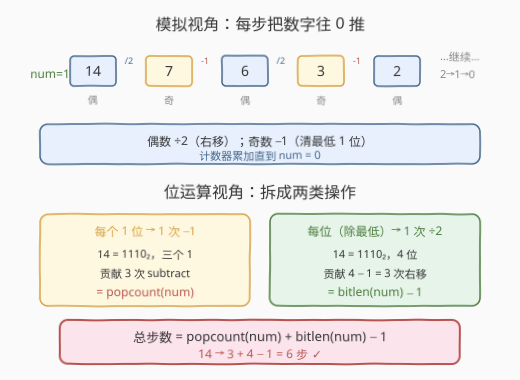
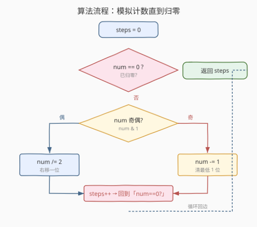
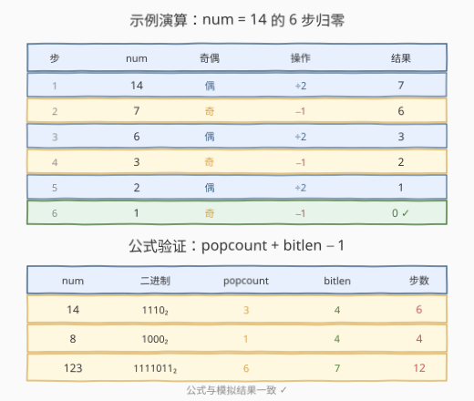

# LeetCode 将数字变成 0 的操作步骤数 题解

## 1. 题目概述

- **标题 / 题号**：将数字变成 0 的操作步骤数（#1342，easy）
- **链接**：https://leetcode.cn/problems/number-of-steps-to-reduce-a-number-to-zero/
- **难度**：简单
- **标签**：位运算、数学、模拟

**题意**：给你一个非负整数 `num`，请你返回将它变成 `0` 所需要的步数。每一步中，如果当前数字是偶数，你需要把它除以 2；否则，减去 1。

**示例 1**：

```text
输入：num = 14
输出：6
解释：
步骤 1) 14 是偶数，除以 2 得到 7 。
步骤 2)  7 是奇数，减去 1 得到 6 。
步骤 3)  6 是偶数，除以 2 得到 3 。
步骤 4)  3 是奇数，减去 1 得到 2 。
步骤 5)  2 是偶数，除以 2 得到 1 。
步骤 6)  1 是奇数，减去 1 得到 0 。
```

**示例 2**：

```text
输入：num = 8
输出：4
解释：
步骤 1) 8 是偶数，除以 2 得到 4 。
步骤 2) 4 是偶数，除以 2 得到 2 。
步骤 3) 2 是偶数，除以 2 得到 1 。
步骤 4) 1 是奇数，减去 1 得到 0 。
```

**示例 3**：

```text
输入：num = 123
输出：12
```

**约束**：

- $0 \le num \le 10^6$

> 💡 本题规则极简：**偶数除以 2，奇数减 1**，数到归零为止。直接模拟即可，但若把「除以 2」看作右移、「减 1」看作清除最低位 1，会发现一个漂亮的位运算闭式解。

## 2. 解题思路

### 2.1 暴力思路：按规则逐步模拟

最直白的做法：用一个计数器 `steps`，只要 `num != 0` 就按规则更新 `num` 并 `steps++`。每次操作由 `num` 的奇偶性决定：

- 偶数：`num /= 2`（等价于右移一位 `num >>= 1`）
- 奇数：`num -= 1`（等价于清除最低位的 1，因为奇数最低位必为 1）

`num` 每步严格递减（奇数减 1 变偶数，偶数除以 2 至少折半），故必然终止，步数有限。时间复杂度由「最多走多少步」决定——`num` 每两步至少折半一次，故步数为 $O(\log num)$。

> ⚠️ 注意 `num = 0` 的边界：循环条件 `num != 0` 直接跳过，返回 0 步。约束允许 `num = 0`，勿遗漏。

### 2.2 核心观察：模拟 + 位运算双视角



关键点：

- **偶数 ÷2 = 右移**：二进制下，偶数最低位为 0，`num / 2` 等价于 `num >> 1`，即整体右移一位、丢掉一个最低位。每做一次右移，就把数字的**有效位数减少 1**。
- **奇数 −1 = 清最低位 1**：奇数最低位为 1，`num - 1` 把这一位 1 变成 0（其余高位不变），等价于「清除最低位的 1」。每做一次减 1，就**消灭一个 1 位**。
- **归零 = 消灭所有 1 位 + 右移到无位可移**：要让 `num` 变 0，必须把每一个 1 位都通过「减 1」清掉，且每清一个高位 1 后还需通过若干次右移把它移到最低位才能清除。

由此得到**步数闭式**：

$$\text{steps} = \text{popcount}(num) + \text{bitlen}(num) - 1$$

其中：

- $\text{popcount}(num)$：`num` 的二进制中 1 的个数。每个 1 都需要一次「减 1」操作清除。
- $\text{bitlen}(num) - 1$：`num` 的二进制位数减 1。除最高位外，每个位都需要一次「右移」操作把它挤掉（最高位无需右移，因为最后的 1 被减 1 直接清零）。
- 减 1 是因为最后一步是「减 1 清掉最高位的 1」直接归零，不需要再右移。

> 💡 **正确性论证**（以 $num = 14 = 1110_2$ 为例）：三个 1 位 → 3 次减 1；位数 4 → 最高位之外有 3 个低位需要 3 次右移挤掉；合计 $3 + (4-1) = 6$ 步。模拟过程 14→7→6→3→2→1→0 恰为 6 步，吻合。公式对所有 $num > 0$ 成立；$num = 0$ 时 $\text{bitlen} = 0$、$\text{popcount} = 0$，公式给出 $-1$，故需单独返回 0。

### 2.3 算法流程图



**完整步骤**（模拟法）：

1. 初始化 `steps = 0`。
2. 当 `num != 0` 时循环：
   - 若 `num` 为偶数（`num & 1 == 0`）：`num >>= 1`。
   - 否则（`num` 为奇数）：`num -= 1`。
   - `steps += 1`。
3. 返回 `steps`。

> 💡 奇偶判定用位运算 `num & 1`：结果为 0 即偶、为 1 即奇，比取模 `num % 2` 更直观地体现「看最低位」。除以 2 用 `num >>= 1` 也比 `num /= 2` 更贴合本题的位视角。

### 2.4 示例演算

以 `num = 14` 为例逐步模拟：



| 步 | num | 奇偶 | 操作 | 结果 |
|----|-----|------|------|------|
| 1 | 14 | 偶 | ÷2 | 7 |
| 2 | 7 | 奇 | −1 | 6 |
| 3 | 6 | 偶 | ÷2 | 3 |
| 4 | 3 | 奇 | −1 | 2 |
| 5 | 2 | 偶 | ÷2 | 1 |
| 6 | 1 | 奇 | −1 | 0 ✓ |

三个官方示例的闭式验证：

| num | 二进制 | popcount | bitlen | 公式 $pc + bl - 1$ | 步数 |
|-----|--------|----------|--------|---------------------|------|
| 14 | $1110_2$ | 3 | 4 | $3 + 4 - 1 = 6$ | 6 |
| 8 | $1000_2$ | 1 | 4 | $1 + 4 - 1 = 4$ | 4 |
| 123 | $1111011_2$ | 6 | 7 | $6 + 7 - 1 = 12$ | 12 |

公式与模拟结果完全一致。

## 3. 参考代码

### C++

```cpp
// 写法一：模拟，循环计数
class Solution {
public:
    int numberOfSteps(int num) {
        int steps = 0;
        while (num) {
            if (num & 1) num -= 1;
            else        num >>= 1;
            ++steps;
        }
        return steps;
    }
};
```

```cpp
// 写法二：位运算闭式 steps = popcount + bitlen - 1
class Solution {
public:
    int numberOfSteps(int num) {
        if (num == 0) return 0;
        return __builtin_popcount(num) + 31 - __builtin_clz(num);
    }
};
```

### Python

```python
# 写法一：模拟，循环计数
class Solution:
    def numberOfSteps(self, num: int) -> int:
        steps = 0
        while num:
            if num & 1:
                num -= 1
            else:
                num >>= 1
            steps += 1
        return steps
```

```python
# 写法二：位运算闭式 steps = popcount + bitlen - 1
class Solution:
    def numberOfSteps(self, num: int) -> int:
        if num == 0:
            return 0
        return num.bit_count() + num.bit_length() - 1
```

> 💡 **实现细节**：① 模拟法用 `num & 1` 判奇偶、`num >>= 1` 做除 2，全部位运算化，避免取模与除法。② 闭式法中 `bitlen(num) = 32 - __builtin_clz(num)`（GCC 内建函数 `__builtin_clz` 数前导零），等价于「最高有效位的位置 + 1」；Python 3.10+ 的 `int.bit_count()` 即 popcount，`int.bit_length()` 即 bitlen。③ `num = 0` 在闭式法中需特判返回 0（否则 `bitlen = 0` 使公式得 $-1$）；模拟法的 `while (num)` 天然处理此边界。

## 4. 复杂度分析

| 维度 | 复杂度 | 说明 |
|------|--------|------|
| 时间复杂度（模拟） | $O(\log num)$ | 每两步至少折半一次，步数 $\approx \log_2 num + \text{popcount}$，上限约 $2\log_2 num$ |
| 时间复杂度（闭式） | $O(1)$ | `popcount`/`clz` 为 CPU 单指令（POPCNT/BSR），常数时间 |
| 空间复杂度 | $O(1)$ | 仅常数个整型变量 |

> ⚠️ 本题 $num \le 10^6$，二进制至多 20 位，模拟法最多约 20 步，两种写法实际开销几乎相同。闭式法的优势在 $num$ 极大（如 $10^{18}$，仍 60 余位）时才显现——避免循环、单指令出结果。

## 5. 扩展：更一般的归零规则

**改为「奇数减 1、偶数除 2」但允许减任意正奇数**：若规则放宽为「奇数可减任意不超过自身的正奇数」，则可一步清掉多个 1 位（如 $7 = 111_2$ 直接减 7 归零），步数退化为「最少拆成多少个 2 的幂之和」= $\text{popcount}(num)$，即 [191. 位 1 的个数](../0001-0100/191_位1的个数.md)。

**改为「偶数除 2、奇数加 1」**：若奇数改为「加 1」，则奇数加 1 会产生连续进位、把一串 1 变成 0 并向更高位进 1，步数分析更复杂，需按「连续 1 串」分段计数，是面试追问的好方向。

**大数场景**：若 `num` 为任意精度大整数（千位以上），闭式法的 `popcount`/`bit_length` 仍可在 $O(d)$ 时间完成（$d$ 为位数），优于逐步模拟的 $O(d^2)$（每步大数运算本身有开销）。

> 💡 **一句话总结**：模拟法是「按规则数步数」的直译，闭式法把每步操作对应到「清一个 1 位」或「右移一位」，从而把步数拆成 $\text{popcount}$（减 1 次数）与 $\text{bitlen}-1$（右移次数）两部分之和。

## 6. 面试要点

1. **模拟法为什么一定是 $O(\log num)$ 步？**

   > 每两步至少折半一次：奇数减 1 必变偶数，紧接着的偶数除 2 至少把数折半。故步数上界约 $2\log_2 num$，严格 $O(\log num)$。

2. **闭式公式 `popcount + bitlen - 1` 怎么推导？为什么减 1？**

   > 每个 1 位需一次「减 1」清除，共 $\text{popcount}$ 次；每个非最高位需一次「右移」挤掉，共 $\text{bitlen}-1$ 次。减 1 是因为最后一步是「减 1 清掉仅剩的最高位 1」直接归零，不需要再右移。

3. **`num = 0` 时闭式公式为什么失效？怎么处理？**

   > $num = 0$ 时 $\text{bitlen} = 0$，公式得 $0 + 0 - 1 = -1$，无意义。处理：特判 `if (num == 0) return 0;`。模拟法的 `while (num)` 天然跳过循环返回 0，无需特判。

4. **位运算 `num & 1`、`num >>= 1` 相比 `%`、`/` 有什么优势？**

   > 语义上更贴合本题的「位视角」：`& 1` 直接看最低位判奇偶，`>>= 1` 直接右移丢掉最低位。性能上现代编译器会把 `% 2`、`/ 2` 优化成等价位运算，但写法上位运算更明确表达「我在操作二进制位」的意图，与闭式推导一脉相承。

5. **若 `num` 是 64 位大数，两种写法还能用吗？**

   > 模拟法换成 `long long` 即可，步数至多约 120 步。闭式法用 `__builtin_popcountll` 与 `64 - __builtin_clzll`。Python 的 `int` 任意精度，`bit_count`/`bit_length` 自动适配，无需改动。

## 同类练习题

| # | 题目 | 与本题的关联 |
|---|------|-------------|
| 191 | [位 1 的个数](https://leetcode.cn/problems/number-of-1-bits/)（[题解](../0001-0100/191_位1的个数.md)） | 用 `n & (n-1)` 消最低位 1 数 1 的个数，正是本题闭式公式中 $\text{popcount}$ 的计算模板 |
| 231 | [2 的幂](https://leetcode.cn/problems/power-of-two/)（[题解](../0201-0300/231_2的幂.md)） | 用 `n & (n-1) == 0` 判单 1，巩固「最低位 1」与位运算判定的核心技巧 |
| 371 | [两整数之和](https://leetcode.cn/problems/sum-of-two-integers/)（[题解](../0301-0400/371_两整数之和.md)） | 位运算模拟加法，与本题「用位运算替代算术」同源，进阶版位运算实战 |
| 29 | [两数相除](https://leetcode.cn/problems/divide-two-integers/)（[题解](../0001-0100/29_两数相除.md)） | 用左移翻倍模拟除法，把「除以 2 = 右移」推广到「除以任意数 = 多次右移累加」，位运算除法进阶 |
| 258 | [各位相加](https://leetcode.cn/problems/add-digits/)（[题解](../0201-0300/258_各位相加.md)） | 反复对数位求和直到一位数，同为「反复归约数字」家族，对照模拟与数学闭式两种解法 |
