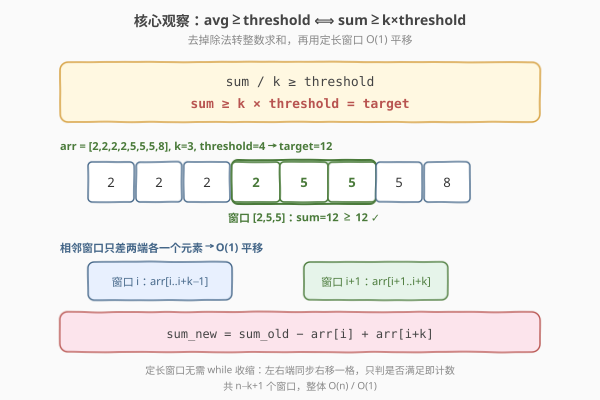
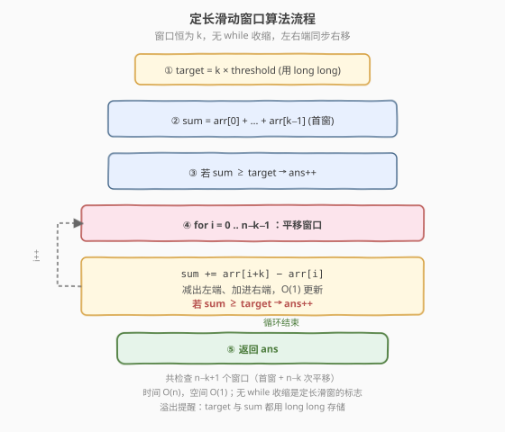
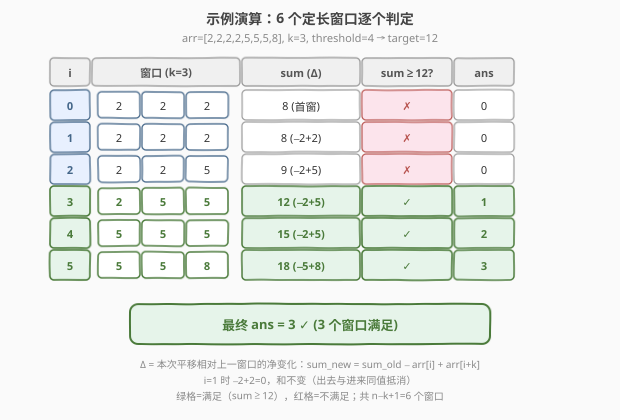

# 大小为 K 且平均值大于等于阈值的子数组数目

- **题目名称**：大小为 K 且平均值大于等于阈值的子数组数目
- **链接**：[1343. 大小为 K 且平均值大于等于阈值的子数组数目](https://leetcode.cn/problems/number-of-sub-arrays-of-size-k-and-average-greater-than-or-equal-to-threshold/)
- **难度**：中等
- **标签**：数组、滑动窗口、前缀和

## 1. 题目概述

给你一个整数数组 `arr` 和两个整数 `k` 与 `threshold`。请你返回**长度恰好为 `k`** 且**平均值大于等于 `threshold`** 的子数组数目。

**示例 1**：

```text
输入：arr = [2,2,2,2,5,5,5,8], k = 3, threshold = 4
输出：3
解释：子数组 [2,5,5]、[5,5,5] 和 [5,5,8] 的平均值分别为 4、5、6，均 ≥ 4。
      其余长度为 3 的子数组平均值都小于 4。
```

**示例 2**：

```text
输入：arr = [11,13,17,23,29,31,7,5,2,3], k = 3, threshold = 5
输出：6
解释：前 6 个长度为 3 的子数组平均值都大于 5（注意平均值不必是整数）。
```

**约束条件**：

- `1 <= arr.length <= 10^5`
- `1 <= arr[i] <= 10^4`
- `1 <= k <= arr.length`
- `0 <= threshold <= 10^4`

> 💡 **固定长度是关键**：题目要求子数组长度**恰好**为 `k`，窗口大小不可变——这正是「定长滑动窗口」的标志特征，比 [1248](../1201-1300/1248_统计优美子数组.md) 那种「长度可变」的滑窗更简单，无需收缩判定。

---

## 2. 解题思路

### 2.1 暴力思路

枚举所有长度为 `k` 的子数组起点 `i`（从 `0` 到 `n-k`），对每个子数组 `arr[i..i+k-1]` 求和、算平均值、与 `threshold` 比较。共 `O(n)` 个子数组，每个求和 `O(k)`，总时间 `O(nk)`，在 `n = 10^5`、`k` 同量级时达到 `10^10` 量级，必然超时。

> ⚠️ 症结在于**每个窗口都从头算和**——相邻窗口只差「出一个元素、进一个元素」，却重复累加了中间 `k-1` 个元素。把这 `O(k)` 的重算摊成 `O(1)`，就是滑动窗口的全部动机。

### 2.2 核心观察：平均值转求和 + 定长滑窗



**观察一：把「平均值」转化为「求和」**

平均值比较涉及除法，既慢又易引入浮点误差。由于 `k` 是正整数，可两边同乘 `k` 去掉分母：

$$
\frac{\text{sum}}{k} \geq \text{threshold} \quad \Longleftrightarrow \quad \text{sum} \geq k \times \text{threshold}
$$

于是判定条件变为：窗口内 `k` 个元素之和 `≥ target`，其中 `target = k * threshold`。**全程整数运算，无浮点**。

> ⚠️ **溢出提醒**：`k` 与 `threshold` 均可达 `10^4`/`10^5`，乘积 `k * threshold` 可达 `10^9`；窗口和 `sum` 同样可达 `10^9`（`10^4 × 10^5`）。两者虽都落在 32 位有符号整数范围内（上限约 `2.1×10^9`），但接近上限，C++ 中建议用 `long long` 存 `target` 与 `sum` 以杜绝隐患；Python 原生大整数无此问题。

**观察二：定长窗口的 `O(1)` 平移**

相邻两个窗口 `arr[i..i+k-1]` 与 `arr[i+1..i+k]` 仅在两端各变动一个元素：

$$
\text{sum}_{i+1} = \text{sum}_{i} - \text{arr}[i] + \text{arr}[i+k]
$$

因此只需先算出首个窗口的和，之后每次「减出、加进」即可 `O(1)` 更新，整体降到 `O(n)`。这比可变长滑窗更直白——窗口长度恒为 `k`，不存在「该不该收缩」的判断，只管平移与计数。

### 2.3 算法流程图



**定长滑动窗口流程**：

1. 计算 `target = k * threshold`（用 `long long` 避免 `k×threshold` 溢出）
2. 计算首个窗口和 `sum = arr[0] + ... + arr[k-1]`
3. 若 `sum ≥ target`，`ans++`
4. 令窗口左端 `i` 从 `0` 到 `n-k-1`，每步：
   - `sum -= arr[i]`（左端元素出窗）
   - `sum += arr[i+k]`（右端新元素进窗）
   - 若 `sum ≥ target`，`ans++`
5. 返回 `ans`

> 💡 **窗口个数为 `n - k + 1`**：起点 `i` 取 `0` 到 `n-k` 共 `n-k+1` 个位置。循环体执行 `n-k` 次平移，加上初始窗口共检查 `n-k+1` 个窗口。

### 2.4 示例演算

以示例 1 `arr = [2,2,2,2,5,5,5,8], k = 3, threshold = 4` 为例，`target = 3 × 4 = 12`：



| 窗口起点 i | 窗口元素 | sum | sum ≥ 12 ? | ans |
|-----------|---------|-----|-----------|-----|
| 0 | [2,2,2] | 8 | ✗ | 0 |
| 1 | [2,2,2] | 8（−2+2） | ✗ | 0 |
| 2 | [2,2,5] | 9（−2+5） | ✗ | 0 |
| 3 | [2,5,5] | 12（−2+5） | ✓ | 1 |
| 4 | [5,5,5] | 15（−2+5） | ✓ | 2 |
| 5 | [5,5,8] | 18（−5+8） | ✓ | 3 |

最终 `ans = 3`，与示例一致。

> 💡 注意 `i=1` 时窗口 `[2,2,2]` 与 `i=0` 的和相同（出去的 `2` 与进来的 `2` 抵消），这正是「减出加进」的妙处——不必关心元素是否相等，只看和的净变化。

---

## 3. 参考代码

### 方法一：定长滑动窗口

#### C++

```cpp
class Solution {
  public:
    int numOfSubarrays(vector<int>& arr, int k, int threshold) {
        long long target = static_cast<long long>(k) * threshold;
        long long sum = 0;
        for (int i = 0; i < k; ++i) sum += arr[i];
        int ans = (sum >= target);
        for (int i = 0; i + k < arr.size(); ++i) {
            sum += arr[i + k] - arr[i];
            if (sum >= target) ++ans;
        }
        return ans;
    }
};
```

#### Python

```python
class Solution:
    def numOfSubarrays(self, arr: List[int], k: int, threshold: int) -> int:
        target = k * threshold
        s = sum(arr[:k])
        ans = 1 if s >= target else 0
        for i in range(len(arr) - k):
            s += arr[i + k] - arr[i]
            if s >= target:
                ans += 1
        return ans
```

> 💡 `sum += arr[i+k] - arr[i]` 把「减出、加进」合成一步，代码更紧凑且只做一次加减。

### 方法二：前缀和

#### C++

```cpp
class Solution {
  public:
    int numOfSubarrays(vector<int>& arr, int k, int threshold) {
        long long target = static_cast<long long>(k) * threshold;
        int n = arr.size();
        vector<long long> pref(n + 1, 0);
        for (int i = 0; i < n; ++i) pref[i + 1] = pref[i] + arr[i];
        int ans = 0;
        for (int i = 0; i + k <= n; ++i)
            if (pref[i + k] - pref[i] >= target) ++ans;
        return ans;
    }
};
```

#### Python

```python
class Solution:
    def numOfSubarrays(self, arr: List[int], k: int, threshold: int) -> int:
        target = k * threshold
        pref = [0]
        for x in arr:
            pref.append(pref[-1] + x)
        return sum(1 for i in range(len(arr) - k + 1)
                   if pref[i + k] - pref[i] >= target)
```

---

## 4. 复杂度分析

| 方法 | 时间复杂度 | 空间复杂度 | 说明 |
|------|-----------|-----------|------|
| 定长滑动窗口 | `O(n)` | `O(1)` | 首窗 `O(k)` + `n-k` 次平移，`left`/`right` 各遍历一次；仅用几个变量 |
| 前缀和 | `O(n)` | `O(n)` | 预处理前缀和 `O(n)` + `n-k+1` 次区间查询 `O(1)`；多一个 `n+1` 的数组 |

> 💡 两种方法时间同为 `O(n)`，但滑动窗口法空间仅需 `O(1)`、常数更小（无额外数组、无第二次遍历的下标开销），是本题的首选。前缀和法的优势在于「可批量回答任意区间和查询」，本题只查固定长度区间，用不上这一优势。

---

## 5. 扩展：定长 vs 变长滑动窗口

滑动窗口按窗口长度是否可变分为两类，本题是**定长**的典型：

| 维度 | 定长滑窗（本题） | 变长滑窗（如 [1248](../1201-1300/1248_统计优美子数组.md)、[209](../0201-0300/209_长度最小的子数组.md)） |
|------|------------------|--------------------------------------------------------------------------------------------------------------|
| **窗口大小** | 恒为 `k`，由题面给定 | 由条件动态收缩/扩张 |
| **移动方式** | 左右端同步右移一格（`i`、`i+k` 各 +1） | `right` 主动扩张，`left` 按需收缩 |
| **判定逻辑** | 只判「是否满足」，无需收缩 | 满足后还要尝试收缩以找极值 |
| **计数** | 满足即 `+1` | 常用 `right-left+1` 批量计数 |
| **典型题** | 1343、[643. 子数组最大平均数 I](https://leetcode.cn/problems/maximum-average-subarray-i/) | 1248、209、[713](../0701-0800/713_乘积小于K的子数组.md) |

> ⚠️ **别套错模板**：定长滑窗没有 `while` 收缩循环，别把变长模板的 `while (条件) left++` 照搬过来——那样既错又慢。识别题面中「长度恰好为 `k`」「大小为 `k`」等字眼，即可判定为定长。

---

## 6. 面试要点

1. **为什么要先把平均值比较转成求和比较？**

   - 一是避免浮点除法带来的精度误差和性能损失；二是 `k` 为正整数时 `sum/k ≥ threshold` 与 `sum ≥ k*threshold` 严格等价，转化为纯整数运算后判定更安全、更快。

2. **`k * threshold` 会不会溢出？**

   - `k`、`threshold` 上界分别为 `10^5`、`10^4`，乘积达 `10^9`，虽小于 `INT_MAX ≈ 2.1×10^9`，但已接近。窗口和 `sum` 同样可达 `10^9`。稳妥起见 C++ 用 `long long` 存 `target` 与 `sum`，杜绝未定义行为；Python 无此问题。

3. **窗口一共要检查多少个？循环边界怎么定？**

   - 共 `n - k + 1` 个窗口（起点 `i ∈ [0, n-k]`）。初始化检查首窗后，平移循环条件写 `i + k < n`（即 `i < n - k`），执行 `n - k` 次平移，加上首窗恰好 `n - k + 1` 次判定。

4. **定长滑窗和变长滑窗代码上最大的区别是什么？**

   - 定长滑窗**没有 `while` 收缩**——左右端永远同步右移一格，窗口大小恒定。变长滑窗有内层 `while` 控制 `left` 收缩以维持/逼近条件。把两者混用是常见 bug 来源。

5. **前缀和法相比滑窗法差在哪？**

   - 时间同为 `O(n)`，但前缀和多 `O(n)` 空间存前缀数组，且查询时多一次数组访问与一次减法（滑窗是「加新减旧」原地维护）。前缀和的优势在于回答**任意**区间和查询，本题只问固定长度，用不上。

---

## 7. 同类练习题

- [643. 子数组最大平均数 I](https://leetcode.cn/problems/maximum-average-subarray-i/)：定长滑窗求最大平均值，同样先转求和，模板几乎一致
- [1248. 统计「优美子数组」](https://leetcode.cn/problems/count-number-of-nice-subarrays/)（[题解](../1201-1300/1248_统计优美子数组.md)）：变长滑窗 + 「至多 K」转化计数，对照定长/变长差异
- [209. 长度最小的子数组](https://leetcode.cn/problems/minimum-size-subarray-sum/)（[题解](../0201-0300/209_长度最小的子数组.md)）：变长滑窗求最短长度，对比本题固定长度
- [239. 滑动窗口最大值](https://leetcode.cn/problems/sliding-window-maximum/)（[题解](../0201-0300/239_滑动窗口最大值.md)）：定长窗口求窗口内最值，需单调队列维护，难度升级
- [713. 乘积小于 K 的子数组](https://leetcode.cn/problems/subarray-product-less-than-k/)（[题解](../0701-0800/713_乘积小于K的子数组.md)）：变长滑窗 + `right-left+1` 批量计数，对比定长逐个计数
