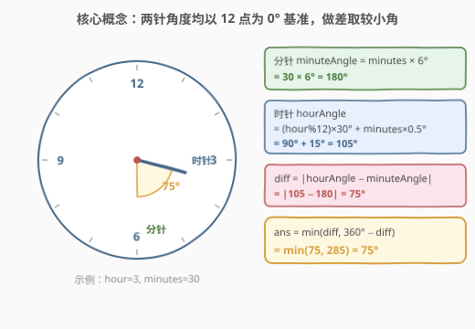
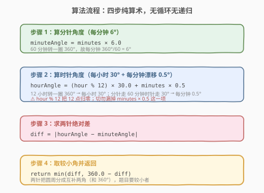
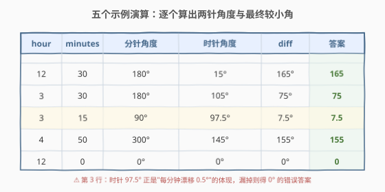

# LeetCode 时钟指针的夹角 题解

## 1. 题目概述

- **标题 / 题号**：时钟指针的夹角（#1344，medium）
- **链接**：https://leetcode.cn/problems/angle-between-hands-of-a-clock/
- **难度**：中等
- **标签**：数学、几何

**题意**：给你两个数 `hour` 和 `minutes`。请你返回在时钟上，由给定时间的时针和分针组成的**较小角**的角度（单位为度）。

**示例 1**：

```text
输入：hour = 12, minutes = 30
输出：165
```

**示例 2**：

```text
输入：hour = 3, minutes = 30
输出：75
```

**示例 3**：

```text
输入：hour = 3, minutes = 15
输出：7.5
```

**示例 4**：

```text
输入：hour = 4, minutes = 50
输出：155
```

**示例 5**：

```text
输入：hour = 12, minutes = 0
输出：0
```

**约束**：

- $1 \le \text{hour} \le 12$
- $0 \le \text{minutes} \le 59$
- 与标准答案误差在 $10^{-5}$ 以内的结果都被视为正确结果。

> 💡 本题是纯数学题：只要算出两根指针各自相对 12 点方向的角度，再做差取较小角即可。难点不在算法，而在**别漏掉时针随分钟数的漂移**。

## 2. 解题思路

### 2.1 常见错误：把时针当成"整点不动"

最直觉也最容易踩的坑是：把时针角度直接算成 $\text{hour} \times 30°$，完全忽略分钟数对时针位置的影响。

以 `hour = 3, minutes = 15` 为例：

- 错误算式：时针 = $3 \times 30° = 90°$，分针 = $15 \times 6° = 90°$，夹角 = $0°$ ❌
- 正确算式：时针 = $90° + 15 \times 0.5° = 97.5°$，分针 = $90°$，夹角 = $7.5°$ ✓

> ⚠️ 时针并非"到点才跳"——它在每一分钟都在缓慢移动。分针走一圈（60 分钟）时针才走一大格（30°），故**每分钟时针漂移 $30°/60 = 0.5°$**。漏掉这一项是本题唯一的高频错误。

### 2.2 核心观察：两针角度均以 12 点为基准 + 取较小角



把两根指针的位置都统一成"**从 12 点方向顺时针到该指针的角度**"，问题立刻简化为两个角度做差：

- **分针**：60 分钟转一整圈 $360°$，故每分钟 $360°/60 = 6°$。
  $$\text{minuteAngle} = \text{minutes} \times 6°$$
- **时针**：12 小时转一整圈 $360°$，故每小时 $360°/12 = 30°$；同时每分钟再漂移 $30°/60 = 0.5°$。`hour` 取值 $1\sim12$，其中 $12$ 点对应 $0°$，故用 $\text{hour} \bmod 12$ 归零。
  $$\text{hourAngle} = (\text{hour} \bmod 12) \times 30° + \text{minutes} \times 0.5°$$
- **做差**：两针夹角为
  $$\text{diff} = |\text{hourAngle} - \text{minuteAngle}|$$
- **取较小角**：两根针把圆周分成互补的两个角，和为 $360°$，题目要较小的那个：
  $$\text{ans} = \min(\text{diff},\; 360° - \text{diff})$$

> 💡 **为什么用 $\min(\text{diff}, 360-\text{diff})$ 而不分类讨论**：$\text{diff} \in [0°, 360°)$。当 $\text{diff} \le 180°$ 时它本身就是较小角；当 $\text{diff} > 180°$ 时 $360-\text{diff}$ 才是较小角。一句 $\min$ 兼顾两种情形，无需 if-else 分支。

### 2.3 算法流程图



四步纯算术，无循环无递归：

1. 算分针角度 $\text{minuteAngle} = \text{minutes} \times 6$；
2. 算时针角度 $\text{hourAngle} = (\text{hour} \bmod 12) \times 30 + \text{minutes} \times 0.5$；
3. 求绝对差 $\text{diff} = |\text{hourAngle} - \text{minuteAngle}|$；
4. 返回 $\min(\text{diff}, 360 - \text{diff})$。

### 2.4 示例演算



| hour | minutes | 分针角度 | 时针角度 | diff | min(diff, 360−diff) | 答案 |
|------|---------|----------|----------|------|----------------------|------|
| 12 | 30 | $30\times6=180°$ | $0+30\times0.5=15°$ | $165°$ | $\min(165,195)=165°$ | 165 |
| 3 | 30 | $180°$ | $90+15=105°$ | $75°$ | $\min(75,285)=75°$ | 75 |
| 3 | 15 | $90°$ | $90+7.5=97.5°$ | $7.5°$ | $\min(7.5,352.5)=7.5°$ | 7.5 |
| 4 | 50 | $300°$ | $120+25=145°$ | $155°$ | $\min(155,205)=155°$ | 155 |
| 12 | 0 | $0°$ | $0°$ | $0°$ | $\min(0,360)=0°$ | 0 |

以 `hour = 4, minutes = 50` 为例拆解：分针指向 $50 \times 6 = 300°$（约 10 点钟方向）；时针在 4 点（$120°$）基础上又被分针拉走 $50 \times 0.5 = 25°$，落在 $145°$；两针相距 $|300-145|=155°$，而 $155 < 205$，故答案 $155°$。

## 3. 参考代码

### C++

```cpp
class Solution {
public:
    double angleClock(int hour, int minutes) {
        double minuteAngle = minutes * 6.0;
        double hourAngle   = (hour % 12) * 30.0 + minutes * 0.5;
        double diff = abs(hourAngle - minuteAngle);
        return min(diff, 360.0 - diff);
    }
};
```

### Python

```python
class Solution:
    def angleClock(self, hour: int, minutes: int) -> float:
        minute_angle = minutes * 6.0
        hour_angle = (hour % 12) * 30.0 + minutes * 0.5
        diff = abs(hour_angle - minute_angle)
        return min(diff, 360.0 - diff)
```

> 💡 **实现细节**：① `hour % 12` 把 12 点归零为 $0°$，其余 $1\sim11$ 不变；② 用浮点运算以支持 $0.5°$ 的半度精度（如 `7.5`）；③ `min(diff, 360-diff)` 一行取代"是否大于 180°"的分支判断，最简洁。

## 4. 复杂度分析

| 维度 | 复杂度 | 说明 |
|------|--------|------|
| 时间复杂度 | $O(1)$ | 仅常数次算术运算，与输入规模无关 |
| 空间复杂度 | $O(1)$ | 只用几个浮点变量 |

> ⚠️ 本题是典型的"想清楚公式就赢"的题，没有数据规模带来的复杂度压力。

## 5. 扩展：24 小时制与"较大角"

**24 小时制时钟**：若 `hour` 范围改为 $0\sim23$，把 $\text{hour} \bmod 12$ 映射到 12 小时表盘位置即可，公式不变。若要严格区分上午/下午的 24 小时表盘（部分钟面把 1~24 全部标出），则每小时变为 $360°/24 = 15°$，每分钟时针漂移 $15°/60 = 0.25°$，相应调整两个常数即可。

**返回较大角**：若题面改为求"较大角"，只需把 `min` 换成 `max`：$\max(\text{diff}, 360-\text{diff})$。两者互补，和恒为 $360°$。

> 💡 **一句话总结**：核心公式就两句——$\text{minuteAngle} = \text{minutes}\times6$，$\text{hourAngle} = (\text{hour}\bmod12)\times30 + \text{minutes}\times0.5$；别忘了 $\min(\text{diff}, 360-\text{diff})$ 取较小角。

## 6. 面试要点

1. **时针为什么有 $0.5°/$ 分钟的漂移？**

   > 分针转一圈（60 分钟）= 时针走一大格（$30°$），所以每分钟时针移动 $30°/60 = 0.5°$。若只按整点算时针位置，`hour=3, minutes=15` 会得到 $0°$ 的错误答案。

2. **为什么用 $\text{hour} \bmod 12$？**

   > `hour` 取值 $1\sim12$，其中 12 点对应 $0°$（而非 $360°$）。$12 \bmod 12 = 0$ 恰好把 12 点归零，$1\sim11$ 取模后不变，无需特判。

3. **$\min(\text{diff}, 360-\text{diff})$ 的含义？**

   > 两针把圆周分成互补的两个角，和为 $360°$。题目要较小角，所以取两者最小值。当 $\text{diff} \le 180°$ 时 diff 本身即答案；否则取补角。一行 $\min$ 兼顾两种情况。

4. **为什么返回类型是浮点？**

   > 时针漂移 $0.5°/$ 分钟会产生半度（如 $7.5°$），整数运算会丢精度。用 `double`/`float` 即可，题目允许 $10^{-5}$ 误差。

5. **两针重合时答案是多少？**

   > $0°$。如 `hour=12, minutes=0`：两针都在 $0°$，diff 为 $0$，$\min(0,360)=0$。理论上 12 小时内两针重合 11 次（约每 $12/11$ 小时一次），任意一次代入公式都得 $0$。

## 同类练习题

| # | 题目 | 与本题的关联 |
|---|------|-------------|
| 883 | [三维形体投影面积](https://leetcode.cn/problems/projection-area-of-3d-shapes/) | 把立体图形转化为各方向投影面积公式，同为"几何量转数学公式"的入门题 |
| 892 | [三维形体的表面积](https://leetcode.cn/problems/surface-area-of-3d-shapes/) | 立方体堆叠的表面积计算，巩固"几何量拆解为公式"的思路 |
| 149 | [直线上最多的点数](https://leetcode.cn/problems/max-points-on-a-line/)（[题解](../0101-0200/149_直线上最多的点数.md)） | 几何 + 斜率化简，进阶的"几何量转数学表示"题 |
| 836 | [矩形重叠](https://leetcode.cn/problems/rectangle-overlap/) | 矩形位置关系判定，考察把"重叠"翻译成坐标不等式，同为几何数学题 |
