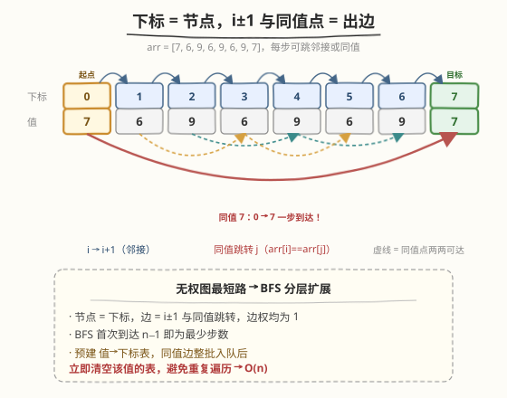
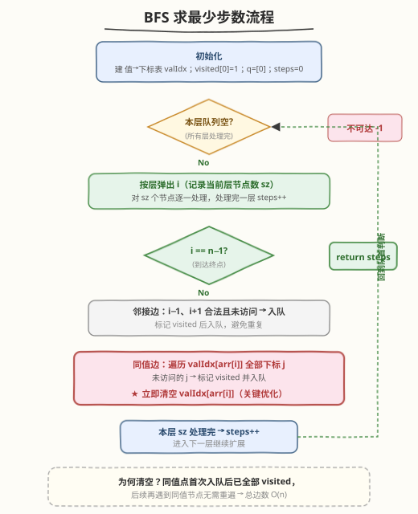
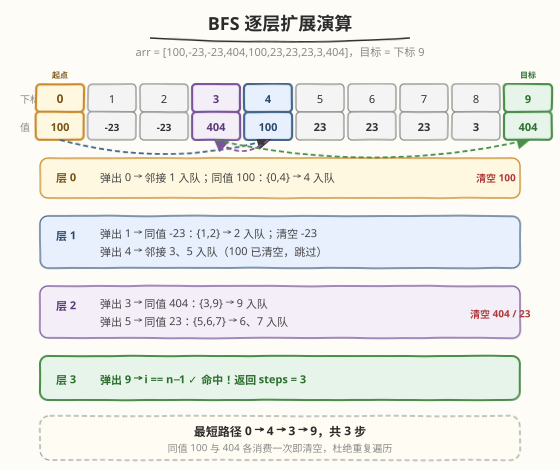

# 跳跃游戏 IV

- **题目名称**：跳跃游戏 IV
- **链接**：[1345. 跳跃游戏 IV](https://leetcode.cn/problems/jump-game-iv/)
- **难度**：困难
- **标签**：广度优先搜索、图、数组、哈希表

## 1. 题目概述

给定一个整数数组 `arr`，你一开始在数组的第一个元素处（下标 `0`）。每一步，你可以从下标 `i` 跳到：

- `i + 1`（需满足 `i + 1 < arr.length`）；
- `i - 1`（需满足 `i - 1 >= 0`）；
- `j`（需满足 `arr[i] == arr[j]` 且 `i != j`）。

请你返回到达数组**最后一个元素的下标**（即 `n - 1`）所需的**最少操作次数**。任何时候都不能跳到数组外面。

**示例 1**：

```text
输入：arr = [100,-23,-23,404,100,23,23,23,3,404]
输出：3
解释：跳跃 3 次，下标依次为 0 --> 4 --> 3 --> 9。下标 9 为最后一个元素。
```

**示例 2**：

```text
输入：arr = [7]
输出：0
解释：一开始就在最后一个元素处，不需要跳跃。
```

**示例 3**：

```text
输入：arr = [7,6,9,6,9,6,9,7]
输出：1
解释：直接从下标 0 跳到下标 7（两者值均为 7），即最后一个元素。
```

**约束条件**：

- `1 <= arr.length <= 5 * 10^4`
- `-10^8 <= arr[i] <= 10^8`

> 💡 本题是 [1306. 跳跃游戏 III](../1301-1400/1306_跳跃游戏%20III.md) 的「最短路升级版」：1306 从 `i` 只能跳到 `i ± arr[i]` 两个确定位置、问**能否**到达值为 0 的下标（可达性）；本题从 `i` 能跳到 `i ± 1` 以及**任意同值下标** `j`、问到达末尾的**最少步数**（最短路）。后继从一个值衍生出一**批**同值位置，使得朴素 BFS 的边数可能退化到 $O(n^2)$——这正是本题升为困难的关键，需要「值索引表一次性消费」的优化。

---

## 2. 解题思路

### 2.1 暴力思路：朴素 BFS 不去重边

最直观的做法：把每个下标看作节点，对每个 `i` 显式连出 `i + 1`、`i - 1` 以及所有同值 `j` 的边，然后从 `0` 出发 BFS，首次到达 `n - 1` 的层数即为答案。

问题在于**同值边可能极多**——若整个数组为同一个值（如 `arr = [7,7,7,...,7]`），则每个节点与其它所有 $n-1$ 个节点都相连，总边数 $O(n^2)$。BFS 在扩展某个节点时要遍历它的全部同值邻居，累计访问次数会退化到 $O(n^2)$，$n = 5 \times 10^4$ 时约 $2.5 \times 10^9$ 次操作，明显超时。

> ⚠️ 关键误区：`visited` 标记只能保证「每个节点至多入队一次」，但**不能**减少「遍历同值邻居列表」的次数——同一个值列表会被多个同值节点反复扫描。例如全 7 数组中，弹出下标 `0` 时遍历 $n-1$ 个邻居（全部入队并标记 visited），之后弹出下标 `1` 时仍会遍历同一个 $n-1$ 长度的列表，发现全都已访问才跳过——这一遍扫描本身已是 $O(n)$，累计 $O(n^2)$。

### 2.2 核心观察：隐式图最短路 + 值索引表一次性消费



把每个下标 `i` 看作图的一个**节点**，从 `i` 引出三类**边权均为 1**的有向边：`i → i+1`、`i → i-1`、`i → j`（所有 `arr[j] == arr[i]` 且 `j != i`）。于是问题归结为**无权图单源最短路**——从节点 `0` 到节点 `n-1` 的最少边数，BFS 分层扩展首次命中即答案。

- **为什么是 BFS 而非 DFS？** 无权图最短路必须用 BFS（按层扩展天然得到最短层数）；DFS 不维护层数、需枚举所有路径取最小，指数级。
- **优化的核心——值索引表一次性消费**：预处理一个哈希表 `valIdx`，把「值 → 该值所有下标列表」存好。当 BFS 弹出某个下标 `i`（值 `v = arr[i]`）时，**一次性**把 `valIdx[v]` 中所有未访问下标入队，然后**立即清空** `valIdx[v]`（或删除该键）。

> 💡 **为什么清空是正确的？** 当某个值 `v` 的下标列表首次被消费时，列表中的**所有**下标都被标记 visited 并入队（包括当前 `i` 自身，它弹出时已是 visited）。此后任何其它值为 `v` 的节点被弹出时，它的同值邻居**全部已访问**——再遍历 `valIdx[v]` 只会逐个判 visited 后跳过，纯属浪费。清空该键后，后续同值节点直接 `find` 不到、跳过，相当于声明「这批同值边已经整体处理完毕」。于是每个值列表至多被完整遍历一次，所有同值边的总处理量为 $\sum_v |valIdx[v]| = n$，加上 `i ± 1` 的 $O(n)$ 邻接边，总计 $O(n)$。

> ⚠️ **对照 1306 跳跃游戏 III**：1306 每个节点只有 `i ± arr[i]` 两条出边，图的总边数本身就是 $O(n)$，朴素 BFS + `visited` 即可。本题每个节点还连向**一批**同值节点，边数可能 $O(n^2)$，必须靠「值表一次性消费」把均摊代价压回 $O(n)$。这是两题难度差距的根源。

### 2.3 算法流程图



**完整步骤**：

1. **预处理**：遍历 `arr` 建立 `valIdx`（`值 → 下标列表`）。
2. **初始化**：`visited[0] = true`，队列 `q = [0]`，`steps = 0`。
3. **分层 BFS**（外层每轮对应一层）：
   - 记录当前层节点数 `sz = q.size()`；`sz == 0` 则说明不连通（本题保证可达，不会触发），返回 `-1`。
   - 对 `sz` 个节点逐一弹出 `i`：
     - **命中判断**：`i == n - 1` → 返回 `steps`。
     - **邻接边**：`i - 1`、`i + 1` 合法且未访问 → 标记 visited 并入队。
     - **同值边**：若 `valIdx` 中仍有键 `arr[i]`，遍历其下标列表，未访问的全部入队；**遍历完立即删除该键**。
   - 本层处理完 → `steps++`，进入下一层。
4. 循环正常结束返回 `-1`（理论上不会到达）。

> 💡 **命中判断的时机**：在「弹出 `i` 时」检查 `i == n - 1` 最简洁——起点 `0` 本身可能是终点（`n == 1`，示例 2），此时 `steps = 0` 直接返回。由于 BFS 按层扩展，首次弹出 `n - 1` 时的 `steps` 即为最短步数，无需额外比较。

### 2.4 示例演算

以示例 1 `arr = [100,-23,-23,404,100,23,23,23,3,404]` 为例（`n = 10`，目标 = 下标 `9`）：



预处理 `valIdx`：

| 值 | 下标列表 |
|----|----------|
| 100 | [0, 4] |
| -23 | [1, 2] |
| 404 | [3, 9] |
| 23 | [5, 6, 7] |
| 3 | [8] |

BFS 逐层扩展：

| 层 | 弹出 `i` | 邻接入队 | 同值入队 | 值表操作 | 命中 9？ |
|----|----------|----------|----------|----------|----------|
| 0 | 0 | 1 | 4（值 100） | **清空 100** | 否 |
| 1 | 1 | 2 | —（值 -23 含 1,2）→ 2 已入队 | **清空 -23** | 否 |
| 1 | 4 | 3, 5 | —（100 已清空，跳过） | — | 否 |
| 2 | 2 | —（1,3 均已访问） | —（-23 已清空） | — | 否 |
| 2 | 3 | —（2,4 已访问） | **9**（值 404 含 3,9） | **清空 404** | 否 |
| 2 | 5 | 6 | 7（值 23 含 5,6,7） | **清空 23** | 否 |
| 3 | 9 | — | — | — | **是** ✓ 返回 3 |

第 3 层弹出下标 `9`，`i == n - 1`，返回 `steps = 3`。对应最短路径 `0 → 4 → 3 → 9`：`0` 同值跳到 `4`（值 100）、`4` 退到 `3`（`i - 1`）、`3` 同值跳到 `9`（值 404）。

> 💡 **示例 3 为什么是 1？** `arr = [7,6,9,6,9,6,9,7]`，`valIdx[7] = [0, 7]`。第 0 层弹出 `0`，同值 7 的下标 `7` 直接入队；第 1 层弹出 `7`，`i == n - 1`，返回 `1`。同值跳转一步直达，这正是同值边「跨越任意距离」的威力——边权仍为 1。

> ⚠️ **若不做清空优化会怎样？** 示例 1 数据小看不出问题。但考虑 `arr = [7,7,...,7]`（$n$ 个 7）：第 0 层弹出 `0` 时把剩下 $n-1$ 个全入队；之后每弹出一个都要重新扫描这 $n-1$ 长度的列表，共 $n$ 次扫描 → $O(n^2)$。清空后，`valIdx[7]` 在第 0 层就被删除，后续弹出直接跳过，总扫描量 $O(n)$。

---

## 3. 参考代码

### C++

```cpp
// 跳跃游戏 IV.cpp —— 隐式图 BFS 求最短路 + 值表一次性消费
// 编译: g++ -O2 -std=c++17 跳跃游戏\ IV.cpp -o jg4
class Solution {
public:
    int minJumps(vector<int>& arr) {
        int n = arr.size();
        unordered_map<int, vector<int>> valIdx;
        for (int i = 0; i < n; ++i) valIdx[arr[i]].push_back(i);

        vector<char> visited(n, 0);
        queue<int> q;
        q.push(0);
        visited[0] = 1;
        int steps = 0;

        while (!q.empty()) {
            int sz = q.size();
            while (sz--) {
                int i = q.front(); q.pop();
                if (i == n - 1) return steps;          // 命中终点

                if (i - 1 >= 0 && !visited[i - 1]) {   // 邻接 i-1
                    visited[i - 1] = 1;
                    q.push(i - 1);
                }
                if (i + 1 < n && !visited[i + 1]) {    // 邻接 i+1
                    visited[i + 1] = 1;
                    q.push(i + 1);
                }
                auto it = valIdx.find(arr[i]);          // 同值边
                if (it != valIdx.end()) {
                    for (int j : it->second) {
                        if (!visited[j]) {
                            visited[j] = 1;
                            q.push(j);
                        }
                    }
                    it->second.clear();                 // ★ 关键：一次性消费后清空
                }
            }
            ++steps;
        }
        return -1;                                      // 不可达（题目保证可达）
    }
};
```

### Python

```python
class Solution:
    def minJumps(self, arr: List[int]) -> int:
        n = len(arr)
        from collections import defaultdict, deque
        val_idx = defaultdict(list)
        for i, v in enumerate(arr):
            val_idx[v].append(i)

        visited = [False] * n
        q = deque([0])
        visited[0] = True
        steps = 0

        while q:
            for _ in range(len(q)):             # 按层处理
                i = q.popleft()
                if i == n - 1:                  # 命中终点
                    return steps
                if i - 1 >= 0 and not visited[i - 1]:   # 邻接 i-1
                    visited[i - 1] = True
                    q.append(i - 1)
                if i + 1 < n and not visited[i + 1]:    # 邻接 i+1
                    visited[i + 1] = True
                    q.append(i + 1)
                if arr[i] in val_idx:            # 同值边
                    for j in val_idx[arr[i]]:
                        if not visited[j]:
                            visited[j] = True
                            q.append(j)
                    del val_idx[arr[i]]          # ★ 关键：一次性消费后删除
            steps += 1
        return -1
```

> 💡 **实现细节**：① 用 `vector<char>` / `list[bool]` 做 `visited`，避免 `vector<bool>` 位压缩的代理引用问题。② **分层**用 `sz = q.size()` 内层循环 + 外层 `++steps`，保证 `steps` 严格等于当前弹出节点到起点的边数。③ 清空操作：C++ 用 `it->second.clear()`（保留空容器，`find` 仍命中但循环体不执行），Python 用 `del val_idx[arr[i]]`（彻底删除键，`in` 判断更快）——两者等价，都使后续同值节点跳过整批遍历。④ 命中判断放弹出时，自然覆盖 `n == 1` 的边界。

---

## 4. 复杂度分析

| 维度 | 优化 BFS（推荐） | 朴素 BFS（不清空值表） |
|------|------------------|------------------------|
| **时间** | $O(n)$ | $O(n^2)$（最坏，全同值数组） |
| **空间** | $O(n)$ | $O(n)$ |
| **说明** | 每个节点入队一次 $O(n)$；同值列表每个值至多完整遍历一次，总量 $\sum_v |valIdx[v]| = n$；邻接边 $O(n)$ | `visited` 防重复入队，但同值列表被反复扫描 |

> ⚠️ **时间复杂度 $O(n)$ 的严格论证**：将 BFS 处理一条边的代价归到「遍历值列表」与「邻接判断」两类。邻接边每个节点产生 2 次判断共 $O(n)$。同值边方面，`valIdx[v]` 一旦被某个值为 `v` 的节点消费就立即清空，故每个值列表**至多被完整扫描一次**，所有列表长度之和恰为 $n$，故同值边总处理量 $O(n)$。两者相加 $O(n)$。$n = 5 \times 10^4$ 时约 $10^5$ 次操作，毫秒级。

---

## 5. 扩展：双向 BFS

由于起点 `0` 与终点 `n - 1` 都已知，可用**双向 BFS**（从两端同时扩展，取交集）进一步常数优化。每次选择当前队列较小的一端扩展，使扩展节点数更均衡。但本题已有 $O(n)$ 单向 BFS，且同值清空优化在双向版本中需谨慎处理（两端共享 `visited` 与 `valIdx`，一端消费某值列表后另一端不能再依赖它），实现复杂度上升、收益有限。面试中**单向 BFS + 清空值表**已是标准解，双向 BFS 可作为加分提及。

> 💡 **何时值得双向 BFS？** 当图规模极大、分支因子高、且单源 BFS 扩展层数深时（如 [127. 单词接龙](https://leetcode.cn/problems/word-ladder/)），双向能把搜索空间从 $O(b^d)$ 降到 $O(b^{d/2})$，收益显著。1345 的图虽边多但「清空值表」已把有效边压到 $O(n)$，单向已线性，双向主要是常数缩减。

---

## 6. 面试要点

1. **为什么是图的最短路问题？怎么想到 BFS？**

   > 每步从 `i` 跳到 `i ± 1` 或任意同值 `j`，所有跳跃代价相同（一步），求最少步数——即无权图单源最短路。无权图最短路的标准解法是 BFS 分层扩展：首次到达终点的层数即为最短边数。DFS 不维护层数、需枚举所有路径，不适合求最少步数。

2. **为什么需要「清空值表」优化？不清空会怎样？**

   > `visited` 只能保证每点至多入队一次，但「遍历同值邻居列表」的次数不受控。全同值数组中，每个节点弹出时都会扫描长度 $n-1$ 的同值列表，累计 $O(n^2)$。清空值表利用一个不变式：某值 `v` 的列表首次被消费时，其中所有下标都已 visited；后续同值节点再扫描该列表只会逐个跳过，纯浪费。清空后这些节点直接跳过，每个值列表至多扫描一次，总 $O(n)$。

3. **清空值表的正确性如何保证？会不会漏掉某些路径？**

   > 不会。当值为 `v` 的节点 `i` 首次被弹出时，`valIdx[v]` 中**所有**下标都被入队并标记 visited——这意味着全部 `v` 值节点此刻都已在队列或已访问。此后任何值为 `v` 的节点被弹出时，它的同值邻居必然已访问，清空列表只是省去「逐个判 visited 后跳过」的冗余扫描，不改变可达性与最短路。BFS 的最短路性质由「首次到达即最短」保证，与是否清空无关。

4. **分层计数 `steps` 为什么要用 `sz = q.size()` 内层循环？**

   > BFS 求最短路必须按层计数：同一层的节点到起点距离相同。`sz` 快照当前层节点数，内层 `while (sz--)` 把这一层全部弹出后才 `++steps`。若每弹出一个就 `++steps`，会把「同层兄弟」误算成不同距离，答案错误。这是所有「BFS 求最少步数」题的通用骨架（如 [994. 腐烂的橘子](../0901-1000/994_腐烂的橘子.md)）。

5. **与 1306 跳跃游戏 III 的区别？**

   > ① 后继不同：1306 是 `i ± arr[i]` 两个确定点，1345 是 `i ± 1` 加**一批**同值点。② 目标不同：1306 问能否到达值为 0 的点（可达性，DFS 也可），1345 问最少步数（最短路，必须 BFS）。③ 复杂度陷阱不同：1306 总边数 $O(n)$ 朴素 BFS 即可；1345 同值边可能 $O(n^2)$，必须清空值表优化。两者同属「跳跃游戏」家族但模型与难度递进。

> 💡 **一句话总结**：1345 的灵魂是「**隐式图最短路 + 值索引表一次性消费**」——BFS 分层扩展求最少步数，同值边整批入队后立即清空值表，把可能 $O(n^2)$ 的边处理压回 $O(n)$。这个「批量后继 + 一次性消费」的优化思想，是所有「同值/同组跳转」类最短路题的通用范式。

---

## 7. 同类练习题

- [1306. 跳跃游戏 III](https://leetcode.cn/problems/jump-game-iii/)（[题解](../1301-1400/1306_跳跃游戏%20III.md)）：隐式图可达性招牌题，后继为 `i ± arr[i]` 两点、总边 $O(n)$ 朴素 BFS 即可，对照 1345 的「一批同值后继 + 清空值表」降复杂度
- [55. 跳跃游戏](https://leetcode.cn/problems/jump-game/)（[题解](../0001-0100/55_跳跃游戏.md)）：区间型跳跃判可达，贪心维护最远右边界，与 1345 的「确定后继建图 + BFS」形成「区间后继→贪心 / 点对后继→图搜索」的分野
- [45. 跳跃游戏 II](https://leetcode.cn/problems/jump-game-ii/)（[题解](../0001-0100/45_跳跃游戏%20II.md)）：区间型跳跃求最少步数，贪心维护层边界，与 1345 BFS 分层求最少步数思想呼应但后继模型不同
- [994. 腐烂的橘子](https://leetcode.cn/problems/rotting-oranges/)（[题解](../0901-1000/994_腐烂的橘子.md)）：多源 BFS 求最短时间，同「分层 + sz 内层计数」骨架，对照 1345 单源最短路版
- [200. 岛屿数量](https://leetcode.cn/problems/number-of-islands/)（[题解](../0101-0200/200_岛屿数量.md)）：网格 BFS/DFS 母题，巩固 `visited` 一次性访问思想，对照 1345 在「同组后继」场景下为何还需额外的值表清空
