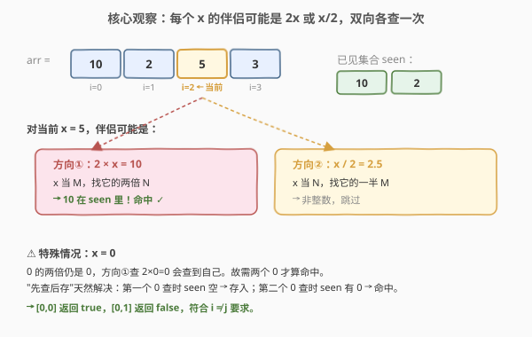
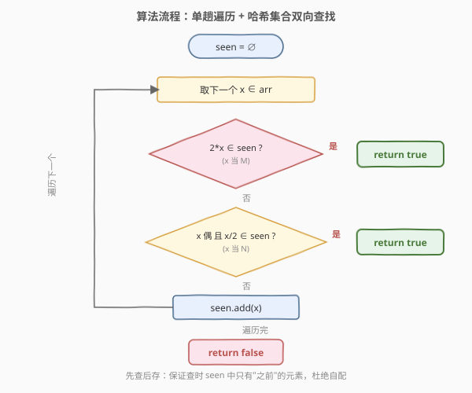

# 检查整数及其两倍数是否存在

- **题目名称**：检查整数及其两倍数是否存在
- **链接**：[1346. 检查整数及其两倍数是否存在](https://leetcode.cn/problems/check-if-n-and-its-double-exist/)
- **难度**：简单
- **标签**：数组、哈希表

## 1. 题目概述

给你一个整数数组 `arr`，请你检查是否存在两个整数 `N` 和 `M`，满足 `N` 是 `M` 的两倍（即 $N = 2 \times M$）。

更正式地，检查是否存在两个下标 `i` 和 `j` 满足：

- `i != j`
- `0 <= i, j < arr.length`
- `arr[i] == 2 * arr[j]`

**示例 1**：

```text
输入：arr = [10,2,5,3]
输出：true
解释：N = 10 是 M = 5 的两倍，即 10 = 2 * 5 。
```

**示例 2**：

```text
输入：arr = [7,1,14,11]
输出：true
解释：N = 14 是 M = 7 的两倍，即 14 = 2 * 7 。
```

**示例 3**：

```text
输入：arr = [3,1,7,11]
输出：false
解释：在该情况下不存在 N 和 M 满足 N = 2 * M 。
```

**约束条件**：

- $2 \le arr.length \le 500$
- $-10^3 \le arr[i] \le 10^3$

> 💡 本题是「两数之和」家族的变体：不再问 `a + b = target`，而是问是否存在 `a = 2b`。关系从「加法互补」变成「倍数配对」，但哈希表「边查边存」的骨架完全通用——只是「补数」从 `target - a` 换成了 `2a` 与 `a/2` 两个方向。

---

## 2. 解题思路

### 2.1 暴力思路：两层循环枚举所有数对

最直白的做法：用两层循环枚举所有 `(i, j)`（`i != j`），判断 `arr[i] == 2 * arr[j]`。

```text
for i in 0..n-1:
    for j in 0..n-1:
        if i != j and arr[i] == 2 * arr[j]: return true
return false
```

时间复杂度 $O(n^2)$。本题 $n \le 500$，约 $2.5 \times 10^5$ 次操作，能过但浪费——对每个 `arr[j]`，找 `2 * arr[j]` 是否存在用了 $O(n)$ 线性扫描，这正是哈希表能优化到 $O(1)$ 的地方。

### 2.2 核心观察：哈希集合 + 双向查找



关键直觉：对于当前遍历到的元素 `x`，能与它配对成「两倍关系」的伴侣只有**两种可能**——

- **方向①**：`x` 当较小的 `M`，伴侣是 $2x$（`x` 的两倍）；
- **方向②**：`x` 当较大的 `N`，伴侣是 $x/2$（`x` 的一半，仅当 `x` 为偶数才整数存在）。

所以只需维护一个「已经遍历过的元素」集合 `seen`，对每个 `x` **双向各查一次**：$2x \in seen$？或（`x` 为偶且 $x/2 \in seen$）？任一命中即返回 `true`，否则把 `x` 存入 `seen` 继续遍历。

> 💡 **为什么必须双向查，单向不够？** 因为配对的两数大小关系未知。设合法配对为 $(a, b)$ 且 $a = 2b$：
> - 若 `b` 先出现、`a` 后出现：到 `a` 时，`a / 2 = b` 已在 `seen` 中，靠**方向②**命中。
> - 若 `a` 先出现、`b` 后出现：到 `b` 时，`2b = a` 已在 `seen` 中，靠**方向①**命中。
>
> 无论谁先出现，**后出现的那一个**恰好通过某一个方向找到前一个。因此双向查是**必要且充分**的——单查 $2x$ 会漏掉「大数先、小数后」的情形，单查 $x/2$ 会漏掉「小数先、大数后」的情形。

> ⚠️ **零的特殊处理**：$x = 0$ 时 $2x = 0$、$x/2 = 0$，伴侣就是 0 自己。题目要求 `i != j`，故必须**数组中有两个 0** 才算命中。「先查后存」天然解决：第一个 0 查时 `seen` 为空 → 存入；第二个 0 查时 $2 \times 0 = 0 \in seen$ → 命中返回 `true`。单 0（如 `[0, 1]`）查时无伴 → 最终 `false`，正确。

### 2.3 算法流程图



整个流程是单层循环：取 `x` → 查 $2x$ → 查 $x/2$ → 命中即返回、未命中则存入。每个元素只被查两次、存一次，总时间 $O(n)$。**先查后存**保证查的时候 `seen` 里只有当前元素**之前**的元素，杜绝自配（与 [1. 两数之和](../0001-0100/1_两数之和.md) 同一技巧）。

### 2.4 示例演算

以 `arr = [10, 2, 5, 3]` 为例逐步模拟：

![示例演算：arr=[10,2,5,3] 与反例 [3,1,7,11]](../images/1346_example_walkthrough.svg)

| 步 | x | 查 $2x \in seen$？ | 查 $x/2 \in seen$？ | seen 更新 | 结果 |
|----|---|--------------------|---------------------|-----------|------|
| 1 | 10 | 20 ? 否 | 5 ? 否 | {10} | 继续 |
| 2 | 2 | 4 ? 否 | 1 ? 否 | {10, 2} | 继续 |
| 3 | 5 | **10 ? 是 ⭐** | 2.5 跳过 | — | return true |

第 3 步：`x = 5`，查 $2 \times 5 = 10$，已在 `seen` 中（第 1 步存入），即 $10 = 2 \times 5$，命中返回 `true`。

反例 `arr = [3, 1, 7, 11]`：所有元素为奇数，方向②全跳过；方向①查 $6, 2, 14, 22$ 均不在 `seen` 中，遍历结束返回 `false`。

---

## 3. 参考代码

### C++（哈希集合单趟遍历）

```cpp
class Solution {
public:
    bool checkIfExist(vector<int>& arr) {
        unordered_set<int> seen;
        for (int x : arr) {
            // 方向①：x 当 M，找 2x
            if (seen.count(2 * x)) return true;
            // 方向②：x 当 N，找 x/2（仅偶数）
            if (x % 2 == 0 && seen.count(x / 2)) return true;
            seen.insert(x); // 先查后存
        }
        return false;
    }
};
```

### Python

```python
class Solution:
    def checkIfExist(self, arr: List[int]) -> bool:
        seen = set()
        for x in arr:
            if 2 * x in seen:                      # 方向①
                return True
            if x % 2 == 0 and x // 2 in seen:      # 方向②
                return True
            seen.add(x)                            # 先查后存
        return False
```

> ⚠️ **顺序不能反**：必须**先查后存**。若先 `seen.insert(x)` 再查，当 `x = 0` 时 $2x = 0$ 会查到自己刚插入的 0，单 0 也误判 `true`。先查后存保证查时 `seen` 中只有之前的元素。Python 中 `x // 2` 对负偶数也正确（如 $-4 // 2 = -2$），与 C++ 整除语义一致。

---

## 4. 复杂度分析

| 维度 | 复杂度 | 说明 |
|------|--------|------|
| 时间复杂度 | $O(n)$ | 遍历一次数组，每次哈希集合查找/插入均摊 $O(1)$ |
| 空间复杂度 | $O(n)$ | 最坏存入 $n-1$ 个元素（答案在最后一对或无解） |

> 💡 本题值域极小（$-10^3 \le arr[i] \le 10^3$），也可用值域数组/位图把空间压到 $O(2001)$ 即常数空间，但哈希集合写法更通用、对任意值域都成立，是首选。

---

## 5. 扩展：频率表两遍扫描 与 排序 + 双指针

### 写法二：频率表两遍扫描（正确性更直观）

先统计每个值的出现次数，再遍历查 $2x$ 是否存在，单独处理 $x = 0$。逻辑直白，适合面试时作为「先说清楚再优化」的版本。

```cpp
class Solution {
public:
    bool checkIfExist(vector<int>& arr) {
        unordered_map<int, int> cnt;
        for (int x : arr) cnt[x]++;
        for (int x : arr) {
            int t = 2 * x;
            auto it = cnt.find(t);
            if (it == cnt.end()) continue;
            if (t != x || it->second > 1) return true; // t==x 即 x==0，需出现至少两次
        }
        return false;
    }
};
```

> 💡 关键在 `t != x || cnt[t] > 1`：当 $2x = x$（即 $x = 0$）时，必须 0 出现至少两次才算两个不同下标；其余情况 $2x \neq x$，存在即命中。

### 写法三：排序 + 双指针 / 二分

若要求 $O(1)$ 额外空间，可先排序再对每个 `x` 二分查找 `2x`（注意跳过自身下标）。时间 $O(n \log n)$、空间 $O(1)$（或 $O(n)$ 取决于排序是否原地）。

```cpp
class Solution {
public:
    bool checkIfExist(vector<int>& arr) {
        sort(arr.begin(), arr.end());
        for (int i = 0; i < (int)arr.size(); ++i) {
            int t = 2 * arr[i];
            // 在 [i+1, n) 与 [0, i) 两段各二分一次，避免用到自身
            auto L = lower_bound(arr.begin(), arr.begin() + i, t);
            if (L != arr.begin() + i && *L == t) return true;
            auto R = lower_bound(arr.begin() + i + 1, arr.end(), t);
            if (R != arr.end() && *R == t) return true;
        }
        return false;
    }
};
```

**三种解法对比**：

| 解法 | 时间 | 空间 | 适用场景 |
|------|------|------|----------|
| 哈希集合（双向） | $O(n)$ | $O(n)$ | 通用首选，单趟简洁 |
| 频率表两遍扫描 | $O(n)$ | $O(n)$ | 正确性直观，便于讲清零特判 |
| 排序 + 二分 | $O(n \log n)$ | $O(1)$ | 空间受限、值域大时 |

> 💡 **如何选择？** 不限空间选哈希集合；面试先讲频率表版说清思路再优化到单趟；要求 $O(1)$ 空间用排序二分。这与「两数之和」家族的选型决策完全一致——哈希换时间、排序换空间。

---

## 6. 面试要点

1. **为什么单向查 $2x$ 不够，必须双向查 $2x$ 与 $x/2$？**

   > 配对两数 $(a, b)$（$a = 2b$）谁先出现未知。「大数先、小数后」时，到小数 `b` 查 $2b = a$ 命中（方向①）；「小数先、大数后」时，到大数 `a` 查 $a/2 = b$ 命中（方向②）。单向只能覆盖一种先后顺序，故必须双向。

2. **`x = 0` 时算法为什么不会误判？**

   > 「先查后存」保证查时 `seen` 中只有当前元素之前的元素。第一个 0 查时 `seen` 空 → 存入；第二个 0 查 $2 \times 0 = 0$ 命中已存的第一个 0 → 返回 `true`。单 0 时查无伴 → `false`。天然满足 `i != j`。

3. **如果改成「三倍关系」$N = 3M$，算法如何调整？**

   > 同样双向查：方向①查 $3x \in seen$，方向②查 $x$ 能被 3 整除且 $x/3 \in seen$。倍数关系类问题的通式：对每个 `x` 查 $kx$ 与（$x \bmod k = 0$ 时的 $x/k$）。零仍需特判「至少出现两次」。

4. **哈希集合解法和排序+二分解法各自的优劣？**

   > 哈希集合：$O(n)$ 时间、$O(n)$ 空间，单趟、不破坏原数组，通用首选。排序+二分：$O(n \log n)$ 时间、$O(1)$ 额外空间，但排序破坏原序、常数更大。本题 $n \le 500$ 三者皆可过，选型看是否要求 $O(1)$ 空间。

5. **本题与 [1. 两数之和] 的异同？**

   > 同：都用「哈希表 + 先查后存」骨架，把「找伴侣」从 $O(n)$ 降到 $O(1)$。异：两数之和的伴侣是确定的 `target - a`（单方向、一个值）；本题的伴侣是 `2x` 或 `x/2`（双方向、两个值），且需处理零的自指特例。两者都是「配对查找」家族的基础模板。

---

## 7. 同类练习题

- [1. 两数之和](https://leetcode.cn/problems/two-sum/)（[题解](../0001-0100/1_两数之和.md)）：哈希表「先查后存」查补数的母题，本题的直接前置
- [219. 存在重复元素 II](https://leetcode.cn/problems/contains-duplicate-ii/)：哈希表判存在 + 下标差约束，同为「哈希查重」家族
- [217. 存在重复元素](https://leetcode.cn/problems/contains-duplicate/)：哈希集合判存在的基础题，本题查 $2x$ 是否存在的最小原型
- [724. 寻找数组的中心下标](https://leetcode.cn/problems/find-pivot-index/)：前缀和 + 哈希判定，数组内「配对/平衡」查找的另一变体
