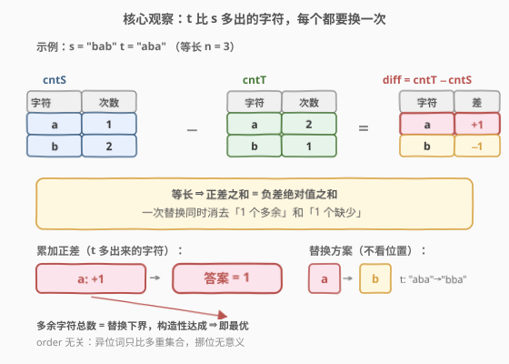
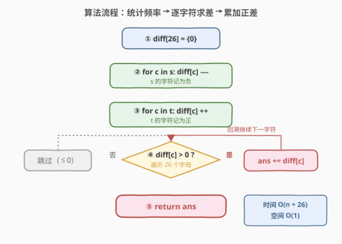
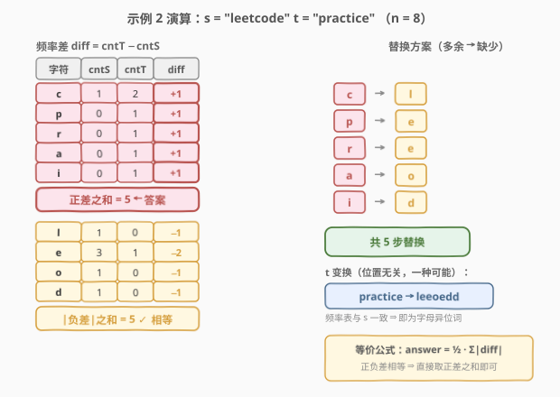

# 制造字母异位词的最小步骤数

- **题目名称**：制造字母异位词的最小步骤数
- **链接**：[1347. 制造字母异位词的最小步骤数](https://leetcode.cn/problems/minimum-number-of-steps-to-make-two-strings-anagram/)
- **难度**：中等
- **标签**：哈希表、字符串、计数

## 1. 题目概述

给你两个**长度相等**的字符串 `s` 和 `t`。每一步可以选择将 `t` 中的**任一字符**替换为**另一个字符**。返回使 `t` 成为 `s` 的**字母异位词**的最小步骤数。

> **字母异位词**指字母相同、但排列不同（也可能相同）的字符串。换言之，`t` 是 `s` 的字母异位词，当且仅当两者**每种字符的出现次数完全相同**——只看多重集合（multiset），不看顺序。

**示例 1**：

```text
输入：s = "bab", t = "aba"
输出：1
解释：用 'b' 替换 t 中的第一个 'a'，t = "bba" 是 s 的一个字母异位词。
```

**示例 2**：

```text
输入：s = "leetcode", t = "practice"
输出：5
解释：用合适的字符替换 t 中的 'p', 'r', 'a', 'i', 'c'，使 t 变成 s 的字母异位词。
```

**示例 3**：

```text
输入：s = "anagram", t = "mangaar"
输出：0
解释："anagram" 和 "mangaar" 本身就是一组字母异位词。
```

**示例 4**：

```text
输入：s = "xxyyzz", t = "xxyyzz"
输出：0
```

**示例 5**：

```text
输入：s = "friend", t = "family"
输出：4
```

**约束条件**：

- $1 \leq \text{s.length} \leq 50000$
- `s.length == t.length`
- `s` 和 `t` 只包含小写英文字母

> 💡 本题的灵魂是「**只看多重集合，不看顺序**」——既然 `t` 只要凑成 `s` 的字母异位词（每种字符个数对齐即可），位置的对应关系就完全不重要。于是问题从「字符串匹配」退化为「**两个频率表的差异**」：`t` 里比 `s` 多出来的那些字符，每一个都必须被换掉一次，换掉的总数即为答案。

---

## 2. 解题思路

### 2.1 暴力思路：逐位模拟替换

最直观的做法是**模拟**：扫描 `t` 的每一位，若该位字符「不该出现」就尝试替换成某个「还缺」的字符，并计数。但这里立刻遇到一个障碍——

- **「该不该出现」无法逐位判定**：字母异位词只要求**整体多重集合**相同，不要求某一位必须是某个字符。`t = "aba"` 要变成 `s = "bab"` 的异位词，既可以换第 1 位的 `a`，也可以换第 3 位的 `a`，甚至可以换掉那个 `b` 再补一个 `a`……逐位判定时，某一位字符是否「多余」取决于**全局频率**而非该位本身。
- **替换目标不定**：换掉一个多余字符后，该换成谁？又取决于当前 `s` 还缺哪种字符。一旦顺序不同，中间状态不同，容易重复计数或漏算。

> ⚠️ 这种「逐位 + 在线判定」的写法会退化成在状态空间里搜索：每个位置可选 26 种替换，最坏 $26^n$ 种组合，且容易把「同一个多余字符」重复计入。问题的根源在于**没有把「顺序无关」这一性质提炼出来**——既然只看多重集合，就该直接在频率层面做差，而不是在字符串层面逐位纠结。

### 2.2 核心观察：频率差 → 多余字符数 = 替换次数



**关键洞察**：因为字母异位词**只比字符频次、不比顺序**，所以 `t` 能否变成 `s` 的异位词，完全取决于两张频率表 `cntS` 与 `cntT` 是否相同。而一次替换操作的效果是：把 `t` 中某个字符 `x` 减一、另一个字符 `y` 加一。我们要用最少的替换让 `cntT` 等于 `cntS`。

逐字符看差异 $\text{diff}[c] = \text{cntT}[c] - \text{cntS}[c]$：

- $\text{diff}[c] > 0$：`t` 里 `c` **多了** $\text{diff}[c]$ 个，这些多出来的 `c` 必须被换掉（换成 `s` 里缺的字符）；
- $\text{diff}[c] < 0$：`t` 里 `c` **少了** $|\text{diff}[c]|$ 个，需要靠别处换来的 `c` 补齐；
- $\text{diff}[c] = 0$：刚好对齐，不动。

由于 `s` 与 `t` **等长**，所有「多出来的」总数必然等于所有「缺少的」总数（正负相抵，和为 0）。因此**每换掉一个多余字符，就同时补上了一个缺少的字符**——一次替换同时消去正差 1 和负差 1。于是最小替换次数即：

$$
\text{answer} = \sum_{c:\,\text{diff}[c] > 0} \text{diff}[c] = \sum_{c:\,\text{diff}[c] < 0} |\text{diff}[c]|
$$

> 以示例 1 为例：`s="bab"`（`cntS: a=1, b=2`），`t="aba"`（`cntT: a=2, b=1`）。`diff = a:+1, b:-1`。正差之和 $= 1$，即只需把 `t` 里多出的那一个 `a` 换成 `b`，`t` 变成 `"bba"`，与 `s` 频率表一致。答案 `1`。

> 💡 **等价公式**：也可写成 $\text{answer} = \frac{1}{2}\sum_c |\text{diff}[c]|$。因为正差之和 $=$ 负差绝对值之和，故 $|\cdot|$ 总和是正差之和的两倍。两种写法完全等价，**取正差之和**更直观（直接对应「多出来的字符个数」），无需除以 2 也无需担心整除问题。

> ⚠️ **为什么这是「最小」？** 多余字符总数是 `t` 偏离 `s` 的**下界**——每个多余字符至少要被替换一次（它不可能靠「挪位置」消失，因为异位词不要求顺序、挪位无意义）。而上述构造（把多余字符换成缺的字符）恰好用这么多步达成目标，故下界即最优。

### 2.3 算法流程图



**完整流程**：

1. **统计 `s` 频率**：遍历 `s`，得 `cntS[c]`；
2. **统计 `t` 频率**：遍历 `t`，得 `cntT[c]`；
3. **累加正差**：对每个字符 `c`，若 `cntT[c] > cntS[c]`，则 `ans += cntT[c] - cntS[c]`；
4. **返回** `ans`。

> 💡 **可合并步骤 ①②③**：其实只需一个 `diff` 数组——遍历 `s` 时 `diff[c]--`，遍历 `t` 时 `diff[c]++`，最后累加 `diff[c] > 0` 的部分。一次遍历 `s`、一次遍历 `t`、一次遍历 26 个字母，共 $O(n + |\Sigma|)$。由于 $|\Sigma| = 26$ 为常数，即 $O(n)$。

### 2.4 示例演算

以示例 2 的 `s = "leetcode"`、`t = "practice"` 为例（长度均为 8）：



先统计频率：

| 字符 | cntS | cntT | diff = cntT − cntS | 多余? |
|------|------|------|--------------------|-------|
| l | 1 | 0 | −1 | 缺 1 |
| e | 3 | 1 | −2 | 缺 2 |
| t | 1 | 1 | 0 | — |
| c | 1 | 2 | +1 | **多 1** |
| o | 1 | 0 | −1 | 缺 1 |
| d | 1 | 0 | −1 | 缺 1 |
| p | 0 | 1 | +1 | **多 1** |
| r | 0 | 1 | +1 | **多 1** |
| a | 0 | 1 | +1 | **多 1** |
| i | 0 | 1 | +1 | **多 1** |

正差之和 $= 1+1+1+1+1 = 5$，负差绝对值之和 $= 1+2+1+1+1 = 6$？

> ⚠️ **此处易错**：上表把 `t` 里出现但 `s` 里没有的字符（`p,r,a,i,c` 的多出部分）和 `s` 里有但 `t` 里没有的（`l,e,o,d` 的缺少部分）分开列。注意 `c` 在两边都出现但 `t` 多 1，故 `c` 的正差是 $2-1=1$。校验：正差之和 $= 1(c)+1(p)+1(r)+1(a)+1(i) = 5$；负差绝对值之和 $= 1(l)+2(e)+1(o)+1(d) = 5$。两者相等（等长保证），答案 $= 5$。

- **多余字符**：`t` 里的 `c,p,r,a,i` 各多 1 个，共 5 个；
- **缺少字符**：`t` 里缺 `l` 1 个、`e` 2 个、`o` 1 个、`d` 1 个，共 5 个；
- **替换方案**：把 `t` 里多出的 `c,p,r,a,i` 依次换成 `l,e,e,o,d`，5 步后 `t` 的频率表与 `s` 完全一致，即为字母异位词。

> 💡 **替换无需关心换到哪个位置**：因为异位词不看顺序，只要把多重集合凑对即可。所以「换成谁」只需对着「缺少清单」挨个补，不纠结位置——这是本题能用频率差一步到位的根本原因。

---

## 3. 参考代码

### C++

```cpp
// 制造字母异位词的最小步骤数.cpp —— 频率差，累加正差，O(n)/O(1)
// 编译: g++ -O2 -std=c++17 制造字母异位词的最小步骤数.cpp -o min_steps
#include <string>
#include <vector>
using namespace std;

class Solution {
public:
    int minSteps(string s, string t) {
        int diff[26] = {0};                 // diff[c] = cntT[c] - cntS[c]
        for (char c : s) diff[c - 'a']--;   // ① s 的字符记为负
        for (char c : t) diff[c - 'a']++;   // ② t 的字符记为正
        int ans = 0;
        for (int i = 0; i < 26; ++i)        // ③ 累加正差
            if (diff[i] > 0) ans += diff[i];
        return ans;
    }
};
```

### Python

```python
class Solution:
    def minSteps(self, s: str, t: str) -> int:
        diff = [0] * 26                      # diff[c] = cntT[c] - cntS[c]
        for c in s:
            diff[ord(c) - 97] -= 1           # ① s 的字符记为负
        for c in t:
            diff[ord(c) - 97] += 1           # ② t 的字符记为正
        return sum(d for d in diff if d > 0) # ③ 累加正差
```

> 💡 两版等价，核心都是「**用一个 `diff` 数组同时承载两张频率表**」——`s` 贡献 $-1$、`t` 贡献 $+1$，遍历完后 `diff[c] > 0` 即 `t` 比 `s` 多出的字符数，求和即答案。也可用 `collections.Counter`：`cntS, cntT = Counter(s), Counter(t)`，再 `sum(max(0, cntT[c] - cntS[c]) for c in set(s) | set(t))`，但 `diff` 数组版常数更小、无需构造集合。

---

## 4. 复杂度分析

| 维度 | 频率差（推荐） | 逐位模拟搜索 |
|------|----------------|--------------|
| 时间复杂度 | $O(n + |\Sigma|) = O(n)$（$|\Sigma|=26$ 视为常数） | $O(|\Sigma|^n)$（指数级，不可行） |
| 空间复杂度 | $O(|\Sigma|) = O(1)$（26 个字母的计数数组） | $O(n)$（递归栈/状态） |
| 实际运算量 | $n=5\times10^4$ 时约 $5\times10^4$ 次加减，微秒级 | 不可行 |

> ⚠️ **空间为何是 $O(1)$ 而非 $O(n)$**：题目限定小写英文字母，字母表大小 $|\Sigma| = 26$ 为常数，`diff` 数组固定 26 格，与 $n$ 无关。若字母表扩大到 Unicode，则需用哈希表，空间退化为 $O(\min(n, |\Sigma|))$。

> 💡 **能否更优？** 已经是 $O(n)$ 时间、$O(1)$ 空间的单次线性扫描，已是该问题的理论下界——至少要读完 `s` 和 `t` 才能知道频率，故 $\Omega(n)$ 不可避免。无需进一步优化。

---

## 5. 扩展：等价公式与变体

**等价公式**：由正负差相抵（`s`、`t` 等长），有

$$
\text{answer} = \sum_{c:\,\text{diff}[c] > 0} \text{diff}[c] = \frac{1}{2}\sum_{c} |\text{diff}[c]|
$$

两种写法完全等价。`diff` 数组实现里直接累加正差更简洁；若用 `Counter`，写成 `sum((cntT - cntS).values())` 也很优雅——`Counter` 相减只保留正差部分（`cntT - cntS` 会丢弃非正项），对其 `.values()` 求和即答案：

```python
from collections import Counter
class Solution:
    def minSteps(self, s: str, t: str) -> int:
        return sum((Counter(t) - Counter(s)).values())
```

> ⚠️ **`Counter` 相减的方向**：`Counter(t) - Counter(s)` 保留 `cntT[c] - cntS[c] > 0` 的项（即 `t` 多出的字符），正是要换掉的部分。若写反成 `Counter(s) - Counter(t)`，得到的是 `s` 多出（即 `t` 缺少）的字符，数量同样等于答案（因正负差相等），但语义上「换掉 `t` 多出的」更贴合题意，建议保持 `t - s` 方向。

**变体延伸**：

- **允许重排 `t`**：若题目额外允许「免费重排 `t`」（本题实际上隐含允许，因为异位词不看顺序），答案不变——重排不改变频率表，替换次数仍由频率差决定。本题正是这一情形。
- **`s`、`t` 不等长**：若放宽等长约束，则「正差之和 $\neq$ 负差绝对值之和」，一次替换无法同时消去正负差，需额外定义「凑成某目标多重集合」的规则，答案公式不再成立。本题的等长约束是关键前提。

---

## 6. 面试要点

1. **怎么想到用频率差的？**

   > 题目问的是「让 `t` 成为 `s` 的字母异位词」，而字母异位词的定义就是「**字符多重集合相同**」。既然只比频次、不比顺序，问题自然从「字符串层面」退化到「频率表层面」。`t` 偏离 `s` 的程度就是频率差，多出来的字符必须换掉，换掉的总数即答案。这是「**把顺序无关的等价关系转化为多重集合比较**」的标准套路。

2. **为什么答案是正差之和，而不是 $|\text{diff}|$ 总和？**

   > 一次替换同时改变两个字符的频次：一个减一（多余字符）、一个加一（缺少字符）。所以一次替换消去正差 1 和负差 1 各一个。正差之和 $=$ 负差绝对值之和（等长保证），替换次数 $=$ 正差之和。若误用 $|\text{diff}|$ 总和会得到两倍答案——这正是 2.4 节中校验「正负差相等」的意义所在。

3. **`s`、`t` 等长这个条件用在哪？**

   > 等长保证了 $\sum_c \text{cntS}[c] = \sum_c \text{cntT}[c]$，从而 $\sum_c \text{diff}[c] = 0$，即正差之和 $=$ 负差绝对值之和。这使得「每换一个多余字符就能补一个缺少字符」成立，替换次数恰为正差之和。若无等长约束，正负差不相等，需额外处理长度差，公式失效。

4. **为什么这是最小步数？**

   > 多余字符是 `t` 偏离 `s` 的**下界**：每个多余字符（`cntT[c] > cntS[c]` 的部分）不可能靠重排消失（异位词不看顺序，重排不改频次），只能靠替换消除，故至少要替换「多余字符总数」次。而构造性证明（把多余换成缺少）恰好用这么多步达成，下界即最优。

5. **和 242. 有效的字母异位词 有什么联系？**

   > 242 是「**判定**两个字符串是否互为字母异位词」——只需比较 `cntS == cntT` 是否成立，布尔输出。1347 是「**改造** `t` 使其成为 `s` 的字母异位词」——计算频率差并求和，整数输出。两者共用「频率表」这一数据结构，但 242 停在「相等判定」，1347 进一步算「差多少」。可把 1347 视为 242 的「量化版」。

> 💡 **一句话总结**：1347 的灵魂是「**字母异位词 $\Rightarrow$ 多重集合相等 $\Rightarrow$ 频率差**」——用一个 `diff` 数组同时承载 `cntS` 与 `cntT`（`s` 减、`t` 加），累加正差即得最小替换次数。$O(n)$ 时间、$O(1)$ 空间，已是理论最优。核心是把「顺序无关的等价关系」提炼为「频率表比较」，这是所有字母异位词家族问题的通用范式。

---

## 7. 同类练习题

- [242. 有效的字母异位词](https://leetcode.cn/problems/valid-anagram/)：同为「频率表比较」，但只判定 `cntS == cntT` 是否成立（布尔输出），对照 1347 的「算频率差之和」（整数输出）——判定版 vs 量化版
- [383. 赎金信](https://leetcode.cn/problems/ransom-note/)：同为「频率差判定」，但问 `ransomNote` 能否由 `magazine` 的字符拼出（即 `cntR[c] <= cntM[c]` 对所有 `c`），对照 1347 的「改造使相等」——单向够用 vs 双向对齐
- [2186. 制造字母异位词的最小步骤数 II](https://leetcode.cn/problems/minimum-number-of-steps-to-make-two-strings-anagram-ii/)：1347 的进阶版，`s`、`t` **不等长**且每步可对任一字符串操作，需用「正差之和 $+$ 负差绝对值之和」（即 $\sum|\text{diff}|$），对照 1347 的等长情形只用正差之和——等长 vs 不等长的公式差异
- [451. 根据字符出现频率排序](https://leetcode.cn/problems/sort-characters-by-frequency/)：同为「频率统计 + 字符串改造」，但目标是按频率重排字符串输出，对照 1347 的「频率差求和」——频率驱动的不同下游用途
