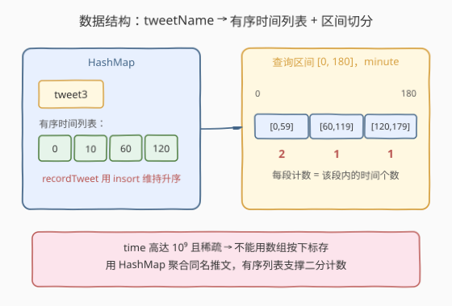
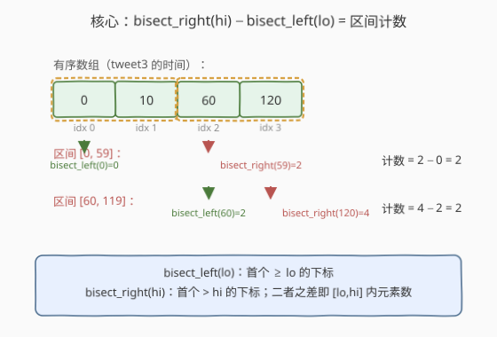
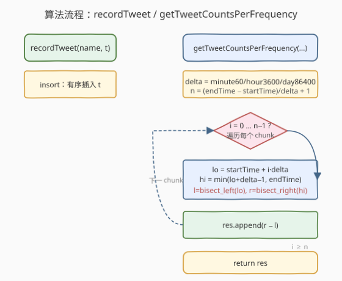

# 推文计数

- **题目名称**：推文计数
- **链接**：[1348. 推文计数](https://leetcode.cn/problems/tweet-counts-per-frequency/)
- **难度**：中等
- **标签**：设计、哈希表、二分查找

## 1. 题目概述

社交媒体公司希望按「分钟 / 小时 / 天」的频率统计某条推文在指定时间段内的出现次数。把查询区间 `[startTime, endTime]` 按给定频率 `freq` 切成若干等长时间块，最后一块可能更短但一定以 `endTime` 结尾。返回每块的计数列表。

- `TweetCounts()`：初始化。
- `void recordTweet(String tweetName, int time)`：在 `time`（秒）记录一条名为 `tweetName` 的推文。
- `List<Integer> getTweetCountsPerFrequency(String freq, String tweetName, int startTime, int endTime)`：返回 `[startTime, endTime]` 内按 `freq` 切分后每块的推文数。`freq` 为 `"minute"`(60)、`"hour"`(3600)、`"day"`(86400) 之一。

例如 `[10, 10000]`：按 minute 切成 `[10,69]`、`[70,129]`、…、`[9970,10000]`；按 hour 切成 `[10,3609]`、`[3610,7209]`、`[7210,10000]`；按 day 切成 `[10,10000]`。

**示例**：

```text
输入：
["TweetCounts","recordTweet","recordTweet","recordTweet","getTweetCountsPerFrequency","getTweetCountsPerFrequency","recordTweet","getTweetCountsPerFrequency"]
[[],["tweet3",0],["tweet3",60],["tweet3",10],["minute","tweet3",0,59],["minute","tweet3",0,60],["tweet3",120],["hour","tweet3",0,210]]
输出：[null,null,null,null,[2],[2,1],null,[4]]

解释：
recordTweet("tweet3",0)   → tweet3 = [0]
recordTweet("tweet3",60)  → tweet3 = [0,60]
recordTweet("tweet3",10)  → tweet3 = [0,60,10]   ← 时间并非递增录入
getTweetCountsPerFrequency("minute","tweet3",0,59)  → [2]   块[0,59] 有 0、10 共 2 条
getTweetCountsPerFrequency("minute","tweet3",0,60)  → [2,1] 块[0,59] 有 2 条，块[60,60] 有 1 条
recordTweet("tweet3",120) → tweet3 = [0,60,10,120]
getTweetCountsPerFrequency("hour","tweet3",0,210)   → [4]   块[0,210] 有 4 条
```

**约束条件**：

- `0 <= time, startTime, endTime <= 10^9`
- `0 <= endTime - startTime <= 10^4`
- 对 `recordTweet` 与 `getTweetCountsPerFrequency` 的**总调用次数不超过 10^4**。

> 💡 **两个关键前提**：① `time` 高达 `10^9` 且稀疏，**不能**用数组按下标存；② 录入顺序**不保证递增**（示例里 0、60、10 乱序），所以不能像 [981](../0901-1000/981_基于时间的键值存储.md) 那样直接 `append` 就有序。

---

## 2. 解题思路

### 2.1 暴力思路

用 `HashMap<tweetName, List<time>>` 存所有录入。`recordTweet` 直接 `append`，`O(1)`；`getTweetCountsPerFrequency` 对每个时间块线性扫描该列表，数落在 `[lo, hi]` 内的个数，`O(k·m)`（`k` 为块数，`m` 为该推文记录数）。

最坏 `m` 可达 `10^4`、`k` 可达约 `167`（minute 下 `10^4/60`），单次查询约 `1.6×10^6`，总调用 `10^4` 量级下可能 `10^{10}`，超时。需要把「数区间内元素个数」降到 `O(log m)`。

### 2.2 核心观察：HashMap + 有序列表 + 二分计数



把同名推文的时间聚到一个列表里并**保持有序**，则「`[lo, hi]` 内有多少个时间」可用二分一次性求出：

- **`recordTweet`**：用 `insort`（二分定位 + 插入）把 `time` 插入有序位置，维持升序。
- **`getTweetCountsPerFrequency`**：对每个块 `[lo, hi]`，分别二分找 `lo` 的左界与 `hi` 的右界，二者之差即区间内元素数。

> 💡 **为什么不用 `map<time, count>`（红黑树）？** `vector` 连续存储，`upper_bound - lower_bound` 的差就是计数，`O(1)` 得答案；红黑树求区间元素数要么 `O(区间元素数)` 遍历、要么额外维护子树大小（`pbds` 的 `tree`），常数更大。本题 `m ≤ 10^4`，`insort` 的 `O(m)` 移动完全可以接受。

### 2.3 二分计数细节：bisect_right(hi) − bisect_left(lo)



对有序数组 `v`，区间 `[lo, hi]` 内元素个数 = **首个 `> hi` 的下标** 减 **首个 `≥ lo` 的下标**：

| 二分 | 语义 | Python | C++ |
|------|------|--------|-----|
| 左界 | 首个 `≥ lo` 的下标 | `bisect_left(v, lo)` | `lower_bound(v, lo) - v.begin()` |
| 右界 | 首个 `> hi` 的下标 | `bisect_right(v, hi)` | `upper_bound(v, hi) - v.begin()` |

$$\text{count} = \text{bisect\_right}(hi) - \text{bisect\_left}(lo)$$

> ⚠️ **用 `bisect_right` 而非 `bisect_left` 取右界**：`hi` 本身可能恰在数组里（如 `hi=60` 且 `v` 含 `60`），必须把它计入，故取「首个 `> hi`」而非「首个 `≥ hi`」。若误用 `bisect_left(hi)` 会漏掉等于 `hi` 的元素。

### 2.4 算法流程图



### 2.5 示例演算

以示例中 `tweet3` 最终的有序列表 `v = [0, 10, 60, 120]` 为例：

| 查询 | delta | 块 | `bisect_left(lo)` | `bisect_right(hi)` | 计数 |
|------|-------|----|-------------------|--------------------|------|
| minute, 0..59 | 60 | `[0,59]` | `left(0)=0` | `right(59)=2` | `2−0=2` |
| minute, 0..60 | 60 | `[0,59]` | `0` | `2` | `2` |
| | | `[60,60]` | `left(60)=2` | `right(60)=3` | `3−2=1` |
| hour, 0..210 | 3600 | `[0,210]` | `left(0)=0` | `right(210)=4` | `4−0=4` |

块数 `n = (endTime - startTime) / delta + 1`（整除），最后一块 `hi = min(lo+delta-1, endTime)`。

---

## 3. 参考代码

### C++

```cpp
class TweetCounts {
    unordered_map<string, vector<int>> mp;  // tweetName -> 有序时间列表

  public:
    void recordTweet(string tweetName, int time) {
        auto& v = mp[tweetName];
        v.insert(lower_bound(v.begin(), v.end(), time), time);  // insort 维持升序
    }

    vector<int> getTweetCountsPerFrequency(string freq, string tweetName,
                                           int startTime, int endTime) {
        int delta = (freq == "minute") ? 60 : (freq == "hour") ? 3600 : 86400;
        int n = (endTime - startTime) / delta + 1;  // 块数（endTime-startTime ≤ 1e4，安全）

        vector<int> res;
        auto it = mp.find(tweetName);
        if (it == mp.end()) return vector<int>(n, 0);  // 从未录入，全 0

        const auto& v = it->second;
        for (int i = 0; i < n; i++) {
            int lo = startTime + i * delta;
            int hi = min(lo + delta - 1, endTime);
            int l = lower_bound(v.begin(), v.end(), lo) - v.begin();
            int r = upper_bound(v.begin(), v.end(), hi) - v.begin();
            res.push_back(r - l);  // O(1) 随机访问求差
        }
        return res;
    }
};
```

### Python

```python
from bisect import insort, bisect_left, bisect_right
from collections import defaultdict


class TweetCounts:
    def __init__(self):
        self.data = defaultdict(list)  # tweetName -> 有序时间列表

    def recordTweet(self, tweetName: str, time: int) -> None:
        insort(self.data[tweetName], time)  # 二分定位 + 插入，维持升序

    def getTweetCountsPerFrequency(self, freq: str, tweetName: str,
                                   startTime: int, endTime: int) -> list[int]:
        delta = {"minute": 60, "hour": 3600, "day": 86400}[freq]
        times = self.data.get(tweetName, ())  # 缺省空元组，二分返回 0
        res = []
        lo = startTime
        while lo <= endTime:
            hi = min(lo + delta - 1, endTime)
            cnt = bisect_right(times, hi) - bisect_left(times, lo)
            res.append(cnt)
            lo += delta
        return res
```

> 💡 Python 的 `bisect.insort` 内部用 C 层 `memmove` 搬移元素，`O(m)` 的常数极小，`m ≤ 10^4` 时单次插入微秒级。C++ 的 `vector::insert` 同理。两语言实现完全平行，差别仅在标准库命名。

---

## 4. 复杂度分析

| 维度 | 复杂度 | 说明 |
|------|--------|------|
| `recordTweet` 时间 | $O(m)$ | `insort` 二分 $O(\log m)$ 定位 + $O(m)$ 后移；`m` 为该推文已有记录数 |
| `getTweetCountsPerFrequency` 时间 | $O(k \log m)$ | `k` 为块数，每块两次二分；`k = \lceil 10^4 / \delta \rceil \le 167` |
| 总时间 | $O(\sum m_i \cdot 1 + Q \cdot k\log m)$ | $\sum m_i \le 10^4$ 为总录入数，`Q` 为查询数 |
| 空间 | $O(\sum m_i)$ | 存下所有录入的时间戳 |

其中 $m \le 10^4$、$\sum m_i \le 10^4$，`insort` 累计移动量 $\le \sum_{i=1}^{10^4} i \approx 5\times10^7$，C/C++ 层搬移完全在时限内；单次查询最多 $167 \cdot 14 \approx 2338$ 次比较。

---

## 5. 扩展：时间无序时维持有序的三种方案

题目不保证 `recordTweet` 的时间递增，所以不能像 [981](../0901-1000/981_基于时间的键值存储.md) 直接 `append`。维持有序有三种思路：

- **方案 A（本题采用，insort）**：录入时二分定位 + 插入，列表恒有序；查询纯二分 `O(k\log m)`。录入 `O(m)`，适合「写少读多」或 `m` 不大的场景（本题 `m ≤ 10^4` 完美匹配）。
- **方案 B（懒排序 + 脏标记）**：录入 `O(1)` `append` 并置 `dirty=True`；查询时若 `dirty` 则 `sort` 一次再二分。查询均摊 `O(m\log m + k\log m)`，适合「先批量写后批量读」。
- **方案 C（平衡树）**：C++ `map<int,int>`（`time→count`）或 Python `sortedcontainers.SortedList`，录入与查询均 `O(\log m)`，在线交错场景最稳，但常数大、依赖非标准库（Python）。

> 💡 选择依据是**写读比例与 `m` 量级**：`m` 小选 A 最简；写远多于读选 B；`m` 极大且写读交错选 C。本题约束 `m ≤ 10^4`，A 的累计搬移量可控，且查询 `O(1)` 计数最优雅，故为最优选。

---

## 6. 面试要点

1. **为什么用 HashMap + 有序列表，而不是按时间下标开数组？**
   - `time` 高达 `10^9` 且稀疏，按值域开数组空间爆炸；HashMap 只存实际录入，列表连续存储又支撑 `O(1)` 随机访问的二分。

2. **区间计数为什么是 `bisect_right(hi) − bisect_left(lo)`？**
   - `bisect_left(lo)` 给首个 `≥ lo` 的位置，`bisect_right(hi)` 给首个 `> hi` 的位置，二者夹出的左闭右开段恰好是 `[lo, hi]` 内所有元素。`hi` 等于某元素时必须用 `right` 才不漏。

3. **和 981「基于时间的键值存储」有何异同？**
   - 同：都是 HashMap + 有序列表 + 二分。异：981 时间戳**严格递增**可直接 `append`，查询找「单点右界」取值；1348 时间**乱序**需 `insort` 维持有序，查询求「区间计数」，从 `right−1` 升级为 `right−left`。

4. **`endTime − startTime ≤ 10^4` 这个约束怎么用？**
   - 它保证块数 `k = ⌈(endTime−startTime)/δ⌉ ≤ 167`，单次查询的二分次数有上限；也保证 `n = (endTime−startTime)/delta + 1` 与 `lo+delta−1` 不溢出 `int`。

5. **`insort` 的 `O(m)` 录入会不会超时？**
   - 总录入 ≤ `10^4`，累计元素搬移 ≤ `5×10^7`，且 `memmove` 在 C 层常数极小，远低于时限。若 `m` 大到 `10^5` 以上且写读交错，才需换平衡树（方案 C）。

---

## 7. 同类练习题

- [981. 基于时间的键值存储](https://leetcode.cn/problems/time-based-key-value-store/)（[题解](../0901-1000/981_基于时间的键值存储.md)）：承接题，同为 HashMap + 有序列表 + 二分；从「单点找右界取值」升级为「区间左右界求计数」
- [2080. 区间内查询数字的频率](https://leetcode.cn/problems/range-frequency-queries/)：同为「设计 + 区间频次查询」，把 `tweetName` 换成任意数字，套路几乎一致
- [34. 在排序数组中查找元素的第一个和最后一个位置](https://leetcode.cn/problems/find-first-and-last-position-of-element-in-sorted-array/)：`bisect_left` / `bisect_right` 双边界标准练习，与本题计数同构
- [35. 搜索插入位置](https://leetcode.cn/problems/search-insert-position/)：`lower_bound` 语义对照，对比本题的 `upper_bound` 取右界
- [1146. 快照数组](https://leetcode.cn/problems/snapshot-array/)：设计 + 按版本号二分取值，姊妹题，巩固「有序 + 二分」设计范式
