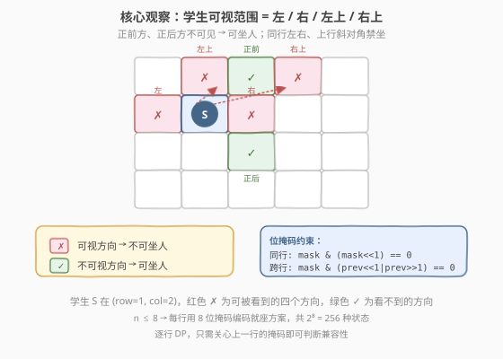
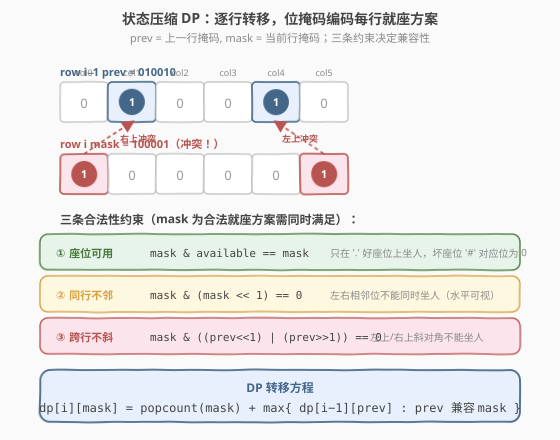
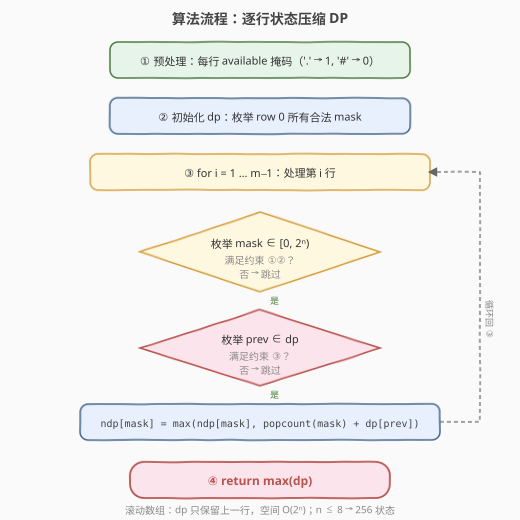
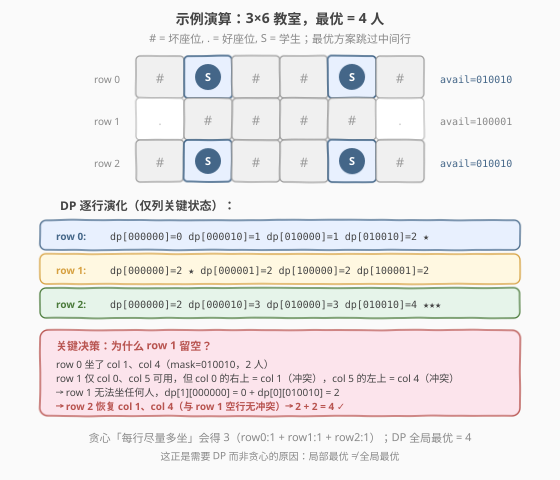

# LeetCode 参加考试的最大学生数 题解

## 1. 题目概述

- **标题 / 题号**：参加考试的最大学生数（#1349，hard）
- **链接**：https://leetcode.cn/problems/maximum-students-taking-exam/
- **难度**：困难
- **标签**：位运算、动态规划、状态压缩、位掩码

**题意**：给定一个 $m \times n$ 的矩阵 `seats` 表示教室座位分布：

- `'.'` 表示座位状况良好（可用）；
- `'#'` 表示座位坏了（不可用）。

学生可以看到**左侧、右侧、左上、右上**这四个方向上**紧邻**他的学生的答卷，但**看不到**直接坐在他前面或者后面的学生的答卷。请计算该考场可以容纳的同时参加考试且**无法作弊**的最大学生人数。学生必须坐在状况良好的座位上。

**示例 1**：

```text
输入：seats = [["#",".","#","#",".","#"],
              [".","#","#","#","#","."],
              ["#",".","#","#",".","#"]]
输出：4
解释：教师可以让 4 个学生坐在可用的座位上，这样他们就无法在考试中作弊。
```

**示例 2**：

```text
输入：seats = [[".","#"],
              ["#","#"],
              ["#","."],
              ["#","#"],
              [".","#"]]
输出：3
解释：让所有学生坐在可用的座位上。
```

**示例 3**：

```text
输入：seats = [["#",".",".",".","#"],
              [".","#",".","#","."],
              [".",".","#",".","."],
              [".","#",".","#","."],
              ["#",".",".",".","#"]]
输出：10
解释：让学生坐在第 1、3 和 5 列的可用座位上。
```

**约束**：

- `seats` 只包含字符 `'.'` 和 `'#'`
- $m = \text{seats.length}$
- $n = \text{seats[i].length}$
- $1 \le m \le 8$
- $1 \le n \le 8$

> 💡 **关键信号**：$m, n \le 8$——行列均不超过 8，意味着每行的就座方案可以用一个 8 位掩码编码（至多 $2^8 = 256$ 种状态），这是**状态压缩 DP** 的经典甜区。题目本质是在网格图上求带约束的最大独立集，一般图上该问题是 NP 困难的，但列宽 $\le 8$ 的窄网格可以用逐行位掩码 DP 在 $O(m \cdot 4^n)$ 内精确求解。

## 2. 解题思路

### 2.1 暴力思路：枚举所有就座方案

最朴素的做法是枚举所有可能的就座方案：每个好座位「坐/不坐」两种选择，共 $2^{m \times n}$ 种组合。对每种组合检查是否满足不作弊约束（任意两个学生不在彼此的可视方向上），取合法方案中学生数的最大值。

问题是 $m \times n$ 最多 $64$，$2^{64} \approx 1.8 \times 10^{19}$——完全不可行。即使按行枚举，若不做状态压缩，逐行组合的搜索空间同样爆炸。

> ⚠️ 约束 $n \le 8$ 是突破口：把「每行谁坐了」压缩成一个 $n$ 位整数，逐行 DP 时只需关心上一行的掩码，状态数从 $2^{m \times n}$ 降为 $m \times 2^n$。

### 2.2 核心观察：状态压缩 DP + 位掩码约束



**观察一：可视方向决定约束结构**

一个坐在 $(r, c)$ 的学生能看到四个方向的紧邻学生：

| 方向 | 位置 | 含义 |
|------|------|------|
| 左 | $(r, c-1)$ | 同行左侧 |
| 右 | $(r, c+1)$ | 同行右侧 |
| 左上 | $(r-1, c-1)$ | 上一行左斜对角 |
| 右上 | $(r-1, c+1)$ | 上一行右斜对角 |

而**正前方** $(r-1, c)$ 和**正后方** $(r+1, c)$ 不可见——这意味着前后排同一列的学生不会互相抄袭。约束仅涉及**同行**与**相邻上一行**，因此 DP 转移只需依赖上一行的掩码。

**观察二：三条约束全部用位运算表达**

设当前行掩码为 `mask`（bit $j$ = 1 表示列 $j$ 坐了学生），上一行掩码为 `prev`，当前行可用座位掩码为 `avail`：

| 约束 | 位运算表达 | 含义 |
|------|-----------|------|
| ① 座位可用 | `mask & avail == mask` | 只在 `'.'` 好座位上坐人 |
| ② 同行不邻 | `mask & (mask << 1) == 0` | 左右相邻位不能同时有人（水平可视） |
| ③ 跨行不斜 | `mask & ((prev<<1) \| (prev>>1)) == 0` | 上一行左斜、右斜对角不能有人 |

> 💡 **约束 ③ 推导**：`prev << 1` 将 `prev` 的 bit $j$ 移到 $j+1$，若 `mask` 的 $j+1$ 位也为 1，说明 $(i, j+1)$ 与 $(i-1, j)$ 同时有人——前者左上是后者，冲突。`prev >> 1` 同理检测右斜对角。两者取或即为完整的斜对角冲突检测。

**观察三：DP 状态定义与转移**



- **状态**：`dp[mask]` = 处理完当前行后，当前行就座方案为 `mask` 时的最大累计学生数
- **初始化**（第 0 行）：对每个满足约束 ①② 的合法 `mask`，`dp[mask] = popcount(mask)`
- **转移**（第 $i$ 行，$i \ge 1$）：

$$dp[i][\text{mask}] = \text{popcount}(\text{mask}) + \max_{\text{prev 兼容 mask}} dp[i-1][\text{prev}]$$

其中「兼容」指满足约束 ③。

- **答案**：处理完所有行后，$\max(\text{dp})$。

> ⚠️ **为什么不能贪心？** 直觉上「每行尽量多坐」似乎最优，但示例 1 给出反例：第 0 行坐 2 人（col 1, 4）后，第 1 行的好座位（col 0, 5）全部因斜对角冲突无法坐人；若第 0 行只坐 1 人，第 1 行虽能坐 1 人，但第 2 行也受牵连只能坐 1 人——总计 3 人，反而不如「第 0、2 行各坐 2 人、第 1 行留空」的 4 人方案。局部最优 $\ne$ 全局最优，必须用 DP 穷举所有行的组合。

### 2.3 算法流程图



**完整步骤**：

1. **预处理**：遍历每行，构建 `avail[i]`（`'.'` 对应位设 1）。
2. **初始化**：枚举第 0 行所有 $2^n$ 个 `mask`，满足约束 ①② 则 `dp[mask] = popcount(mask)`，否则标记 $-1$（非法）。
3. **逐行转移**（$i = 1 \dots m-1$）：
   - 创建新数组 `ndp`（全 $-1$）。
   - 枚举当前行每个 `mask`：先过约束 ①②，不合法则跳过。
   - 枚举上一行每个 `prev`：`dp[prev] < 0` 则跳过；过约束 ③，冲突则跳过。
   - `ndp[mask] = max(ndp[mask], popcount(mask) + dp[prev])`。
   - `dp = ndp`（滚动数组，只保留上一行）。
4. **返回** $\max(\text{dp})$。

> 💡 **滚动数组**：由于转移只依赖上一行，用两个一维数组 `dp` / `ndp` 交替即可，空间从 $O(m \cdot 2^n)$ 降到 $O(2^n)$。$n \le 8$ 时仅 256 个整数。

### 2.4 示例演算

以示例 1 `seats = [["#",".","#","#",".","#"], [".","#","#","#","#","."], ["#",".","#","#",".","#"]]` 为例（$m=3, n=6$）：



**预处理可用掩码**（bit $j$ 对应 col $j$，从左到右）：

| 行 | 座位 | avail（二进制） | avail（十进制） |
|----|------|-----------------|-----------------|
| 0 | `# . # # . #` | `010010` | 18 |
| 1 | `. # # # # .` | `100001` | 33 |
| 2 | `# . # # . #` | `010010` | 18 |

**第 0 行 DP**（合法 mask = avail 18 的子集且无相邻位）：

| mask（二进制） | mask（十进制） | popcount | 说明 |
|----------------|----------------|----------|------|
| `000000` | 0 | 0 | 空行 |
| `000010` | 2 | 1 | 仅 col 1 |
| `010000` | 16 | 1 | 仅 col 4 |
| `010010` | 18 | 2 | col 1 + col 4（不相邻 ✓） |

最优：`dp[18] = 2`（坐满 row 0 的好座位）。

**第 1 行 DP**（avail = 33，好座位 col 0, 5）：

| mask | popcount | 兼容的 prev | dp 值 |
|------|----------|-------------|-------|
| `000000` | 0 | 全部 | 0 + max(0,1,1,2) = **2** |
| `000001`（col 0） | 1 | prev 无 col 1 → {0, 16} | 1 + max(0,1) = **2** |
| `100000`（col 5） | 1 | prev 无 col 4 → {0, 2} | 1 + max(0,1) = **2** |
| `100001`（col 0,5） | 2 | prev 无 col 1,4 → {0} | 2 + 0 = **2** |

> ⚠️ **关键现象**：row 0 坐满 col 1,4（mask=18）后，row 1 的 col 0 右上指向 col 1（冲突），col 5 左上指向 col 4（冲突）——row 1 无法坐任何人。所有 mask 的 dp 值都是 2，最优方案是 row 1 **留空**（mask=0），继承 row 0 的 2 人。

**第 2 行 DP**（avail = 18，好座位 col 1, 4）：

| mask | popcount | 兼容的 prev（row 1） | dp 值 |
|------|----------|----------------------|-------|
| `000000` | 0 | 全部 | 0 + 2 = 2 |
| `000010`（col 1） | 1 | prev 无 col 0,2 → {0, 32} | 1 + max(2,2) = **3** |
| `010000`（col 4） | 1 | prev 无 col 3,5 → {0, 1} | 1 + max(2,2) = **3** |
| `010010`（col 1,4） | 2 | prev 无 col 0,2,3,5 → {0} | 2 + 2 = **4** ✓ |

最优路径：`row 0 (mask=18, 2人) → row 1 (mask=0, 0人) → row 2 (mask=18, 2人)`，总计 **4 人**。

> 💡 **贪心对照**：若每行尽量多坐，row 0 坐 1 人（让 row 1 也能坐），得到 row 0:1 + row 1:1 + row 2:1 = 3 人，比 DP 的 4 人少 1 人。这就是必须用 DP 而非贪心的根本原因。

## 3. 参考代码

### C++

```cpp
// 参加考试的最大学生数.cpp —— 状态压缩 DP + 位掩码约束
// 编译: g++ -O2 -std=c++17 参加考试的最大学生数.cpp -o mse
class Solution {
public:
    int maxStudents(vector<vector<char>>& seats) {
        int m = seats.size(), n = seats[0].size();
        vector<int> avail(m, 0);
        for (int i = 0; i < m; ++i)
            for (int j = 0; j < n; ++j)
                if (seats[i][j] == '.')
                    avail[i] |= (1 << j);

        vector<int> dp(1 << n, -1);
        // 第 0 行：只需满足约束 ①②
        for (int mask = 0; mask < (1 << n); ++mask) {
            if ((mask & avail[0]) != mask) continue;   // ① 只坐好座位
            if (mask & (mask << 1))       continue;    // ② 同行不邻
            dp[mask] = __builtin_popcount(mask);
        }

        // 第 1 ~ m-1 行：逐行转移
        for (int i = 1; i < m; ++i) {
            vector<int> ndp(1 << n, -1);
            for (int mask = 0; mask < (1 << n); ++mask) {
                if ((mask & avail[i]) != mask) continue;
                if (mask & (mask << 1))       continue;
                int cnt = __builtin_popcount(mask);
                for (int prev = 0; prev < (1 << n); ++prev) {
                    if (dp[prev] < 0) continue;
                    if (mask & (prev << 1)) continue;   // ③ 左上斜对角
                    if (mask & (prev >> 1)) continue;   // ③ 右上斜对角
                    ndp[mask] = max(ndp[mask], cnt + dp[prev]);
                }
            }
            dp = move(ndp);                              // 滚动数组
        }
        return *max_element(dp.begin(), dp.end());
    }
};
```

### Python

```python
class Solution:
    def maxStudents(self, seats: List[List[str]]) -> int:
        m, n = len(seats), len(seats[0])
        avail = [0] * m
        for i in range(m):
            for j in range(n):
                if seats[i][j] == '.':
                    avail[i] |= (1 << j)

        def popcount(x):
            return bin(x).count('1')

        def ok_row(mask, av):
            # ① 只坐好座位  ② 同行不相邻
            return (mask & av == mask) and (mask & (mask << 1) == 0)

        dp = [-1] * (1 << n)
        for mask in range(1 << n):                  # 第 0 行
            if ok_row(mask, avail[0]):
                dp[mask] = popcount(mask)

        for i in range(1, m):                        # 逐行转移
            ndp = [-1] * (1 << n)
            for mask in range(1 << n):
                if not ok_row(mask, avail[i]):
                    continue
                cnt = popcount(mask)
                for prev in range(1 << n):
                    if dp[prev] < 0:
                        continue
                    if mask & (prev << 1):          # ③ 左上
                        continue
                    if mask & (prev >> 1):          # ③ 右上
                        continue
                    ndp[mask] = max(ndp[mask], cnt + dp[prev])
            dp = ndp                                 # 滚动数组

        return max(dp)
```

> 💡 **实现细节**：① 用 $-1$ 标记非法状态，转移时 `dp[prev] < 0` 直接跳过，避免非法掩码污染结果。② `__builtin_popcount` / `bin(x).count('1')` 计算 1 的个数即该行学生数。③ 约束 ③ 拆成 `prev << 1` 和 `prev >> 1` 两次检测，逻辑等价于 `(prev << 1) | (prev >> 1)` 一次检测，拆开可读性更好。④ 滚动数组 `dp = move(ndp)` / `dp = ndp` 在每行结束后丢弃旧数据，空间 $O(2^n)$。

## 4. 复杂度分析

| 维度 | 状态压缩 DP（推荐） | 暴力枚举 |
|------|---------------------|----------|
| **时间** | $O(m \cdot 4^n)$ | $O(2^{m \times n} \cdot m \cdot n)$ |
| **空间** | $O(2^n)$ | $O(m \times n)$ |
| **说明** | 每行枚举 $2^n$ 个 mask，每个 mask 与 $2^n$ 个 prev 配对检测；$m \times 4^n = 8 \times 65536 \approx 5 \times 10^5$ | 枚举所有就座方案，$2^{64}$ 不可行 |

> ⚠️ **进一步优化**：约束 ①② 只与 `mask` 本身和 `avail[i]` 有关，可预处理每行的合法 mask 列表。$n$ 位无相邻 1 的掩码数为 Fibonacci 数 $F(n+2)$——$n = 8$ 时仅 $F(10) = 55$ 个。于是内层循环从 $2^n \times 2^n$ 降为 $V \times V$（$V \le 55$），总计 $m \times V^2 \le 8 \times 55^2 \approx 2.4 \times 10^4$，常数更小（见第 5 节扩展）。

## 5. 扩展：预计算合法掩码表

约束 ①② 不随行变化（取决于 `avail[i]`），可以为每行预先生成合法 mask 列表，避免在内层循环中反复做位运算判断：

```cpp
// 预计算每行的合法 mask 列表
vector<vector<int>> validMasks(m);
for (int i = 0; i < m; ++i) {
    for (int mask = 0; mask < (1 << n); ++mask) {
        if ((mask & avail[i]) != mask) continue;
        if (mask & (mask << 1))       continue;
        validMasks[i].push_back(mask);
    }
}
// 转移时只遍历 validMasks[i] 和 validMasks[i-1]
for (int mask : validMasks[i]) {
    int cnt = __builtin_popcount(mask);
    for (int prev : validMasks[i - 1]) {
        if (dp[prev] < 0) continue;
        if (mask & (prev << 1)) continue;
        if (mask & (prev >> 1)) continue;
        ndp[mask] = max(ndp[mask], cnt + dp[prev]);
    }
}
```

> 💡 **无相邻 1 的掩码数 = Fibonacci 数**：设 $a(n)$ 为 $n$ 位无相邻 1 的二进制数个数。考虑最高位：为 0 则剩 $n-1$ 位自由（$a(n-1)$ 种）；为 1 则次高位必为 0，剩 $n-2$ 位自由（$a(n-2)$ 种）。故 $a(n) = a(n-1) + a(n-2)$，$a(1)=2, a(2)=3$，即 $a(n) = F(n+2)$。$n = 8$ 时 $a(8) = F(10) = 55$，远小于 $2^8 = 256$。这是所有「逐行位掩码 + 无相邻约束」类题的通用加速手段。

## 6. 面试要点

1. **怎么识别这道题用状态压缩 DP？**

   > 关键信号是 $m, n \le 8$——行列都不超过 8，每行的就座方案可以编码为一个 8 位整数（至多 256 种状态）。加上约束只涉及同行和上一行（左/右/左上/右上），DP 转移只依赖上一行掩码，天然适合逐行状态压缩。

2. **三条约束怎么用位运算表达？**

   > ① `mask & avail == mask`：只在好座位上坐人。② `mask & (mask << 1) == 0`：同行无相邻（左/右可视）。③ `mask & ((prev << 1) | (prev >> 1)) == 0`：跨行无斜对角（左上/右上可视）。`prev << 1` 把 prev 的 bit $j$ 移到 $j+1$，检测当前行 $j+1$ 与上一行 $j$ 是否冲突（左上方向）；`prev >> 1` 同理检测右上方向。

3. **为什么不能用贪心？**

   > 示例 1 就是反例：第 0 行坐满 2 人后，第 1 行的好座位全因斜对角冲突无法坐人。若让第 0 行少坐 1 人来「让路」，第 1 行虽能坐 1 人，但第 2 行也受牵连，总计 3 人。而「第 0、2 行各坐 2 人、第 1 行留空」得 4 人更优。局部最优不等于全局最优，必须用 DP 穷举跨行组合。

4. **滚动数组怎么实现？为什么只需要上一行？**

   > 约束 ③ 只检测当前行与上一行的斜对角，不涉及更远的行。因此 `dp[i][mask]` 只依赖 `dp[i-1][prev]`，用两个一维数组 `dp` / `ndp` 交替即可。每行处理完后 `dp = ndp` 丢弃旧数据，空间从 $O(m \cdot 2^n)$ 降到 $O(2^n)$。这是所有「逐行状态压缩 DP」的通用骨架。

5. **时间复杂度能否进一步优化？**

   > 可以预计算每行的合法 mask 列表（满足约束 ①②），$n$ 位无相邻 1 的掩码数为 Fibonacci 数 $F(n+2)$——$n = 8$ 时仅 55 个。内层循环从 $2^n \times 2^n = 65536$ 降为 $55 \times 55 \approx 3025$，总计约 $2.4 \times 10^4$ 次操作。但即使不做此优化，$5 \times 10^5$ 也完全在时限内，预计算主要是常数优化。

> 💡 **一句话总结**：1349 的灵魂是「**窄网格 + 约束局部性 → 逐行位掩码 DP**」——$n \le 8$ 允许每行编码为 8 位整数，可视约束仅涉及同行与上一行使得 DP 只需一维滚动，三条约束全部化为位运算实现 $O(1)$ 检测。这个「逐行状态压缩 + 位掩码兼容性检测」的范式是所有网格排列/着色/独立集类题的通用武器。

## 同类练习题

| # | 题目 | 与本题的关联 |
|---|------|-------------|
| 526 | [优美的排列](https://leetcode.cn/problems/beautiful-arrangement/)（[题解](../0501-0600/526_优美的排列.md)） | 状态压缩 DP 招牌题，bitmask 记已用元素集合，$n \le 15$ 甜区，对照 1349 的「行掩码」改为「元素使用掩码」 |
| 1125 | [最小的必要团队](https://leetcode.cn/problems/smallest-sufficient-team/)（[题解](../1101-1200/1125_最小的必要团队.md)） | 状态压缩 DP 求最小覆盖，bitmask 编码技能需求集合，与 1349 同为「小范围 + 位掩码状态」范式但目标从最大独立集变为最小覆盖 |
| 1494 | [并行课程 II](https://leetcode.cn/problems/parallel-courses-ii/) | 状态压缩 DP 求最少学期数，bitmask 编码已修课程集合，约束为前置依赖，与 1349 同属「位掩码 + 逐层/逐行转移」家族 |
| 1655 | [分配重复整数](https://leetcode.cn/problems/distribute-repeating-integers/) | 状态压缩 DP 判定能否分配，bitmask 编码顾客子集，$n \le 50$ 的顾客用 $2^{50}$ 不行但实际用子集枚举优化，对照 1349 的「逐行转移」改为「子集转移」 |
| 187 | [重复的 DNA 序列](https://leetcode.cn/problems/repeated-dna-sequences/)（[题解](../0101-0200/187_重复的DNA序列.md)） | 2 位编码 + 滚动哈希，位掩码编码字符串状态，对照 1349 的「位掩码编码空间状态」，同一思想在不同场景的应用 |
